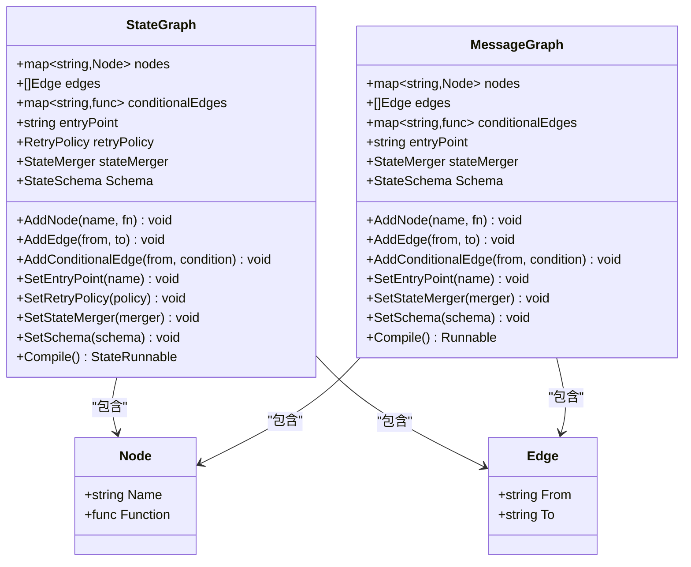

# langgraphgo API 参考文档

<cite>
**本文档中引用的文件**
- [graph/messages_graph.go](file://graph/messages_graph.go)
- [graph/state_graph.go](file://graph/state_graph.go)
- [graph/graph.go](file://graph/graph.go)
- [graph/schema.go](file://graph/schema.go)
- [graph/context.go](file://graph/context.go)
- [graph/checkpointing.go](file://graph/checkpointing.go)
- [graph/streaming.go](file://graph/streaming.go)
- [prebuilt/create_agent.go](file://prebuilt/create_agent.go)
- [prebuilt/react_agent.go](file://prebuilt/react_agent.go)
- [prebuilt/supervisor.go](file://prebuilt/supervisor.go)
- [prebuilt/rag.go](file://prebuilt/rag.go)
- [prebuilt/tool_executor.go](file://prebuilt/tool_executor.go)
- [tool/exa.go](file://tool/exa.go)
- [tool/tavily.go](file://tool/tavily.go)
</cite>

## 目录
1. [简介](#简介)
2. [核心图类型](#核心图类型)
3. [状态图 API](#状态图-api)
4. [消息图 API](#消息图-api)
5. [预构建组件](#预构建组件)
6. [检查点系统](#检查点系统)
7. [流式处理](#流式处理)
8. [工具集成](#工具集成)
9. [状态模式与架构](#状态模式与架构)
10. [配置与上下文](#配置与上下文)

## 简介

langgraphgo 是一个强大的 Go 语言库，用于构建基于图的 AI 应用程序。它提供了灵活的状态管理、并发执行、检查点持久化和流式处理功能。本文档详细介绍了所有公共 API 接口。

## 核心图类型

### 图的基本概念

langgraphgo 提供两种主要的图类型：**状态图**（StateGraph）和**消息图**（MessageGraph）。这两种图都支持并行执行、条件边和中断机制。



**图表来源**
- [graph/state_graph.go](file://graph/state_graph.go#L11-L32)
- [graph/graph.go](file://graph/graph.go#L52-L60)

## 状态图 API

### StateGraph 构造函数

#### NewStateGraph()
创建一个新的状态图实例。

**签名**: `func NewStateGraph() *StateGraph`

**返回值**: 新的状态图实例

**使用示例**: 
```go
workflow := graph.NewStateGraph()
```

#### NewMessagesStateGraph()
创建一个带有默认消息模式的状态图，推荐用于基于聊天的代理。

**签名**: `func NewMessagesStateGraph() *StateGraph`

**返回值**: 配置好的状态图实例

**使用示例**:
```go
workflow := graph.NewMessagesStateGraph()
```

### 核心方法

#### AddNode(name string, fn func) void
向状态图添加新节点。

**参数**:
- `name`: 节点名称，必须唯一
- `fn`: 节点函数，接收上下文和状态，返回更新后的状态和错误

**签名**: `func (g *StateGraph) AddNode(name string, fn func(ctx context.Context, state interface{}) (interface{}, error))`

**使用示例**:
```go
workflow.AddNode("agent", func(ctx context.Context, state interface{}) (interface{}, error) {
    // 处理逻辑
    return newState, nil
})
```

#### AddEdge(from string, to string) void
添加静态边连接两个节点。

**参数**:
- `from`: 源节点名称
- `to`: 目标节点名称

**签名**: `func (g *StateGraph) AddEdge(from, to string)`

**使用示例**:
```go
workflow.AddEdge("agent", "tools")
```

#### AddConditionalEdge(from string, condition func) void
添加条件边，在运行时根据条件决定目标节点。

**参数**:
- `from`: 源节点名称
- `condition`: 条件函数，接收上下文和状态，返回下一个节点名称

**签名**: `func (g *StateGraph) AddConditionalEdge(from string, condition func(ctx context.Context, state interface{}) string)`

**使用示例**:
```go
workflow.AddConditionalEdge("agent", func(ctx context.Context, state interface{}) string {
    // 基于状态判断下一个节点
    return "tools"
})
```

#### SetEntryPoint(name string) void
设置入口节点。

**参数**:
- `name`: 入口节点名称

**签名**: `func (g *StateGraph) SetEntryPoint(name string)`

**使用示例**:
```go
workflow.SetEntryPoint("agent")
```

#### SetRetryPolicy(policy *RetryPolicy) void
设置重试策略。

**参数**:
- `policy`: 重试策略配置

**签名**: `func (g *StateGraph) SetRetryPolicy(policy *RetryPolicy)`

**使用示例**:
```go
retryPolicy := &graph.RetryPolicy{
    MaxRetries: 3,
    BackoffStrategy: graph.ExponentialBackoff,
    RetryableErrors: []string{"timeout", "network"},
}
workflow.SetRetryPolicy(retryPolicy)
```

#### SetStateMerger(merger StateMerger) void
设置状态合并器。

**参数**:
- `merger`: 状态合并函数

**签名**: `func (g *StateGraph) SetStateMerger(merger StateMerger)`

#### SetSchema(schema StateSchema) void
设置状态模式。

**参数**:
- `schema`: 状态模式接口

**签名**: `func (g *StateGraph) SetSchema(schema StateSchema)`

### 编译与执行

#### Compile() (*StateRunnable, error)
编译状态图并返回可执行实例。

**返回值**:
- `*StateRunnable`: 编译后的可执行图
- `error`: 错误信息（如果入口点未设置）

**签名**: `func (g *StateGraph) Compile() (*StateRunnable, error)`

**使用示例**:
```go
runnable, err := workflow.Compile()
if err != nil {
    log.Fatal(err)
}
```

#### Invoke(ctx context.Context, initialState interface{}) (interface{}, error)
执行编译后的状态图。

**参数**:
- `ctx`: 上下文
- `initialState`: 初始状态

**返回值**:
- `interface{}`: 最终状态
- `error`: 执行错误

**签名**: `func (r *StateRunnable) Invoke(ctx context.Context, initialState interface{}) (interface{}, error)`

#### InvokeWithConfig(ctx context.Context, initialState interface{}, config *Config) (interface{}, error)
带配置执行状态图。

**参数**:
- `ctx`: 上下文
- `initialState`: 初始状态
- `config`: 配置选项

**签名**: `func (r *StateRunnable) InvokeWithConfig(ctx context.Context, initialState interface{}, config *Config) (interface{}, error)`

**图表来源**
- [graph/state_graph.go](file://graph/state_graph.go#L58-L113)

## 消息图 API

### MessageGraph 构造函数

#### NewMessageGraph()
创建新的消息图实例。

**签名**: `func NewMessageGraph() *MessageGraph`

**返回值**: 新的消息图实例

**使用示例**:
```go
workflow := graph.NewMessageGraph()
```

### 核心方法

消息图的方法与状态图基本相同，但主要用于消息传递模式：

```go
// 添加节点
workflow.AddNode("process", processFunction)

// 设置入口
workflow.SetEntryPoint("process")

// 添加边
workflow.AddEdge("process", "END")

// 编译
runnable, err := workflow.Compile()
```

### 编译与执行

#### Compile() (*Runnable, error)
编译消息图。

**返回值**:
- `*Runnable`: 编译后的可执行图
- `error`: 错误信息

**签名**: `func (g *MessageGraph) Compile() (*Runnable, error)`

#### Invoke(ctx context.Context, initialState interface{}) (interface{}, error)
执行消息图。

**签名**: `func (r *Runnable) Invoke(ctx context.Context, initialState interface{}) (interface{}, error)`

#### InvokeWithConfig(ctx context.Context, initialState interface{}, config *Config) (interface{}, error)
带配置执行消息图。

**签名**: `func (r *Runnable) InvokeWithConfig(ctx context.Context, initialState interface{}, config *Config) (interface{}, error)`

**图表来源**
- [graph/graph.go](file://graph/graph.go#L95-L148)

## 预构建组件

### CreateAgent()

创建智能代理，支持工具调用和对话管理。

**签名**: `func CreateAgent(model llms.Model, inputTools []tools.Tool, opts ...CreateAgentOption) (*graph.StateRunnable, error)`

**参数**:
- `model`: LLM 模型实例
- `inputTools`: 工具列表
- `opts`: 可选配置选项

**返回值**:
- `*graph.StateRunnable`: 编译后的代理图
- `error`: 错误信息

**配置选项**:
- `WithSystemMessage(message string)`: 设置系统消息
- `WithStateModifier(modifier func)`: 设置状态修改器
- `WithCheckpointer(checkpointer)`: 设置检查点存储

**使用示例**:
```go
agent, err := prebuilt.CreateAgent(
    model,
    []tools.Tool{calculator, webSearch},
    prebuilt.WithSystemMessage("你是一个有用的助手"),
    prebuilt.WithStateModifier(customModifier),
)
```

### CreateReactAgent()

创建 ReAct 格式的代理，遵循推理-行动-观察循环。

**签名**: `func CreateReactAgent(model llms.Model, inputTools []tools.Tool) (*graph.StateRunnable, error)`

**参数**:
- `model`: LLM 模型
- `inputTools`: 工具列表

**返回值**:
- `*graph.StateRunnable`: 编译后的 ReAct 代理

**使用示例**:
```go
reactAgent, err := prebuilt.CreateReactAgent(model, tools)
```

### CreateSupervisor()

创建监督者代理，协调多个子代理。

**签名**: `func CreateSupervisor(model llms.Model, members map[string]*graph.StateRunnable) (*graph.StateRunnable, error)`

**参数**:
- `model`: 监督者模型
- `members`: 子代理映射

**返回值**:
- `*graph.StateRunnable`: 编译后的监督者图

**使用示例**:
```go
supervisor, err := prebuilt.CreateSupervisor(model, map[string]*graph.StateRunnable{
    "researcher": researcherAgent,
    "writer": writerAgent,
})
```

### RAG 组件

#### RAGPipeline

检索增强生成（RAG）管道组件。

**签名**: `func NewRAGPipeline(config *RAGConfig) *RAGPipeline`

**配置选项**:
- `TopK int`: 检索的文档数量
- `ScoreThreshold float64`: 相关性阈值
- `UseReranking bool`: 是否使用重排序
- `UseFallback bool`: 是否使用回退搜索
- `SystemPrompt string`: 系统提示
- `IncludeCitations bool`: 是否包含引用

**方法**:
- `BuildBasicRAG() error`: 构建基础 RAG 流水线
- `BuildAdvancedRAG() error`: 构建高级 RAG 流水线
- `BuildConditionalRAG() error`: 构建条件 RAG 流水线
- `Compile() (*graph.Runnable, error)`: 编译流水线

**使用示例**:
```go
config := &prebuilt.RAGConfig{
    TopK: 4,
    SystemPrompt: "回答问题时要准确且有帮助",
}
pipeline := prebuilt.NewRAGPipeline(config)
err := pipeline.BuildBasicRAG()
if err != nil {
    log.Fatal(err)
}
runnable, err := pipeline.Compile()
```

**图表来源**
- [prebuilt/create_agent.go](file://prebuilt/create_agent.go#L46-L251)
- [prebuilt/react_agent.go](file://prebuilt/react_agent.go#L14-L181)
- [prebuilt/supervisor.go](file://prebuilt/supervisor.go#L14-L152)
- [prebuilt/rag.go](file://prebuilt/rag.go#L113-L248)

## 检查点系统

### CheckpointStore 接口

定义检查点存储的标准接口。

**接口方法**:
- `Save(ctx context.Context, checkpoint *Checkpoint) error`: 保存检查点
- `Load(ctx context.Context, checkpointID string) (*Checkpoint, error)`: 加载检查点
- `List(ctx context.Context, executionID string) ([]*Checkpoint, error)`: 列出所有检查点
- `Delete(ctx context.Context, checkpointID string) error`: 删除检查点
- `Clear(ctx context.Context, executionID string) error`: 清除执行的所有检查点

### 内存检查点存储

#### MemoryCheckpointStore

基于内存的检查点存储实现。

**签名**: `func NewMemoryCheckpointStore() *MemoryCheckpointStore`

**方法**:
- `Save(ctx context.Context, checkpoint *Checkpoint) error`
- `Load(ctx context.Context, checkpointID string) (*Checkpoint, error)`
- `List(ctx context.Context, executionID string) ([]*Checkpoint, error)`
- `Delete(ctx context.Context, checkpointID string) error`
- `Clear(ctx context.Context, executionID string) error`

### 文件检查点存储

#### FileCheckpointStore

基于文件的检查点存储实现。

**签名**: `func NewFileCheckpointStore(writer io.Writer, reader io.Reader) *FileCheckpointStore`

### 检查点配置

#### CheckpointConfig

检查点配置结构。

**字段**:
- `Store CheckpointStore`: 存储后端
- `AutoSave bool`: 自动保存
- `SaveInterval time.Duration`: 保存间隔
- `MaxCheckpoints int`: 最大检查点数

#### DefaultCheckpointConfig()
返回默认检查点配置。

**签名**: `func DefaultCheckpointConfig() CheckpointConfig`

### 检查点可执行对象

#### CheckpointableRunnable

扩展 Runnable 以支持检查点功能。

**方法**:
- `SaveCheckpoint(ctx context.Context, nodeName string, state interface{}) error`: 手动保存检查点
- `LoadCheckpoint(ctx context.Context, checkpointID string) (*Checkpoint, error)`: 加载检查点
- `ListCheckpoints(ctx context.Context) ([]*Checkpoint, error)`: 列出检查点
- `ResumeFromCheckpoint(ctx context.Context, checkpointID string) (interface{}, error)`: 从检查点恢复
- `ClearCheckpoints(ctx context.Context) error`: 清除检查点
- `GetState(ctx context.Context, config *Config) (*StateSnapshot, error)`: 获取状态快照
- `UpdateState(ctx context.Context, config *Config, values interface{}, asNode string) (*Config, error)`: 更新状态

**图表来源**
- [graph/checkpointing.go](file://graph/checkpointing.go#L22-L559)

## 流式处理

### StreamMode 枚举

定义流式处理模式。

**常量**:
- `StreamModeValues`: 发送完整状态
- `StreamModeUpdates`: 发送更新（增量）
- `StreamModeMessages`: 发送 LLM 消息/令牌
- `StreamModeDebug`: 发送所有事件（默认）

### StreamConfig

流式处理配置。

**字段**:
- `BufferSize int`: 事件通道缓冲区大小
- `EnableBackpressure bool`: 启用背压处理
- `MaxDroppedEvents int`: 最大丢弃事件数
- `Mode StreamMode`: 流式模式

#### DefaultStreamConfig()
返回默认流式配置。

**签名**: `func DefaultStreamConfig() StreamConfig`

### StreamResult

流式执行结果。

**字段**:
- `Events <-chan StreamEvent`: 事件通道
- `Result <-chan interface{}`: 结果通道
- `Errors <-chan error`: 错误通道
- `Done <-chan struct{}`: 完成通道
- `Cancel context.CancelFunc`: 取消函数

### StreamingListener

实现 NodeListener 以支持事件流式传输。

**方法**:
- `OnNodeEvent(ctx context.Context, event NodeEvent, nodeName string, state interface{}, err error)`
- `OnChainStart(ctx context.Context, serialized map[string]interface{}, inputs map[string]interface{}, runID string, parentRunID *string, tags []string, metadata map[string]interface{})`
- `OnChainEnd(ctx context.Context, outputs map[string]interface{}, runID string)`
- `OnChainError(ctx context.Context, err error, runID string)`
- `OnLLMStart(ctx context.Context, serialized map[string]interface{}, prompts []string, runID string, parentRunID *string, tags []string, metadata map[string]interface{})`
- `OnLLMEnd(ctx context.Context, response interface{}, runID string)`
- `OnLLMError(ctx context.Context, err error, runID string)`
- `OnToolStart(ctx context.Context, serialized map[string]interface{}, inputStr string, runID string, parentRunID *string, tags []string, metadata map[string]interface{})`
- `OnToolEnd(ctx context.Context, output string, runID string)`
- `OnToolError(ctx context.Context, err error, runID string)`
- `OnGraphStep(ctx context.Context, stepNode string, state interface{})`

### StreamingRunnable

扩展 Runnable 以支持流式处理。

**方法**:
- `Stream(ctx context.Context, initialState interface{}) *StreamResult`: 开始流式执行

### StreamingExecutor

高级流式执行器。

**方法**:
- `ExecuteWithCallback(ctx context.Context, initialState interface{}, eventCallback func, resultCallback func) error`: 带回调的执行
- `ExecuteAsync(ctx context.Context, initialState interface{}) *StreamResult`: 异步执行

**图表来源**
- [graph/streaming.go](file://graph/streaming.go#L9-L475)

## 工具集成

### ExaSearch

Exa API 搜索工具。

**构造函数**:
**签名**: `func NewExaSearch(apiKey string, opts ...ExaOption) (*ExaSearch, error)`

**选项**:
- `WithExaBaseURL(url string)`: 设置基础 URL
- `WithExaNumResults(num int)`: 设置结果数量

**方法**:
- `Name() string`: 返回工具名称
- `Description() string`: 返回描述
- `Call(ctx context.Context, input string) (string, error)`: 执行搜索

**使用示例**:
```go
exa, err := tool.NewExaSearch("", tool.WithExaNumResults(10))
if err != nil {
    log.Fatal(err)
}

result, err := exa.Call(ctx, "Go programming language")
if err != nil {
    log.Fatal(err)
}
```

### TavilySearch

Tavily API 搜索工具。

**构造函数**:
**签名**: `func NewTavilySearch(apiKey string, opts ...TavilyOption) (*TavilySearch, error)`

**选项**:
- `WithTavilyBaseURL(url string)`: 设置基础 URL
- `WithTavilySearchDepth(depth string)`: 设置搜索深度（"basic" 或 "advanced"）

**方法**:
- `Name() string`: 返回工具名称
- `Description() string`: 返回描述
- `Call(ctx context.Context, input string) (string, error)`: 执行搜索

**使用示例**:
```go
tavily, err := tool.NewTavilySearch("", tool.WithTavilySearchDepth("advanced"))
if err != nil {
    log.Fatal(err)
}

result, err := tavily.Call(ctx, "最新的人工智能发展")
if err != nil {
    log.Fatal(err)
}
```

### ToolExecutor

工具执行器。

**构造函数**:
**签名**: `func NewToolExecutor(inputTools []tools.Tool) *ToolExecutor`

**方法**:
- `Execute(ctx context.Context, invocation ToolInvocation) (string, error)`: 执行单个工具调用
- `ExecuteMany(ctx context.Context, invocations []ToolInvocation) ([]string, error)`: 执行多个工具调用
- `ToolNode(ctx context.Context, state interface{}) (interface{}, error)`: 工具节点函数

**使用示例**:
```go
executor := prebuilt.NewToolExecutor([]tools.Tool{exa, tavily})

// 执行单个工具
result, err := executor.Execute(ctx, prebuilt.ToolInvocation{
    Tool:      "Exa_Search",
    ToolInput: "机器学习教程",
})

// 执行多个工具
invocations := []prebuilt.ToolInvocation{
    {Tool: "Exa_Search", ToolInput: "AI"},
    {Tool: "Tavily_Search", ToolInput: "最新技术"},
}
results, err := executor.ExecuteMany(ctx, invocations)
```

**图表来源**
- [tool/exa.go](file://tool/exa.go#L36-L127)
- [tool/tavily.go](file://tool/tavily.go#L37-L121)
- [prebuilt/tool_executor.go](file://prebuilt/tool_executor.go#L21-L83)

## 状态模式与架构

### StateSchema 接口

定义状态结构和更新逻辑。

**接口方法**:
- `Init() interface{}`: 返回初始状态
- `Update(current, new interface{}) (interface{}, error)`: 合并新状态到当前状态

### MapSchema

基于映射的状态模式实现。

**构造函数**:
**签名**: `func NewMapSchema() *MapSchema`

**方法**:
- `RegisterReducer(key string, reducer Reducer)`: 注册键的 reducer
- `RegisterChannel(key string, reducer Reducer, isEphemeral bool)`: 注册通道
- `Init() interface{}`: 初始化空映射
- `Update(current, new interface{}) (interface{}, error)`: 更新状态
- `Cleanup(state interface{}) interface{}`: 清理临时键

### Reducers

#### OverwriteReducer
覆盖旧值。

**签名**: `func OverwriteReducer(current, new interface{}) (interface{}, error)`

#### AppendReducer
追加到切片。

**签名**: `func AppendReducer(current, new interface{}) (interface{}, error)`

### 重试策略

#### RetryPolicy

**字段**:
- `MaxRetries int`: 最大重试次数
- `BackoffStrategy BackoffStrategy`: 退避策略
- `RetryableErrors []string`: 可重试错误模式

#### BackoffStrategy 枚举

- `FixedBackoff`: 固定时间间隔
- `ExponentialBackoff`: 指数退避
- `LinearBackoff`: 线性退避

**图表来源**
- [graph/schema.go](file://graph/schema.go#L8-L185)

## 配置与上下文

### Config 结构

执行配置。

**字段**:
- `Callbacks []CallbackHandler`: 回调处理器
- `InterruptBefore []string`: 执行前中断节点
- `InterruptAfter []string`: 执行后中断节点
- `ResumeFrom []string`: 从中断点恢复
- `ResumeValue interface{}`: 恢复值
- `Configurable map[string]interface{}`: 可配置参数
- `Tags []string`: 标签
- `Metadata map[string]interface{}`: 元数据

### 中断机制

#### Interrupt(ctx context.Context, value interface{}) (interface{}, error)
暂停执行并等待输入。

**参数**:
- `ctx`: 上下文
- `value`: 中断值

**返回值**:
- `interface{}`: 恢复值或 nil
- `error`: 中断错误

#### WithResumeValue(ctx context.Context, value interface{}) context.Context
在上下文中添加恢复值。

**签名**: `func WithResumeValue(ctx context.Context, value interface{}) context.Context`

#### GetResumeValue(ctx context.Context) interface{}
从上下文中获取恢复值。

**签名**: `func GetResumeValue(ctx context.Context) interface{}`

### 错误处理

#### GraphInterrupt
执行中断错误。

**字段**:
- `Node string`: 中断节点
- `State interface{}`: 中断时的状态
- `NextNodes []string`: 下一个节点
- `InterruptValue interface{}`: 中断值

**图表来源**
- [graph/context.go](file://graph/context.go#L1-L16)

## 总结

langgraphgo 提供了一个强大而灵活的框架来构建复杂的 AI 应用程序。其核心特性包括：

1. **双图架构**: 支持状态图和消息图两种模式
2. **并发执行**: 自动并行处理多个节点
3. **灵活的状态管理**: 通过状态模式和 reducer 实现复杂的状态操作
4. **持久化支持**: 检查点系统支持长时间运行的应用
5. **实时反馈**: 流式处理提供实时事件流
6. **工具集成**: 内置多种外部工具集成
7. **可扩展性**: 丰富的配置选项和自定义能力

该库特别适合需要复杂工作流程、状态管理和持久化的 AI 应用场景，如智能代理、RAG 系统和多步骤任务处理。