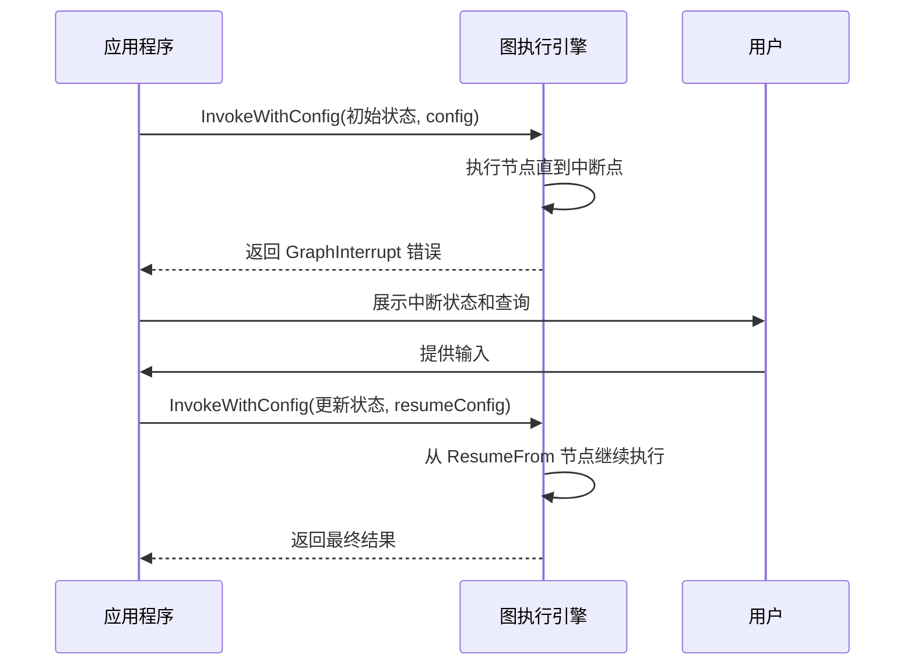

# 执行中断

<cite>
**本文档中引用的文件**  
- [graph.go](file://graph/graph.go#L24-492)
- [errors.go](file://graph/errors.go#L24-34)
- [context.go](file://graph/context.go#L5-16)
- [resume_test.go](file://graph/resume_test.go#L1-81)
- [interrupt_test.go](file://graph/interrupt_test.go#L1-63)
- [dynamic_interrupt\main.go](file://examples/dynamic_interrupt/main.go#L1-78)
- [human_in_the_loop\main.go](file://examples/human_in_the_loop/main.go#L1-119)
- [schema.go](file://graph/schema.go#L1-186)
</cite>

## 目录
1. [中断配置语义](#中断配置语义)
2. [中断检查执行时机](#中断检查执行时机)
3. [GraphInterrupt 错误类型](#graphinterrupt-错误类型)
4. [动态中断与人机交互](#动态中断与人机交互)
5. [中断状态序列化与持久化](#中断状态序列化与持久化)
6. [中断生命周期时序图](#中断生命周期时序图)

## 中断配置语义

`langgraphgo` 提供了三种中断配置项：`InterruptBefore`、`InterruptAfter` 和 `ResumeFrom`，它们定义了图执行过程中的暂停与恢复行为。

- **InterruptBefore**: 当配置了 `InterruptBefore` 时，图在执行到指定节点之前会立即中断。此时，该节点尚未执行，中断时的状态是进入该节点前的状态。此配置适用于需要在关键操作前进行人工审批的场景。

- **InterruptAfter**: 当配置了 `InterruptAfter` 时，图在执行完指定节点之后会中断。此时，该节点已经完成执行，中断时的状态是该节点执行后的状态。此配置适用于需要在某个处理步骤完成后检查结果的场景。

- **ResumeFrom**: 用于指定从中断点恢复执行的起始节点。当图因中断而停止后，可以通过设置 `ResumeFrom` 来指定从哪个节点继续执行。通常，`ResumeFrom` 的值是中断时的节点名或其后续节点列表。

**Section sources**
- [graph.go](file://graph/graph.go#L238-247)
- [graph.go](file://graph/graph.go#L439-452)
- [resume_test.go](file://graph/resume_test.go#L49-51)
- [resume_test.go](file://graph/resume_test.go#L73-75)

## 中断检查执行时机

在 `InvokeWithConfig` 方法中，中断检查的执行时机遵循严格的逻辑路径。整个执行循环分为以下几个阶段：

1. **初始化**: 设置初始状态和当前节点列表，处理 `ResumeFrom` 配置。
2. **中断前检查 (InterruptBefore)**: 在执行任何节点之前，检查当前节点是否在 `InterruptBefore` 列表中。如果是，则立即返回 `GraphInterrupt` 错误。
3. **并行执行节点**: 执行当前节点列表中的所有节点，每个节点在一个独立的 goroutine 中运行。
4. **错误处理**: 检查节点执行过程中是否有错误。如果遇到 `NodeInterrupt` 错误，则将其转换为 `GraphInterrupt` 错误并返回。
5. **状态更新**: 根据节点执行结果更新图的状态。
6. **确定下一节点**: 根据静态边或条件边确定下一组要执行的节点。
7. **中断后检查 (InterruptAfter)**: 在确定下一节点后，检查刚刚执行的节点是否在 `InterruptAfter` 列表中。如果是，则返回 `GraphInterrupt` 错误，并附带下一节点列表。
8. **继续循环**: 更新当前节点列表，进入下一轮循环。

这种设计确保了中断检查的精确性和可预测性，使得开发者可以准确地控制图的执行流程。

**Section sources**
- [graph.go](file://graph/graph.go#L238-247)
- [graph.go](file://graph/graph.go#L439-452)
- [graph.go](file://graph/graph.go#L320-333)

## GraphInterrupt 错误类型

`GraphInterrupt` 是一个特殊的错误类型，用于表示图执行被中断。它包含了以下字段：

- **Node**: 触发中断的节点名称。
- **State**: 中断发生时的图状态。
- **NextNodes**: 如果中断发生在 `InterruptAfter`，则包含接下来要执行的节点列表。
- **InterruptValue**: 如果是动态中断，则包含由 `Interrupt` 函数提供的值。

当图执行被中断时，`InvokeWithConfig` 方法会返回 `GraphInterrupt` 错误。应用程序可以捕获此错误，检查中断原因，并根据需要更新状态或提供恢复值。恢复执行时，可以通过设置 `ResumeFrom` 和 `ResumeValue` 来继续图的执行。

**Section sources**
- [errors.go](file://graph/errors.go#L24-34)
- [graph.go](file://graph/graph.go#L326-331)
- [graph.go](file://graph/graph.go#L444-449)

## 动态中断与人机交互

动态中断允许节点在运行时主动请求中断，等待外部输入。这是通过 `graph.Interrupt(ctx, value)` 函数实现的。当节点调用此函数时：

- 如果是首次调用，函数会返回 `NodeInterrupt` 错误，导致图执行中断。
- 如果是在恢复执行时调用（即上下文中存在 `ResumeValue`），函数会直接返回 `ResumeValue`，并继续执行。

这种机制非常适合实现人机交互（human-in-the-loop）工作流。例如，在一个审批流程中，某个节点可以调用 `Interrupt` 函数来等待人工审批。应用程序捕获中断后，可以将请求展示给用户，获取输入后，再通过 `ResumeValue` 将输入传递回图中，从而完成审批流程。

**Section sources**
- [graph.go](file://graph/graph.go#L43-50)
- [context.go](file://graph/context.go#L5-16)
- [dynamic_interrupt\main.go](file://examples/dynamic_interrupt/main.go#L23-26)
- [human_in_the_loop\main.go](file://examples/human_in_the_loop/main.go#L31-41)

## 中断状态序列化与持久化

为了支持长时间运行的图和跨会话恢复，中断状态需要被序列化和持久化。最佳实践包括：

1. **状态序列化**: 将 `GraphInterrupt` 中的 `State` 字段序列化为 JSON 或其他格式，并存储在数据库或文件系统中。
2. **配置持久化**: 同时保存中断时的配置信息，如 `InterruptBefore`、`InterruptAfter` 和 `NextNodes`。
3. **恢复时重建**: 在恢复执行时，从持久化存储中读取状态和配置，重建 `Config` 对象，并设置 `ResumeFrom` 和 `ResumeValue`。
4. **使用检查点**: 结合 `checkpoint` 模块（如 `postgres`、`redis` 或 `sqlite`）来自动管理状态的保存和恢复。

通过这种方式，可以实现图的持久化执行，即使在应用程序重启后也能从中断点继续执行。

**Section sources**
- [schema.go](file://graph/schema.go#L62-99)
- [checkpointing.go](file://graph/checkpointing.go)
- [postgres.go](file://checkpoint/postgres/postgres.go)
- [redis.go](file://checkpoint/redis/redis.go)
- [sqlite.go](file://checkpoint/sqlite/sqlite.go)

## 中断生命周期时序图

**Diagram sources**
- [graph.go](file://graph/graph.go#L182-492)
- [resume_test.go](file://graph/resume_test.go#L31-81)
- [dynamic_interrupt\main.go](file://examples/dynamic_interrupt/main.go#L40-70)