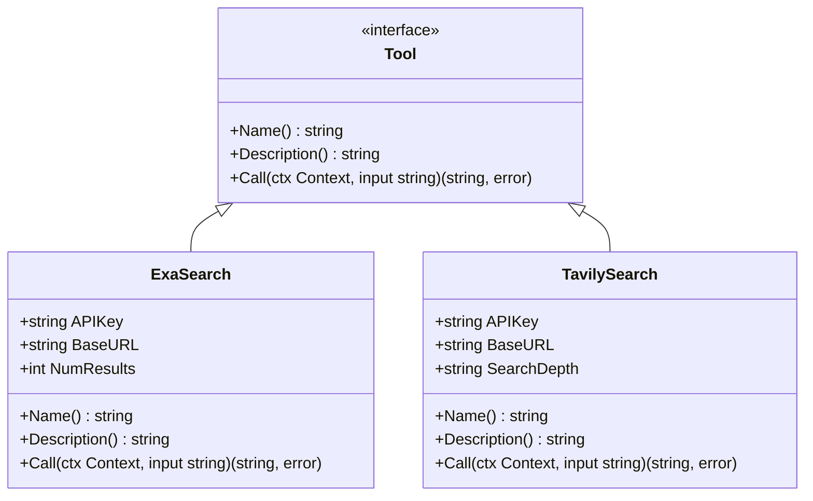
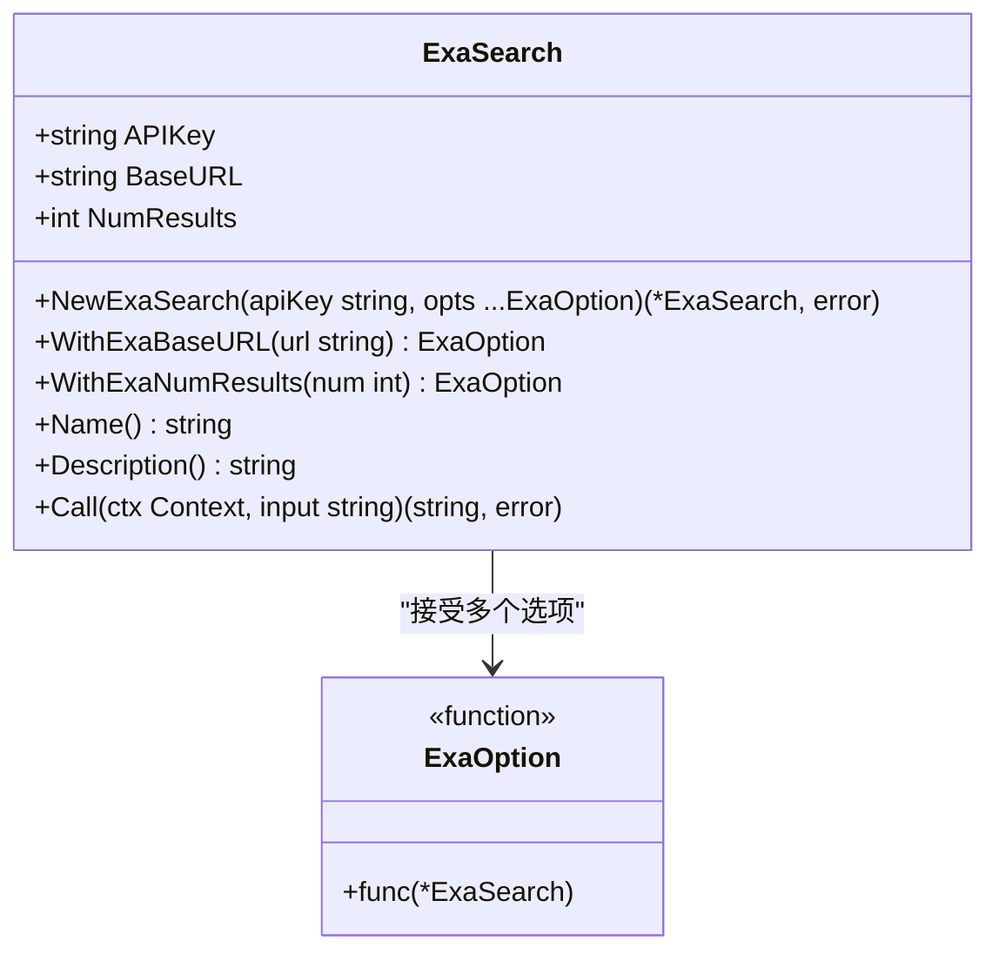
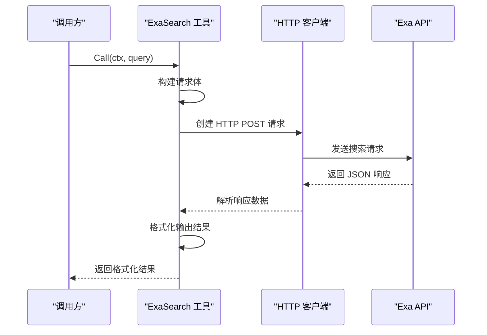
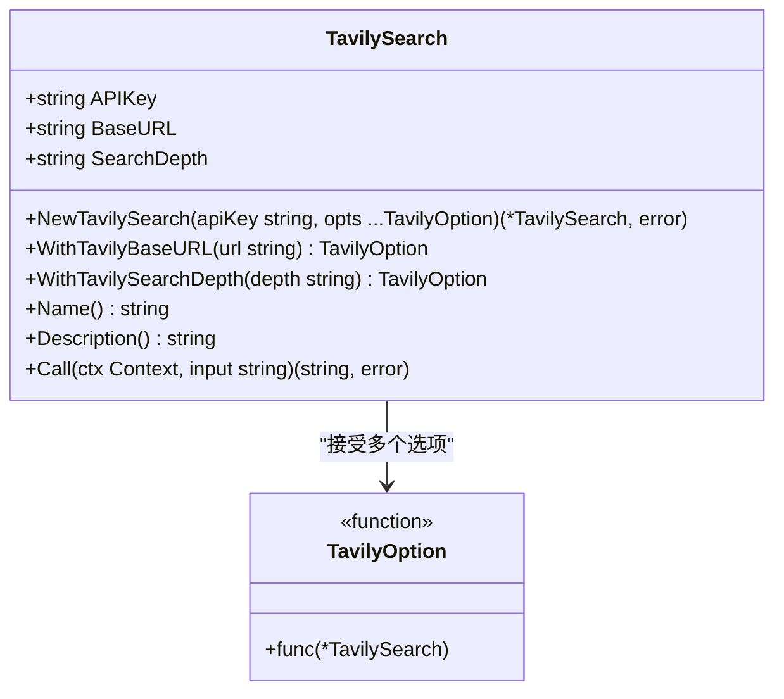
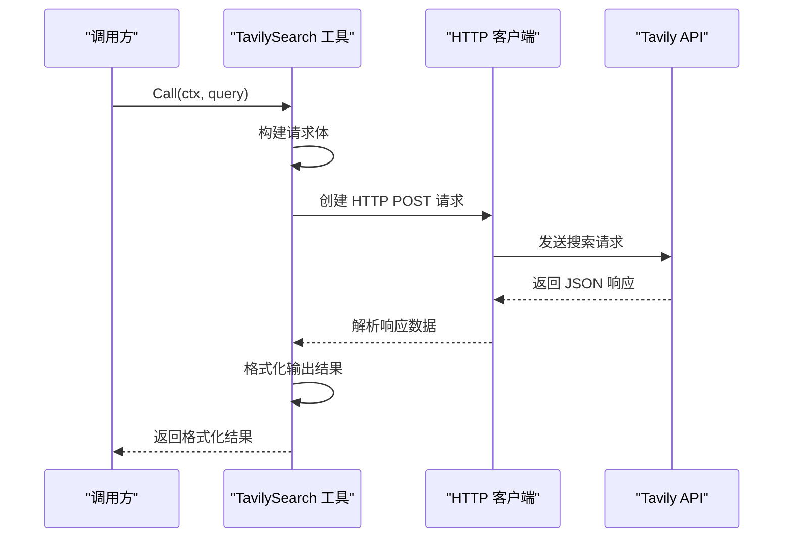
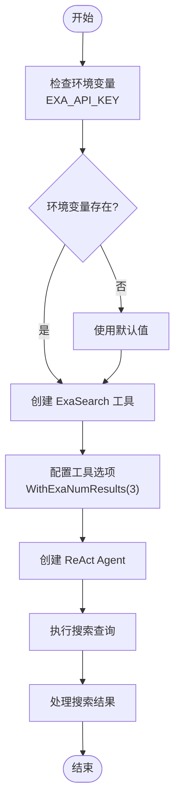
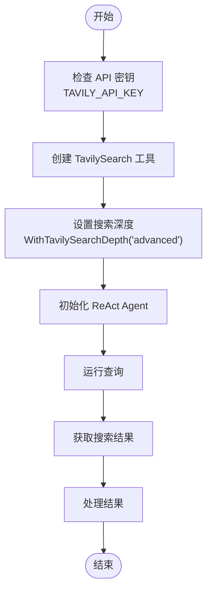
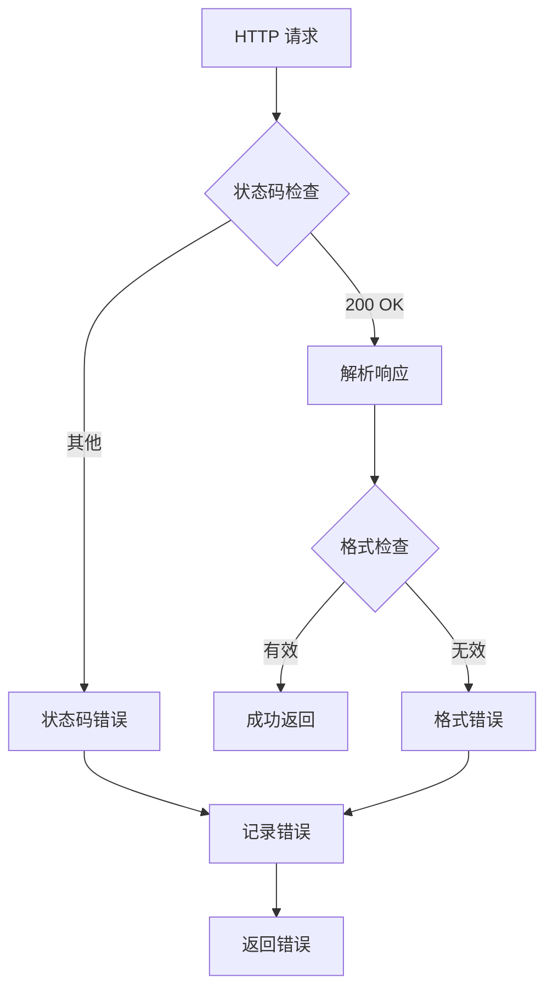
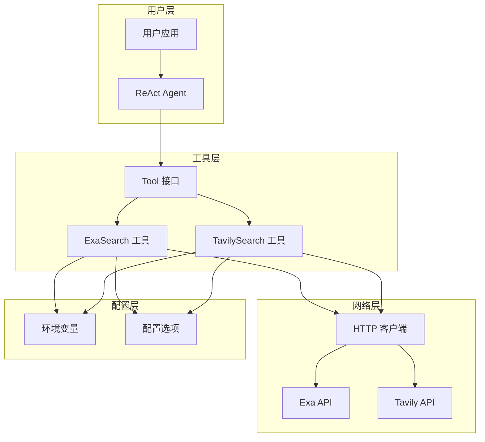
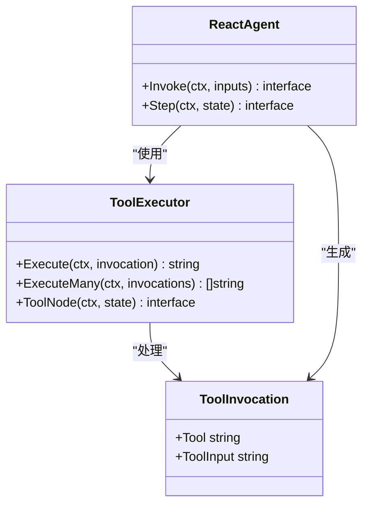

# 工具集成 API 参考文档

<cite>
**本文档中引用的文件**
- [tool/exa.go](file://tool/exa.go)
- [tool/tavily.go](file://tool/tavily.go)
- [tool/tool_test.go](file://tool/tool_test.go)
- [tool/README.md](file://tool/README.md)
- [examples/tool_exa/main.go](file://examples/tool_exa/main.go)
- [examples/tool_tavily/main.go](file://examples/tool_tavily/main.go)
- [examples/tool_exa/README.md](file://examples/tool_exa/README.md)
- [examples/tool_tavily/README.md](file://examples/tool_tavily/README.md)
</cite>

## 目录
1. [简介](#简介)
2. [工具接口定义](#工具接口定义)
3. [ExaSearch 工具](#exasearch-工具)
4. [TavilySearch 工具](#tavilysearch-工具)
5. [工具使用示例](#工具使用示例)
6. [错误处理和最佳实践](#错误处理和最佳实践)
7. [架构设计](#架构设计)
8. [总结](#总结)

## 简介

langgraphgo 提供了一套完整的外部工具集成系统，主要包含两个核心的网络搜索工具：ExaSearch 和 TavilySearch。这些工具都实现了统一的 `Tool` 接口，可以无缝集成到 Agent 工作流中，为智能代理提供实时的网络搜索能力。

### 主要特性

- **统一接口设计**：所有工具都遵循相同的 `Tool` 接口规范
- **环境变量支持**：自动从环境变量读取 API 密钥
- **可配置选项**：支持多种配置参数和自定义设置
- **HTTP 客户端集成**：内置 HTTP 请求处理和响应解析
- **错误处理机制**：完善的错误处理和状态码检查

## 工具接口定义

所有工具都必须实现以下标准接口：



**图表来源**
- [tool/exa.go](file://tool/exa.go#L13-L18)
- [tool/tavily.go](file://tool/tavily.go#L13-L18)

### 接口方法说明

| 方法 | 返回类型 | 描述 |
|------|----------|------|
| `Name()` | `string` | 返回工具的唯一标识名称 |
| `Description()` | `string` | 返回工具的功能描述信息 |
| `Call(ctx, input)` | `(string, error)` | 执行工具操作，返回结果字符串或错误 |

**章节来源**
- [tool/README.md](file://tool/README.md#L49-L56)

## ExaSearch 工具

ExaSearch 是基于 Exa API 的神经网络搜索引擎，专为大型语言模型优化，提供高质量的内容检索功能。

### 结构体定义



**图表来源**
- [tool/exa.go](file://tool/exa.go#L13-L18)
- [tool/exa.go](file://tool/exa.go#L20-L34)

### 构造函数和配置选项

#### NewExaSearch 函数

```go
func NewExaSearch(apiKey string, opts ...ExaOption) (*ExaSearch, error)
```

**参数说明：**
- `apiKey`：API 密钥，如果为空则尝试从 `EXA_API_KEY` 环境变量读取
- `opts`：可选的配置选项列表

**默认配置：**
- `BaseURL`：`https://api.exa.ai`
- `NumResults`：`5`（最多返回 5 个结果）
- `APIKey`：需要从环境变量或参数提供

#### 配置选项函数

##### WithExaBaseURL
```go
func WithExaBaseURL(url string) ExaOption
```
设置自定义的 Exa API 基础 URL。

##### WithExaNumResults
```go
func WithExaNumResults(num int) ExaOption
```
设置搜索结果数量限制（最大值由 API 决定）。

**章节来源**
- [tool/exa.go](file://tool/exa.go#L36-L56)

### 核心方法实现

#### Name 方法
```go
func (t *ExaSearch) Name() string
```
返回工具名称 `"Exa_Search"`。

#### Description 方法
```go
func (t *ExaSearch) Description() string
```
返回详细的工具描述，说明其用途和输入格式要求。

#### Call 方法
```go
func (t *ExaSearch) Call(ctx context.Context, input string) (string, error)
```

**HTTP 请求流程：**



**图表来源**
- [tool/exa.go](file://tool/exa.go#L71-L127)

**请求处理细节：**
1. **请求构建**：构造包含查询、结果数量和内容类型的 JSON 请求体
2. **认证设置**：通过 `x-api-key` 头部传递 API 密钥
3. **超时控制**：使用上下文控制请求超时
4. **响应验证**：检查 HTTP 状态码和响应格式
5. **结果格式化**：提取标题、URL 和内容，限制文本长度

**章节来源**
- [tool/exa.go](file://tool/exa.go#L71-L127)

## TavilySearch 工具

TavilySearch 是基于 Tavily API 的综合搜索引擎，专注于提供准确、可信的搜索结果。

### 结构体定义



**图表来源**
- [tool/tavily.go](file://tool/tavily.go#L13-L18)
- [tool/tavily.go](file://tool/tavily.go#L20-L35)

### 构造函数和配置选项

#### NewTavilySearch 函数

```go
func NewTavilySearch(apiKey string, opts ...TavilyOption) (*TavilySearch, error)
```

**默认配置：**
- `BaseURL`：`https://api.tavily.com`
- `SearchDepth`：`"basic"`（基础搜索深度）
- `APIKey`：需要从环境变量或参数提供

#### 配置选项函数

##### WithTavilyBaseURL
```go
func WithTavilyBaseURL(url string) TavilyOption
```
设置自定义的 Tavily API 基础 URL。

##### WithTavilySearchDepth
```go
func WithTavilySearchDepth(depth string) TavilyOption
```
设置搜索深度级别，有效值为 `"basic"` 或 `"advanced"`。

**章节来源**
- [tool/tavily.go](file://tool/tavily.go#L37-L57)

### 核心方法实现

#### Name 方法
```go
func (t *TavilySearch) Name() string
```
返回工具名称 `"Tavily_Search"`。

#### Description 方法
```go
func (t *TavilySearch) Description() string
```
返回详细的工具描述，强调其在当前事件问答方面的优势。

#### Call 方法
```go
func (t *TavilySearch) Call(ctx context.Context, input string) (string, error)
```

**HTTP 请求流程：**



**图表来源**
- [tool/tavily.go](file://tool/tavily.go#L72-L121)

**请求处理细节：**
1. **请求构建**：构造包含查询、API 密钥和搜索深度的 JSON 请求体
2. **认证设置**：通过请求体中的 `api_key` 字段传递 API 密钥
3. **搜索深度控制**：根据配置选择基础或高级搜索模式
4. **响应解析**：提取搜索结果的标题、URL 和内容字段
5. **结果格式化**：标准化输出格式，便于后续处理

**章节来源**
- [tool/tavily.go](file://tool/tavily.go#L72-L121)

## 工具使用示例

### ExaSearch 使用示例

以下是完整的 ExaSearch 工具使用示例：



**图表来源**
- [examples/tool_exa/main.go](file://examples/tool_exa/main.go#L33-L42)

**关键步骤：**
1. **环境变量检查**：确保 `EXA_API_KEY` 设置正确
2. **工具初始化**：使用 `NewExaSearch` 创建工具实例
3. **配置定制**：通过选项函数调整搜索行为
4. **Agent 集成**：将工具添加到 ReAct Agent 中
5. **查询执行**：Agent 自动决定何时使用搜索工具

**章节来源**
- [examples/tool_exa/main.go](file://examples/tool_exa/main.go#L16-L73)
- [examples/tool_exa/README.md](file://examples/tool_exa/README.md#L1-L42)

### TavilySearch 使用示例

TavilySearch 的使用模式与 ExaSearch 类似：



**图表来源**
- [examples/tool_tavily/main.go](file://examples/tool_tavily/main.go#L35-L46)

**关键特性：**
- **高级搜索模式**：支持更深入的搜索分析
- **实时信息检索**：特别适合当前事件相关的查询
- **简洁的 API 设计**：最小化的配置需求

**章节来源**
- [examples/tool_tavily/main.go](file://examples/tool_tavily/main.go#L16-L78)
- [examples/tool_tavily/README.md](file://examples/tool_tavily/README.md#L1-L42)

## 错误处理和最佳实践

### 环境变量管理

两个工具都支持从环境变量自动读取 API 密钥：

```go
// ExaSearch 环境变量
os.Getenv("EXA_API_KEY")

// TavilySearch 环境变量  
os.Getenv("TAVILY_API_KEY")
```

**最佳实践：**
- 在生产环境中始终使用环境变量
- 提供清晰的错误消息指示缺失的 API 密钥
- 考虑使用配置文件或密钥管理服务

### HTTP 请求处理

#### 错误类型和处理



**图表来源**
- [tool/exa.go](file://tool/exa.go#L95-L102)
- [tool/tavily.go](file://tool/tavily.go#L93-L100)

#### 常见错误场景

| 错误类型 | 原因 | 处理建议 |
|----------|------|----------|
| `EXA_API_KEY not set` | 缺少 API 密钥 | 设置环境变量或提供密钥参数 |
| `failed to create request` | HTTP 请求创建失败 | 检查网络连接和 URL 格式 |
| `failed to send request` | 请求发送失败 | 检查网络连接和防火墙设置 |
| `exa api returned status: XXX` | API 返回非 200 状态码 | 检查 API 密钥和请求格式 |
| `failed to decode response` | 响应解析失败 | 检查 API 响应格式变化 |

### 性能优化建议

1. **连接复用**：使用 HTTP 客户端池
2. **超时控制**：合理设置请求超时时间
3. **结果缓存**：对重复查询结果进行缓存
4. **并发控制**：限制同时进行的请求数量
5. **重试机制**：实现指数退避重试策略

**章节来源**
- [tool/tool_test.go](file://tool/tool_test.go#L14-L107)

## 架构设计

### 整体架构



**图表来源**
- [tool/exa.go](file://tool/exa.go#L1-L128)
- [tool/tavily.go](file://tool/tavily.go#L1-L122)

### 设计原则

1. **单一职责**：每个工具只负责特定的搜索功能
2. **接口统一**：所有工具都实现相同的 `Tool` 接口
3. **可扩展性**：通过选项函数支持灵活配置
4. **错误隔离**：每个工具独立处理自己的错误
5. **环境解耦**：支持从环境变量读取配置

### 集成模式

工具可以通过多种方式集成到 Agent 中：



**图表来源**
- [examples/tool_exa/main.go](file://examples/tool_exa/main.go#L40)
- [examples/tool_tavily/main.go](file://examples/tool_tavily/main.go#L43)

## 总结

langgraphgo 的工具集成为智能代理提供了强大的网络搜索能力。通过统一的接口设计和灵活的配置选项，开发者可以轻松地将 ExaSearch 和 TavilySearch 集成到各种应用场景中。

### 主要优势

1. **开箱即用**：提供预配置的工具实现
2. **易于集成**：遵循标准接口，与现有系统兼容
3. **灵活配置**：支持多种定制选项
4. **健壮可靠**：完善的错误处理和测试覆盖
5. **文档完善**：详细的使用指南和最佳实践

### 适用场景

- **智能客服系统**：实时查询产品信息和解决方案
- **内容创作助手**：获取最新的行业资讯和参考资料
- **研究辅助工具**：快速收集学术资料和研究报告
- **知识管理系统**：自动补充和更新知识库内容

通过合理使用这些工具，开发者可以构建出更加智能和高效的代理应用程序，为用户提供更好的体验和服务质量。