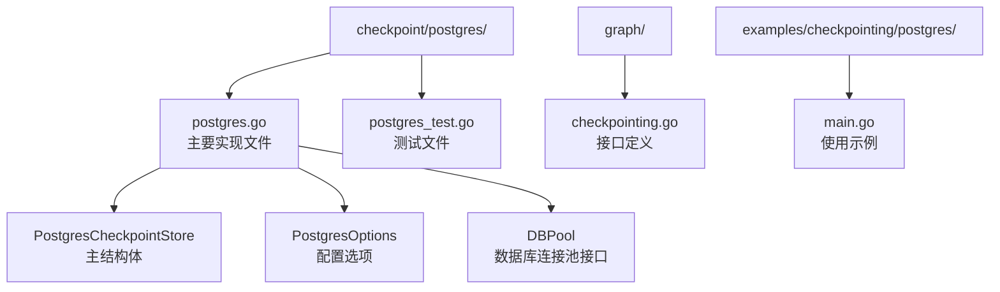
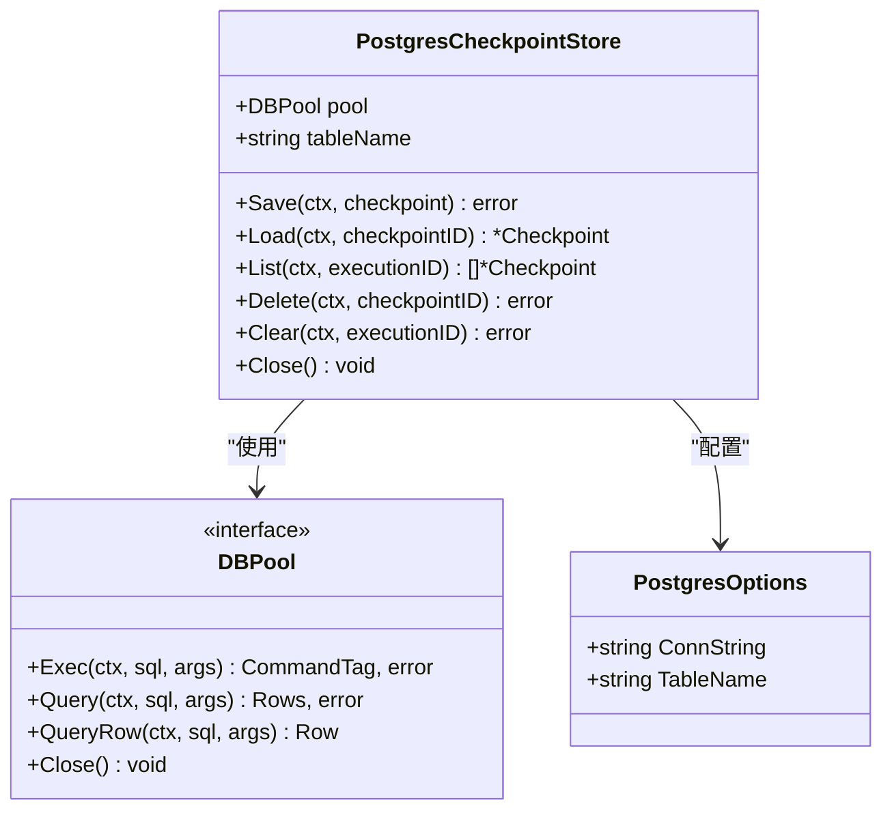
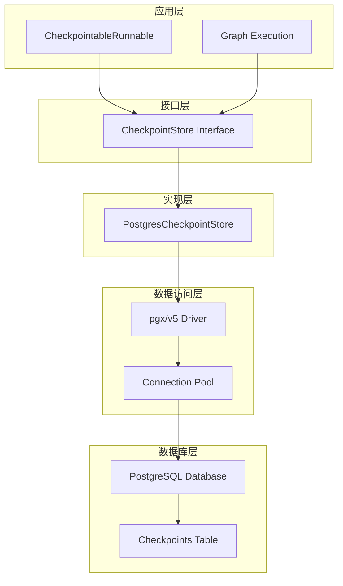
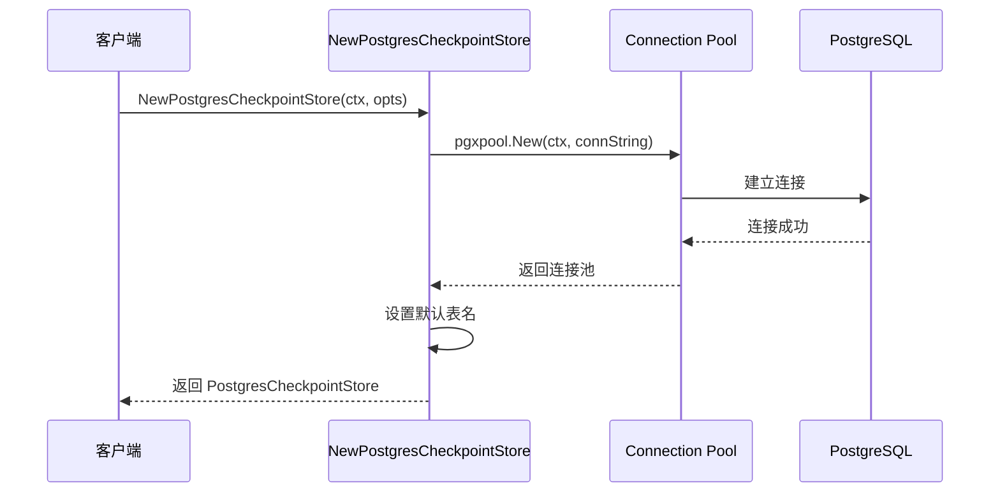
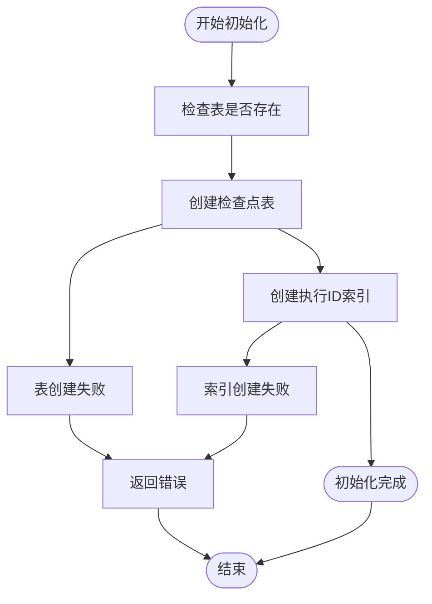
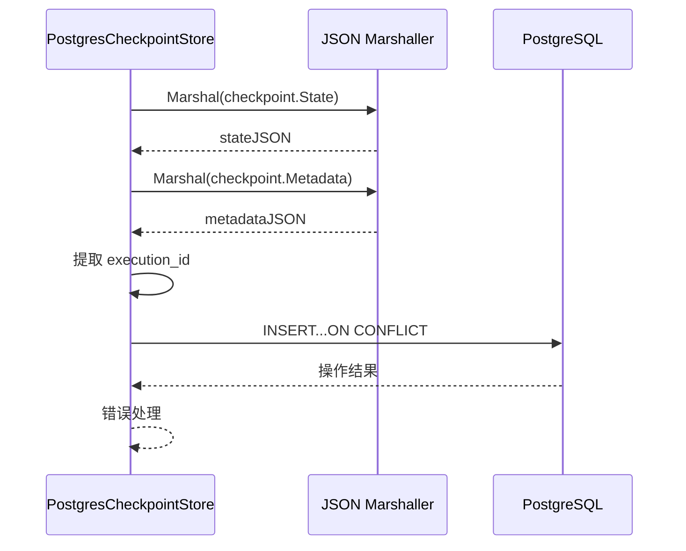
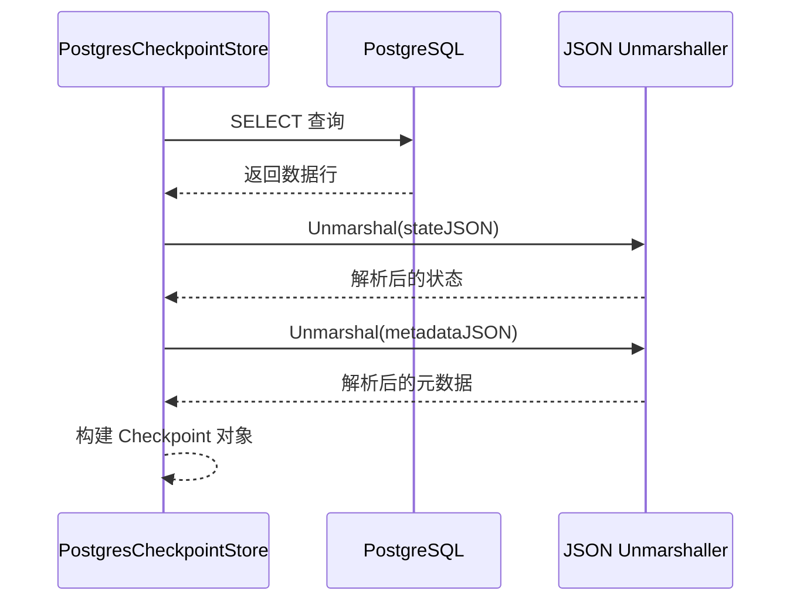
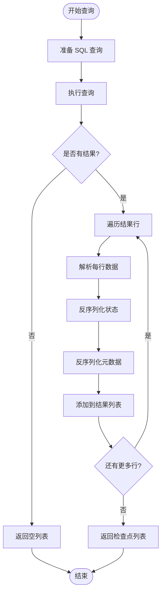
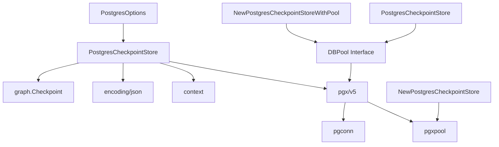

# PostgreSQL 检查点存储

<cite>
**本文档中引用的文件**
- [postgres.go](file://checkpoint/postgres/postgres.go)
- [postgres_test.go](file://checkpoint/postgres/postgres_test.go)
- [main.go](file://examples/checkpointing/postgres/main.go)
- [main.go](file://examples/checkpointing/main.go)
- [checkpointing.go](file://graph/checkpointing.go)
</cite>

## 目录
1. [简介](#简介)
2. [项目结构](#项目结构)
3. [核心组件](#核心组件)
4. [架构概览](#架构概览)
5. [详细组件分析](#详细组件分析)
6. [依赖关系分析](#依赖关系分析)
7. [性能考虑](#性能考虑)
8. [故障排除指南](#故障排除指南)
9. [结论](#结论)

## 简介

langgraphgo 的 PostgreSQL 检查点存储实现提供了高性能、持久化的状态保存功能，支持复杂的图执行过程中的状态恢复。该实现基于 `pgx/v5` 驱动程序，利用 PostgreSQL 的 JSONB 类型进行高效的数据存储，并提供了完整的数据库连接池管理和错误处理机制。

## 项目结构

PostgreSQL 检查点存储位于 `checkpoint/postgres/` 目录下，包含以下关键文件：

**图表来源**
- [postgres.go](file://checkpoint/postgres/postgres.go#L1-L250)
- [checkpointing.go](file://graph/checkpointing.go#L1-L560)

**章节来源**
- [postgres.go](file://checkpoint/postgres/postgres.go#L1-L250)
- [postgres_test.go](file://checkpoint/postgres/postgres_test.go#L1-L90)

## 核心组件

### PostgresCheckpointStore 结构体

`PostgresCheckpointStore` 是 PostgreSQL 检查点存储的主要实现，负责与 PostgreSQL 数据库的所有交互。

**图表来源**
- [postgres.go](file://checkpoint/postgres/postgres.go#L22-L32)
- [postgres.go](file://checkpoint/postgres/postgres.go#L14-L21)

### PostgresOptions 配置选项

`PostgresOptions` 提供了 PostgreSQL 连接和表名的配置选项：

| 字段 | 类型 | 默认值 | 描述 |
|------|------|--------|------|
| ConnString | string | 必需 | PostgreSQL 连接字符串 |
| TableName | string | "checkpoints" | 存储检查点的表名 |

### 数据表结构

PostgreSQL 检查点存储使用以下表结构：

| 列名 | 类型 | 约束 | 描述 |
|------|------|------|------|
| id | TEXT | PRIMARY KEY | 检查点唯一标识符 |
| execution_id | TEXT | NOT NULL | 执行会话标识符 |
| node_name | TEXT | NOT NULL | 执行节点名称 |
| state | JSONB | NOT NULL | 节点状态数据 |
| metadata | JSONB | NULLABLE | 元数据信息 |
| timestamp | TIMESTAMPTZ | NOT NULL | 创建时间戳 |
| version | INTEGER | NOT NULL | 版本号 |

**章节来源**
- [postgres.go](file://checkpoint/postgres/postgres.go#L66-L77)

## 架构概览

PostgreSQL 检查点存储采用分层架构设计，确保了良好的可扩展性和维护性：

**图表来源**
- [postgres.go](file://checkpoint/postgres/postgres.go#L22-L32)
- [checkpointing.go](file://graph/checkpointing.go#L22-L38)

## 详细组件分析

### NewPostgresCheckpointStore 构造函数

构造函数负责创建新的 PostgreSQL 检查点存储实例：

**图表来源**
- [postgres.go](file://checkpoint/postgres/postgres.go#L34-L50)

### InitSchema 方法

`InitSchema` 方法负责初始化数据库表结构：

**图表来源**
- [postgres.go](file://checkpoint/postgres/postgres.go#L64-L84)

### Save 方法 - 数据存储

Save 方法实现了检查点的存储逻辑：

**图表来源**
- [postgres.go](file://checkpoint/postgres/postgres.go#L91-L135)

### Load 方法 - 数据检索

Load 方法实现了通过 ID 检索检查点的功能：

**图表来源**
- [postgres.go](file://checkpoint/postgres/postgres.go#L137-L176)

### List 方法 - 批量查询

List 方法支持按执行 ID 获取所有检查点：

**图表来源**
- [postgres.go](file://checkpoint/postgres/postgres.go#L178-L229)

### 删除操作方法

Delete 和 Clear 方法分别实现单个删除和批量删除功能：

| 方法 | 功能 | SQL 语句 |
|------|------|----------|
| Delete | 删除单个检查点 | `DELETE FROM table WHERE id = $1` |
| Clear | 清除执行的所有检查点 | `DELETE FROM table WHERE execution_id = $1` |

**章节来源**
- [postgres.go](file://checkpoint/postgres/postgres.go#L231-L249)

## 依赖关系分析

PostgreSQL 检查点存储的依赖关系如下：

**图表来源**
- [postgres.go](file://checkpoint/postgres/postgres.go#L3-L12)
- [postgres.go](file://checkpoint/postgres/postgres.go#L34-L50)

**章节来源**
- [postgres.go](file://checkpoint/postgres/postgres.go#L1-L12)

## 性能考虑

### 连接池管理

PostgreSQL 检查点存储使用 `pgxpool` 实现高效的连接池管理：

- **自动连接复用**：避免频繁建立和断开数据库连接
- **并发安全**：线程安全的连接池操作
- **资源优化**：智能的连接生命周期管理

### JSONB 查询优化

利用 PostgreSQL 的 JSONB 类型特性进行优化：

- **索引支持**：执行 ID 上的索引加速查询
- **原生 JSON 处理**：减少序列化/反序列化开销
- **部分更新**：支持 JSONB 部分字段更新

### SQL 语句优化

关键 SQL 语句的优化策略：

| 操作类型 | SQL 语句 | 优化点 |
|----------|----------|--------|
| 保存 | `INSERT...ON CONFLICT` | 避免重复插入开销 |
| 查询 | `SELECT id, node_name, state, metadata, timestamp, version` | 只选择必要字段 |
| 批量查询 | `WHERE execution_id = $1 ORDER BY timestamp ASC` | 使用索引排序 |

### 错误处理最佳实践

- **连接错误**：重试机制和优雅降级
- **数据完整性**：事务保证和约束检查
- **性能监控**：慢查询日志和指标收集

## 故障排除指南

### 常见问题及解决方案

#### 连接问题
- **症状**：无法建立数据库连接
- **原因**：连接字符串错误或网络问题
- **解决方案**：验证连接字符串格式和网络连通性

#### 表结构问题
- **症状**：初始化失败
- **原因**：权限不足或表已存在
- **解决方案**：检查数据库权限和表结构

#### 性能问题
- **症状**：查询响应缓慢
- **原因**：缺少索引或数据量过大
- **解决方案**：添加执行 ID 索引和定期清理

#### 内存泄漏
- **症状**：长时间运行后内存占用过高
- **原因**：连接池未正确关闭
- **解决方案**：确保调用 Close() 方法

**章节来源**
- [postgres.go](file://checkpoint/postgres/postgres.go#L36-L40)
- [postgres.go](file://checkpoint/postgres/postgres.go#L86-L89)

## 结论

langgraphgo 的 PostgreSQL 检查点存储实现提供了完整、高效的持久化解决方案。通过合理的设计和优化，它能够满足复杂图执行场景下的状态保存需求。主要优势包括：

- **高性能**：基于 pgx/v5 驱动的高效数据库操作
- **可靠性**：完善的错误处理和连接管理
- **可扩展性**：灵活的配置和接口设计
- **易用性**：简洁的 API 和丰富的使用示例

该实现为开发者提供了在生产环境中部署复杂图执行系统所需的稳定性和性能保障。