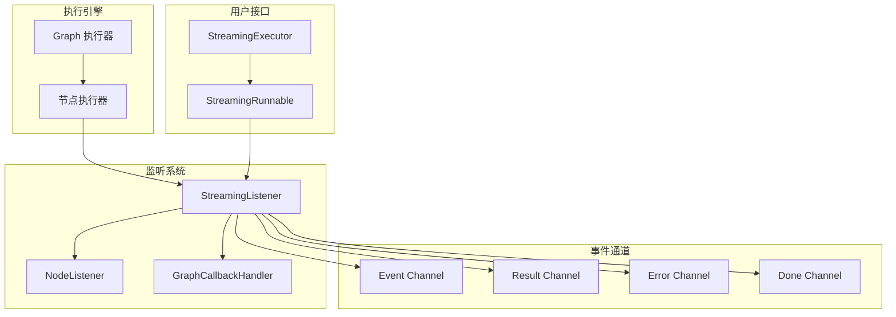
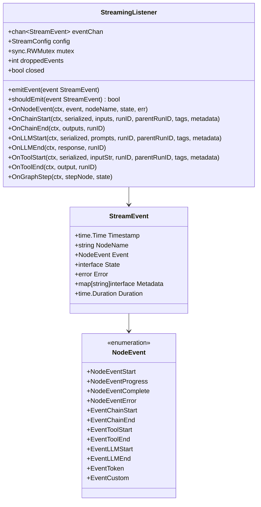
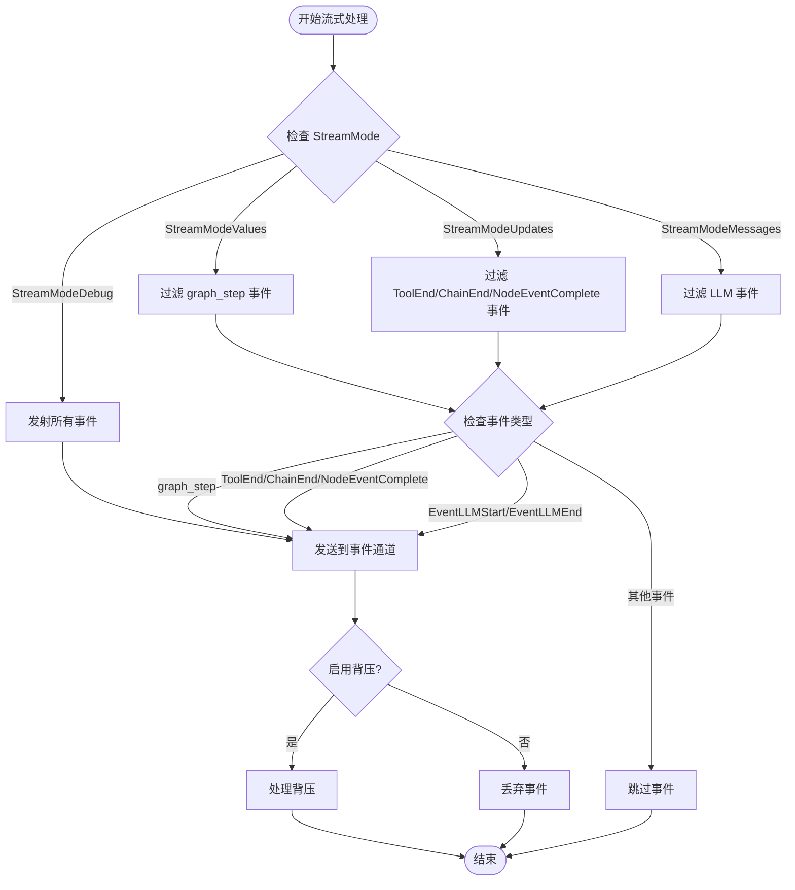
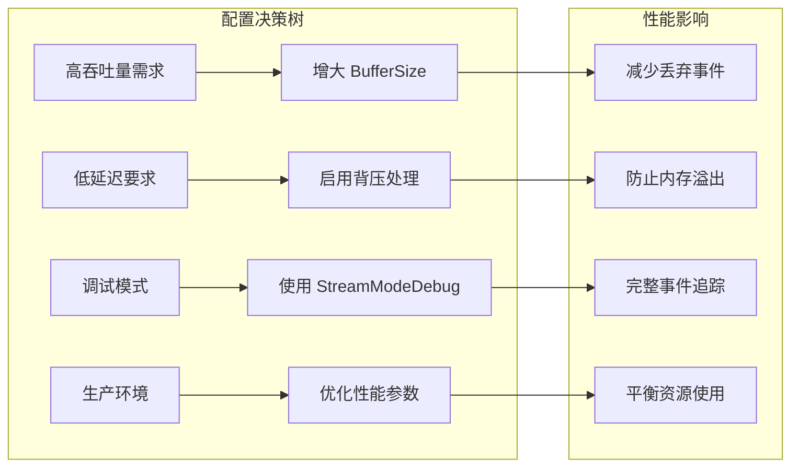
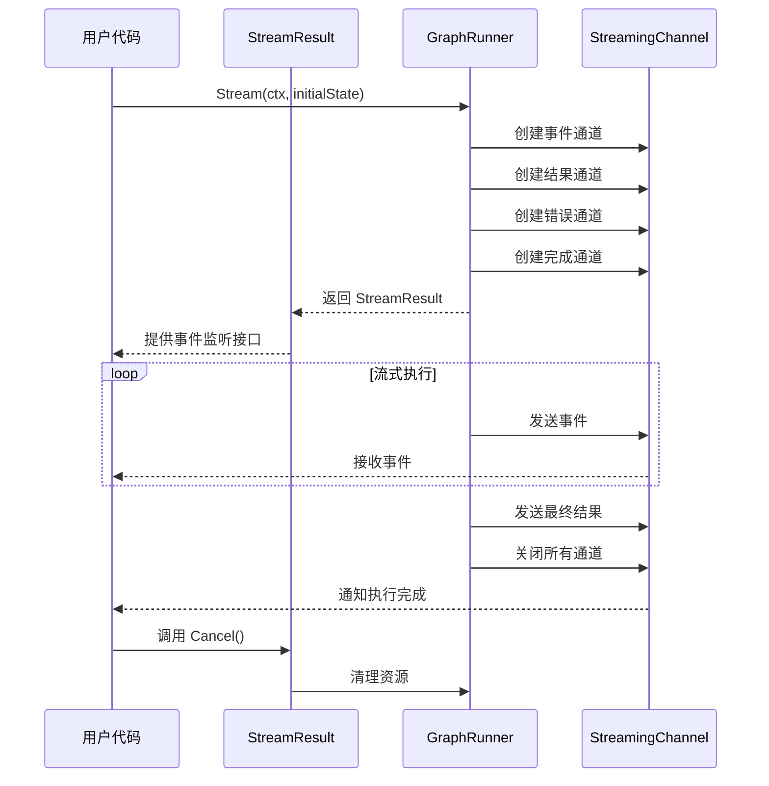
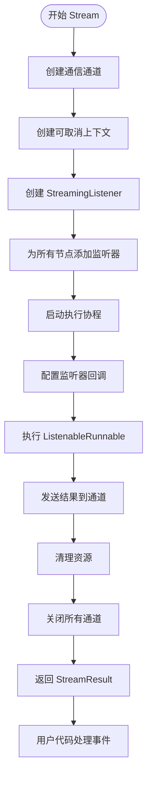
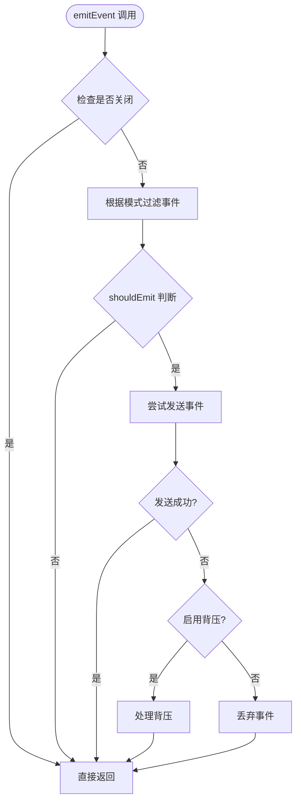
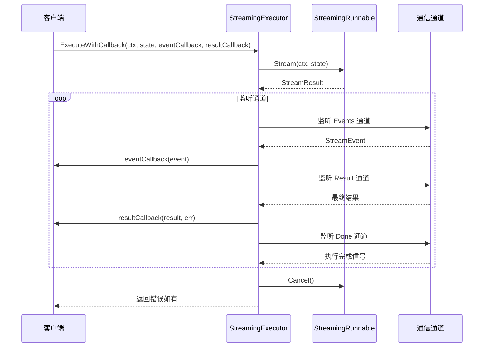
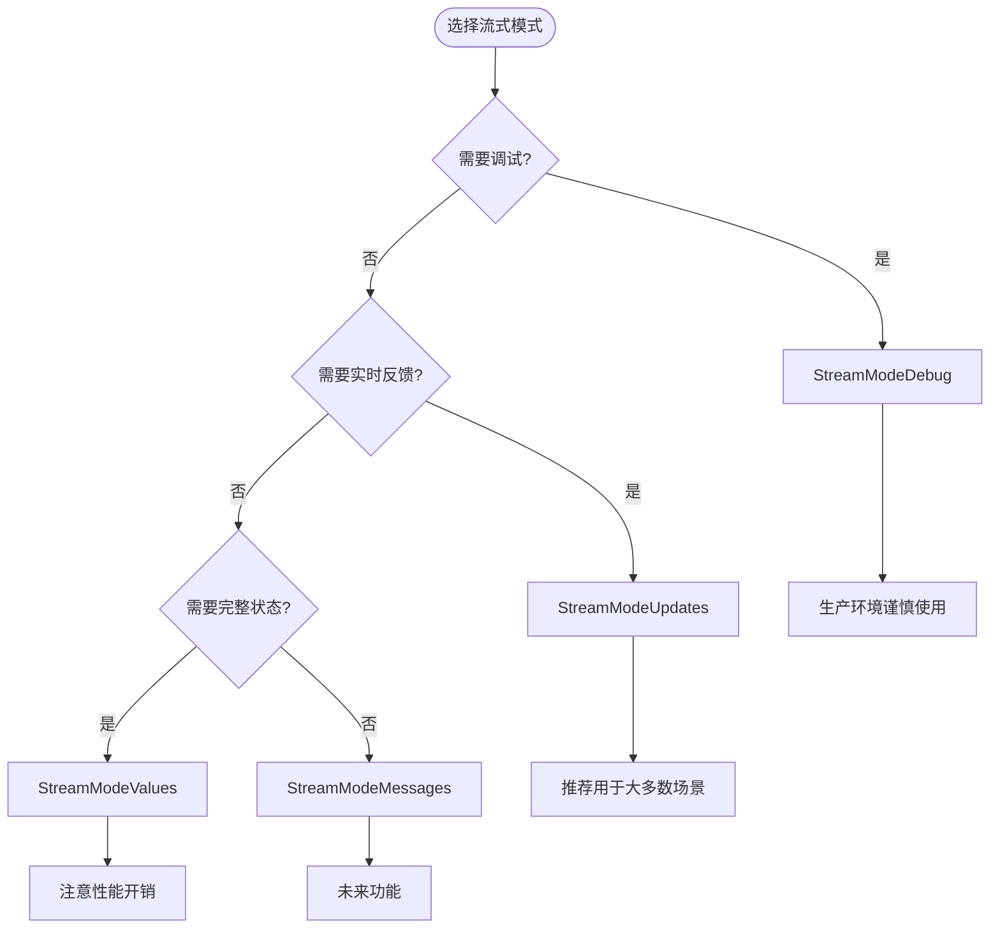

# 流式处理模块

<cite>
**本文档中引用的文件**
- [graph/streaming.go](file://graph/streaming.go)
- [graph/listeners.go](file://graph/listeners.go)
- [graph/schema.go](file://graph/schema.go)
- [examples/streaming_modes/main.go](file://examples/streaming_modes/main.go)
- [examples/streaming_pipeline/main.go](file://examples/streaming_pipeline/main.go)
- [examples/streaming_modes/README.md](file://examples/streaming_modes/README.md)
- [examples/streaming_modes/README_CN.md](file://examples/streaming_modes/README_CN.md)
- [graph/streaming_test.go](file://graph/streaming_test.go)
</cite>

## 目录
1. [简介](#简介)
2. [核心概念](#核心概念)
3. [StreamMode 枚举类型](#streammode-枚举类型)
4. [StreamConfig 配置结构体](#streamconfig-配置结构体)
5. [StreamResult 结果结构体](#streamresult-结果结构体)
6. [StreamingRunnable 核心组件](#streamingrunnable-核心组件)
7. [StreamingListener 事件监听器](#streaminglistener-事件监听器)
8. [StreamingExecutor 执行器](#streamingexecutor-执行器)
9. [流式模式详解](#流式模式详解)
10. [使用示例](#使用示例)
11. [最佳实践](#最佳实践)
12. [故障排除](#故障排除)

## 简介

LangGraph Go 的流式处理模块提供了一个强大而灵活的架构，用于在长运行的 LLM 链或复杂代理工作流中实现实时事件流式传输。该模块允许开发者订阅执行过程中的各种事件，为用户提供实时反馈，同时支持多种粒度的事件过滤和处理策略。

### 主要特性

- **多模式事件流式传输**：支持 values、updates、messages、debug 四种不同的流式模式
- **实时事件通知**：通过 Go 通道实现实时事件传递
- **灵活的配置系统**：可自定义缓冲区大小、背压处理等参数
- **高可用性设计**：内置错误处理和资源清理机制
- **异步执行支持**：支持同步和异步两种执行模式

## 核心概念

### 事件驱动架构

流式处理采用事件驱动架构，主要包含以下核心组件：



**图表来源**
- [graph/streaming.go](file://graph/streaming.go#L270-L357)
- [graph/listeners.go](file://graph/listeners.go#L51-L85)

### 事件类型系统

系统定义了丰富的事件类型来表示不同的执行阶段：



**图表来源**
- [graph/listeners.go](file://graph/listeners.go#L10-L49)
- [graph/listeners.go](file://graph/listeners.go#L65-L87)
- [graph/streaming.go](file://graph/streaming.go#L66-L82)

**章节来源**
- [graph/streaming.go](file://graph/streaming.go#L1-L476)
- [graph/listeners.go](file://graph/listeners.go#L1-L335)

## StreamMode 枚举类型

`StreamMode` 定义了流式处理的不同模式，每种模式决定了哪些事件会被过滤和传输。

### 常量定义

| 模式 | 类型 | 描述 | 使用场景 |
|------|------|------|----------|
| `StreamModeValues` | `StreamMode` | 发射每步后的完整状态 | 调试或需要渲染整个上下文的 UI |
| `StreamModeUpdates` | `StreamMode` | 发射每个节点的更新（增量） | 显示进度（如"步骤 1 完成"，"工具已执行"） |
| `StreamModeMessages` | `StreamMode` | 发射 LLM 消息/令牌（计划中） | 实现打字机效果 |
| `StreamModeDebug` | `StreamMode` | 发射所有内部事件 | 深度检查和调试 |

### 模式行为详解



**图表来源**
- [graph/streaming.go](file://graph/streaming.go#L112-L132)

**章节来源**
- [graph/streaming.go](file://graph/streaming.go#L9-L21)

## StreamConfig 配置结构体

`StreamConfig` 提供了流式处理的全面配置选项，控制事件通道的行为和性能特征。

### 字段说明

| 字段名 | 类型 | 默认值 | 描述 |
|--------|------|--------|------|
| `BufferSize` | `int` | `1000` | 事件通道的缓冲区大小 |
| `EnableBackpressure` | `bool` | `true` | 是否启用背压处理机制 |
| `MaxDroppedEvents` | `int` | `100` | 最大丢弃事件数量（超过时记录日志） |
| `Mode` | `StreamMode` | `StreamModeDebug` | 流式模式配置 |

### 配置策略



### 默认配置

```go
func DefaultStreamConfig() StreamConfig {
    return StreamConfig{
        BufferSize:         1000,
        EnableBackpressure: true,
        MaxDroppedEvents:   100,
        Mode:               StreamModeDebug,
    }
}
```

**章节来源**
- [graph/streaming.go](file://graph/streaming.go#L23-L46)

## StreamResult 结果结构体

`StreamResult` 包含流式执行的所有输出通道，提供了完整的异步执行结果访问接口。

### 通道类型

| 通道 | 类型 | 用途 | 关闭时机 |
|------|------|------|----------|
| `Events` | `<-chan StreamEvent` | 接收实时事件 | 执行完成时关闭 |
| `Result` | `<-chan interface{}` | 接收最终结果 | 执行完成时关闭 |
| `Errors` | `<-chan error` | 接收执行错误 | 执行完成时关闭 |
| `Done` | `<-chan struct{}` | 通知执行完成 | 执行完成时关闭 |

### 生命周期管理



**图表来源**
- [graph/streaming.go](file://graph/streaming.go#L48-L64)

**章节来源**
- [graph/streaming.go](file://graph/streaming.go#L48-L64)

## StreamingRunnable 核心组件

`StreamingRunnable` 是流式处理的核心执行器，封装了 `ListenableRunnable` 并添加了流式功能。

### 构造函数

```go
func NewStreamingRunnable(runnable *ListenableRunnable, config StreamConfig) *StreamingRunnable
func NewStreamingRunnableWithDefaults(runnable *ListenableRunnable) *StreamingRunnable
```

### Stream 方法

`Stream` 方法是流式处理的主要入口点，负责启动异步执行并返回 `StreamResult`。

#### 执行流程



**图表来源**
- [graph/streaming.go](file://graph/streaming.go#L289-L357)

### 资源管理

系统实现了完善的资源清理机制：

- **自动清理**：执行完成后自动移除监听器
- **延迟保护**：提供小延迟确保所有事件处理完成
- **通道安全**：确保通道在安全状态下关闭

**章节来源**
- [graph/streaming.go](file://graph/streaming.go#L270-L357)

## StreamingListener 事件监听器

`StreamingListener` 实现了 `NodeListener` 和 `GraphCallbackHandler` 接口，负责捕获和过滤事件。

### 核心方法

#### emitEvent 方法



**图表来源**
- [graph/streaming.go](file://graph/streaming.go#L84-L109)

#### shouldEmit 方法

该方法根据配置的 `StreamMode` 决定是否应该发出特定事件：

```go
func (sl *StreamingListener) shouldEmit(event StreamEvent) bool {
    switch sl.config.Mode {
    case StreamModeDebug:
        return true
    case StreamModeValues:
        return event.Event == "graph_step"
    case StreamModeUpdates:
        return event.Event == EventToolEnd || 
               event.Event == EventChainEnd || 
               event.Event == NodeEventComplete
    case StreamModeMessages:
        return event.Event == EventLLMEnd || event.Event == EventLLMStart
    default:
        return true
    }
}
```

### 事件回调处理

`StreamingListener` 实现了多个回调方法来处理不同类型的事件：

| 方法 | 触发条件 | 事件类型 |
|------|----------|----------|
| `OnNodeEvent` | 节点事件发生 | `NodeEventStart`, `NodeEventComplete`, `NodeEventError` |
| `OnChainStart` | 链开始执行 | `EventChainStart` |
| `OnChainEnd` | 链执行完成 | `EventChainEnd` |
| `OnLLMStart` | LLM 调用开始 | `EventLLMStart` |
| `OnLLMEnd` | LLM 调用完成 | `EventLLMEnd` |
| `OnToolStart` | 工具调用开始 | `EventToolStart` |
| `OnToolEnd` | 工具调用完成 | `EventToolEnd` |
| `OnGraphStep` | 图执行步骤 | 自定义事件 `"graph_step"` |

**章节来源**
- [graph/streaming.go](file://graph/streaming.go#L66-L250)

## StreamingExecutor 执行器

`StreamingExecutor` 提供了高级的流式执行接口，简化了事件处理和结果收集。

### ExecuteWithCallback 方法

这是最常用的执行方式，提供回调函数处理实时事件：



**图表来源**
- [graph/streaming.go](file://graph/streaming.go#L414-L465)

### ExecuteAsync 方法

提供异步执行能力，立即返回 `StreamResult`：

```go
func (se *StreamingExecutor) ExecuteAsync(ctx context.Context, initialState interface{}) *StreamResult {
    return se.runnable.Stream(ctx, initialState)
}
```

### 执行模式对比

| 执行方式 | 特点 | 适用场景 |
|----------|------|----------|
| `ExecuteWithCallback` | 同步阻塞，提供回调处理 | 简单的事件处理需求 |
| `ExecuteAsync` | 异步非阻塞，立即返回 | 需要并发处理多个流式任务 |

**章节来源**
- [graph/streaming.go](file://graph/streaming.go#L402-L470)

## 流式模式详解

### StreamModeValues - 完整状态模式

**特点**：
- 发射每步后的完整图状态
- 适合调试和状态可视化
- 包含所有中间计算结果

**使用场景**：
- 开发调试阶段
- 需要完整状态跟踪的应用
- 状态可视化界面

**事件过滤规则**：
```go
return event.Event == "graph_step"
```

### StreamModeUpdates - 更新模式

**特点**：
- 发射节点输出的增量更新
- 适合进度指示和状态报告
- 性能开销相对较小

**使用场景**：
- 实时进度条显示
- 步骤完成通知
- 简单的状态监控

**事件过滤规则**：
```go
return event.Event == EventToolEnd || 
       event.Event == EventChainEnd || 
       event.Event == NodeEventComplete
```

### StreamModeMessages - 消息模式

**特点**：
- 计划支持 LLM 令牌流式传输
- 实现打字机效果
- 适合对话式应用

**当前状态**：
- 处于开发阶段
- 预期支持 `EventLLMStart` 和 `EventLLMEnd` 事件

### StreamModeDebug - 调试模式

**特点**：
- 发射所有内部事件
- 最详细的执行信息
- 用于深度问题诊断

**使用场景**：
- 生产环境问题排查
- 性能分析
- 事件流式传输调试

**事件过滤规则**：
```go
return true  // 发射所有事件
```

### 模式选择指南



**章节来源**
- [graph/streaming.go](file://graph/streaming.go#L112-L132)

## 使用示例

### 基础流式处理示例

以下展示了如何使用不同的流式模式：

```go
// 创建流式消息图
g := graph.NewStreamingMessageGraph()

// 添加节点
g.AddNode("step_1", func(ctx context.Context, state interface{}) (interface{}, error) {
    time.Sleep(500 * time.Millisecond)
    return "Result from Step 1", nil
})

g.AddNode("step_2", func(ctx context.Context, state interface{}) (interface{}, error) {
    time.Sleep(500 * time.Millisecond)
    return "Result from Step 2", nil
})

// 设置入口点和边
g.SetEntryPoint("step_1")
g.AddEdge("step_1", "step_2")
g.AddEdge("step_2", graph.END)

// 配置流式模式
g.SetStreamConfig(graph.StreamConfig{
    Mode: graph.StreamModeUpdates,
})

// 编译和执行
runnable, _ := g.CompileStreaming()
streamResult := runnable.Stream(context.Background(), nil)

// 处理事件
for event := range streamResult.Events {
    fmt.Printf("[%s] Node: %s, Event: %s, State: %v\n",
        event.Timestamp.Format("15:04:05"),
        event.NodeName,
        event.Event,
        event.State)
}
```

### 高级执行器使用

```go
// 创建执行器
executor := graph.NewStreamingExecutor(runnable)

// 使用回调方式执行
err := executor.ExecuteWithCallback(
    context.Background(),
    "initial_state",
    func(event graph.StreamEvent) {
        fmt.Printf("[%.3fs] %s: %v\n", 
            time.Since(startTime).Seconds(), 
            event.Event, 
            event.State)
    },
    func(result interface{}, err error) {
        if err != nil {
            fmt.Printf("Error: %v\n", err)
        } else {
            fmt.Printf("Final result: %v\n", result)
        }
    },
)
```

### 异步执行示例

```go
// 异步执行
streamResult := executor.ExecuteAsync(context.Background(), "async_state")

// 立即返回，可以在后台处理事件
go func() {
    for event := range streamResult.Events {
        processEvent(event)
    }
}()

// 继续执行其他逻辑
performOtherWork()

// 等待完成
finalResult := <-streamResult.Result
```

**章节来源**
- [examples/streaming_modes/main.go](file://examples/streaming_modes/main.go#L1-L55)
- [examples/streaming_pipeline/main.go](file://examples/streaming_pipeline/main.go#L1-L80)

## 最佳实践

### 性能优化建议

1. **合理配置缓冲区大小**
   ```go
   config := graph.StreamConfig{
       BufferSize:         1000,        // 根据预期事件量调整
       EnableBackpressure: true,        // 生产环境建议启用
       MaxDroppedEvents:   100,         // 设置合理的丢弃阈值
   }
   ```

2. **选择合适的流式模式**
   - 开发调试：使用 `StreamModeDebug`
   - 生产环境：优先考虑 `StreamModeUpdates`
   - 高性能场景：避免不必要的状态广播

3. **事件处理优化**
   ```go
   // 使用缓冲的通道处理大量事件
   eventChan := make(chan graph.StreamEvent, 1000)
   
   // 在单独的 goroutine 中处理事件
   go func() {
       for event := range eventChan {
           // 快速处理逻辑
           processEvent(event)
       }
   }()
   ```

### 错误处理策略

```go
func robustStreamExecution() error {
    executor := graph.NewStreamingExecutor(runnable)
    
    return executor.ExecuteWithCallback(
        context.Background(),
        initialState,
        func(event graph.StreamEvent) {
            defer func() {
                if r := recover(); r != nil {
                    log.Printf("Event handler panic: %v", r)
                }
            }()
            
            // 安全的事件处理
            handleEventSafely(event)
        },
        func(result interface{}, err error) {
            if err != nil {
                log.Printf("Execution failed: %v", err)
                // 实现重试或降级策略
            }
        },
    )
}
```

### 资源管理

```go
func managedStreamExecution() {
    executor := graph.NewStreamingExecutor(runnable)
    streamResult := executor.ExecuteAsync(context.Background(), state)
    
    // 确保资源清理
    defer func() {
        streamResult.Cancel()
        // 等待清理完成
        time.Sleep(100 * time.Millisecond)
    }()
    
    // 处理事件
    for event := range streamResult.Events {
        // 处理逻辑
    }
}
```

### 监控和指标

```go
type MonitoringListener struct {
    droppedEvents int
    totalEvents   int
}

func (ml *MonitoringListener) OnNodeEvent(ctx context.Context, event graph.NodeEvent, 
                                        nodeName string, state interface{}, err error) {
    ml.totalEvents++
    
    // 监控丢弃事件
    if droppedCount := ml.GetDroppedEventsCount(); droppedCount > 0 {
        log.Printf("Dropped %d events", droppedCount)
    }
}
```

## 故障排除

### 常见问题及解决方案

#### 1. 事件丢失问题

**症状**：某些事件没有被接收到

**可能原因**：
- 事件通道缓冲区太小
- 背压处理未启用
- 事件过滤过于严格

**解决方案**：
```go
config := graph.StreamConfig{
    BufferSize:         5000,        // 增大缓冲区
    EnableBackpressure: true,        // 启用背压处理
    MaxDroppedEvents:   500,         // 增加丢弃阈值
}
```

#### 2. 内存泄漏

**症状**：长时间运行后内存持续增长

**可能原因**：
- 未正确调用 `Cancel()` 方法
- 事件处理逻辑阻塞

**解决方案**：
```go
// 确保正确清理
defer streamResult.Cancel()

// 使用超时控制
ctx, cancel := context.WithTimeout(context.Background(), 30*time.Second)
defer cancel()

// 实现优雅关闭
done := make(chan struct{})
go func() {
    defer close(done)
    // 处理事件
}()

select {
case <-done:
    // 正常完成
case <-ctx.Done():
    // 超时处理
}
```

#### 3. 性能问题

**症状**：事件处理速度慢，影响整体性能

**诊断步骤**：
1. 检查事件过滤规则
2. 监控通道使用情况
3. 分析事件处理逻辑

**优化方案**：
```go
// 使用高效的事件处理
func efficientEventHandler(event graph.StreamEvent) {
    // 避免阻塞操作
    go func() {
        // 异步处理耗时操作
        heavyProcessing(event)
    }()
}

// 减少不必要的状态序列化
func optimizedStateHandler(state interface{}) interface{} {
    // 只处理必要的字段
    if msg, ok := state.(map[string]interface{}); ok {
        return msg["important_field"]
    }
    return state
}
```

#### 4. 调试困难

**症状**：难以理解事件流式传输的行为

**解决方案**：
```go
// 使用调试模式
g.SetStreamConfig(graph.StreamConfig{
    Mode: graph.StreamModeDebug,
})

// 添加自定义事件监听器
type DebugListener struct{}

func (dl *DebugListener) OnNodeEvent(ctx context.Context, event graph.NodeEvent, 
                                   nodeName string, state interface{}, err error) {
    log.Printf("DEBUG: [%s] %s - %v", nodeName, event, state)
}

// 注册监听器
node.AddListener(&DebugListener{})
```

### 调试工具和技巧

#### 1. 事件计数器

```go
type EventCounter struct {
    counts map[string]int
    mu     sync.Mutex
}

func (ec *EventCounter) OnNodeEvent(ctx context.Context, event graph.NodeEvent, 
                                  nodeName string, state interface{}, err error) {
    ec.mu.Lock()
    defer ec.mu.Unlock()
    
    key := fmt.Sprintf("%s:%s", nodeName, event)
    ec.counts[key]++
}

func (ec *EventCounter) Report() {
    ec.mu.Lock()
    defer ec.mu.Unlock()
    
    for key, count := range ec.counts {
        fmt.Printf("Event %s: %d times\n", key, count)
    }
}
```

#### 2. 性能分析

```go
type PerformanceAnalyzer struct {
    startTime time.Time
    events    []graph.StreamEvent
}

func (pa *PerformanceAnalyzer) OnNodeEvent(ctx context.Context, event graph.NodeEvent, 
                                         nodeName string, state interface{}, err error) {
    pa.events = append(pa.events, graph.StreamEvent{
        Timestamp: time.Now(),
        NodeName:  nodeName,
        Event:     event,
        State:     state,
    })
}

func (pa *PerformanceAnalyzer) Analyze() {
    if len(pa.events) < 2 {
        return
    }
    
    // 计算事件间隔
    for i := 1; i < len(pa.events); i++ {
        interval := pa.events[i].Timestamp.Sub(pa.events[i-1].Timestamp)
        fmt.Printf("Interval %d-%d: %v\n", i-1, i, interval)
    }
}
```

**章节来源**
- [graph/streaming_test.go](file://graph/streaming_test.go#L1-L105)

## 总结

LangGraph Go 的流式处理模块提供了一个功能强大且灵活的事件驱动架构，支持多种粒度的事件流式传输。通过合理配置 `StreamMode`、`StreamConfig` 和使用适当的执行模式，开发者可以构建高性能、响应式的应用程序。

关键要点：
- **选择合适的流式模式**：根据具体需求选择 values、updates、messages 或 debug 模式
- **优化配置参数**：合理设置缓冲区大小和背压处理策略
- **实现健壮的错误处理**：确保资源正确清理和异常恢复
- **监控和调试**：使用内置的监控工具和自定义监听器进行问题诊断

通过遵循最佳实践和故障排除指南，可以充分发挥流式处理模块的潜力，构建高质量的实时应用程序。