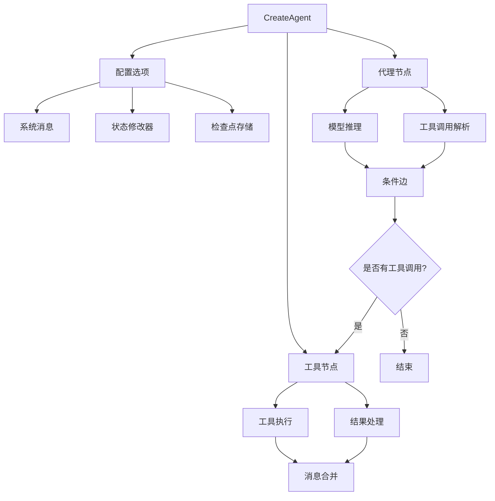
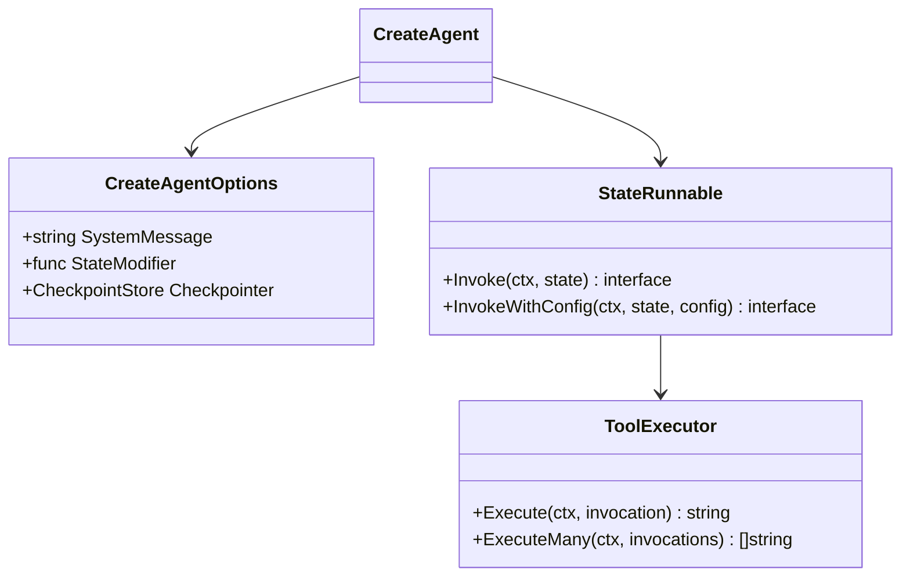
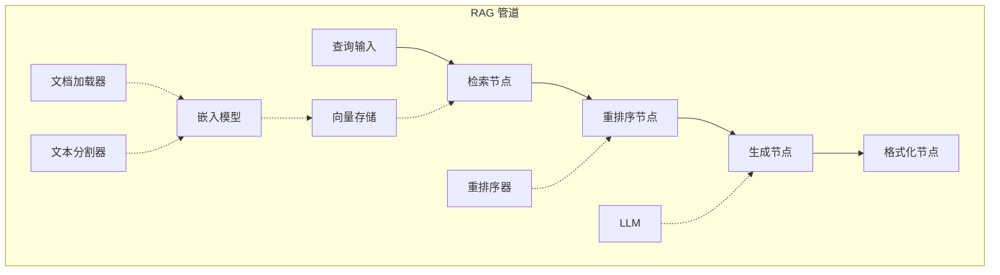
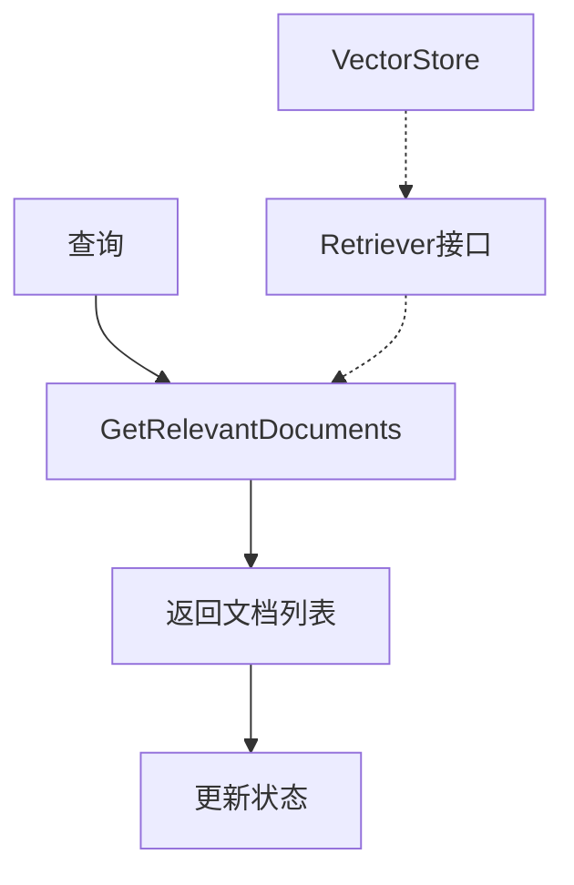
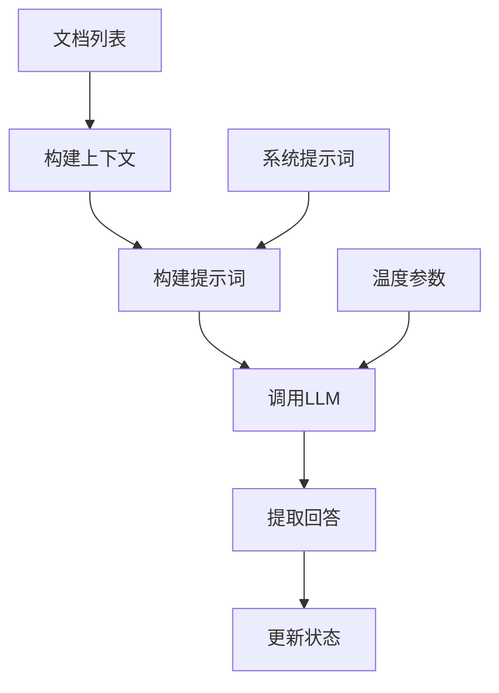
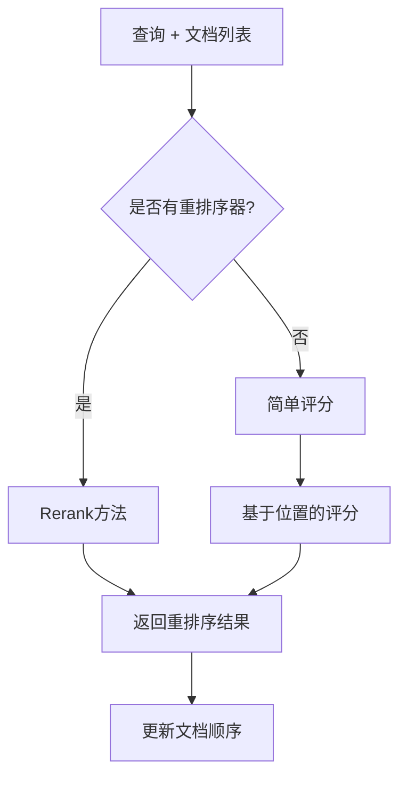
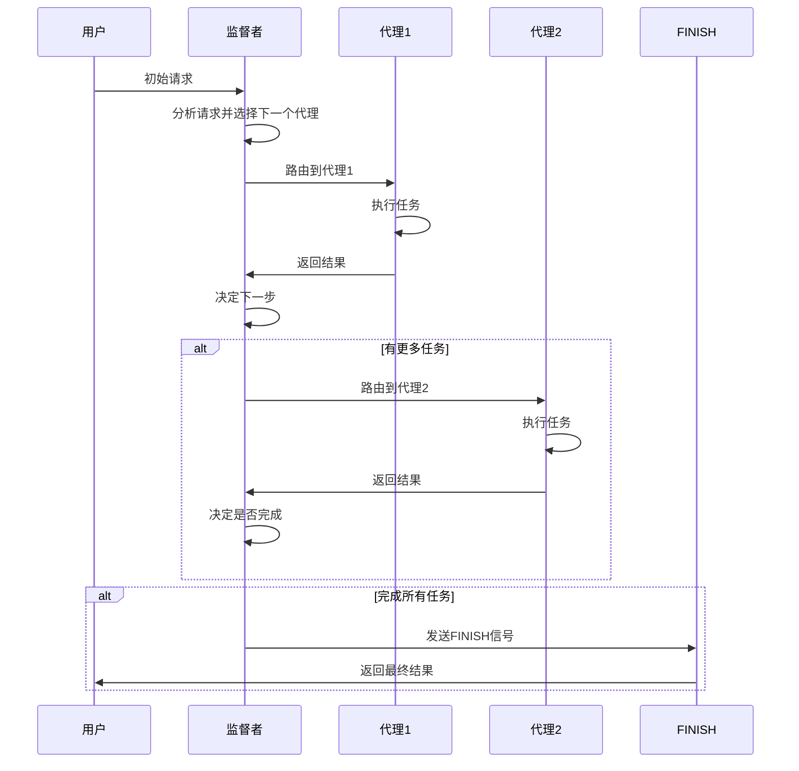
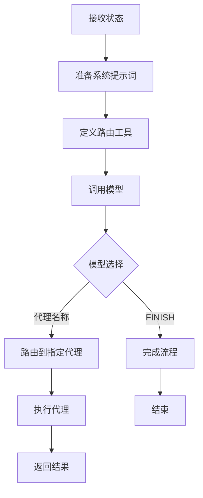
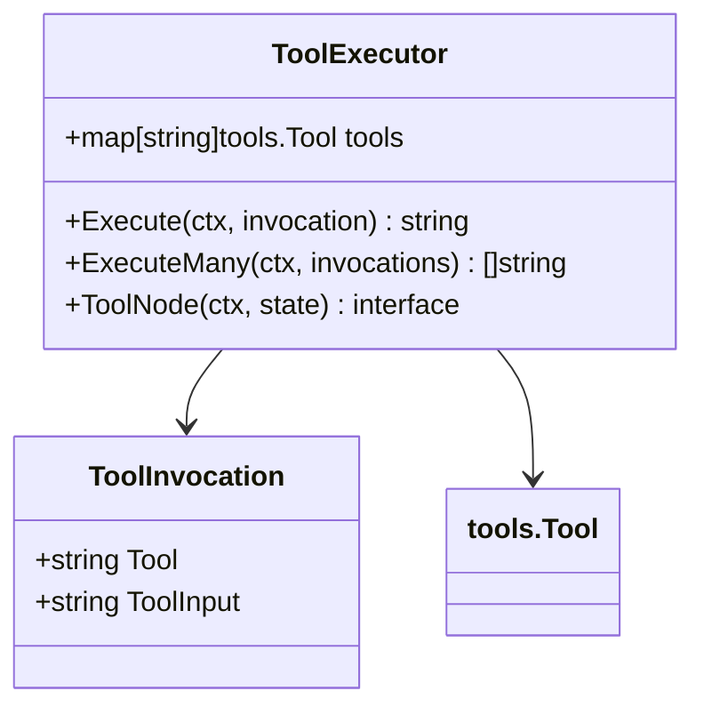
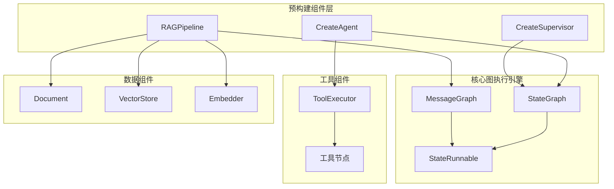

# 预构建组件 API 参考文档

<cite>
**本文档中引用的文件**
- [create_agent.go](file://prebuilt/create_agent.go)
- [rag.go](file://prebuilt/rag.go)
- [supervisor.go](file://prebuilt/supervisor.go)
- [rag_components.go](file://prebuilt/rag_components.go)
- [tool_executor.go](file://prebuilt/tool_executor.go)
- [create_agent_test.go](file://prebuilt/create_agent_test.go)
- [rag_test.go](file://prebuilt/rag_test.go)
- [supervisor_test.go](file://prebuilt/supervisor_test.go)
- [main.go](file://examples/create_agent/main.go)
- [main.go](file://examples/rag_basic/main.go)
- [main.go](file://examples/rag_advanced/main.go)
- [main.go](file://examples/rag_conditional/main.go)
- [main.go](file://examples/supervisor/main.go)
- [main.go](file://examples/rag_pipeline/main.go)
</cite>

## 目录
1. [简介](#简介)
2. [CreateAgent 组件](#createagent-组件)
3. [RAGPipeline 组件](#ragpipeline-组件)
4. [CreateSupervisor 组件](#createsupervisor-组件)
5. [工具组件](#工具组件)
6. [架构概览](#架构概览)
7. [使用示例](#使用示例)
8. [最佳实践](#最佳实践)

## 简介

langgraphgo 提供了一套高级预构建组件，简化了复杂 AI 应用程序的开发。这些组件包括：
- **CreateAgent**: 创建智能代理，支持工具调用和状态管理
- **RAGPipeline**: 构建检索增强生成(RAG)系统
- **CreateSupervisor**: 协调多个代理的工作流程

这些组件基于 langgraphgo 的核心图执行引擎，提供了开箱即用的功能和灵活的配置选项。

## CreateAgent 组件

CreateAgent 是一个高级代理创建函数，能够快速构建具备工具调用能力的智能代理。

### 核心功能



**图表来源**
- [create_agent.go](file://prebuilt/create_agent.go#L46-L251)

### 函数签名

```go
func CreateAgent(model llms.Model, inputTools []tools.Tool, opts ...CreateAgentOption) (*graph.StateRunnable, error)
```

### 参数说明

| 参数 | 类型 | 描述 |
|------|------|------|
| model | llms.Model | 语言模型实例，用于推理和工具调用 |
| inputTools | []tools.Tool | 工具列表，代理可以调用的外部功能 |
| opts | ...CreateAgentOption | 可选配置选项 |

### 配置选项

#### WithSystemMessage
设置代理的系统提示词。

```go
func WithSystemMessage(message string) CreateAgentOption
```

**参数：**
- `message`: 系统提示词字符串

**使用示例：**
```go
agent, err := CreateAgent(model, tools,
    WithSystemMessage("你是一个有用的天气助手。始终保持礼貌。"),
    WithStateModifier(customModifier),
)
```

#### WithStateModifier
设置状态修改器函数，在发送给模型之前修改消息列表。

```go
func WithStateModifier(modifier func(messages []llms.MessageContent) []llms.MessageContent) CreateAgentOption
```

**参数：**
- `modifier`: 修改器函数，接收消息列表并返回修改后的版本

**使用示例：**
```go
modifier := func(messages []llms.MessageContent) []llms.MessageContent {
    log.Printf("当前消息数量: %d", len(messages))
    return messages
}

agent, err := CreateAgent(model, tools, WithStateModifier(modifier))
```

#### WithCheckpointer
设置检查点存储，用于保存和恢复代理状态。

```go
func WithCheckpointer(checkpointer graph.CheckpointStore) CreateAgentOption
```

**注意：** 当前是占位实现，可能尚未完全集成到图执行中。

### 返回值

返回一个 `*graph.StateRunnable` 实例，表示编译后的代理图。

### 内部架构



**图表来源**
- [create_agent.go](file://prebuilt/create_agent.go#L13-L43)
- [tool_executor.go](file://prebuilt/tool_executor.go#L16-L84)

**章节来源**
- [create_agent.go](file://prebuilt/create_agent.go#L46-L251)
- [create_agent_test.go](file://prebuilt/create_agent_test.go#L1-L182)

## RAGPipeline 组件

RAGPipeline 提供了构建检索增强生成系统的完整框架，支持多种 RAG 模式和配置选项。

### 核心组件



**图表来源**
- [rag.go](file://prebuilt/rag.go#L125-L249)

### RAGConfig 配置

RAGConfig 定义了 RAG 系统的所有配置选项：

| 配置项 | 类型 | 默认值 | 描述 |
|--------|------|--------|------|
| TopK | int | 4 | 检索的文档数量 |
| ScoreThreshold | float64 | 0.7 | 相关性阈值 |
| UseReranking | bool | false | 是否使用重排序 |
| UseFallback | bool | false | 是否使用回退搜索 |
| SystemPrompt | string | 帮助提示 | 系统提示词 |
| IncludeCitations | bool | true | 是否包含引用 |
| MaxTokens | int | 1000 | 最大令牌数 |
| Temperature | float64 | 0.0 | 温度参数 |

### 构建方法

#### BuildBasicRAG
构建基础 RAG 管道：检索 → 生成

```go
func (p *RAGPipeline) BuildBasicRAG() error
```

**特点：**
- 简单直接的管道结构
- 适用于大多数基本 RAG 场景
- 不包含重排序和引用格式化

#### BuildAdvancedRAG
构建高级 RAG 管道：检索 → 重排序 → 生成 → 引用格式化

```go
func (p *RAGPipeline) BuildAdvancedRAG() error
```

**特点：**
- 包含可选的重排序步骤
- 自动添加引用格式化节点
- 支持更高质量的检索结果

#### BuildConditionalRAG
构建条件 RAG 管道：根据相关性阈值决定是否使用回退搜索

```go
func (p *RAGPipeline) BuildConditionalRAG() error
```

**特点：**
- 基于相关性分数的条件路由
- 支持回退搜索机制
- 更灵活的错误处理

### 节点内部逻辑

#### retrieve 节点
负责从向量存储中检索相关文档。



**图表来源**
- [rag.go](file://prebuilt/rag.go#L262-L275)

#### generate 节点
使用检索到的文档生成答案。



**图表来源**
- [rag.go](file://prebuilt/rag.go#L322-L355)

#### rerank 节点
对检索到的文档进行重新排序以提高质量。



**图表来源**
- [rag.go](file://prebuilt/rag.go#L277-L308)

### RAGState 状态结构

```go
type RAGState struct {
    Query              string
    Documents          []Document
    RetrievedDocuments []Document
    RankedDocuments    []DocumentWithScore
    Context            string
    Answer             string
    Citations          []string
    Metadata           map[string]interface{}
}
```

### 组件接口

#### DocumentLoader
文档加载接口，支持从各种源加载文档。

```go
type DocumentLoader interface {
    Load(ctx context.Context) ([]Document, error)
}
```

#### TextSplitter
文本分割接口，将长文档分割成较小的块。

```go
type TextSplitter interface {
    SplitDocuments(documents []Document) ([]Document, error)
}
```

#### Embedder
嵌入生成接口，将文本转换为向量表示。

```go
type Embedder interface {
    EmbedDocuments(ctx context.Context, texts []string) ([][]float64, error)
    EmbedQuery(ctx context.Context, text string) ([]float64, error)
}
```

#### VectorStore
向量存储接口，支持相似性搜索。

```go
type VectorStore interface {
    AddDocuments(ctx context.Context, documents []Document, embeddings [][]float64) error
    SimilaritySearch(ctx context.Context, query string, k int) ([]Document, error)
    SimilaritySearchWithScore(ctx context.Context, query string, k int) ([]DocumentWithScore, error)
}
```

**章节来源**
- [rag.go](file://prebuilt/rag.go#L1-L392)
- [rag_components.go](file://prebuilt/rag_components.go#L1-L333)
- [rag_test.go](file://prebuilt/rag_test.go#L1-L338)

## CreateSupervisor 组件

CreateSupervisor 创建一个监督者代理，能够协调多个子代理的工作流程。

### 协调机制



**图表来源**
- [supervisor.go](file://prebuilt/supervisor.go#L13-L153)

### 函数签名

```go
func CreateSupervisor(model llms.Model, members map[string]*graph.StateRunnable) (*graph.StateRunnable, error)
```

### 参数说明

| 参数 | 类型 | 描述 |
|------|------|------|
| model | llms.Model | 用于决策的语言模型 |
| members | map[string]*graph.StateRunnable | 代理成员映射表 |

### 成员代理管理

监督者通过以下方式管理成员代理：

1. **动态路由**: 根据当前状态和用户请求动态选择下一个代理
2. **状态共享**: 所有成员代理共享相同的状态模式
3. **循环协调**: 支持多个代理的循环执行直到完成

### 路由机制



**图表来源**
- [supervisor.go](file://prebuilt/supervisor.go#L29-L106)

### 使用示例

```go
// 创建数学专家代理
mathAgent, err := prebuilt.CreateReactAgent(model, []tools.Tool{CalculatorTool{}})

// 创建通用助理代理  
generalAgent, err := prebuilt.CreateReactAgent(model, []tools.Tool{})

// 创建监督者
members := map[string]*graph.StateRunnable{
    "MathExpert":       mathAgent,
    "GeneralAssistant": generalAgent,
}

supervisor, err := prebuilt.CreateSupervisor(model, members)
```

**章节来源**
- [supervisor.go](file://prebuilt/supervisor.go#L13-L153)
- [supervisor_test.go](file://prebuilt/supervisor_test.go#L1-L129)

## 工具组件

### ToolExecutor

ToolExecutor 提供工具执行功能，支持单个和批量工具调用。



**图表来源**
- [tool_executor.go](file://prebuilt/tool_executor.go#L16-L84)

### 工具节点

ToolNode 是一个图节点函数，专门用于执行工具调用。

**支持的状态格式：**
- 单个 `ToolInvocation`
- `ToolInvocation` 切片
- 包含 `tool` 和 `tool_input` 键的映射

**章节来源**
- [tool_executor.go](file://prebuilt/tool_executor.go#L1-L84)

## 架构概览



**图表来源**
- [create_agent.go](file://prebuilt/create_agent.go#L56-L251)
- [rag.go](file://prebuilt/rag.go#L108-L259)

## 使用示例

### CreateAgent 示例

```go
// 定义工具
type WeatherTool struct{}
func (t *WeatherTool) Name() string { return "get_weather" }
func (t *WeatherTool) Description() string { return "获取城市天气" }
func (t *WeatherTool) Call(ctx context.Context, input string) (string, error) {
    return fmt.Sprintf(" %s 天气晴朗，气温 25°C", input), nil
}

// 创建代理
agent, err := prebuilt.CreateAgent(model, []tools.Tool{&WeatherTool{}},
    prebuilt.WithSystemMessage("你是一个有用的天气助手。始终保持礼貌。"),
    prebuilt.WithStateModifier(func(msgs []llms.MessageContent) []llms.MessageContent {
        log.Printf("当前消息数量: %d", len(msgs))
        return msgs
    }),
)

// 运行代理
result, err := agent.Invoke(context.Background(), map[string]interface{}{
    "messages": []llms.MessageContent{
        llms.TextParts(llms.ChatMessageTypeHuman, "旧金山的天气怎么样？"),
    },
})
```

**章节来源**
- [main.go](file://examples/create_agent/main.go#L1-L86)

### RAGPipeline 基础示例

```go
// 创建文档
documents := []prebuilt.Document{
    {
        PageContent: "LangGraph 是一个用于构建带有 LLM 的有状态多参与者应用程序的库。",
        Metadata: map[string]interface{}{
            "source": "langgraph_intro.txt",
            "topic":  "LangGraph",
        },
    },
}

// 创建向量存储和检索器
embedder := prebuilt.NewMockEmbedder(128)
vectorStore := prebuilt.NewInMemoryVectorStore(embedder)
retriever := prebuilt.NewVectorStoreRetriever(vectorStore, 3)

// 配置 RAG 管道
config := prebuilt.DefaultRAGConfig()
config.Retriever = retriever
config.LLM = llm
config.TopK = 3

// 构建管道
pipeline := prebuilt.NewRAGPipeline(config)
err = pipeline.BuildBasicRAG()

// 编译和运行
runnable, err := pipeline.Compile()
result, err := runnable.Invoke(context.Background(), prebuilt.RAGState{
    Query: "什么是 LangGraph？",
})
```

**章节来源**
- [main.go](file://examples/rag_basic/main.go#L1-L155)

### RAGPipeline 高级示例

```go
// 创建高级 RAG 配置
config := prebuilt.DefaultRAGConfig()
config.Retriever = retriever
config.Reranker = reranker
config.LLM = llm
config.TopK = 5
config.UseReranking = true
config.IncludeCitations = true

// 构建高级管道
pipeline := prebuilt.NewRAGPipeline(config)
err = pipeline.BuildAdvancedRAG()

// 运行查询
result, err := runnable.Invoke(context.Background(), prebuilt.RAGState{
    Query: "LangGraph 在多代理系统中的应用是什么？",
})

finalState := result.(prebuilt.RAGState)
fmt.Printf("答案: %s\n", finalState.Answer)
fmt.Printf("引用: %v\n", finalState.Citations)
```

**章节来源**
- [main.go](file://examples/rag_advanced/main.go#L1-L223)

### CreateSupervisor 示例

```go
// 创建数学专家代理
mathAgent, err := prebuilt.CreateReactAgent(model, []tools.Tool{CalculatorTool{}})

// 创建通用助理代理
generalAgent, err := prebuilt.CreateReactAgent(model, []tools.Tool{})

// 创建监督者
members := map[string]*graph.StateRunnable{
    "MathExpert":       mathAgent,
    "GeneralAssistant": generalAgent,
}

supervisor, err := prebuilt.CreateSupervisor(model, members)

// 执行多步骤任务
result, err := supervisor.Invoke(context.Background(), map[string]interface{}{
    "messages": []llms.MessageContent{
        llms.TextParts(llms.ChatMessageTypeHuman, "计算 10 * 5 然后告诉我关于结果的笑话。"),
    },
})
```

**章节来源**
- [main.go](file://examples/supervisor/main.go#L1-L138)

### 条件 RAG 示例

```go
// 配置条件 RAG
config := prebuilt.DefaultRAGConfig()
config.Retriever = retriever
config.Reranker = reranker
config.LLM = llm
config.TopK = 2
config.ScoreThreshold = 0.5
config.UseReranking = true
config.UseFallback = true

// 构建条件管道
pipeline := prebuilt.NewRAGPipeline(config)
err = pipeline.BuildConditionalRAG()

// 测试低相关性查询
result, err := runnable.Invoke(context.Background(), prebuilt.RAGState{
    Query: "今天的天气怎么样？",
})

// 检查是否触发了回退搜索
if finalState.Metadata != nil {
    if fallbackUsed, ok := finalState.Metadata["fallback_used"]; ok && fallbackUsed.(bool) {
        fmt.Println("触发了回退搜索")
    }
}
```

**章节来源**
- [main.go](file://examples/rag_conditional/main.go#L1-L212)

## 最佳实践

### CreateAgent 最佳实践

1. **系统消息设计**
   - 明确代理的角色和职责
   - 设定适当的语气和风格
   - 包含必要的约束和限制

2. **工具选择**
   - 只添加真正需要的工具
   - 确保工具描述清晰准确
   - 考虑工具的安全性和可靠性

3. **状态管理**
   - 使用状态修改器处理特殊需求
   - 注意消息历史的长度限制
   - 实现适当的错误处理

### RAGPipeline 最佳实践

1. **文档组织**
   - 合理的文档分割策略
   - 丰富的元数据信息
   - 保持文档质量一致性

2. **检索优化**
   - 选择合适的 TopK 值
   - 调整相关性阈值
   - 使用重排序提升质量

3. **生成控制**
   - 设置合理的最大令牌数
   - 调整温度参数
   - 使用适当的系统提示词

### CreateSupervisor 最佳实践

1. **代理设计**
   - 明确每个代理的专长领域
   - 避免功能重叠
   - 设计清晰的边界

2. **工作流设计**
   - 合理安排代理执行顺序
   - 处理代理间的依赖关系
   - 实现优雅的错误恢复

3. **监控和调试**
   - 记录代理执行过程
   - 监控性能指标
   - 提供详细的日志信息

### 性能优化

1. **并发处理**
   - 利用并行节点处理独立任务
   - 实现异步工具调用
   - 优化内存使用

2. **缓存策略**
   - 缓存嵌入结果
   - 缓存检索结果
   - 实现智能的检查点机制

3. **资源管理**
   - 控制并发连接数
   - 实现超时机制
   - 监控资源使用情况