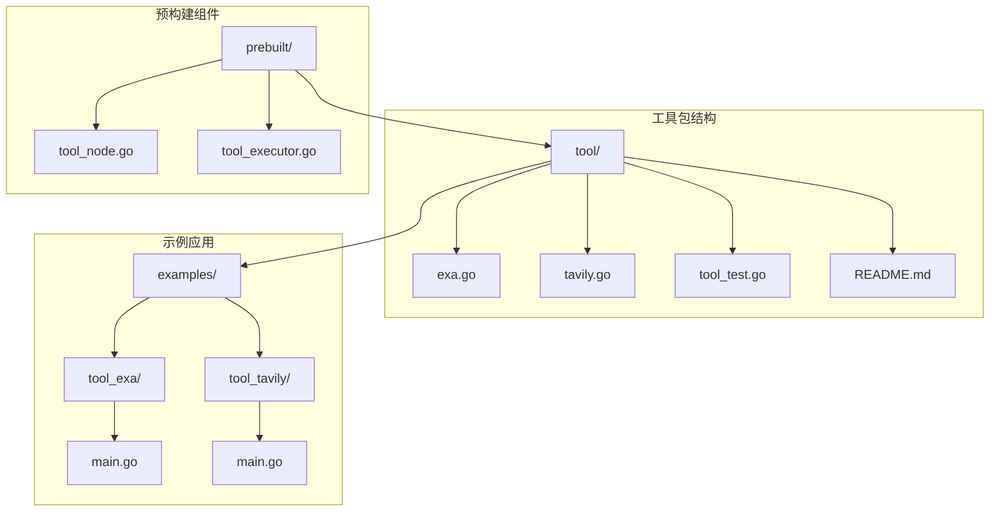
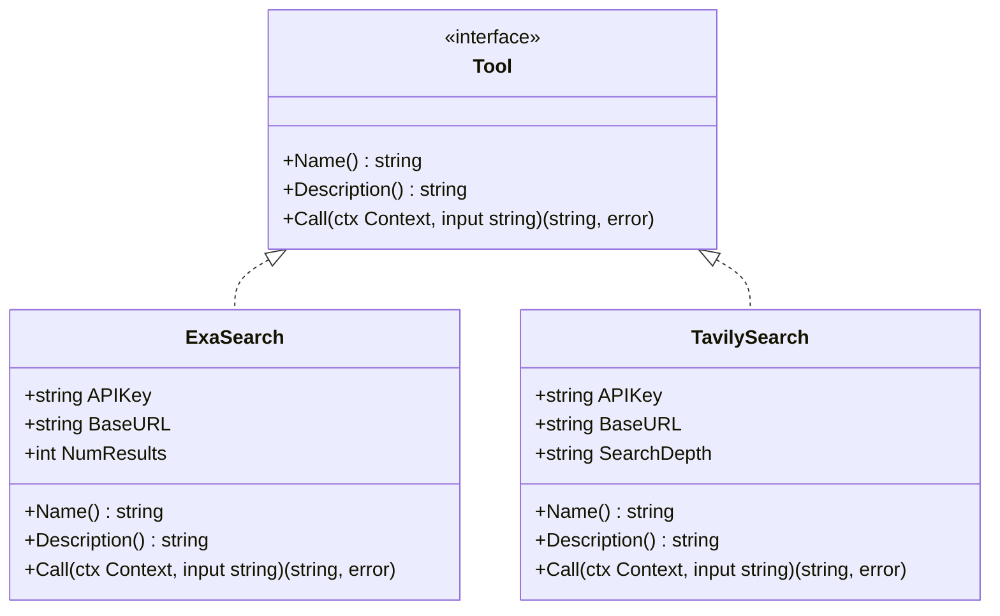
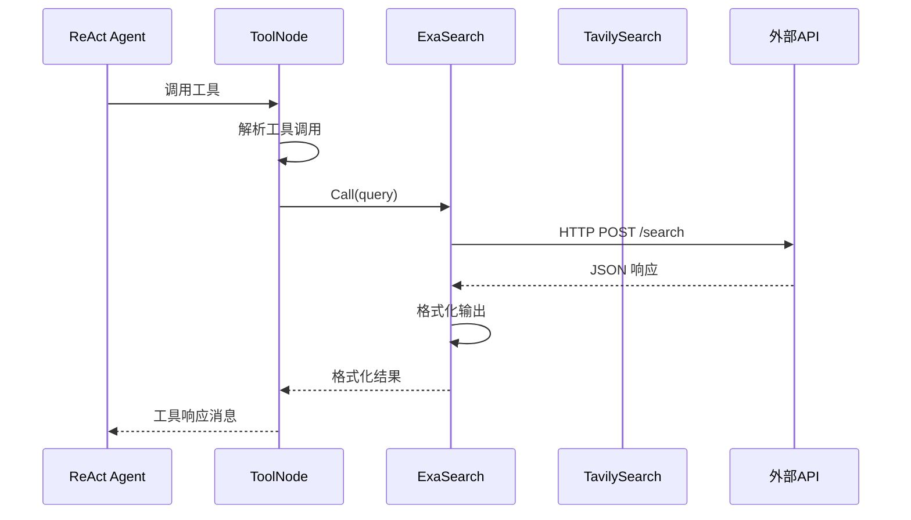
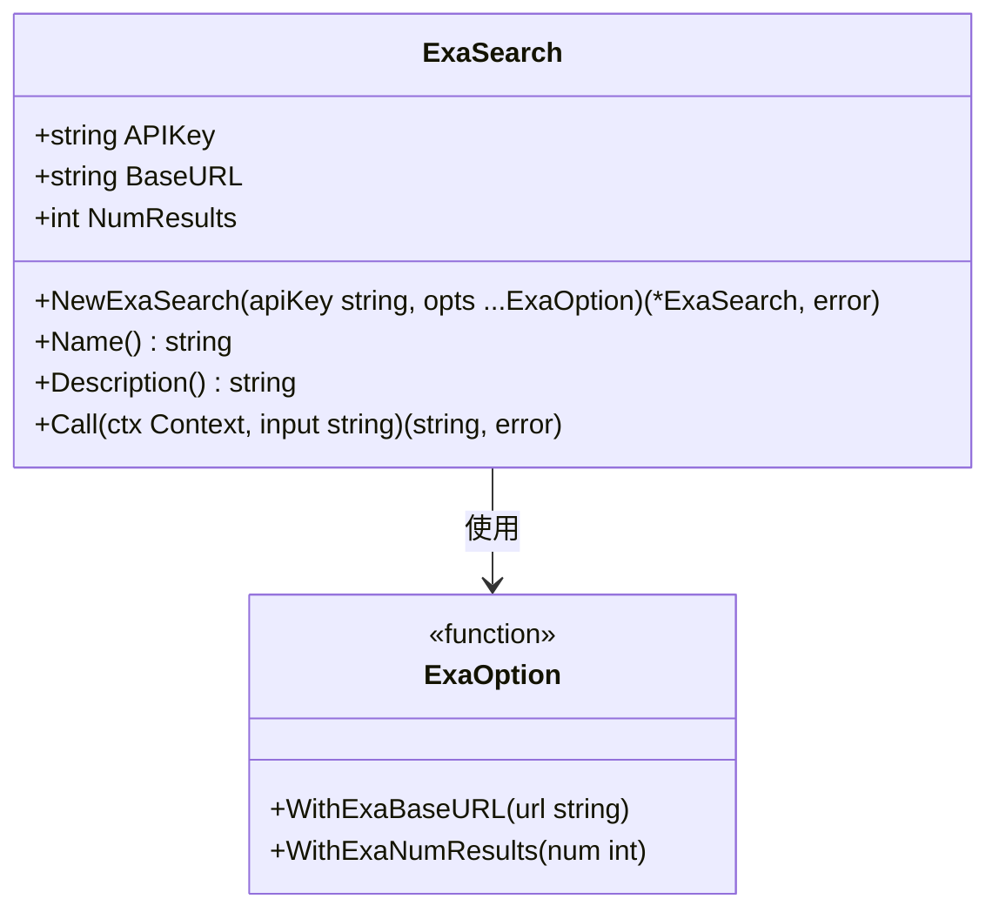
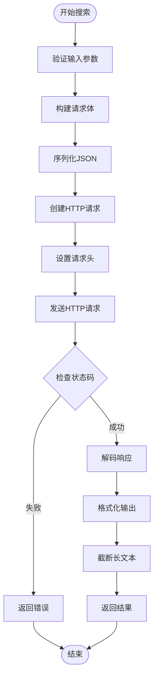
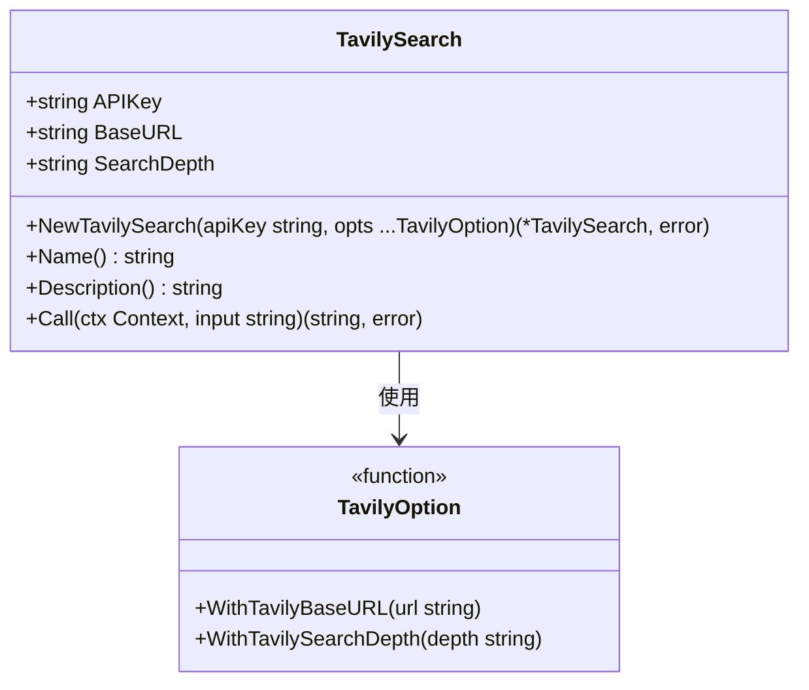
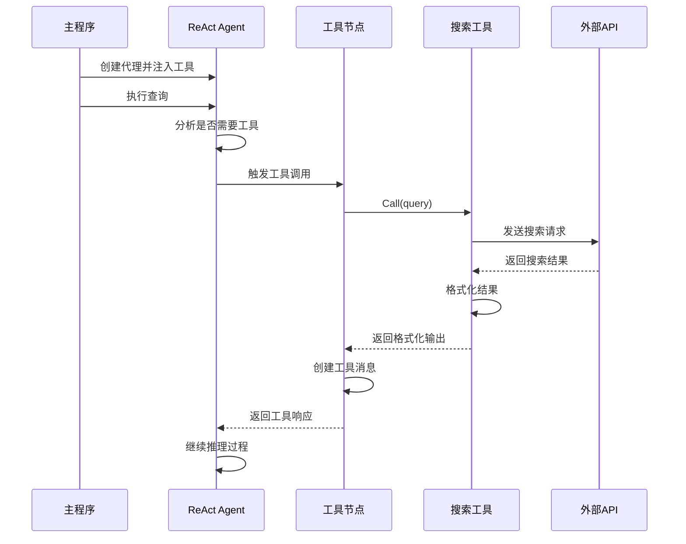
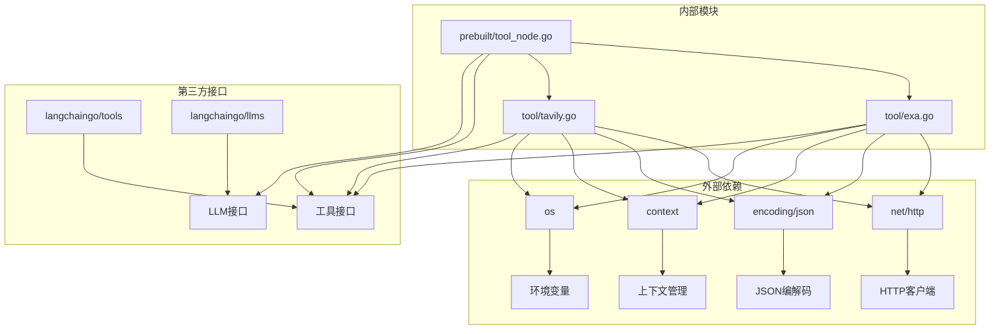

# 具体工具集成

<cite>
**本文档引用的文件**
- [tool/exa.go](file://tool/exa.go)
- [tool/tavily.go](file://tool/tavily.go)
- [tool/tool_test.go](file://tool/tool_test.go)
- [examples/tool_exa/main.go](file://examples/tool_exa/main.go)
- [examples/tool_tavily/main.go](file://examples/tool_tavily/main.go)
- [prebuilt/tool_node.go](file://prebuilt/tool_node.go)
- [tool/README.md](file://tool/README.md)
</cite>

## 目录
1. [简介](#简介)
2. [项目结构](#项目结构)
3. [核心组件](#核心组件)
4. [架构概览](#架构概览)
5. [详细组件分析](#详细组件分析)
6. [依赖关系分析](#依赖关系分析)
7. [性能考虑](#性能考虑)
8. [故障排除指南](#故障排除指南)
9. [结论](#结论)

## 简介

本文档详细介绍了 LangGraphGo 中 Exa 和 Tavily 搜索工具的集成实现。这两个工具都实现了 `langchaingo` 的标准工具接口，为语言模型提供了强大的网络搜索能力。通过统一的接口设计和灵活的配置选项，开发者可以轻松地将这些搜索工具集成到智能代理系统中。

## 项目结构



**图表来源**
- [tool/exa.go](file://tool/exa.go#L1-L128)
- [tool/tavily.go](file://tool/tavily.go#L1-L122)
- [examples/tool_exa/main.go](file://examples/tool_exa/main.go#L1-L73)
- [examples/tool_tavily/main.go](file://examples/tool_tavily/main.go#L1-L78)

**章节来源**
- [tool/exa.go](file://tool/exa.go#L1-L128)
- [tool/tavily.go](file://tool/tavily.go#L1-L122)
- [tool/README.md](file://tool/README.md#L1-L57)

## 核心组件

### 工具接口设计

所有搜索工具都遵循 `langchaingo` 的标准工具接口：



**图表来源**
- [tool/exa.go](file://tool/exa.go#L13-L18)
- [tool/tavily.go](file://tool/tavily.go#L13-L18)

### 配置选项模式

两个工具都采用了可选参数（Options）模式来提供灵活的配置：

| 配置项 | ExaSearch | TavilySearch | 类型 | 默认值 |
|--------|-----------|--------------|------|--------|
| APIKey | ✅ | ✅ | string | 环境变量 |
| BaseURL | ✅ | ✅ | string | 固定值 |
| NumResults | ✅ | ❌ | int | 5 |
| SearchDepth | ❌ | ✅ | string | "basic" |

**章节来源**
- [tool/exa.go](file://tool/exa.go#L20-L35)
- [tool/tavily.go](file://tool/tavily.go#L20-L35)

## 架构概览



**图表来源**
- [prebuilt/tool_node.go](file://prebuilt/tool_node.go#L54-L96)
- [tool/exa.go](file://tool/exa.go#L71-L127)
- [tool/tavily.go](file://tool/tavily.go#L72-L121)

## 详细组件分析

### ExaSearch 结构体分析

#### 字段含义



**图表来源**
- [tool/exa.go](file://tool/exa.go#L13-L18)
- [tool/exa.go](file://tool/exa.go#L20-L35)

#### 构造函数设计

`NewExaSearch` 函数实现了智能的 API 密钥处理：

1. **环境变量回退机制**：如果传入的 `apiKey` 为空，自动从 `EXA_API_KEY` 环境变量读取
2. **验证检查**：确保 API 密钥存在，否则返回错误
3. **默认配置**：设置基础 URL 为 `https://api.exa.ai`，结果数量为 5

#### Call 方法实现



**图表来源**
- [tool/exa.go](file://tool/exa.go#L71-L127)

**章节来源**
- [tool/exa.go](file://tool/exa.go#L36-L57)
- [tool/exa.go](file://tool/exa.go#L71-L127)

### TavilySearch 结构体分析

#### 字段含义



**图表来源**
- [tool/tavily.go](file://tool/tavily.go#L13-L18)
- [tool/tavily.go](file://tool/tavily.go#L20-L35)

#### 搜索深度配置

TavilySearch 提供了独特的 `SearchDepth` 配置：

| 深度级别 | 描述 | 适用场景 |
|----------|------|----------|
| "basic" | 基础搜索 | 快速获取基本信息 |
| "advanced" | 高级搜索 | 需要深入分析的内容 |

#### 错误处理策略

两个工具都实现了统一的错误处理模式：

1. **HTTP 状态码检查**：验证 API 响应状态
2. **JSON 解码错误处理**：捕获数据格式问题
3. **上下文取消处理**：支持超时和取消操作

**章节来源**
- [tool/tavily.go](file://tool/tavily.go#L37-L57)
- [tool/tavily.go](file://tool/tavily.go#L72-L121)

### 工具注册和执行流程



**图表来源**
- [examples/tool_exa/main.go](file://examples/tool_exa/main.go#L33-L42)
- [examples/tool_tavily/main.go](file://examples/tool_tavily/main.go#L35-L44)
- [prebuilt/tool_node.go](file://prebuilt/tool_node.go#L26-L107)

**章节来源**
- [examples/tool_exa/main.go](file://examples/tool_exa/main.go#L33-L42)
- [examples/tool_tavily/main.go](file://examples/tool_tavily/main.go#L35-L44)
- [prebuilt/tool_node.go](file://prebuilt/tool_node.go#L26-L107)

## 依赖关系分析



**图表来源**
- [tool/exa.go](file://tool/exa.go#L3-L11)
- [tool/tavily.go](file://tool/tavily.go#L3-L11)
- [prebuilt/tool_node.go](file://prebuilt/tool_node.go#L3-L10)

**章节来源**
- [tool/exa.go](file://tool/exa.go#L3-L11)
- [tool/tavily.go](file://tool/tavily.go#L3-L11)
- [prebuilt/tool_node.go](file://prebuilt/tool_node.go#L3-L10)

## 性能考虑

### 并发处理

- **HTTP 客户端复用**：每个工具实例使用独立的 HTTP 客户端
- **上下文支持**：支持超时和取消操作
- **连接池管理**：利用 Go 标准库的 HTTP 连接池

### 缓存策略

- **无内置缓存**：工具本身不包含缓存功能
- **建议实现**：可以在应用层实现结果缓存
- **内存优化**：对长文本进行截断处理

### 错误重试

- **指数退避**：建议在应用层实现重试机制
- **超时控制**：通过 context 控制请求超时
- **降级处理**：API 不可用时的备用方案

## 故障排除指南

### 常见错误及解决方案

| 错误类型 | 症状 | 解决方案 |
|----------|------|----------|
| API 密钥缺失 | "EXA_API_KEY not set" 或 "TAVILY_API_KEY not set" | 设置相应的环境变量 |
| HTTP 请求失败 | "failed to send request" | 检查网络连接和 API 可用性 |
| JSON 解码错误 | "failed to decode response" | 检查 API 响应格式 |
| HTTP 状态码异常 | "exa api returned status: 4xx/5xx" | 查看 API 文档了解状态码含义 |

### 认证配置最佳实践

1. **环境变量管理**：
   ```bash
   # Exa API 配置
   export EXA_API_KEY="your_exa_api_key"
   
   # Tavily API 配置  
   export TAVILY_API_KEY="your_tavily_api_key"
   
   # LLM API 配置
   export OPENAI_API_KEY="your_openai_key"
   ```

2. **密钥轮换**：定期更新 API 密钥
3. **权限最小化**：只授予必要的 API 权限
4. **监控告警**：设置 API 使用量监控

### 响应内容格式化

两个工具都实现了文本截断功能：

- **ExaSearch**：文本超过 500 字符时截断
- **TavilySearch**：完整保留原始内容
- **格式一致性**：统一的标题、URL、内容格式

**章节来源**
- [tool/exa.go](file://tool/exa.go#L117-L121)
- [tool/tool_test.go](file://tool/tool_test.go#L14-L107)

## 结论

Exa 和 Tavily 搜索工具为 LangGraphGo 提供了强大而灵活的网络搜索能力。通过统一的接口设计、智能的配置选项和健壮的错误处理，这些工具能够无缝集成到各种智能代理系统中。

### 主要优势

1. **标准化接口**：遵循 `langchaingo` 工具规范
2. **灵活配置**：支持环境变量回退和可选参数
3. **错误处理**：完善的错误检测和处理机制
4. **格式化输出**：一致的结果格式化
5. **并发安全**：线程安全的设计

### 使用建议

- **ExaSearch**：适合需要高质量内容和神经搜索的应用
- **TavilySearch**：适合需要快速搜索和高级分析的应用
- **组合使用**：根据具体需求选择合适的工具或组合使用
- **性能优化**：在应用层实现适当的缓存和重试机制

通过合理配置和使用这些工具，开发者可以构建出功能强大、响应迅速的智能搜索代理系统。