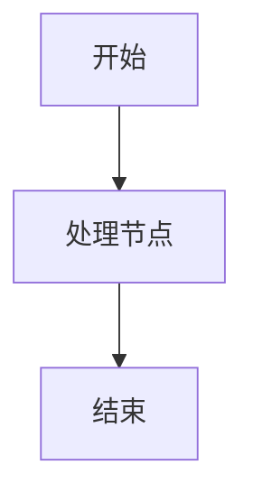
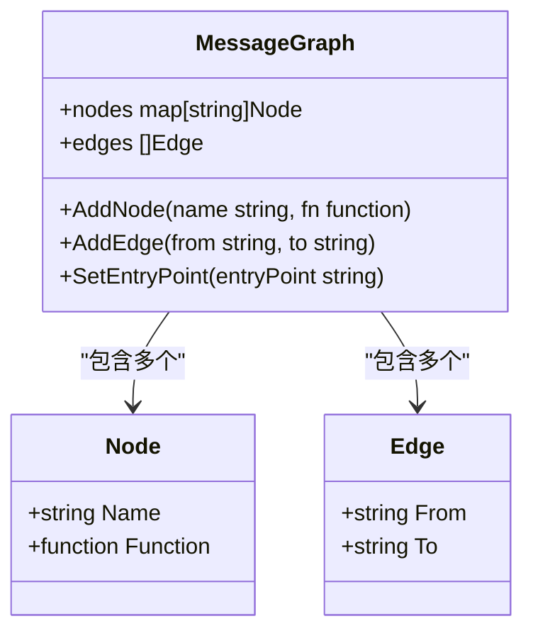
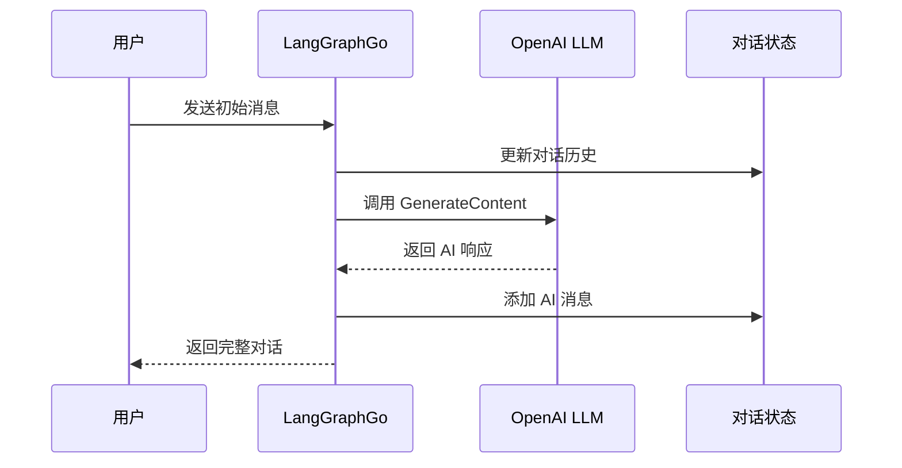

# LangGraphGo 快速入门指南

<cite>
**本文档中引用的文件**
- [examples/basic_example/main.go](file://examples/basic_example/main.go)
- [examples/configuration/main.go](file://examples/configuration/main.go)
- [examples/basic_llm/main.go](file://examples/basic_llm/main.go)
- [go.mod](file://go.mod)
- [README.md](file://README.md)
- [examples/basic_example/README.md](file://examples/basic_example/README.md)
- [examples/basic_llm/README.md](file://examples/basic_llm/README.md)
- [graph/graph.go](file://graph/graph.go)
</cite>

## 目录
1. [简介](#简介)
2. [环境准备](#环境准备)
3. [安装依赖](#安装依赖)
4. [创建第一个简单图](#创建第一个简单图)
5. [添加节点和边](#添加节点和边)
6. [设置入口点和编译图](#设置入口点和编译图)
7. [运行基本示例](#运行基本示例)
8. [配置基础设置](#配置基础设置)
9. [集成 LLM 示例](#集成-llm-示例)
10. [常见问题排查](#常见问题排查)
11. [总结](#总结)

## 简介

LangGraphGo 是一个强大的 Go 语言工作流编排库，灵感来源于 Python 的 LangGraph。它提供了类似的状态机模式，允许开发者通过定义节点和边来构建复杂的业务流程。本指南将帮助您在几分钟内掌握 LangGraphGo 的核心概念，并成功运行第一个应用程序。

### 核心特性

- **简单易用**：直观的 API 设计，适合 Go 开发者
- **类型安全**：完整的 Go 类型系统支持
- **并发执行**：自动并行处理独立的节点
- **状态管理**：内置状态持久化和恢复机制
- **可视化**：支持图形化表示和调试
- **LLM 集成**：原生支持大型语言模型

## 环境准备

### Go 版本要求

LangGraphGo 要求 Go 1.23.0 或更高版本。请确保您的开发环境已正确安装 Go：

```bash
# 检查 Go 版本
go version
```

如果版本低于 1.23.0，请升级到最新稳定版本。

### 创建项目目录

```bash
# 创建项目目录
mkdir langgraphgo-tutorial
cd langgraphgo-tutorial
```

## 安装依赖

### 获取 LangGraphGo 包

```bash
# 安装核心包
go get github.com/smallnest/langgraphgo
```

### 可选依赖

根据您的需求，可能需要安装以下可选依赖：

```bash
# 如果需要 LLM 集成
go get github.com/tmc/langchaingo

# 如果需要数据库检查点存储
go get github.com/mattn/go-sqlite3
go get github.com/redis/go-redis/v9
go get github.com/jackc/pgx/v5
```

**节源码**
- [go.mod](file://go.mod#L1-L78)

## 创建第一个简单图

让我们从最简单的例子开始。我们将创建一个只包含单个节点的消息图。

### 基本结构

```go
package main

import (
    "context"
    "fmt"
    "github.com/smallnest/langgraphgo/graph"
)

func main() {
    // 1. 创建图实例
    g := graph.NewMessageGraph()
    
    // 2. 添加节点（稍后详细说明）
    
    // 3. 设置边和入口点（稍后详细说明）
    
    // 4. 编译并执行（稍后详细说明）
}
```

### 图的基本概念

在 LangGraphGo 中，图由以下元素组成：

- **节点（Nodes）**：执行具体任务的函数
- **边（Edges）**：定义节点之间的执行顺序
- **入口点（Entry Point）**：图的起始位置
- **结束点（END）**：图的终止位置



**图表源码**
- [examples/basic_example/main.go](file://examples/basic_example/main.go#L25-L33)

## 添加节点和边

### 添加处理节点

节点是图中执行实际工作的函数。每个节点接收当前状态作为输入，并返回更新后的状态。

```go
// 添加一个简单的处理节点
g.AddNode("process", func(ctx context.Context, state interface{}) (interface{}, error) {
    // 将输入字符串转换为大写
    input := state.(string)
    return fmt.Sprintf("PROCESSED_%s", input), nil
})
```

### 设置节点间连接

使用边来定义节点的执行顺序：

```go
// 设置边：从 process 节点到 END 结束点
g.AddEdge("process", graph.END)
```

### 完整的节点和边配置



**图表源码**
- [graph/graph.go](file://graph/graph.go#L77-L118)

**节源码**
- [examples/basic_example/main.go](file://examples/basic_example/main.go#L25-L33)

## 设置入口点和编译图

### 设置入口点

入口点定义了图执行的起点：

```go
// 设置 process 节点为入口点
g.SetEntryPoint("process")
```

### 编译图

编译过程会验证图的完整性并优化执行路径：

```go
// 编译图以获得可执行实例
runnable, err := g.Compile()
if err != nil {
    panic(err)
}
```

### 执行图

```go
// 使用初始状态调用图
result, err := runnable.Invoke(context.Background(), "hello_world")
if err != nil {
    panic(err)
}

fmt.Printf("结果: %s\n", result)
```

**节源码**
- [examples/basic_example/main.go](file://examples/basic_example/main.go#L35-L37)

## 运行基本示例

让我们运行完整的第一个示例来验证一切正常工作。

### 复制示例代码

```bash
# 进入示例目录
cd examples/basic_example

# 运行示例
go run main.go
```

### 预期输出

```
🚀 LangGraphGo Basic Example
============================

1️⃣ Basic Graph Execution
   Result: processed_input

2️⃣ Streaming with Listeners
   Streamed Result: streamed_stream_input

3️⃣ Checkpointing Example
   Final State: map[input:checkpoint_test step1:completed step2:completed]
   Created 1 checkpoints

4️⃣ Graph Visualization
   📊 Mermaid Diagram:
      flowchart TD
      A["visualize_step1"] --> B["visualize_step2"]
      B --> C["END"]
      
   🌳 ASCII Tree:
      visualize_step1
      ├── visualize_step2
      └── END
```

### 代码逐行解析

让我们深入理解每个部分的功能：

#### 基础执行示例

```go
// 创建消息图
g := graph.NewMessageGraph()

// 添加处理节点
g.AddNode("process", func(ctx context.Context, state interface{}) (interface{}, error) {
    input := state.(string)           // 获取输入状态
    return fmt.Sprintf("processed_%s", input), nil  // 返回处理结果
})

// 设置边和入口点
g.AddEdge("process", graph.END)
g.SetEntryPoint("process")

// 编译并执行
runnable, _ := g.Compile()
result, _ := runnable.Invoke(context.Background(), "input")
```

#### 流式监听器示例

```go
// 创建可监听的消息图
g := graph.NewListenableMessageGraph()

// 添加带有延迟的处理节点
g.AddNode("stream_process", func(ctx context.Context, state interface{}) (interface{}, error) {
    time.Sleep(100 * time.Millisecond) // 模拟工作负载
    return fmt.Sprintf("streamed_%v", state), nil
})

// 添加进度监听器
progressListener := graph.NewProgressListener().WithTiming(false)
progressListener.SetNodeStep("stream_process", "🔄 Processing with streaming")
node.AddListener(progressListener)
```

#### 检查点示例

```go
// 创建可检查点的消息图
g := graph.NewCheckpointableMessageGraph()

// 添加多个步骤节点
g.AddNode("checkpoint_step1", func(ctx context.Context, state interface{}) (interface{}, error) {
    data := state.(map[string]interface{})
    data["step1"] = "completed"
    return data, nil
})

// 配置检查点存储
config := graph.CheckpointConfig{
    Store:          graph.NewMemoryCheckpointStore(),
    AutoSave:       true,
    MaxCheckpoints: 5,
}
g.SetCheckpointConfig(config)
```

**节源码**
- [examples/basic_example/main.go](file://examples/basic_example/main.go#L22-L138)
- [examples/basic_example/README.md](file://examples/basic_example/README.md#L1-L85)

## 配置基础设置

LangGraphGo 支持灵活的配置系统，允许在运行时传递自定义参数。

### 创建配置结构

```go
// 用户配置结构
type UserConfig struct {
    UserID    string
    RequestID string
    Verbose   bool
}
```

### 配置传递机制

```go
// 在节点中访问配置
g.AddNode("process", func(ctx context.Context, state interface{}) (interface{}, error) {
    // 从上下文中获取配置
    config := graph.GetConfig(ctx)
    
    // 访问标准配置字段
    if threadID, ok := config.Configurable["thread_id"]; ok {
        fmt.Printf("[Node] 处理线程 ID: %v\n", threadID)
    }
    
    // 访问自定义元数据
    if userID, ok := config.Metadata["user_id"]; ok {
        fmt.Printf("[Node] 用户 ID: %v\n", userID)
    }
    
    return fmt.Sprintf("处理完成于 %v", config.Metadata["user_id"]), nil
})
```

### 设置运行时配置

```go
// 准备运行时配置
config := &graph.Config{
    Configurable: map[string]interface{}{
        "thread_id": "thread-123",
    },
    Metadata: map[string]interface{}{
        "user_id":    "alice",
        "request_id": "req-456",
        "verbose":    true,
    },
}

// 使用配置调用
res, err := runnable.InvokeWithConfig(context.Background(), "start", config)
```

### 配置选项详解

| 配置项 | 类型 | 描述 | 示例值 |
|--------|------|------|--------|
| Configurable | map[string]interface{} | 可配置的参数 | `{"thread_id": "thread-123"}` |
| Metadata | map[string]interface{} | 元数据信息 | `{"user_id": "alice", "request_id": "req-456"}` |
| InterruptBefore | []string | 中断前的节点列表 | `[]string{"human_review"}` |
| ResumeFrom | []string | 从中断点恢复的节点列表 | `[]string{"human_review"}` |

**节源码**
- [examples/configuration/main.go](file://examples/configuration/main.go#L1-L72)

## 集成 LLM 示例

LangGraphGo 与 LangChain Go 无缝集成，可以轻松使用各种大型语言模型。

### 设置 LLM 环境

```bash
# 导入 OpenAI API 密钥
export OPENAI_API_KEY="your-api-key-here"
```

### 基本 LLM 集成

```go
package main

import (
    "context"
    "fmt"
    "github.com/smallnest/langgraphgo/graph"
    "github.com/tmc/langchaingo/llms"
    "github.com/tmc/langchaingo/llms/openai"
)

func main() {
    // 1. 创建 LLM 客户端
    model, err := openai.New()
    if err != nil {
        panic(err)
    }
    
    // 2. 创建图
    g := graph.NewMessageGraph()
    
    // 3. 添加 LLM 处理节点
    g.AddNode("generate", func(ctx context.Context, state interface{}) (interface{}, error) {
        messages := state.([]llms.MessageContent)
        
        // 使用 LangChain 生成响应
        response, err := model.GenerateContent(ctx, messages,
            llms.WithTemperature(0.7),
        )
        if err != nil {
            return nil, err
        }
        
        // 将 AI 响应添加到消息历史
        return append(messages,
            llms.TextParts("ai", response.Choices[0].Content),
        ), nil
    })
    
    // 4. 设置图结构
    g.AddEdge("generate", graph.END)
    g.SetEntryPoint("generate")
    
    // 5. 编译并执行
    runnable, err := g.Compile()
    if err != nil {
        panic(err)
    }
    
    // 6. 初始化对话
    ctx := context.Background()
    initialMessages := []llms.MessageContent{
        llms.TextParts("human", "1 + 1 等于多少？"),
    }
    
    // 7. 获取响应
    res, err := runnable.Invoke(ctx, initialMessages)
    if err != nil {
        panic(err)
    }
    
    // 8. 显示结果
    messages := res.([]llms.MessageContent)
    fmt.Println("AI 回答:", messages[len(messages)-1].Parts[0])
}
```

### LLM 集成架构



**图表源码**
- [examples/basic_llm/main.go](file://examples/basic_llm/main.go#L22-L36)

### LLM 配置选项

| 参数 | 类型 | 默认值 | 描述 |
|------|------|--------|------|
| Temperature | float64 | 0.7 | 控制输出随机性 |
| TopP | float64 | 1.0 | 核采样参数 |
| MaxTokens | int | 2048 | 最大生成令牌数 |
| Stop | []string | nil | 停止序列 |

**节源码**
- [examples/basic_llm/main.go](file://examples/basic_llm/main.go#L1-L60)
- [examples/basic_llm/README.md](file://examples/basic_llm/README.md#L1-L89)

## 常见问题排查

### 1. 导入错误

**问题**：无法导入 `github.com/smallnest/langgraphgo`

**解决方案**：
```bash
# 确保已安装包
go get github.com/smallnest/langgraphgo

# 清理模块缓存
go clean -modcache

# 重新下载依赖
go mod tidy
```

### 2. 编译错误

**问题**：编译时出现类型不匹配错误

**解决方案**：
```go
// 确保类型断言正确
g.AddNode("process", func(ctx context.Context, state interface{}) (interface{}, error) {
    // 正确的类型断言
    input := state.(string)  // 如果期望字符串
    // 或
    input := state.(map[string]interface{})  // 如果期望映射
    return processedData, nil
})
```

### 3. LLM 集成问题

**问题**：OpenAI API 调用失败

**解决方案**：
```go
// 检查 API 密钥
if os.Getenv("OPENAI_API_KEY") == "" {
    fmt.Println("请设置 OPENAI_API_KEY 环境变量")
    return
}

// 添加错误处理
response, err := model.GenerateContent(ctx, messages)
if err != nil {
    fmt.Printf("LLM 调用失败: %v\n", err)
    return nil, err
}
```

### 4. 并发问题

**问题**：状态共享导致的数据竞争

**解决方案**：
```go
// 使用不可变状态或适当的同步机制
g.AddNode("safe_process", func(ctx context.Context, state interface{}) (interface{}, error) {
    // 复制状态以避免修改原始数据
    newState := make(map[string]interface{})
    for k, v := range state.(map[string]interface{}) {
        newState[k] = v
    }
    newState["processed"] = true
    return newState, nil
})
```

### 5. 性能问题

**问题**：图执行速度慢

**优化建议**：
- 使用并行节点减少执行时间
- 实现适当的检查点机制
- 优化节点函数的实现

## 总结

通过本快速入门指南，您已经学会了：

1. **环境搭建**：安装 Go 和 LangGraphGo 依赖
2. **基础概念**：理解节点、边、入口点等核心概念
3. **基本操作**：创建图、添加节点、设置边和执行
4. **高级功能**：配置管理、流式处理、检查点存储
5. **LLM 集成**：与 OpenAI 等 LLM 服务的集成
6. **问题排查**：常见问题的诊断和解决方法

### 下一步建议

- 探索更复杂的图结构和并行执行
- 学习状态 schema 和自定义 reducer
- 实践人类在环路（HITL）工作流
- 构建生产级的应用程序

### 学习资源

- [官方文档](https://pkg.go.dev/github.com/smallnest/langgraphgo)
- [GitHub 仓库](https://github.com/smallnest/langgraphgo)
- [示例代码](file://examples/basic_example/main.go)
- [社区支持](https://github.com/smallnest/langgraphgo/discussions)

现在，您已经具备了使用 LangGraphGo 构建复杂工作流的基础知识。开始构建您的第一个 LangGraphGo 应用程序吧！