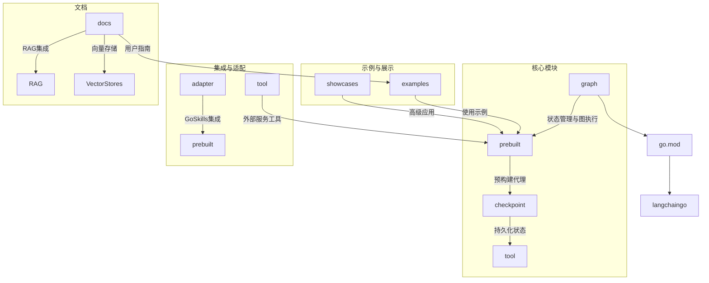
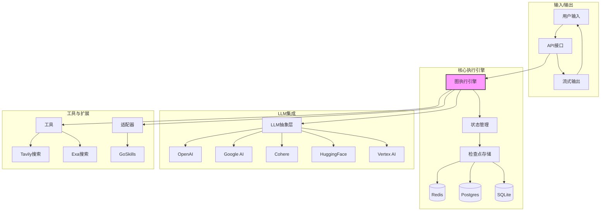
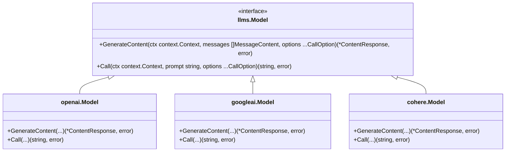
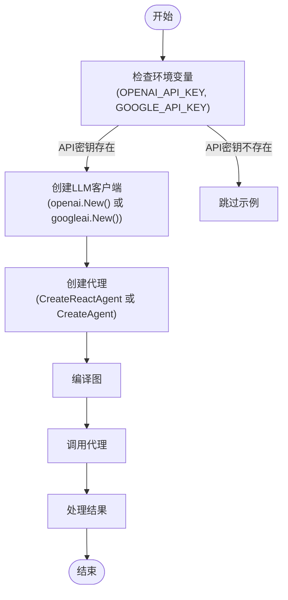
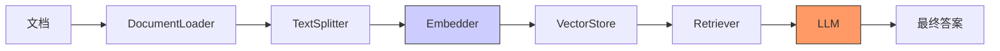
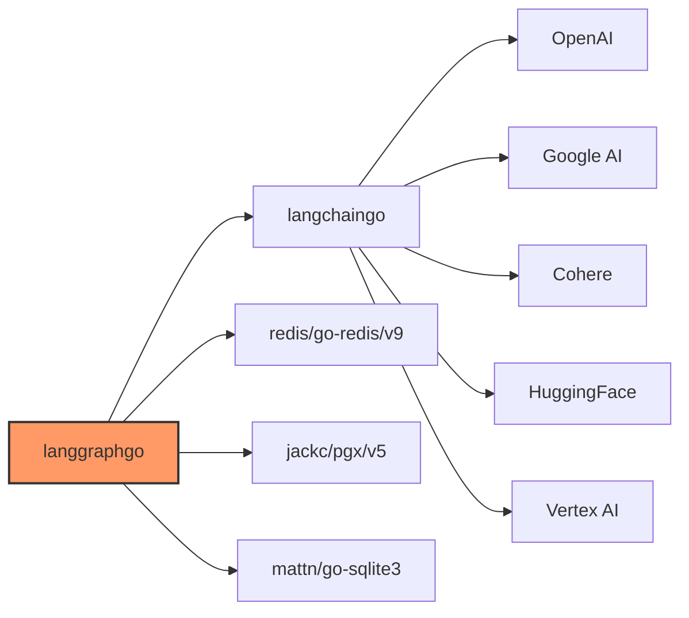

# LLM提供者灵活性

<cite>
**本文档中引用的文件**   
- [main.go](file://examples/basic_llm/main.go)
- [main.go](file://examples/langchain_example/main.go)
- [create_agent.go](file://prebuilt/create_agent.go)
- [react_agent.go](file://prebuilt/react_agent.go)
- [rag.go](file://prebuilt/rag.go)
- [rag_langchain_adapter.go](file://prebuilt/rag_langchain_adapter.go)
- [config.go](file://showcases/open_deep_research/config.go)
- [README.md](file://examples/langchain_example/README.md)
- [EMBEDDINGS_INTEGRATION.md](file://docs/RAG/EMBEDDINGS_INTEGRATION.md)
</cite>

## 目录
1. [简介](#简介)
2. [项目结构](#项目结构)
3. [核心组件](#核心组件)
4. [架构概述](#架构概述)
5. [详细组件分析](#详细组件分析)
6. [依赖分析](#依赖分析)
7. [性能考虑](#性能考虑)
8. [故障排除指南](#故障排除指南)
9. [结论](#结论)

## 简介
LangGraphGo 是一个功能强大的框架，旨在实现与多种大型语言模型（LLM）提供者的无缝集成。该框架通过抽象化底层 LLM 实现，为开发者提供了极大的灵活性，使其能够轻松地在不同的模型提供商之间切换，而无需修改核心业务逻辑。这种设计不仅简化了开发流程，还增强了应用程序的可维护性和可扩展性。通过利用 LangChain Go 库，LangGraphGo 能够支持包括 OpenAI、Google AI（Gemini）、Cohere、HuggingFace 和 Vertex AI 在内的多种 LLM 提供商。此外，框架还提供了丰富的配置选项，允许开发者根据具体需求定制模型行为，例如调整温度、最大 token 数等参数。本文档将深入探讨 LangGraphGo 如何实现 LLM 提供者灵活性，并提供具体的代码示例和最佳实践。

## 项目结构
LangGraphGo 项目的目录结构清晰，便于开发者快速定位和理解各个组件的功能。核心功能主要分布在 `graph`、`prebuilt` 和 `checkpoint` 目录下，而各种示例和展示则位于 `examples` 和 `showcases` 目录中。`tool` 目录包含了与外部服务（如 Tavily 和 Exa）集成的工具，`adapter` 目录则提供了与其他框架（如 GoSkills）的适配器。`docs` 目录包含了详细的文档，帮助开发者了解如何使用框架的各种特性。

**图源**
- [go.mod](file://go.mod#L1-L85)

**本节来源**
- [go.mod](file://go.mod#L1-L85)

## 核心组件
LangGraphGo 的核心组件围绕着图（Graph）的概念构建，通过定义节点（Node）和边（Edge）来组织复杂的 AI 工作流。`graph` 包提供了创建和管理图的基本功能，包括消息图（MessageGraph）、状态图（StateGraph）和可检查点图（CheckpointableMessageGraph）。`prebuilt` 包则提供了一系列预构建的代理工厂，如 `CreateAgent`、`CreateReactAgent` 和 `CreateSupervisor`，这些工厂函数简化了复杂代理的创建过程。`checkpoint` 包支持将图的状态持久化到 Redis、Postgres 或 SQLite 中，从而实现长时间运行任务的恢复和中断。`tool` 包集成了 Tavily 和 Exa 等搜索工具，使代理能够访问外部信息。

**本节来源**
- [graph](file://graph)
- [prebuilt](file://prebuilt)
- [checkpoint](file://checkpoint)
- [tool](file://tool)

## 架构概述
LangGraphGo 的架构设计旨在提供一个灵活且可扩展的平台，用于构建基于 LLM 的应用程序。其核心是一个基于图的状态机，其中节点代表执行单元（通常是调用 LLM 或执行工具），边代表控制流。通过 `langchaingo` 库，框架能够与多种 LLM 提供商进行交互，实现了 LLM 提供者的抽象化。开发者可以通过简单的配置切换不同的 LLM，而无需修改图的结构。此外，框架支持并行执行、持久化状态、人类在环（HITL）和高级流式传输等特性，使其适用于各种复杂的场景。

**图源**
- [graph](file://graph)
- [prebuilt](file://prebuilt)
- [checkpoint](file://checkpoint)
- [tool](file://tool)

## 详细组件分析

### LLM集成与抽象
LangGraphGo 通过 `langchaingo` 库实现了对多种 LLM 提供商的集成。`langchaingo` 提供了一个统一的接口，使得不同提供商的 LLM 可以被一致地调用。在代码中，LLM 实例通常通过 `New()` 函数创建，并作为参数传递给代理工厂函数。例如，在 `examples/langchain_example/main.go` 中，可以通过 `openai.New()` 或 `googleai.New(ctx)` 来创建 OpenAI 或 Google AI 的客户端。这种设计使得切换 LLM 提供商变得非常简单，只需更改导入的包和创建客户端的代码即可。

#### LLM抽象接口

**图源**
- [langchaingo/llms](https://pkg.go.dev/github.com/tmc/langchaingo/llms)

**本节来源**
- [examples/langchain_example/main.go](file://examples/langchain_example/main.go#L78-L136)
- [prebuilt/react_agent.go](file://prebuilt/react_agent.go#L14-L181)

### 预构建代理工厂
`prebuilt` 包中的 `CreateAgent` 和 `CreateReactAgent` 函数是创建复杂代理的便捷方式。这些函数接受一个 `llms.Model` 实例和一组工具作为参数，并返回一个可执行的图。通过这种方式，开发者可以轻松地将不同的 LLM 与工具组合起来，构建出功能强大的代理。例如，`CreateReactAgent` 函数创建了一个能够进行推理和行动（ReAct）的代理，该代理可以根据 LLM 的输出决定是否调用工具。

#### 创建代理的流程

**图源**
- [prebuilt/create_agent.go](file://prebuilt/create_agent.go#L66-L403)
- [prebuilt/react_agent.go](file://prebuilt/react_agent.go#L14-L181)

**本节来源**
- [prebuilt/create_agent.go](file://prebuilt/create_agent.go#L66-L403)
- [prebuilt/react_agent.go](file://prebuilt/react_agent.go#L14-L181)

### RAG与嵌入集成
检索增强生成（RAG）是 LangGraphGo 的一个重要特性，它允许代理从外部知识库中检索相关信息，并将其作为上下文提供给 LLM。`prebuilt/rag.go` 文件定义了 RAG 流水线所需的各种接口，如 `DocumentLoader`、`TextSplitter`、`Embedder` 和 `VectorStore`。通过 `prebuilt/rag_langchain_adapter.go` 文件中的适配器，可以将 `langchaingo` 的组件无缝集成到 RAG 流水线中。例如，可以使用 `embeddings.NewEmbedder(openaiLLM)` 来创建一个基于 OpenAI 的嵌入生成器。

#### RAG流水线

**图源**
- [prebuilt/rag.go](file://prebuilt/rag.go#L1-L47)
- [prebuilt/rag_langchain_adapter.go](file://prebuilt/rag_langchain_adapter.go#L38-L82)

**本节来源**
- [prebuilt/rag.go](file://prebuilt/rag.go#L1-L47)
- [prebuilt/rag_langchain_adapter.go](file://prebuilt/rag_langchain_adapter.go#L38-L82)
- [docs/RAG/EMBEDDINGS_INTEGRATION.md](file://docs/RAG/EMBEDDINGS_INTEGRATION.md#L108-L145)

## 依赖分析
LangGraphGo 的依赖关系清晰，主要依赖于 `langchaingo` 库来实现与 LLM 提供商的交互。`go.mod` 文件列出了项目的所有直接依赖，包括 `github.com/tmc/langchaingo`、`github.com/redis/go-redis/v9`、`github.com/jackc/pgx/v5` 和 `github.com/mattn/go-sqlite3`。这些依赖项分别用于 LLM 集成、Redis 检查点、Postgres 检查点和 SQLite 检查点。通过这些依赖，LangGraphGo 能够提供一个功能完整且可扩展的框架。

**图源**
- [go.mod](file://go.mod#L1-L85)

**本节来源**
- [go.mod](file://go.mod#L1-L85)

## 性能考虑
在使用 LangGraphGo 时，性能是一个重要的考虑因素。选择合适的 LLM 提供商和模型对响应时间和成本有直接影响。例如，`text-embedding-ada-002` 模型在性价比方面表现良好，而 `text-embedding-3-large` 模型则提供最高的质量。对于生成任务，较低的温度值（如 0.2）适用于需要精确和一致输出的场景，而较高的温度值（如 0.9）则适用于需要创造性和多样性的场景。此外，合理配置检查点存储（如使用 Redis 作为内存存储）可以显著提高长时间运行任务的性能。

## 故障排除指南
在使用 LangGraphGo 时，可能会遇到一些常见问题。最常见的问题是环境变量未正确设置。确保 `OPENAI_API_KEY` 或 `GOOGLE_API_KEY` 等环境变量已正确设置，否则 LLM 客户端将无法初始化。可以通过在代码中添加检查来避免此类问题，例如在 `examples/langchain_example/main.go` 中所示。另一个常见问题是依赖项版本不兼容。确保 `go.mod` 文件中的依赖项版本与项目要求一致。如果遇到问题，可以尝试更新依赖项或查阅相关文档。

**本节来源**
- [examples/langchain_example/main.go](file://examples/langchain_example/main.go#L148-L158)
- [examples/langchain_example/README.md](file://examples/langchain_example/README.md#L16-L19)

## 结论
LangGraphGo 通过其灵活的架构和对多种 LLM 提供商的支持，为开发者提供了一个强大的工具，用于构建复杂的 AI 应用程序。通过抽象化 LLM 实现，框架使得在不同提供商之间切换变得简单而高效。预构建的代理工厂和 RAG 集成进一步简化了开发过程，使开发者能够专注于业务逻辑的实现。随着 LLM 技术的不断发展，LangGraphGo 的灵活性和可扩展性将使其成为一个不可或缺的工具。