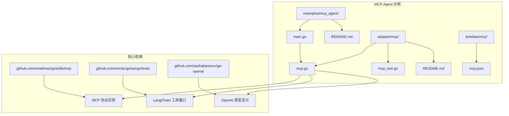
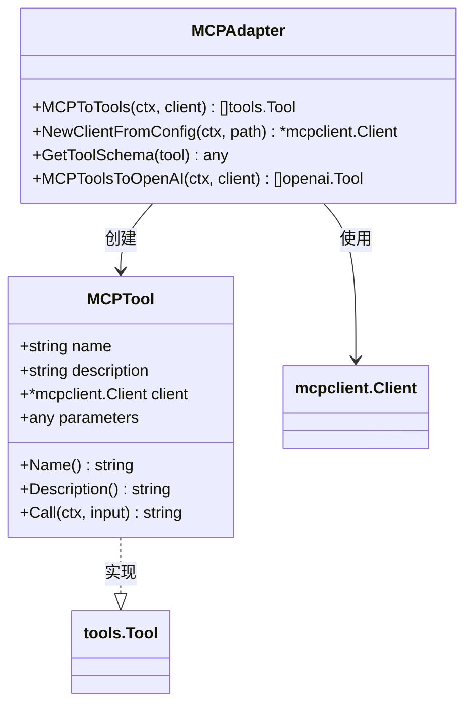
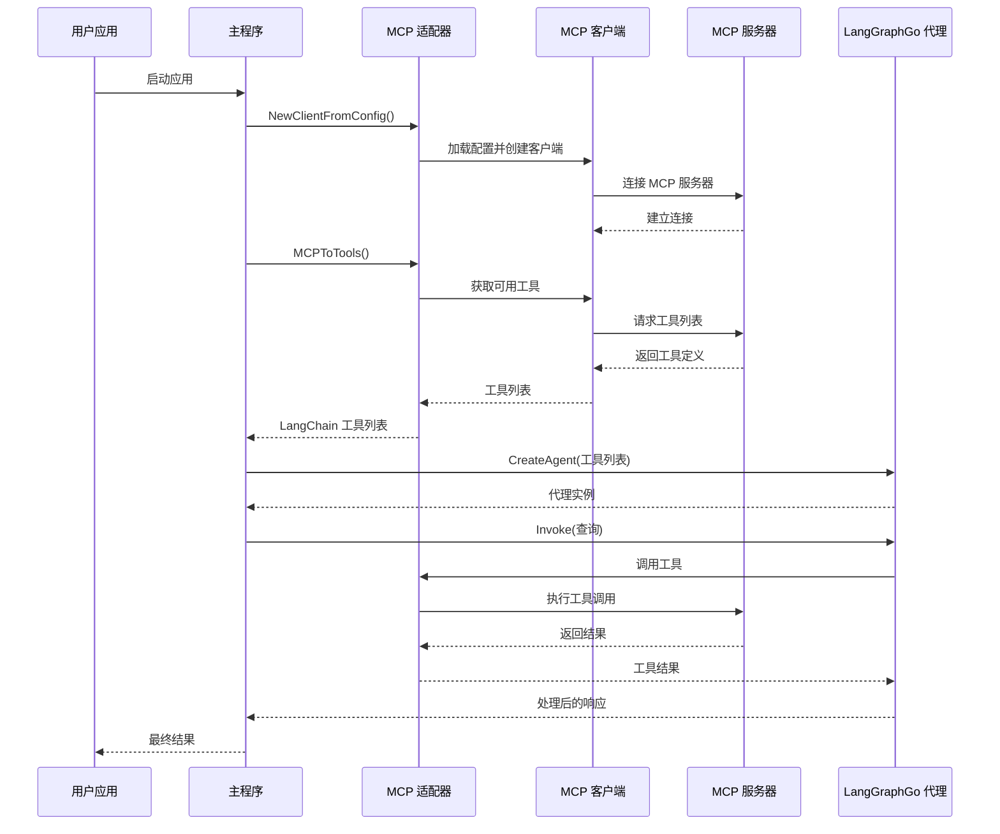
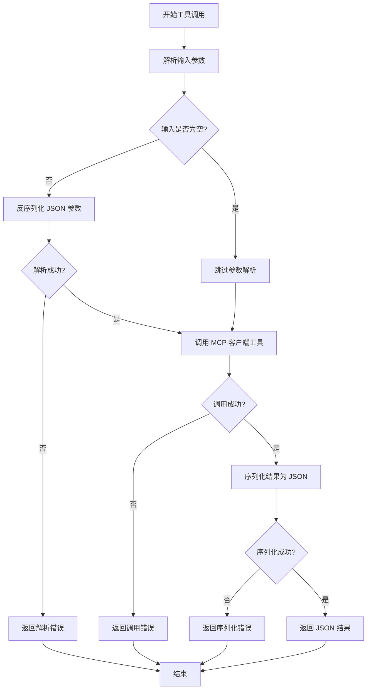
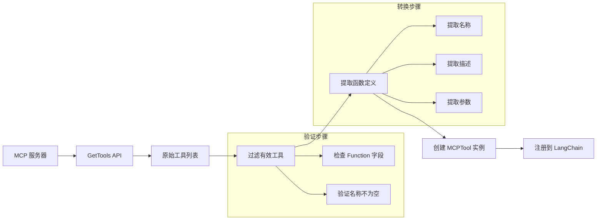
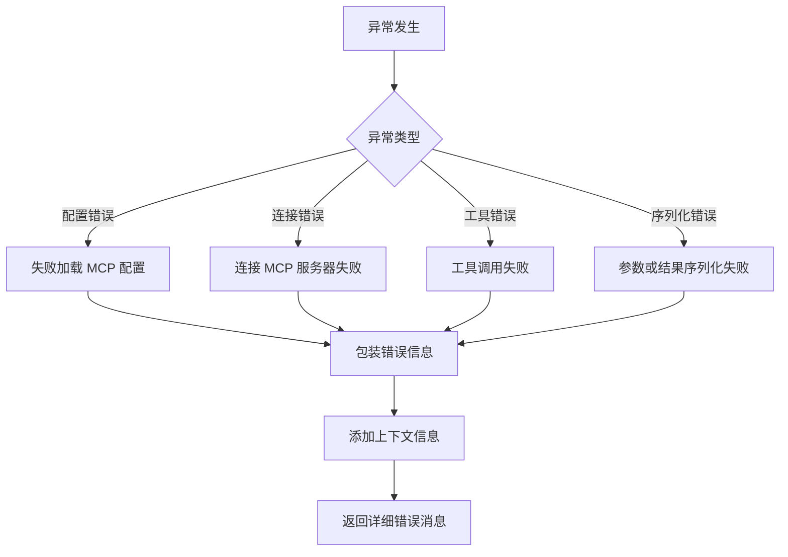
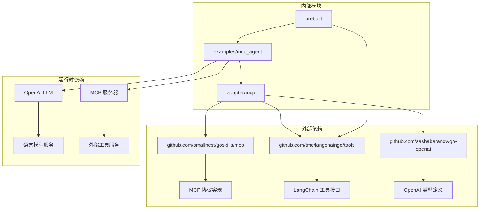

# MCP Agent 示例

<cite>
**本文档中引用的文件**
- [examples/mcp_agent/main.go](file://examples/mcp_agent/main.go)
- [examples/mcp_agent/README.md](file://examples/mcp_agent/README.md)
- [adapter/mcp/mcp.go](file://adapter/mcp/mcp.go)
- [adapter/mcp/mcp_test.go](file://adapter/mcp/mcp_test.go)
- [adapter/mcp/README.md](file://adapter/mcp/README.md)
- [testdata/mcp/mcp.json](file://testdata/mcp/mcp.json)
- [prebuilt/create_agent.go](file://prebuilt/create_agent.go)
</cite>

## 目录
1. [简介](#简介)
2. [项目结构](#项目结构)
3. [核心组件](#核心组件)
4. [架构概览](#架构概览)
5. [详细组件分析](#详细组件分析)
6. [依赖关系分析](#依赖关系分析)
7. [性能考虑](#性能考虑)
8. [故障排除指南](#故障排除指南)
9. [结论](#结论)

## 简介

MCP（Model Context Protocol）代理示例展示了如何在 LangGraphGo 中集成和使用 MCP 工具。该示例演示了如何连接到多个 MCP 服务器，获取可用工具，并将其与 LangGraphGo 预构建的智能代理相结合，以执行复杂的任务。

MCP 是一种协议，允许 AI 模型访问外部工具和服务，而无需直接调用 API。通过 MCP，LangGraphGo 能够无缝集成各种第三方服务，如文件系统、搜索引擎、数据库等，为智能代理提供强大的功能扩展能力。

## 项目结构

MCP Agent 示例的项目结构清晰地组织了核心功能和相关资源：

**图表来源**
- [examples/mcp_agent/main.go](file://examples/mcp_agent/main.go#L1-L86)
- [adapter/mcp/mcp.go](file://adapter/mcp/mcp.go#L1-L113)

**章节来源**
- [examples/mcp_agent/README.md](file://examples/mcp_agent/README.md#L1-L140)
- [adapter/mcp/README.md](file://adapter/mcp/README.md#L1-L211)

## 核心组件

### MCP 客户端适配器

MCP 客户端适配器是整个系统的核心，负责管理与 MCP 服务器的连接和工具转换：

**图表来源**
- [adapter/mcp/mcp.go](file://adapter/mcp/mcp.go#L13-L53)

### 主要功能模块

1. **配置加载**：从 Claude 标准配置文件加载 MCP 服务器设置
2. **工具转换**：将 MCP 工具转换为 LangChain 工具接口
3. **连接管理**：建立和维护与多个 MCP 服务器的连接
4. **错误处理**：提供详细的错误信息和上下文

**章节来源**
- [adapter/mcp/mcp.go](file://adapter/mcp/mcp.go#L55-L113)

## 架构概览

MCP Agent 示例采用分层架构设计，确保了良好的可扩展性和维护性：

**图表来源**
- [examples/mcp_agent/main.go](file://examples/mcp_agent/main.go#L16-L85)
- [adapter/mcp/mcp.go](file://adapter/mcp/mcp.go#L83-L113)

## 详细组件分析

### MCP 工具适配器实现

MCP 工具适配器实现了 LangChain 工具接口，提供了类型安全的工具调用机制：

**图表来源**
- [adapter/mcp/mcp.go](file://adapter/mcp/mcp.go#L31-L53)

### 配置管理系统

MCP 配置系统支持多种传输方式和环境配置：

| 配置项 | 描述 | 示例值 |
|--------|------|--------|
| `command` | 执行命令 | `"npx"` |
| `args` | 命令参数 | `["-y", "@modelcontextprotocol/server-filesystem", "/path"]` |
| `env` | 环境变量 | `{"BRAVE_API_KEY": "your-key"}` |
| `type` | 传输类型 | `"stdio"` 或 `"sse"` |
| `url` | SSE 端点 URL | `"http://localhost:3000/sse"` |

**章节来源**
- [testdata/mcp/mcp.json](file://testdata/mcp/mcp.json#L1-L54)

### 工具转换流程

工具转换过程将 MCP 服务器提供的工具定义转换为 LangChain 兼容的格式：

**图表来源**
- [adapter/mcp/mcp.go](file://adapter/mcp/mcp.go#L58-L80)

**章节来源**
- [adapter/mcp/mcp.go](file://adapter/mcp/mcp.go#L55-L81)

### 错误处理机制

MCP 适配器提供了全面的错误处理机制，确保系统的稳定性和可调试性：

**章节来源**
- [adapter/mcp/mcp.go](file://adapter/mcp/mcp.go#L35-L53)

## 依赖关系分析

MCP Agent 示例的依赖关系体现了模块化设计的优势：

**图表来源**
- [adapter/mcp/mcp.go](file://adapter/mcp/mcp.go#L3-L11)
- [examples/mcp_agent/main.go](file://examples/mcp_agent/main.go#L3-L14)

**章节来源**
- [adapter/mcp/README.md](file://adapter/mcp/README.md#L202-L211)

## 性能考虑

### 并发处理

MCP 客户端支持并发工具调用，但需要注意以下性能优化策略：

1. **连接池管理**：合理管理与 MCP 服务器的连接数量
2. **超时控制**：为工具调用设置适当的超时时间
3. **缓存机制**：缓存频繁使用的工具定义
4. **批量操作**：尽可能合并多个工具调用

### 内存管理

- 工具参数的序列化/反序列化会占用内存
- 长期运行的应用需要定期清理临时数据
- 注意避免内存泄漏，特别是在错误处理路径中

### 网络优化

- 使用连接复用来减少 TCP 握手开销
- 对于 SSE 传输，考虑心跳机制保持连接活跃
- 实现重试机制处理网络波动

## 故障排除指南

### 常见问题及解决方案

#### 连接失败

**症状**：无法连接到 MCP 服务器
**可能原因**：
- MCP 服务器未启动或不可达
- 网络配置错误
- 权限不足

**解决方法**：
1. 验证 MCP 服务器是否正确安装和运行
2. 检查配置文件中的命令和参数
3. 确认环境变量设置正确
4. 使用 `npx <server-package>` 直接测试服务器

#### 工具不可用

**症状**：工具列表为空或工具不显示
**可能原因**：
- 服务器不支持当前 MCP 版本
- 工具注册失败
- 权限限制

**解决方法**：
1. 检查服务器日志输出
2. 验证工具的 JSON Schema 格式
3. 确认服务器支持的工具列表

#### API 密钥问题

**症状**：认证失败或权限被拒绝
**解决方法**：
- 确保所有必需的 API 密钥都已设置
- 检查密钥的有效性和权限范围
- 验证环境变量名拼写正确

**章节来源**
- [examples/mcp_agent/README.md](file://examples/mcp_agent/README.md#L119-L140)

### 调试技巧

1. **启用详细日志**：设置适当的日志级别查看详细信息
2. **单独测试服务器**：使用 `npx` 命令直接测试 MCP 服务器
3. **检查工具定义**：使用 `GetToolSchema` 函数查看工具的 JSON Schema
4. **监控网络连接**：观察与 MCP 服务器的连接状态

**章节来源**
- [adapter/mcp/mcp_test.go](file://adapter/mcp/mcp_test.go#L26-L56)

## 结论

MCP Agent 示例展示了 LangGraphGo 在集成外部工具和服务方面的强大能力。通过 MCP 协议，开发者可以轻松地将各种第三方服务集成到智能代理中，而无需修改核心业务逻辑。

### 主要优势

1. **标准化接口**：MCP 提供了统一的工具访问接口
2. **类型安全**：完整的 Go 类型系统保证了编译时安全
3. **易于扩展**：新的 MCP 服务器可以轻松添加到现有系统
4. **错误处理**：完善的错误处理和调试支持

### 应用场景

- **智能助手**：结合文件系统、搜索服务等工具
- **自动化工作流**：集成数据库、API 等外部服务
- **数据分析**：连接各种数据源和分析工具
- **开发工具**：集成代码编辑、版本控制等功能

### 未来发展方向

随着 MCP 生态系统的不断发展，MCP Agent 示例将继续演进，支持更多的传输方式、更丰富的工具类型，以及更强大的协作功能。开发者可以基于这个示例构建更加复杂和智能的应用系统。