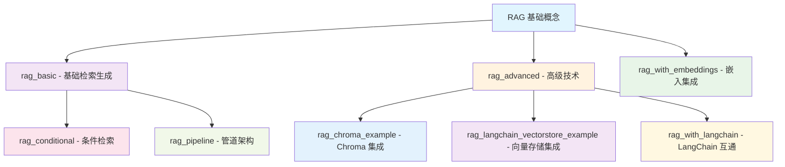
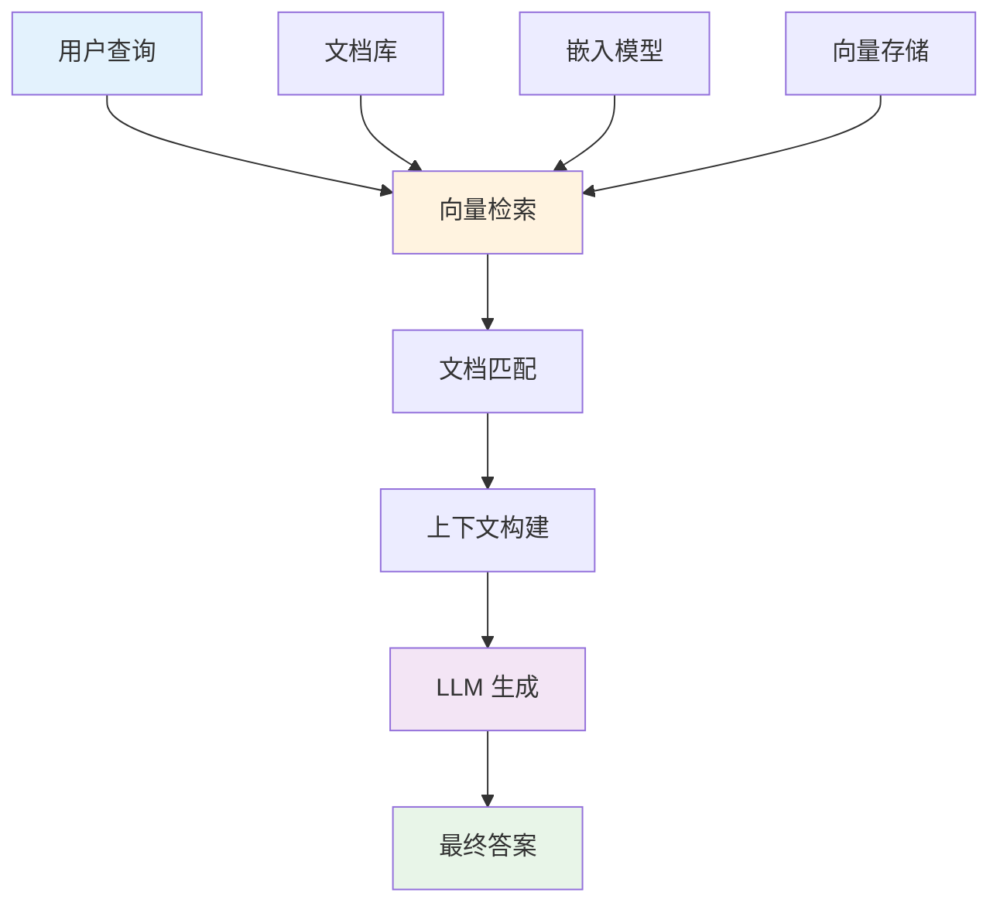
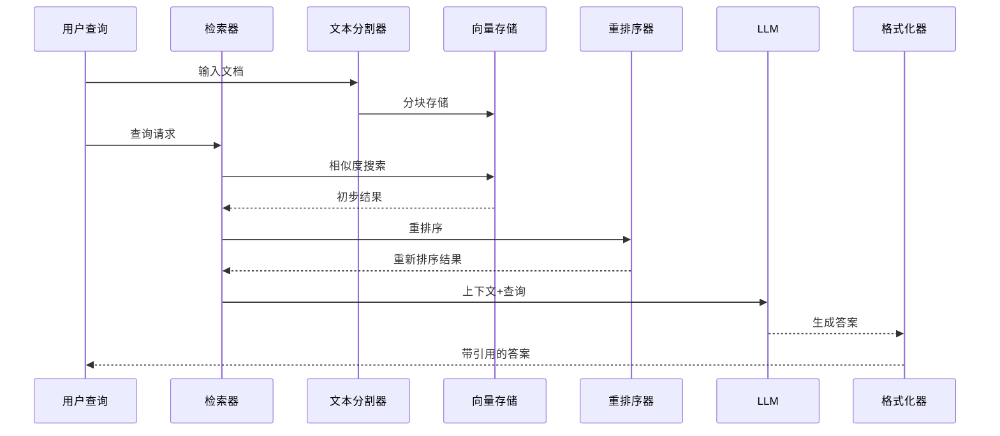
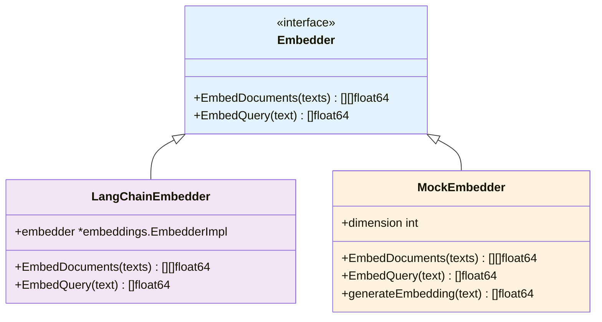
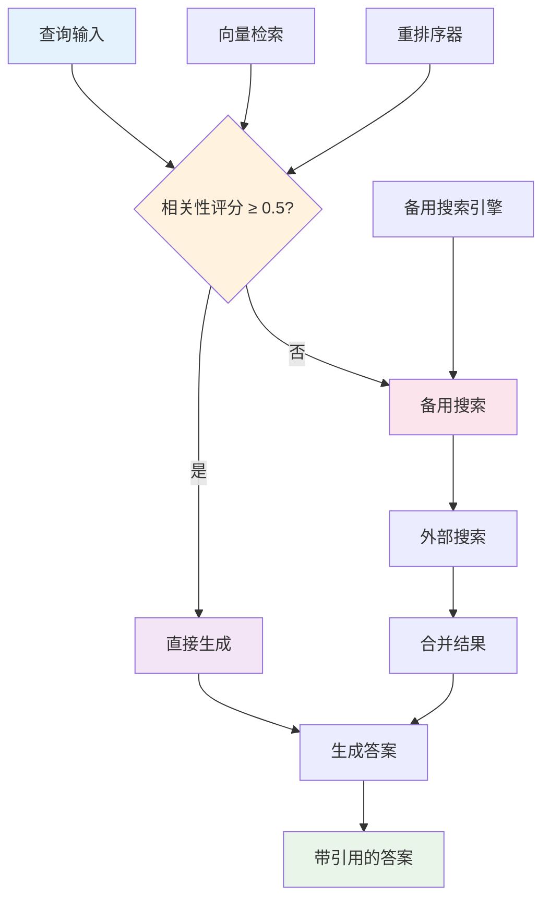
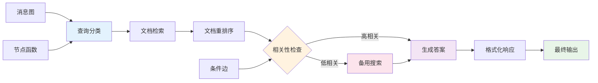
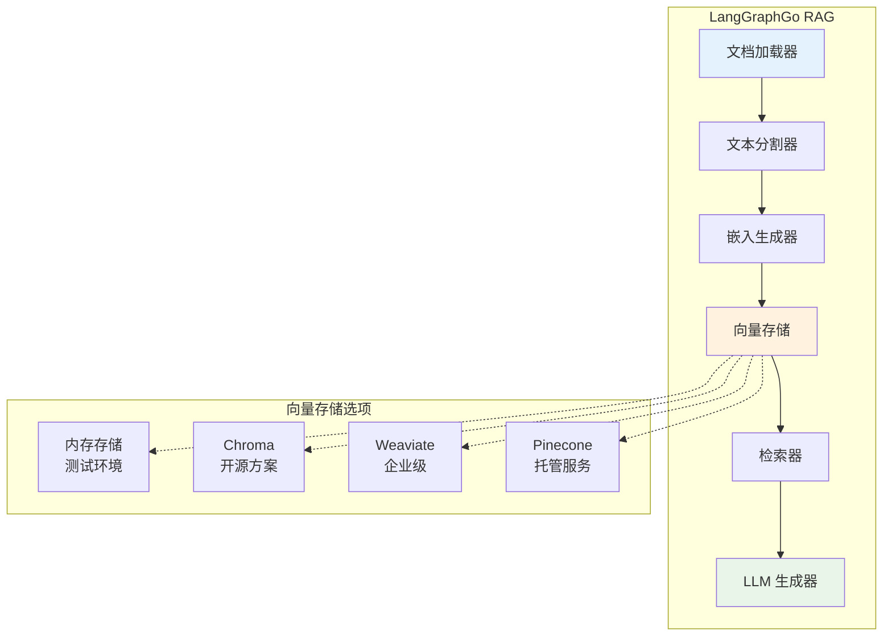
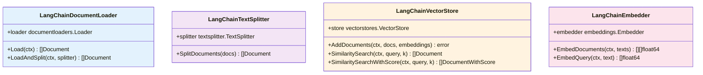
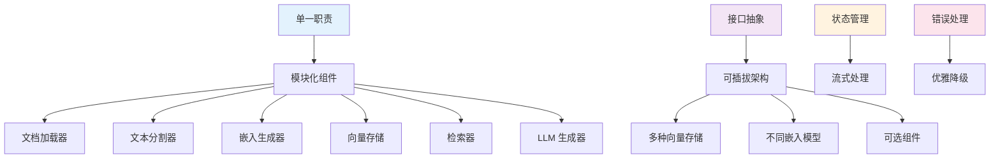

# RAG 示例系列

<cite>
**本文档中引用的文件**
- [examples/rag_basic/main.go](file://examples/rag_basic/main.go)
- [examples/rag_advanced/main.go](file://examples/rag_advanced/main.go)
- [examples/rag_with_embeddings/main.go](file://examples/rag_with_embeddings/main.go)
- [examples/rag_conditional/main.go](file://examples/rag_conditional/main.go)
- [examples/rag_pipeline/main.go](file://examples/rag_pipeline/main.go)
- [examples/rag_chroma_example/main.go](file://examples/rag_chroma_example/main.go)
- [examples/rag_langchain_vectorstore_example/main.go](file://examples/rag_langchain_vectorstore_example/main.go)
- [examples/rag_with_langchain/main.go](file://examples/rag_with_langchain/main.go)
- [prebuilt/rag.go](file://prebuilt/rag.go)
- [prebuilt/rag_components.go](file://prebuilt/rag_components.go)
</cite>

## 目录
1. [简介](#简介)
2. [项目结构概览](#项目结构概览)
3. [基础 RAG 实现 (rag_basic)](#基础-rag-实现-rag_basic)
4. [高级 RAG 技术 (rag_advanced)](#高级-rag-技术-rag_advanced)
5. [嵌入模型集成 (rag_with_embeddings)](#嵌入模型集成-rag_with_embeddings)
6. [条件检索实现 (rag_conditional)](#条件检索实现-rag_conditional)
7. [管道式处理架构 (rag_pipeline)](#管道式处理架构-rag_pipeline)
8. [向量存储集成对比](#向量存储集成对比)
9. [LangChain 生态互通 (rag_with_langchain)](#langchain-生态互通-rag_with_langchain)
10. [架构设计模式](#架构设计模式)
11. [性能优化建议](#性能优化建议)
12. [总结](#总结)

## 简介

LangGraphGo 提供了一套完整的 RAG（Retrieval-Augmented Generation）示例，从基础概念到高级应用，涵盖了现代 AI 应用开发中的核心需求。这些示例展示了如何构建可扩展、可维护的检索增强生成系统，支持从简单的问答到复杂的多模态交互场景。

RAG 技术通过结合信息检索和文本生成，能够提供更准确、更有上下文依据的答案，特别适用于知识密集型应用和需要实时数据更新的场景。

## 项目结构概览

LangGraphGo 的 RAG 示例按照功能复杂度和应用场景进行组织，形成了一个完整的学习路径：

**图表来源**
- [examples/README.md](file://examples/README.md#L45-L54)

## 基础 RAG 实现 (rag_basic)

### 核心架构

基础 RAG 示例展示了最直接的检索增强生成流程，是理解整个 RAG 架构的起点。

**图表来源**
- [examples/rag_basic/main.go](file://examples/rag_basic/main.go#L101-L105)

### 关键特性

1. **简单检索流程**：直接的检索-生成模式
2. **内存向量存储**：使用模拟嵌入的内存存储
3. **可视化管道**：自动生成 Mermaid 图表
4. **多轮测试**：支持多个查询验证

### 实现要点

- **文档预处理**：将文本转换为文档对象
- **嵌入生成**：使用模拟嵌入器生成向量
- **相似度搜索**：基于余弦相似度的语义检索
- **上下文构建**：将相关文档组合成上下文

**章节来源**
- [examples/rag_basic/main.go](file://examples/rag_basic/main.go#L24-L81)
- [examples/rag_basic/README.md](file://examples/rag_basic/README.md#L1-L51)

## 高级 RAG 技术 (rag_advanced)

### 复杂查询优化

高级 RAG 示例引入了多项优化技术，显著提升了系统的准确性和实用性。

**图表来源**
- [examples/rag_advanced/main.go](file://examples/rag_advanced/main.go#L140-L144)

### 高级特性

1. **文档分块**：智能文本分割，保持语义完整性
2. **重排序机制**：基于交叉编码器的相关性重评分
3. **引用生成**：自动添加来源引用
4. **元数据保留**：完整保留文档属性信息

### 技术创新

- **文本分割策略**：200字符块大小，50字符重叠
- **重排序算法**：简单关键词匹配评分
- **引用格式化**：自动化的源文档引用
- **质量监控**：显示相关性分数

**章节来源**
- [examples/rag_advanced/main.go](file://examples/rag_advanced/main.go#L94-L138)
- [examples/rag_advanced/README.md](file://examples/rag_advanced/README.md#L1-L74)

## 嵌入模型集成 (rag_with_embeddings)

### LangChain 嵌入集成

该示例展示了如何与 LangChain 生态系统中的嵌入模型进行集成，提供了生产级别的嵌入解决方案。

**图表来源**
- [examples/rag_with_embeddings/main.go](file://examples/rag_with_embeddings/main.go#L36-L49)
- [prebuilt/rag_components.go](file://prebuilt/rag_components.go#L280-L333)

### 集成优势

1. **生产就绪**：支持 OpenAI 等主流嵌入服务
2. **灵活适配**：统一的嵌入接口抽象
3. **性能优化**：批量处理和缓存机制
4. **质量保证**：高质量的预训练模型

### 使用示例

- **单查询嵌入**：实时查询向量化
- **批量文档嵌入**：高效处理大量文档
- **相似度计算**：余弦相似度比较
- **混合使用**：OpenAI + 模拟嵌入的灵活切换

**章节来源**
- [examples/rag_with_embeddings/main.go](file://examples/rag_with_embeddings/main.go#L20-L83)
- [examples/rag_with_embeddings/main.go](file://examples/rag_with_embeddings/main.go#L153-L220)

## 条件检索实现 (rag_conditional)

### 智能路由决策

条件 RAG 引入了基于相关性阈值的智能路由机制，实现了更高效的查询处理。

**图表来源**
- [examples/rag_conditional/main.go](file://examples/rag_conditional/main.go#L225-L235)

### 核心机制

1. **阈值判断**：基于相关性分数的路由决策
2. **备用搜索**：低相关性查询的外部搜索
3. **状态跟踪**：记录是否触发备用搜索
4. **透明反馈**：显示决策过程和结果

### 应用场景

- **高优先级查询**：直接生成，提升响应速度
- **低质量查询**：触发备用搜索，确保答案质量
- **混合工作流**：根据内容质量动态调整处理策略
- **性能优化**：避免不必要的外部调用

**章节来源**
- [examples/rag_conditional/main.go](file://examples/rag_conditional/main.go#L78-L97)
- [examples/rag_conditional/main.go](file://examples/rag_conditional/main.go#L115-L137)

## 管道式处理架构 (rag_pipeline)

### 自定义管道设计

该示例展示了如何构建完全自定义的 RAG 管道，体现了 LangGraphGo 的灵活性和可扩展性。

**图表来源**
- [examples/rag_pipeline/main.go](file://examples/rag_pipeline/main.go#L90-L106)

### 架构特点

1. **模块化设计**：每个处理步骤独立的节点
2. **条件路由**：基于相关性的动态流程控制
3. **状态管理**：完整的中间状态传递
4. **可视化支持**：自动生成流程图

### 节点职责

- **查询分类**：意图识别和类型分类
- **文档检索**：向量相似度搜索
- **文档重排序**：相关性评分和排序
- **备用搜索**：外部资源检索
- **答案生成**：LLM 内容生成
- **响应格式化**：引用和格式处理

**章节来源**
- [examples/rag_pipeline/main.go](file://examples/rag_pipeline/main.go#L31-L87)
- [examples/rag_pipeline/main.go](file://examples/rag_pipeline/main.go#L90-L106)

## 向量存储集成对比

### 不同向量存储方案

LangGraphGo 支持多种向量存储后端，每种都有其特定的应用场景和优势。

| 向量存储 | 特点 | 适用场景 | 配置复杂度 |
|---------|------|----------|-----------|
| 内存存储 | 快速访问，易配置 | 开发测试，小规模数据 | 低 |
| Chroma | 开源，易于部署 | 中等规模，本地部署 | 中 |
| Weaviate | 企业级，功能丰富 | 大规模，生产环境 | 高 |
| Pinecone | 托管服务，高性能 | 云原生，高可用 | 中 |

### 集成模式对比

**图表来源**
- [examples/rag_chroma_example/main.go](file://examples/rag_chroma_example/main.go#L81-L95)
- [examples/rag_langchain_vectorstore_example/main.go](file://examples/rag_langchain_vectorstore_example/main.go#L180-L224)

### 具体实现差异

1. **Chroma 集成**：
   - 需要 Docker 容器运行
   - 支持多种距离度量
   - 命名空间隔离

2. **LangChain 向量存储**：
   - 统一的接口抽象
   - 支持多种后端
   - 可插拔的存储实现

**章节来源**
- [examples/rag_chroma_example/main.go](file://examples/rag_chroma_example/main.go#L81-L117)
- [examples/rag_langchain_vectorstore_example/main.go](file://examples/rag_langchain_vectorstore_example/main.go#L180-L224)

## LangChain 生态互通 (rag_with_langchain)

### 组件适配器设计

该示例展示了如何无缝集成 LangChain 的各种组件，包括文档加载器、文本分割器和向量存储。

**图表来源**
- [examples/rag_with_langchain/main.go](file://examples/rag_with_langchain/main.go#L47-L57)
- [examples/rag_with_langchain/main.go](file://examples/rag_with_langchain/main.go#L202-L226)

### 生态优势

1. **丰富的组件库**：LangChain 提供了大量成熟的组件
2. **标准化接口**：统一的抽象层简化集成
3. **社区支持**：活跃的社区贡献和维护
4. **生态兼容**：与整个 LangChain 生态系统兼容

### 集成能力

- **多种文档格式**：文本、CSV、JSON、PDF 等
- **智能分割策略**：递归字符分割器
- **向量存储适配**：多种向量数据库支持
- **嵌入模型集成**：OpenAI、Sentence Transformers 等

**章节来源**
- [examples/rag_with_langchain/main.go](file://examples/rag_with_langchain/main.go#L28-L60)
- [examples/rag_with_langchain/main.go](file://examples/rag_with_langchain/main.go#L172-L196)

## 架构设计模式

### 核心设计原则

LangGraphGo 的 RAG 实现遵循以下设计原则：

### 组件间协作

1. **依赖注入**：通过配置对象传递组件实例
2. **接口统一**：所有组件都实现标准接口
3. **状态传递**：通过 RAGState 对象在节点间传递数据
4. **错误传播**：统一的错误处理和恢复机制

### 扩展性设计

- **插件架构**：新组件可以轻松集成
- **配置驱动**：通过配置对象控制行为
- **事件机制**：支持监听和回调
- **并发安全**：线程安全的设计考虑

**章节来源**
- [prebuilt/rag.go](file://prebuilt/rag.go#L125-L249)
- [prebuilt/rag_components.go](file://prebuilt/rag_components.go#L10-L51)

## 性能优化建议

### 查询优化策略

1. **索引优化**：
   - 使用合适的嵌入维度
   - 合理设置 TopK 参数
   - 实施适当的缓存策略

2. **检索优化**：
   - 文档分块大小：200-500 tokens
   - 重叠设置：10-20% 的块重叠
   - 重排序算法选择

3. **生成优化**：
   - 温度参数调优
   - 上下文长度限制
   - 并发处理能力

### 生产环境最佳实践

- **监控指标**：响应时间、召回率、相关性分数
- **容量规划**：根据查询量和文档大小估算资源需求
- **故障恢复**：实施备份和灾难恢复策略
- **安全考虑**：数据加密和访问控制

## 总结

LangGraphGo 的 RAG 示例系列提供了一个完整的从基础到高级的 RAG 系统学习路径。通过这组示例，开发者可以：

1. **掌握基础概念**：理解 RAG 的基本原理和实现方法
2. **学习高级技术**：掌握文档分块、重排序、引用生成等优化技术
3. **了解集成方案**：熟悉与不同向量存储和嵌入模型的集成
4. **构建生产系统**：获得构建可扩展、可维护 RAG 应用的经验

这套示例不仅展示了技术实现，更重要的是体现了现代 AI 系统设计的最佳实践，包括模块化架构、可扩展性设计、性能优化和生产就绪特性。随着 AI 技术的不断发展，这些基础概念和实践经验将继续为构建下一代智能应用提供坚实的基础。