# Chroma向量库对接

<cite>
**本文档引用的文件**
- [examples/rag_chroma_example/main.go](file://examples/rag_chroma_example/main.go)
- [examples/rag_chroma_example/README.md](file://examples/rag_chroma_example/README.md)
- [prebuilt/rag_langchain_adapter.go](file://prebuilt/rag_langchain_adapter.go)
- [prebuilt/rag.go](file://prebuilt/rag.go)
- [prebuilt/rag_components.go](file://prebuilt/rag_components.go)
- [graph/builtin_listeners.go](file://graph/builtin_listeners.go)
- [graph/retry.go](file://graph/retry.go)
- [examples/rag_langchain_vectorstore_example/README_CN.md](file://examples/rag_langchain_vectorstore_example/README_CN.md)
</cite>

## 目录
1. [概述](#概述)
2. [系统架构](#系统架构)
3. [适配器模式实现](#适配器模式实现)
4. [Chroma连接配置](#chroma连接配置)
5. [集合管理与数据持久化](#集合管理与数据持久化)
6. [相似度搜索优化](#相似度搜索优化)
7. [性能监控与故障排查](#性能监控与故障排查)
8. [分布式部署注意事项](#分布式部署注意事项)
9. [最佳实践指南](#最佳实践指南)
10. [故障排除手册](#故障排除手册)

## 概述

Chroma是一个开源的嵌入数据库，专为简化大型语言模型(LLM)应用程序的构建而设计。在langgraphgo框架中，通过适配器模式将Chroma客户端封装为符合langgraphgo接口的向量存储实例，实现了无缝的数据持久化和高效的相似度搜索功能。

### 核心特性

- **简单API**：提供简洁的存储和查询嵌入的接口
- **多种距离度量**：支持余弦、L2和内积等距离计算方法
- **过滤和元数据支持**：强大的查询过滤能力
- **持久化存储**：可靠的数据持久化机制
- **客户端-服务器架构**：可扩展的分布式部署

## 系统架构

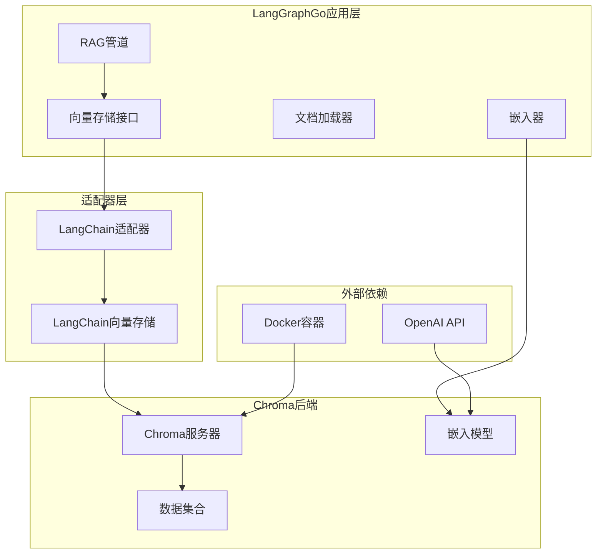

**图表来源**
- [examples/rag_chroma_example/main.go](file://examples/rag_chroma_example/main.go#L86-L91)
- [prebuilt/rag_langchain_adapter.go](file://prebuilt/rag_langchain_adapter.go#L172-L182)

**章节来源**
- [examples/rag_chroma_example/main.go](file://examples/rag_chroma_example/main.go#L1-L212)
- [examples/rag_chroma_example/README.md](file://examples/rag_chroma_example/README.md#L1-L146)

## 适配器模式实现

### LangChainVectorStore适配器

langgraphgo通过`LangChainVectorStore`适配器将Chroma客户端封装为统一的向量存储接口。该适配器实现了以下核心功能：

#### 接口映射

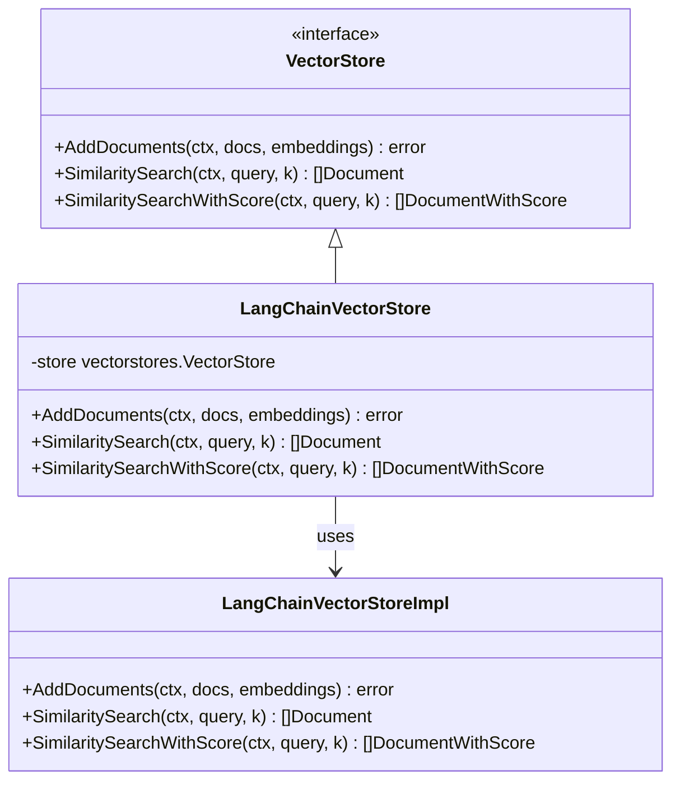

**图表来源**
- [prebuilt/rag_langchain_adapter.go](file://prebuilt/rag_langchain_adapter.go#L172-L251)

#### 文档转换机制

适配器内部实现了文档格式转换，确保langgraphgo的`Document`类型与langchaingo的`schema.Document`类型之间的无缝转换：

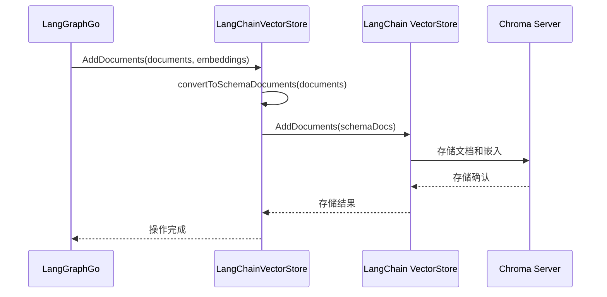

**图表来源**
- [prebuilt/rag_langchain_adapter.go](file://prebuilt/rag_langchain_adapter.go#L185-L201)

**章节来源**
- [prebuilt/rag_langchain_adapter.go](file://prebuilt/rag_langchain_adapter.go#L172-L251)

## Chroma连接配置

### 基础连接设置

Chroma向量数据库的连接配置通过`chroma.New()`函数进行初始化，支持多种配置选项：

#### 核心配置参数

| 参数 | 类型 | 默认值 | 描述 |
|------|------|--------|------|
| WithChromaURL | string | "http://localhost:8000" | Chroma服务器地址 |
| WithEmbedder | embeddings.Embedder | 必需 | 嵌入模型实例 |
| WithDistanceFunction | string | "cosine" | 距离计算方法 |
| WithNameSpace | string | "default" | 数据集合命名空间 |

#### 高级配置选项

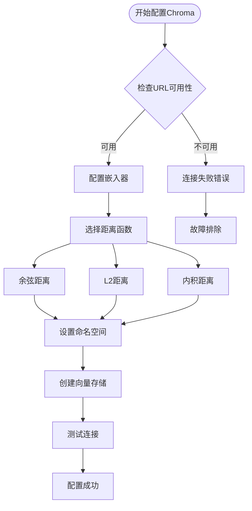

**图表来源**
- [examples/rag_chroma_example/main.go](file://examples/rag_chroma_example/main.go#L86-L91)

### Docker部署配置

推荐使用Docker快速部署Chroma服务器：

```bash
# 基础部署
docker run -p 8000:8000 chromadb/chroma

# 生产环境部署
docker run -d \
  --name chroma-prod \
  -p 8000:8000 \
  -v chroma_data:/chroma/chroma \
  -e CHROMA_SERVER_HOST="0.0.0.0" \
  chromadb/chroma
```

**章节来源**
- [examples/rag_chroma_example/main.go](file://examples/rag_chroma_example/main.go#L86-L91)
- [examples/rag_chroma_example/README.md](file://examples/rag_chroma_example/README.md#L16-L19)

## 集合管理与数据持久化

### 集合命名策略

Chroma使用命名空间(namespace)概念来组织数据集合，建议采用以下命名策略：

#### 命名规范

- **开发环境**：`dev_<application>_collection`
- **测试环境**：`test_<application>_collection`
- **生产环境**：`prod_<application>_collection`
- **用户特定**：`user_<user_id>_collection`

### 数据持久化流程

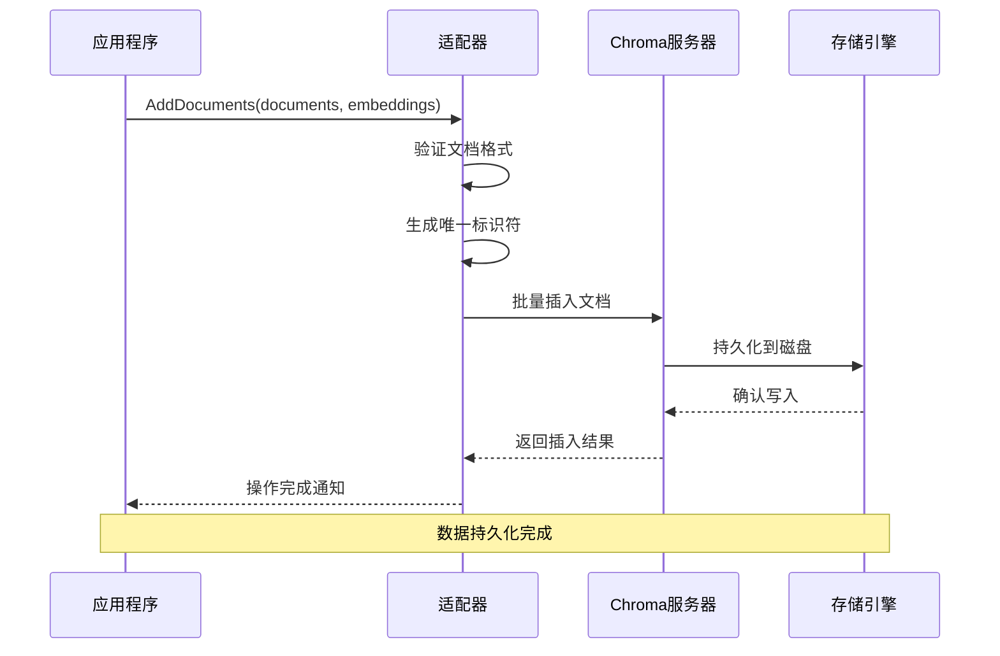

**图表来源**
- [examples/rag_chroma_example/main.go](file://examples/rag_chroma_example/main.go#L106-L114)

### 元数据管理

Chroma支持丰富的元数据字段，可用于后续的过滤和排序操作：

#### 元数据字段设计

| 字段名 | 类型 | 必需 | 描述 |
|--------|------|------|------|
| source | string | 是 | 文档来源标识 |
| chunk_index | int | 是 | 块索引位置 |
| total_chunks | int | 是 | 总块数 |
| created_at | timestamp | 否 | 创建时间戳 |
| updated_at | timestamp | 否 | 更新时间戳 |
| content_hash | string | 否 | 内容哈希值 |
| language | string | 否 | 内容语言 |

**章节来源**
- [examples/rag_chroma_example/main.go](file://examples/rag_chroma_example/main.go#L101-L114)
- [prebuilt/rag_langchain_adapter.go](file://prebuilt/rag_langchain_adapter.go#L62-L74)

## 相似度搜索优化

### 距离度量算法

Chroma支持三种主要的距离计算方法，每种方法适用于不同的应用场景：

#### 距离度量对比

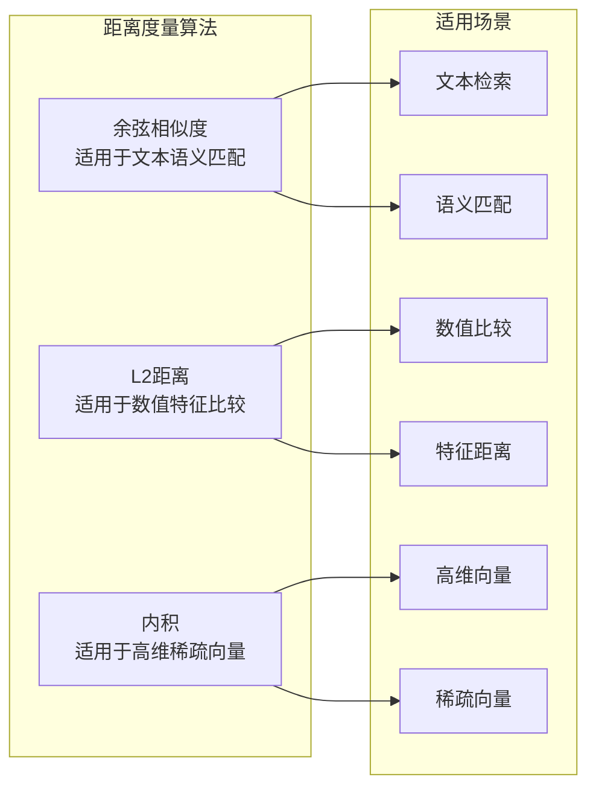

**图表来源**
- [examples/rag_chroma_example/main.go](file://examples/rag_chroma_example/main.go#L89)

### 搜索参数调优

#### 关键参数配置

| 参数 | 推荐值 | 影响因素 | 优化建议 |
|------|--------|----------|----------|
| TopK | 3-10 | 查询复杂度 | 根据业务需求调整 |
| ScoreThreshold | 0.7-0.9 | 结果质量 | 平衡准确性和召回率 |
| ChunkSize | 250-1000 | 内存使用 | 考虑嵌入模型限制 |
| ChunkOverlap | 50-200 | 上下文连续性 | 平衡内存和效果 |

### 搜索性能优化

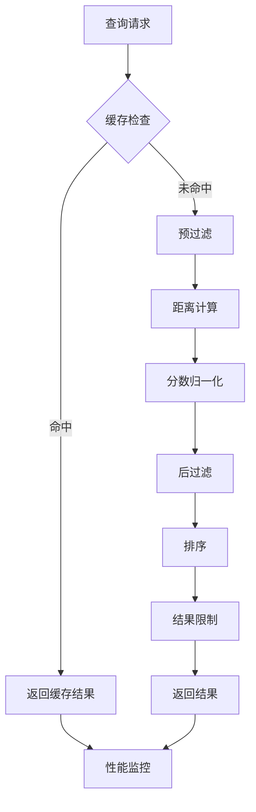

**图表来源**
- [examples/rag_chroma_example/main.go](file://examples/rag_chroma_example/main.go#L186-L197)

**章节来源**
- [examples/rag_chroma_example/main.go](file://examples/rag_chroma_example/main.go#L89-L197)

## 性能监控与故障排查

### 监控指标体系

langgraphgo提供了完善的性能监控机制，支持实时跟踪向量存储操作的性能表现：

#### 核心监控指标

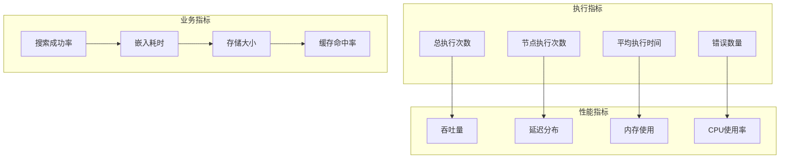

**图表来源**
- [graph/builtin_listeners.go](file://graph/builtin_listeners.go#L203-L333)

### 错误处理机制

#### 异常分类与处理

| 错误类型 | 常见原因 | 处理策略 | 恢复方法 |
|----------|----------|----------|----------|
| 连接错误 | 服务器未启动 | 重试机制 | 自动重启 |
| 认证错误 | API密钥过期 | 刷新认证 | 更新配置 |
| 超时错误 | 网络延迟 | 指数退避 | 增加超时 |
| 内存错误 | 数据过大 | 分批处理 | 增加内存 |
| 协议错误 | 版本不兼容 | 版本升级 | 升级客户端 |

### 故障诊断流程

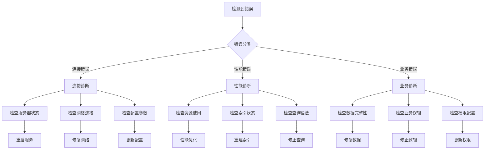

**图表来源**
- [graph/retry.go](file://graph/retry.go#L196-L338)

**章节来源**
- [graph/builtin_listeners.go](file://graph/builtin_listeners.go#L203-L333)
- [graph/retry.go](file://graph/retry.go#L196-L338)

## 分布式部署注意事项

### 集群架构设计

在生产环境中，Chroma通常需要部署为集群以保证高可用性和可扩展性：

#### 部署架构模式

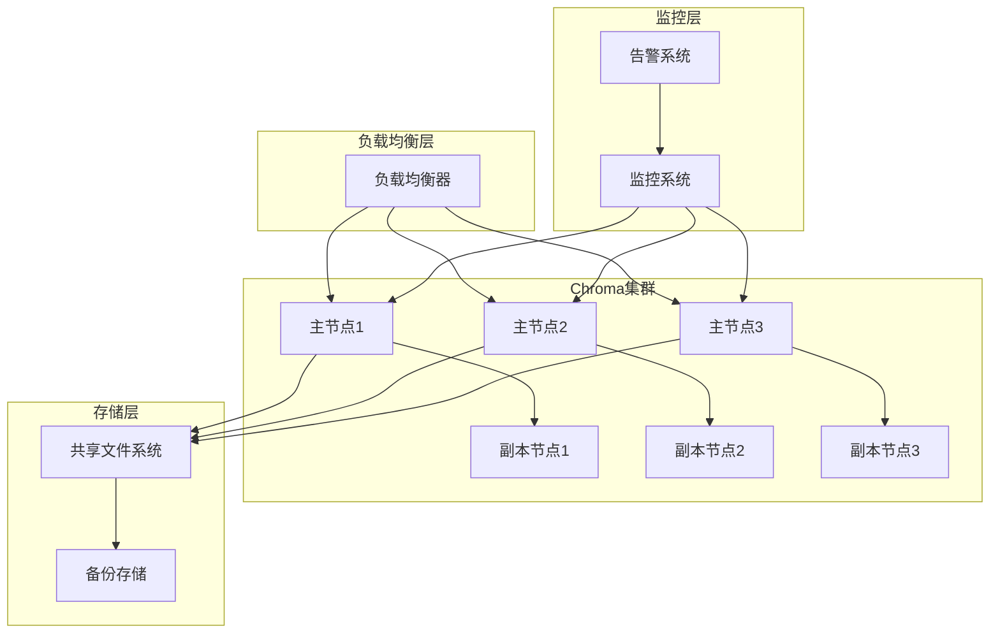

### 配置管理

#### 环境变量配置

| 变量名 | 描述 | 示例值 | 重要性 |
|--------|------|--------|--------|
| CHROMA_SERVER_HOST | 服务器主机地址 | "0.0.0.0" | 高 |
| CHROMA_SERVER_PORT | 服务器端口号 | "8000" | 高 |
| CHROMA_CLUSTER_NODES | 集群节点列表 | "node1:8000,node2:8000" | 中 |
| CHROMA_AUTH_TOKEN | 认证令牌 | "secret-token" | 高 |
| CHROMA_STORAGE_PATH | 存储路径 | "/data/chroma" | 中 |

### 数据一致性保证

#### 一致性协议

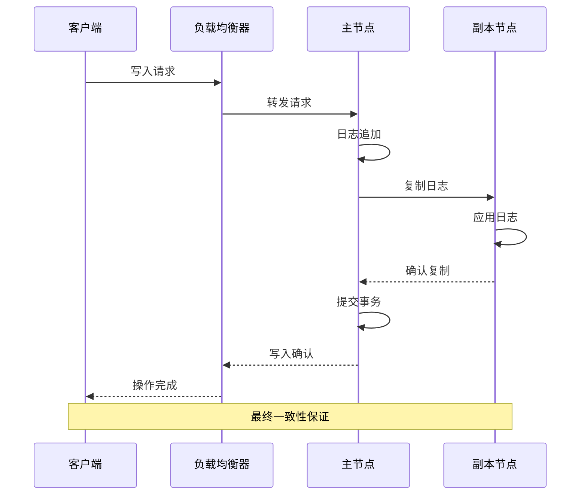

**章节来源**
- [examples/rag_chroma_example/README.md](file://examples/rag_chroma_example/README.md#L16-L19)

## 最佳实践指南

### 开发环境配置

#### 推荐的开发环境设置

```bash
# 1. 创建专用虚拟环境
python -m venv chroma-dev
source chroma-dev/bin/activate

# 2. 安装Chroma依赖
pip install chromadb

# 3. 启动本地开发服务器
docker run -d \
  --name chroma-dev \
  -p 8000:8000 \
  -v $(pwd)/data:/chroma/chroma \
  chromadb/chroma

# 4. 配置环境变量
export CHROMA_SERVER_HOST="localhost"
export CHROMA_SERVER_PORT="8000"
export EMBEDDING_MODEL="sentence-transformers/all-MiniLM-L6-v2"
```

### 生产环境部署

#### 安全配置要点

1. **网络隔离**
   - 使用私有网络访问Chroma服务器
   - 配置防火墙规则限制访问
   - 启用TLS加密传输

2. **身份认证**
   - 配置API密钥认证
   - 实施RBAC权限控制
   - 定期轮换认证凭据

3. **数据保护**
   - 启用数据加密存储
   - 配置定期备份策略
   - 实施访问审计日志

### 性能优化建议

#### 索引优化策略

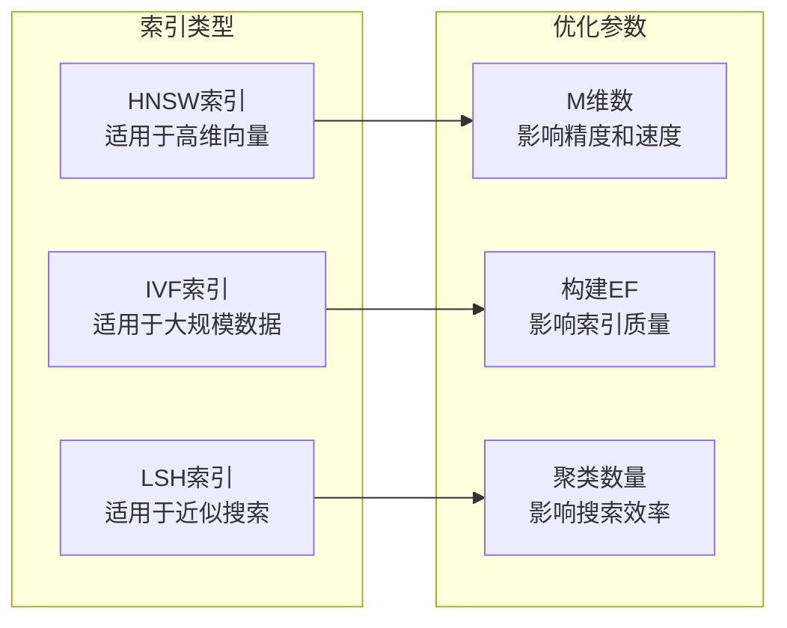

#### 内存管理

| 组件 | 推荐配置 | 监控指标 | 调优建议 |
|------|----------|----------|----------|
| JVM堆内存 | 4-8GB | GC频率 | 增加堆大小减少GC |
| 索引缓存 | 2-4GB | 缓存命中率 | 增加缓存提升性能 |
| 嵌入缓存 | 1-2GB | 嵌入命中率 | 优化缓存策略 |
| 网络缓冲 | 1MB | 网络延迟 | 调整缓冲区大小 |

**章节来源**
- [examples/rag_chroma_example/README.md](file://examples/rag_chroma_example/README.md#L134-L146)

## 故障排除手册

### 常见问题诊断

#### 连接问题

**问题症状**：`Failed to create Chroma store: connection refused`

**诊断步骤**：
1. 检查Chroma服务器是否正在运行
2. 验证端口8000是否被占用
3. 确认网络连接状态
4. 检查防火墙设置

**解决方案**：
```bash
# 检查服务器状态
docker ps | grep chroma

# 检查端口占用
netstat -tulpn | grep 8000

# 重新启动服务器
docker stop chroma
docker rm chroma
docker run -p 8001:8000 chromadb/chroma
```

#### 性能问题

**问题症状**：查询响应时间过长

**诊断流程**：
1. 检查系统资源使用情况
2. 分析查询执行计划
3. 监控网络延迟
4. 检查索引状态

**优化措施**：
- 增加硬件资源
- 优化查询条件
- 调整索引参数
- 实施查询缓存

#### 数据问题

**问题症状**：无法正确检索文档

**排查步骤**：
1. 验证文档是否成功存储
2. 检查嵌入向量生成
3. 确认搜索参数配置
4. 测试基础功能

**修复方法**：
- 重新导入数据
- 修正嵌入模型
- 调整相似度阈值
- 清理损坏的索引

### 监控告警配置

#### 关键指标监控

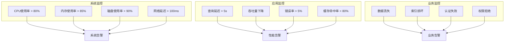

**章节来源**
- [examples/rag_chroma_example/README.md](file://examples/rag_chroma_example/README.md#L113-L146)

## 结论

通过适配器模式将Chroma向量数据库集成到langgraphgo框架中，实现了高效、可靠的向量存储解决方案。该方案不仅保持了系统的模块化和可扩展性，还提供了完整的性能监控和故障排查机制。

关键优势包括：
- **无缝集成**：通过适配器模式实现标准化接口
- **高性能**：优化的相似度搜索和缓存机制
- **高可用**：完善的错误处理和恢复策略
- **易维护**：清晰的监控指标和故障诊断流程

在实际部署中，建议根据具体业务需求选择合适的配置参数，并建立完善的监控和运维体系，以确保系统的稳定运行和最佳性能表现。