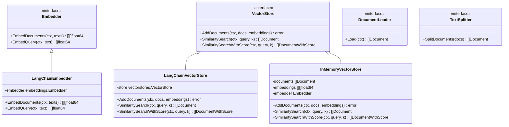

# 向量存储集成

<cite>
**本文档中引用的文件**
- [examples/rag_with_embeddings/main.go](file://examples/rag_with_embeddings/main.go)
- [examples/rag_chroma_example/main.go](file://examples/rag_chroma_example/main.go)
- [examples/rag_langchain_vectorstore_example/main.go](file://examples/rag_langchain_vectorstore_example/main.go)
- [examples/rag_with_langchain/main.go](file://examples/rag_with_langchain/main.go)
- [prebuilt/rag_components.go](file://prebuilt/rag_components.go)
- [prebuilt/rag.go](file://prebuilt/rag.go)
- [prebuilt/rag_langchain_adapter.go](file://prebuilt/rag_langchain_adapter.go)
- [prebuilt/rag_test.go](file://prebuilt/rag_test.go)
</cite>

## 目录
1. [简介](#简介)
2. [项目结构概览](#项目结构概览)
3. [核心接口抽象](#核心接口抽象)
4. [向量存储集成方案对比](#向量存储集成方案对比)
5. [RAG组件详细分析](#rag组件详细分析)
6. [LangChain生态集成](#langchain生态集成)
7. [插拔式替换机制](#插拔式替换机制)
8. [性能考量与最佳实践](#性能考量与最佳实践)
9. [故障排除指南](#故障排除指南)
10. [总结](#总结)

## 简介

LangGraphGo提供了一套完整的向量存储集成解决方案，支持多种向量数据库和嵌入模型的无缝集成。该系统通过精心设计的接口抽象层，实现了不同向量存储后端的插拔式替换，同时保持了统一的API体验。

本文档将深入分析系统的向量存储集成架构，对比不同集成方案的特点，并详细说明如何利用LangChain生态的现有工具进行快速集成。

## 项目结构概览

**图表来源**
- [examples/rag_with_embeddings/main.go](file://examples/rag_with_embeddings/main.go#L1-L50)
- [examples/rag_chroma_example/main.go](file://examples/rag_chroma_example/main.go#L1-L50)
- [examples/rag_langchain_vectorstore_example/main.go](file://examples/rag_langchain_vectorstore_example/main.go#L1-L50)
- [examples/rag_with_langchain/main.go](file://examples/rag_with_langchain/main.go#L1-L50)

**章节来源**
- [examples/rag_with_embeddings/main.go](file://examples/rag_with_embeddings/main.go#L1-L290)
- [examples/rag_chroma_example/main.go](file://examples/rag_chroma_example/main.go#L1-L212)
- [examples/rag_langchain_vectorstore_example/main.go](file://examples/rag_langchain_vectorstore_example/main.go#L1-L256)
- [examples/rag_with_langchain/main.go](file://examples/rag_with_langchain/main.go#L1-L239)

## 核心接口抽象

系统通过定义清晰的接口层次来实现向量存储的插拔式集成：

**图表来源**
- [prebuilt/rag.go](file://prebuilt/rag.go#L28-L45)
- [prebuilt/rag_langchain_adapter.go](file://prebuilt/rag_langchain_adapter.go#L123-L252)
- [prebuilt/rag_components.go](file://prebuilt/rag_components.go#L94-L184)

### 接口设计原则

1. **单一职责**: 每个接口专注于特定功能领域
2. **最小化依赖**: 接口方法参数简洁明确
3. **类型安全**: 使用强类型定义确保编译时检查
4. **可扩展性**: 支持未来新功能的无缝集成

**章节来源**
- [prebuilt/rag.go](file://prebuilt/rag.go#L18-L45)

## 向量存储集成方案对比

### 方案一：原生嵌入集成 (rag_with_embeddings)

该方案直接使用LangChain的嵌入模型，无需额外的向量存储配置：

**图表来源**
- [examples/rag_with_embeddings/main.go](file://examples/rag_with_embeddings/main.go#L24-L68)
- [examples/rag_with_embeddings/main.go](file://examples/rag_with_embeddings/main.go#L76-L120)

优势：
- 零配置部署
- 直接使用高质量的预训练模型
- 开发成本低，适合原型开发

劣势：
- 性能受限于单机内存
- 不适合大规模数据集
- 缺乏持久化能力

**章节来源**
- [examples/rag_with_embeddings/main.go](file://examples/rag_with_embeddings/main.go#L24-L120)

### 方案二：Chroma向量数据库集成 (rag_chroma_example)

该方案利用Chroma作为向量存储后端，提供分布式存储能力：

**图表来源**
- [examples/rag_chroma_example/main.go](file://examples/rag_chroma_example/main.go#L82-L115)
- [examples/rag_chroma_example/main.go](file://examples/rag_chroma_example/main.go#L119-L140)

特点：
- 分布式存储架构
- 支持实时更新
- 提供RESTful API
- 内置向量索引优化

**章节来源**
- [examples/rag_chroma_example/main.go](file://examples/rag_chroma_example/main.go#L82-L140)

### 方案三：LangChain向量存储生态集成 (rag_langchain_vectorstore_example)

该方案展示了对多种LangChain向量存储的支持：

| 向量存储 | 特点 | 适用场景 | 配置复杂度 |
|---------|------|----------|-----------|
| InMemory | 内存存储，无持久化 | 测试、原型开发 | 极低 |
| Chroma | 开源向量数据库 | 生产环境 | 中等 |
| Weaviate | 图形化向量数据库 | 复杂查询需求 | 中等 |
| Pinecone | 云原生向量服务 | 大规模部署 | 较高 |

**章节来源**
- [examples/rag_langchain_vectorstore_example/main.go](file://examples/rag_langchain_vectorstore_example/main.go#L82-L110)
- [examples/rag_langchain_vectorstore_example/main.go](file://examples/rag_langchain_vectorstore_example/main.go#L180-L225)

### 方案四：LangChain文档加载器集成 (rag_with_langchain)

该方案专注于LangChain生态的文档处理能力：

**图表来源**
- [examples/rag_with_langchain/main.go](file://examples/rag_with_langchain/main.go#L30-L60)
- [examples/rag_with_langchain/main.go](file://examples/rag_with_langchain/main.go#L172-L196)

**章节来源**
- [examples/rag_with_langchain/main.go](file://examples/rag_with_langchain/main.go#L30-L196)

## RAG组件详细分析

### InMemoryVectorStore实现原理

InMemoryVectorStore是系统的核心组件之一，提供了基础的向量存储功能：

**图表来源**
- [prebuilt/rag_components.go](file://prebuilt/rag_components.go#L94-L184)
- [prebuilt/rag_components.go](file://prebuilt/rag_components.go#L10-L92)
- [prebuilt/rag_components.go](file://prebuilt/rag_components.go#L280-L333)

#### 文本分割算法

SimpleTextSplitter采用递归字符分割策略：

1. **分块大小控制**: 通过ChunkSize参数控制每个分块的最大长度
2. **重叠处理**: ChunkOverlap确保相邻分块间的上下文连续性
3. **智能断句**: 使用换行符作为自然断句点
4. **边界处理**: 避免在单词中间截断，保持语义完整性

**章节来源**
- [prebuilt/rag_components.go](file://prebuilt/rag_components.go#L10-L92)

#### 相似度计算

系统使用余弦相似度进行向量匹配：

**图表来源**
- [prebuilt/rag_components.go](file://prebuilt/rag_components.go#L186-L204)

**章节来源**
- [prebuilt/rag_components.go](file://prebuilt/rag_components.go#L123-L184)

### LangChain适配器架构

LangChain适配器层提供了与LangChain生态系统的无缝集成：

**图表来源**
- [prebuilt/rag_langchain_adapter.go](file://prebuilt/rag_langchain_adapter.go#L123-L252)

#### 类型转换机制

适配器负责在LangGraphGo类型和LangChain类型之间进行转换：

1. **文档转换**: 将Document转换为schema.Document
2. **元数据映射**: 保持元数据字段的一致性
3. **分数处理**: 在需要时添加相似度分数
4. **错误处理**: 统一错误格式

**章节来源**
- [prebuilt/rag_langchain_adapter.go](file://prebuilt/rag_langchain_adapter.go#L45-L75)
- [prebuilt/rag_langchain_adapter.go](file://prebuilt/rag_langchain_adapter.go#L60-L80)

## LangChain生态集成

### 文档加载器生态系统

LangChain提供了丰富的文档加载器，支持多种数据源：

| 加载器类型 | 支持格式 | 特点 | 适用场景 |
|-----------|----------|------|----------|
| TextLoader | 纯文本文件 | 简单高效 | 日志文件、配置文件 |
| PDFLoader | PDF文档 | 保留格式信息 | 报告、学术论文 |
| HTMLLoader | HTML网页 | 结构化提取 | 网页内容抓取 |
| MarkdownLoader | Markdown文件 | 语法高亮 | 文档网站 |
| CSVLoader | CSV表格 | 结构化数据 | 数据分析报告 |
| JSONLoader | JSON文件 | 层级结构 | API响应、配置文件 |

**章节来源**
- [examples/rag_with_langchain/main.go](file://examples/rag_with_langchain/main.go#L30-L60)
- [examples/rag_with_langchain/main.go](file://examples/rag_with_langchain/main.go#L172-L196)

### 嵌入模型集成

系统支持多种嵌入模型提供商：

**图表来源**
- [examples/rag_with_embeddings/main.go](file://examples/rag_with_embeddings/main.go#L24-L68)
- [examples/rag_chroma_example/main.go](file://examples/rag_chroma_example/main.go#L24-L40)

**章节来源**
- [examples/rag_with_embeddings/main.go](file://examples/rag_with_embeddings/main.go#L24-L120)
- [examples/rag_chroma_example/main.go](file://examples/rag_chroma_example/main.go#L24-L115)

## 插拔式替换机制

### 接口抽象层设计

系统通过接口抽象实现了高度的可插拔性：

**图表来源**
- [prebuilt/rag.go](file://prebuilt/rag.go#L28-L45)
- [prebuilt/rag_components.go](file://prebuilt/rag_components.go#L280-L333)

### 替换策略

1. **渐进式替换**: 可以单独替换某个组件而不影响其他部分
2. **配置驱动**: 通过配置文件或环境变量选择不同的实现
3. **运行时切换**: 支持在运行时动态切换实现
4. **兼容性保证**: 新实现必须满足接口契约

**章节来源**
- [prebuilt/rag.go](file://prebuilt/rag.go#L70-L91)
- [prebuilt/rag_components.go](file://prebuilt/rag_components.go#L94-L184)

### 测试与验证

系统提供了完整的测试框架来验证接口实现：

**图表来源**
- [prebuilt/rag_test.go](file://prebuilt/rag_test.go#L11-L200)

**章节来源**
- [prebuilt/rag_test.go](file://prebuilt/rag_test.go#L11-L200)

## 性能考量与最佳实践

### 性能优化策略

1. **批量处理**: 对多个文档进行批量嵌入生成
2. **缓存机制**: 缓存常用的查询结果和嵌入向量
3. **索引优化**: 利用向量数据库的索引特性
4. **并发控制**: 合理控制并发请求数量

### 内存管理

对于大规模数据集，建议采用以下策略：

- **流式处理**: 避免一次性加载所有文档到内存
- **分批处理**: 将大任务分解为小批次执行
- **垃圾回收**: 及时释放不需要的资源
- **监控指标**: 实时监控内存使用情况

### 安全考虑

1. **API密钥管理**: 安全存储和轮换API密钥
2. **访问控制**: 实施适当的访问权限控制
3. **数据加密**: 在传输和存储过程中加密敏感数据
4. **审计日志**: 记录所有关键操作以便审计

## 故障排除指南

### 常见问题诊断

| 问题类型 | 症状 | 可能原因 | 解决方案 |
|---------|------|----------|----------|
| 嵌入失败 | 生成嵌入向量失败 | API密钥无效、网络连接问题 | 检查API配置和网络状态 |
| 搜索结果不准确 | 相似度分数异常 | 嵌入质量差、向量维度不匹配 | 验证嵌入模型和向量维度 |
| 性能下降 | 查询响应时间过长 | 向量库过大、索引未优化 | 优化索引配置或分片存储 |
| 内存溢出 | 程序崩溃、内存不足 | 文档过多、内存泄漏 | 增加内存限制或优化内存使用 |

### 调试技巧

1. **启用详细日志**: 设置适当的日志级别以获取更多信息
2. **监控指标**: 使用指标监控系统性能
3. **单元测试**: 编写针对性的单元测试验证功能
4. **压力测试**: 进行负载测试评估系统容量

**章节来源**
- [examples/rag_with_embeddings/main.go](file://examples/rag_with_embeddings/main.go#L223-L290)
- [examples/rag_chroma_example/main.go](file://examples/rag_chroma_example/main.go#L181-L202)

## 总结

LangGraphGo的向量存储集成方案展现了现代RAG系统的设计精髓：

1. **模块化架构**: 清晰的接口分离和组件化设计
2. **生态兼容**: 与LangChain生态的深度集成
3. **灵活替换**: 支持多种向量存储后端的无缝切换
4. **性能优化**: 针对不同场景的优化策略
5. **易于扩展**: 良好的可扩展性和维护性

通过本文档的分析，开发者可以：
- 理解不同向量存储集成方案的特点和适用场景
- 掌握LangChain生态的集成方法
- 实现自定义的向量存储适配器
- 优化RAG系统的性能和可靠性

这套向量存储集成方案不仅适用于当前的应用场景，也为未来的扩展和升级奠定了坚实的基础。