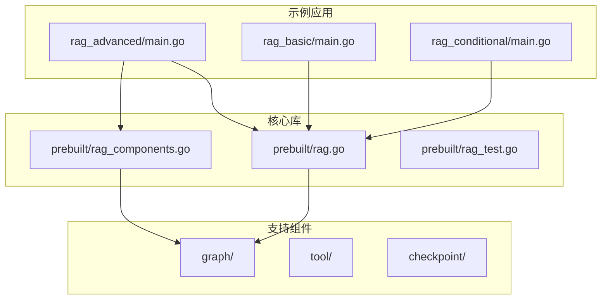
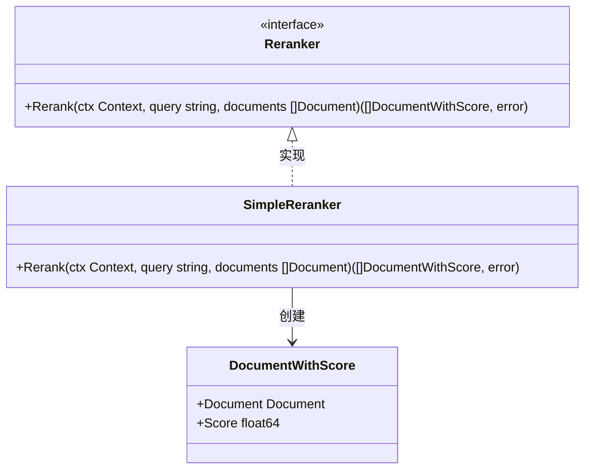
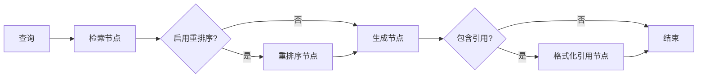
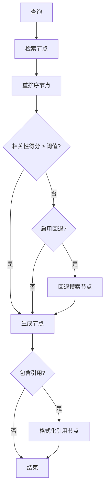
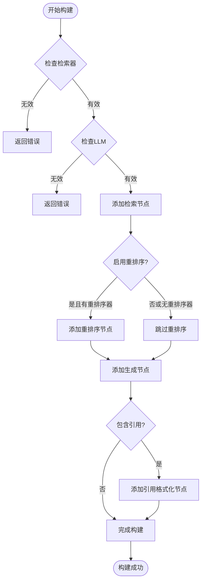
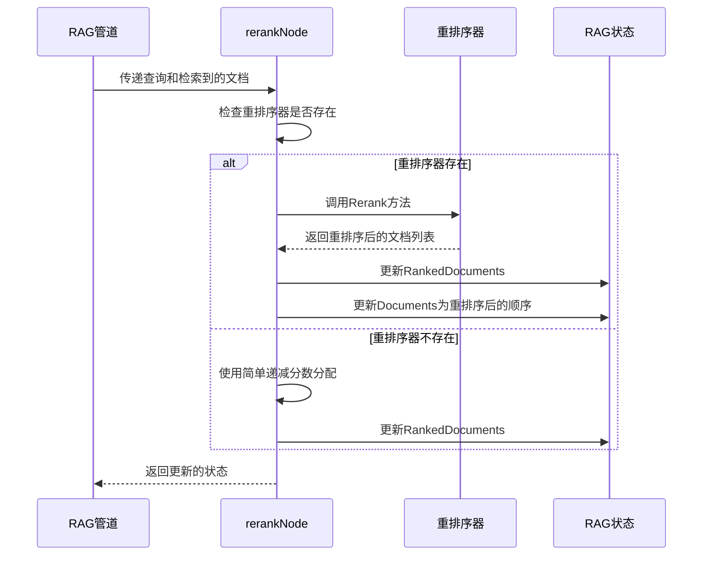
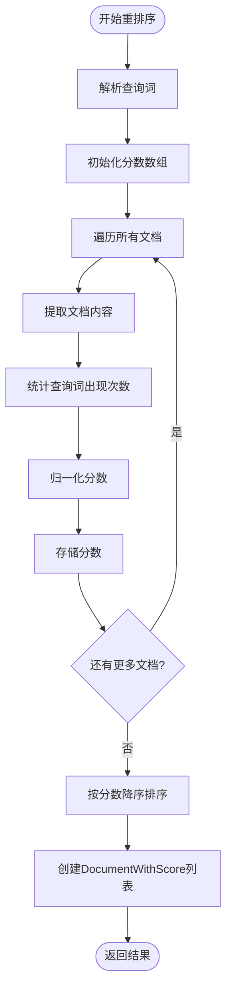
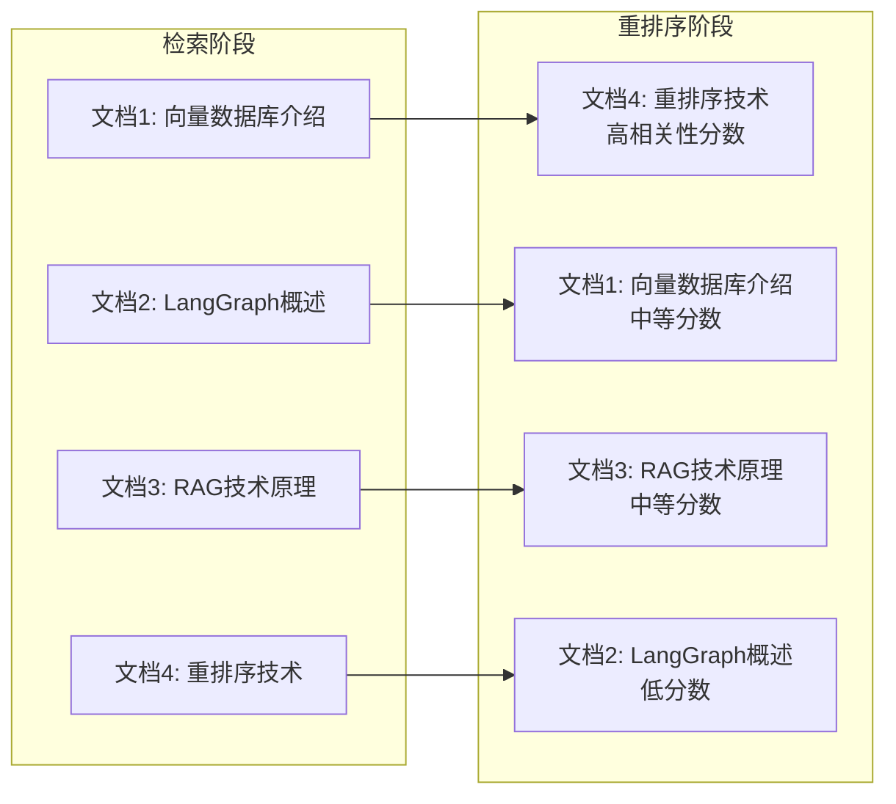
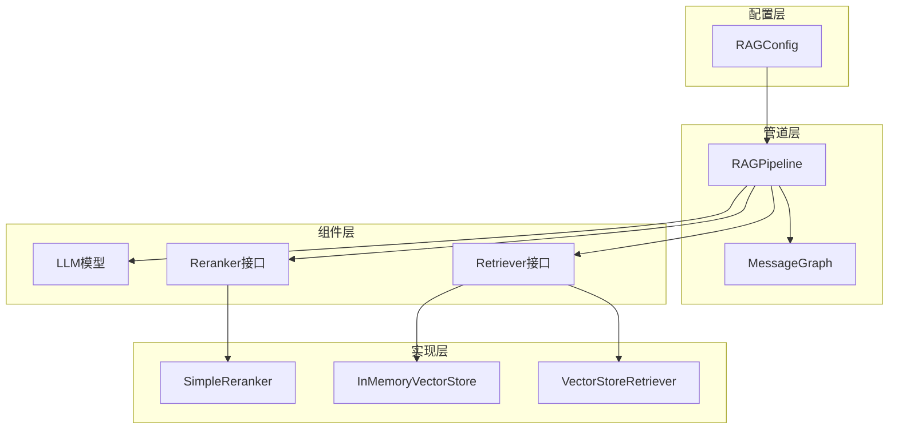

# 检索后重排序

<cite>
**本文档引用的文件**
- [examples/rag_advanced/main.go](file://examples/rag_advanced/main.go)
- [prebuilt/rag.go](file://prebuilt/rag.go)
- [prebuilt/rag_components.go](file://prebuilt/rag_components.go)
- [examples/rag_advanced/README.md](file://examples/rag_advanced/README.md)
- [examples/rag_basic/main.go](file://examples/rag_basic/main.go)
- [examples/rag_conditional/main.go](file://examples/rag_conditional/main.go)
- [prebuilt/rag_test.go](file://prebuilt/rag_test.go)
</cite>

## 目录
1. [简介](#简介)
2. [项目结构概览](#项目结构概览)
3. [核心组件分析](#核心组件分析)
4. [架构概览](#架构概览)
5. [详细组件分析](#详细组件分析)
6. [依赖关系分析](#依赖关系分析)
7. [性能考虑](#性能考虑)
8. [故障排除指南](#故障排除指南)
9. [结论](#结论)

## 简介

检索后重排序（Reranking）是现代RAG（检索增强生成）系统中的关键优化技术，它通过重新评估检索到的文档的相关性来显著提升最终答案的质量。本文档深入分析LangGraphGo框架中实现的检索后重排序机制，重点关注`BuildAdvancedRAG`方法如何构建包含rerank节点的图结构，以及`RAGConfig`中相关配置参数的作用。

## 项目结构概览

LangGraphGo项目采用模块化设计，将RAG功能分为多个核心模块：

**图表来源**
- [examples/rag_advanced/main.go](file://examples/rag_advanced/main.go#L1-L223)
- [prebuilt/rag.go](file://prebuilt/rag.go#L1-L392)
- [prebuilt/rag_components.go](file://prebuilt/rag_components.go#L1-L333)

**章节来源**
- [examples/rag_advanced/main.go](file://examples/rag_advanced/main.go#L1-L223)
- [prebuilt/rag.go](file://prebuilt/rag.go#L1-L392)

## 核心组件分析

### RAGConfig配置结构

`RAGConfig`结构体定义了RAG管道的所有配置参数，其中与重排序直接相关的有两个关键字段：

| 配置参数 | 类型 | 默认值 | 描述 |
|---------|------|--------|------|
| `UseReranking` | `bool` | `false` | 是否启用重排序功能 |
| `IncludeCitations` | `bool` | `true` | 是否包含源文档引用 |

这些配置参数控制着RAG管道的行为模式，特别是在高级RAG管道中发挥重要作用。

### Reranker接口设计

`Reranker`接口定义了重排序的核心功能：

**图表来源**
- [prebuilt/rag.go](file://prebuilt/rag.go#L52-L55)
- [prebuilt/rag_components.go](file://prebuilt/rag_components.go#L206-L261)

**章节来源**
- [prebuilt/rag.go](file://prebuilt/rag.go#L69-L91)
- [prebuilt/rag.go](file://prebuilt/rag.go#L52-L55)

## 架构概览

### Advanced RAG管道架构

Advanced RAG管道通过`BuildAdvancedRAG`方法构建，包含检索、重排序和生成三个主要阶段：

**图表来源**
- [prebuilt/rag.go](file://prebuilt/rag.go#L148-L191)

### 条件RAG管道架构

条件RAG管道增加了基于相关性阈值的智能路由：

**图表来源**
- [prebuilt/rag.go](file://prebuilt/rag.go#L193-L249)

**章节来源**
- [prebuilt/rag.go](file://prebuilt/rag.go#L148-L191)
- [prebuilt/rag.go](file://prebuilt/rag.go#L193-L249)

## 详细组件分析

### BuildAdvancedRAG方法实现

`BuildAdvancedRAG`方法是构建包含重排序功能的RAG管道的核心逻辑：

**图表来源**
- [prebuilt/rag.go](file://prebuilt/rag.go#L148-L191)

### rerankNode节点实现

`rerankNode`是RAG管道中的关键节点，负责处理重排序逻辑：

**图表来源**
- [prebuilt/rag.go](file://prebuilt/rag.go#L277-L308)

### NewSimpleReranker实现

`NewSimpleReranker`提供了基础的关键词匹配重排序算法：

**图表来源**
- [prebuilt/rag_components.go](file://prebuilt/rag_components.go#L216-L261)

**章节来源**
- [prebuilt/rag.go](file://prebuilt/rag.go#L148-L191)
- [prebuilt/rag.go](file://prebuilt/rag.go#L277-L308)
- [prebuilt/rag_components.go](file://prebuilt/rag_components.go#L216-L261)

### 配置参数详解

#### UseReranking参数

`UseReranking`参数控制是否在RAG管道中启用重排序功能：

| 配置值 | 行为描述 | 影响范围 |
|--------|----------|----------|
| `true` | 启用重排序节点，使用配置的Reranker | 所有检索到的文档都会被重新评分 |
| `false` | 跳过重排序节点，保持原始检索顺序 | 文档顺序完全由向量相似度决定 |

#### IncludeCitations参数

`IncludeCitations`参数控制是否在最终答案中包含源文档引用：

| 配置值 | 行为描述 | 输出影响 |
|--------|----------|----------|
| `true` | 在生成的答案末尾添加源文档引用列表 | 提供透明性和可追溯性 |
| `false` | 不添加任何引用信息 | 答案更加简洁但缺乏来源信息 |

**章节来源**
- [prebuilt/rag.go](file://prebuilt/rag.go#L73-L74)
- [prebuilt/rag.go](file://prebuilt/rag.go#L78-L79)

### 重排序前后的文档顺序变化

在`rag_advanced`示例中，重排序的效果可以通过以下方式观察：

**图表来源**
- [examples/rag_advanced/main.go](file://examples/rag_advanced/main.go#L180-L210)

**章节来源**
- [examples/rag_advanced/main.go](file://examples/rag_advanced/main.go#L180-L210)

## 依赖关系分析

### 组件间依赖关系

**图表来源**
- [prebuilt/rag.go](file://prebuilt/rag.go#L108-L123)
- [prebuilt/rag_components.go](file://prebuilt/rag_components.go#L206-L261)

**章节来源**
- [prebuilt/rag.go](file://prebuilt/rag.go#L108-L123)
- [prebuilt/rag_components.go](file://prebuilt/rag_components.go#L206-L261)

## 性能考虑

### 重排序性能优化

1. **批处理优化**: 重排序器可以一次性处理多个文档，减少调用开销
2. **内存管理**: `DocumentWithScore`结构体优化了内存使用，避免不必要的数据复制
3. **算法复杂度**: 当前的简单重排序算法时间复杂度为O(n*m)，其中n是文档数量，m是查询词数量

### 内存使用优化

- 使用切片而非数组提高内存效率
- 及时释放不需要的中间状态
- 通过接口抽象减少具体类型依赖

## 故障排除指南

### 常见问题及解决方案

#### 重排序未生效

**症状**: 检索到的文档顺序没有变化
**原因**: `UseReranking`设置为`false`或`Reranker`未正确配置
**解决方案**: 确保在配置中启用重排序功能

#### 引用格式不正确

**症状**: 答案中缺少源文档引用
**原因**: `IncludeCitations`设置为`false`
**解决方案**: 启用引用生成功能

#### 性能问题

**症状**: 重排序过程耗时较长
**原因**: 大量文档需要重排序或重排序算法复杂度高
**解决方案**: 调整`TopK`参数或实现更高效的重排序算法

**章节来源**
- [prebuilt/rag.go](file://prebuilt/rag.go#L280-L291)
- [prebuilt/rag.go](file://prebuilt/rag.go#L168-L171)

## 结论

LangGraphGo框架中的检索后重排序机制提供了一个灵活且强大的RAG系统基础。通过`BuildAdvancedRAG`方法，开发者可以轻松构建包含重排序功能的RAG管道，而`RAGConfig`中的`UseReranking`和`IncludeCitations`参数则提供了细粒度的控制能力。

`NewSimpleReranker`实现展示了重排序的基本原理，通过关键词匹配和归一化分数实现了有效的文档重排序。这种设计既保证了系统的可扩展性，又为后续集成更复杂的重排序算法（如交叉编码器）预留了空间。

通过合理配置这些参数和选择合适的重排序策略，开发者可以在保持系统性能的同时显著提升RAG系统的输出质量，为用户提供更加准确和可信的答案。