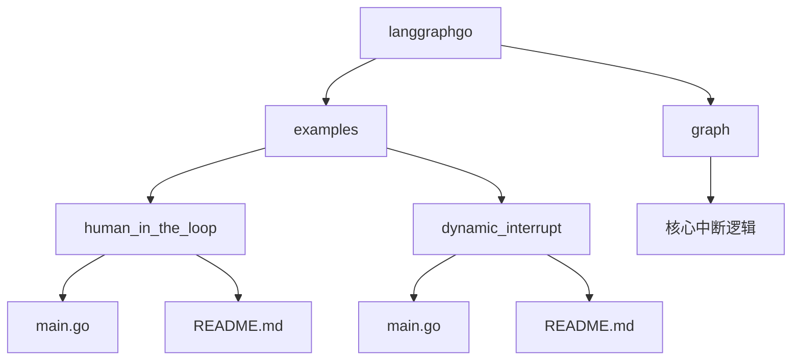
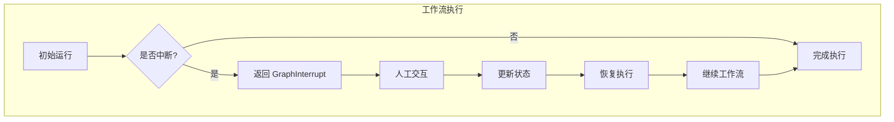
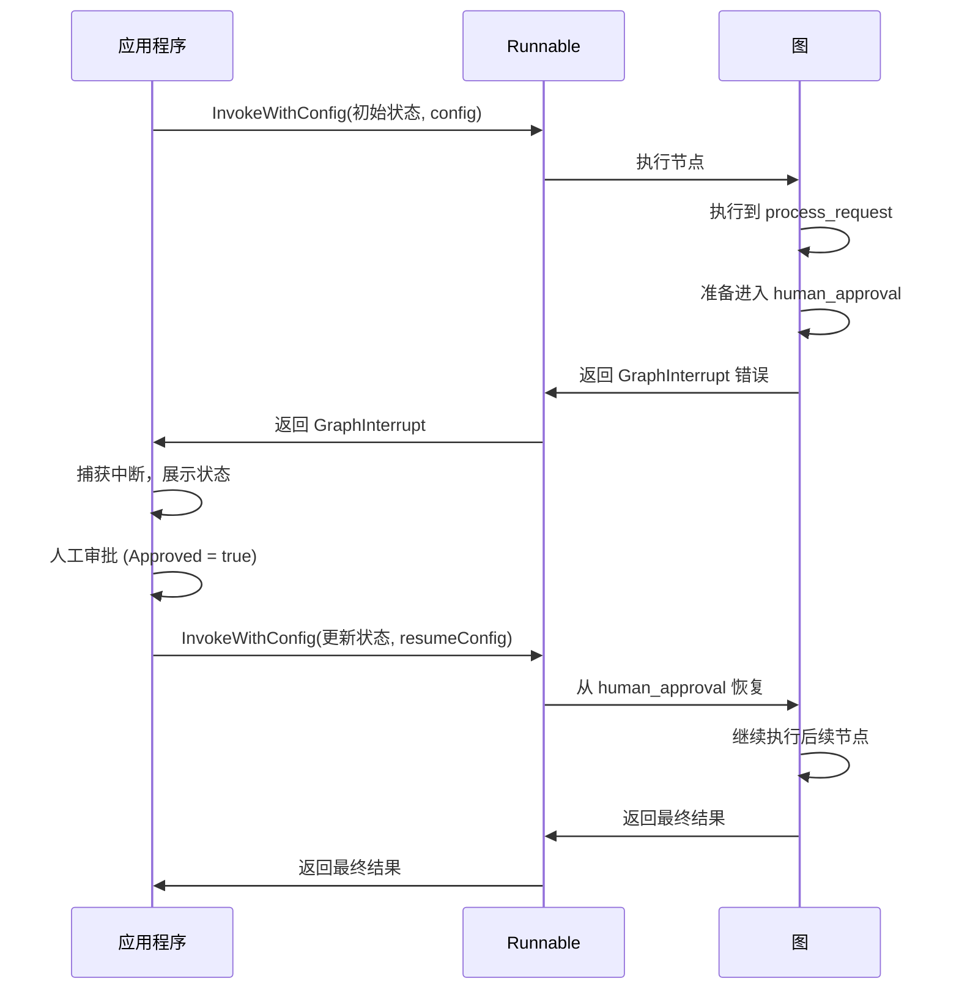
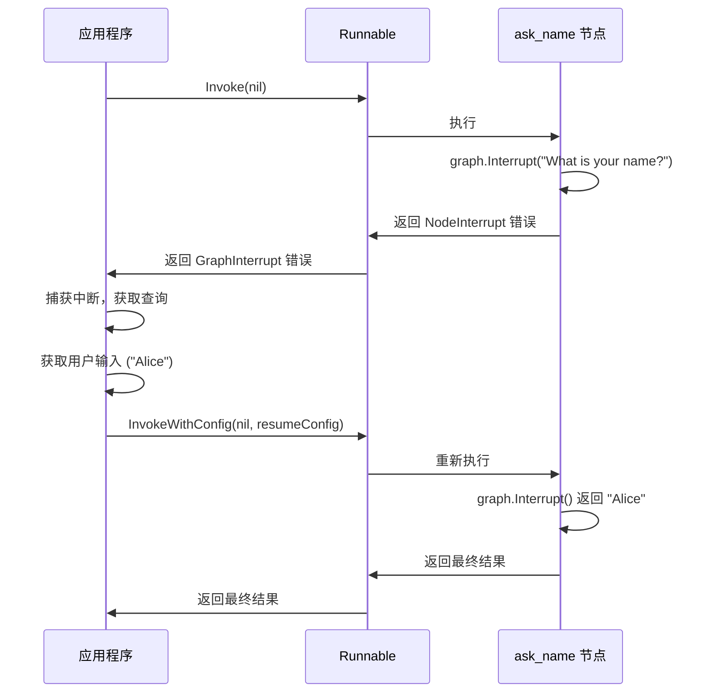
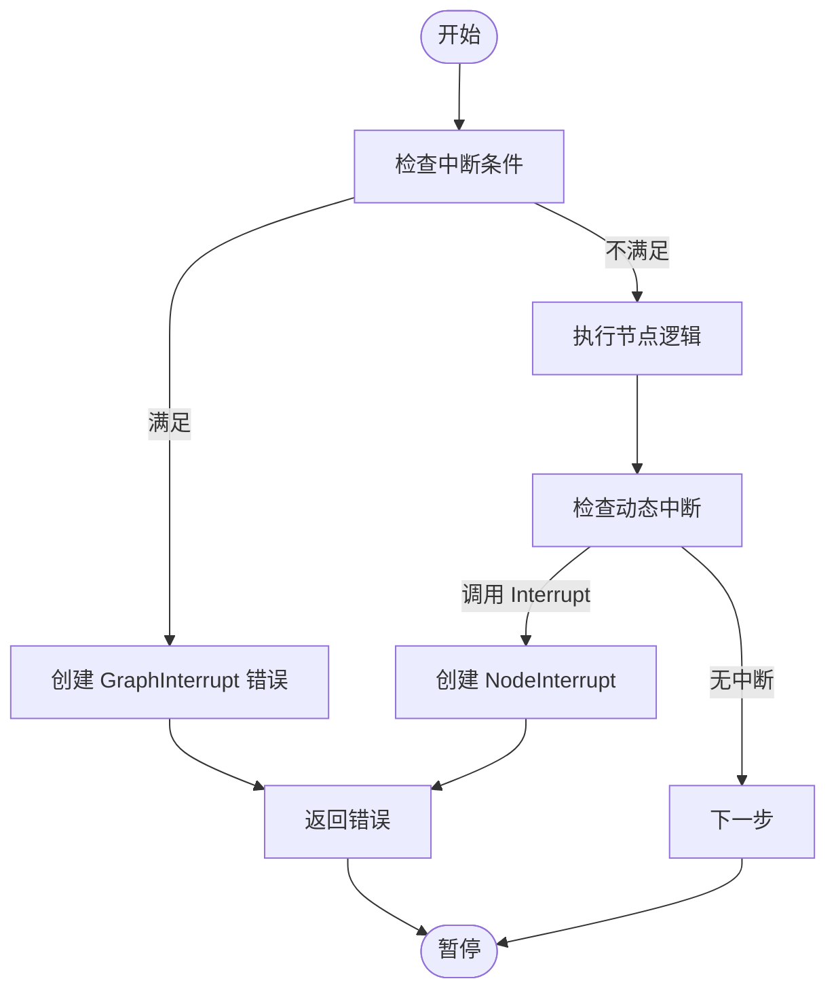
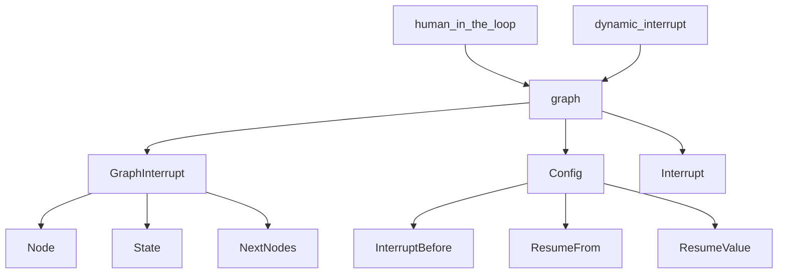

# 人机协作

<cite>
**本文档中引用的文件**  
- [human_in_the_loop\main.go](file://examples/human_in_the_loop/main.go)
- [human_in_the_loop\README.md](file://examples/human_in_the_loop/README.md)
- [dynamic_interrupt\main.go](file://examples/dynamic_interrupt/main.go)
- [dynamic_interrupt\README.md](file://examples/dynamic_interrupt/README.md)
- [graph\errors.go](file://graph/errors.go)
- [graph\interrupt_test.go](file://graph/interrupt_test.go)
- [graph\resume_test.go](file://graph/resume_test.go)
- [graph\checkpointing.go](file://graph/checkpointing.go)
</cite>

## 目录
1. [简介](#简介)
2. [项目结构](#项目结构)
3. [核心组件](#核心组件)
4. [架构概述](#架构概述)
5. [详细组件分析](#详细组件分析)
6. [依赖分析](#依赖分析)
7. [性能考虑](#性能考虑)
8. [故障排除指南](#故障排除指南)
9. [结论](#结论)

## 简介
本教程基于 `human_in_the_loop` 和 `dynamic_interrupt` 示例，深入讲解如何在工作流中插入人工审核节点，实现“暂停-审批-继续”的交互模式。我们将分析 LangGraphGo 中中断机制的实现原理，包括中断条件设置、恢复凭证生成与验证，并提供内容审核、敏感操作确认等实际应用场景。

**Section sources**
- [human_in_the_loop\README.md](file://examples/human_in_the_loop/README.md)
- [dynamic_interrupt\README.md](file://examples/dynamic_interrupt/README.md)

## 项目结构
项目结构清晰地分为 `checkpoint`、`examples`、`graph`、`prebuilt`、`showcases` 和 `tool` 等主要目录。本教程重点关注 `examples` 目录下的 `human_in_the_loop` 和 `dynamic_interrupt` 示例，它们是实现人机协作的核心参考。

**Diagram sources**
- [examples\human_in_the_loop\main.go](file://examples/human_in_the_loop/main.go)
- [examples\dynamic_interrupt\main.go](file://examples/dynamic_interrupt/main.go)

## 核心组件
本教程的核心组件包括 `human_in_the_loop` 和 `dynamic_interrupt` 两个示例，它们分别展示了静态和动态中断机制。`human_in_the_loop` 示例通过 `InterruptBefore` 配置在特定节点前暂停，而 `dynamic_interrupt` 示例则通过 `graph.Interrupt()` 函数在节点内部动态触发中断。

**Section sources**
- [human_in_the_loop\main.go](file://examples/human_in_the_loop/main.go)
- [dynamic_interrupt\main.go](file://examples/dynamic_interrupt/main.go)

## 架构概述
人机协作的架构基于 LangGraphGo 的图执行模型，通过配置中断和恢复机制，实现工作流的暂停与继续。核心架构包括工作流定义、中断配置、状态管理、恢复执行等部分。

**Diagram sources**
- [graph\errors.go](file://graph/errors.go)
- [graph\interrupt_test.go](file://graph/interrupt_test.go)

## 详细组件分析

### human_in_the_loop 示例分析
该示例展示了如何在工作流中插入一个“人工审批”节点。通过设置 `InterruptBefore` 配置，工作流在进入 `human_approval` 节点前暂停，等待人工审批。

#### 静态中断机制

**Diagram sources**
- [human_in_the_loop\main.go](file://examples/human_in_the_loop/main.go#L67-L118)

### dynamic_interrupt 示例分析
该示例展示了如何在节点内部动态触发中断。通过调用 `graph.Interrupt()` 函数，节点可以在运行时暂停，等待外部输入。

#### 动态中断机制

**Diagram sources**
- [dynamic_interrupt\main.go](file://examples/dynamic_interrupt/main.go#L40-L70)

### 中断机制实现原理
LangGraphGo 的中断机制基于 `GraphInterrupt` 错误类型和 `Config` 配置。当工作流需要暂停时，会抛出 `GraphInterrupt` 错误，其中包含当前状态和中断节点信息。恢复执行时，通过 `ResumeFrom` 配置指定从哪个节点继续。

#### 中断与恢复流程

**Diagram sources**
- [graph\errors.go](file://graph/errors.go#L24-L41)
- [graph\resume_test.go](file://graph/resume_test.go#L30-L81)

## 依赖分析
人机协作功能依赖于 LangGraphGo 核心库的中断、恢复和检查点功能。`graph` 包提供了 `GraphInterrupt` 错误类型、`Config` 结构体以及 `Interrupt` 函数，是实现人机协作的基础。

**Diagram sources**
- [graph\errors.go](file://graph/errors.go)
- [graph\checkpointing.go](file://graph/checkpointing.go)

## 性能考虑
使用中断机制时，需考虑状态序列化和持久化的开销。对于长时间运行的工作流，建议使用持久化存储（如 PostgreSQL、Redis）来保存检查点，以确保系统崩溃后能够恢复。

## 故障排除指南
常见问题包括中断未触发、恢复失败等。确保 `InterruptBefore` 或 `InterruptAfter` 的节点名称正确，恢复时传递正确的 `ResumeFrom` 配置和更新后的状态。

**Section sources**
- [graph\interrupt_test.go](file://graph/interrupt_test.go)
- [graph\resume_test.go](file://graph/resume_test.go)

## 结论
通过 `human_in_the_loop` 和 `dynamic_interrupt` 示例，我们学习了如何在 LangGraphGo 中实现人机协作。静态中断适用于预定义的审批节点，而动态中断则提供了更大的灵活性，允许在节点内部根据逻辑决定是否中断。这些机制为构建安全、可控的智能代理应用提供了强大支持。