# 基础示例教程

<cite>
**本文档中引用的文件**
- [examples/basic_example/main.go](file://examples/basic_example/main.go)
- [examples/basic_llm/main.go](file://examples/basic_llm/main.go)
- [examples/basic_example/README.md](file://examples/basic_example/README.md)
- [examples/basic_llm/README.md](file://examples/basic_llm/README.md)
- [graph/graph.go](file://graph/graph.go)
- [graph/state_graph.go](file://graph/state_graph.go)
- [graph/listeners.go](file://graph/listeners.go)
- [graph/checkpointing.go](file://graph/checkpointing.go)
</cite>

## 目录
1. [简介](#简介)
2. [项目结构概览](#项目结构概览)
3. [核心组件分析](#核心组件分析)
4. [基础示例详解](#基础示例详解)
5. [LLM集成示例](#llm集成示例)
6. [架构概览](#架构概览)
7. [详细组件分析](#详细组件分析)
8. [依赖关系分析](#依赖关系分析)
9. [性能考虑](#性能考虑)
10. [故障排除指南](#故障排除指南)
11. [结论](#结论)

## 简介

LangGraphGo 是一个强大的工作流编排框架，专为构建复杂的异步处理流程而设计。本教程将通过两个核心示例：`basic_example` 和 `basic_llm`，帮助初学者快速掌握 langgraphgo 的核心概念和使用方法。

这两个示例分别展示了：
- **基础工作流执行**：演示如何创建简单的线性工作流程
- **监听器机制**：展示实时进度跟踪和事件处理
- **检查点持久化**：介绍状态保存和恢复功能
- **可视化工具**：提供图形结构的可视化表示
- **LLM集成**：展示如何与大型语言模型进行交互

## 项目结构概览

langgraphgo 项目采用模块化架构，主要包含以下核心目录：

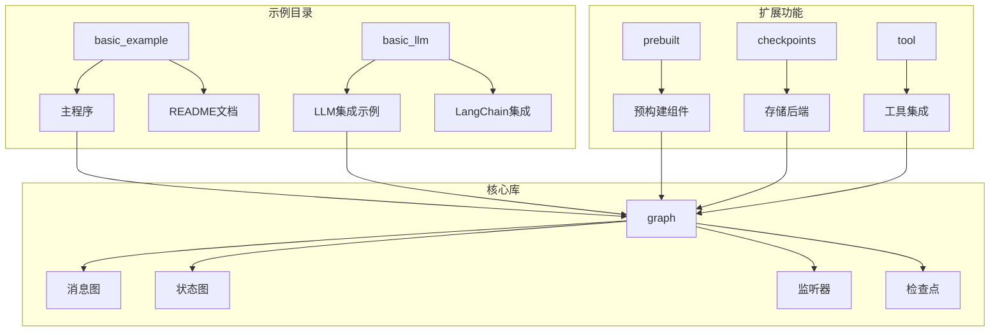

**图表来源**
- [examples/basic_example/main.go](file://examples/basic_example/main.go#L1-L140)
- [examples/basic_llm/main.go](file://examples/basic_llm/main.go#L1-L60)
- [graph/graph.go](file://graph/graph.go#L1-L492)

**章节来源**
- [examples/basic_example/README.md](file://examples/basic_example/README.md#L1-L85)
- [examples/basic_llm/README.md](file://examples/basic_llm/README.md#L1-L89)

## 核心组件分析

### 图形系统架构

langgraphgo 的核心是基于图的工作流系统，支持多种类型的图结构：

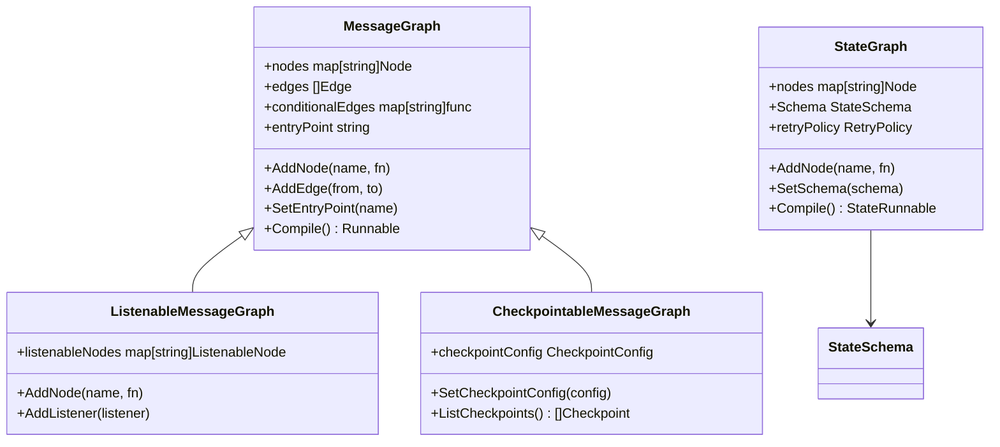

**图表来源**
- [graph/graph.go](file://graph/graph.go#L74-L139)
- [graph/state_graph.go](file://graph/state_graph.go#L10-L56)

### 节点和边系统

工作流的基本构建块是节点（Node）和边（Edge），它们定义了数据在系统中的流动路径：

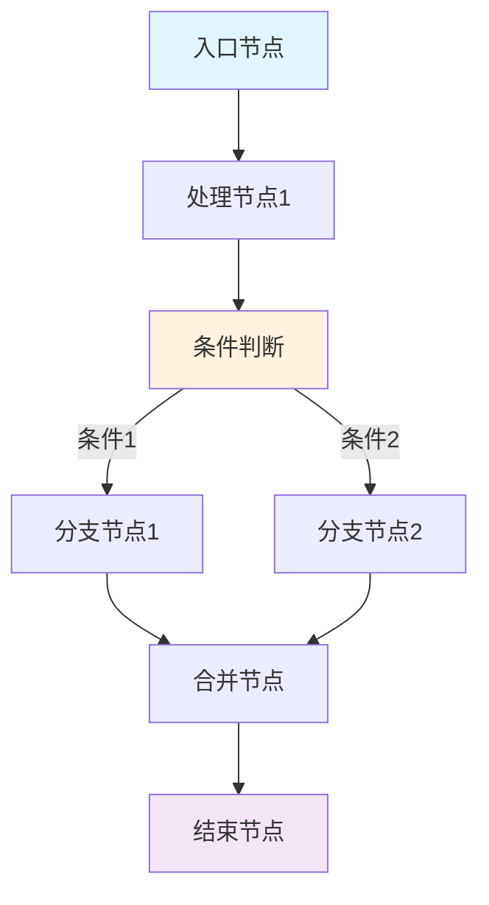

**图表来源**
- [graph/graph.go](file://graph/graph.go#L103-L123)

**章节来源**
- [graph/graph.go](file://graph/graph.go#L74-L139)
- [graph/state_graph.go](file://graph/state_graph.go#L10-L56)

## 基础示例详解

### 基本工作流执行

第一个示例展示了最基础的工作流执行模式，演示了如何创建简单的线性处理流程。

#### 图的初始化和配置

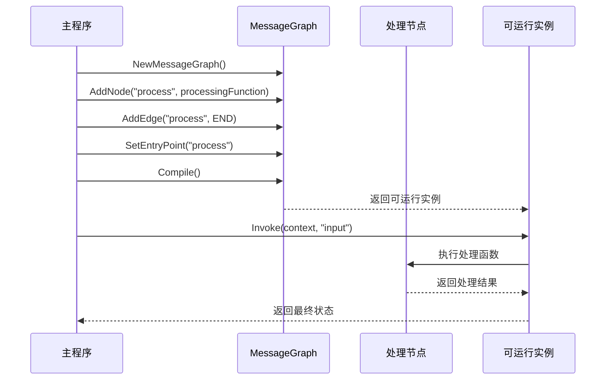

**图表来源**
- [examples/basic_example/main.go](file://examples/basic_example/main.go#L25-L38)

#### 关键步骤解析

1. **创建图实例**：使用 `NewMessageGraph()` 创建新的消息图
2. **添加节点**：通过 `AddNode()` 方法注册处理函数
3. **设置连接**：使用 `AddEdge()` 定义节点间的流向
4. **配置入口点**：通过 `SetEntryPoint()` 指定起始节点
5. **编译执行**：调用 `Compile()` 获取可运行实例
6. **触发执行**：通过 `Invoke()` 启动工作流

### 流式监听器示例

第二个示例展示了如何使用监听器实现实时进度跟踪：

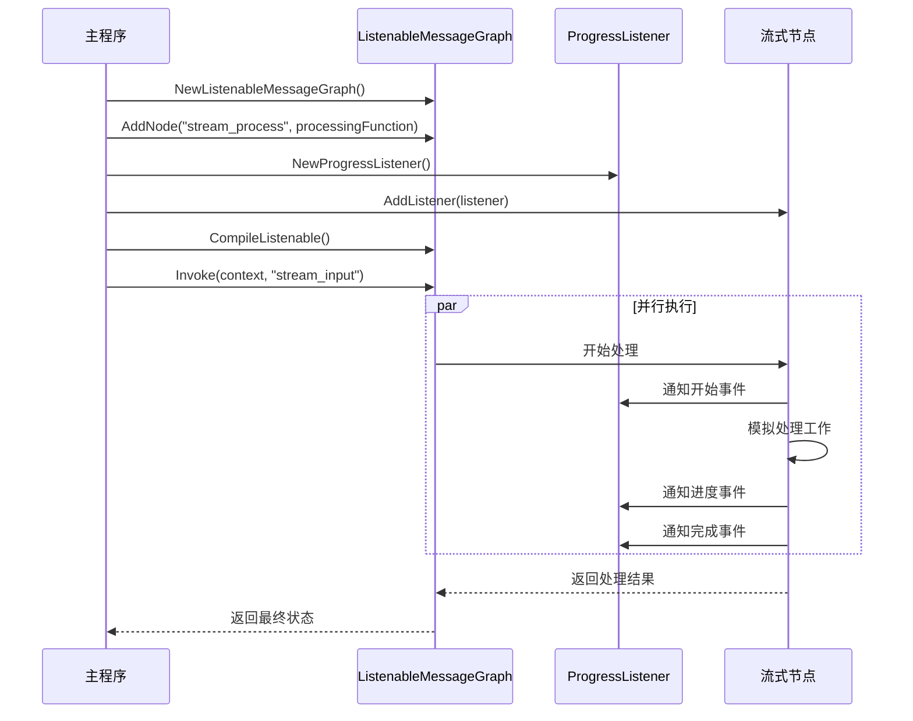

**图表来源**
- [examples/basic_example/main.go](file://examples/basic_example/main.go#L44-L62)

### 检查点持久化示例

第三个示例演示了状态持久化和恢复机制：

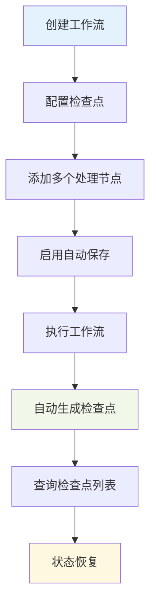

**图表来源**
- [examples/basic_example/main.go](file://examples/basic_example/main.go#L68-L107)

**章节来源**
- [examples/basic_example/main.go](file://examples/basic_example/main.go#L22-L138)

## LLM集成示例

### LangChain集成架构

LLM示例展示了如何将 langgraphgo 与 LangChain Go 集成，实现智能对话处理：

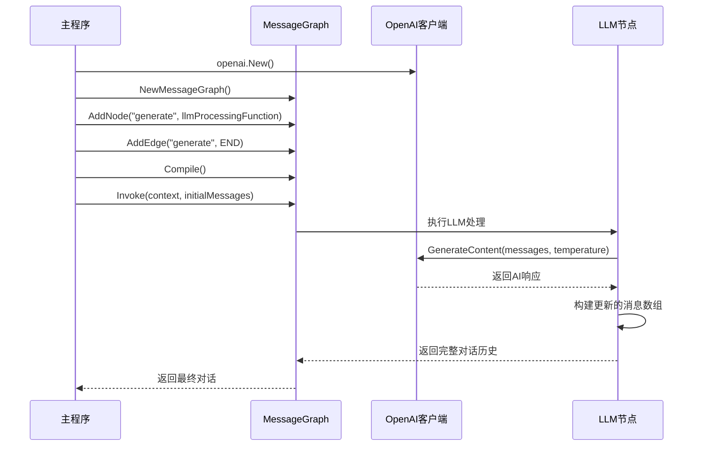

**图表来源**
- [examples/basic_llm/main.go](file://examples/basic_llm/main.go#L12-L58)

### 消息处理流程

LLM示例中的消息处理遵循以下模式：

1. **初始化对话**：创建包含初始消息的数组
2. **LLM调用**：使用 LangChain 客户端生成响应
3. **状态更新**：将AI响应追加到对话历史
4. **状态传播**：将更新后的对话历史传递给下一个节点

**章节来源**
- [examples/basic_llm/main.go](file://examples/basic_llm/main.go#L1-L60)

## 架构概览

### 整体系统架构

langgraphgo 采用分层架构设计，支持多种工作流模式：

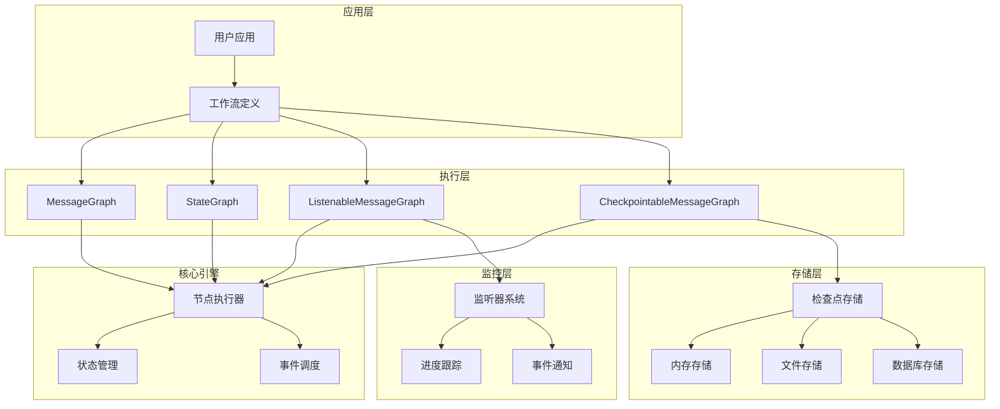

**图表来源**
- [graph/graph.go](file://graph/graph.go#L74-L139)
- [graph/state_graph.go](file://graph/state_graph.go#L10-L56)
- [graph/listeners.go](file://graph/listeners.go#L187-L200)

## 详细组件分析

### 节点执行机制

节点是工作流的基本执行单元，每个节点都包含一个处理函数：

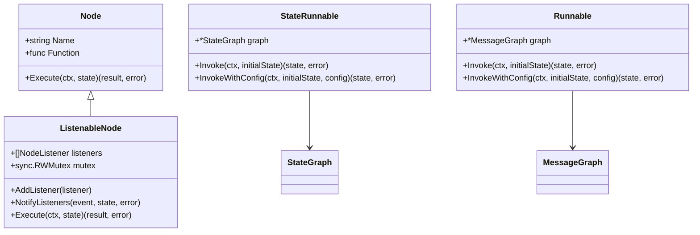

**图表来源**
- [graph/graph.go](file://graph/graph.go#L52-L60)
- [graph/listeners.go](file://graph/listeners.go#L89-L102)

### 状态传递机制

工作流中的状态传递遵循以下原则：

1. **状态不变性**：默认情况下，状态在节点间保持不变
2. **显式更新**：只有当节点返回新状态时才会更新
3. **命令模式**：支持通过 Command 对象控制执行流程
4. **Schema驱动**：可选的状态模式定义更新逻辑

### 监听器系统

监听器系统提供了强大的事件通知机制：

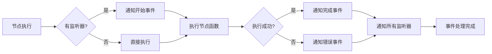

**图表来源**
- [graph/listeners.go](file://graph/listeners.go#L159-L174)

**章节来源**
- [graph/graph.go](file://graph/graph.go#L52-L60)
- [graph/listeners.go](file://graph/listeners.go#L89-L174)

## 依赖关系分析

### 核心依赖图

langgraphgo 的依赖关系相对简洁，主要依赖于标准库和少量外部包：

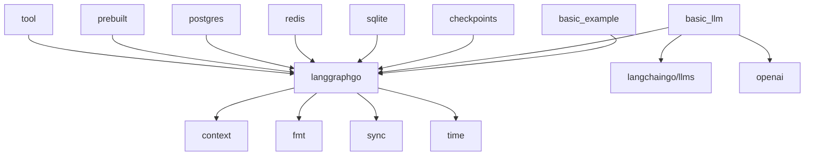

**图表来源**
- [examples/basic_example/main.go](file://examples/basic_example/main.go#L3-L10)
- [examples/basic_llm/main.go](file://examples/basic_llm/main.go#L3-L10)

### 模块间耦合度

langgraphgo 设计为低耦合的模块化系统：

- **核心模块**：graph 包提供基础功能，无外部依赖
- **扩展模块**：checkpoints、prebuilt 等提供特定功能
- **工具模块**：tool 包提供工具集成能力
- **示例模块**：examples 包展示使用模式

**章节来源**
- [examples/basic_example/main.go](file://examples/basic_example/main.go#L3-L10)
- [examples/basic_llm/main.go](file://examples/basic_llm/main.go#L3-L10)

## 性能考虑

### 并发执行优化

langgraphgo 支持并行节点执行，提高整体性能：

- **节点级并行**：同一时间可以执行多个独立节点
- **监听器异步**：监听器通知不阻塞主执行流程
- **状态隔离**：并发执行时的状态隔离机制

### 内存管理

- **状态复制**：避免共享可变状态导致的竞争条件
- **垃圾回收**：及时释放不再需要的中间状态
- **检查点优化**：可配置的检查点清理策略

### 扩展性设计

- **插件架构**：支持自定义节点类型
- **存储抽象**：检查点存储可替换
- **监听器扩展**：可添加自定义事件处理器

## 故障排除指南

### 常见问题及解决方案

#### 1. 入口点未设置
**问题**：尝试编译图但未设置入口点
**解决**：确保调用 `SetEntryPoint()` 设置起始节点

#### 2. 节点未找到
**问题**：执行时提示节点不存在
**解决**：检查节点名称拼写和添加顺序

#### 3. 状态类型不匹配
**问题**：节点函数返回的状态类型不符合预期
**解决**：确保节点函数返回正确的状态类型

#### 4. 监听器阻塞
**问题**：监听器处理耗时过长影响主流程
**解决**：在监听器中使用异步处理或快速返回

### 调试技巧

1. **启用追踪**：使用内置的追踪功能查看执行路径
2. **检查点调试**：利用检查点功能暂停和检查状态
3. **监听器日志**：添加日志监听器跟踪执行过程
4. **可视化工具**：使用图形化工具检查工作流结构

**章节来源**
- [graph/graph.go](file://graph/graph.go#L14-L22)

## 结论

langgraphgo 提供了一个强大而灵活的工作流编排平台，通过本教程的介绍，您应该能够：

1. **理解核心概念**：掌握图、节点、边等基本概念
2. **构建简单工作流**：学会创建和执行基本的线性工作流
3. **使用高级功能**：了解监听器、检查点和可视化等高级特性
4. **集成LLM功能**：掌握与大型语言模型的集成方法
5. **扩展系统功能**：了解如何根据需求扩展系统能力

建议初学者从基础示例开始，逐步探索更复杂的功能，并参考项目的完整文档和示例代码。随着对核心概念的理解加深，您可以开始构建自己的工作流应用，利用 langgraphgo 强大的并发处理能力和灵活的架构设计。

通过实践这些示例，您将能够快速上手 langgraphgo 的核心工作流概念，并为构建生产级别的应用程序打下坚实基础。