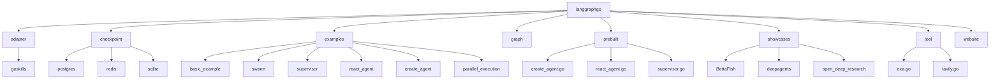
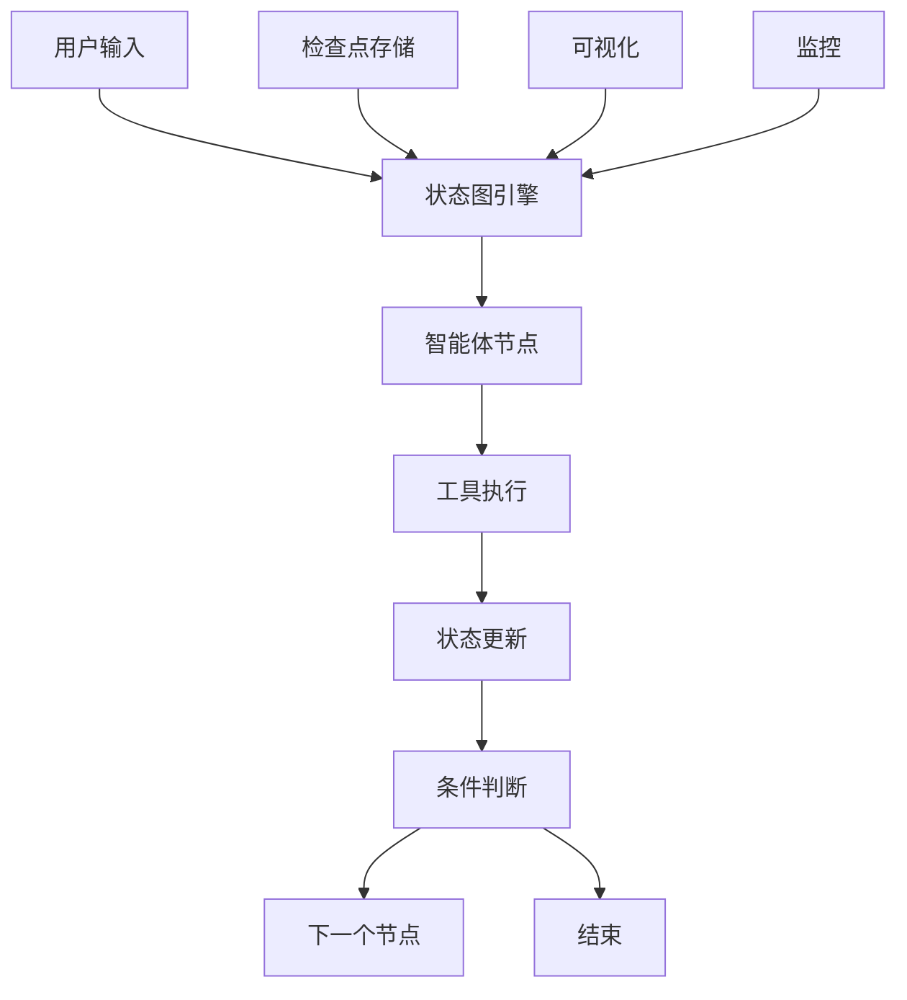
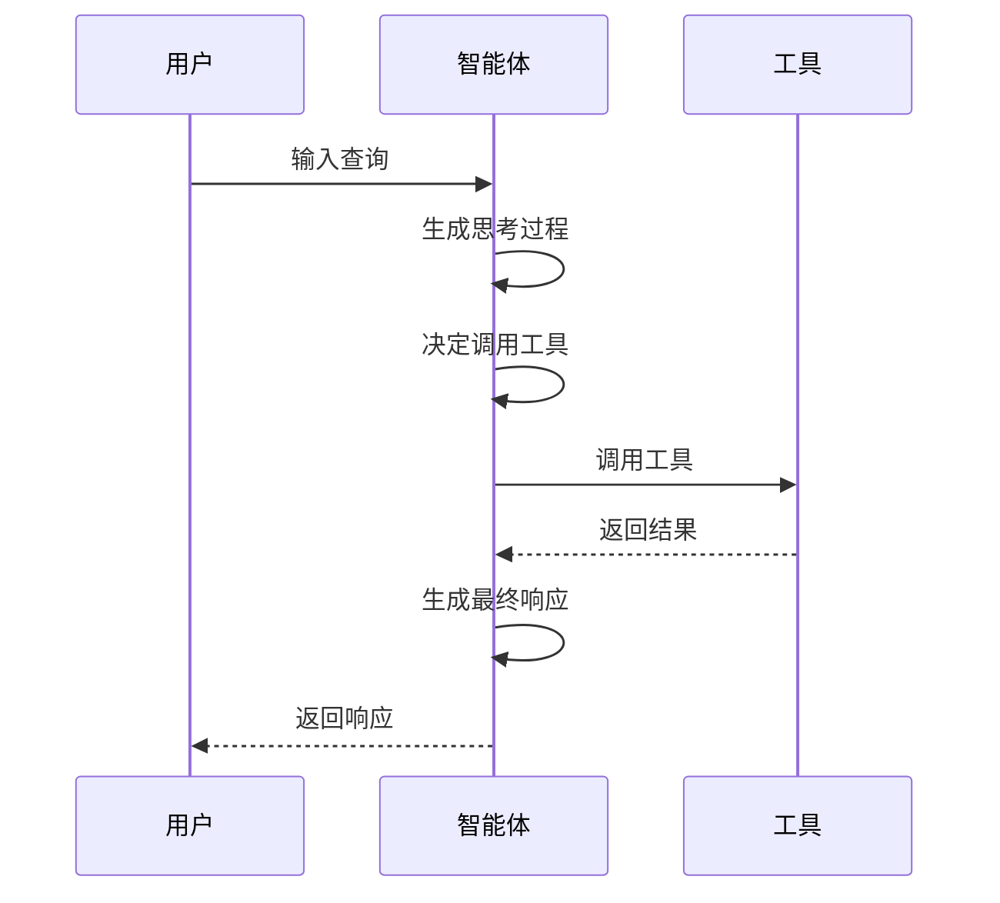
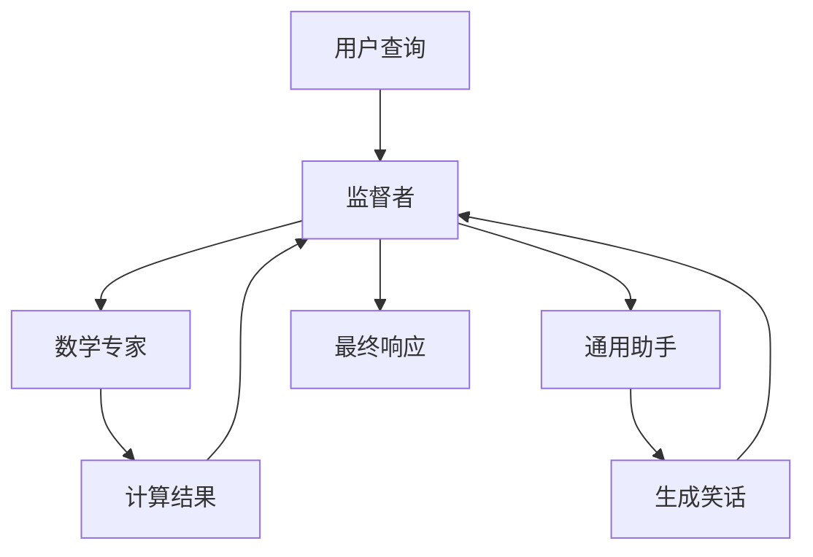
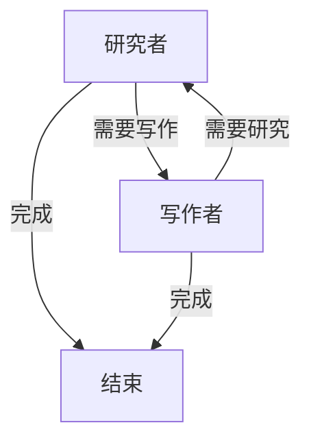
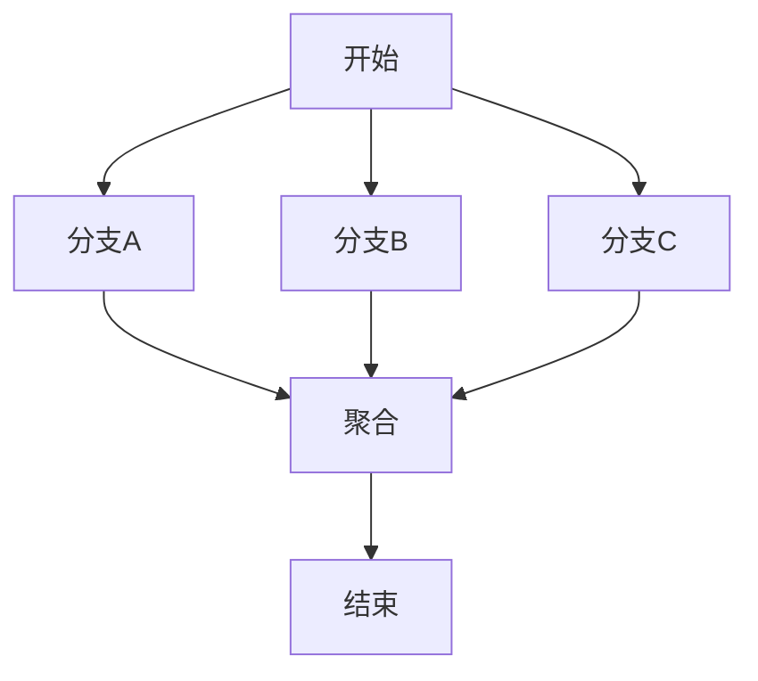
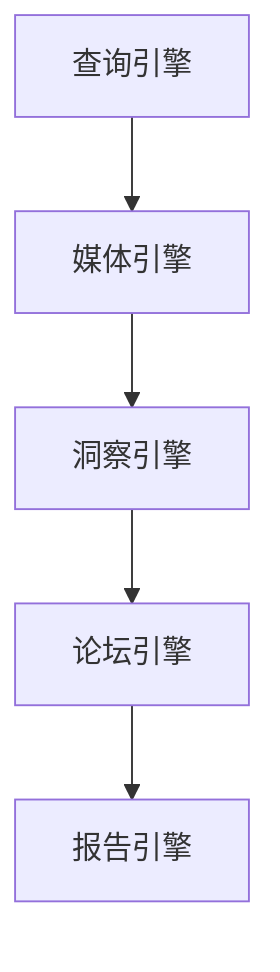
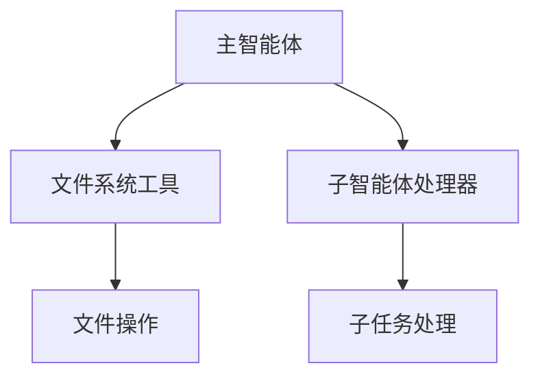
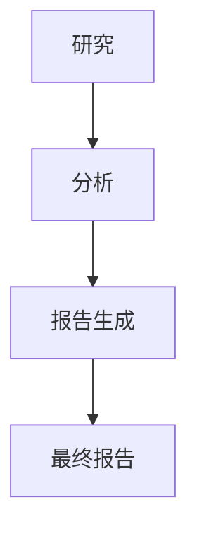
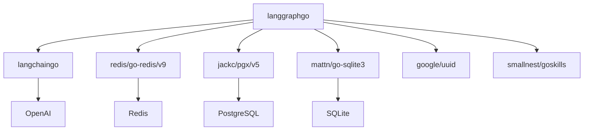

# 多智能体系统展示

<cite>
**本文档中引用的文件**   
- [main.go](file://examples/swarm/main.go)
- [main.go](file://examples/create_agent/main.go)
- [main.go](file://examples/react_agent/main.go)
- [main.go](file://examples/supervisor/main.go)
- [main.go](file://examples/parallel_execution/main.go)
- [main.go](file://showcases/BettaFish/main.go)
- [main.go](file://showcases/deepagents/main.go)
- [main.go](file://showcases/open_deep_research/main.go)
- [create_agent.go](file://prebuilt/create_agent.go)
- [react_agent.go](file://prebuilt/react_agent.go)
- [supervisor.go](file://prebuilt/supervisor.go)
- [state_graph.go](file://graph/state_graph.go)
- [go.mod](file://go.mod)
- [README.md](file://README.md)
</cite>

## 目录
1. [简介](#简介)
2. [项目结构](#项目结构)
3. [核心组件](#核心组件)
4. [架构概述](#架构概述)
5. [详细组件分析](#详细组件分析)
6. [依赖分析](#依赖分析)
7. [性能考虑](#性能考虑)
8. [故障排除指南](#故障排除指南)
9. [结论](#结论)

## 简介

本项目是一个基于Go语言的多智能体系统框架，旨在实现与Python LangGraph库功能对等的多智能体协作系统。该框架支持并行执行、持久化、高级状态管理、预构建智能体以及人机协作工作流等特性。系统基于状态图（State Graph）构建，允许开发者创建复杂的多智能体协作流程，包括研究者-写作者协作、监督者调度、深度研究等场景。

系统的主要特点包括：
- **并行执行**：支持节点的并发执行和线程安全的状态合并
- **持久化与可靠性**：提供Redis、PostgreSQL和SQLite检查点实现
- **高级功能**：支持状态模式、智能消息合并、命令API、临时通道、子图嵌套等
- **开发者体验**：提供可视化、人机协作、内置追踪和监控功能

**Section sources**
- [README.md](file://README.md#L1-L185)

## 项目结构

项目采用模块化结构，主要分为以下几个部分：

**Diagram sources**
- [README.md](file://README.md#L1-L185)

**Section sources**
- [README.md](file://README.md#L1-L185)

## 核心组件

本系统的核心组件包括预构建的智能体工厂、状态图引擎、检查点系统和工具集成。预构建智能体组件（prebuilt）提供了创建智能体的工厂函数，包括CreateAgent、ReActAgent和Supervisor等。状态图引擎（graph）负责管理智能体的状态转换和执行流程。检查点系统（checkpoint）支持Redis、PostgreSQL和SQLite等多种持久化存储。工具集成（tool）提供了Tavily和Exa等搜索工具的集成。

**Section sources**
- [prebuilt/create_agent.go](file://prebuilt/create_agent.go#L1-L252)
- [prebuilt/react_agent.go](file://prebuilt/react_agent.go#L1-L182)
- [prebuilt/supervisor.go](file://prebuilt/supervisor.go#L1-L200)
- [graph/state_graph.go](file://graph/state_graph.go#L1-L500)

## 架构概述

系统采用基于状态图的架构，通过定义节点和边来构建智能体的工作流程。每个节点代表一个智能体或处理步骤，边定义了节点之间的转换逻辑。系统支持条件边，可以根据状态动态决定执行路径。预构建的智能体组件提供了常见的智能体模式实现，如ReAct智能体、监督者模式等。

**Diagram sources**
- [graph/state_graph.go](file://graph/state_graph.go#L1-L500)

**Section sources**
- [graph/state_graph.go](file://graph/state_graph.go#L1-L500)

## 详细组件分析

### 智能体协作分析

系统支持多种智能体协作模式，包括简单的ReAct智能体、监督者调度和复杂的多智能体协作。

#### ReAct智能体
ReAct智能体采用"思考-行动"循环模式，能够根据需要调用工具来完成任务。

**Diagram sources**
- [prebuilt/react_agent.go](file://prebuilt/react_agent.go#L1-L182)

#### 监督者模式
监督者模式允许一个主智能体协调多个专业智能体完成复杂任务。

**Diagram sources**
- [prebuilt/supervisor.go](file://prebuilt/supervisor.go#L1-L200)

#### 多智能体协作
多智能体协作模式支持智能体之间的控制权交接，实现复杂的协作流程。

**Diagram sources**
- [examples/swarm/main.go](file://examples/swarm/main.go#L1-L244)

**Section sources**
- [examples/swarm/main.go](file://examples/swarm/main.go#L1-L244)
- [examples/react_agent/main.go](file://examples/react_agent/main.go#L1-L122)
- [examples/supervisor/main.go](file://examples/supervisor/main.go#L1-L138)

### 并行执行分析

系统支持并行执行，可以同时运行多个分支任务，然后聚合结果。

**Diagram sources**
- [examples/parallel_execution/main.go](file://examples/parallel_execution/main.go#L1-L97)

**Section sources**
- [examples/parallel_execution/main.go](file://examples/parallel_execution/main.go#L1-L97)

### 展示案例分析

#### BettaFish案例
BettaFish是一个复杂的多智能体系统，包含查询引擎、媒体引擎、洞察引擎、论坛引擎和报告引擎。

**Diagram sources**
- [showcases/BettaFish/main.go](file://showcases/BettaFish/main.go#L1-L72)

#### DeepAgents案例
DeepAgents展示了深度智能体的能力，包括文件系统访问和子智能体处理。

**Diagram sources**
- [showcases/deepagents/main.go](file://showcases/deepagents/main.go#L1-L68)

#### 开放深度研究案例
开放深度研究案例展示了复杂的研究工作流，包括研究、分析和报告生成。

**Diagram sources**
- [showcases/open_deep_research/main.go](file://showcases/open_deep_research/main.go#L1-L96)

**Section sources**
- [showcases/BettaFish/main.go](file://showcases/BettaFish/main.go#L1-L72)
- [showcases/deepagents/main.go](file://showcases/deepagents/main.go#L1-L68)
- [showcases/open_deep_research/main.go](file://showcases/open_deep_research/main.go#L1-L96)

## 依赖分析

系统依赖于多个外部库，主要包括：

**Diagram sources**
- [go.mod](file://go.mod#L1-L85)

**Section sources**
- [go.mod](file://go.mod#L1-L85)

## 性能考虑

系统在设计时考虑了性能因素，包括：
- 图操作性能：14-94μs，取决于格式
- 追踪开销：每次执行约4μs
- 事件处理：每秒1000+事件
- 流式传输延迟：<100ms

这些性能指标确保了系统在处理复杂多智能体协作时的高效性。

**Section sources**
- [README.md](file://README.md#L166-L171)

## 故障排除指南

常见问题及解决方案：
1. **环境变量未设置**：确保设置OPENAI_API_KEY和TAVILY_API_KEY等必要环境变量
2. **依赖缺失**：使用go get命令安装所有依赖
3. **执行超时**：为长时间运行的任务设置适当的超时
4. **状态转换错误**：检查状态模式定义和条件边逻辑

**Section sources**
- [examples/swarm/main.go](file://examples/swarm/main.go#L41-L43)
- [showcases/BettaFish/main.go](file://showcases/BettaFish/main.go#L24-L29)

## 结论

langgraphgo提供了一个功能强大的多智能体系统框架，支持多种智能体协作模式和复杂的工作流。通过预构建的智能体组件和灵活的状态图引擎，开发者可以快速构建复杂的AI应用。系统的模块化设计和丰富的示例使得学习和使用变得简单。未来可以进一步扩展支持更多的工具集成和更复杂的协作模式。