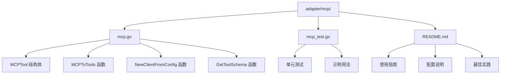
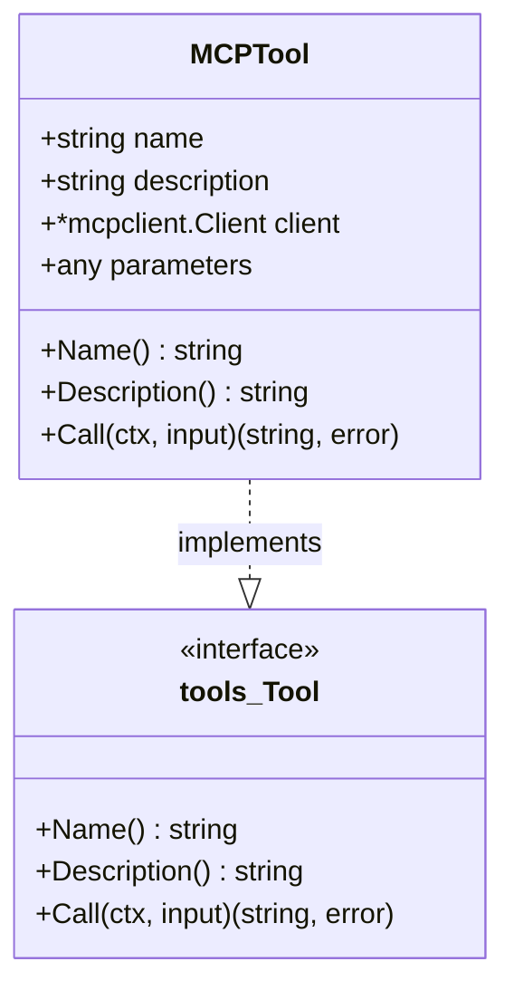
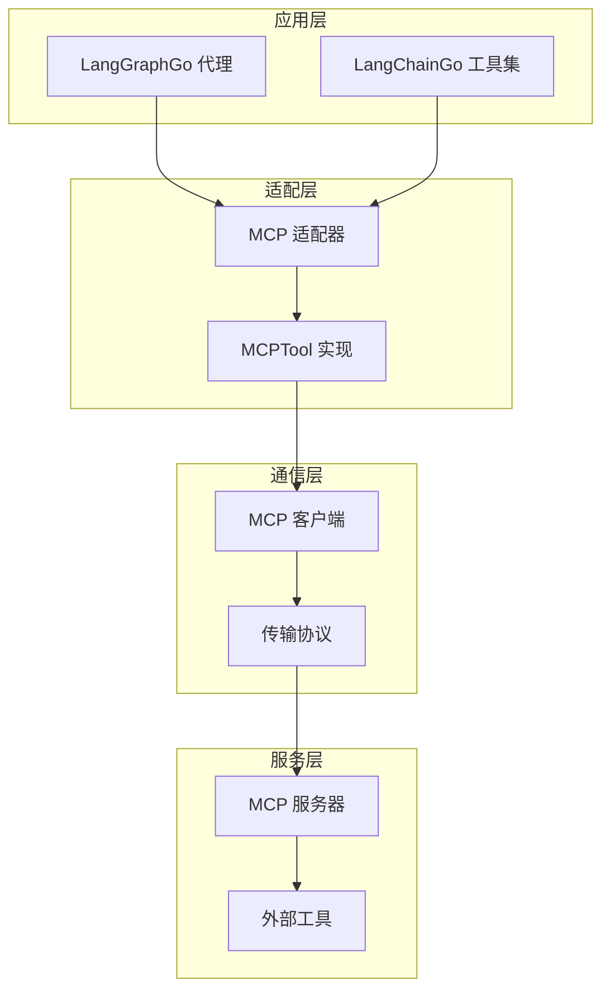
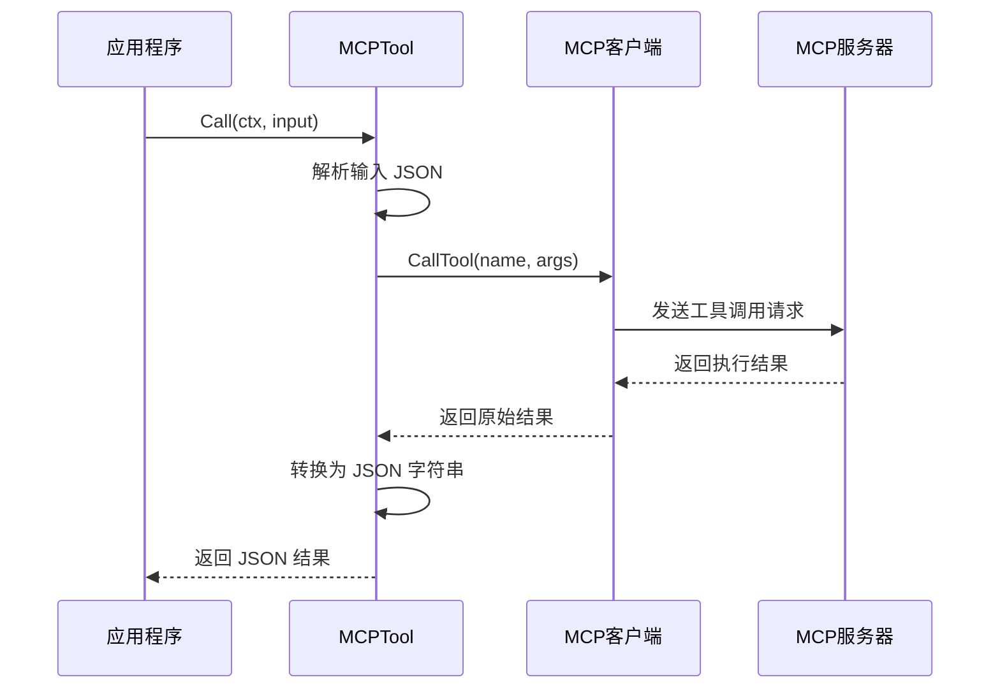
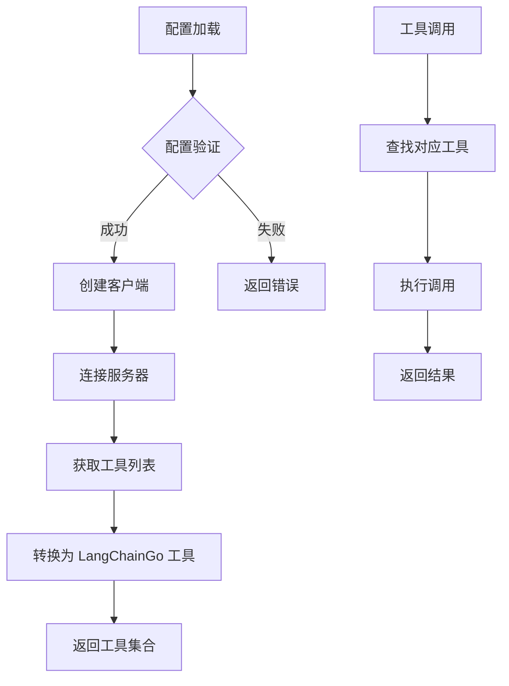
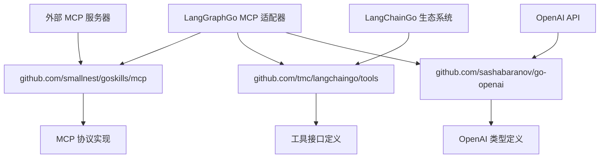

# MCP 适配器

<cite>
**本文档引用的文件**
- [adapter/mcp/mcp.go](file://adapter/mcp/mcp.go)
- [adapter/mcp/mcp_test.go](file://adapter/mcp/mcp_test.go)
- [adapter/mcp/README.md](file://adapter/mcp/README.md)
- [examples/mcp_agent/main.go](file://examples/mcp_agent/main.go)
- [testdata/mcp/mcp.json](file://testdata/mcp/mcp.json)
- [adapter/goskills/goskills.go](file://adapter/goskills/goskills.go)
- [testdata/skills/mcp-builder/reference/mcp_best_practices.md](file://testdata/skills/mcp-builder/reference/mcp_best_practices.md)
- [testdata/skills/mcp-builder/mcp-builder/scripts/connections.py](file://testdata/skills/mcp-builder/mcp-builder/scripts/connections.py)
</cite>

## 目录
1. [简介](#简介)
2. [项目结构](#项目结构)
3. [核心组件](#核心组件)
4. [架构概览](#架构概览)
5. [详细组件分析](#详细组件分析)
6. [依赖关系分析](#依赖关系分析)
7. [性能考虑](#性能考虑)
8. [故障排除指南](#故障排除指南)
9. [结论](#结论)

## 简介

MCP（Model Context Protocol）适配器是 LangGraphGo 框架中的一个重要组件，它提供了将 MCP 工具无缝集成到 LangChainGo 生态系统的能力。该适配器允许开发者使用 MCP 协议定义的外部服务工具，通过统一的接口与语言模型进行交互。

MCP 是一种标准化协议，旨在让大型语言模型能够安全、高效地访问和操作外部服务。通过 MCP 适配器，LangGraphGo 用户可以利用丰富的第三方工具生态系统，扩展 AI 应用的功能边界。

## 项目结构

MCP 适配器位于 `adapter/mcp/` 目录下，包含以下关键文件：



**图表来源**
- [adapter/mcp/mcp.go](file://adapter/mcp/mcp.go#L1-L113)
- [adapter/mcp/mcp_test.go](file://adapter/mcp/mcp_test.go#L1-L107)
- [adapter/mcp/README.md](file://adapter/mcp/README.md#L1-L211)

**章节来源**
- [adapter/mcp/mcp.go](file://adapter/mcp/mcp.go#L1-L113)
- [adapter/mcp/mcp_test.go](file://adapter/mcp/mcp_test.go#L1-L107)
- [adapter/mcp/README.md](file://adapter/mcp/README.md#L1-L211)

## 核心组件

### MCPTool 结构体

MCPTool 是 MCP 适配器的核心数据结构，实现了 LangChainGo 的 `tools.Tool` 接口：



**图表来源**
- [adapter/mcp/mcp.go](file://adapter/mcp/mcp.go#L14-L53)

### 主要功能函数

MCP 适配器提供以下核心功能函数：

| 函数名 | 功能描述 | 输入参数 | 返回值 |
|--------|----------|----------|--------|
| `MCPToTools` | 将 MCP 客户端的工具转换为 LangChainGo 工具 | `ctx` 上下文, `client` MCP 客户端 | `[]tools.Tool, error` |
| `NewClientFromConfig` | 从配置文件创建 MCP 客户端 | `ctx` 上下文, `configPath` 配置路径 | `*mcpclient.Client, error` |
| `GetToolSchema` | 获取工具的 JSON 参数模式 | `tool` LangChainGo 工具 | `any, bool` |
| `MCPToolsToOpenAI` | 将 MCP 工具转换为 OpenAI 格式 | `ctx` 上下文, `client` MCP 客户端 | `[]openai.Tool, error` |

**章节来源**
- [adapter/mcp/mcp.go](file://adapter/mcp/mcp.go#L55-L113)

## 架构概览

MCP 适配器采用分层架构设计，提供了清晰的抽象层次：



**图表来源**
- [adapter/mcp/mcp.go](file://adapter/mcp/mcp.go#L55-L113)
- [testdata/skills/mcp-builder/mcp-builder/scripts/connections.py](file://testdata/skills/mcp-builder/mcp-builder/scripts/connections.py#L1-L151)

## 详细组件分析

### MCPTool 实现

MCPTool 是 MCP 适配器的核心实现，负责将 MCP 工具包装为 LangChainGo 兼容的工具接口：



**图表来源**
- [adapter/mcp/mcp.go](file://adapter/mcp/mcp.go#L31-L52)

#### 工具调用流程

1. **输入解析阶段**：将 JSON 格式的输入字符串反序列化为参数映射
2. **客户端调用**：通过 MCP 客户端向远程服务器发送工具调用请求
3. **结果处理**：将服务器返回的结果序列化为 JSON 字符串
4. **错误处理**：提供详细的错误信息和上下文

**章节来源**
- [adapter/mcp/mcp.go](file://adapter/mcp/mcp.go#L31-L52)

### MCP 客户端管理

MCP 客户端负责与多个 MCP 服务器的连接管理和工具发现：



**图表来源**
- [adapter/mcp/mcp.go](file://adapter/mcp/mcp.go#L83-L96)
- [adapter/mcp/mcp.go](file://adapter/mcp/mcp.go#L58-L80)

**章节来源**
- [adapter/mcp/mcp.go](file://adapter/mcp/mcp.go#L83-L96)
- [adapter/mcp/mcp.go](file://adapter/mcp/mcp.go#L58-L80)

### 传输协议支持

MCP 协议支持多种传输机制，适应不同的部署场景：

| 传输类型 | 适用场景 | 特点 | 配置方式 |
|----------|----------|------|----------|
| Stdio | 本地集成、命令行工具 | 子进程执行，简单配置 | `command`, `args`, `env` |
| SSE | 实时更新、Web 集成 | 服务器推送通知 | `type: "sse"`, `url`, `headers` |
| HTTP | Web 服务、多客户端 | 请求-响应模式 | `type: "http"`, `url`, `headers` |

**章节来源**
- [testdata/skills/mcp-builder/reference/mcp_best_practices.md](file://testdata/skills/mcp-builder/reference/mcp_best_practices.md#L167-L316)
- [testdata/skills/mcp-builder/mcp-builder/scripts/connections.py](file://testdata/skills/mcp-builder/mcp-builder/scripts/connections.py#L112-L151)

### 工具命名冲突解决

MCP 协议定义了工具名称冲突的解决方案：

```mermaid
flowchart TD
A[检测工具冲突] --> B{选择冲突解决策略}
B --> |用户定义名称| C[concat(serverName, "___", toolName)]
B --> |随机前缀| D[randomPrefix + "___" + toolName]
B --> |URI 前缀| E[serverURI + ":" + toolName]
C --> F[生成唯一工具名称]
D --> F
E --> F
F --> G[注册到工具列表]
```

**图表来源**
- [testdata/skills/mcp-builder/reference/mcp_best_practices.md](file://testdata/skills/mcp-builder/reference/mcp_best_practices.md#L635-L646)

**章节来源**
- [testdata/skills/mcp-builder/reference/mcp_best_practices.md](file://testdata/skills/mcp-builder/reference/mcp_best_practices.md#L635-L646)

## 依赖关系分析

MCP 适配器的依赖关系体现了模块化设计原则：



**图表来源**
- [adapter/mcp/mcp.go](file://adapter/mcp/mcp.go#L3-L10)
- [adapter/mcp/README.md](file://adapter/mcp/README.md#L202-L206)

### 外部依赖详解

1. **MCP 协议实现** (`github.com/smallnest/goskills/mcp`)
   - 提供 MCP 协议的核心功能
   - 支持多种传输协议
   - 处理客户端-服务器通信

2. **LangChainGo 工具接口** (`github.com/tmc/langchaingo/tools`)
   - 定义通用工具接口
   - 确保适配器的兼容性
   - 支持工具链式调用

3. **OpenAI 类型定义** (`github.com/sashabaranov/go-openai`)
   - 提供 OpenAI 工具格式支持
   - 便于与 OpenAI API 集成
   - 支持标准工具定义

**章节来源**
- [adapter/mcp/mcp.go](file://adapter/mcp/mcp.go#L3-L10)
- [adapter/mcp/README.md](file://adapter/mcp/README.md#L202-L206)

## 性能考虑

### 连接管理

MCP 适配器采用连接池和资源管理策略来优化性能：

- **连接复用**：维护与 MCP 服务器的持久连接
- **超时控制**：设置合理的请求超时时间
- **错误恢复**：实现自动重连机制
- **资源清理**：及时释放不再使用的连接

### 工具调用优化

- **异步处理**：支持并发工具调用
- **结果缓存**：缓存频繁访问的数据
- **批量操作**：支持批量工具调用
- **流式处理**：处理大数据量的工具输出

### 内存管理

- **对象池**：重用工具实例减少 GC 压力
- **延迟初始化**：按需创建 MCP 客户端
- **内存监控**：跟踪内存使用情况
- **垃圾回收优化**：及时清理临时对象

## 故障排除指南

### 常见问题及解决方案

#### 配置加载错误

**问题症状**：无法加载 MCP 配置文件

**可能原因**：
- 配置文件路径错误
- JSON 格式不正确
- 权限不足

**解决方案**：
1. 验证配置文件路径和权限
2. 检查 JSON 格式有效性
3. 查看详细的错误信息

#### 连接失败

**问题症状**：无法连接到 MCP 服务器

**可能原因**：
- 服务器未启动
- 网络连接问题
- 认证失败

**解决方案**：
1. 检查 MCP 服务器状态
2. 验证网络连接
3. 确认认证凭据

#### 工具调用错误

**问题症状**：工具调用返回错误或异常

**可能原因**：
- 参数格式不正确
- 工具不存在
- 服务器内部错误

**解决方案**：
1. 验证工具参数格式
2. 检查工具名称拼写
3. 查看服务器日志

**章节来源**
- [adapter/mcp/README.md](file://adapter/mcp/README.md#L174-L183)
- [adapter/mcp/mcp_test.go](file://adapter/mcp/mcp_test.go#L1-L107)

### 调试技巧

1. **启用详细日志**：设置适当的日志级别
2. **检查工具模式**：使用 `GetToolSchema` 函数查看工具参数
3. **验证连接状态**：确认 MCP 客户端连接正常
4. **测试单个工具**：逐一测试各个工具的功能

## 结论

MCP 适配器为 LangGraphGo 提供了强大的外部工具集成能力，通过标准化的接口设计和灵活的配置选项，使得开发者能够轻松地将各种 MCP 工具整合到 AI 应用中。

### 主要优势

1. **标准化接口**：统一的工具调用接口
2. **多服务器支持**：同时连接多个 MCP 服务器
3. **类型安全**：完整的 Go 类型系统支持
4. **错误处理**：详细的错误信息和上下文
5. **性能优化**：连接管理和资源优化

### 最佳实践建议

1. **合理配置传输协议**：根据使用场景选择合适的传输方式
2. **实施错误处理策略**：为各种异常情况准备处理方案
3. **监控性能指标**：跟踪工具调用的性能表现
4. **定期更新依赖**：保持 MCP 协议实现的最新版本
5. **文档化配置**：记录 MCP 服务器的配置和使用方法

MCP 适配器的设计体现了现代软件架构的最佳实践，通过清晰的职责分离和模块化设计，为构建可扩展、可维护的 AI 应用奠定了坚实的基础。