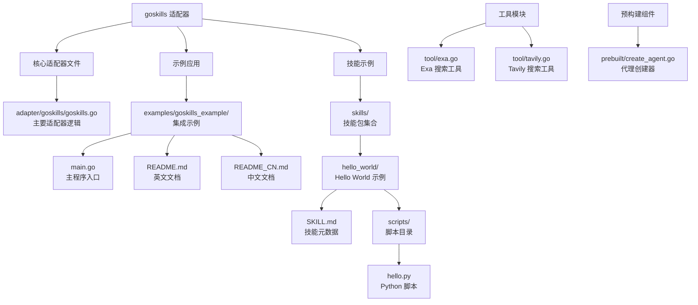
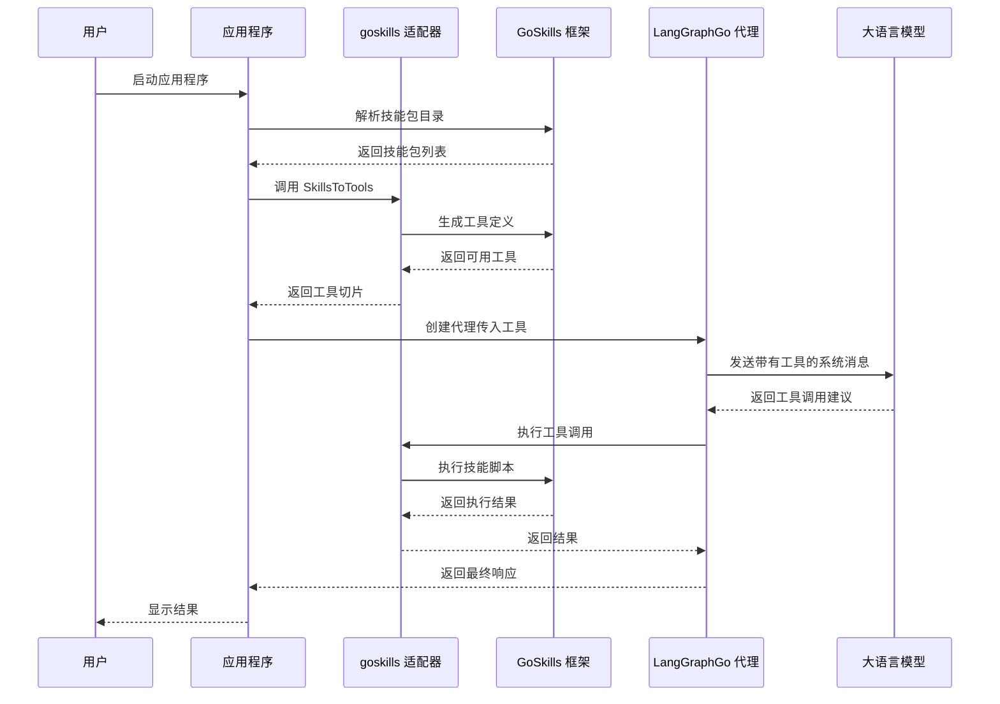
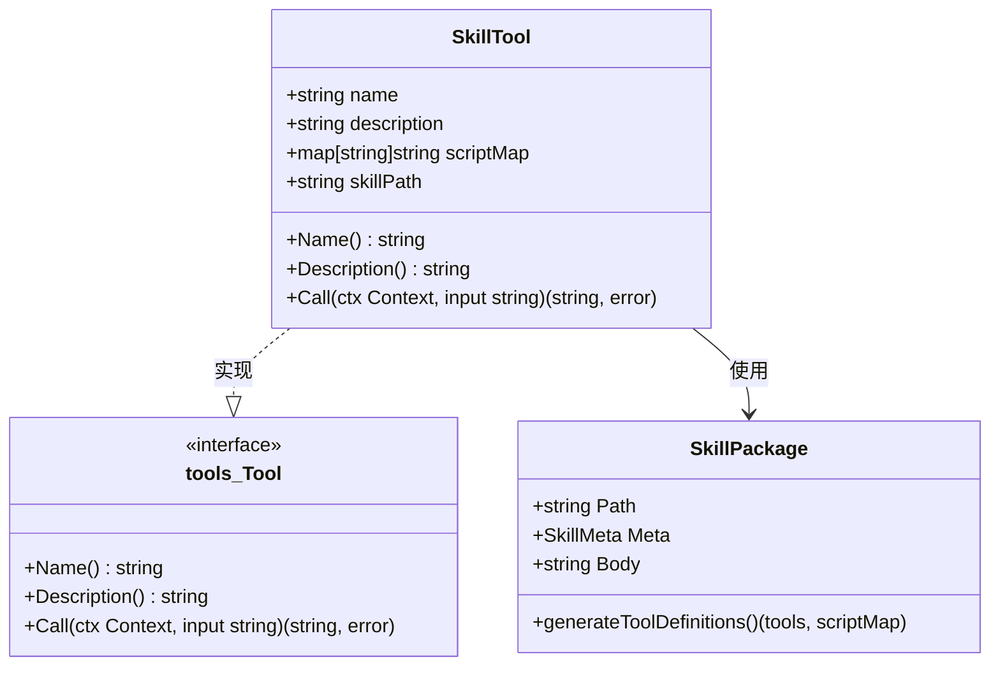
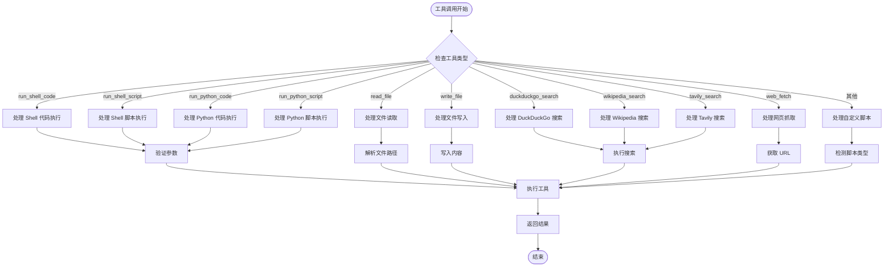
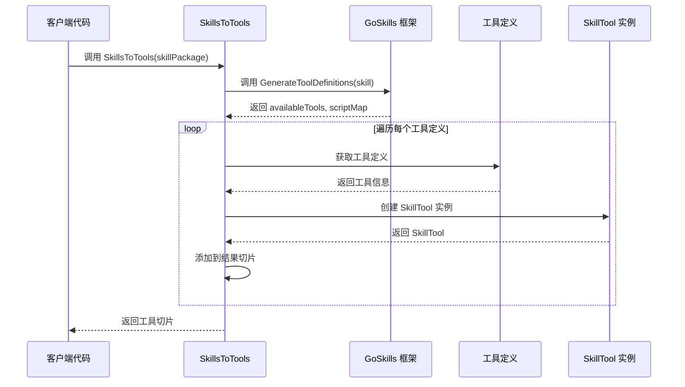
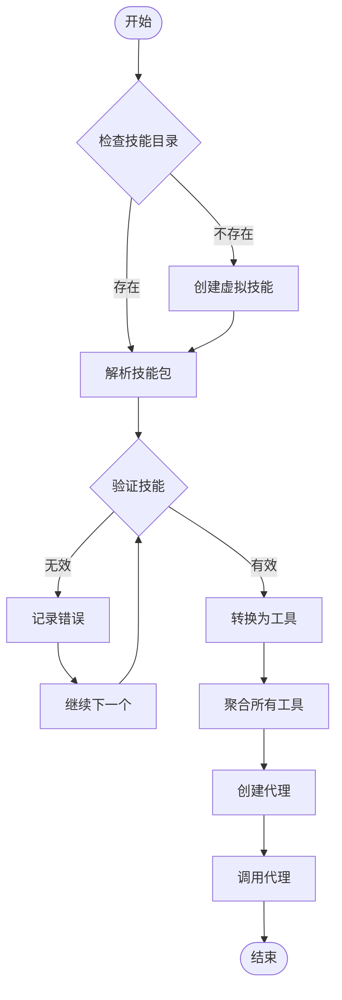
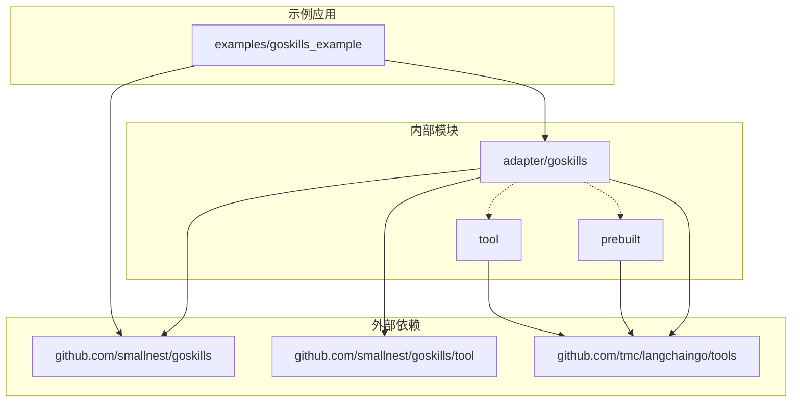

# goskills 适配器

<cite>
**本文档中引用的文件**
- [adapter/goskills/goskills.go](file://adapter/goskills/goskills.go)
- [examples/goskills_example/main.go](file://examples/goskills_example/main.go)
- [examples/goskills_example/skills/hello_world/SKILL.md](file://examples/goskills_example/skills/hello_world/SKILL.md)
- [examples/goskills_example/skills/hello_world/scripts/hello.py](file://examples/goskills_example/skills/hello_world/scripts/hello.py)
- [skills/hello_world/SKILL.md](file://skills/hello_world/SKILL.md)
- [prebuilt/create_agent.go](file://prebuilt/create_agent.go)
- [tool/exa.go](file://tool/exa.go)
- [tool/tavily.go](file://tool/tavily.go)
- [examples/goskills_example/README.md](file://examples/goskills_example/README.md)
- [examples/goskills_example/README_CN.md](file://examples/goskills_example/README_CN.md)
</cite>

## 目录
1. [简介](#简介)
2. [项目结构](#项目结构)
3. [核心组件](#核心组件)
4. [架构概览](#架构概览)
5. [详细组件分析](#详细组件分析)
6. [依赖关系分析](#依赖关系分析)
7. [性能考虑](#性能考虑)
8. [故障排除指南](#故障排除指南)
9. [结论](#结论)

## 简介

goskills 适配器是 LangGraphGo 中的一个重要组件，它提供了将 GoSkills 技能系统无缝集成到 LangGraphGo 代理中的能力。该适配器允许开发者使用预先包装好的技能包，这些技能包包含了各种实用功能，如文件操作、网络搜索、脚本执行等，而无需为每个功能单独编写工具实现。

GoSkills 是一个强大的技能管理框架，它将 Python 脚本、Shell 命令和其他工具打包成可重用的技能包。通过 goskills 适配器，这些技能可以直接作为 LangGraphGo 的工具使用，极大地简化了代理功能的扩展过程。

## 项目结构

**图表来源**
- [adapter/goskills/goskills.go](file://adapter/goskills/goskills.go#L1-L213)
- [examples/goskills_example/main.go](file://examples/goskills_example/main.go#L1-L170)
- [skills/hello_world/SKILL.md](file://skills/hello_world/SKILL.md#L1-L37)

**章节来源**
- [adapter/goskills/goskills.go](file://adapter/goskills/goskills.go#L1-L213)
- [examples/goskills_example/main.go](file://examples/goskills_example/main.go#L1-L170)

## 核心组件

goskills 适配器的核心由以下关键组件构成：

### SkillTool 结构体
`SkillTool` 是适配器的主要数据结构，实现了 `tools.Tool` 接口，负责将 GoSkills 技能转换为 LangGraphGo 可识别的工具格式。

### SkillsToTools 函数
这是适配器的核心转换函数，它将 GoSkills 的 `SkillPackage` 转换为 `[]tools.Tool` 切片，使技能能够被 LangGraphGo 的代理系统使用。

### 内置工具支持
适配器支持多种内置工具类型，包括：
- 脚本执行工具（Python 和 Shell）
- 文件操作工具（读取和写入）
- 网络搜索工具（DuckDuckGo、Wikipedia、Tavily）
- 网页抓取工具

**章节来源**
- [adapter/goskills/goskills.go](file://adapter/goskills/goskills.go#L16-L208)

## 架构概览

**图表来源**
- [examples/goskills_example/main.go](file://examples/goskills_example/main.go#L44-L98)
- [adapter/goskills/goskills.go](file://adapter/goskills/goskills.go#L167-L208)

## 详细组件分析

### SkillTool 实现分析

**图表来源**
- [adapter/goskills/goskills.go](file://adapter/goskills/goskills.go#L16-L208)

#### 核心方法实现

SkillTool 结构体实现了三个关键方法：

1. **Name() 方法**: 返回工具名称
2. **Description() 方法**: 返回工具描述
3. **Call() 方法**: 执行实际的工具调用，支持多种工具类型

**Call() 方法的工具处理逻辑**:

**图表来源**
- [adapter/goskills/goskills.go](file://adapter/goskills/goskills.go#L34-L163)

**章节来源**
- [adapter/goskills/goskills.go](file://adapter/goskills/goskills.go#L16-L208)

### SkillsToTools 转换机制

**图表来源**
- [adapter/goskills/goskills.go](file://adapter/goskills/goskills.go#L167-L208)

**章节来源**
- [adapter/goskills/goskills.go](file://adapter/goskills/goskills.go#L167-L208)

### 示例应用分析

示例应用程序展示了完整的集成流程：

#### 技能加载流程

**图表来源**
- [examples/goskills_example/main.go](file://examples/goskills_example/main.go#L35-L98)

**章节来源**
- [examples/goskills_example/main.go](file://examples/goskills_example/main.go#L18-L170)

## 依赖关系分析

**图表来源**
- [adapter/goskills/goskills.go](file://adapter/goskills/goskills.go#L3-L14)
- [examples/goskills_example/main.go](file://examples/goskills_example/main.go#L3-L16)

### 主要依赖说明

1. **github.com/smallnest/goskills**: 核心 GoSkills 框架，提供技能管理和工具生成功能
2. **github.com/smallnest/goskills/tool**: GoSkills 内置工具集合
3. **github.com/tmc/langchaingo/tools**: LangGraphGo 工具接口定义

**章节来源**
- [adapter/goskills/goskills.go](file://adapter/goskills/goskills.go#L3-L14)

## 性能考虑

### 工具加载优化

goskills 适配器在设计时考虑了以下性能优化策略：

1. **延迟加载**: 只有在需要时才解析和转换技能包
2. **缓存机制**: 已转换的工具实例会被缓存，避免重复创建
3. **批量处理**: 支持一次性加载多个技能包，提高批量操作效率

### 内存管理

- 技能包解析采用流式处理，减少内存占用
- 工具调用完成后及时清理临时资源
- 支持大文件操作的安全处理机制

### 并发安全

适配器设计为线程安全，允许多个并发的工具调用同时进行。

## 故障排除指南

### 常见问题及解决方案

#### 1. 技能包解析失败

**症状**: `parseSkillPackages` 返回错误
**原因**: 技能包目录结构不正确或缺少必要文件
**解决方案**: 
- 确保技能包包含有效的 `SKILL.md` 文件
- 检查 `scripts/` 目录是否存在且包含可执行脚本
- 验证文件权限设置

#### 2. 工具调用超时

**症状**: 工具执行时间过长或无响应
**原因**: 脚本执行时间过长或系统资源不足
**解决方案**:
- 设置合理的超时时间
- 优化脚本执行逻辑
- 监控系统资源使用情况

#### 3. 文件访问权限错误

**症状**: 文件读写操作失败
**原因**: 文件路径不正确或权限不足
**解决方案**:
- 使用绝对路径或确保相对路径正确
- 检查文件权限设置
- 验证技能路径配置

**章节来源**
- [adapter/goskills/goskills.go](file://adapter/goskills/goskills.go#L88-L109)
- [examples/goskills_example/main.go](file://examples/goskills_example/main.go#L35-L43)

## 结论

goskills 适配器为 LangGraphGo 提供了一个强大而灵活的技能集成解决方案。通过将 GoSkills 的丰富功能与 LangGraphGo 的代理系统相结合，开发者可以快速构建具有强大功能的智能代理，而无需从头开始实现每个工具。

### 主要优势

1. **开箱即用**: 提供大量预构建的实用工具
2. **易于扩展**: 支持自定义技能包的轻松集成
3. **类型安全**: 强类型的工具接口确保运行时稳定性
4. **性能优化**: 高效的工具加载和执行机制
5. **跨平台兼容**: 支持多种编程语言和操作系统

### 最佳实践建议

1. **技能组织**: 按功能领域组织技能包，便于维护和管理
2. **错误处理**: 实现完善的错误处理和日志记录机制
3. **安全性**: 对用户输入进行严格验证，防止恶意脚本执行
4. **监控**: 建立工具使用监控和性能分析体系
5. **测试**: 编写全面的单元测试和集成测试

goskills 适配器代表了现代 AI 代理开发的一个重要进步，它简化了复杂功能的集成过程，为构建更智能、更强大的代理系统奠定了坚实基础。