# 工具集成示例

<cite>
**本文档中引用的文件**
- [examples/tool_exa/main.go](file://examples/tool_exa/main.go)
- [examples/tool_tavily/main.go](file://examples/tool_tavily/main.go)
- [tool/exa.go](file://tool/exa.go)
- [tool/tavily.go](file://tool/tavily.go)
- [prebuilt/tool_node.go](file://prebuilt/tool_node.go)
- [prebuilt/tool_executor.go](file://prebuilt/tool_executor.go)
- [tool/README.md](file://tool/README.md)
- [examples/tool_exa/README.md](file://examples/tool_exa/README.md)
- [examples/tool_tavily/README.md](file://examples/tool_tavily/README.md)
- [prebuilt/react_agent.go](file://prebuilt/react_agent.go)
</cite>

## 目录
1. [简介](#简介)
2. [项目结构](#项目结构)
3. [核心组件](#核心组件)
4. [架构概览](#架构概览)
5. [详细组件分析](#详细组件分析)
6. [工具接口设计](#工具接口设计)
7. [错误处理机制](#错误处理机制)
8. [认证方式](#认证方式)
9. [实际应用示例](#实际应用示例)
10. [最佳实践](#最佳实践)
11. [故障排除指南](#故障排除指南)
12. [总结](#总结)

## 简介

本文档基于 langgraphgo 项目中的 tool_exa 和 tool_tavily 示例，深入探讨如何将外部搜索服务（Exa 和 Tavily）封装为可调用工具，并在工作流中有效使用。通过分析这些工具的实现，我们将展示工具接口的设计原则、错误处理机制和认证方式，并通过实际搜索场景演示工具调用的完整流程。

langgraphgo 提供了一套完整的工具集成框架，支持将各种外部服务无缝集成到智能代理系统中。这些工具遵循统一的接口规范，确保了系统的可扩展性和一致性。

## 项目结构

langgraphgo 项目采用模块化架构，工具相关的核心文件组织如下：

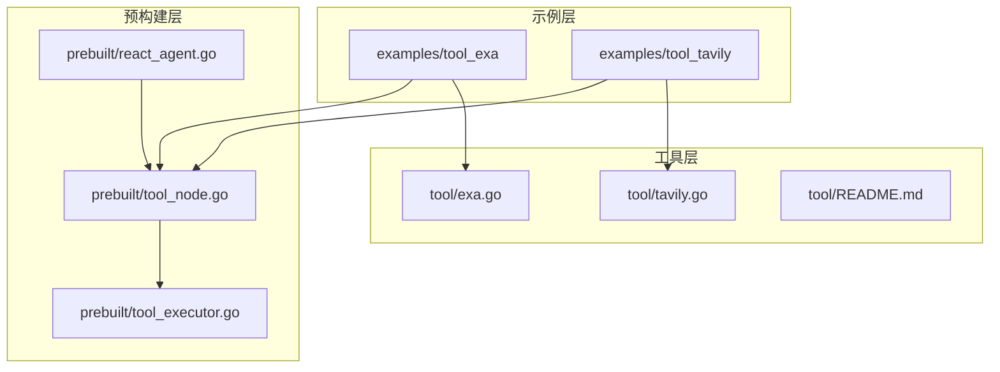

**图表来源**
- [examples/tool_exa/main.go](file://examples/tool_exa/main.go#L1-L73)
- [examples/tool_tavily/main.go](file://examples/tool_tavily/main.go#L1-L78)
- [tool/exa.go](file://tool/exa.go#L1-L128)
- [tool/tavily.go](file://tool/tavily.go#L1-L122)

**章节来源**
- [examples/tool_exa/main.go](file://examples/tool_exa/main.go#L1-L73)
- [examples/tool_tavily/main.go](file://examples/tool_tavily/main.go#L1-L78)
- [tool/README.md](file://tool/README.md#L1-L58)

## 核心组件

langgraphgo 的工具集成系统由以下核心组件构成：

### 工具接口层
- **工具抽象接口**: 定义了所有工具必须实现的标准接口
- **配置选项系统**: 支持灵活的工具参数配置
- **环境变量管理**: 自动处理 API 密钥等敏感信息

### 执行引擎层
- **工具执行器**: 负责工具的实际调用和结果处理
- **工具节点**: 在图结构中执行工具调用的节点
- **状态管理**: 维护工具调用的状态和上下文

### 集成框架层
- **ReAct 代理**: 基于推理与行动模式的智能代理
- **条件路由**: 根据工具调用决策进行流程控制
- **消息传递**: 在工具调用过程中维护消息流

**章节来源**
- [prebuilt/tool_executor.go](file://prebuilt/tool_executor.go#L1-L84)
- [prebuilt/tool_node.go](file://prebuilt/tool_node.go#L1-L108)
- [prebuilt/react_agent.go](file://prebuilt/react_agent.go#L1-L46)

## 架构概览

工具集成系统采用分层架构设计，确保了良好的可扩展性和维护性：

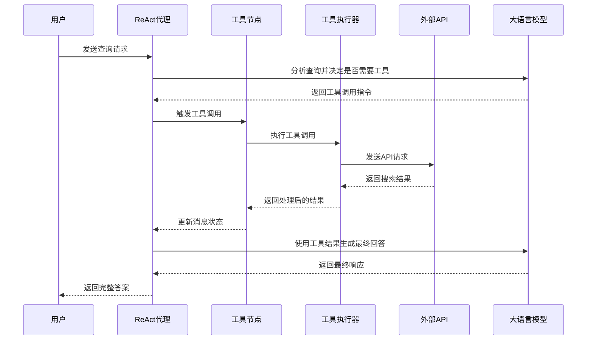

**图表来源**
- [examples/tool_exa/main.go](file://examples/tool_exa/main.go#L40-L72)
- [examples/tool_tavily/main.go](file://examples/tool_tavily/main.go#L42-L77)
- [prebuilt/tool_node.go](file://prebuilt/tool_node.go#L25-L107)

## 详细组件分析

### Exa 搜索工具实现

Exa 搜索工具专门针对 LLM 优化，提供了高质量的内容搜索能力：

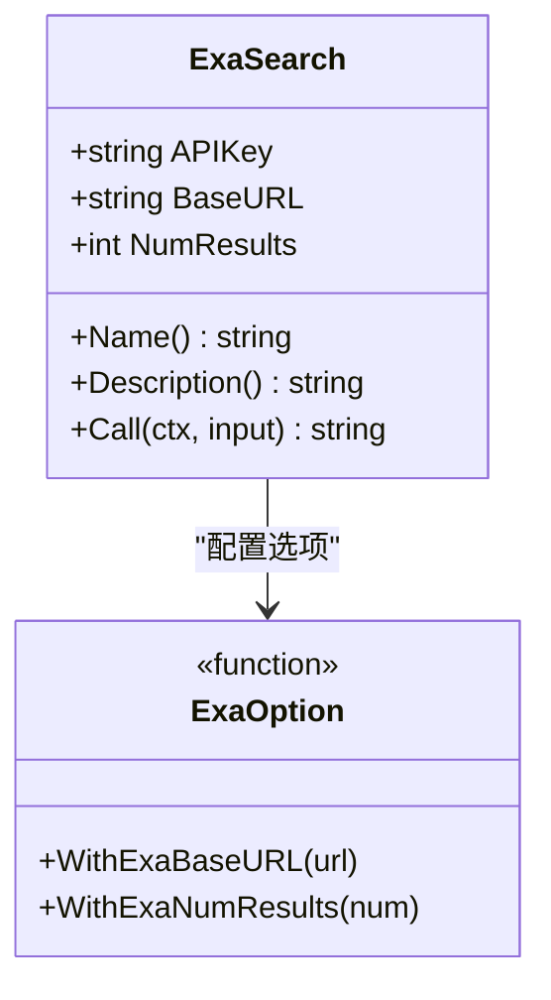

**图表来源**
- [tool/exa.go](file://tool/exa.go#L13-L128)

#### 关键特性
- **内容提取**: 自动提取网页正文内容
- **结果截断**: 智能截断过长内容以保持效率
- **格式化输出**: 结构化的搜索结果格式
- **配置灵活性**: 支持自定义基础 URL 和结果数量

**章节来源**
- [tool/exa.go](file://tool/exa.go#L36-L56)
- [tool/exa.go](file://tool/exa.go#L71-L127)

### Tavily 搜索工具实现

Tavily 搜索工具专注于提供全面、准确且可信的搜索结果：

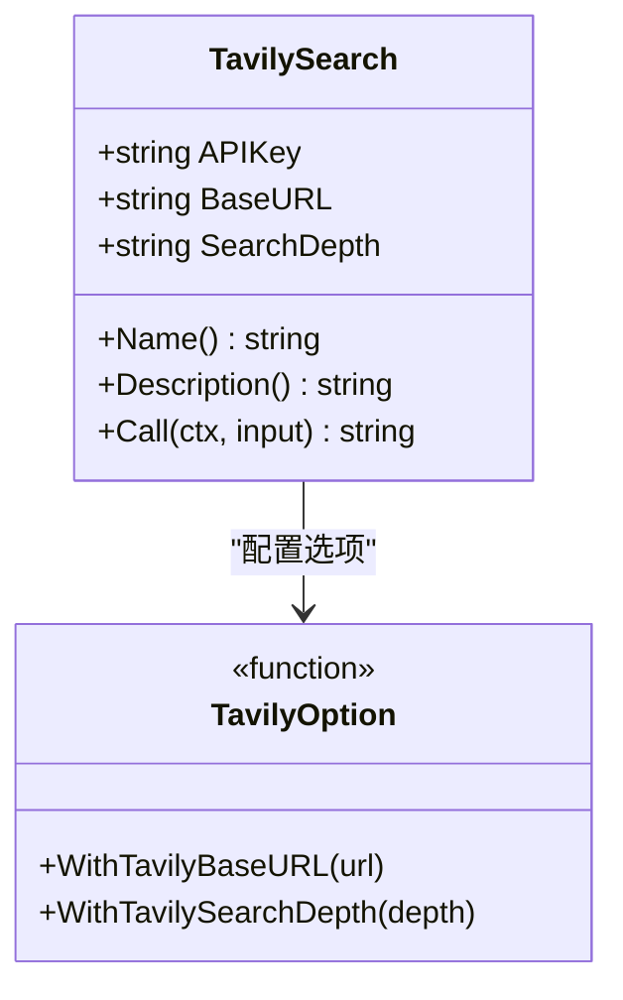

**图表来源**
- [tool/tavily.go](file://tool/tavily.go#L13-L122)

#### 核心功能
- **深度搜索**: 支持基础和高级搜索模式
- **结果质量**: 优先提供高质量和可信内容
- **实时更新**: 特别适合当前事件查询
- **简洁格式**: 清晰的结果展示结构

**章节来源**
- [tool/tavily.go](file://tool/tavily.go#L37-L57)
- [tool/tavily.go](file://tool/tavily.go#L72-L121)

### 工具执行器架构

工具执行器负责协调和管理所有工具的调用：

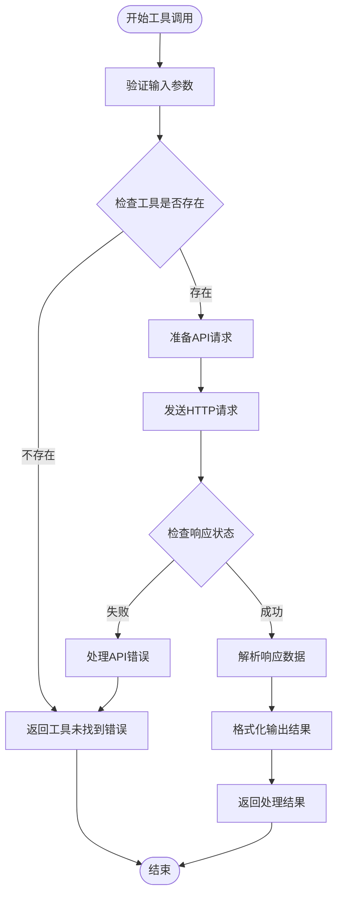

**图表来源**
- [prebuilt/tool_executor.go](file://prebuilt/tool_executor.go#L32-L39)
- [tool/exa.go](file://tool/exa.go#L71-L127)
- [tool/tavily.go](file://tool/tavily.go#L72-L121)

**章节来源**
- [prebuilt/tool_executor.go](file://prebuilt/tool_executor.go#L1-L84)

## 工具接口设计

langgraphgo 采用标准化的工具接口设计，确保所有工具的一致性和互操作性：

### 接口规范

所有工具必须实现以下标准接口：

| 方法 | 类型 | 描述 | 必需 |
|------|------|------|------|
| `Name()` | `string` | 工具名称标识符 | 是 |
| `Description()` | `string` | 工具功能描述 | 是 |
| `Call(ctx, input)` | `(string, error)` | 执行工具调用 | 是 |

### 设计原则

1. **单一职责**: 每个工具专注于特定的功能领域
2. **接口统一**: 所有工具遵循相同的调用模式
3. **配置灵活**: 支持多种配置选项和参数定制
4. **错误透明**: 明确的错误处理和反馈机制

### 配置选项模式

工具采用函数式配置选项模式，提供灵活的初始化方式：

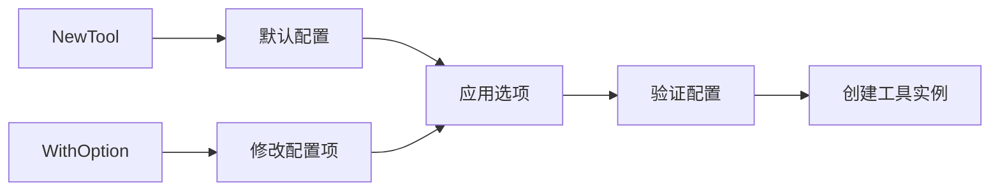

**图表来源**
- [tool/exa.go](file://tool/exa.go#L22-L34)
- [tool/tavily.go](file://tool/tavily.go#L22-L35)

**章节来源**
- [tool/README.md](file://tool/README.md#L47-L57)
- [tool/exa.go](file://tool/exa.go#L36-L56)
- [tool/tavily.go](file://tool/tavily.go#L37-L57)

## 错误处理机制

工具集成系统实现了多层次的错误处理机制，确保系统的稳定性和可靠性：

### 错误分类体系

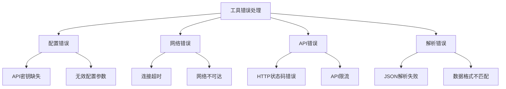

### 错误处理策略

1. **早期验证**: 在工具初始化阶段验证配置参数
2. **优雅降级**: 当某个工具失败时不影响其他工具的使用
3. **详细日志**: 记录详细的错误信息用于调试
4. **用户友好**: 向用户提供清晰的错误提示

### 具体实现示例

#### Exa 工具错误处理
- API 密钥验证和环境变量读取
- HTTP 请求状态码检查
- JSON 解析错误处理
- 结果格式验证

#### Tavily 工具错误处理
- API 密钥有效性检查
- 搜索深度参数验证
- 响应数据完整性验证
- 网络连接异常处理

**章节来源**
- [tool/exa.go](file://tool/exa.go#L37-L44)
- [tool/tavily.go](file://tool/tavily.go#L38-L45)
- [tool/exa.go](file://tool/exa.go#L95-L102)
- [tool/tavily.go](file://tool/tavily.go#L93-L100)

## 认证方式

工具集成系统支持多种认证方式，适应不同的安全需求和部署环境：

### 认证机制对比

| 工具 | 认证方式 | 配置方法 | 安全特性 |
|------|----------|----------|----------|
| Exa | API 密钥 | `EXA_API_KEY` 环境变量 | HTTP Header 认证 |
| Tavily | API 密钥 | `TAVILY_API_KEY` 环境变量 | POST 请求参数认证 |

### 环境变量管理

系统自动从环境变量中读取 API 密钥，提供安全的配置管理：

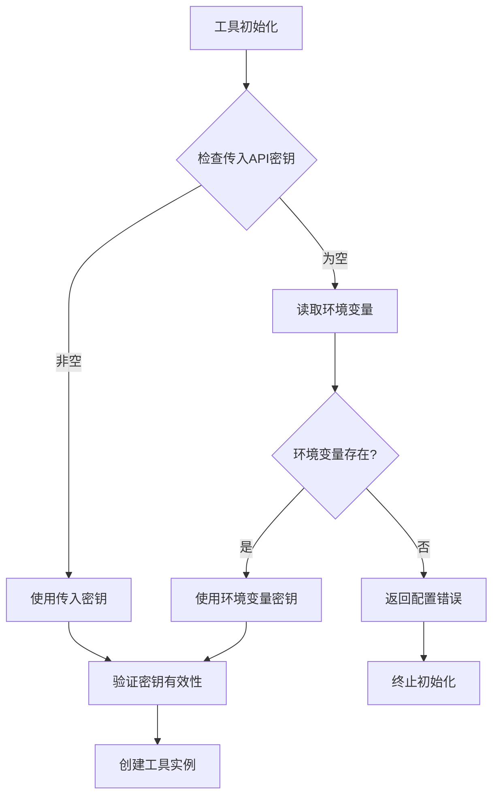

**图表来源**
- [tool/exa.go](file://tool/exa.go#L39-L44)
- [tool/tavily.go](file://tool/tavily.go#L40-L45)

### 安全最佳实践

1. **密钥隔离**: 不在代码中硬编码 API 密钥
2. **环境分离**: 开发、测试、生产环境使用不同密钥
3. **权限最小化**: 为每个工具分配最小必要权限
4. **定期轮换**: 建立 API 密钥定期更换机制

**章节来源**
- [tool/exa.go](file://tool/exa.go#L39-L44)
- [tool/tavily.go](file://tool/tavily.go#L40-L45)

## 实际应用示例

### Exa 搜索工具使用流程

以下是使用 Exa 搜索工具的完整工作流程：

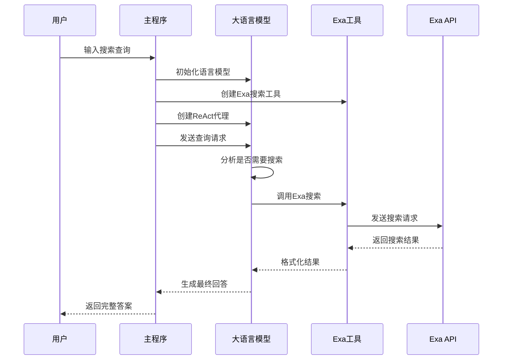

**图表来源**
- [examples/tool_exa/main.go](file://examples/tool_exa/main.go#L25-L72)

### Tavily 搜索工具使用流程

Tavily 工具的工作流程类似但针对不同的搜索需求：

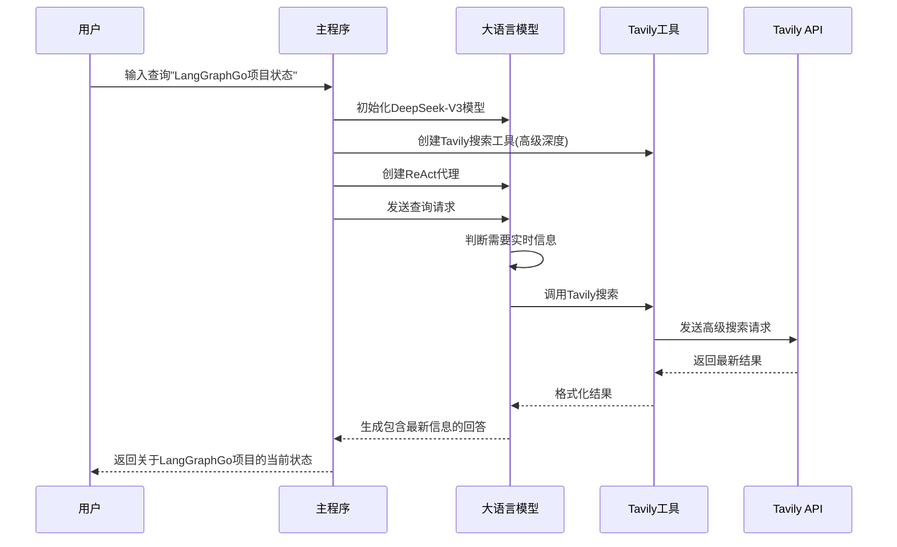

**图表来源**
- [examples/tool_tavily/main.go](file://examples/tool_tavily/main.go#L26-L77)

### 查询构造和结果解析

#### 查询构造策略

不同工具采用不同的查询构造策略：

| 工具 | 查询策略 | 示例输入 | 输出格式 |
|------|----------|----------|----------|
| Exa | 直接语义查询 | "自动驾驶AI最新发展" | 结构化搜索结果 |
| Tavily | 事实导向查询 | "LangGraphGo项目GitHub状态" | 实时信息结果 |

#### 结果解析机制

工具自动解析外部 API 响应并转换为统一格式：

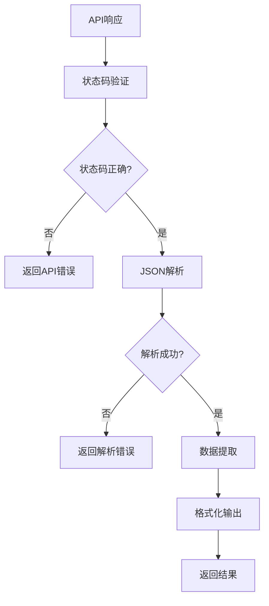

**图表来源**
- [tool/exa.go](file://tool/exa.go#L104-L127)
- [tool/tavily.go](file://tool/tavily.go#L102-L121)

**章节来源**
- [examples/tool_exa/main.go](file://examples/tool_exa/main.go#L16-L72)
- [examples/tool_tavily/main.go](file://examples/tool_tavily/main.go#L16-L77)

## 最佳实践

### 工具选择指南

根据具体需求选择合适的搜索工具：

1. **Exa 工具适用场景**:
   - 需要高质量内容提取
   - 关注学术研究和深度分析
   - 需要结构化搜索结果

2. **Tavily 工具适用场景**:
   - 需要实时信息和最新动态
   - 关注当前事件和趋势
   - 需要简洁准确的答案

### 性能优化建议

1. **合理设置结果数量**: 根据需求调整 `NumResults` 参数
2. **选择合适搜索深度**: 平衡质量和响应速度
3. **缓存机制**: 实现适当的缓存策略减少 API 调用
4. **并发控制**: 控制同时进行的工具调用数量

### 安全考虑

1. **密钥管理**: 使用环境变量存储 API 密钥
2. **请求限制**: 实现合理的请求频率控制
3. **输入验证**: 对用户输入进行适当验证
4. **错误信息**: 避免泄露敏感信息

### 可扩展性设计

1. **接口标准化**: 新工具遵循相同接口规范
2. **配置模块化**: 支持灵活的配置选项
3. **错误处理统一**: 一致的错误处理机制
4. **监控集成**: 集成监控和日志记录

## 故障排除指南

### 常见问题及解决方案

#### API 密钥问题

**问题**: `EXA_API_KEY not set` 或 `TAVILY_API_KEY not set`
**解决方案**: 
1. 检查环境变量是否正确设置
2. 验证 API 密钥的有效性
3. 确认密钥具有相应工具的访问权限

#### 网络连接问题

**问题**: HTTP 请求失败或超时
**解决方案**:
1. 检查网络连接状态
2. 验证 API 服务的可用性
3. 调整请求超时设置
4. 检查防火墙和代理设置

#### 工具调用失败

**问题**: 工具返回错误或无结果
**解决方案**:
1. 验证查询语句的准确性
2. 检查工具配置参数
3. 查看详细的错误日志
4. 尝试使用不同的工具

### 调试技巧

1. **启用详细日志**: 启用工具级别的详细日志记录
2. **检查中间结果**: 验证工具调用的中间结果
3. **模拟请求**: 使用工具库直接测试 API 调用
4. **监控指标**: 监控 API 调用的成功率和响应时间

**章节来源**
- [tool/exa.go](file://tool/exa.go#L37-L44)
- [tool/tavily.go](file://tool/tavily.go#L38-L45)
- [tool/exa.go](file://tool/exa.go#L95-L102)
- [tool/tavily.go](file://tool/tavily.go#L93-L100)

## 总结

langgraphgo 的工具集成系统提供了一个强大而灵活的框架，支持将外部服务无缝集成到智能代理系统中。通过 tool_exa 和 tool_tavily 的实现示例，我们可以看到：

### 核心优势

1. **标准化接口**: 统一的工具接口确保了系统的可扩展性
2. **灵活配置**: 函数式配置选项提供了极大的灵活性
3. **健壮错误处理**: 多层次的错误处理机制保证了系统稳定性
4. **安全认证**: 环境变量管理和多种认证方式确保安全性

### 应用价值

- **提升智能代理能力**: 通过集成外部工具，显著增强代理的信息获取能力
- **简化开发复杂度**: 标准化的工具接口降低了集成难度
- **提高响应质量**: 不同工具的组合使用可以提供更全面的答案
- **支持多样化场景**: 适应从学术研究到实时信息的各种需求

### 未来发展方向

随着人工智能技术的发展，工具集成系统将继续演进，可能的方向包括：

1. **更多工具类型**: 支持数据库查询、文件处理等更多功能
2. **智能工具选择**: 基于任务特征自动选择最适合的工具
3. **性能优化**: 更高效的缓存机制和并发处理
4. **安全增强**: 更严格的访问控制和审计机制

通过深入理解和正确使用这些工具集成示例，开发者可以构建出功能强大、性能优异的智能代理系统，为用户提供卓越的交互体验。