# 代理群

<cite>
**本文档中引用的文件**
- [examples/swarm/main.go](file://examples/swarm/main.go)
- [examples/swarm/README.md](file://examples/swarm/README.md)
- [examples/swarm/README_CN.md](file://examples/swarm/README_CN.md)
- [prebuilt/supervisor.go](file://prebuilt/supervisor.go)
- [examples/supervisor/main.go](file://examples/supervisor/main.go)
- [graph/state_graph.go](file://graph/state_graph.go)
- [graph/schema.go](file://graph/schema.go)
- [graph/conditional_edges_test.go](file://graph/conditional_edges_test.go)
- [examples/command_api/main.go](file://examples/command_api/main.go)
</cite>

## 目录
1. [简介](#简介)
2. [项目结构](#项目结构)
3. [核心组件](#核心组件)
4. [架构概览](#架构概览)
5. [详细组件分析](#详细组件分析)
6. [Handoff 移交机制](#handoff-移交机制)
7. [Router 动态路由](#router-动态路由)
8. [共享状态管理](#共享状态管理)
9. [与 Supervisor 模式的对比](#与-supervisor-模式的对比)
10. [性能考虑](#性能考虑)
11. [故障排除指南](#故障排除指南)
12. [结论](#结论)

## 简介

Swarm 是一种去中心化的多代理协作模式，灵感来源于 OpenAI 的 Swarm 框架。与传统的 Supervisor 中央调度模式不同，Swarm 允许代理之间直接进行控制权转移，模拟真实专家团队的协作方式——根据各自的专业能力来回传递任务。

在 Swarm 模式中，代理通过特殊的 Handoff 工具实现代理间的直接控制权转移，而 Router 函数则根据状态中的 'next' 字段进行动态路由决策。这种设计使得代理群能够灵活地处理复杂的协作场景，无需中央协调器的介入。

## 项目结构

Swarm 实现位于 `examples/swarm` 目录下，包含以下关键文件：

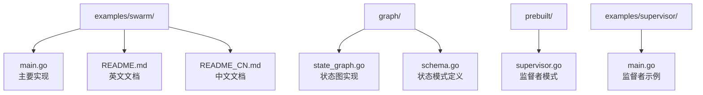

**图表来源**
- [examples/swarm/main.go](file://examples/swarm/main.go#L1-L244)
- [graph/state_graph.go](file://graph/state_graph.go#L1-L200)
- [prebuilt/supervisor.go](file://prebuilt/supervisor.go#L1-L153)

**章节来源**
- [examples/swarm/main.go](file://examples/swarm/main.go#L1-L244)
- [examples/swarm/README.md](file://examples/swarm/README.md#L1-L78)

## 核心组件

Swarm 模式的核心组件包括：

### AgentState 结构体
定义了代理的状态结构，包含消息历史和下一个执行的代理标识：

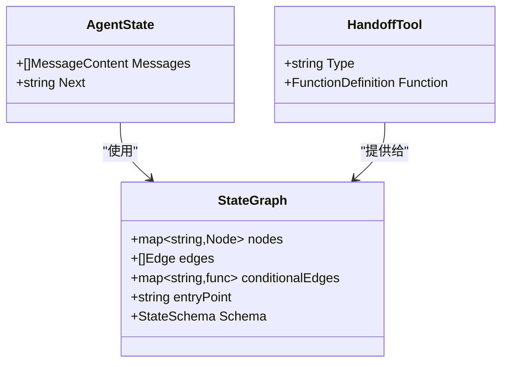

**图表来源**
- [examples/swarm/main.go](file://examples/swarm/main.go#L15-L19)
- [examples/swarm/main.go](file://examples/swarm/main.go#L21-L38)

### HandoffTool 工具
实现了代理间控制权转移的特殊工具，具有预定义的参数结构：

- **名称**: `handoff`
- **描述**: 将控制权移交给另一个代理
- **参数**: 必需的 `to` 字段，可选值为 `"Researcher"` 或 `"Writer"`

**章节来源**
- [examples/swarm/main.go](file://examples/swarm/main.go#L15-L38)

## 架构概览

Swarm 模式的整体架构采用去中心化设计理念：

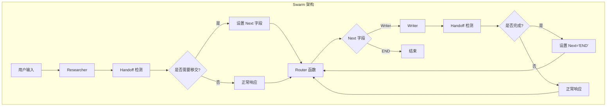

**图表来源**
- [examples/swarm/main.go](file://examples/swarm/main.go#L66-L190)
- [examples/swarm/main.go](file://examples/swarm/main.go#L192-L200)

## 详细组件分析

### 研究员 (Researcher) 组件

研究员是负责信息检索和研究的代理节点：

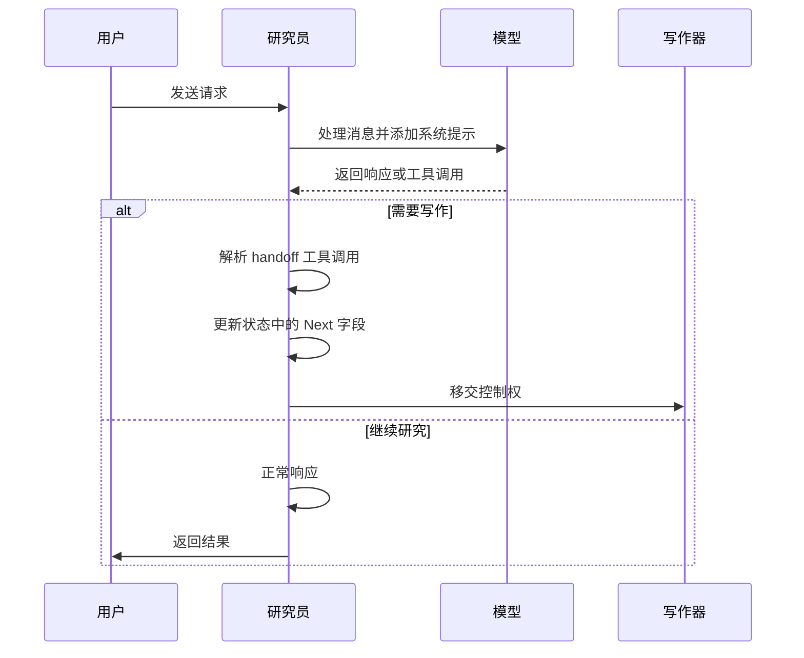

**图表来源**
- [examples/swarm/main.go](file://examples/swarm/main.go#L67-L132)

### 写作器 (Writer) 组件

写作器负责基于收集的信息撰写报告：

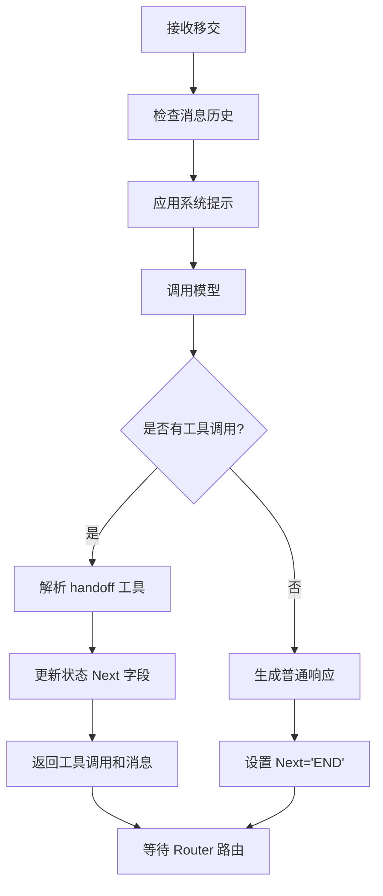

**图表来源**
- [examples/swarm/main.go](file://examples/swarm/main.go#L135-L189)

**章节来源**
- [examples/swarm/main.go](file://examples/swarm/main.go#L67-L189)

## Handoff 移交机制

Handoff 机制是 Swarm 模式的核心创新，它允许代理之间直接进行控制权转移：

### 移交工具的实现

Handoff 工具的设计遵循以下原则：

1. **类型安全**: 使用预定义的参数结构确保类型安全
2. **枚举验证**: 限制目标代理只能是预定义的选项
3. **JSON 序列化**: 支持工具参数的 JSON 序列化和反序列化

### 移交流程详解

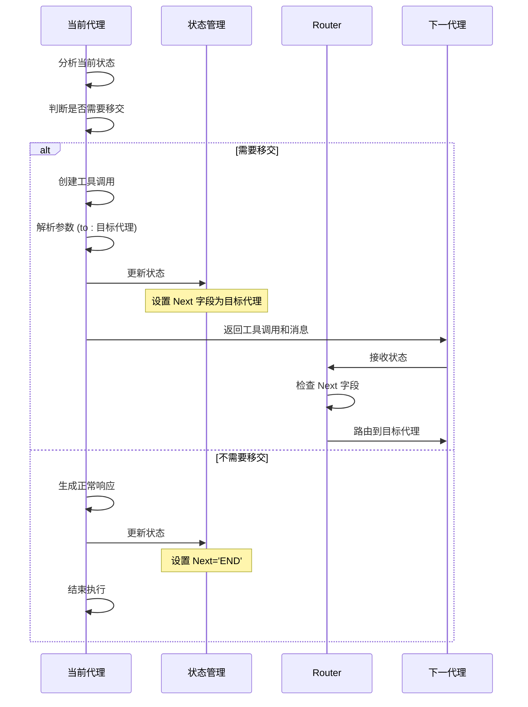

**图表来源**
- [examples/swarm/main.go](file://examples/swarm/main.go#L83-L118)
- [examples/swarm/main.go](file://examples/swarm/main.go#L151-L177)

### 移交状态更新

移交操作涉及两个关键状态更新：

1. **消息历史**: 记录工具调用和响应
2. **路由指示**: 更新 `next` 字段为目标代理

**章节来源**
- [examples/swarm/main.go](file://examples/swarm/main.go#L83-L118)
- [examples/swarm/main.go](file://examples/swarm/main.go#L151-L177)

## Router 动态路由

Router 函数是 Swarm 模式中负责动态路由的核心组件：

### 路由逻辑实现

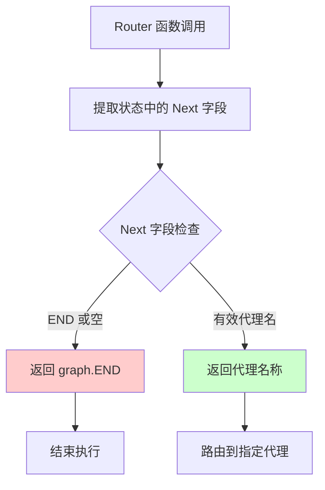

**图表来源**
- [examples/swarm/main.go](file://examples/swarm/main.go#L192-L200)

### 条件边机制

Swarm 使用条件边来实现动态路由：

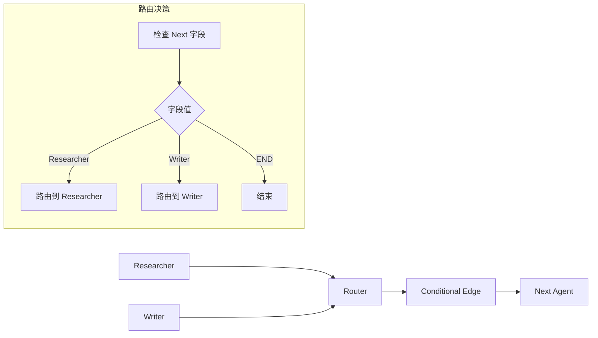

**图表来源**
- [examples/swarm/main.go](file://examples/swarm/main.go#L202-L203)
- [graph/state_graph.go](file://graph/state_graph.go#L240-L268)

### 路由函数的具体实现

路由函数的逻辑非常简洁但功能强大：

1. **状态解析**: 从传入的状态中提取 `next` 字段
2. **有效性检查**: 验证字段值的有效性
3. **默认处理**: 对于无效或空值返回 `END`
4. **代理路由**: 返回有效的代理名称作为下一节点

**章节来源**
- [examples/swarm/main.go](file://examples/swarm/main.go#L192-L200)
- [graph/state_graph.go](file://graph/state_graph.go#L240-L268)

## 共享状态管理

Swarm 模式中的共享状态是实现代理协作的关键基础设施：

### 状态结构设计

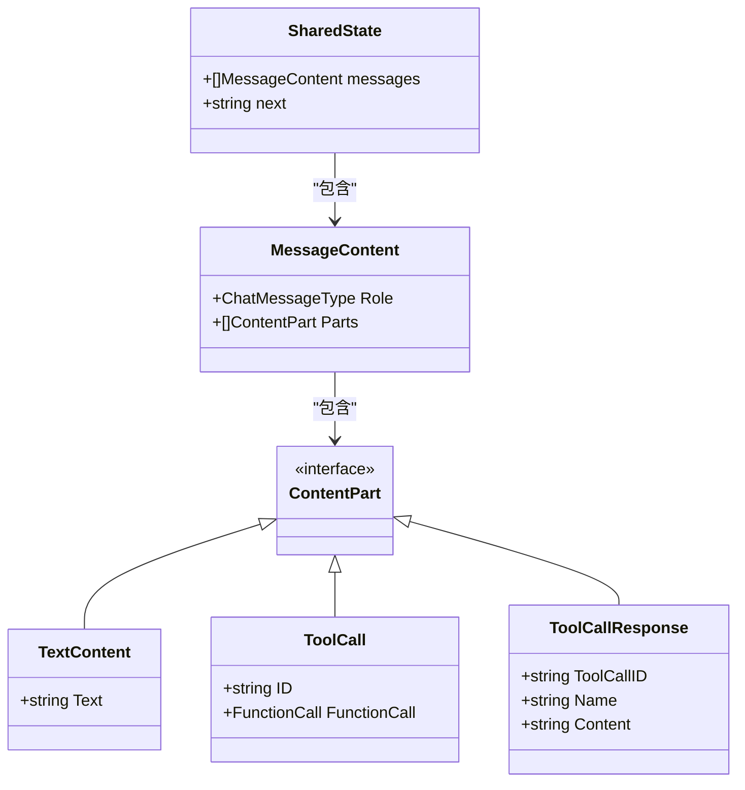

**图表来源**
- [examples/swarm/main.go](file://examples/swarm/main.go#L15-L19)
- [graph/schema.go](file://graph/schema.go#L62-L99)

### 消息历史管理

共享状态中的消息历史通过 AppendReducer 进行管理：

1. **累积机制**: 新的消息自动追加到现有消息列表
2. **类型安全**: 确保消息内容的一致性和完整性
3. **历史可见性**: 后续代理可以访问完整的交互历史

### 状态 Schema 定义

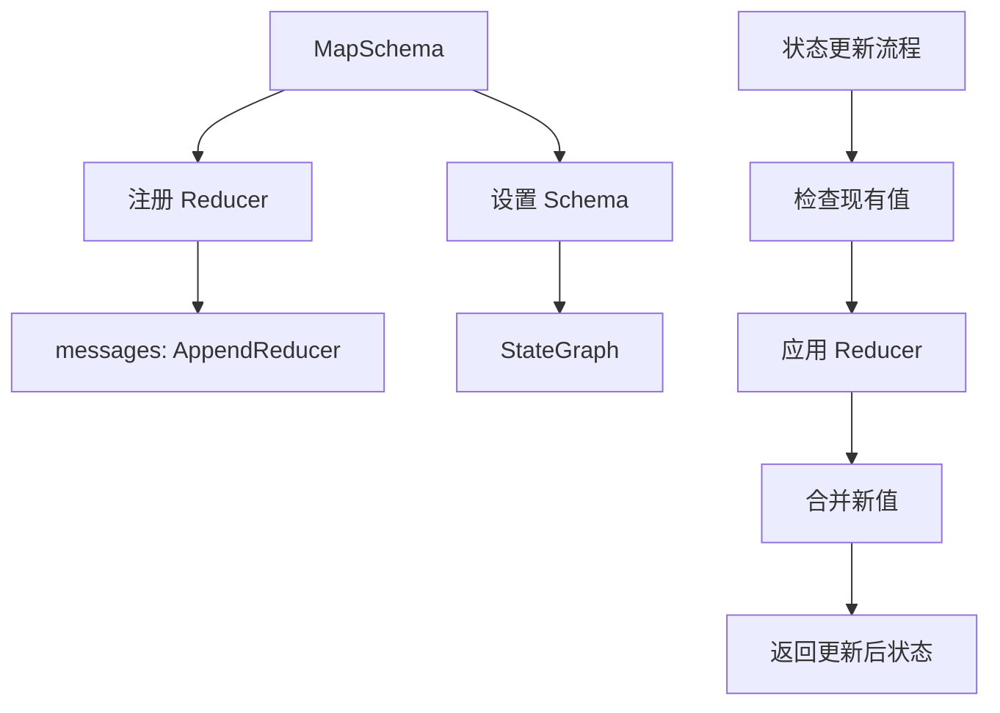

**图表来源**
- [examples/swarm/main.go](file://examples/swarm/main.go#L61-L65)
- [graph/schema.go](file://graph/schema.go#L44-L47)

**章节来源**
- [examples/swarm/main.go](file://examples/swarm/main.go#L61-L65)
- [graph/schema.go](file://graph/schema.go#L62-L99)

## 与 Supervisor 模式的对比

Swarm 模式与传统的 Supervisor 模式在架构设计上存在根本差异：

### 架构对比

| 特性 | Swarm 模式 | Supervisor 模式 |
|------|------------|----------------|
| **控制结构** | 去中心化，代理间直接协作 | 中心化，通过监督者协调 |
| **路由机制** | 基于状态的动态路由 | 基于工具调用的静态路由 |
| **状态共享** | 所有代理共享同一状态 | 状态独立，通过监督者协调 |
| **灵活性** | 高度灵活，支持复杂协作模式 | 结构固定，适合简单流水线 |
| **复杂度** | 较高，需要精心设计状态 | 较低，框架提供标准化接口 |

### 协作模式差异

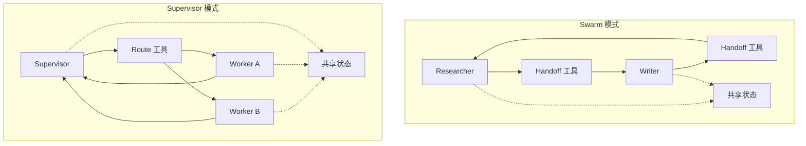

**图表来源**
- [examples/swarm/main.go](file://examples/swarm/main.go#L192-L200)
- [prebuilt/supervisor.go](file://prebuilt/supervisor.go#L130-L150)

### 优势对比

#### Swarm 模式的优势：
1. **真实模拟**: 更接近真实专家团队的协作方式
2. **灵活性**: 支持复杂的双向协作模式
3. **去中心化**: 无需中央协调器，减少单点故障
4. **动态适应**: 能够根据上下文动态调整协作策略

#### Supervisor 模式的适用场景：
1. **简单流水线**: 适用于线性、可预测的工作流程
2. **标准化任务**: 适合需要严格控制的任务分配
3. **监控友好**: 中央控制便于监控和审计

**章节来源**
- [examples/swarm/main.go](file://examples/swarm/main.go#L1-L244)
- [prebuilt/supervisor.go](file://prebuilt/supervisor.go#L1-L153)

## 性能考虑

Swarm 模式在性能方面具有以下特点：

### 并发执行优势
- **并行处理**: 多个代理可以同时处理不同的任务分支
- **状态隔离**: 每个代理维护自己的状态副本，避免锁竞争
- **快速切换**: 通过状态标记实现快速的代理间切换

### 内存管理
- **增量更新**: 只更新必要的状态部分，减少内存占用
- **垃圾回收**: 及时清理不再需要的状态数据
- **缓存策略**: 合理利用缓存提高重复查询的效率

### 扩展性设计
- **水平扩展**: 新增代理只需添加节点和条件边
- **插件化**: 支持动态添加新的协作模式
- **配置驱动**: 通过配置文件轻松调整协作策略

## 故障排除指南

### 常见问题及解决方案

#### 1. 移交失败
**症状**: 代理无法正确移交控制权
**原因**: 
- `next` 字段设置错误
- 目标代理不存在
- 状态更新不完整

**解决方案**:
- 检查 `next` 字段的值是否正确
- 验证目标代理已正确定义
- 确保状态更新包含所有必要字段

#### 2. 路由循环
**症状**: 系统陷入无限循环
**原因**: 
- 代理间相互移交导致循环
- 路由条件设计不当

**解决方案**:
- 添加循环检测机制
- 设计明确的终止条件
- 使用有限状态机模式

#### 3. 状态不一致
**症状**: 代理看到不一致的消息历史
**原因**: 
- 并发更新冲突
- 状态同步延迟

**解决方案**:
- 实现状态版本控制
- 使用乐观锁机制
- 增加状态验证步骤

**章节来源**
- [examples/swarm/main.go](file://examples/swarm/main.go#L192-L200)
- [graph/state_graph.go](file://graph/state_graph.go#L240-L268)

## 结论

Swarm 去中心化协作模式代表了多代理系统设计的重要创新。通过 Handoff 机制实现的代理间直接控制权转移，以及 Router 函数基于状态的动态路由决策，使得 Swarm 能够模拟真实专家团队的灵活协作方式。

与传统的 Supervisor 模式相比，Swarm 提供了更高的灵活性和更真实的协作体验，特别适合需要复杂交互和动态调整的场景。共享状态机制确保了代理间的信息同步，而去中心化的架构设计减少了系统复杂性和单点故障风险。

这种模式在实际应用中展现了强大的潜力，特别是在需要多个专业领域协作的复杂任务处理场景中。随着多代理系统的不断发展，Swarm 模式有望成为构建智能协作系统的重要基础架构。