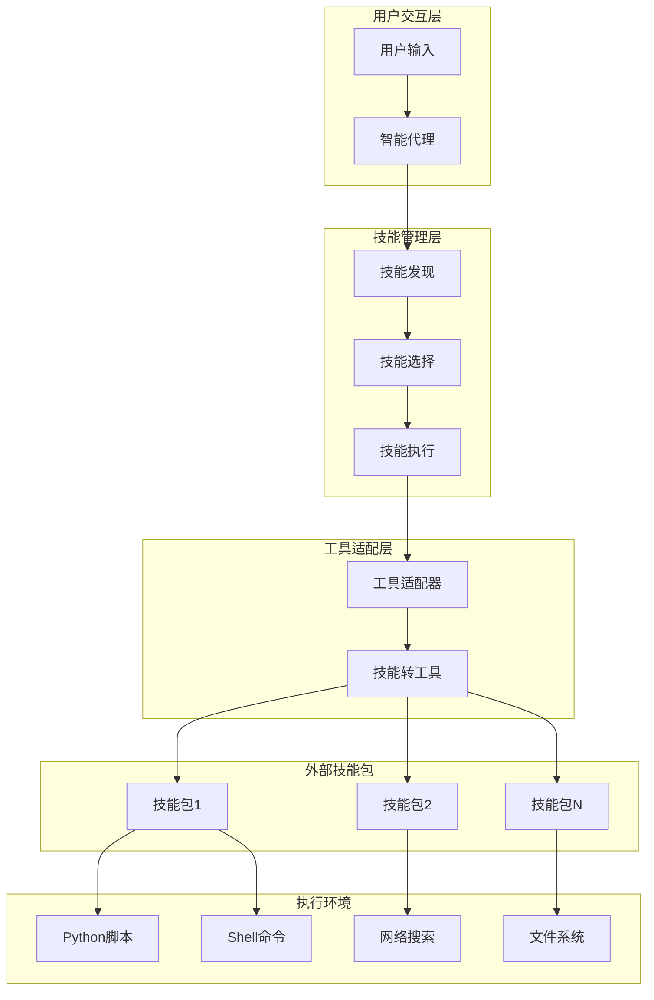
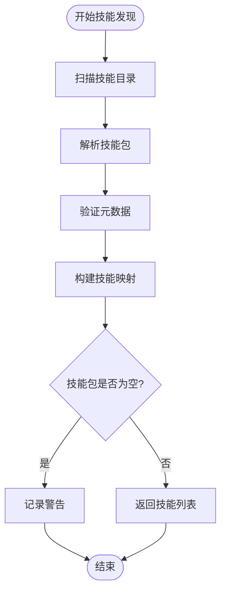
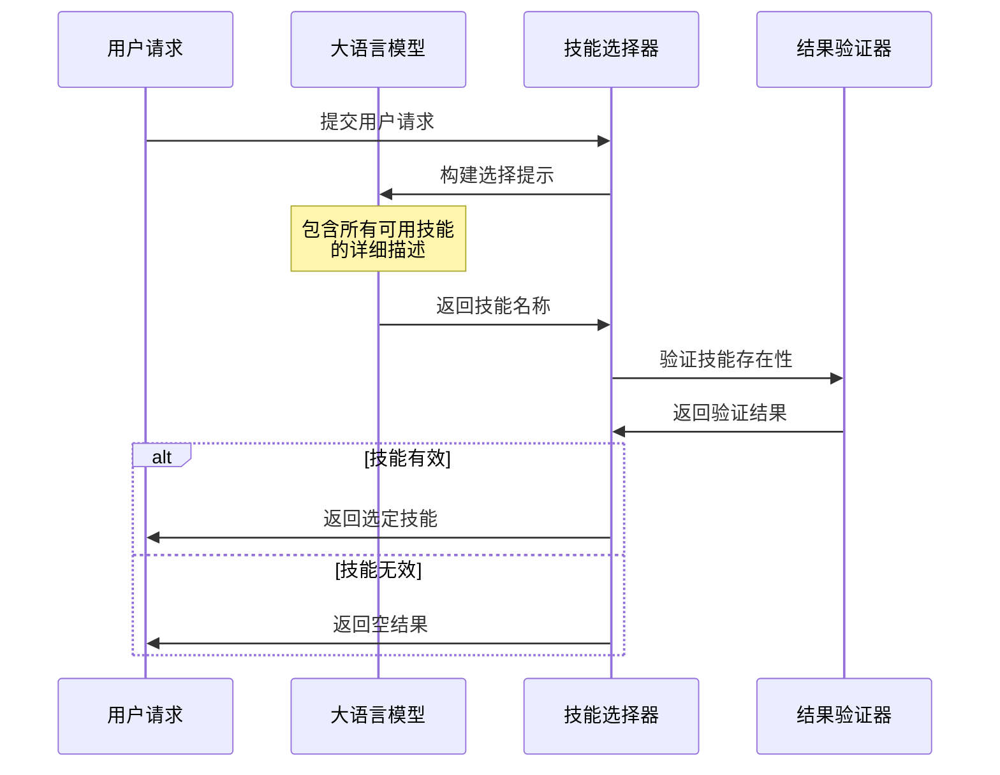
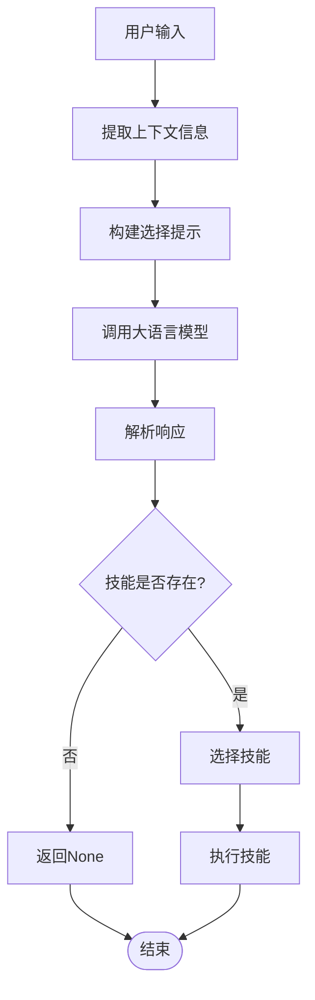
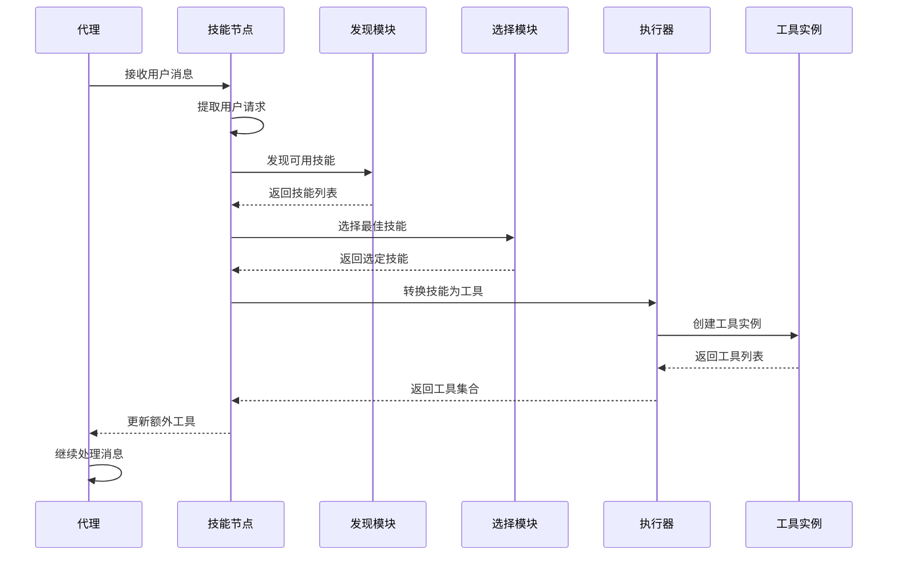
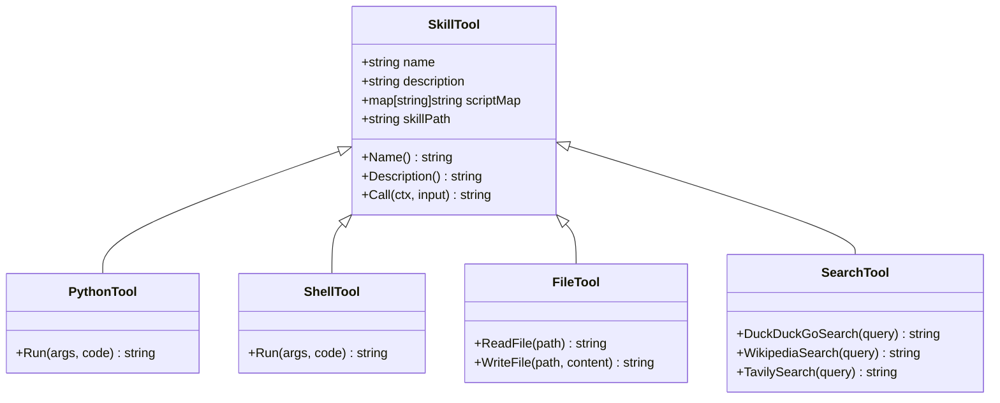
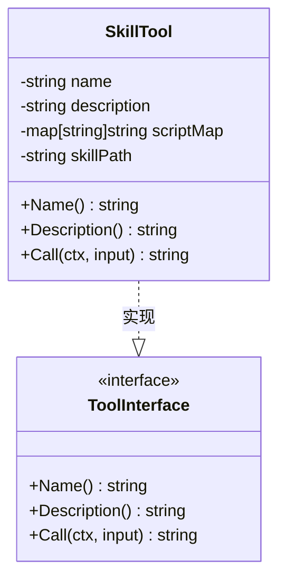
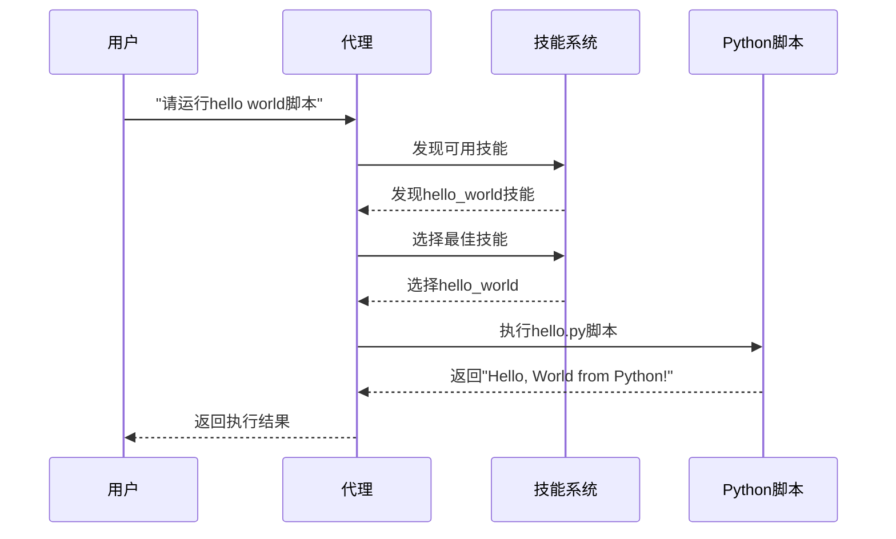
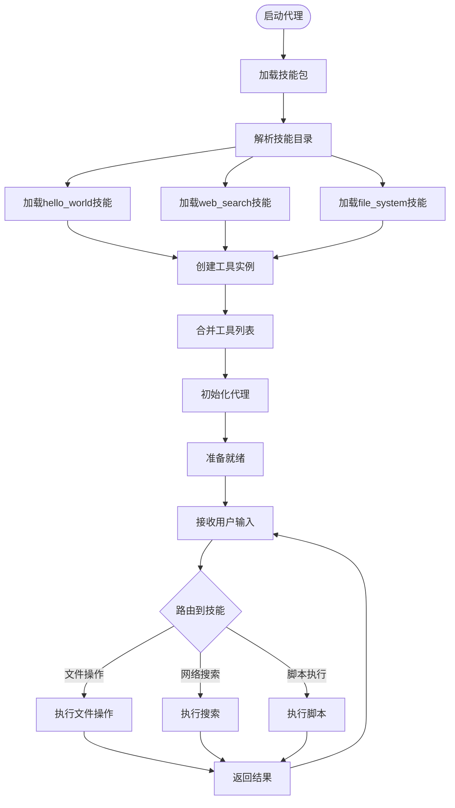
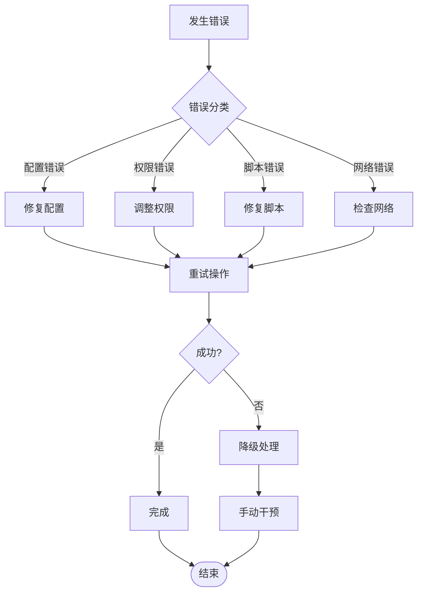

# 动态技能系统

<cite>
**本文档引用的文件**
- [examples/dynamic_skill_agent/main.go](file://examples/dynamic_skill_agent/main.go)
- [examples/dynamic_skill_agent/README.md](file://examples/dynamic_skill_agent/README.md)
- [examples/goskills_example/main.go](file://examples/goskills_example/main.go)
- [examples/goskills_example/README.md](file://examples/goskills_example/README.md)
- [adapter/goskills/goskills.go](file://adapter/goskills/goskills.go)
- [prebuilt/create_agent.go](file://prebuilt/create_agent.go)
- [skills/hello_world/SKILL.md](file://skills/hello_world/SKILL.md)
- [tool/tool_test.go](file://tool/tool_test.go)
</cite>

## 目录
1. [简介](#简介)
2. [系统架构](#系统架构)
3. [核心组件](#核心组件)
4. [技能发现与选择机制](#技能发现与选择机制)
5. [技能执行流程](#技能执行流程)
6. [技能包结构](#技能包结构)
7. [工具适配器](#工具适配器)
8. [使用示例](#使用示例)
9. [性能考虑](#性能考虑)
10. [故障排除指南](#故障排除指南)
11. [总结](#总结)

## 简介

LangGraphGo 的动态技能系统是一个强大的框架，允许智能代理根据用户需求自动发现、选择和执行特定的技能。该系统基于 GoSkills 框架构建，提供了灵活的技能管理和执行能力，使开发者能够轻松扩展代理的功能而无需编写复杂的自定义工具。

动态技能系统的核心优势包括：
- **自动化技能选择**: 基于用户请求自动匹配最合适的技能
- **灵活的技能包结构**: 支持多种编程语言和执行环境
- **无缝集成**: 与 LangGraphGo 的现有架构完美兼容
- **可扩展性**: 支持无限数量的技能包和工具

## 系统架构

动态技能系统采用分层架构设计，确保各个组件之间的松耦合和高内聚。



**图表来源**
- [prebuilt/create_agent.go](file://prebuilt/create_agent.go#L66-L403)
- [adapter/goskills/goskills.go](file://adapter/goskills/goskills.go#L167-L208)

## 核心组件

### 1. 技能发现节点

技能发现节点是整个系统的核心，负责扫描指定目录中的技能包并建立可用技能的映射。



**图表来源**
- [prebuilt/create_agent.go](file://prebuilt/create_agent.go#L406-L416)

### 2. 技能选择引擎

技能选择引擎使用大语言模型来分析用户请求并选择最合适的技能。



**图表来源**
- [prebuilt/create_agent.go](file://prebuilt/create_agent.go#L419-L448)

### 3. 工具转换器

工具转换器将技能包转换为 LangGraphGo 兼容的工具接口。

**章节来源**
- [adapter/goskills/goskills.go](file://adapter/goskills/goskills.go#L167-L208)

## 技能发现与选择机制

### 技能发现过程

技能发现过程通过递归扫描指定目录来查找符合标准的技能包：

1. **目录扫描**: 遍历指定路径下的所有子目录
2. **格式验证**: 检查每个目录是否包含有效的技能包结构
3. **元数据解析**: 解析 `SKILL.md` 文件中的 YAML 元数据
4. **技能映射**: 建立技能名称到技能包的映射关系

### 技能选择算法

技能选择采用基于上下文的匹配策略：



**图表来源**
- [prebuilt/create_agent.go](file://prebuilt/create_agent.go#L419-L448)

**章节来源**
- [prebuilt/create_agent.go](file://prebuilt/create_agent.go#L406-L448)

## 技能执行流程

### 完整执行链路

技能执行遵循严格的顺序流程，确保可靠性和可追踪性：



**图表来源**
- [prebuilt/create_agent.go](file://prebuilt/create_agent.go#L83-L170)

### 工具执行机制

工具执行采用统一的接口模式，支持多种类型的技能：



**图表来源**
- [adapter/goskills/goskills.go](file://adapter/goskills/goskills.go#L16-L22)

**章节来源**
- [prebuilt/create_agent.go](file://prebuilt/create_agent.go#L298-L371)

## 技能包结构

### 标准技能包布局

每个技能包必须遵循标准化的目录结构：

```
skills/
├── skill_name/
│   ├── SKILL.md              # 技能元数据和描述
│   ├── scripts/              # 可选：脚本文件目录
│   │   ├── script1.py        # Python脚本
│   │   ├── script2.sh        # Shell脚本
│   │   └── script3.js        # JavaScript脚本
│   ├── assets/               # 可选：资源文件
│   │   ├── config.json       # 配置文件
│   │   └── templates/        # 模板文件
│   └── tools.json            # 可选：工具定义
```

### SKILL.md 元数据格式

`SKILL.md` 文件使用 YAML 前言格式定义技能的基本信息：

| 字段 | 类型 | 必需 | 描述 |
|------|------|------|------|
| name | string | 是 | 技能的唯一标识符（小写字母、数字、连字符） |
| description | string | 是 | 技能功能的简要描述 |
| version | string | 是 | 版本号（语义化版本） |
| license | string | 否 | 许可证类型 |
| authors | array | 否 | 作者信息列表 |

### 支持的脚本类型

| 脚本类型 | 文件扩展名 | 执行方式 | 参数传递 |
|----------|------------|----------|----------|
| Python脚本 | `.py` | 直接执行 | 命令行参数 |
| Shell脚本 | `.sh` | Shell执行 | 命令行参数 |
| JavaScript | `.js` | Node.js执行 | JSON参数 |
| Python代码 | 内联 | 临时文件 | 字符串参数 |
| Shell代码 | 内联 | 临时文件 | 字符串参数 |

**章节来源**
- [skills/hello_world/SKILL.md](file://skills/hello_world/SKILL.md#L1-L37)

## 工具适配器

### SkillTool 实现

工具适配器实现了 `tools.Tool` 接口，为不同类型的技能提供统一的调用接口：



**图表来源**
- [adapter/goskills/goskills.go](file://adapter/goskills/goskills.go#L16-L22)

### 支持的内置工具类型

工具适配器支持多种内置工具类型，每种都有特定的参数格式：

| 工具名称 | 功能描述 | 参数格式 | 输出格式 |
|----------|----------|----------|----------|
| run_python_script | 执行Python脚本 | `{"scriptPath": "path", "args": ["arg1", "arg2"]}` | 标准输出 |
| run_shell_script | 执行Shell脚本 | `{"scriptPath": "path", "args": ["arg1", "arg2"]}` | 标准输出 |
| run_python_code | 执行Python代码 | `{"code": "print('hello')", "args": {"key": "value"}}` | 标准输出 |
| run_shell_code | 执行Shell代码 | `{"code": "echo hello", "args": {"key": "value"}}` | 标准输出 |
| read_file | 读取文件内容 | `{"filePath": "path"}` | 文件内容 |
| write_file | 写入文件内容 | `{"filePath": "path", "content": "text"}` | 操作结果 |
| duckduckgo_search | DuckDuckGo搜索 | `{"query": "search term"}` | 搜索结果 |
| wikipedia_search | 维基百科搜索 | `{"query": "search term"}` | 页面内容 |
| tavily_search | Tavily搜索 | `{"query": "search term"}` | 搜索结果 |
| web_fetch | 获取网页内容 | `{"url": "https://example.com"}` | 页面HTML |

**章节来源**
- [adapter/goskills/goskills.go](file://adapter/goskills/goskills.go#L34-L166)

## 使用示例

### 基础技能代理示例

以下展示了如何创建一个支持动态技能的智能代理：



**图表来源**
- [examples/dynamic_skill_agent/main.go](file://examples/dynamic_skill_agent/main.go#L48-L62)

### 多技能集成示例

高级示例展示了如何集成多个技能包：



**图表来源**
- [examples/goskills_example/main.go](file://examples/goskills_example/main.go#L55-L81)

**章节来源**
- [examples/dynamic_skill_agent/main.go](file://examples/dynamic_skill_agent/main.go#L1-L103)
- [examples/goskills_example/main.go](file://examples/goskills_example/main.go#L1-L170)

## 性能考虑

### 技能发现优化

为了提高性能，建议采取以下优化措施：

1. **缓存机制**: 缓存已发现的技能包信息，避免重复扫描
2. **增量更新**: 仅在目录发生变化时重新扫描
3. **异步加载**: 在后台异步加载技能包
4. **内存管理**: 及时释放不再使用的技能包资源

### 技选择优化

技能选择过程可以通过以下方式优化：

1. **向量化搜索**: 使用向量相似度匹配技能
2. **预训练分类器**: 使用机器学习模型预筛选技能
3. **缓存热门技能**: 缓存常用技能的选择结果
4. **并行处理**: 并行处理多个候选技能

### 工具执行优化

工具执行过程的性能优化包括：

1. **进程池管理**: 复用执行进程减少启动开销
2. **资源限制**: 设置合理的CPU和内存限制
3. **超时控制**: 防止长时间运行的脚本阻塞
4. **结果缓存**: 缓存相同输入的执行结果

## 故障排除指南

### 常见问题及解决方案

| 问题 | 症状 | 原因 | 解决方案 |
|------|------|------|----------|
| 技能未被发现 | 日志显示"无技能找到" | 目录结构错误或权限问题 | 检查目录权限和技能包结构 |
| 技能选择失败 | LLM返回"None" | 技能描述不清晰或请求不明确 | 优化技能描述和用户请求 |
| 脚本执行失败 | 返回错误信息 | 脚本语法错误或依赖缺失 | 检查脚本语法和环境依赖 |
| 工具调用超时 | 请求处理时间过长 | 脚本执行时间过长 | 设置合理的超时时间和资源限制 |

### 调试技巧

1. **启用详细日志**: 使用 `WithVerbose(true)` 选项获取详细信息
2. **技能验证**: 使用 `goskills.ParseSkillPackages` 验证技能包格式
3. **工具测试**: 单独测试每个工具的功能
4. **性能监控**: 监控技能发现和执行的时间消耗

### 错误处理策略



**章节来源**
- [prebuilt/create_agent.go](file://prebuilt/create_agent.go#L115-L170)

## 总结

LangGraphGo 的动态技能系统提供了一个强大而灵活的框架，使智能代理能够根据用户需求自动发现、选择和执行特定的技能。该系统的主要优势包括：

### 核心特性

1. **自动化技能管理**: 无需手动配置即可自动发现和管理技能
2. **灵活的技能包结构**: 支持多种编程语言和执行环境
3. **无缝集成**: 与现有 LangGraphGo 架构完全兼容
4. **可扩展性**: 支持无限数量的技能包和工具
5. **高性能**: 优化的发现和执行机制

### 应用场景

- **智能客服系统**: 自动识别用户意图并调用相应技能
- **开发工具集成**: 提供代码分析、调试和部署功能
- **数据处理管道**: 自动处理不同类型的数据任务
- **自动化运维**: 执行系统监控、维护和故障排除任务

### 未来发展方向

1. **技能市场**: 建立技能共享和交易平台
2. **智能推荐**: 基于历史使用情况推荐相关技能
3. **技能编排**: 支持复杂技能组合和工作流
4. **云原生支持**: 提供容器化和微服务化的技能部署方案

通过动态技能系统，开发者可以快速构建功能丰富、高度可定制的智能代理应用，大大提高了开发效率和用户体验。