# 基础代理创建

<cite>
**本文档中引用的文件**
- [prebuilt/create_agent.go](file://prebuilt/create_agent.go)
- [examples/create_agent/main.go](file://examples/create_agent/main.go)
- [examples/create_agent/README.md](file://examples/create_agent/README.md)
- [prebuilt/react_agent.go](file://prebuilt/react_agent.go)
- [prebuilt/tool_executor.go](file://prebuilt/tool_executor.go)
- [prebuilt/create_agent_test.go](file://prebuilt/create_agent_test.go)
- [graph/schema.go](file://graph/schema.go)
- [graph/graph.go](file://graph/graph.go)
</cite>

## 目录
1. [简介](#简介)
2. [项目结构](#项目结构)
3. [核心组件](#核心组件)
4. [架构概览](#架构概览)
5. [详细组件分析](#详细组件分析)
6. [函数式选项模式](#函数式选项模式)
7. [状态图结构](#状态图结构)
8. [与 CreateReactAgent 对比](#与-createreactagent-对比)
9. [性能考虑](#性能考虑)
10. [故障排除指南](#故障排除指南)
11. [结论](#结论)

## 简介

LangGraphGo 的 `prebuilt.CreateAgent` 函数提供了一个强大而灵活的基础智能代理创建框架。该函数采用函数式选项模式（Functional Options Pattern），允许开发者通过可选参数轻松配置代理的行为，包括系统消息、状态修改器等关键特性。

本文档将深入探讨如何使用 `CreateAgent` 函数创建基础智能代理，解释函数式选项模式的设计优势，展示从初始化 LLM 到构建并调用代理的完整流程，并说明代理内部的状态图结构及其与 `CreateReactAgent` 的区别。

## 项目结构

LangGraphGo 项目采用模块化架构，核心功能分布在以下关键目录中：

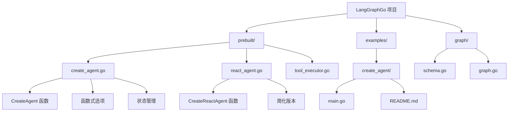

**图表来源**
- [prebuilt/create_agent.go](file://prebuilt/create_agent.go#L1-L252)
- [examples/create_agent/main.go](file://examples/create_agent/main.go#L1-L86)

**章节来源**
- [prebuilt/create_agent.go](file://prebuilt/create_agent.go#L1-L50)
- [examples/create_agent/main.go](file://examples/create_agent/main.go#L1-L30)

## 核心组件

### CreateAgentOptions 结构体

`CreateAgentOptions` 是 `CreateAgent` 函数的核心配置结构体，定义了代理创建时可用的所有选项：

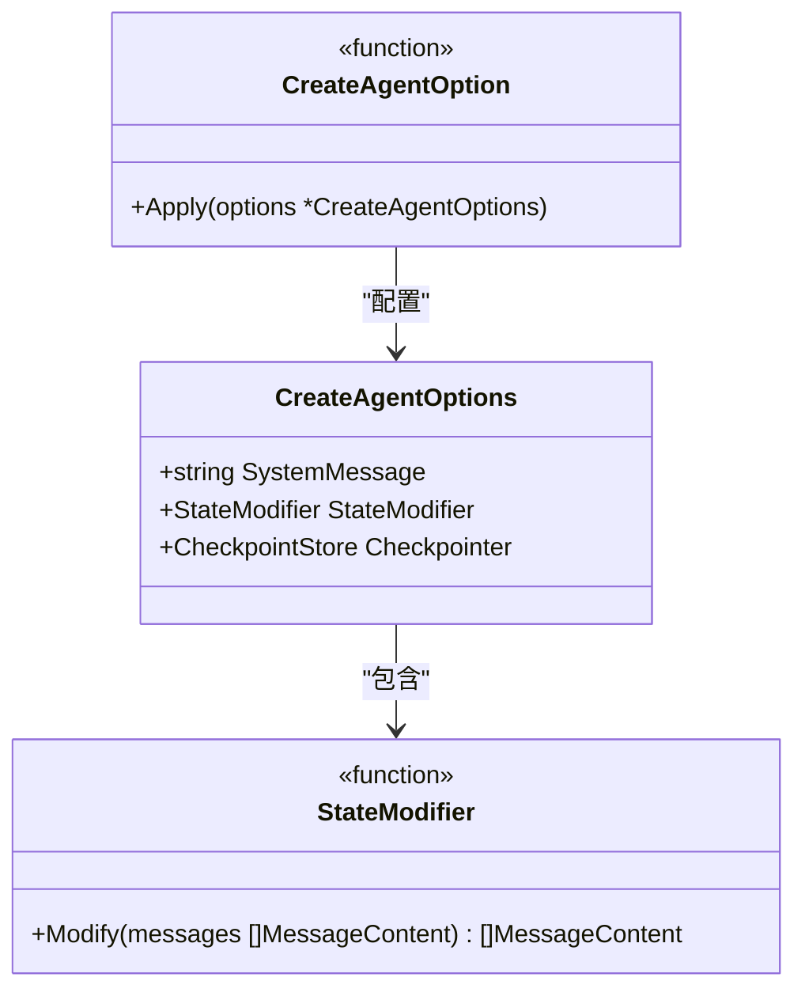

**图表来源**
- [prebuilt/create_agent.go](file://prebuilt/create_agent.go#L13-L18)

### 主要配置选项

| 配置项 | 类型 | 描述 | 默认值 |
|--------|------|------|--------|
| SystemMessage | string | 系统提示消息，定义代理行为 | "" |
| StateModifier | func | 消息状态修改器，用于预处理消息历史 | nil |
| Checkpointer | CheckpointStore | 检查点存储器，用于状态持久化 | nil |

**章节来源**
- [prebuilt/create_agent.go](file://prebuilt/create_agent.go#L13-L18)

## 架构概览

`CreateAgent` 函数构建了一个基于状态图的智能代理系统，该系统包含以下核心组件：

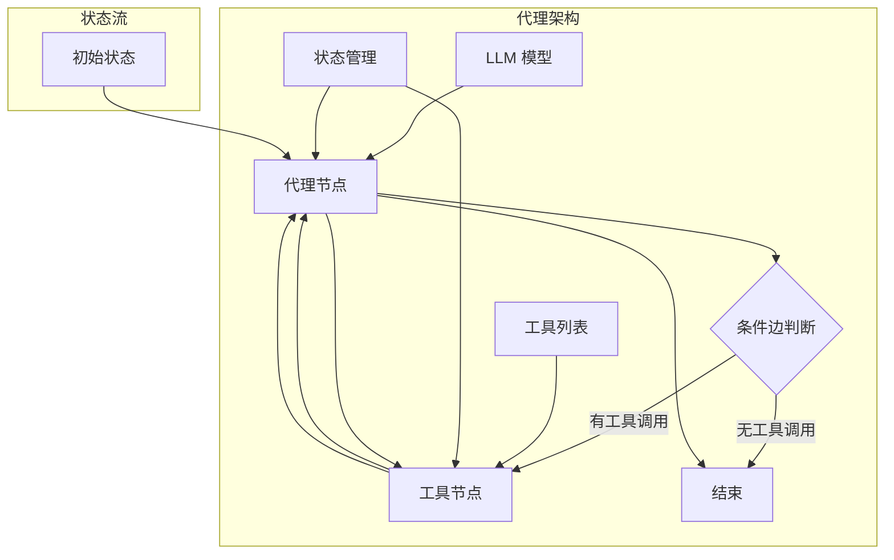

**图表来源**
- [prebuilt/create_agent.go](file://prebuilt/create_agent.go#L46-L251)

**章节来源**
- [prebuilt/create_agent.go](file://prebuilt/create_agent.go#L46-L251)

## 详细组件分析

### CreateAgent 函数实现

`CreateAgent` 函数是整个代理系统的核心入口点，负责：

1. **选项处理**: 应用所有传入的函数式选项
2. **工具执行器创建**: 初始化工具执行器
3. **状态图构建**: 创建并配置状态图
4. **节点定义**: 定义代理节点和工具节点
5. **边路由**: 设置条件边和普通边

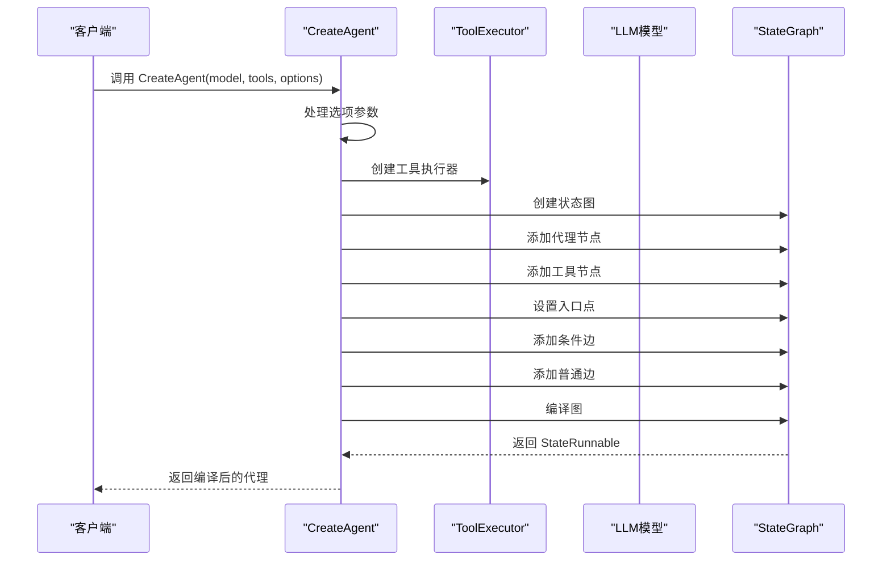

**图表来源**
- [prebuilt/create_agent.go](file://prebuilt/create_agent.go#L46-L251)

### 代理节点实现

代理节点是系统的核心推理引擎，负责：

1. **工具定义转换**: 将工具列表转换为 LLM 可识别的格式
2. **消息预处理**: 应用系统消息和状态修改器
3. **LLM 调用**: 发送消息并处理响应
4. **结果封装**: 将 LLM 响应封装为标准格式

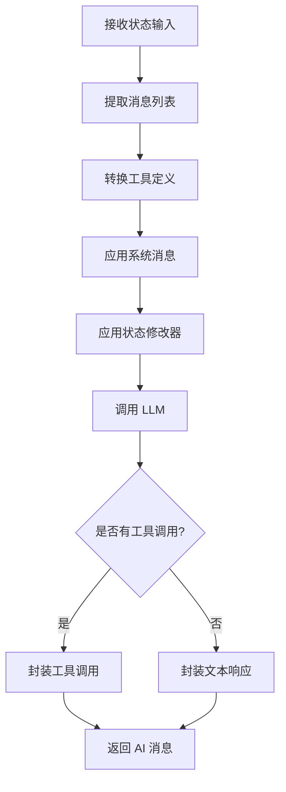

**图表来源**
- [prebuilt/create_agent.go](file://prebuilt/create_agent.go#L65-L164)

### 工具节点实现

工具节点负责执行 LLM 调用的工具请求：

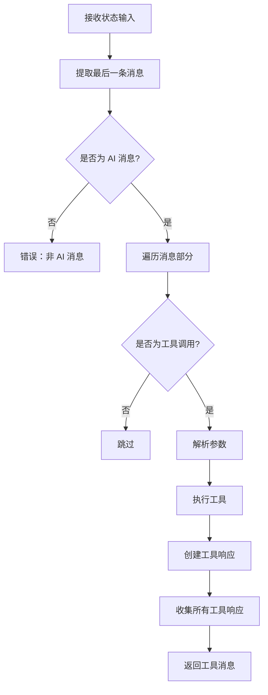

**图表来源**
- [prebuilt/create_agent.go](file://prebuilt/create_agent.go#L167-L224)

**章节来源**
- [prebuilt/create_agent.go](file://prebuilt/create_agent.go#L65-L224)

## 函数式选项模式

### 设计优势

函数式选项模式（Functional Options Pattern）是 `CreateAgent` 函数的核心设计理念，具有以下优势：

1. **可读性**: 通过命名函数清晰表达配置意图
2. **可扩展性**: 易于添加新的配置选项
3. **向后兼容**: 新增选项不会破坏现有代码
4. **类型安全**: 编译时检查选项类型

### 核心选项函数

#### WithSystemMessage

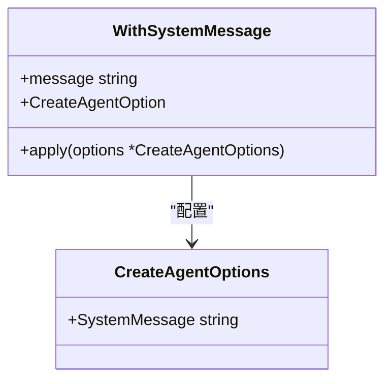

**图表来源**
- [prebuilt/create_agent.go](file://prebuilt/create_agent.go#L23-L28)

#### WithStateModifier

状态修改器提供了强大的消息预处理能力：

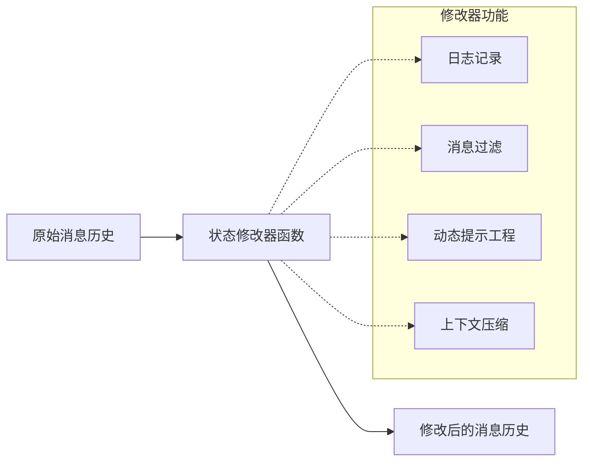

**图表来源**
- [prebuilt/create_agent.go](file://prebuilt/create_agent.go#L30-L35)

**章节来源**
- [prebuilt/create_agent.go](file://prebuilt/create_agent.go#L23-L42)
- [examples/create_agent/main.go](file://examples/create_agent/main.go#L50-L55)

## 状态图结构

### 内部状态图

`CreateAgent` 创建的状态图包含两个主要节点和相应的边：

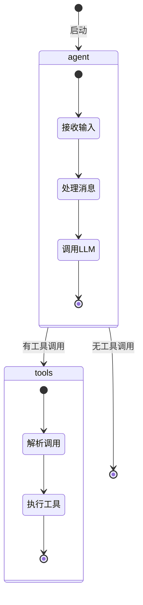

**图表来源**
- [prebuilt/create_agent.go](file://prebuilt/create_agent.go#L227-L248)

### 条件边路由逻辑

条件边决定了代理的执行流程：

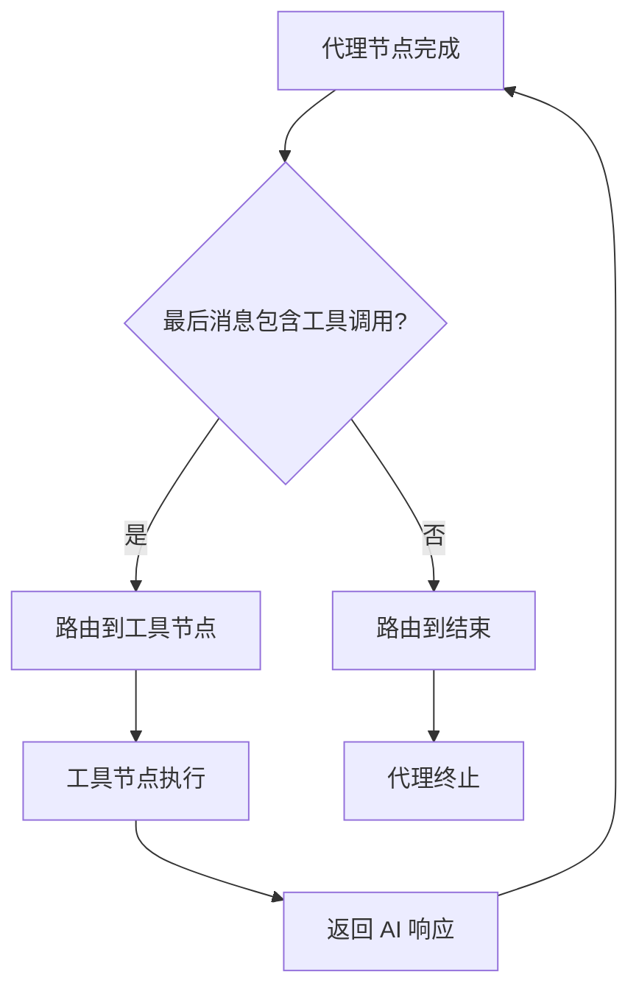

**图表来源**
- [prebuilt/create_agent.go](file://prebuilt/create_agent.go#L229-L246)

### 状态 Schema

代理使用 `MapSchema` 和 `AppendReducer` 来管理消息历史：

| 字段名 | 类型 | 用途 | Reducer |
|--------|------|------|---------|
| messages | []MessageContent | 存储对话历史 | AppendReducer |

**章节来源**
- [prebuilt/create_agent.go](file://prebuilt/create_agent.go#L58-L62)
- [prebuilt/create_agent.go](file://prebuilt/create_agent.go#L227-L248)

## 与 CreateReactAgent 对比

### 功能对比表

| 特性 | CreateAgent | CreateReactAgent |
|------|-------------|------------------|
| 灵活性 | ✅ 高度可配置 | ⚠️ 基础配置 |
| 函数式选项 | ✅ 支持 | ❌ 不支持 |
| 系统消息 | ✅ 支持 | ❌ 不支持 |
| 状态修改器 | ✅ 支持 | ❌ 不支持 |
| 检查点支持 | ✅ 计划中 | ❌ 不支持 |
| 扩展性 | ✅ 易于扩展 | ⚠️ 有限扩展 |

### 实现差异

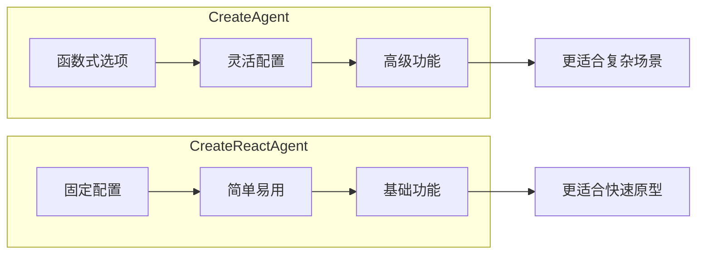

**图表来源**
- [prebuilt/create_agent.go](file://prebuilt/create_agent.go#L46-L50)
- [prebuilt/react_agent.go](file://prebuilt/react_agent.go#L14-L18)

**章节来源**
- [prebuilt/create_agent.go](file://prebuilt/create_agent.go#L46-L50)
- [prebuilt/react_agent.go](file://prebuilt/react_agent.go#L14-L18)

## 性能考虑

### 优化策略

1. **消息缓存**: 合理使用状态修改器避免重复计算
2. **工具并发**: 在实际实现中可以考虑工具执行的并发处理
3. **内存管理**: 注意消息历史的增长控制
4. **LLM 调用优化**: 合理设置工具数量和消息长度

### 最佳实践

- 使用状态修改器进行消息压缩
- 合理设置系统消息的长度
- 监控工具执行时间
- 实现适当的错误处理机制

## 故障排除指南

### 常见问题及解决方案

#### 1. 系统消息未生效

**问题**: 设置了系统消息但未被使用

**解决方案**: 确保正确使用 `WithSystemMessage` 选项，并检查状态修改器是否移除了系统消息

#### 2. 工具调用失败

**问题**: LLM 调用了不存在的工具

**解决方案**: 检查工具名称匹配和工具定义格式

#### 3. 状态修改器异常

**问题**: 状态修改器导致程序崩溃

**解决方案**: 添加适当的错误处理和边界检查

**章节来源**
- [prebuilt/create_agent_test.go](file://prebuilt/create_agent_test.go#L104-L181)

## 结论

`prebuilt.CreateAgent` 函数提供了一个强大而灵活的基础智能代理创建框架。通过函数式选项模式，开发者可以轻松配置代理的各种行为，包括系统消息、状态修改器等高级特性。

与 `CreateReactAgent` 相比，`CreateAgent` 提供了更高的灵活性和扩展性，特别适合需要复杂配置和定制化的应用场景。其基于状态图的架构设计确保了代理执行的可预测性和可调试性。

通过合理使用这些功能，开发者可以构建出功能丰富、性能优异的智能代理系统，满足各种复杂的业务需求。