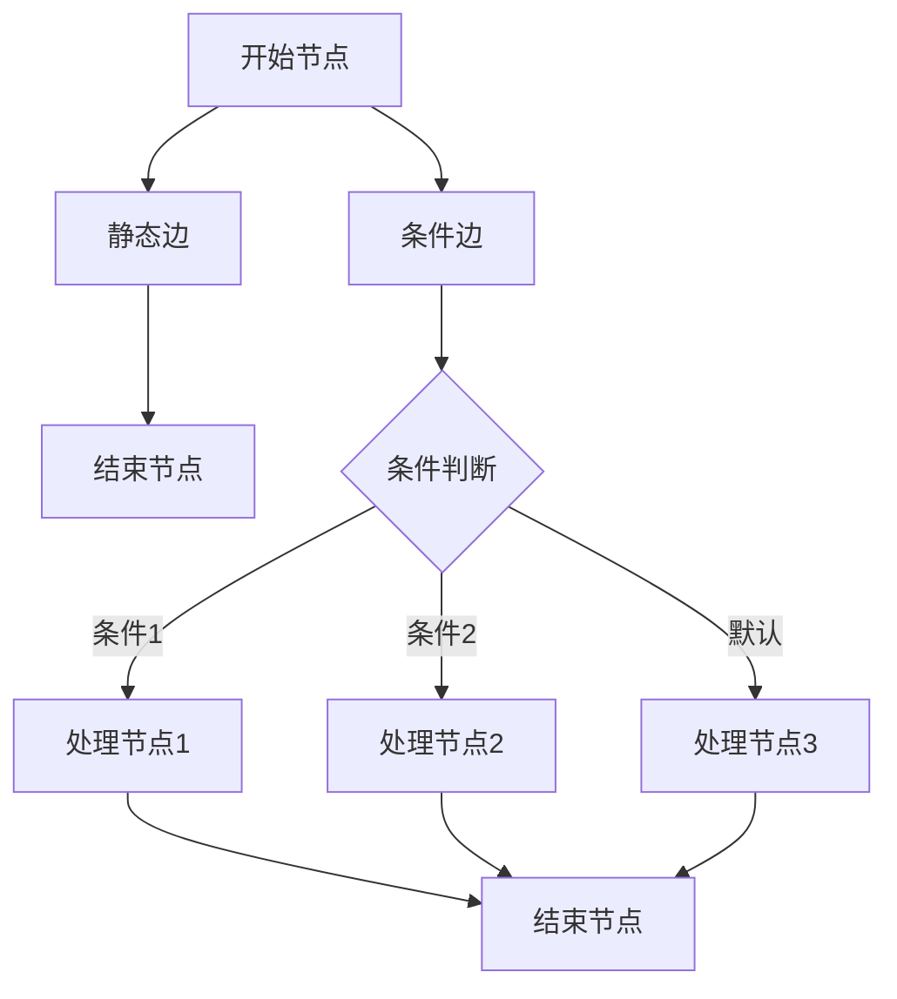
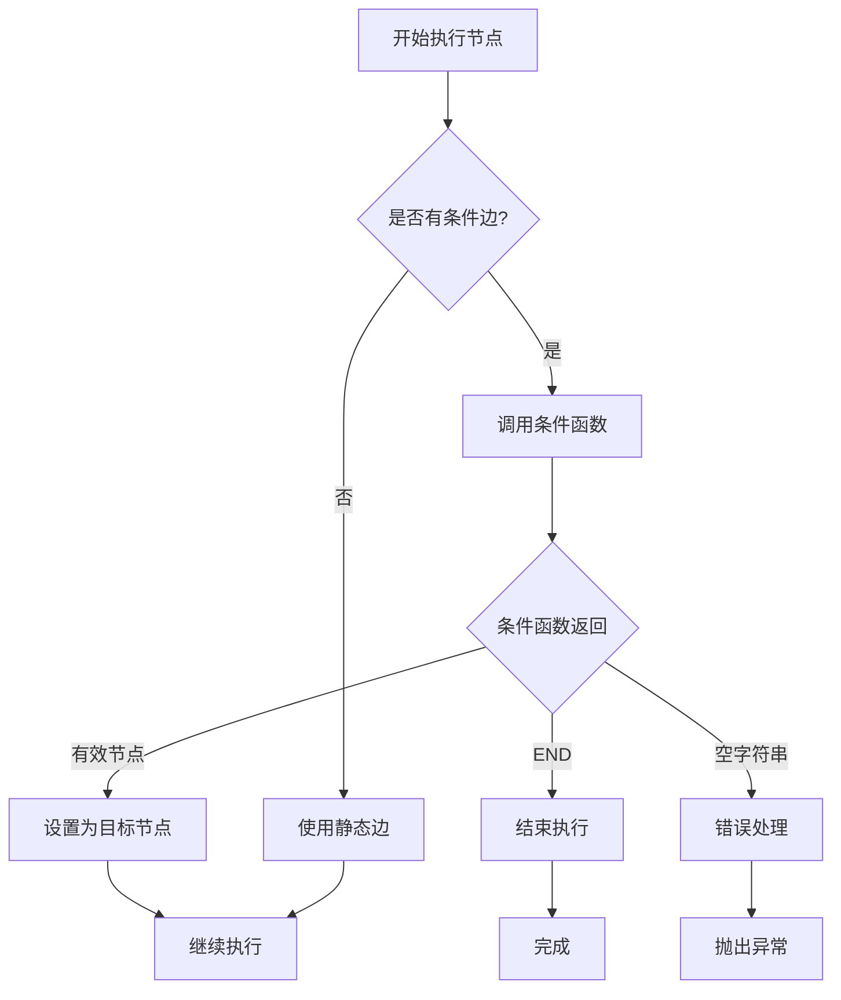
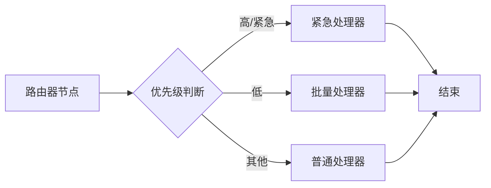
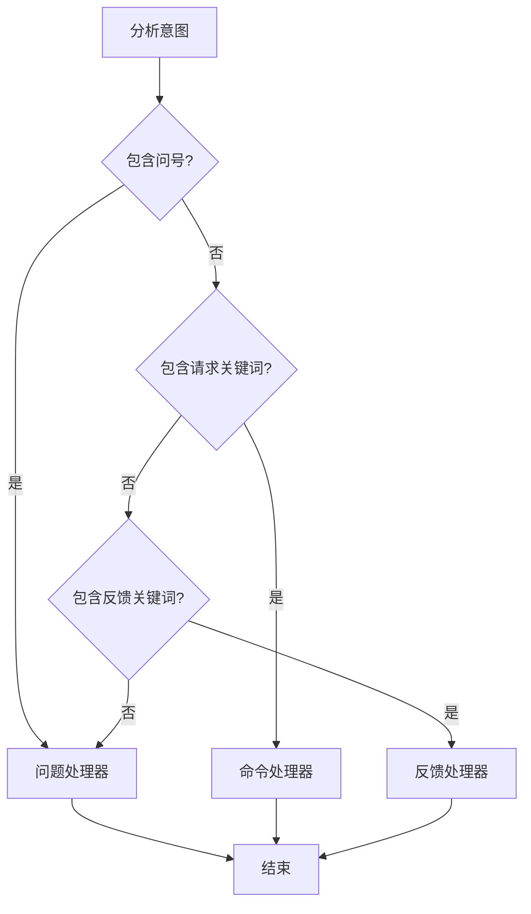
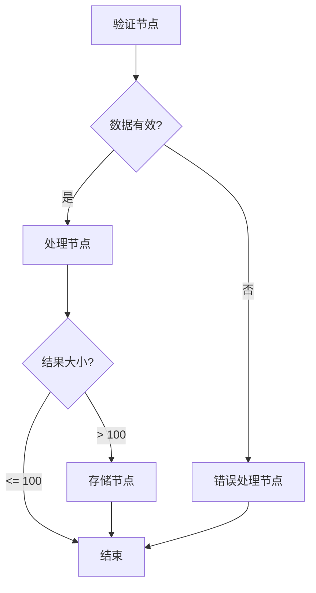
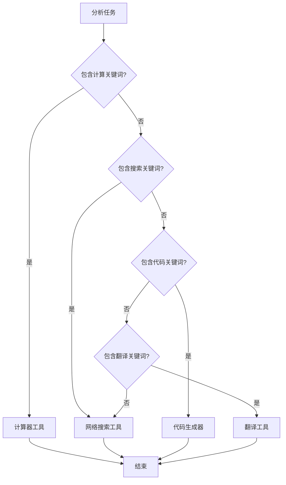
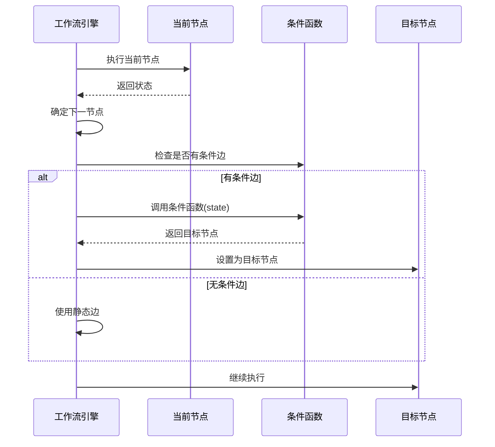

# 条件路由与边控制

<cite>
**本文档中引用的文件**
- [examples/conditional_routing/main.go](file://examples/conditional_routing/main.go)
- [examples/conditional_edges_example/main.go](file://examples/conditional_edges_example/main.go)
- [examples/conditional_routing/README.md](file://examples/conditional_routing/README.md)
- [examples/conditional_edges_example/README.md](file://examples/conditional_edges_example/README.md)
- [graph/graph.go](file://graph/graph.go)
- [graph/state_graph.go](file://graph/state_graph.go)
- [graph/conditional_edges_test.go](file://graph/conditional_edges_test.go)
- [graph/edge_cases_test.go](file://graph/edge_cases_test.go)
</cite>

## 目录
1. [简介](#简介)
2. [核心概念](#核心概念)
3. [条件边机制](#条件边机制)
4. [条件函数规范](#条件函数规范)
5. [示例分析](#示例分析)
6. [执行流程](#执行流程)
7. [性能考虑](#性能考虑)
8. [调试技巧](#调试技巧)
9. [最佳实践](#最佳实践)
10. [总结](#总结)

## 简介

LangGraphGo 的条件路由机制是一种强大的工作流控制功能，允许根据运行时状态动态决定执行路径。这种机制类似于编程语言中的 if-else 逻辑分支，但具有更灵活的状态驱动特性。通过条件边（Conditional Edges），开发者可以创建复杂的决策树结构，实现智能的工作流路由。

条件路由的核心优势在于：
- **动态路径选择**：基于当前状态实时决定下一个执行节点
- **状态感知决策**：利用完整的工作流状态信息进行智能路由
- **灵活的条件逻辑**：支持复杂的状态检查和多条件组合
- **可扩展性**：易于添加新的路由规则和处理分支

## 核心概念

### 条件边与静态边的区别

在 LangGraphGo 中，有两种类型的边连接节点：

1. **静态边（Static Edges）**：预定义的固定连接，始终指向相同的下一个节点
2. **条件边（Conditional Edges）**：动态的边，根据条件函数的返回值决定目标节点



**图表来源**
- [graph/graph.go](file://graph/graph.go#L111-L122)
- [graph/state_graph.go](file://graph/state_graph.go#L66-L77)

### 条件函数签名

条件函数遵循特定的签名规范：

```go
func(ctx context.Context, state interface{}) string
```

- **参数**：
  - `ctx`：上下文对象，提供执行环境信息
  - `state`：当前工作流状态，类型为 `interface{}`
  
- **返回值**：
  - 返回目标节点名称作为字符串
  - 可以返回空字符串表示错误或特殊处理
  - 可以返回 `graph.END` 表示结束执行

**章节来源**
- [graph/graph.go](file://graph/graph.go#L120-L122)
- [graph/state_graph.go](file://graph/state_graph.go#L74-L77)

## 条件边机制

### 内部实现原理

条件边的执行机制在工作流引擎的核心循环中实现。当需要确定下一个执行节点时，系统会：

1. **检查条件映射**：查找当前节点是否有对应的条件函数
2. **调用条件函数**：传入当前状态和上下文执行条件逻辑
3. **解析返回值**：根据函数返回的目标节点名决定执行路径
4. **优先级处理**：条件边优先于静态边被考虑



**图表来源**
- [graph/graph.go](file://graph/graph.go#L390-L430)
- [graph/state_graph.go](file://graph/state_graph.go#L222-L268)

### 条件边注册机制

条件边通过 `AddConditionalEdge` 方法注册，该方法将条件函数与源节点关联：

```go
// MessageGraph 版本
func (g *MessageGraph) AddConditionalEdge(from string, condition func(ctx context.Context, state interface{}) string)

// StateGraph 版本  
func (g *StateGraph) AddConditionalEdge(from string, condition func(ctx context.Context, state interface{}) string)
```

**章节来源**
- [graph/graph.go](file://graph/graph.go#L120-L122)
- [graph/state_graph.go](file://graph/state_graph.go#L74-L77)

## 条件函数规范

### 编写规范

条件函数应遵循以下编写规范：

1. **状态类型断言**：正确断言状态类型以访问具体字段
2. **边界检查**：验证状态数据的完整性
3. **错误处理**：优雅处理无效状态情况
4. **性能优化**：保持条件逻辑轻量级

### 返回值要求

条件函数必须严格返回有效的节点名称：

- **有效节点**：返回已注册节点的名称
- **结束标记**：返回 `graph.END` 结束执行
- **错误处理**：避免返回空字符串或无效值
- **默认分支**：确保有明确的默认路由

### 常见模式

#### 文本内容分析
```go
g.AddConditionalEdge("analyze", func(ctx context.Context, state interface{}) string {
    text := state.(string)
    if strings.Contains(text, "urgent") {
        return "urgent_handler"
    }
    return "normal_handler"
})
```

#### 数值条件判断
```go
g.AddConditionalEdge("validate", func(ctx context.Context, state interface{}) string {
    value := state.(int)
    if value > 100 {
        return "high_value"
    } else if value > 0 {
        return "normal_value"
    }
    return "error_handler"
})
```

#### 复合条件逻辑
```go
g.AddConditionalEdge("route", func(ctx context.Context, state interface{}) string {
    data := state.(map[string]interface{})
    hasError, _ := data["has_error"].(bool)
    priority, _ := data["priority"].(string)
    
    if hasError {
        return "error_recovery"
    }
    if priority == "high" {
        return "priority_processing"
    }
    return "standard_processing"
})
```

**章节来源**
- [examples/conditional_routing/main.go](file://examples/conditional_routing/main.go#L54-L63)
- [examples/conditional_edges_example/main.go](file://examples/conditional_edges_example/main.go#L66-L88)

## 示例分析

### 基础任务路由示例

基础任务路由展示了基于优先级的简单条件路由：



**图表来源**
- [examples/conditional_routing/main.go](file://examples/conditional_routing/main.go#L54-L63)

关键特点：
- 使用 `switch` 语句进行优先级判断
- 支持多个关键词匹配（"high", "urgent"）
- 提供默认分支处理未知优先级

**章节来源**
- [examples/conditional_routing/main.go](file://examples/conditional_routing/main.go#L16-L97)

### 意图识别示例

意图识别展示了基于用户输入内容的智能路由：



**图表来源**
- [examples/conditional_edges_example/main.go](file://examples/conditional_edges_example/main.go#L66-L88)

实现细节：
- 将文本转换为小写进行统一比较
- 使用 `strings.Contains` 进行关键词匹配
- 提供清晰的默认分支逻辑

**章节来源**
- [examples/conditional_edges_example/main.go](file://examples/conditional_edges_example/main.go#L30-L117)

### 数据验证工作流

数据验证工作流展示了多步骤条件分支：



**图表来源**
- [examples/conditional_edges_example/main.go](file://examples/conditional_edges_example/main.go#L166-L184)

特点分析：
- 验证阶段的二元分支
- 后续处理的阈值判断
- 支持不同粒度的结果处理

**章节来源**
- [examples/conditional_edges_example/main.go](file://examples/conditional_edges_example/main.go#L119-L208)

### 动态工具选择

动态工具选择展示了基于任务需求的智能路由：



**图表来源**
- [examples/conditional_edges_example/main.go](file://examples/conditional_edges_example/main.go#L251-L273)

设计要点：
- 层次化的关键词匹配
- 默认工具的选择策略
- 工具选择的可扩展性

**章节来源**
- [examples/conditional_edges_example/main.go](file://examples/conditional_edges_example/main.go#L211-L302)

## 执行流程

### 工作流引擎核心循环

条件边的执行嵌入在工作流引擎的核心循环中，以下是关键步骤：



**图表来源**
- [graph/graph.go](file://graph/graph.go#L390-L430)
- [graph/state_graph.go](file://graph/state_graph.go#L222-L268)

### 并发安全考虑

条件函数在并发执行环境中需要特别注意：

1. **状态访问**：确保对共享状态的安全访问
2. **副作用最小化**：避免修改外部状态
3. **幂等性保证**：相同输入应产生相同输出
4. **资源竞争**：避免竞态条件和死锁

**章节来源**
- [graph/graph.go](file://graph/graph.go#L254-L315)

## 性能考虑

### 条件函数性能优化

条件函数的性能直接影响整个工作流的执行效率：

#### 性能最佳实践

1. **轻量级逻辑**：避免复杂的计算和数据库查询
2. **早期退出**：使用 `return` 提前终止不必要的检查
3. **缓存机制**：对于重复计算的结果进行缓存
4. **索引优化**：对频繁查询的数据建立索引

#### 性能监控指标

- **条件函数执行时间**：监控每个条件函数的执行耗时
- **状态序列化开销**：评估状态传递的性能影响
- **内存使用情况**：跟踪条件函数的内存占用
- **并发冲突频率**：检测并发环境下的冲突次数

### 内存管理

条件路由机制的内存使用需要注意：

1. **状态复制**：每次条件判断都会涉及状态的复制
2. **闭包捕获**：条件函数可能捕获大量外部变量
3. **垃圾回收压力**：频繁的条件判断可能导致GC压力
4. **内存泄漏风险**：不当的资源管理可能造成内存泄漏

## 调试技巧

### 条件函数调试

调试条件函数是开发过程中的重要技能：

#### 日志记录策略

```go
g.AddConditionalEdge("router", func(ctx context.Context, state interface{}) string {
    // 记录调试信息
    fmt.Printf("条件判断开始 - 状态: %+v\n", state)
    
    // 条件逻辑
    result := determineRoute(state)
    
    // 记录结果
    fmt.Printf("条件判断结束 - 路由到: %s\n", result)
    return result
})
```

#### 单元测试方法

```go
func TestRoutingConditions(t *testing.T) {
    tests := []struct {
        name     string
        state    interface{}
        expected string
    }{
        {"urgent_task", Task{Priority: "urgent"}, "urgent_handler"},
        {"normal_task", Task{Priority: "normal"}, "normal_handler"},
        {"invalid_task", nil, "default_handler"},
    }
    
    for _, tt := range tests {
        t.Run(tt.name, func(t *testing.T) {
            result := routeFunction(context.Background(), tt.state)
            assert.Equal(t, tt.expected, result)
        })
    }
}
```

### 工作流可视化

使用可视化工具帮助理解条件路由：

1. **执行路径追踪**：记录实际执行的路径
2. **状态变化监控**：显示状态在各节点间的转换
3. **条件分支统计**：统计各分支的执行频率
4. **性能瓶颈识别**：找出执行最慢的条件函数

**章节来源**
- [graph/conditional_edges_test.go](file://graph/conditional_edges_test.go#L16-L200)

## 最佳实践

### 设计原则

#### 清晰的路由逻辑

1. **单一职责**：每个条件函数只负责一种路由逻辑
2. **明确的边界**：清楚地定义条件的边界和范围
3. **可读性优先**：使用有意义的变量名和注释
4. **测试覆盖**：为所有条件分支编写单元测试

#### 错误处理策略

```go
g.AddConditionalEdge("safe_router", func(ctx context.Context, state interface{}) string {
    // 边界检查
    if state == nil {
        log.Warn("空状态，使用默认路由")
        return "default_handler"
    }
    
    // 类型安全检查
    data, ok := state.(map[string]interface{})
    if !ok {
        log.Error("状态类型不匹配")
        return "error_handler"
    }
    
    // 条件逻辑
    if value, exists := data["priority"]; exists {
        switch value {
        case "high":
            return "priority_handler"
        case "low":
            return "batch_handler"
        }
    }
    
    // 默认处理
    return "normal_handler"
})
```

### 维护性考虑

#### 条件函数重构

1. **提取公共逻辑**：将重复的条件检查提取为辅助函数
2. **配置化管理**：将复杂的路由规则配置化
3. **版本控制**：对条件逻辑进行版本管理
4. **文档同步**：保持文档与代码的一致性

#### 扩展性设计

```go
// 使用策略模式支持动态路由规则
type RouteStrategy interface {
    Route(ctx context.Context, state interface{}) string
}

type PriorityStrategy struct{}

func (s *PriorityStrategy) Route(ctx context.Context, state interface{}) string {
    // 优先级路由逻辑
    return "priority_handler"
}

// 注册策略
strategies := map[string]RouteStrategy{
    "priority": &PriorityStrategy{},
}

g.AddConditionalEdge("router", func(ctx context.Context, state interface{}) string {
    // 根据某种标识选择策略
    strategyKey := extractStrategyKey(state)
    if strategy, exists := strategies[strategyKey]; exists {
        return strategy.Route(ctx, state)
    }
    return "default_handler"
})
```

### 安全考虑

#### 输入验证

```go
g.AddConditionalEdge("secure_router", func(ctx context.Context, state interface{}) string {
    // 强制类型检查
    data, ok := state.(map[string]interface{})
    if !ok {
        return "error_handler"
    }
    
    // 关键字段验证
    if priority, exists := data["priority"]; exists {
        p, ok := priority.(string)
        if !ok || !isValidPriority(p) {
            return "error_handler"
        }
    }
    
    return determineRoute(data)
})
```

#### 权限控制

```go
g.AddConditionalEdge("permission_router", func(ctx context.Context, state interface{}) string {
    // 获取当前用户信息
    user := getUserFromContext(ctx)
    
    // 权限检查
    if !user.HasPermission("access_sensitive_data") {
        return "limited_handler"
    }
    
    return "full_handler"
})
```

## 总结

LangGraphGo 的条件路由机制提供了强大而灵活的工作流控制能力。通过条件边，开发者可以创建智能的决策系统，根据运行时状态动态选择执行路径。

### 核心优势

1. **动态路由能力**：基于状态的实时决策
2. **灵活的条件逻辑**：支持复杂的状态检查和组合条件
3. **良好的可维护性**：清晰的代码结构和测试支持
4. **高性能执行**：优化的执行引擎和并发支持

### 应用场景

- **智能客服系统**：根据用户意图路由到合适的处理模块
- **数据处理管道**：根据数据质量或类型选择不同的处理策略
- **业务流程管理**：根据业务规则动态调整执行路径
- **错误恢复机制**：根据错误类型选择不同的恢复策略

### 发展方向

随着 LangGraphGo 的持续发展，条件路由机制有望在以下方面得到进一步增强：

- **机器学习集成**：结合AI模型进行智能路由决策
- **实时监控**：提供更丰富的执行监控和分析功能
- **可视化工具**：开发更直观的工作流设计和调试工具
- **性能优化**：进一步提升条件函数的执行效率

通过掌握条件路由机制，开发者可以构建更加智能和高效的工作流系统，为复杂业务场景提供优秀的解决方案。