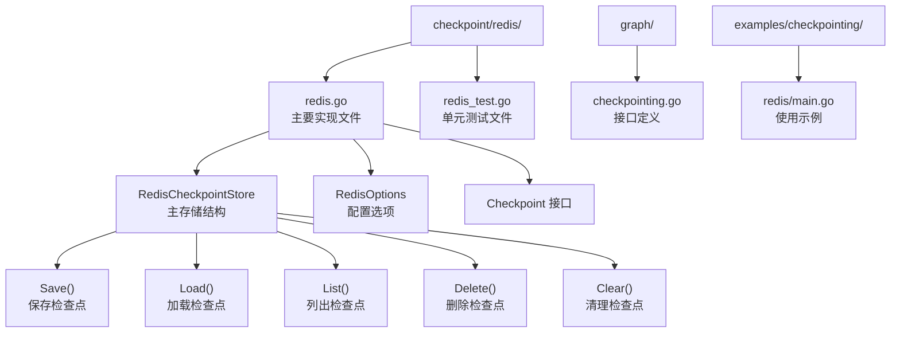
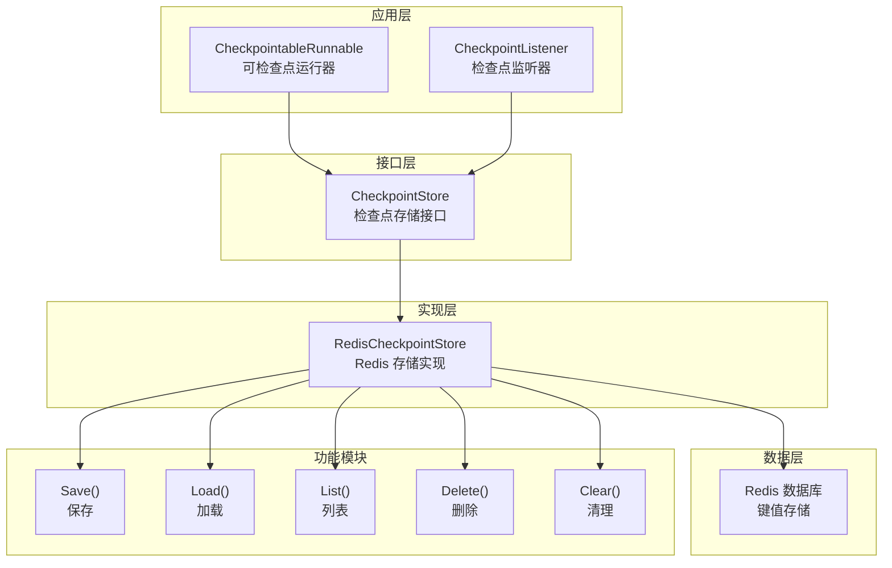
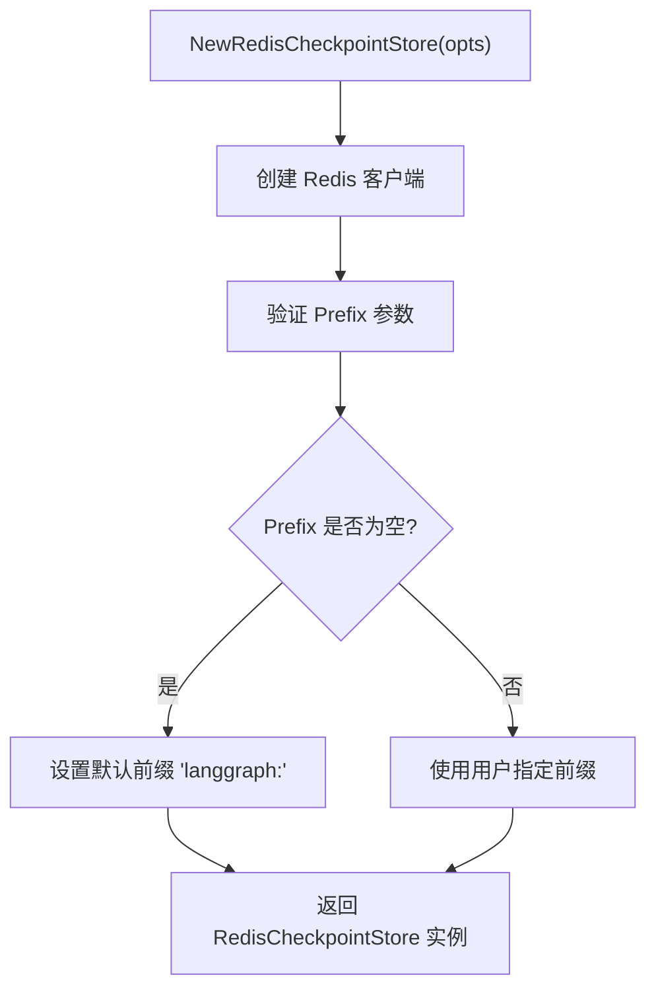
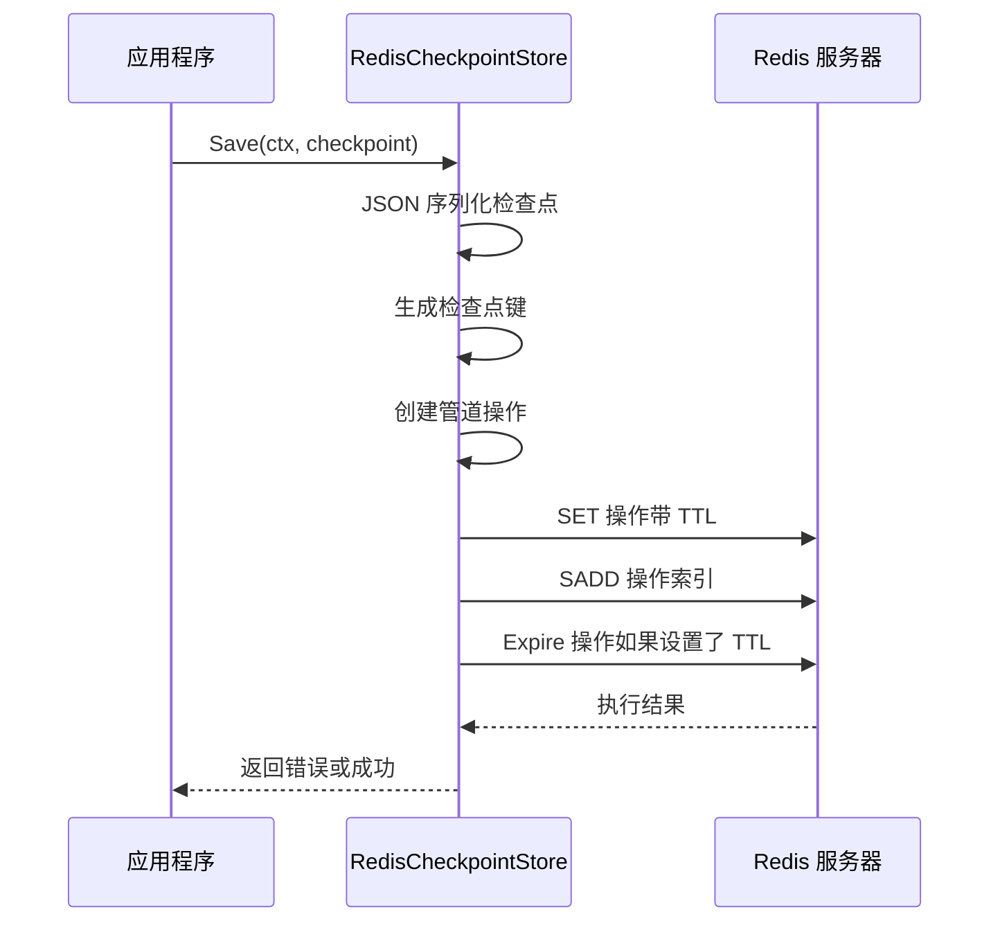
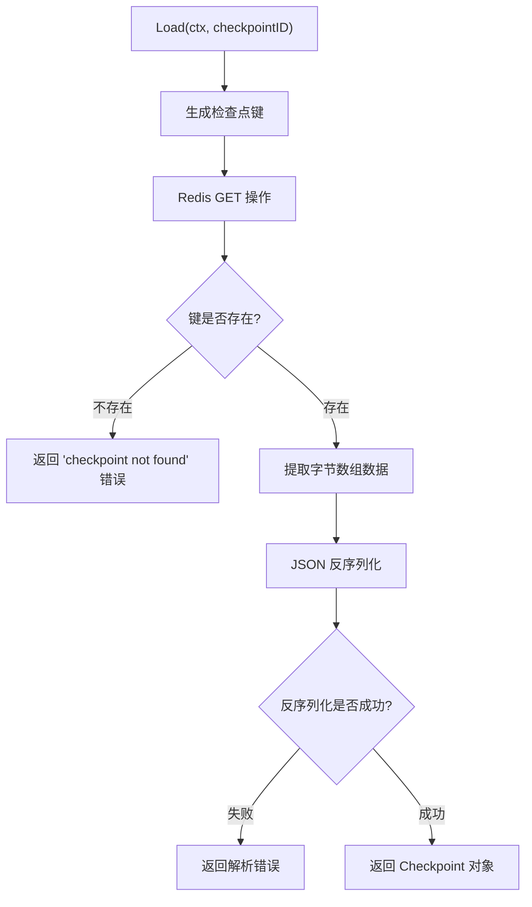
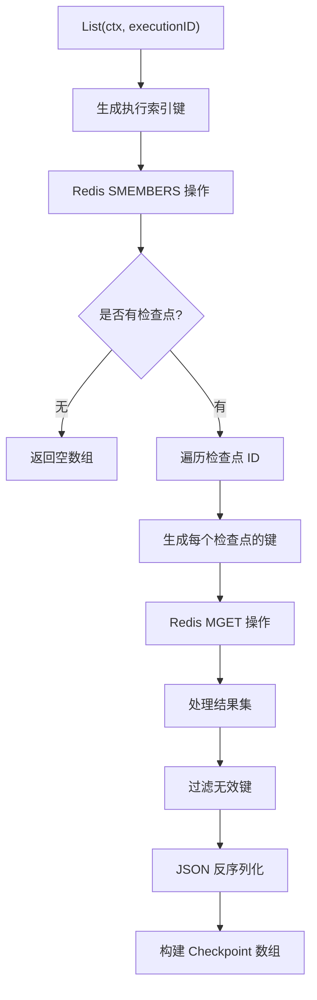
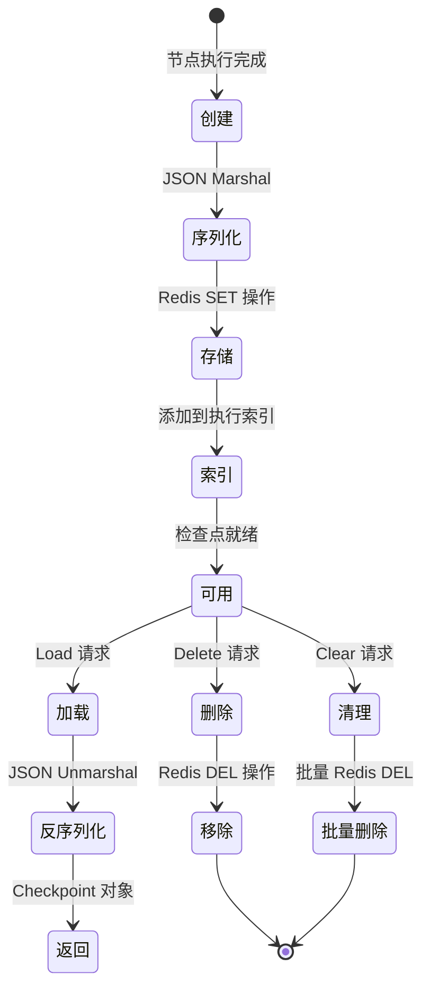
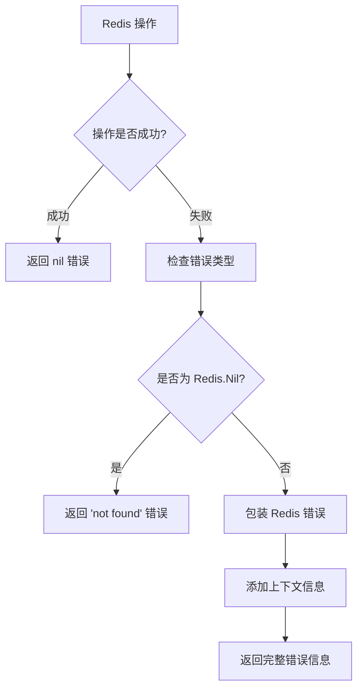

# Redis 检查点存储

<cite>
**本文档中引用的文件**
- [checkpoint/redis/redis.go](file://checkpoint/redis/redis.go)
- [examples/checkpointing/redis/main.go](file://examples/checkpointing/redis/main.go)
- [graph/checkpointing.go](file://graph/checkpointing.go)
- [checkpoint/redis/redis_test.go](file://checkpoint/redis/redis_test.go)
- [graph/retry.go](file://graph/retry.go)
- [graph/retry_test.go](file://graph/retry_test.go)
- [README.md](file://README.md)
</cite>

## 目录
1. [简介](#简介)
2. [项目结构](#项目结构)
3. [核心组件](#核心组件)
4. [架构概览](#架构概览)
5. [详细组件分析](#详细组件分析)
6. [配置参数详解](#配置参数详解)
7. [数据流分析](#数据流分析)
8. [性能考虑](#性能考虑)
9. [故障排除指南](#故障排除指南)
10. [最佳实践](#最佳实践)
11. [总结](#总结)

## 简介

Redis 检查点存储是 LangGraphGo 中用于持久化执行状态的核心组件。它提供了高性能的内存数据库存储解决方案，特别适用于需要低延迟和高吞吐量的分布式系统场景。该实现通过 Redis 的键值存储特性，支持快速的状态读写和临时状态管理，同时具备共享状态和横向扩展能力。

## 项目结构

Redis 检查点存储的实现位于 `checkpoint/redis` 目录下，包含以下关键文件：



**图表来源**
- [checkpoint/redis/redis.go](file://checkpoint/redis/redis.go#L1-L212)
- [graph/checkpointing.go](file://graph/checkpointing.go#L22-L38)

**章节来源**
- [checkpoint/redis/redis.go](file://checkpoint/redis/redis.go#L1-L212)
- [examples/checkpointing/redis/main.go](file://examples/checkpointing/redis/main.go#L1-L145)

## 核心组件

### RedisCheckpointStore 结构体

RedisCheckpointStore 是 Redis 检查点存储的主要实现，包含三个核心字段：

- **client**: Redis 客户端实例，负责与 Redis 服务器通信
- **prefix**: 键前缀，用于命名空间隔离，默认为 "langgraph:"
- **ttl**: 过期时间，控制检查点的生存时间

### RedisOptions 配置结构

RedisOptions 提供了完整的 Redis 连接配置选项：

- **Addr**: Redis 服务器地址，默认为 "localhost:6379"
- **Password**: Redis 认证密码（可选）
- **DB**: 使用的数据库编号，默认为 0
- **Prefix**: 键前缀，支持自定义命名空间
- **TTL**: 检查点过期时间，默认为 0（永不过期）

**章节来源**
- [checkpoint/redis/redis.go](file://checkpoint/redis/redis.go#L13-L27)

## 架构概览

Redis 检查点存储采用分层架构设计，确保了良好的可扩展性和维护性：



**图表来源**
- [graph/checkpointing.go](file://graph/checkpointing.go#L22-L38)
- [checkpoint/redis/redis.go](file://checkpoint/redis/redis.go#L13-L18)

## 详细组件分析

### NewRedisCheckpointStore 函数

这是创建 Redis 检查点存储的工厂函数，负责初始化连接和设置默认值：



**图表来源**
- [checkpoint/redis/redis.go](file://checkpoint/redis/redis.go#L29-L47)

### Save 方法实现

Save 方法实现了检查点的持久化存储，采用管道操作确保原子性：



**图表来源**
- [checkpoint/redis/redis.go](file://checkpoint/redis/redis.go#L58-L83)

### Load 方法实现

Load 方法负责从 Redis 加载特定的检查点：



**图表来源**
- [checkpoint/redis/redis.go](file://checkpoint/redis/redis.go#L86-L102)

### List 方法实现

List 方法支持按执行 ID 查询所有相关的检查点：



**图表来源**
- [checkpoint/redis/redis.go](file://checkpoint/redis/redis.go#L105-L154)

**章节来源**
- [checkpoint/redis/redis.go](file://checkpoint/redis/redis.go#L58-L154)

## 配置参数详解

### 地址（Addr）

Redis 服务器地址是必需的配置参数，格式为 `host:port`。默认值为 `"localhost:6379"`，适用于本地开发环境。

### 键前缀（Prefix）

键前缀用于在 Redis 中创建命名空间，避免键冲突。默认值为 `"langgraph:"`，可以根据不同的应用场景自定义前缀。

### 过期时间（TTL）

TTL 参数控制检查点的生存时间，单位为时间.Duration。默认值为 0，表示检查点永不过期。设置适当的 TTL 值可以自动清理过期的检查点，节省存储空间。

### 其他配置选项

- **Password**: Redis 认证密码，用于需要身份验证的 Redis 实例
- **DB**: 使用的数据库编号，默认为 0

**章节来源**
- [checkpoint/redis/redis.go](file://checkpoint/redis/redis.go#L20-L27)

## 数据流分析

### 检查点生命周期



### 键命名策略

Redis 检查点存储使用层次化的键命名策略：

- **检查点键**: `{prefix}checkpoint:{checkpointID}`
- **执行索引键**: `{prefix}execution:{executionID}:checkpoints`

这种命名策略确保了：
- 命名空间隔离：不同应用使用不同的前缀
- 类型区分：检查点和索引使用不同的键模式
- 执行跟踪：通过执行 ID 快速定位相关检查点

**章节来源**
- [checkpoint/redis/redis.go](file://checkpoint/redis/redis.go#L49-L55)

## 性能考虑

### 内存优化

Redis 检查点存储利用 Redis 的内存特性实现高性能访问：

- **零拷贝读取**: 直接从 Redis 内存读取数据，避免磁盘 I/O
- **批量操作**: 使用管道操作减少网络往返
- **TTL 自动清理**: 利用 Redis 的过期机制自动清理过期数据

### 并发处理

- **线程安全**: Redis 本身是线程安全的，支持高并发访问
- **非阻塞操作**: 异步处理检查点操作，不影响主业务流程
- **连接池**: go-redis 客户端内置连接池，优化连接管理

### 网络优化

- **管道操作**: 将多个 Redis 操作打包发送，减少网络延迟
- **压缩传输**: Redis 支持数据压缩，减少网络带宽使用
- **持久连接**: 维持长连接，避免频繁的连接建立和断开

## 故障排除指南

### 常见问题及解决方案

#### Redis 连接失败

**症状**: 执行失败，提示 Redis 连接错误

**原因**: Redis 服务不可用或网络连接问题

**解决方案**:
1. 检查 Redis 服务状态：`redis-cli ping`
2. 验证网络连接：`telnet redis-host 6379`
3. 检查防火墙设置
4. 验证认证凭据

#### 检查点加载失败

**症状**: Load 操作返回 "checkpoint not found" 错误

**原因**: 检查点可能已被 TTL 自动删除或键被手动删除

**解决方案**:
1. 检查 Redis 中是否存在对应的键
2. 验证 TTL 设置是否过短
3. 检查键前缀配置是否正确

#### JSON 序列化错误

**症状**: 反序列化失败，提示 JSON 格式错误

**原因**: 检查点数据损坏或版本不兼容

**解决方案**:
1. 检查数据完整性
2. 验证 Go 结构体与 JSON 字段的映射关系
3. 考虑添加数据校验机制

### 错误处理策略

Redis 检查点存储实现了完善的错误处理机制：



**图表来源**
- [checkpoint/redis/redis.go](file://checkpoint/redis/redis.go#L89-L95)

**章节来源**
- [checkpoint/redis/redis.go](file://checkpoint/redis/redis.go#L86-L102)

## 最佳实践

### 配置建议

1. **生产环境配置**:
   ```go
   store := redis.NewRedisCheckpointStore(redis.RedisOptions{
       Addr:     "redis-cluster:6379",
       Password: os.Getenv("REDIS_PASSWORD"),
       DB:       0,
       Prefix:   "production_app:",
       TTL:      24 * time.Hour,
   })
   ```

2. **开发环境配置**:
   ```go
   store := redis.NewRedisCheckpointStore(redis.RedisOptions{
       Addr:   "localhost:6379",
       Prefix: "dev_app:",
   })
   ```

### 错误处理和重试

虽然 Redis 检查点存储本身不包含重试逻辑，但可以通过组合使用 LangGraphGo 的重试机制来增强可靠性：

```go
// 在节点中添加重试逻辑
g.AddNodeWithRetry("process", processFunc, &graph.RetryConfig{
    MaxAttempts:   3,
    InitialDelay:  100 * time.Millisecond,
    BackoffFactor: 2.0,
})
```

### 监控和健康检查

建议实现以下监控指标：

- **连接状态**: Redis 连接可用性
- **响应时间**: 检查点操作的平均响应时间
- **错误率**: 各类错误的发生频率
- **存储使用**: Redis 内存使用情况

### 数据备份和恢复

1. **定期备份**: 使用 Redis 的 RDB 或 AOF 备份机制
2. **跨区域复制**: 配置 Redis 主从复制或多数据中心部署
3. **检查点迁移**: 支持在不同 Redis 实例间迁移检查点数据

**章节来源**
- [examples/checkpointing/redis/main.go](file://examples/checkpointing/redis/main.go#L32-L44)
- [graph/retry.go](file://graph/retry.go#L11-L18)

## 总结

Redis 检查点存储为 LangGraphGo 提供了高性能、可靠的执行状态持久化解决方案。其主要优势包括：

1. **高性能**: 利用 Redis 内存存储特性，实现毫秒级的读写速度
2. **高可用**: 支持集群部署和故障转移
3. **易扩展**: 通过键前缀实现多租户隔离
4. **功能丰富**: 支持 TTL 自动清理、批量操作等高级特性

在实际使用中，建议根据具体场景选择合适的配置参数，并结合适当的错误处理和监控机制，以确保系统的稳定性和可靠性。对于关键业务场景，可以考虑结合其他存储后端（如 PostgreSQL 或 SQLite）实现混合存储策略，进一步提高系统的容错能力。