# 基础内存管理

<cite>
**本文档中引用的文件**
- [examples/memory_basic/main.go](file://examples/memory_basic/main.go)
- [examples/memory_chatbot/main.go](file://examples/memory_chatbot/main.go)
- [prebuilt/langchain_memory_adapter.go](file://prebuilt/langchain_memory_adapter.go)
- [examples/memory_basic/README_CN.md](file://examples/memory_basic/README_CN.md)
- [examples/memory_chatbot/README_CN.md](file://examples/memory_chatbot/README_CN.md)
- [examples/memory_basic/README.md](file://examples/memory_basic/README.md)
- [examples/memory_chatbot/README.md](file://examples/memory_chatbot/README.md)
- [prebuilt/langchain_memory_adapter_test.go](file://prebuilt/langchain_memory_adapter_test.go)
- [examples/memory_chatbot/main.go](file://examples/memory_chatbot/main.go#L125-L186)
</cite>

## 目录
1. [简介](#简介)
2. [项目结构概览](#项目结构概览)
3. [核心内存类型](#核心内存类型)
4. [架构概览](#架构概览)
5. [详细组件分析](#详细组件分析)
6. [配置选项详解](#配置选项详解)
7. [实际应用场景](#实际应用场景)
8. [内存持久化策略](#内存持久化策略)
9. [最佳实践指南](#最佳实践指南)
10. [故障排除](#故障排除)
11. [总结](#总结)

## 简介

LangGraphGo 的内存管理机制是构建智能对话系统的核心组件，它允许在多次交互中维护对话上下文，使聊天机器人能够记住用户信息、引用对话历史并提供连贯的响应。本文档全面介绍了基于 LangChain 的内存管理系统，包括多种内存类型、配置选项和实际应用模式。

该系统通过 `Memory` 接口提供了统一的抽象层，支持与 LangChain 兼容的各种内存实现，包括 ConversationBuffer、ConversationWindowBuffer 和 ConversationTokenBuffer 等。

## 项目结构概览

LangGraphGo 的内存管理功能主要分布在以下几个关键模块中：

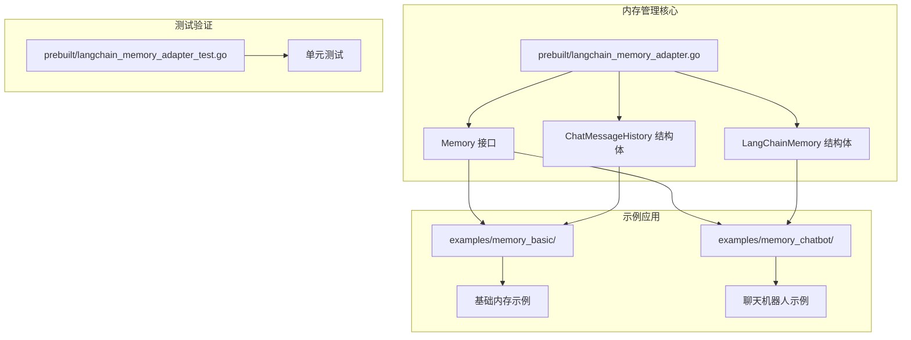

**图表来源**
- [prebuilt/langchain_memory_adapter.go](file://prebuilt/langchain_memory_adapter.go#L1-L145)
- [examples/memory_basic/main.go](file://examples/memory_basic/main.go#L1-L266)
- [examples/memory_chatbot/main.go](file://examples/memory_chatbot/main.go#L1-L186)

**章节来源**
- [prebuilt/langchain_memory_adapter.go](file://prebuilt/langchain_memory_adapter.go#L1-L145)
- [examples/memory_basic/main.go](file://examples/memory_basic/main.go#L1-L266)

## 核心内存类型

LangGraphGo 提供了三种主要的内存类型，每种都针对不同的使用场景进行了优化：

### ConversationBufferMemory

**特点**: 存储完整的对话历史，适用于需要完整上下文的短对话场景。

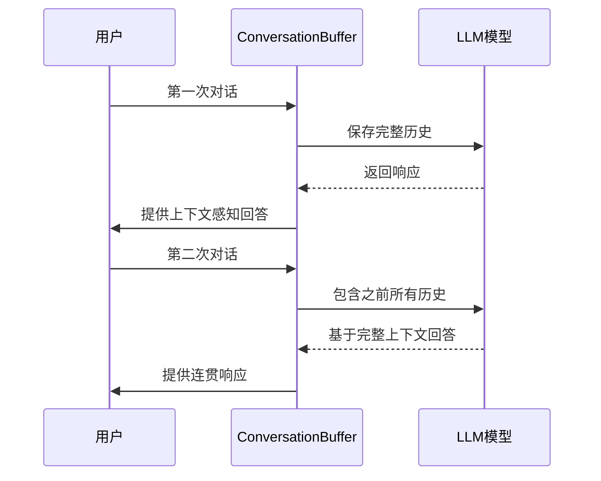

**图表来源**
- [examples/memory_basic/main.go](file://examples/memory_basic/main.go#L38-L78)
- [examples/memory_chatbot/main.go](file://examples/memory_chatbot/main.go#L37-L47)

### ConversationWindowBufferMemory

**特点**: 仅保留最后 N 轮对话，适用于长对话场景，有效控制内存使用。

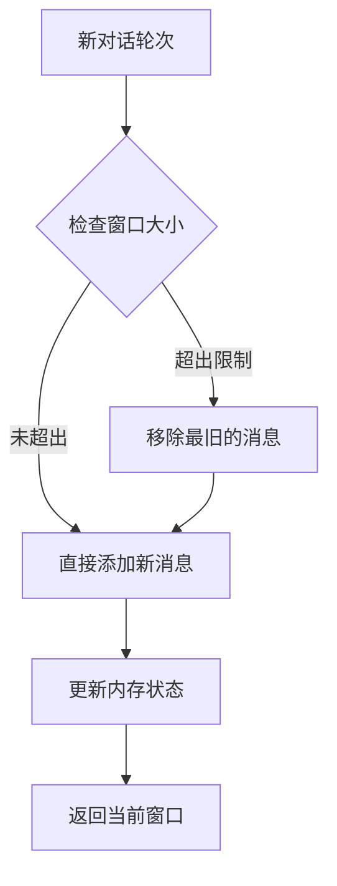

**图表来源**
- [examples/memory_basic/main.go](file://examples/memory_basic/main.go#L81-L121)

### ChatMessageHistory

**特点**: 直接的消息历史管理，提供灵活的消息操作能力。

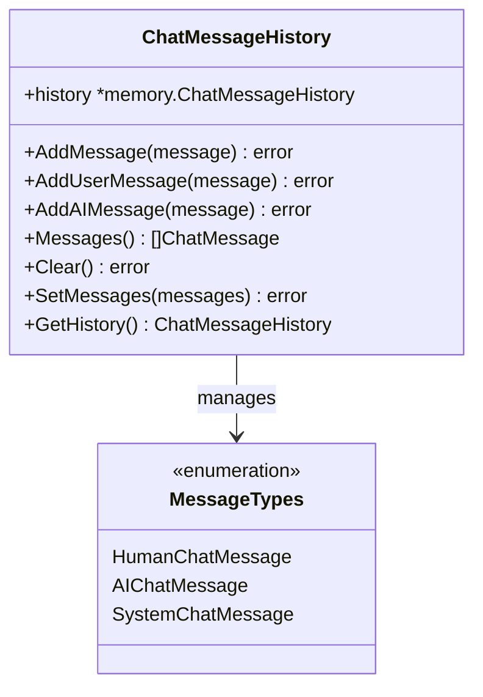

**图表来源**
- [prebuilt/langchain_memory_adapter.go](file://prebuilt/langchain_memory_adapter.go#L99-L144)

**章节来源**
- [examples/memory_basic/main.go](file://examples/memory_basic/main.go#L38-L121)
- [examples/memory_chatbot/main.go](file://examples/memory_chatbot/main.go#L37-L47)
- [prebuilt/langchain_memory_adapter.go](file://prebuilt/langchain_memory_adapter.go#L37-L144)

## 架构概览

LangGraphGo 的内存管理系统采用分层架构设计，提供了清晰的抽象和灵活的扩展能力：

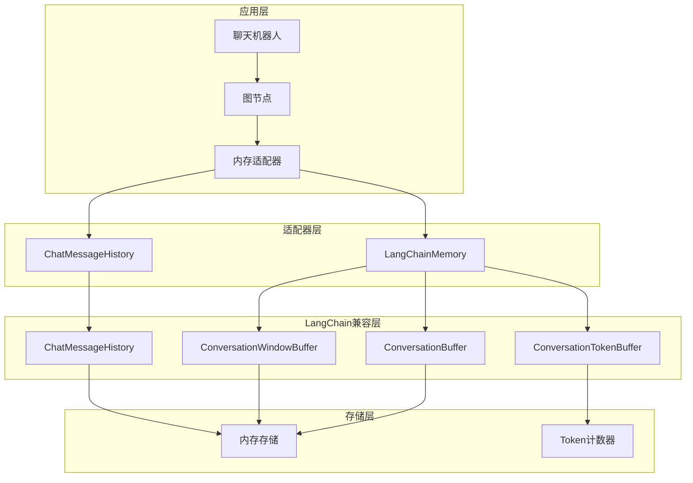

**图表来源**
- [prebuilt/langchain_memory_adapter.go](file://prebuilt/langchain_memory_adapter.go#L12-L145)
- [examples/memory_basic/main.go](file://examples/memory_basic/main.go#L201-L256)

## 详细组件分析

### Memory 接口设计

Memory 接口定义了内存管理的核心操作，确保了不同内存实现之间的一致性：

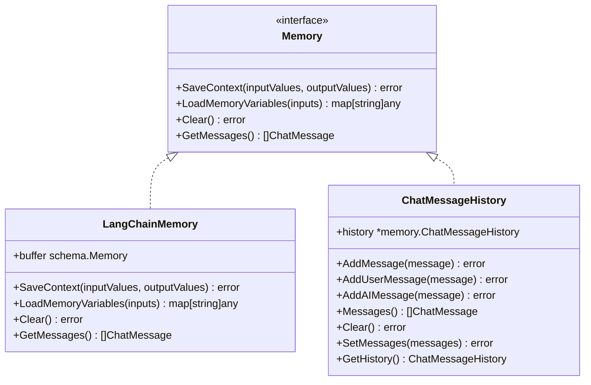

**图表来源**
- [prebuilt/langchain_memory_adapter.go](file://prebuilt/langchain_memory_adapter.go#L11-L21)
- [prebuilt/langchain_memory_adapter.go](file://prebuilt/langchain_memory_adapter.go#L24-L144)

### LangChainMemory 实现

LangChainMemory 是核心的内存适配器，负责将 LangChain 的内存实现桥接到 LangGraphGo 的接口：

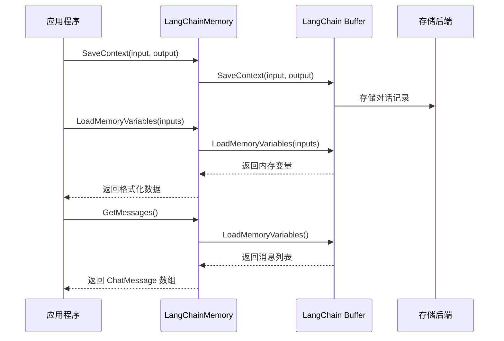

**图表来源**
- [prebuilt/langchain_memory_adapter.go](file://prebuilt/langchain_memory_adapter.go#L59-L96)

### 图节点中的内存使用模式

在 LangGraphGo 的图节点中，内存的典型使用流程如下：

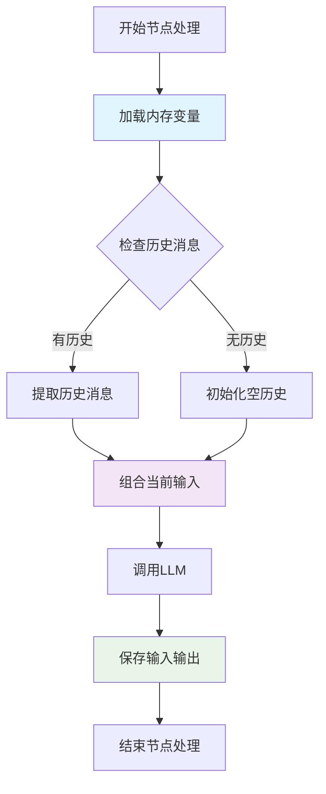

**图表来源**
- [examples/memory_basic/main.go](file://examples/memory_basic/main.go#L223-L243)
- [examples/memory_chatbot/main.go](file://examples/memory_chatbot/main.go#L76-L100)

**章节来源**
- [prebuilt/langchain_memory_adapter.go](file://prebuilt/langchain_memory_adapter.go#L11-L145)
- [examples/memory_basic/main.go](file://examples/memory_basic/main.go#L201-L256)

## 配置选项详解

### memory.WithReturnMessages

**作用**: 控制内存是否返回消息对象而非字符串形式的历史记录。

```go
// 启用消息返回（推荐）
mem := prebuilt.NewConversationBufferMemory(
    memory.WithReturnMessages(true),
)

// 禁用消息返回（字符串形式）
mem := prebuilt.NewConversationBufferMemory(
    memory.WithReturnMessages(false),
)
```

当启用 `WithReturnMessages(true)` 时，`LoadMemoryVariables()` 返回的是 `[]llms.ChatMessage` 类型的消息数组，便于直接用于 LLM 调用。

### 自定义键配置

LangGraphGo 支持完全自定义的内存键，适应不同的数据结构需求：

| 配置选项 | 默认值 | 作用 | 使用场景 |
|---------|--------|------|----------|
| WithInputKey | "input" | 输入键名 | 自定义输入字段 |
| WithOutputKey | "output" | 输出键名 | 自定义输出字段 |
| WithMemoryKey | "history" | 内存键名 | 自定义内存存储键 |
| WithHumanPrefix | "Human" | 人类消息前缀 | 自定义人类消息标识 |
| WithAIPrefix | "AI" | AI消息前缀 | 自定义AI消息标识 |

### 与其他 LangChain 选项的兼容性

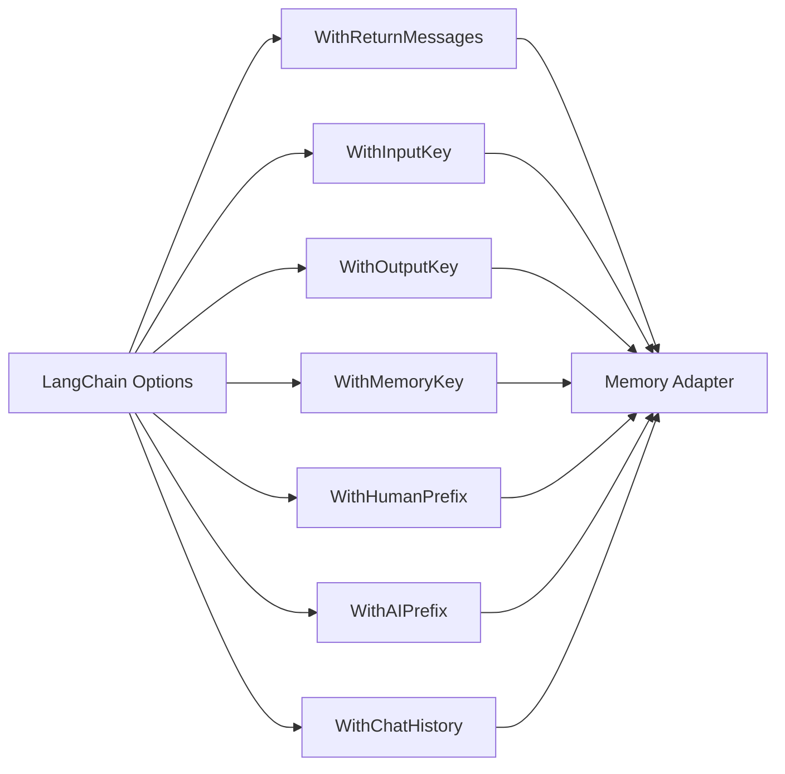

**图表来源**
- [examples/memory_basic/main.go](file://examples/memory_basic/main.go#L160-L169)
- [prebuilt/langchain_memory_adapter_test.go](file://prebuilt/langchain_memory_adapter_test.go#L171-L200)

**章节来源**
- [examples/memory_basic/main.go](file://examples/memory_basic/main.go#L160-L169)
- [examples/memory_chatbot/main.go](file://examples/memory_chatbot/main.go#L134-L136)
- [prebuilt/langchain_memory_adapter_test.go](file://prebuilt/langchain_memory_adapter_test.go#L171-L234)

## 实际应用场景

### 短对话场景 - ConversationBuffer

适用于需要完整上下文的短对话，如客服问答、信息查询等：

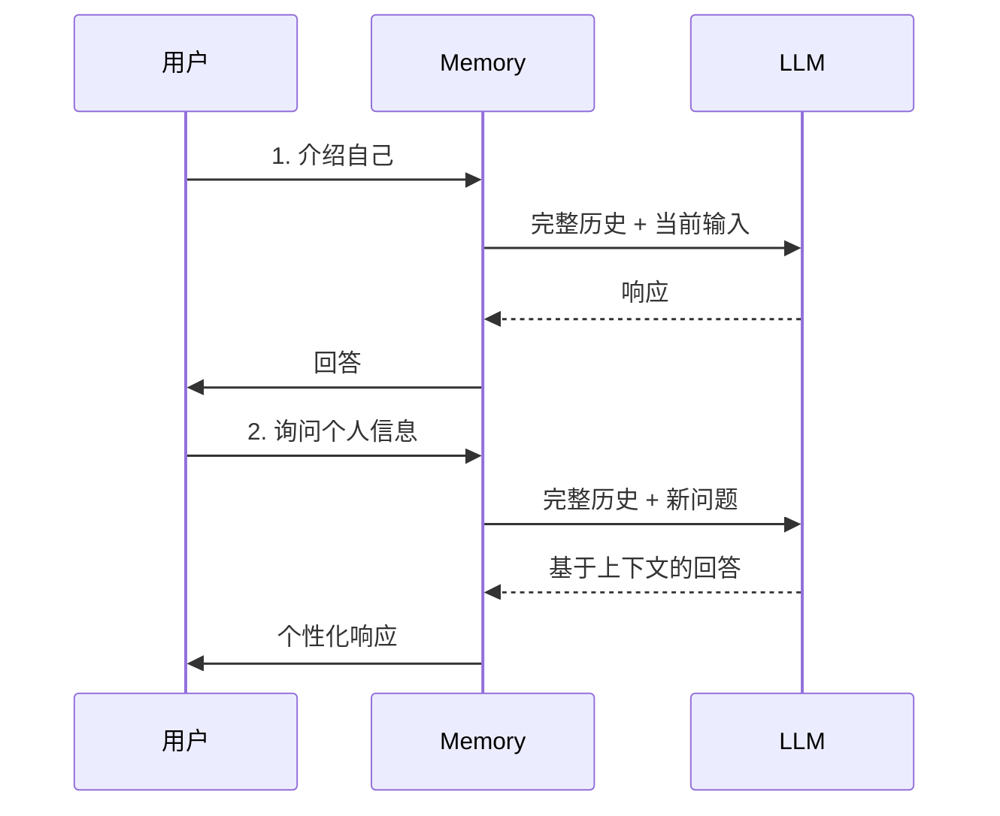

**图表来源**
- [examples/memory_basic/main.go](file://examples/memory_basic/main.go#L38-L78)

### 长对话场景 - ConversationWindowBuffer

适用于长时间对话，如技术支持、教育辅导等：

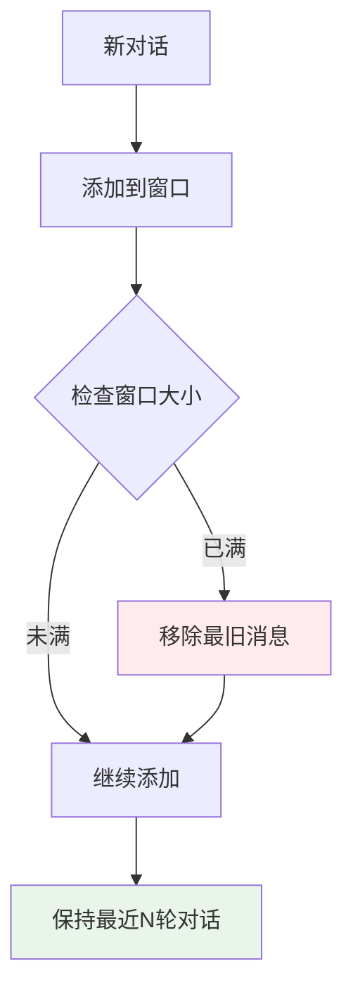

**图表来源**
- [examples/memory_basic/main.go](file://examples/memory_basic/main.go#L81-L121)

### 多轮对话恢复 - Memory Persistence

支持从外部历史重建内存状态：

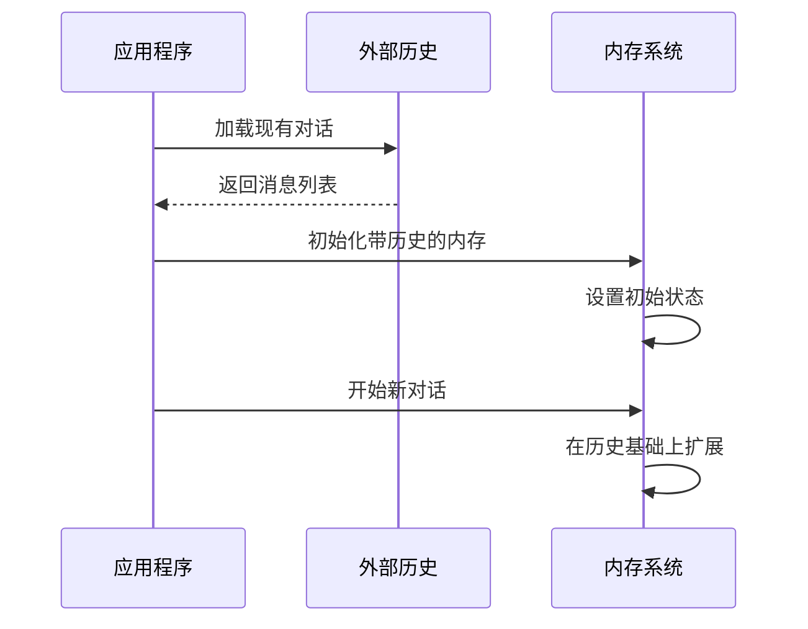

**图表来源**
- [examples/memory_chatbot/main.go](file://examples/memory_chatbot/main.go#L125-L186)

**章节来源**
- [examples/memory_basic/main.go](file://examples/memory_basic/main.go#L38-L121)
- [examples/memory_chatbot/main.go](file://examples/memory_chatbot/main.go#L31-L186)

## 内存持久化策略

### 内存存储 vs 持久化存储

LangGraphGo 支持多种存储后端，满足不同场景的需求：

| 存储类型 | 特点 | 适用场景 | 性能 |
|---------|------|----------|------|
| 内存存储 | 临时、快速 | 测试、开发 | 最快 |
| 文件存储 | 基于文件 | 桌面应用 | 快 |
| SQLite | 轻量级数据库 | 简单部署 | 中等 |
| PostgreSQL | 关系型数据库 | 生产环境 | 快 |
| Redis | 内存数据库 | 高性能要求 | 最快 |

### 跨会话恢复模式

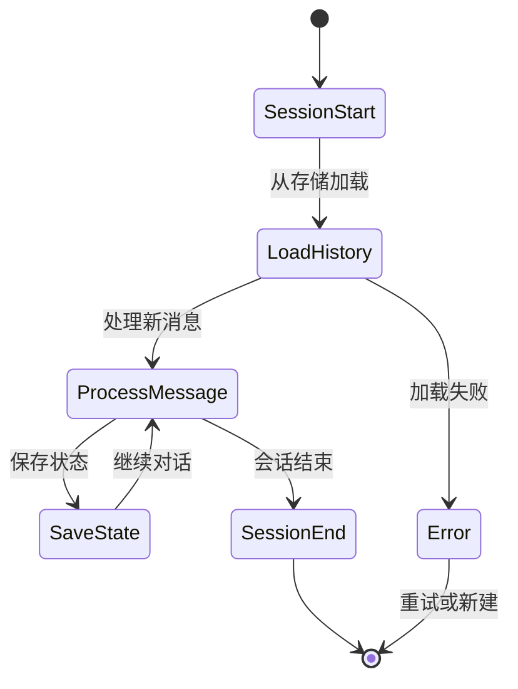

### 实现持久化的代码模式

```go
// 基于文件的持久化示例
type PersistentMemory struct {
    filePath string
    memory   *prebuilt.LangChainMemory
}

func (pm *PersistentMemory) SaveState() error {
    messages, err := pm.memory.GetMessages(context.Background())
    if err != nil {
        return err
    }
    // 序列化并保存到文件
    return saveToJSON(pm.filePath, messages)
}

func (pm *PersistentMemory) LoadState() error {
    var messages []llms.ChatMessage
    if err := loadFromJSON(pm.filePath, &messages); err == nil {
        // 从历史重建内存
        history := prebuilt.NewChatMessageHistory()
        for _, msg := range messages {
            history.AddMessage(context.Background(), msg)
        }
        pm.memory = prebuilt.NewConversationBufferMemory(
            memory.WithChatHistory(history.GetHistory()),
        )
    }
    return nil
}
```

**章节来源**
- [examples/memory_chatbot/main.go](file://examples/memory_chatbot/main.go#L125-L186)
- [examples/durable_execution/main.go](file://examples/durable_execution/main.go#L16-L59)

## 最佳实践指南

### 内存类型选择指南

根据具体需求选择合适的内存类型：

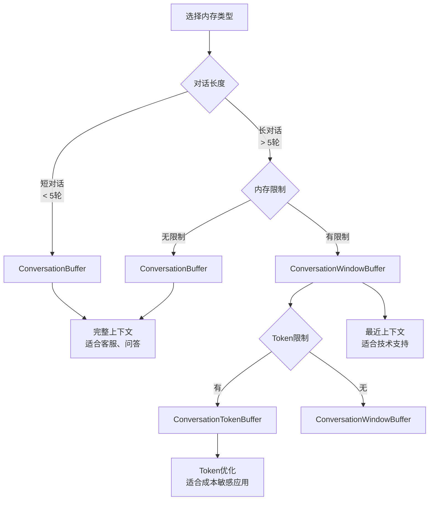

### 性能优化建议

1. **合理设置窗口大小**: 根据对话复杂度调整 `ConversationWindowBuffer` 的大小
2. **及时清理无用历史**: 定期清理过期的对话历史
3. **选择合适的存储后端**: 根据并发需求选择内存或持久化存储
4. **批量处理**: 对于大量消息，考虑批量加载和保存

### 错误处理模式

```go
func safeMemoryOperation(memory Memory, operation func() error) error {
    ctx := context.Background()
    
    // 操作前备份
    originalMessages, _ := memory.GetMessages(ctx)
    
    // 执行操作
    err := operation()
    if err != nil {
        // 回滚到原始状态
        memory.Clear(ctx)
        for _, msg := range originalMessages {
            memory.SaveContext(ctx, map[string]any{"input": msg.GetContent()}, 
                              map[string]any{"output": ""})
        }
        return err
    }
    
    return nil
}
```

### 安全考虑

1. **敏感信息过滤**: 在保存到内存前过滤敏感信息
2. **访问控制**: 实现适当的内存访问权限控制
3. **数据加密**: 对持久化存储的数据进行加密

## 故障排除

### 常见问题及解决方案

| 问题 | 可能原因 | 解决方案 |
|------|----------|----------|
| 内存丢失 | 程序重启导致内存清空 | 实现持久化存储 |
| 上下文混乱 | 多用户共享同一内存 | 为每个用户分配独立内存 |
| 性能下降 | 历史记录过多 | 使用窗口缓冲或定期清理 |
| 消息格式错误 | 键名不匹配 | 检查 WithInputKey/WithOutputKey 配置 |

### 调试技巧

```go
// 内存状态调试
func debugMemoryState(memory Memory) {
    ctx := context.Background()
    
    // 检查内存变量
    vars, err := memory.LoadMemoryVariables(ctx, map[string]any{})
    if err != nil {
        log.Printf("内存变量加载失败: %v", err)
        return
    }
    
    // 检查消息数量
    messages, err := memory.GetMessages(ctx)
    if err != nil {
        log.Printf("消息获取失败: %v", err)
        return
    }
    
    log.Printf("内存状态: %d 个变量, %d 条消息", len(vars), len(messages))
    
    // 打印关键变量
    for key, value := range vars {
        log.Printf("变量 %s: %v", key, value)
    }
}
```

### 性能监控

```go
type MemoryMetrics struct {
    TotalMessages      int
    AverageMessageSize float64
    MemoryUsage        float64
    OperationCount     int
}

func monitorMemoryPerformance(memory Memory) MemoryMetrics {
    ctx := context.Background()
    
    messages, _ := memory.GetMessages(ctx)
    totalSize := 0
    
    for _, msg := range messages {
        totalSize += len(msg.GetContent())
    }
    
    return MemoryMetrics{
        TotalMessages:      len(messages),
        AverageMessageSize: float64(totalSize) / float64(len(messages)),
        MemoryUsage:        calculateMemoryUsage(messages),
        OperationCount:     incrementOperationCounter(),
    }
}
```

**章节来源**
- [examples/memory_basic/main.go](file://examples/memory_basic/main.go#L258-L266)
- [prebuilt/langchain_memory_adapter_test.go](file://prebuilt/langchain_memory_adapter_test.go#L13-L49)

## 总结

LangGraphGo 的内存管理机制提供了强大而灵活的对话上下文管理能力。通过统一的 Memory 接口和丰富的配置选项，开发者可以根据具体需求选择合适的内存类型和配置策略。

### 核心优势

1. **统一抽象**: 通过 Memory 接口提供一致的使用体验
2. **多样化选择**: 支持多种内存类型以适应不同场景
3. **LangChain兼容**: 完全兼容 LangChain 的内存实现
4. **灵活配置**: 丰富的配置选项满足定制需求
5. **可扩展性**: 易于扩展和集成到现有系统

### 适用场景

- **客服系统**: 使用 ConversationBuffer 维护完整对话历史
- **技术支持**: 使用 ConversationWindowBuffer 控制内存使用
- **教育应用**: 使用 ConversationTokenBuffer 优化成本
- **多轮对话**: 使用持久化存储支持跨会话恢复

### 发展方向

随着 AI 技术的发展，内存管理机制将继续演进，可能的方向包括：

- 更智能的上下文压缩算法
- 多模态对话支持
- 分布式内存共享
- 更高级的隐私保护机制

通过深入理解和正确使用这些内存管理功能，开发者可以构建出更加智能和人性化的对话系统。