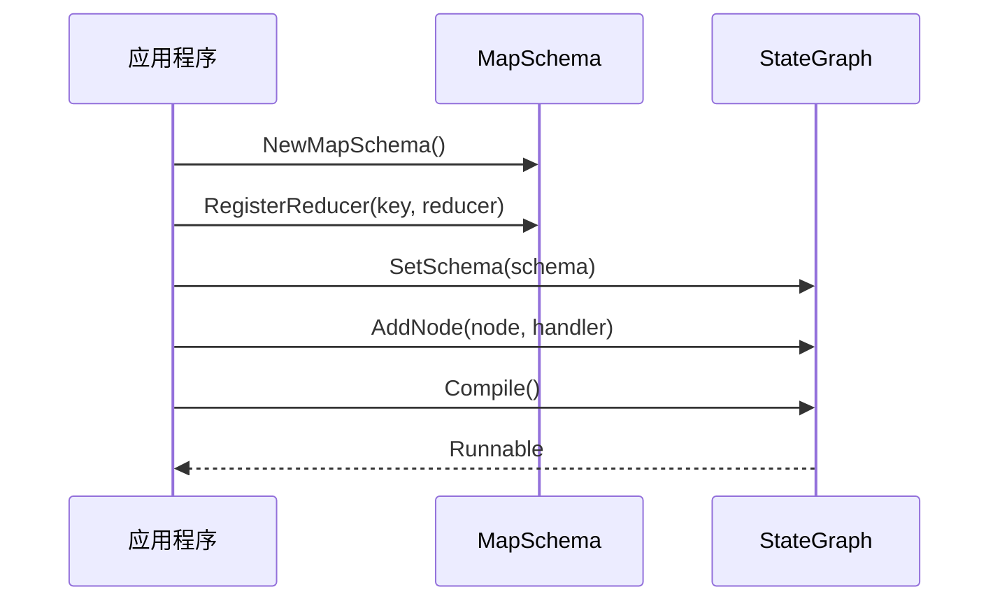

# 自定义 Reducer

<cite>
**本文档中引用的文件**
- [examples/custom_reducer/main.go](file://examples/custom_reducer/main.go)
- [examples/custom_reducer/README.md](file://examples/custom_reducer/README.md)
- [examples/state_schema/main.go](file://examples/state_schema/main.go)
- [examples/state_schema/README.md](file://examples/state_schema/README.md)
- [graph/schema.go](file://graph/schema.go)
- [graph/schema_test.go](file://graph/schema_test.go)
</cite>

## 目录
1. [简介](#简介)
2. [Reducer 函数签名](#reducer-函数签名)
3. [SetReducer 实现分析](#setreducer-实现分析)
4. [常见内置 Reducer](#常见内置-reducer)
5. [自定义 Reducer 开发指南](#自定义-reducer-开发指南)
6. [Reducer 注册与使用](#reducer-注册与使用)
7. [性能考量与最佳实践](#性能考量与最佳实践)
8. [错误处理最佳实践](#错误处理最佳实践)
9. [实际应用案例](#实际应用案例)
10. [总结](#总结)

## 简介

在 LangGraphGo 中，Reducer 是一种核心机制，用于定义如何将节点返回的状态更新合并到全局状态中。通过自定义 Reducer，开发者可以实现复杂的业务逻辑，如去重合并、数值累加、最大值更新等操作。

Reducer 函数的核心作用是：
- **状态合并策略**：定义不同数据类型的合并方式
- **业务逻辑实现**：将特定的业务规则转化为代码逻辑
- **类型安全保证**：确保类型转换的安全性
- **错误处理机制**：提供优雅的错误处理能力

## Reducer 函数签名

Reducer 函数具有统一的签名形式：

```go
type Reducer func(current, new interface{}) (interface{}, error)
```

### 参数说明

- **current**: 当前状态值，可能是 nil 或者特定类型的值
- **new**: 新的状态更新值，始终是非 nil 的值
- **返回值**: 合并后的状态值和可能的错误

### 签名设计的优势

1. **通用性**: 使用 `interface{}` 类型支持任意数据类型
2. **灵活性**: 允许实现复杂的合并逻辑
3. **错误处理**: 明确的错误返回机制
4. **空值处理**: 支持 current 为 nil 的情况

**节来源**
- [graph/schema.go](file://graph/schema.go#L8-L10)

## SetReducer 实现分析

SetReducer 是一个典型的自定义 Reducer 实现，用于合并字符串切片并去除重复项。

### 需求分析

原始需求：需要一个 Reducer 函数能够：
- 接收两个字符串切片或单个字符串
- 合并所有唯一值
- 返回去重后的字符串切片
- 处理各种输入类型组合

### 实现架构

```mermaid
flowchart TD
Start([开始 SetReducer]) --> CheckCurrent{current 是否为 nil?}
CheckCurrent --> |是| InitEmpty[初始化空集合]
CheckCurrent --> |否| ParseCurrent[解析 current 值]
ParseCurrent --> CurrentOK{current 是 []string?}
CurrentOK --> |是| AddToSet[添加到集合]
CurrentOK --> |否| SkipCurrent[跳过 current]
AddToSet --> CheckNew{new 是什么类型?}
SkipCurrent --> CheckNew
CheckNew --> |[]string| AddNewStrings[添加新字符串切片]
CheckNew --> |string| AddNewString[添加单个字符串]
CheckNew --> |其他| TypeError[类型错误]
AddNewStrings --> ConvertBack[转换回切片]
AddNewString --> ConvertBack
ConvertBack --> ReturnResult[返回结果]
InitEmpty --> CheckNew
TypeError --> ReturnError[返回错误]
```

**图表来源**
- [examples/custom_reducer/main.go](file://examples/custom_reducer/main.go#L13-L41)

### 核心实现步骤

1. **初始化集合**: 使用 map[string]bool 创建去重集合
2. **处理当前状态**: 如果 current 不为 nil，解析并添加到集合
3. **合并新值**: 根据新值类型进行相应处理
4. **转换结果**: 将集合转换回字符串切片
5. **返回结果**: 返回合并后的结果和错误信息

### 类型处理策略

SetReducer 展示了优雅的类型处理方式：

- **类型断言**: 使用 `current.([]string)` 和 `new.([]string)` 进行类型检查
- **默认处理**: 对于单个字符串直接添加到集合
- **错误检测**: 通过布尔值确认类型断言成功

**节来源**
- [examples/custom_reducer/main.go](file://examples/custom_reducer/main.go#L13-L41)

## 常见内置 Reducer

LangGraphGo 提供了几种常用的内置 Reducer：

### OverwriteReducer

最简单的 Reducer，直接用新值替换旧值：

```go
func OverwriteReducer(current, new interface{}) (interface{}, error) {
    return new, nil
}
```

### AppendReducer

用于追加元素到切片：

```go
func AppendReducer(current, new interface{}) (interface{}, error) {
    // 实现细节参见源码
}
```

这些内置 Reducer 为常见的状态更新场景提供了基础支持。

**节来源**
- [graph/schema.go](file://graph/schema.go#L141-L185)

## 自定义 Reducer 开发指南

### SumReducer 实现

SumReducer 展示了数值累加的实现：

```go
func SumReducer(current, new interface{}) (interface{}, error) {
    if current == nil {
        return new, nil
    }
    c, ok1 := current.(int)
    n, ok2 := new.(int)
    if !ok1 || !ok2 {
        return nil, fmt.Errorf("expected int, got %T and %T", current, new)
    }
    return c + n, nil
}
```

### MaxReducer 实现思路

MaxReducer 用于获取最大值：

```go
func MaxReducer(current, new interface{}) (interface{}, error) {
    if current == nil {
        return new, nil
    }
    c, ok1 := current.(float64)
    n, ok2 := new.(float64)
    if !ok1 || !ok2 {
        return nil, fmt.Errorf("expected float64, got %T and %T", current, new)
    }
    if c > n {
        return c, nil
    }
    return n, nil
}
```

### MinReducer 实现思路

MinReducer 用于获取最小值：

```go
func MinReducer(current, new interface{}) (interface{}, error) {
    if current == nil {
        return new, nil
    }
    c, ok1 := current.(float64)
    n, ok2 := new.(float64)
    if !ok1 || !ok2 {
        return nil, fmt.Errorf("expected float64, got %T and %T", current, new)
    }
    if c < n {
        return c, nil
    }
    return n, nil
}
```

### AverageReducer 实现思路

AverageReducer 用于计算平均值：

```go
func AverageReducer(current, new interface{}) (interface{}, error) {
    // 需要维护计数器和总和
    // 实现复杂度较高，需要额外的状态管理
}
```

## Reducer 注册与使用

### 基本注册流程



**图表来源**
- [examples/custom_reducer/main.go](file://examples/custom_reducer/main.go#L44-L50)
- [examples/state_schema/main.go](file://examples/state_schema/main.go#L28-L40)

### 注册方法详解

1. **RegisterReducer**: 为特定键注册 Reducer
2. **RegisterChannel**: 同时设置 Reducer 和瞬态标志
3. **默认行为**: 未注册的键使用覆盖策略

### 使用示例

```go
// 创建 Schema
schema := graph.NewMapSchema()

// 注册自定义 Reducer
schema.RegisterReducer("tags", SetReducer)
schema.RegisterReducer("count", SumReducer)

// 设置 Schema 到图
g.SetSchema(schema)
```

**节来源**
- [examples/custom_reducer/main.go](file://examples/custom_reducer/main.go#L44-L50)
- [examples/state_schema/main.go](file://examples/state_schema/main.go#L28-L40)

## 性能考量与最佳实践

### 性能优化策略

1. **避免不必要的类型转换**
   - 在循环外部进行类型检查
   - 使用类型断言的布尔值形式

2. **内存分配优化**
   - 预分配切片容量
   - 避免频繁的内存分配

3. **算法复杂度控制**
   - 使用哈希表实现 O(1) 查找
   - 避免嵌套循环

### 内存管理最佳实践

```go
// 优化的 SetReducer 实现
func OptimizedSetReducer(current, new interface{}) (interface{}, error) {
    // 预分配合理的初始容量
    set := make(map[string]bool, 10)
    
    // 类型检查和转换
    if current != nil {
        if currentList, ok := current.([]string); ok {
            for _, item := range currentList {
                set[item] = true
            }
        }
    }
    
    // 合并新值
    switch v := new.(type) {
    case []string:
        for _, item := range v {
            set[item] = true
        }
    case string:
        set[v] = true
    default:
        return nil, fmt.Errorf("unsupported type: %T", new)
    }
    
    // 预分配结果切片
    result := make([]string, 0, len(set))
    for item := range set {
        result = append(result, item)
    }
    
    return result, nil
}
```

## 错误处理最佳实践

### 类型不匹配处理

```go
func RobustReducer(current, new interface{}) (interface{}, error) {
    // 检查类型兼容性
    if current != nil {
        if !isValidType(current) {
            return nil, fmt.Errorf("invalid current type: %T", current)
        }
    }
    
    if !isValidType(new) {
        return nil, fmt.Errorf("invalid new type: %T", new)
    }
    
    // 执行具体逻辑
    return processValues(current, new)
}
```

### 错误信息标准化

```go
func StandardizedReducer(current, new interface{}) (interface{}, error) {
    // 标准化的错误信息格式
    if current == nil && new == nil {
        return nil, fmt.Errorf("both current and new values are nil")
    }
    
    if current != nil && reflect.TypeOf(current) != reflect.TypeOf(new) {
        return nil, fmt.Errorf("type mismatch: expected %T, got %T", current, new)
    }
    
    // 具体实现逻辑
}
```

### 错误恢复机制

```go
func RecoverableReducer(current, new interface{}) (interface{}, error) {
    defer func() {
        if r := recover(); r != nil {
            log.Printf("Reducer panic recovered: %v", r)
        }
    }()
    
    // 可能引发 panic 的操作
    return processValues(current, new)
}
```

**节来源**
- [examples/custom_reducer/main.go](file://examples/custom_reducer/main.go#L13-L41)
- [examples/state_schema/main.go](file://examples/state_schema/main.go#L11-L22)

## 实际应用案例

### 案例1：标签管理系统

使用 SetReducer 实现标签去重：

```go
// 输入: ["go", "langgraph"], ["ai", "agent", "go"]
// 输出: ["go", "langgraph", "ai", "agent"]
```

### 案例2：计数器系统

使用 SumReducer 实现累加计数：

```go
// 输入: 1, 2, 3
// 输出: 6
```

### 案例3：状态机

使用 OverwriteReducer 实现状态切换：

```go
// 输入: "idle", "processing", "completed"
// 输出: "completed"
```

### 案例4：消息聚合

使用 AppendReducer 实现消息历史：

```go
// 输入: ["msg1"], ["msg2"], ["msg3"]
// 输出: ["msg1", "msg2", "msg3"]
```

**节来源**
- [examples/custom_reducer/main.go](file://examples/custom_reducer/main.go#L53-L92)
- [examples/state_schema/main.go](file://examples/state_schema/main.go#L44-L104)

## 总结

自定义 Reducer 是 LangGraphGo 中实现复杂状态管理的核心机制。通过本文档的详细分析，我们可以得出以下关键要点：

### 核心价值

1. **灵活性**: 支持任意复杂的合并逻辑
2. **可扩展性**: 易于添加新的 Reducer 实现
3. **类型安全**: 提供完善的类型检查机制
4. **错误处理**: 标准化的错误处理方式

### 开发建议

1. **遵循统一签名**: 保持 Reducer 函数的一致性
2. **注重性能**: 优化内存使用和算法复杂度
3. **完善错误处理**: 提供清晰的错误信息
4. **充分测试**: 验证各种边界条件

### 最佳实践

- 使用类型断言的布尔值形式进行类型检查
- 预分配合理的内存容量
- 提供清晰的错误信息
- 考虑并发安全性
- 编写全面的单元测试

通过合理使用自定义 Reducer，开发者可以构建出功能强大且易于维护的状态管理系统，满足各种复杂的业务需求。