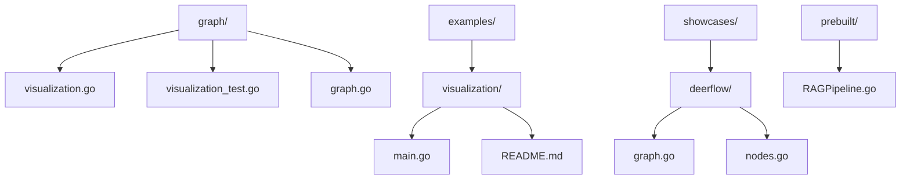
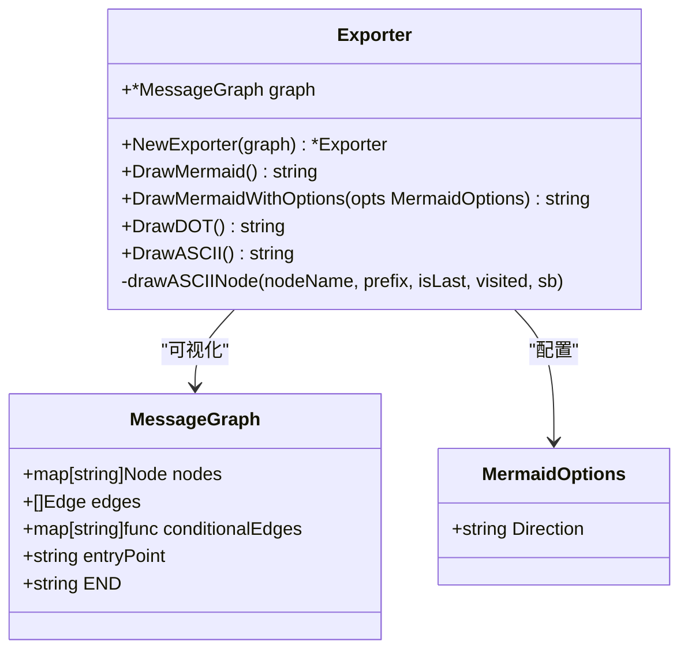
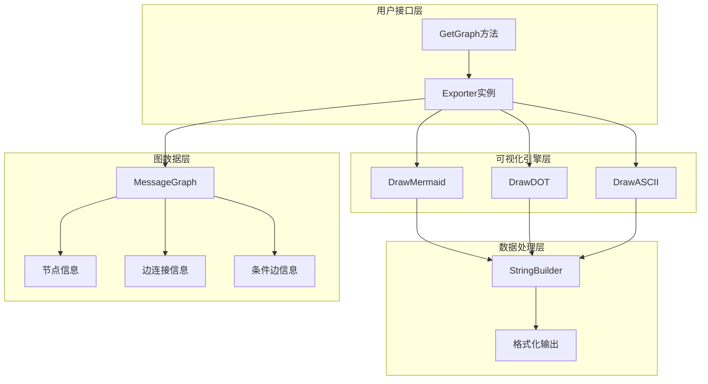
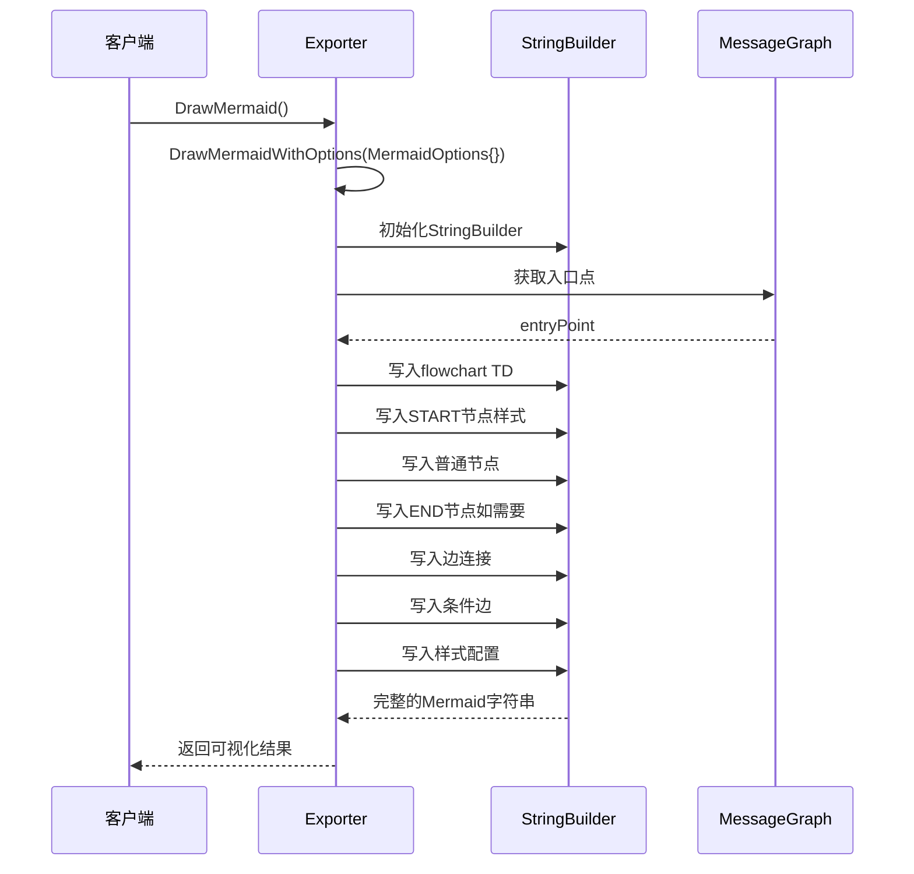
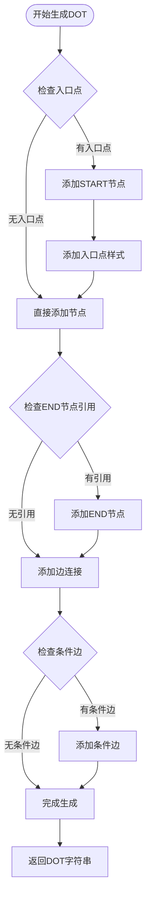
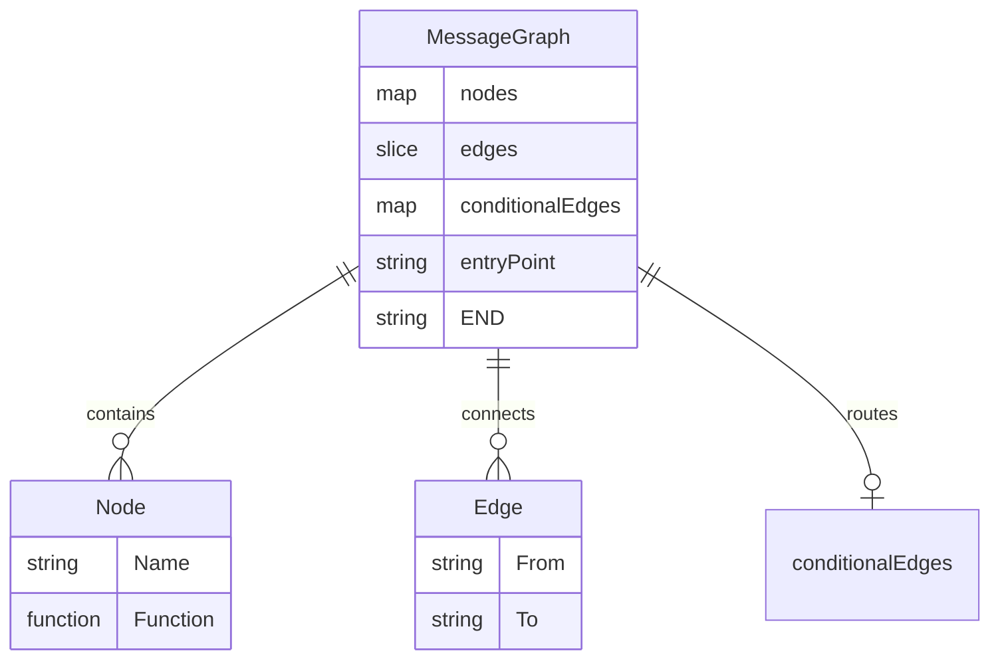
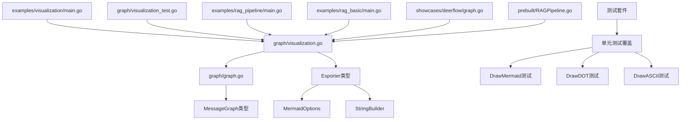

# 图结构可视化

<cite>
**本文档中引用的文件**
- [graph/visualization.go](file://graph/visualization.go)
- [examples/visualization/main.go](file://examples/visualization/main.go)
- [examples/visualization/README.md](file://examples/visualization/README.md)
- [graph/visualization_test.go](file://graph/visualization_test.go)
- [graph/graph.go](file://graph/graph.go)
- [examples/rag_pipeline/main.go](file://examples/rag_pipeline/main.go)
- [examples/rag_basic/main.go](file://examples/rag_basic/main.go)
</cite>

## 目录
1. [简介](#简介)
2. [项目结构](#项目结构)
3. [核心组件](#核心组件)
4. [架构概览](#架构概览)
5. [详细组件分析](#详细组件分析)
6. [依赖关系分析](#依赖关系分析)
7. [性能考虑](#性能考虑)
8. [故障排除指南](#故障排除指南)
9. [结论](#结论)

## 简介

LangGraphGo 的图结构可视化功能提供了强大的工具来理解和展示复杂的工作流拓扑结构。该系统通过 `graph/visualization.go` 文件中的 `Exporter` 类型，为开发者提供了多种输出格式的图形化表示能力，包括 Mermaid 流程图、DOT 图形描述语言和 ASCII 树状图等。

可视化功能的核心价值在于：
- **直观理解**：通过图形化表示快速理解复杂的多节点工作流程
- **调试辅助**：在开发过程中快速定位图结构设计问题
- **文档生成**：自动生成工作流程文档，便于团队协作
- **前端集成**：支持多种前端渲染方案，提升用户体验

## 项目结构

图结构可视化功能主要分布在以下目录结构中：



**图表来源**
- [graph/visualization.go](file://graph/visualization.go#L1-L226)
- [examples/visualization/main.go](file://examples/visualization/main.go#L1-L97)

**章节来源**
- [graph/visualization.go](file://graph/visualization.go#L1-L226)
- [examples/visualization/README.md](file://examples/visualization/README.md#L1-L25)

## 核心组件

### Exporter 类型

`Exporter` 是可视化功能的核心类型，负责将图结构转换为各种可视化格式：



**图表来源**
- [graph/visualization.go](file://graph/visualization.go#L10-L23)
- [graph/visualization.go](file://graph/visualization.go#L25-L23)

### 主要方法

可视化系统提供了三种主要的输出格式：

1. **DrawMermaid()** - 生成 Mermaid 格式的流程图
2. **DrawDOT()** - 生成 Graphviz DOT 格式
3. **DrawASCII()** - 生成 ASCII 文本树状图

**章节来源**
- [graph/visualization.go](file://graph/visualization.go#L25-L226)

## 架构概览

图结构可视化系统采用分层架构设计，从底层的图数据结构到高层的可视化输出：



**图表来源**
- [graph/visualization.go](file://graph/visualization.go#L222-L226)
- [graph/visualization.go](file://graph/visualization.go#L25-L226)

## 详细组件分析

### Mermaid 图表生成

Mermaid 可视化是最丰富的图形格式，支持复杂的图结构展示：



**图表来源**
- [graph/visualization.go](file://graph/visualization.go#L26-L95)

#### Mermaid 输出特性

| 特性 | 描述 | 应用场景 |
|------|------|----------|
| 方向控制 | 支持 TD（从上到下）、LR（从左到右）等方向 | 根据页面布局选择最优方向 |
| 节点样式 | 不同颜色区分入口点、普通节点、结束节点 | 快速识别关键节点 |
| 条件边标识 | 使用虚线箭头和问号标记条件路由 | 明确动态分支逻辑 |
| 自动排序 | 节点按字母顺序排列，保证一致性 | 避免输出格式混乱 |

### DOT 格式生成

DOT 格式是 Graphviz 的标准输入格式，适合专业的图形渲染：



**图表来源**
- [graph/visualization.go](file://graph/visualization.go#L98-L142)

#### DOT 输出优势

| 优势 | 具体表现 | 使用场景 |
|------|----------|----------|
| 专业渲染 | 支持复杂的布局算法 | 大规模工作流可视化 |
| 工具链完整 | 与Graphviz生态系统兼容 | 生产环境部署 |
| 格式丰富 | 支持多种图形属性 | 企业级应用 |
| 导出多样 | 可生成PNG、SVG等多种格式 | 前端集成需求 |

### ASCII 树状图生成

ASCII 可视化提供最简单的文本表示，适合快速预览和调试：

```mermaid
flowchart TD
Start([开始ASCII生成]) --> CheckEntry{检查入口点}
CheckEntry --> |无入口点| NoEntry[返回"No entry point set"]
CheckEntry --> |有入口点| InitVars[初始化变量]
InitVars --> WriteHeader[写入标题]
WriteHeader --> Recurse[递归绘制节点]
Recurse --> CheckVisited{节点已访问?}
CheckVisited --> |是| DrawCycle[绘制循环标记]
CheckVisited --> |否| MarkVisited[标记为已访问]
MarkVisited --> WriteNode[写入节点名称]
WriteNode --> FindEdges[查找出边]
FindEdges --> CheckCond{有条件边?}
CheckCond --> |是| AddCondEdge[添加条件边标记]
CheckCond --> |否| SortEdges[排序边]
AddCondEdge --> SortEdges
SortEdges --> IterateEdges[遍历所有边]
IterateEdges --> IsCond{是条件边?}
IsCond --> |是| DrawCond[绘制条件指示器]
IsCond --> |否| RecurseChild[递归子节点]
DrawCond --> NextEdge{还有边?}
RecurseChild --> NextEdge
NextEdge --> |是| IterateEdges
NextEdge --> |否| Complete[完成绘制]
DrawCycle --> Complete
Complete --> Return[返回ASCII字符串]
```

**图表来源**
- [graph/visualization.go](file://graph/visualization.go#L145-L220)

#### ASCII 可视化特点

| 特点 | 实现方式 | 适用场景 |
|------|----------|----------|
| 循环检测 | 使用 visited map 检测重复访问 | 避免无限递归 |
| 层次清晰 | 使用缩进和连接符表示层次关系 | 快速理解执行顺序 |
| 条件边标识 | 使用 (?) 表示条件分支 | 区分静态和动态路径 |
| 节点状态 | 不同颜色区分节点类型 | 快速识别关键节点 |

**章节来源**
- [graph/visualization.go](file://graph/visualization.go#L25-L226)

### 图结构数据模型

可视化功能基于完整的图数据结构，包含以下核心元素：



**图表来源**
- [graph/graph.go](file://graph/graph.go#L74-L93)

**章节来源**
- [graph/graph.go](file://graph/graph.go#L74-L118)

## 依赖关系分析

可视化系统的依赖关系展现了清晰的分层架构：



**图表来源**
- [graph/visualization.go](file://graph/visualization.go#L1-L10)
- [examples/visualization/main.go](file://examples/visualization/main.go#L1-L10)

**章节来源**
- [graph/visualization.go](file://graph/visualization.go#L1-L226)
- [graph/visualization_test.go](file://graph/visualization_test.go#L1-L51)

## 性能考虑

### 渲染性能优化

可视化系统在设计时充分考虑了性能因素：

1. **延迟计算**：只在需要时生成可视化内容
2. **内存效率**：使用 StringBuilder 避免频繁字符串拼接
3. **缓存友好**：相同的图结构生成相同的结果
4. **增量更新**：支持部分更新而不重新生成整个可视化

### 大规模图处理

对于包含大量节点的复杂工作流：

- **分页显示**：可以考虑实现分页或折叠功能
- **异步渲染**：大型图结构可采用异步渲染策略
- **简化模式**：提供简化版可视化选项
- **交互式探索**：支持点击展开特定子图

## 故障排除指南

### 常见问题及解决方案

| 问题类型 | 症状 | 可能原因 | 解决方案 |
|----------|------|----------|----------|
| 入口点未设置 | ASCII输出"No entry point set" | 没有调用SetEntryPoint | 确保设置正确的入口节点 |
| 条件边不显示 | Mermaid中缺少条件边标识 | 条件函数未正确注册 | 检查AddConditionalEdge调用 |
| 循环引用问题 | ASCII生成卡死或输出异常 | 存在循环依赖 | 使用visited标记避免重复访问 |
| 格式化错误 | 生成的DOT/Mermaid语法错误 | 图结构不完整 | 验证图的完整性 |

### 调试技巧

1. **逐步验证**：先使用ASCII简单验证图结构
2. **格式对比**：比较不同输出格式的一致性
3. **手动验证**：对照原始图结构检查生成结果
4. **边界测试**：测试空图、单节点图等边界情况

**章节来源**
- [graph/visualization_test.go](file://graph/visualization_test.go#L10-L51)

## 结论

LangGraphGo 的图结构可视化功能为开发者提供了强大而灵活的工具集，能够满足从开发调试到生产监控的各种需求。通过 `Exporter` 类型提供的多种输出格式，开发者可以根据具体场景选择最适合的可视化方案：

- **Mermaid 格式**：适合文档生成和在线展示
- **DOT 格式**：适合专业图形渲染和批量处理
- **ASCII 格式**：适合快速调试和命令行工具

这些功能不仅提升了开发效率，也为团队协作和知识传递提供了有力支持。随着项目的不断发展，可视化功能将继续演进，为构建更复杂、更智能的 AI 工作流提供更好的支持。