# 时间旅行状态回溯

<cite>
**本文档中引用的文件**
- [examples/time_travel/main.go](file://examples/time_travel/main.go)
- [examples/time_travel/README.md](file://examples/time_travel/README.md)
- [graph/checkpointing.go](file://graph/checkpointing.go)
- [graph/interrupt_test.go](file://graph/interrupt_test.go)
- [graph/resume_test.go](file://graph/resume_test.go)
- [graph/update_state_test.go](file://graph/update_state_test.go)
- [graph/schema.go](file://graph/schema.go)
- [examples/human_in_the_loop/main.go](file://examples/human_in_the_loop/main.go)
- [examples/dynamic_interrupt/README.md](file://examples/dynamic_interrupt/README.md)
- [graph/context.go](file://graph/context.go)
- [graph/errors.go](file://graph/errors.go)
</cite>

## 目录
1. [简介](#简介)
2. [核心概念](#核心概念)
3. [系统架构](#系统架构)
4. [详细组件分析](#详细组件分析)
5. [人机协作应用场景](#人机协作应用场景)
6. [状态管理机制](#状态管理机制)
7. [实际应用案例](#实际应用案例)
8. [性能考虑](#性能考虑)
9. [故障排除指南](#故障排除指南)
10. [最佳实践](#最佳实践)
11. [总结](#总结)

## 简介

时间旅行状态回溯（Time Travel State Backtracking）是 LangGraphGo 中一项强大的功能，它允许开发者在复杂的AI工作流中实现人机协作（Human-in-the-loop, HITL）模式。这一功能的核心价值在于能够在特定执行点中断流程，允许人工干预或状态修改，然后从修改后的状态继续执行，从而实现"时间旅行"式的状态追溯和修正能力。

这种能力对于构建可靠的AI代理系统至关重要，特别是在需要人工审批、错误纠正或指导的场景中。通过时间旅行状态回溯，系统能够支持调试、审核、干预等多种应用场景，为AI系统的可解释性和可控性提供了强有力的保障。

## 核心概念

### 中断机制（Interrupt Mechanism）

中断机制是时间旅行状态回溯的基础，它定义了在何时何地暂停工作流执行。系统支持两种类型的中断：

1. **静态中断（InterruptBefore）**：在指定节点执行前暂停
2. **动态中断（Dynamic Interrupt）**：在节点执行过程中根据条件暂停

### 状态持久化（State Persistence）

状态持久化确保每次执行状态都能被安全保存，为后续的回溯和修改提供基础。系统通过检查点（Checkpoint）机制实现这一功能。

### 状态更新（State Update）

状态更新允许在中断状态下手动修改工作流状态，这是实现人机协作的关键特性。

### 继续执行（Resume Execution）

继续执行机制使系统能够从修改后的状态重新启动，实现状态的无缝切换。

## 系统架构

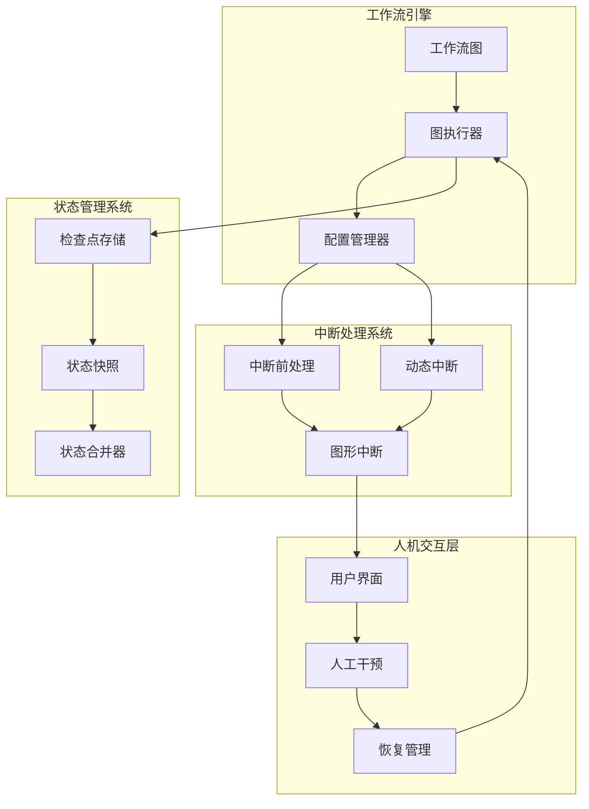

**图表来源**
- [graph/checkpointing.go](file://graph/checkpointing.go#L1-L50)
- [examples/time_travel/main.go](file://examples/time_travel/main.go#L44-L50)

## 详细组件分析

### 检查点存储系统

检查点存储系统是时间旅行状态回溯的核心基础设施，负责保存和检索工作流状态。

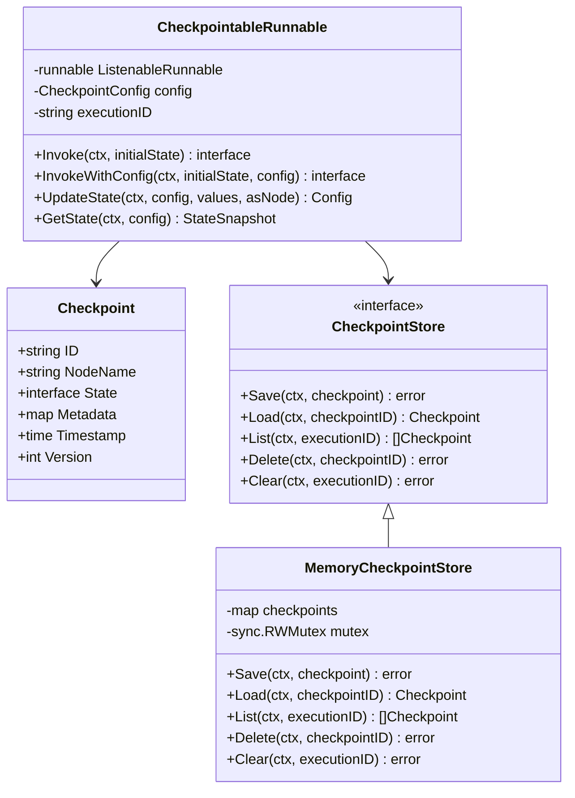

**图表来源**
- [graph/checkpointing.go](file://graph/checkpointing.go#L12-L40)
- [graph/checkpointing.go](file://graph/checkpointing.go#L213-L228)

**章节来源**
- [graph/checkpointing.go](file://graph/checkpointing.go#L12-L111)

### 中断处理机制

中断处理机制定义了工作流在何时何地暂停执行，以及如何处理中断事件。

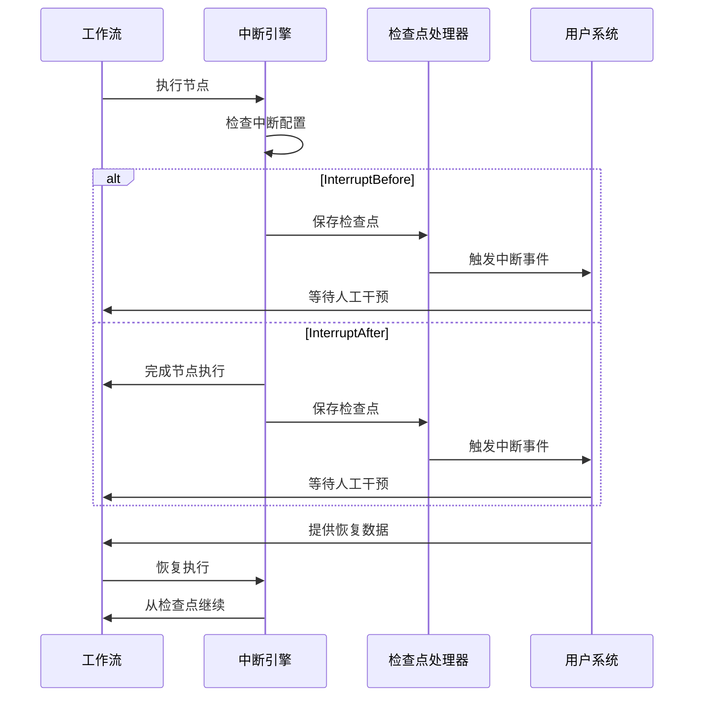

**图表来源**
- [graph/interrupt_test.go](file://graph/interrupt_test.go#L30-L63)
- [graph/resume_test.go](file://graph/resume_test.go#L30-L81)

**章节来源**
- [graph/interrupt_test.go](file://graph/interrupt_test.go#L10-L63)
- [graph/resume_test.go](file://graph/resume_test.go#L10-L81)

### 状态合并逻辑

状态合并逻辑决定了如何将新的状态值与现有状态进行整合，这是实现精确状态修改的关键。

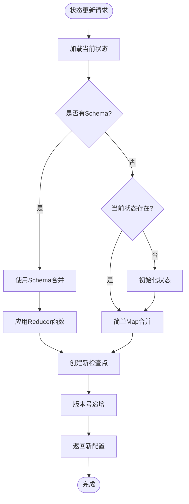

**图表来源**
- [graph/checkpointing.go](file://graph/checkpointing.go#L465-L559)

**章节来源**
- [graph/checkpointing.go](file://graph/checkpointing.go#L465-L559)

## 人机协作应用场景

### 内容过滤与审核

在内容生成和过滤场景中，时间旅行状态回溯可以实现多级审核机制：

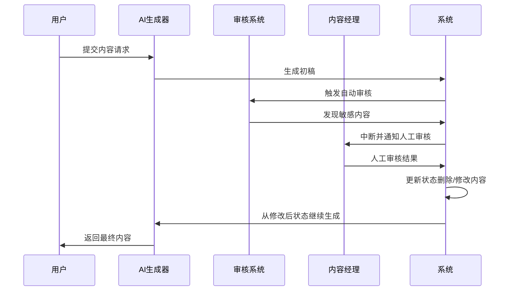

### 动态决策路径调整

在复杂的业务流程中，系统可以根据实时情况动态调整决策路径：

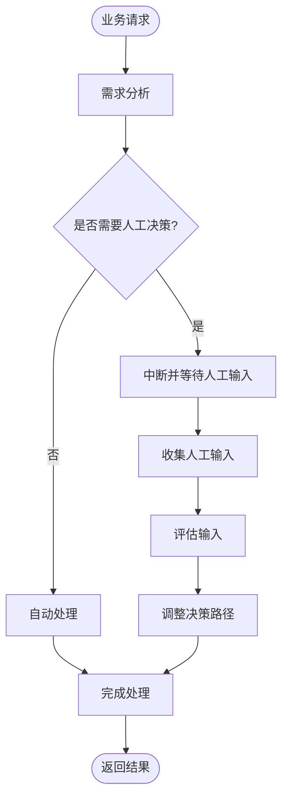

### 实时监控与干预

在关键业务流程中实现实时监控和紧急干预：

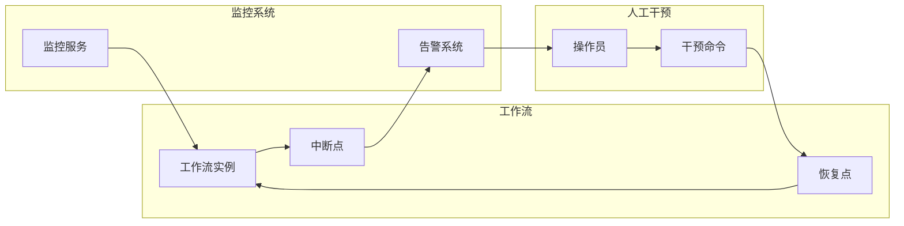

## 状态管理机制

### 版本控制策略

系统采用版本控制机制来管理状态变更历史：

| 版本号 | 操作类型 | 描述 | 影响范围 |
|--------|----------|------|----------|
| 1 | 初始状态 | 工作流启动时的状态 | 全局 |
| 2 | 自动检查点 | 节点执行后的状态保存 | 单节点 |
| 3 | 人工更新 | 人工干预后的状态修改 | 局部 |
| 4 | 状态合并 | 多次修改后的状态合并 | 全局 |

### Reducer合并逻辑

Reducer函数定义了如何将新状态值与现有状态进行合并：

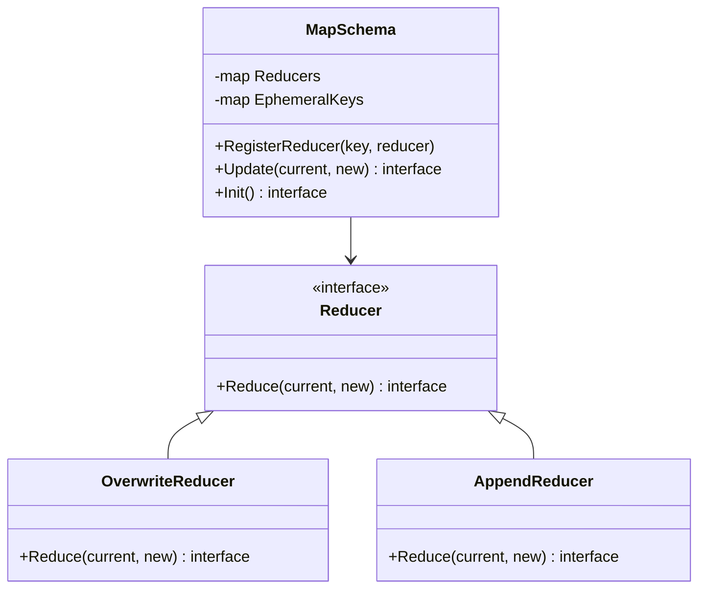

**图表来源**
- [graph/schema.go](file://graph/schema.go#L8-L18)
- [graph/schema.go](file://graph/schema.go#L140-L185)

**章节来源**
- [graph/schema.go](file://graph/schema.go#L1-L185)

### 检查点与配置关联

检查点与配置系统紧密关联，确保状态变更的可追溯性：

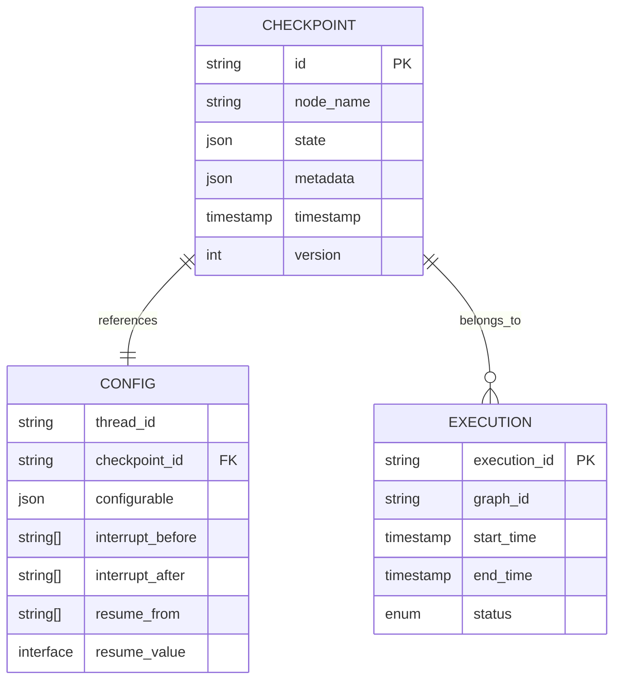

**图表来源**
- [graph/checkpointing.go](file://graph/checkpointing.go#L12-L40)
- [graph/checkpointing.go](file://graph/checkpointing.go#L388-L400)

## 实际应用案例

### 时间旅行示例详解

以下是一个完整的时间旅行示例分析：

**章节来源**
- [examples/time_travel/main.go](file://examples/time_travel/main.go#L1-L115)
- [examples/time_travel/README.md](file://examples/time_travel/README.md#L1-L55)

#### 第一阶段：初始执行与中断

系统首先设置中断配置，在节点B执行前暂停：

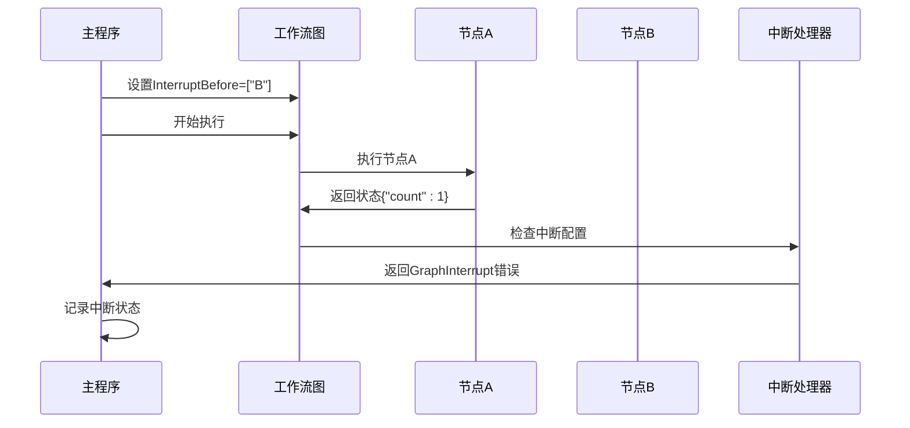

#### 第二阶段：人工干预与状态更新

在中断状态下，系统允许人工修改状态：

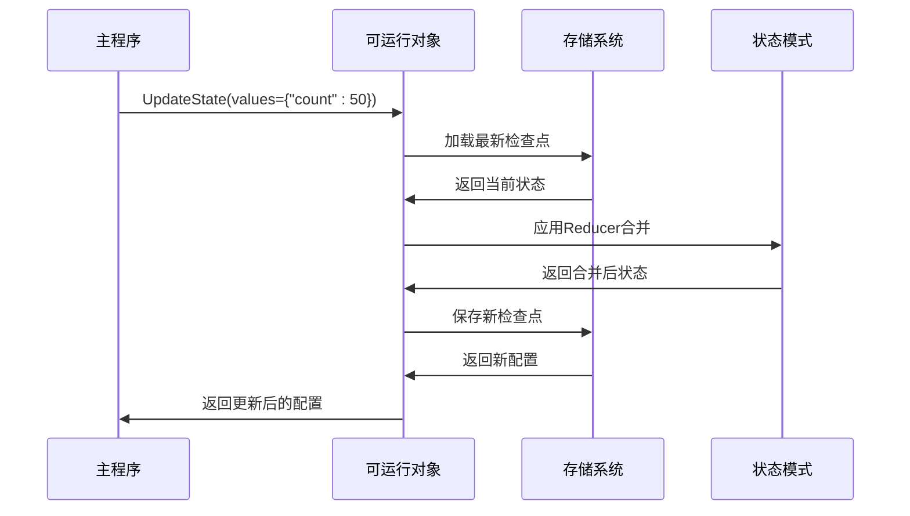

#### 第三阶段：状态恢复与继续执行

系统从修改后的状态继续执行：

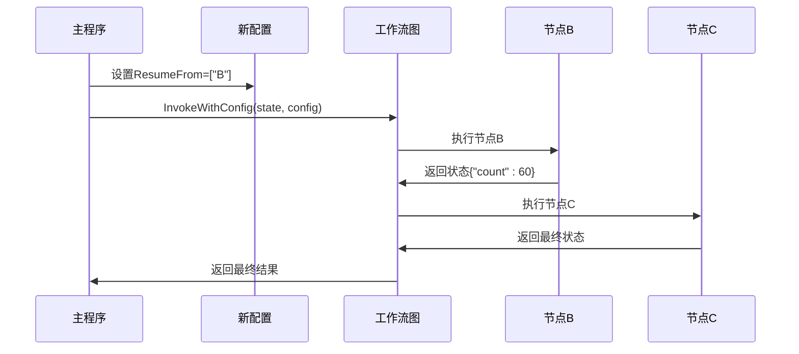

### 人机协作示例分析

**章节来源**
- [examples/human_in_the_loop/main.go](file://examples/human_in_the_loop/main.go#L1-L119)

该示例展示了完整的HITL工作流程：

1. **自动处理阶段**：系统自动处理请求
2. **中断触发**：在人工审批节点暂停
3. **人工干预**：用户审查并批准请求
4. **状态更新**：系统更新审批状态
5. **流程恢复**：从修改状态继续执行

### 动态中断示例

**章节来源**
- [examples/dynamic_interrupt/README.md](file://examples/dynamic_interrupt/README.md#L1-L35)

动态中断允许在节点内部根据条件决定是否暂停：

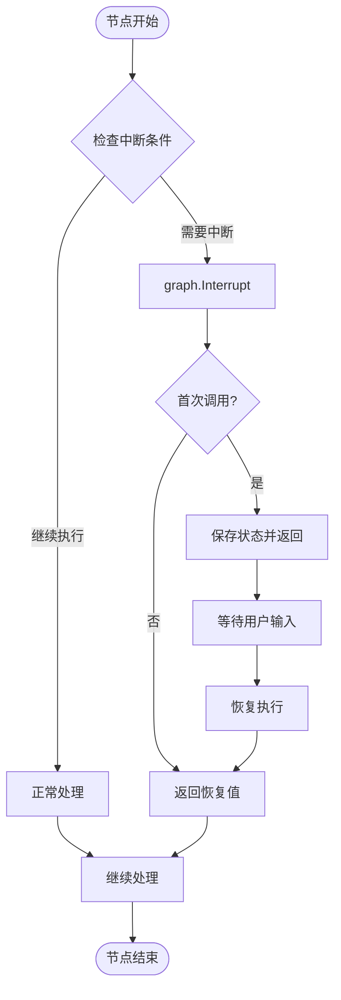

## 性能考虑

### 检查点存储优化

为了提高性能，系统采用了多种优化策略：

1. **异步保存**：检查点保存采用异步方式，避免阻塞主流程
2. **批量操作**：支持批量加载和保存多个检查点
3. **内存缓存**：频繁访问的检查点存储在内存中
4. **压缩存储**：对大型状态进行压缩存储

### 内存管理

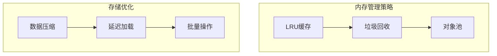

### 并发控制

系统通过多种机制确保并发安全性：

- **读写锁**：保护检查点存储的并发访问
- **原子操作**：确保状态更新的原子性
- **版本控制**：防止状态覆盖冲突

## 故障排除指南

### 常见问题与解决方案

| 问题类型 | 症状描述 | 可能原因 | 解决方案 |
|----------|----------|----------|----------|
| 中断失败 | 图无法正确中断 | 配置错误或节点不存在 | 检查InterruptBefore配置 |
| 状态丢失 | 恢复时状态不正确 | 检查点损坏或丢失 | 验证存储系统完整性 |
| 版本冲突 | 状态合并失败 | 多个并发更新 | 使用版本控制机制 |
| 性能问题 | 执行速度慢 | 检查点过多或存储缓慢 | 优化存储配置 |

### 调试技巧

1. **启用详细日志**：记录所有检查点操作
2. **状态快照**：定期保存状态快照
3. **监控指标**：跟踪检查点大小和数量
4. **测试验证**：编写单元测试验证功能

**章节来源**
- [graph/checkpointing.go](file://graph/checkpointing.go#L297-L330)

## 最佳实践

### 设计原则

1. **最小化中断点**：只在必要时设置中断点
2. **清晰的命名**：使用有意义的节点和检查点名称
3. **适当的粒度**：平衡中断频率和状态复杂度
4. **错误处理**：完善异常情况的处理逻辑

### 安全考虑

1. **访问控制**：限制对状态修改的访问权限
2. **审计日志**：记录所有状态变更操作
3. **备份策略**：定期备份重要检查点
4. **权限验证**：验证用户对状态修改的权限

### 性能优化

1. **选择合适的存储**：根据需求选择内存或持久化存储
2. **优化Reducer**：设计高效的合并算法
3. **批量操作**：减少I/O操作次数
4. **缓存策略**：合理使用缓存机制

### 可维护性

1. **文档化**：详细记录中断点和状态结构
2. **测试覆盖**：确保充分的测试覆盖率
3. **版本兼容**：保持向后兼容性
4. **监控告警**：建立完善的监控体系

## 总结

时间旅行状态回溯功能为LangGraphGo带来了强大的人机协作能力。通过InterruptBefore配置、UpdateState接口和ResumeFrom机制的组合，系统实现了精确的状态控制和灵活的工作流管理。

这一功能的核心价值体现在：

1. **增强的可控性**：允许在关键时刻进行人工干预
2. **改进的调试能力**：支持状态的回溯和分析
3. **灵活的决策路径**：适应复杂的业务需求
4. **提高的可靠性**：通过多重检查点确保状态安全

在实际应用中，开发者应该根据具体需求选择合适的中断策略，设计合理的状态结构，并建立完善的监控和维护机制。通过遵循最佳实践，可以充分发挥时间旅行状态回溯功能的优势，构建更加智能和可靠的人工智能系统。

随着AI技术的不断发展，时间旅行状态回溯功能将在更多场景中发挥重要作用，为构建更加智能、可控和可信的AI系统提供坚实的技术基础。