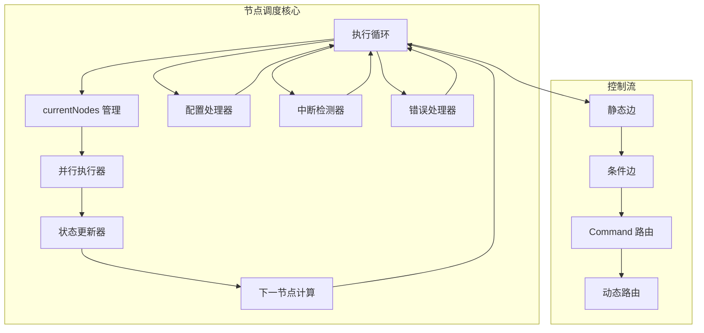
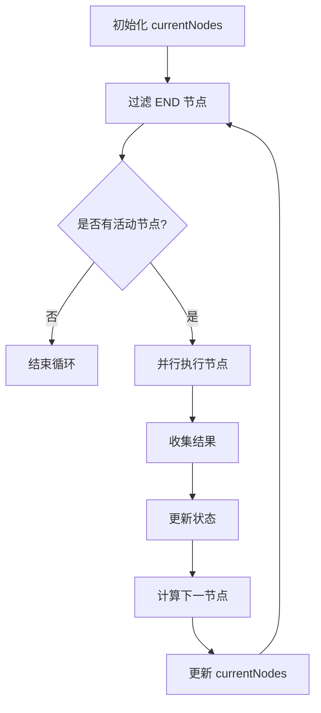
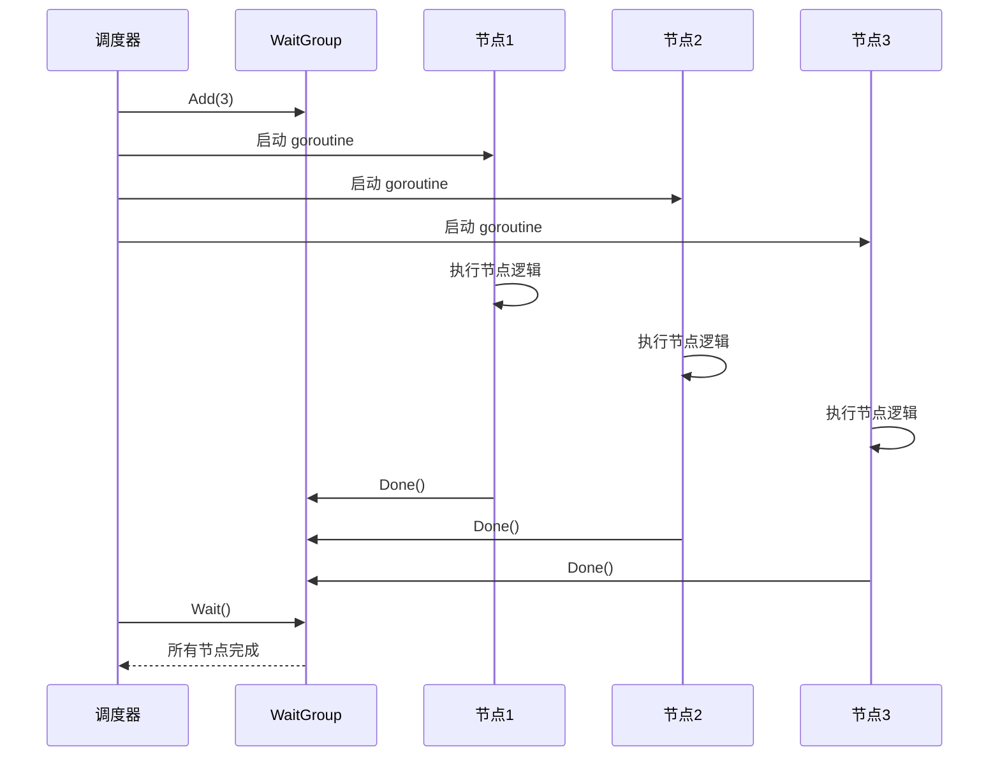
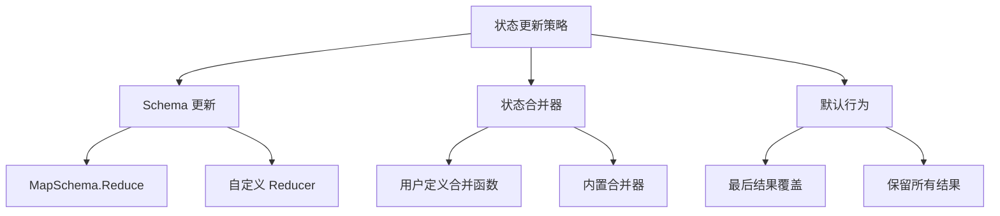
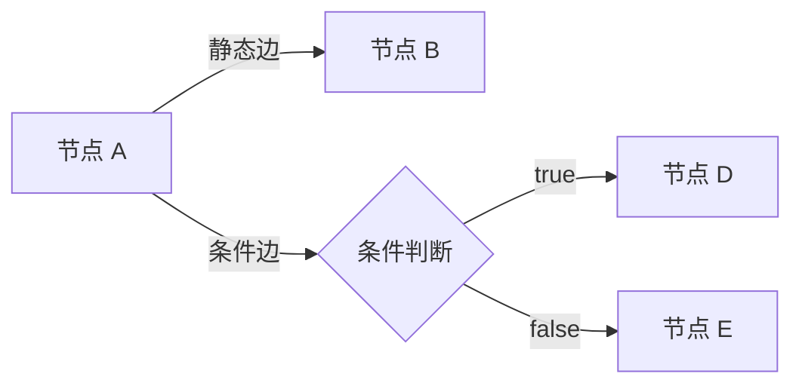
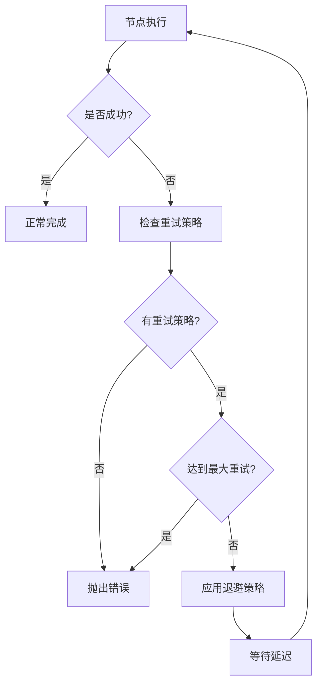
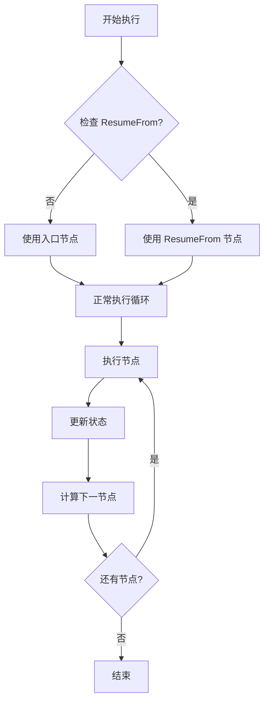
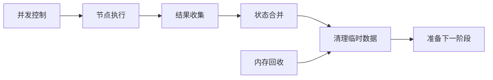

# 节点调度

<cite>
**本文档引用的文件**
- [graph.go](file://graph/graph.go)
- [parallel.go](file://graph/parallel.go)
- [state_graph.go](file://graph/state_graph.go)
- [command.go](file://graph/command.go)
- [callbacks.go](file://graph/callbacks.go)
- [config.go](file://graph/config.go)
- [context.go](file://graph/context.go)
- [retry.go](file://graph/retry.go)
- [parallel_execution/main.go](file://examples/parallel_execution/main.go)
- [parallel_test.go](file://graph/parallel_test.go)
- [resume_test.go](file://graph/resume_test.go)
- [interrupt_test.go](file://graph/interrupt_test.go)
- [command_test.go](file://graph/command_test.go)
- [schema.go](file://graph/schema.go)
</cite>

## 目录
1. [简介](#简介)
2. [核心架构概览](#核心架构概览)
3. [节点调度循环](#节点调度循环)
4. [并行执行机制](#并行执行机制)
5. [状态管理与更新](#状态管理与更新)
6. [控制流管理](#控制流管理)
7. [错误处理与重试](#错误处理与重试)
8. [配置与中断机制](#配置与中断机制)
9. [性能优化考虑](#性能优化考虑)
10. [最佳实践](#最佳实践)

## 简介

langgraphgo 的节点调度机制是整个框架的核心，负责协调和管理图中各个节点的执行顺序和并发行为。该机制通过精心设计的执行循环，实现了灵活的控制流管理、高效的并行执行以及强大的状态同步能力。

本文档将深入分析节点调度的核心组件，包括 `currentNodes` 列表的管理、并行执行的实现方式、状态更新的正确顺序保证，以及各种控制流机制的工作原理。

## 核心架构概览

langgraphgo 的节点调度系统基于两个主要的执行模型：消息图（MessageGraph）和状态图（StateGraph）。两者都遵循相同的调度原则，但在具体实现上有所差异。



**图表来源**
- [graph.go](file://graph/graph.go#L175-L492)
- [state_graph.go](file://graph/state_graph.go#L115-L296)

**章节来源**
- [graph.go](file://graph/graph.go#L1-L492)
- [state_graph.go](file://graph/state_graph.go#L1-L458)

## 节点调度循环

### currentNodes 列表的作用

`currentNodes` 是节点调度循环的核心数据结构，它维护着当前执行步骤中所有待执行的节点名称列表。这个列表在每次迭代中都会被重新计算和更新。



**图表来源**
- [graph.go](file://graph/graph.go#L224-L236)
- [state_graph.go](file://graph/state_graph.go#L129-L141)

### 调度循环的生命周期

调度循环从入口节点开始，通过以下步骤推进：

1. **初始化阶段**：设置初始的 `currentNodes` 为入口节点
2. **过滤阶段**：移除所有 `END` 节点
3. **执行阶段**：并行执行所有活动节点
4. **状态更新**：合并节点执行结果
5. **路由决策**：确定下一组执行节点
6. **循环控制**：更新 `currentNodes` 并检查终止条件

**章节来源**
- [graph.go](file://graph/graph.go#L183-L492)
- [state_graph.go](file://graph/state_graph.go#L126-L296)

## 并行执行机制

### sync.WaitGroup 的使用

langgraphgo 使用 Go 的 `sync.WaitGroup` 来协调并行节点的执行。每个节点都在独立的 goroutine 中执行，确保不会阻塞主调度线程。



**图表来源**
- [graph.go](file://graph/graph.go#L249-L318)
- [parallel.go](file://graph/parallel.go#L34-L64)

### 并行执行的实现细节

并行执行的核心实现在 `InvokeWithConfig` 方法中：

1. **节点启动**：为每个节点创建独立的 goroutine
2. **错误收集**：使用专门的错误数组收集执行结果
3. **状态共享**：所有节点共享同一个状态对象
4. **同步等待**：使用 WaitGroup 等待所有节点完成

**章节来源**
- [graph.go](file://graph/graph.go#L249-L318)
- [parallel.go](file://graph/parallel.go#L23-L82)

## 状态管理与更新

### 状态更新策略

langgraphgo 支持多种状态更新策略，根据不同的场景选择合适的合并方式：



**图表来源**
- [graph.go](file://graph/graph.go#L367-L388)
- [state_graph.go](file://graph/state_graph.go#L200-L220)

### 命令模式的控制流

`Command` 结构体提供了强大的动态控制流能力：

| 字段 | 类型 | 描述 |
|------|------|------|
| Update | interface{} | 要更新到状态中的值 |
| Goto | interface{} | 下一个节点（字符串或字符串切片） |

当节点返回 `*Command` 时，系统会：
1. 应用 `Update` 到当前状态
2. 忽略静态边，使用 `Goto` 指定的节点
3. 清除重复的节点名称

**章节来源**
- [command.go](file://graph/command.go#L1-L15)
- [graph.go](file://graph/graph.go#L344-L402)

## 控制流管理

### 静态边 vs 条件边

系统支持两种类型的边来定义控制流：



**图表来源**
- [graph.go](file://graph/graph.go#L407-L431)
- [state_graph.go](file://graph/state_graph.go#L239-L268)

### END 节点的过滤逻辑

`END` 节点是一个特殊的常量，用于标记流程的终点。在每次迭代开始时，系统会自动过滤掉所有 `END` 节点：

```go
// 过滤 END 节点的代码片段
activeNodes := make([]string, 0, len(currentNodes))
for _, node := range currentNodes {
    if node != END {
        activeNodes = append(activeNodes, node)
    }
}
currentNodes = activeNodes
```

这种设计确保了：
- 流程能够自然终止
- 避免不必要的节点执行
- 维护执行循环的简洁性

**章节来源**
- [graph.go](file://graph/graph.go#L226-L232)
- [state_graph.go](file://graph/state_graph.go#L131-L137)

## 错误处理与重试

### 重试策略的层次结构

langgraphgo 提供了多层错误处理机制：



**图表来源**
- [state_graph.go](file://graph/state_graph.go#L299-L338)
- [retry.go](file://graph/retry.go#L52-L94)

### 重试配置选项

| 配置项 | 类型 | 默认值 | 描述 |
|--------|------|--------|------|
| MaxRetries | int | 0 | 最大重试次数 |
| BackoffStrategy | BackoffStrategy | FixedBackoff | 退避策略 |
| RetryableErrors | []string | [] | 可重试的错误模式 |

**章节来源**
- [state_graph.go](file://graph/state_graph.go#L34-L48)
- [retry.go](file://graph/retry.go#L11-L18)

## 配置与中断机制

### ResumeFrom 配置

`ResumeFrom` 配置允许从特定节点恢复执行，而不是从入口节点开始：



**图表来源**
- [graph.go](file://graph/graph.go#L186-L189)
- [resume_test.go](file://graph/resume_test.go#L30-L81)

### 中断机制

系统支持两种类型的中断：

| 中断类型 | 触发时机 | 返回值 | 用途 |
|----------|----------|--------|------|
| InterruptBefore | 节点执行前 | 当前状态 | 检查点、验证 |
| InterruptAfter | 节点执行后 | 更新后的状态 | 暂停、调试 |

**章节来源**
- [config.go](file://graph/config.go#L60-L68)
- [callbacks.go](file://graph/callbacks.go#L32-L36)

## 性能优化考虑

### 并发控制

为了防止过度并发导致资源耗尽，系统采用了以下策略：

1. **goroutine 限制**：每个执行步骤的最大并发节点数受 `currentNodes` 长度限制
2. **内存管理**：及时清理临时状态和结果
3. **通道缓冲**：合理设置通道缓冲区大小

### 内存优化



**图表来源**
- [parallel.go](file://graph/parallel.go#L60-L64)
- [state_graph.go](file://graph/state_graph.go#L277-L280)

## 最佳实践

### 节点设计原则

1. **幂等性**：节点应该具有幂等性，可以安全地重试
2. **无状态性**：尽量保持节点无状态，减少并发问题
3. **快速响应**：避免长时间阻塞操作
4. **错误处理**：提供有意义的错误信息

### 并行执行建议

1. **合理分组**：将相互依赖的节点放在同一组
2. **资源隔离**：确保并行节点不共享可变资源
3. **监控指标**：添加适当的监控和日志记录

### 状态管理指南

1. **不可变性**：优先使用不可变数据结构
2. **版本控制**：实现适当的状态版本控制
3. **清理策略**：明确定义临时数据的生命周期

**章节来源**
- [parallel_execution/main.go](file://examples/parallel_execution/main.go#L1-L97)
- [parallel_test.go](file://graph/parallel_test.go#L1-L360)