# 边触发机制

<cite>
**本文档中引用的文件**
- [graph.go](file://graph/graph.go)
- [state_graph.go](file://graph/state_graph.go)
- [conditional_edges_test.go](file://graph/conditional_edges_test.go)
- [edge_cases_test.go](file://graph/edge_cases_test.go)
- [command_test.go](file://graph/command_test.go)
- [errors.go](file://graph/errors.go)
- [main.go](file://examples/conditional_edges_example/main.go)
- [main.go](file://examples/conditional_routing/main.go)
- [main.go](file://examples/command_api/main.go)
- [command.go](file://graph/command.go)
</cite>

## 目录
1. [简介](#简介)
2. [核心数据结构](#核心数据结构)
3. [静态边与条件边的区别](#静态边与条件边的区别)
4. [边注册机制](#边注册机制)
5. [执行循环中的边选择逻辑](#执行循环中的边选择逻辑)
6. [条件函数的工作原理](#条件函数的工作原理)
7. [错误处理机制](#错误处理机制)
8. [实际应用示例](#实际应用示例)
9. [最佳实践与注意事项](#最佳实践与注意事项)
10. [总结](#总结)

## 简介

langgraphgo 的边触发机制是其核心功能之一，负责控制图中节点之间的流转路径。系统通过两种主要类型的边——静态边（AddEdge）和条件边（AddConditionalEdge）——提供了灵活且强大的流程控制能力。这种机制使得开发者能够根据运行时状态动态地决定程序的执行路径，实现复杂的业务逻辑和智能决策流程。

## 核心数据结构

### 图结构定义

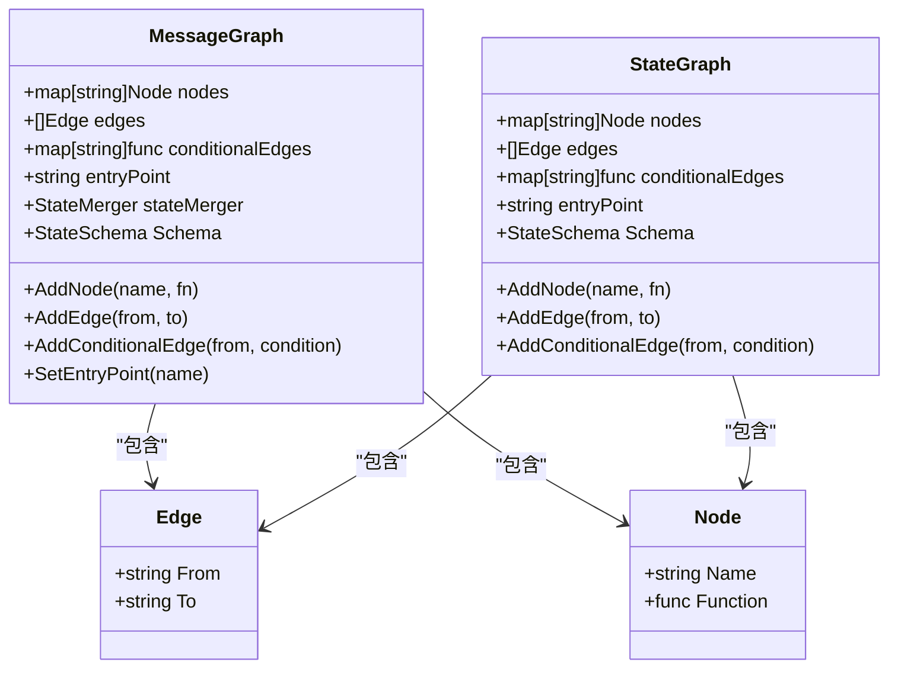

**图表来源**
- [graph.go](file://graph/graph.go#L74-L93)
- [state_graph.go](file://graph/state_graph.go#L10-L31)

### 关键字段说明

| 字段名 | 类型 | 描述 | 用途 |
|--------|------|------|------|
| `nodes` | `map[string]Node` | 节点映射表 | 存储所有定义的节点及其函数 |
| `edges` | `[]Edge` | 静态边列表 | 存储固定的连接关系 |
| `conditionalEdges` | `map[string]func` | 条件边映射 | 存储基于状态的动态路由函数 |
| `entryPoint` | `string` | 入口节点 | 定义图的起始节点 |

**章节来源**
- [graph.go](file://graph/graph.go#L74-L93)

## 静态边与条件边的区别

### 静态边（AddEdge）

静态边是在图构建阶段就确定的固定连接关系，具有以下特点：

- **固定性**：在编译时确定，运行时不可更改
- **简单性**：直接指定源节点和目标节点
- **高效性**：查找速度快，内存占用小
- **适用场景**：适用于稳定的、预定义的流程路径

### 条件边（AddConditionalEdge）

条件边允许根据运行时状态动态决定下一个节点，具有以下特点：

- **动态性**：每次执行时都可能返回不同的目标节点
- **灵活性**：支持复杂的业务逻辑判断
- **复杂性**：需要额外的计算开销
- **适用场景**：适用于需要智能决策的流程

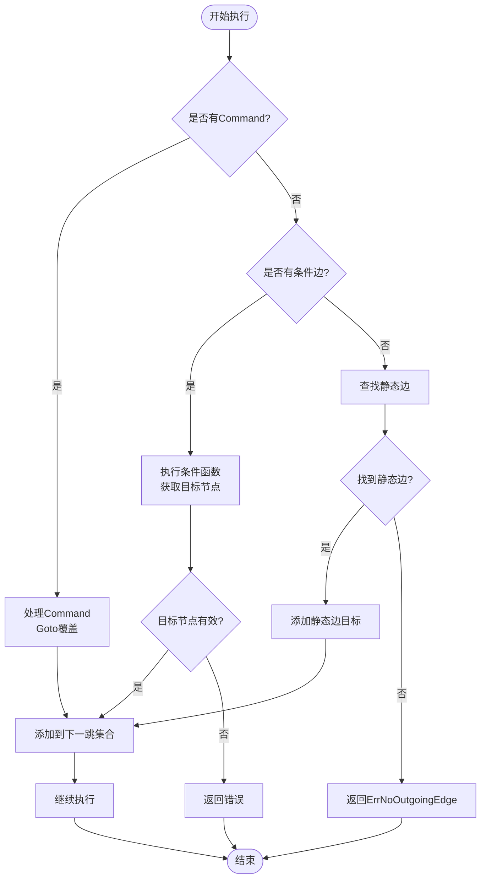

**图表来源**
- [graph.go](file://graph/graph.go#L404-L431)
- [state_graph.go](file://graph/state_graph.go#L236-L268)

**章节来源**
- [graph.go](file://graph/graph.go#L111-L123)
- [graph.go](file://graph/graph.go#L404-L431)

## 边注册机制

### AddEdge 方法实现

静态边通过 `AddEdge` 方法注册，该方法将边添加到内部的 `edges` 列表中：

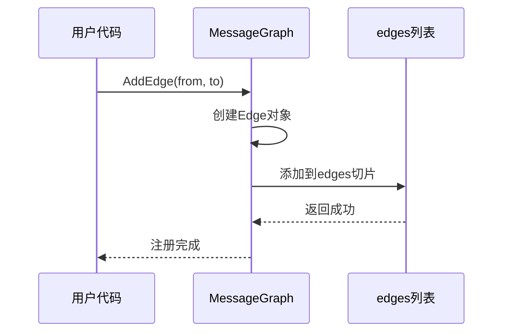

**图表来源**
- [graph.go](file://graph/graph.go#L111-L117)

### AddConditionalEdge 方法实现

条件边通过 `AddConditionalEdge` 方法注册，该方法将条件函数存储在 `conditionalEdges` 映射中：

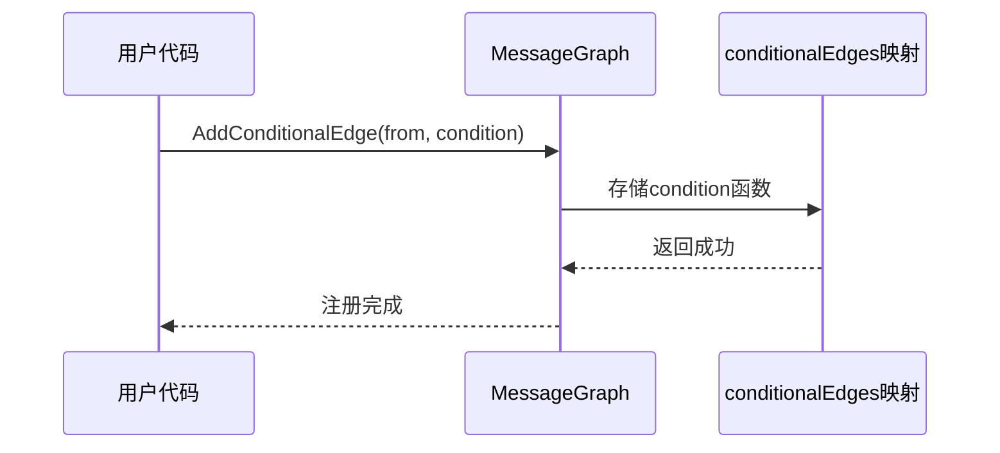

**图表来源**
- [graph.go](file://graph/graph.go#L119-L123)

### 边类型对比表

| 特性 | 静态边 | 条件边 |
|------|--------|--------|
| 注册方式 | `AddEdge(from, to)` | `AddConditionalEdge(from, condition)` |
| 数据结构 | `[]Edge` 切片 | `map[string]func` 映射 |
| 执行时机 | 运行时查找 | 运行时调用函数 |
| 性能开销 | O(n) 查找 | O(1) 查找 + 函数调用 |
| 灵活性 | 固定路径 | 动态路径 |
| 内存占用 | 小 | 中等 |

**章节来源**
- [graph.go](file://graph/graph.go#L111-L123)

## 执行循环中的边选择逻辑

### 主要执行流程

在图的执行过程中，系统按照以下优先级顺序选择下一跳节点：

1. **Command.Goto 优先级**：最高优先级，直接覆盖所有其他边
2. **条件边优先级**：如果有条件边，则执行条件函数
3. **静态边优先级**：如果没有条件边，则查找静态边

### 边选择算法详解

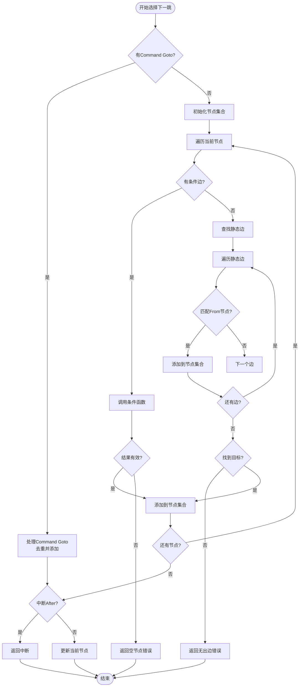

**图表来源**
- [graph.go](file://graph/graph.go#L404-L431)
- [state_graph.go](file://graph/state_graph.go#L236-L268)

### 优先级处理逻辑

系统实现了严格的优先级处理机制：

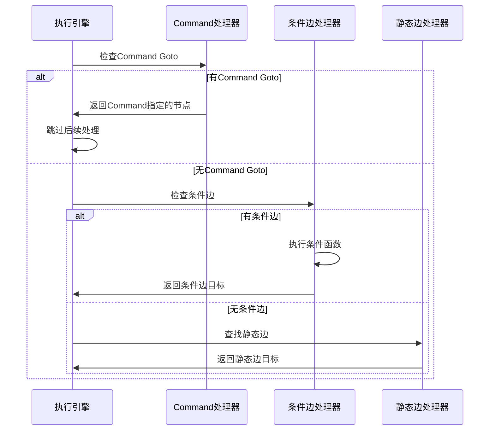

**图表来源**
- [graph.go](file://graph/graph.go#L393-L431)

**章节来源**
- [graph.go](file://graph/graph.go#L404-L431)
- [state_graph.go](file://graph/state_graph.go#L236-L268)

## 条件函数的工作原理

### 条件函数签名

条件函数采用统一的签名模式：

```go
func(ctx context.Context, state interface{}) string
```

### 条件函数执行流程

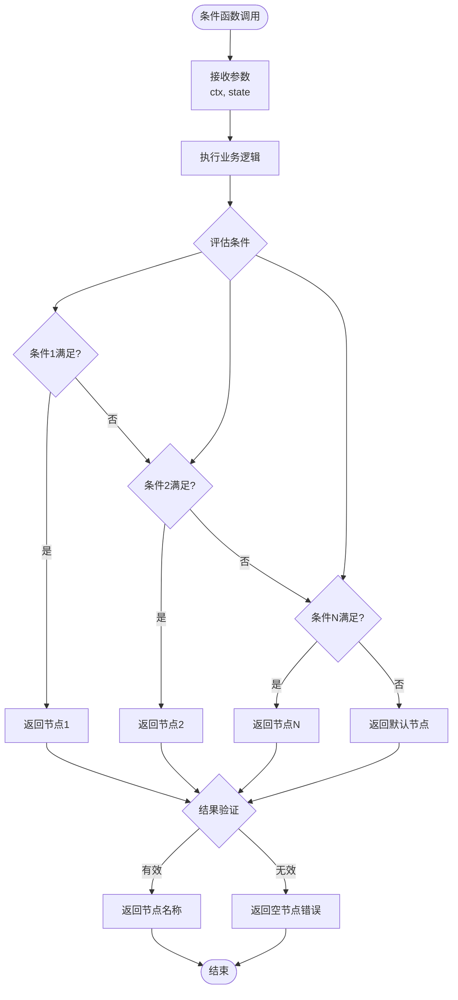

**图表来源**
- [conditional_edges_test.go](file://graph/conditional_edges_test.go#L151-L155)

### 常见条件函数模式

#### 简单路由模式
```go
g.AddConditionalEdge("router", func(ctx context.Context, state interface{}) string {
    task := state.(Task)
    switch task.Priority {
    case "high", "urgent":
        return "urgent_handler"
    case "low":
        return "batch_handler"
    default:
        return "normal_handler"
    }
})
```

#### 复杂业务逻辑模式
```go
g.AddConditionalEdge("analyze", func(ctx context.Context, state interface{}) string {
    data := state.(map[string]interface{})
    if value, ok := data["score"].(float64); ok {
        if value > 0.8 {
            return "approve"
        } else if value > 0.5 {
            return "review"
        }
    }
    return "reject"
})
```

**章节来源**
- [conditional_edges_test.go](file://graph/conditional_edges_test.go#L151-L155)
- [main.go](file://examples/conditional_routing/main.go#L54-L63)

## 错误处理机制

### ErrNoOutgoingEdge 错误

当没有可用的出边时，系统会返回 `ErrNoOutgoingEdge` 错误：

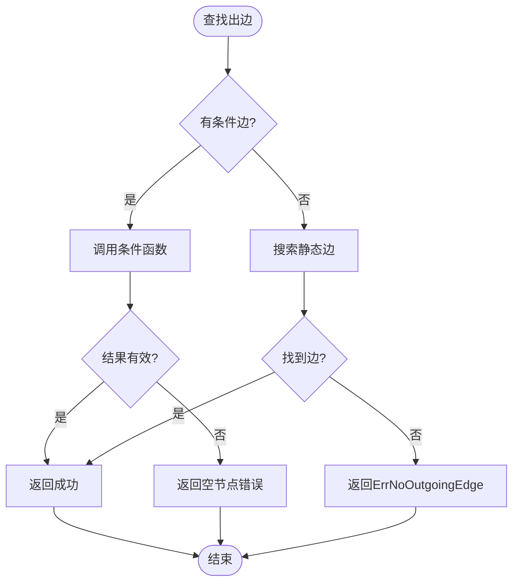

**图表来源**
- [graph.go](file://graph/graph.go#L427-L429)

### 错误类型定义

| 错误类型 | 触发条件 | 处理建议 |
|----------|----------|----------|
| `ErrNoOutgoingEdge` | 当前节点没有出边 | 检查边的定义，确保有适当的静态或条件边 |
| 条件函数返回空字符串 | 条件函数返回空节点名 | 检查条件逻辑，确保总是返回有效节点 |
| 节点未找到 | 引用了不存在的节点 | 检查节点名称拼写和定义 |

### 错误处理最佳实践

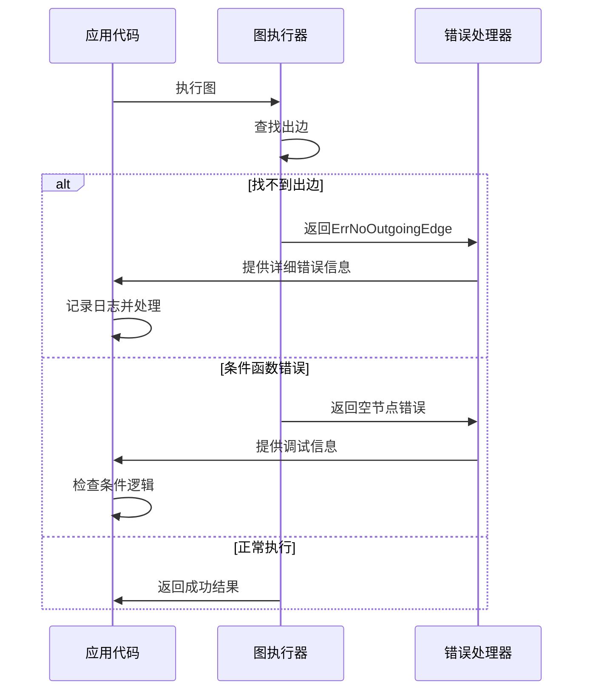

**图表来源**
- [errors.go](file://graph/errors.go#L1-L16)

**章节来源**
- [graph.go](file://graph/graph.go#L427-L429)
- [errors.go](file://graph/errors.go#L1-L16)

## 实际应用示例

### 示例1：意图路由系统

这是一个典型的条件边应用场景，根据用户输入的意图动态路由：

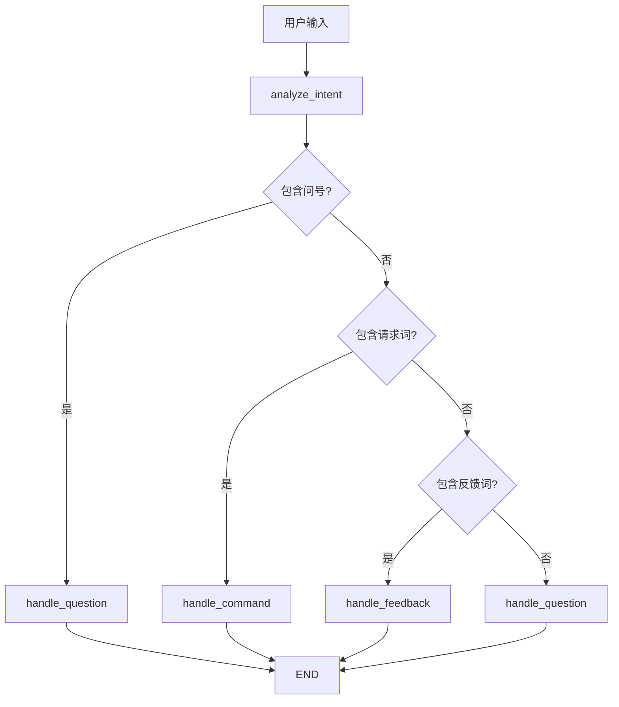

**图表来源**
- [main.go](file://examples/conditional_edges_example/main.go#L66-L88)

### 示例2：工作流条件分支

展示了多层条件判断的工作流：

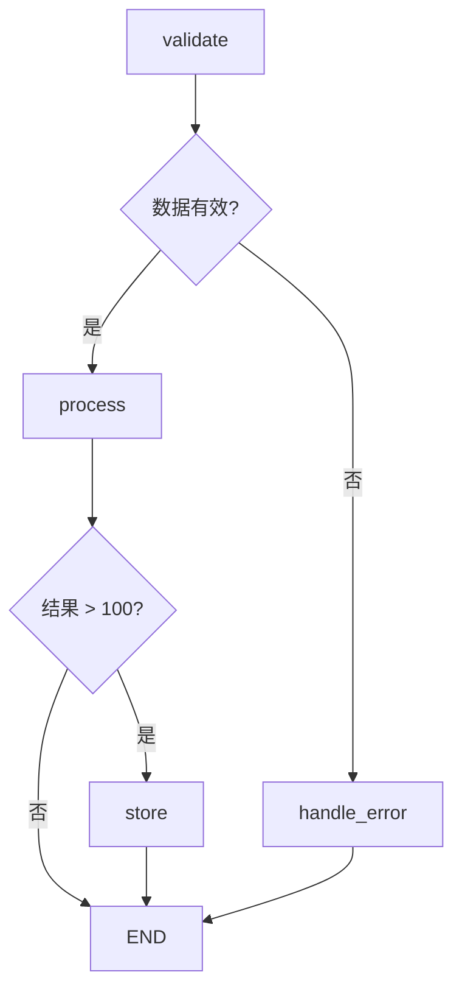

**图表来源**
- [main.go](file://examples/conditional_edges_example/main.go#L166-L184)

### 示例3：动态工具选择

根据任务类型动态选择合适的工具：

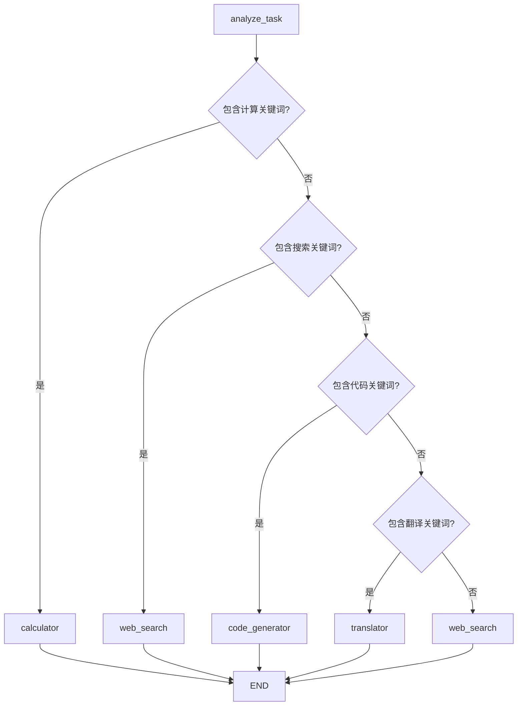

**图表来源**
- [main.go](file://examples/conditional_edges_example/main.go#L251-L273)

### 示例4：Command API 动态路由

展示了如何使用 Command 对象实现动态路由：

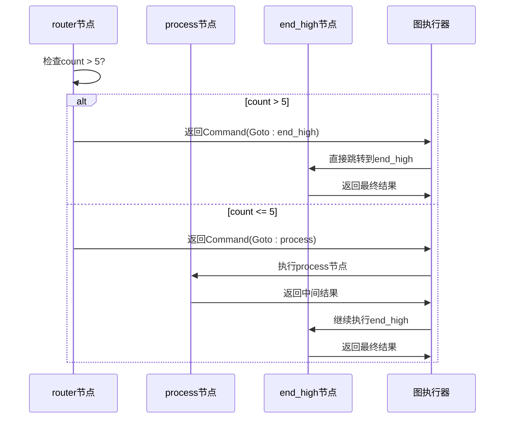

**图表来源**
- [main.go](file://examples/command_api/main.go#L23-L40)

**章节来源**
- [main.go](file://examples/conditional_edges_example/main.go#L30-L303)
- [main.go](file://examples/conditional_routing/main.go#L16-L97)
- [main.go](file://examples/command_api/main.go#L14-L73)

## 最佳实践与注意事项

### 设计原则

1. **单一职责**：每个条件函数应该只处理一种特定的业务逻辑
2. **可测试性**：条件函数应该是纯函数，便于单元测试
3. **可维护性**：避免过于复杂的条件判断逻辑
4. **完整性**：确保所有可能的条件都有对应的处理分支

### 性能优化建议

1. **减少条件函数复杂度**：避免在条件函数中进行耗时操作
2. **合理使用Command**：仅在必要时使用Command进行动态路由
3. **边的数量控制**：避免在一个节点上定义过多的出边

### 常见陷阱

1. **忘记处理边界情况**：确保条件函数总是返回有效的节点名
2. **循环依赖**：避免条件边形成循环引用
3. **状态不一致**：确保条件函数使用的状态是最新的

### 调试技巧

1. **启用追踪**：使用 Tracer 记录边的选择过程
2. **日志输出**：在条件函数中添加日志记录
3. **单元测试**：为条件函数编写全面的测试用例

## 总结

langgraphgo 的边触发机制通过静态边和条件边的有机结合，为开发者提供了强大而灵活的流程控制能力。系统采用了严格的优先级处理机制，确保 Command.Goto 具有最高优先级，随后依次检查条件边和静态边。这种设计既保证了系统的灵活性，又维持了良好的性能特征。

关键要点包括：

1. **双层边系统**：静态边提供稳定的基础连接，条件边提供动态的智能路由
2. **优先级机制**：Command.Goto > 条件边 > 静态边的严格优先级顺序
3. **错误处理**：完善的错误处理机制确保系统的健壮性
4. **灵活应用**：从简单的路由到复杂的业务决策，都能得到有效支持

通过深入理解这些机制，开发者可以更好地利用 langgraphgo 构建复杂而智能的应用程序，实现真正意义上的流程自动化和智能化决策。