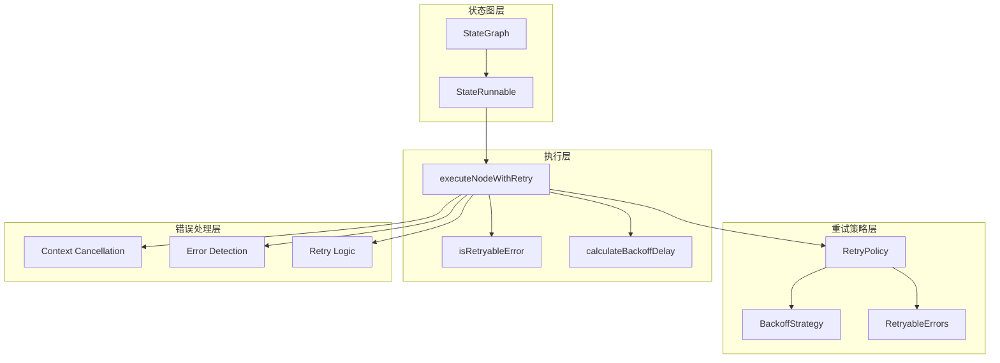
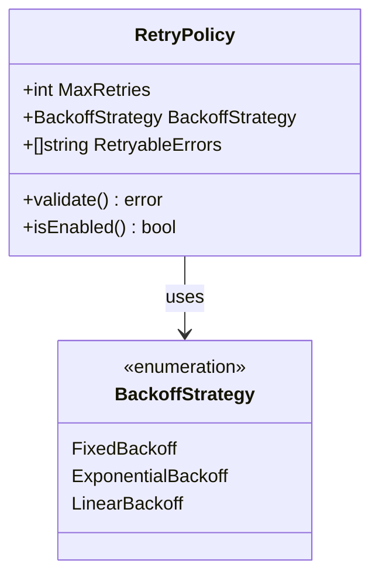
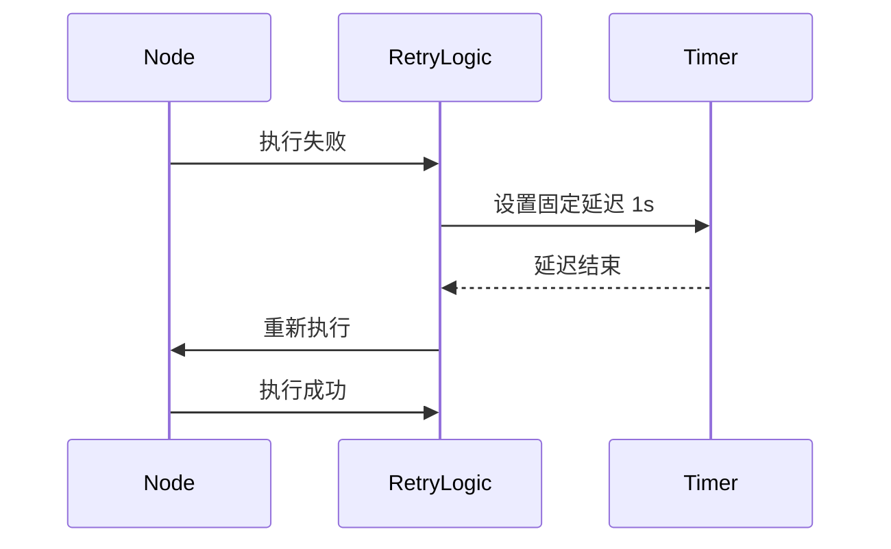
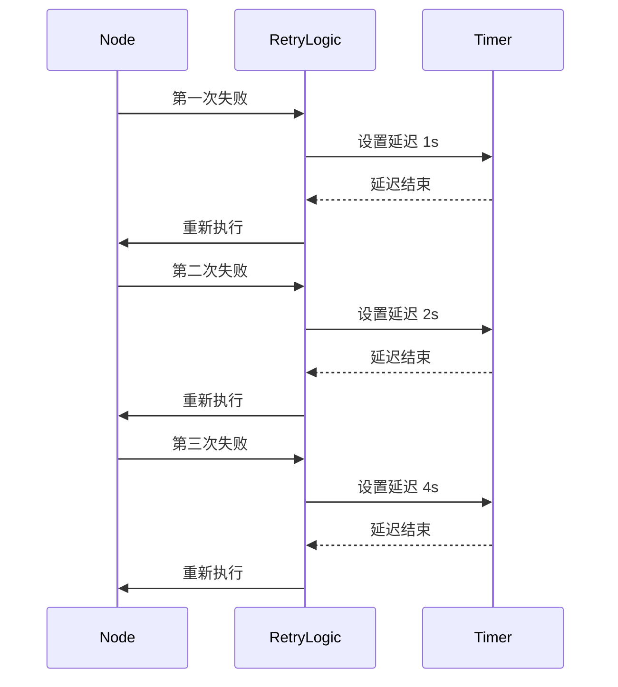
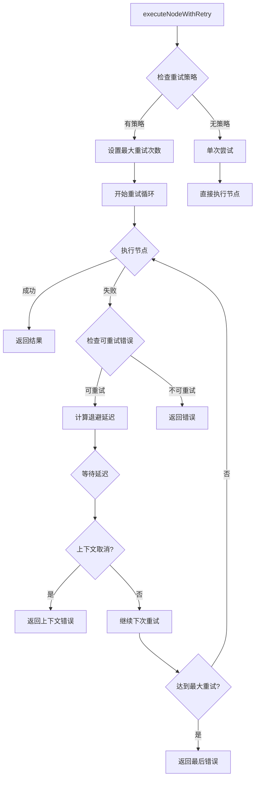
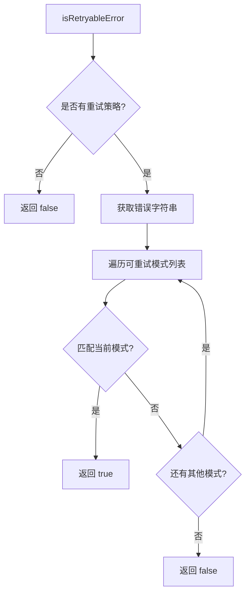
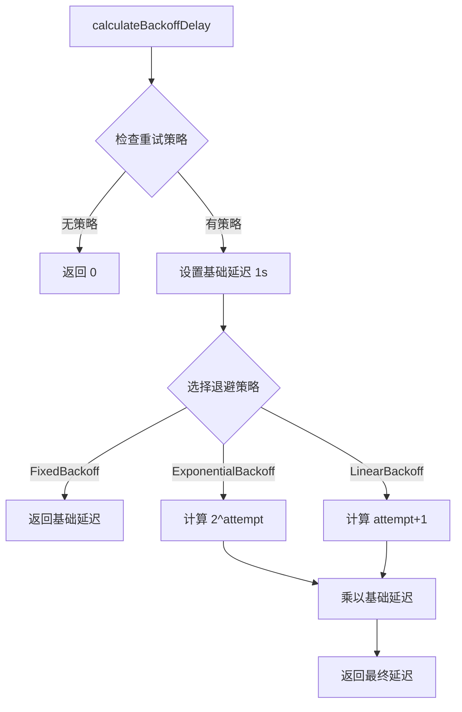
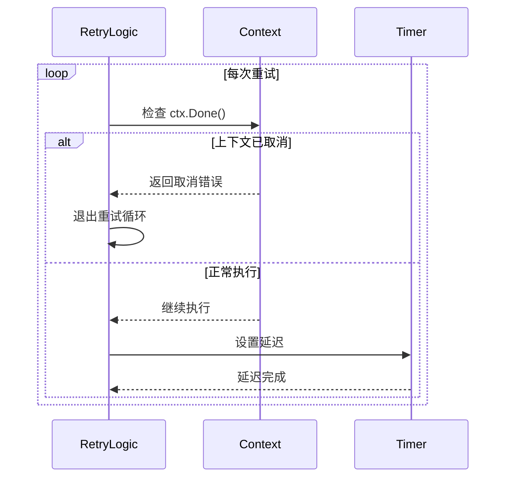

# 错误处理与重试

<cite>
**本文档中引用的文件**
- [graph/retry.go](file://graph/retry.go)
- [graph/retry_test.go](file://graph/retry_test.go)
- [graph/state_graph.go](file://graph/state_graph.go)
- [graph/errors.go](file://graph/errors.go)
- [graph/graph.go](file://graph/graph.go)
</cite>

## 目录
1. [简介](#简介)
2. [核心架构概述](#核心架构概述)
3. [RetryPolicy 结构体详解](#retrypolicy-结构体详解)
4. [重试策略类型](#重试策略类型)
5. [StateRunnable 中的重试逻辑](#staterunnable-中的重试逻辑)
6. [错误检查与判断机制](#错误检查与判断机制)
7. [退避延迟计算](#退避延迟计算)
8. [上下文取消处理](#上下文取消处理)
9. [配置与使用示例](#配置与使用示例)
10. [性能考虑与最佳实践](#性能考虑与最佳实践)
11. [故障排除指南](#故障排除指南)
12. [总结](#总结)

## 简介

langgraphgo 提供了一套完整且灵活的错误处理与重试机制，旨在提高分布式系统中状态图执行的可靠性和容错能力。该机制通过 `RetryPolicy` 结构体定义重试行为，支持多种退避策略，并提供了细粒度的错误控制能力。

核心特性包括：
- 可配置的最大重试次数
- 多种退避策略（固定、指数、线性）
- 基于字符串模式的可重试错误过滤
- 上下文感知的取消处理
- 并发安全的重试逻辑

## 核心架构概述

langgraphgo 的错误处理与重试机制采用分层设计，主要包含以下组件：



**图表来源**
- [graph/state_graph.go](file://graph/state_graph.go#L10-L32)
- [graph/state_graph.go](file://graph/state_graph.go#L33-L39)
- [graph/state_graph.go](file://graph/state_graph.go#L299-L338)

## RetryPolicy 结构体详解

`RetryPolicy` 是整个重试机制的核心配置结构，定义了节点失败时的重试行为。

### 结构定义



**图表来源**
- [graph/state_graph.go](file://graph/state_graph.go#L34-L39)
- [graph/state_graph.go](file://graph/state_graph.go#L41-L48)

### 字段说明

| 字段 | 类型 | 描述 | 默认值 |
|------|------|------|--------|
| MaxRetries | int | 最大重试次数 | 无默认值（必需设置） |
| BackoffStrategy | BackoffStrategy | 退避策略类型 | 无默认值（必需设置） |
| RetryableErrors | []string | 可重试错误字符串模式列表 | []（空列表） |

**节来源**
- [graph/state_graph.go](file://graph/state_graph.go#L34-L39)

## 重试策略类型

langgraphgo 支持三种不同的退避策略，每种策略适用于不同的场景需求。

### 固定退避策略 (FixedBackoff)

固定退避策略在每次重试时使用相同的延迟时间，适用于对响应时间要求严格且需要快速恢复的场景。



**图表来源**
- [graph/state_graph.go](file://graph/state_graph.go#L384-L384)

### 指数退避策略 (ExponentialBackoff)

指数退避策略通过指数增长的方式增加重试间隔，有效避免网络拥塞和服务器过载，是分布式系统中最常用的重试策略。



**图表来源**
- [graph/state_graph.go](file://graph/state_graph.go#L386-L386)

### 线性退避策略 (LinearBackoff)

线性退避策略以恒定的增长速率增加重试间隔，提供比固定策略更平滑的退避曲线。

**节来源**
- [graph/state_graph.go](file://graph/state_graph.go#L44-L48)

## StateRunnable 中的重试逻辑

`executeNodeWithRetry` 方法是重试机制的核心实现，负责协调整个重试流程。

### 方法签名与参数



**图表来源**
- [graph/state_graph.go](file://graph/state_graph.go#L299-L338)

### 重试逻辑实现要点

1. **重试次数计算**：`maxRetries = MaxRetries + 1`，因为初始执行也算一次尝试
2. **错误处理优先级**：先检查错误是否可重试，再决定是否继续
3. **上下文感知**：在每个关键点检查上下文状态
4. **资源清理**：确保在退出前正确处理资源

**节来源**
- [graph/state_graph.go](file://graph/state_graph.go#L299-L338)

## 错误检查与判断机制

`isRetryableError` 方法实现了基于字符串模式的错误过滤机制。

### 实现原理



**图表来源**
- [graph/state_graph.go](file://graph/state_graph.go#L341-L354)

### 字符串匹配算法

系统使用高效的字符串匹配算法来判断错误是否可重试：

1. **精确匹配**：完全相等的字符串
2. **前缀匹配**：错误字符串以指定模式开头
3. **后缀匹配**：错误字符串以指定模式结尾
4. **子串匹配**：错误字符串包含指定模式

**节来源**
- [graph/state_graph.go](file://graph/state_graph.go#L341-L354)
- [graph/state_graph.go](file://graph/state_graph.go#L357-L362)

## 退避延迟计算

`calculateBackoffDelay` 方法根据配置的退避策略计算每次重试的延迟时间。

### 延迟计算公式

| 策略类型 | 计算公式 | 示例序列 |
|----------|----------|----------|
| FixedBackoff | `baseDelay` | 1s, 1s, 1s, 1s |
| ExponentialBackoff | `baseDelay * 2^attempt` | 1s, 2s, 4s, 8s |
| LinearBackoff | `baseDelay * (attempt + 1)` | 1s, 2s, 3s, 4s |

### 实现细节



**图表来源**
- [graph/state_graph.go](file://graph/state_graph.go#L375-L394)

**节来源**
- [graph/state_graph.go](file://graph/state_graph.go#L375-L394)

## 上下文取消处理

重试机制充分考虑了 Go 语言的上下文取消模式，确保在长时间运行的重试过程中能够及时响应取消信号。

### 取消检测流程



**图表来源**
- [graph/state_graph.go](file://graph/state_graph.go#L321-L327)

### 取消处理策略

1. **立即响应**：一旦检测到上下文取消，立即停止重试并返回错误
2. **资源清理**：确保在取消时正确释放资源
3. **错误传播**：准确传递原始的上下文取消原因

**节来源**
- [graph/state_graph.go](file://graph/state_graph.go#L321-L327)

## 配置与使用示例

### 基本配置示例

以下是配置 `RetryPolicy` 的基本示例：

```go
// 创建重试策略
policy := &graph.RetryPolicy{
    MaxRetries:      3,
    BackoffStrategy: graph.ExponentialBackoff,
    RetryableErrors: []string{"timeout", "network", "temporarily unavailable"},
}

// 应用到状态图
g := graph.NewStateGraph()
g.SetRetryPolicy(policy)
```

### 不同策略的配置对比

| 策略类型 | 适用场景 | 配置示例 | 特点 |
|----------|----------|----------|------|
| 固定退避 | 对响应时间敏感的服务 | `FixedBackoff, MaxRetries: 5` | 响应快，但可能造成服务器压力 |
| 指数退避 | 分布式系统服务调用 | `ExponentialBackoff, MaxRetries: 3` | 渐进式退避，保护服务器 |
| 线性退避 | 需要稳定退避间隔的场景 | `LinearBackoff, MaxRetries: 4` | 平滑的退避曲线 |

### 高级配置示例

```go
// 自定义错误过滤器
customRetryPolicy := &graph.RetryPolicy{
    MaxRetries:      5,
    BackoffStrategy: graph.ExponentialBackoff,
    RetryableErrors: []string{
        "connection refused",      // 网络连接问题
        "timeout",                // 超时问题
        "rate limit exceeded",    // 限流问题
        "service temporarily unavailable", // 临时服务不可用
    },
}
```

**节来源**
- [graph/state_graph.go](file://graph/state_graph.go#L84-L86)

## 性能考虑与最佳实践

### 性能优化建议

1. **合理设置最大重试次数**：避免无限重试导致资源浪费
2. **选择合适的退避策略**：根据服务特点选择最适合的策略
3. **错误过滤优化**：使用精确的字符串模式减少不必要的重试
4. **并发控制**：在高并发场景下注意重试对系统的影响

### 内存使用优化

- 使用字符串切片而非正则表达式进行错误匹配
- 避免在重试循环中分配大量临时对象
- 合理设置基础延迟时间，避免过长的等待

### 监控与日志

建议在生产环境中添加适当的监控指标：

- 重试次数统计
- 错误类型分布
- 平均重试延迟
- 成功重试率

## 故障排除指南

### 常见问题与解决方案

| 问题 | 可能原因 | 解决方案 |
|------|----------|----------|
| 重试未生效 | 未设置重试策略 | 调用 `SetRetryPolicy()` 方法 |
| 重试过于频繁 | 基础延迟设置过小 | 增加基础延迟时间 |
| 重试不按预期退避 | 策略配置错误 | 检查 `BackoffStrategy` 配置 |
| 上下文取消无效 | 未正确处理上下文 | 确保在重试循环中检查 `ctx.Done()` |

### 调试技巧

1. **启用详细日志**：记录每次重试的详细信息
2. **监控重试统计**：跟踪重试次数和成功率
3. **测试不同场景**：验证各种错误情况下的重试行为

**节来源**
- [graph/retry_test.go](file://graph/retry_test.go#L18-L566)

## 总结

langgraphgo 的错误处理与重试机制提供了一个完整、灵活且高性能的解决方案。通过 `RetryPolicy` 结构体的精心设计，开发者可以轻松配置适合特定场景的重试策略。

### 主要优势

1. **灵活性**：支持多种退避策略和自定义错误过滤
2. **可靠性**：完善的上下文取消处理和错误传播机制
3. **性能**：高效的字符串匹配算法和合理的资源管理
4. **易用性**：简洁的 API 设计和丰富的配置选项

### 适用场景

- 微服务架构中的服务间通信
- 数据库操作的容错处理
- 外部 API 调用的重试机制
- 分布式任务队列的错误恢复

通过合理配置和使用这些重试机制，可以显著提高系统的稳定性和用户体验，同时保持良好的性能表现。