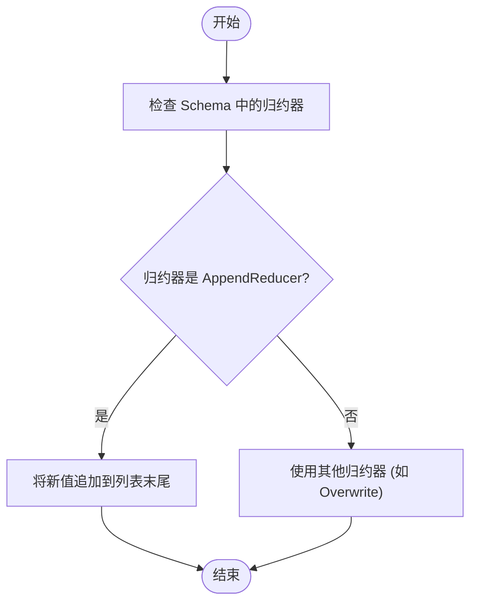
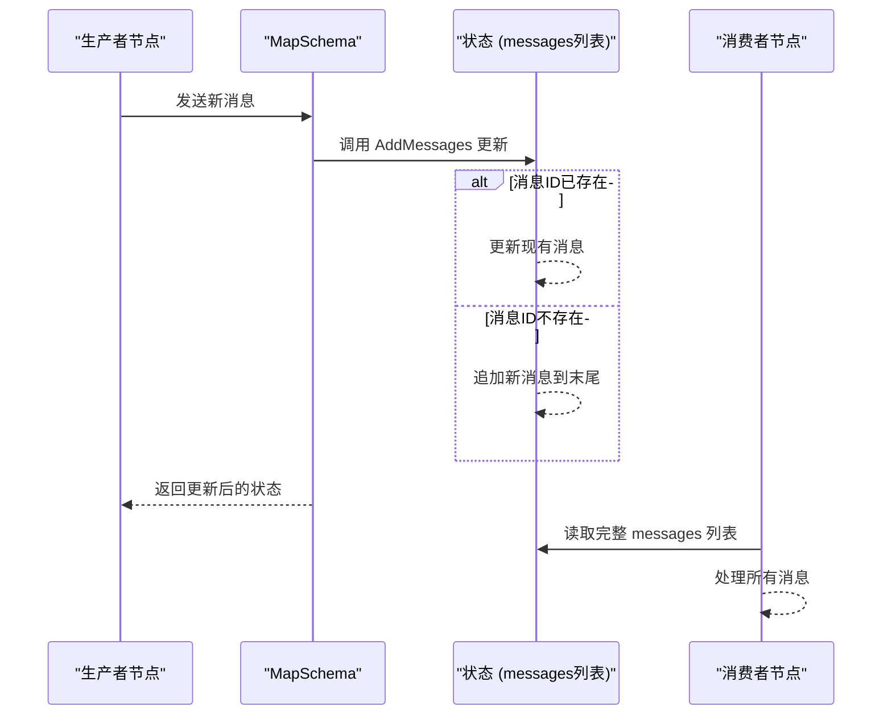
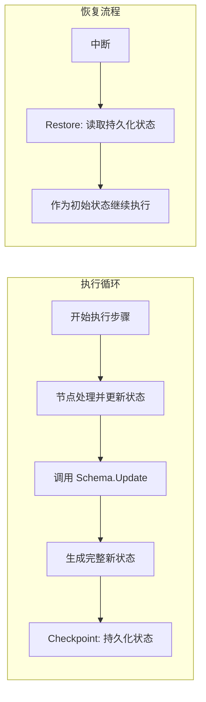

# TopicChannel

<cite>
**本文档引用的文件**  
- [schema.go](file://graph/schema.go)
- [add_messages.go](file://graph/add_messages.go)
- [add_messages_test.go](file://graph/add_messages_test.go)
- [builtin_listeners.go](file://graph/builtin_listeners.go)
- [listeners.go](file://graph/listeners.go)
- [streaming.go](file://graph/streaming.go)
- [channel_test.go](file://graph/channel_test.go)
- [main.go](file://examples/ephemeral_channels/main.go)
- [main.go](file://examples/human_in_the_loop/main.go)
- [main.go](file://examples/swarm/main.go)
- [README_CN.md](file://examples/ephemeral_channels/README_CN.md)
- [README_CN.md](file://examples/human_in_the_loop/README_CN.md)
- [README_CN.md](file://examples/swarm/README_CN.md)
</cite>

## 目录
1. [引言](#引言)
2. [TopicChannel 架构概览](#topicchannel-架构概览)
3. [核心机制：发布/订阅与消息收件箱模式](#核心机制发布订阅与消息收件箱模式)
4. [状态更新与管理：Get、Checkpoint 与 Restore](#状态更新与管理getcheckpoint-与-restore)
5. [高级应用模式](#高级应用模式)
6. [结论](#结论)

## 引言

`TopicChannel` 是 `langgraphgo` 框架中用于实现复杂工作流和多智能体（Agent）协作的核心通信机制。它基于发布/订阅（Pub/Sub）模型，通过一个可追加的值序列（列表）来存储消息，从而构建出一个高效的消息收件箱模式。该模式不仅支持消息的广播与收集，还通过 `Checkpoint` 和 `Restore` 机制实现了状态的完整管理，为实现 `Human-in-the-loop` 交互、工具调用队列以及 Swarm 智能体间通信等高级功能提供了坚实的基础。

## TopicChannel 架构概览

`TopicChannel` 的架构设计围绕着 `StateSchema` 接口展开，特别是 `MapSchema` 的实现。其核心在于利用**归约器（Reducer）** 来定义状态的更新逻辑。对于 `TopicChannel` 而言，最关键的归约器是 `AppendReducer` 和 `AddMessages`。

`AppendReducer` 是最基础的归约器，它负责将新值追加到现有列表的末尾。当一个节点向状态中写入一个新值时，`MapSchema` 会查找该值对应键的归约器，并调用 `Update` 方法。`AppendReducer` 确保了新值被正确地添加到列表中，从而实现了消息的“发布”行为。



**Diagram sources**
- [schema.go](file://graph/schema.go#L146-L185)

**Section sources**
- [schema.go](file://graph/schema.go#L146-L185)

## 核心机制：发布/订阅与消息收件箱模式

`TopicChannel` 的核心功能是实现一个消息收件箱模式，这依赖于其发布/订阅架构。

**发布（Publish）**：当一个节点（发布者）需要发送消息时，它会返回一个包含特定键（如 `messages`）和新消息值的更新。`MapSchema` 使用 `AppendReducer` 或 `AddMessages` 归约器，将这条新消息追加到状态中对应键的列表末尾。这个过程是原子的，确保了消息的有序性。

**订阅（Subscribe）**：另一个节点（订阅者）在执行时，会接收到当前的完整状态。通过读取状态中 `messages` 列表的完整内容，订阅者便能“消费”所有已发布的消息。由于列表是有序的，订阅者可以按时间顺序处理这些消息。

`AddMessages` 归约器在 `AppendReducer` 的基础上提供了更高级的功能，特别是针对消息的**去重**和**更新**。它通过 `MessageWithID` 接口或反射机制为消息赋予 ID。当新消息到达时，`AddMessages` 会检查其 ID：
- 如果 ID 已存在，则更新列表中对应的消息（实现“更新”或“覆盖”）。
- 如果 ID 不存在，则将新消息追加到列表末尾（实现“追加”）。

这种机制完美支持了主题广播和去重，确保了消息收件箱的整洁和一致性。



**Diagram sources**
- [add_messages.go](file://graph/add_messages.go#L22-L135)
- [schema.go](file://graph/schema.go#L62-L100)

**Section sources**
- [add_messages.go](file://graph/add_messages.go#L22-L135)
- [add_messages_test.go](file://graph/add_messages_test.go#L86-L103)

## 状态更新与管理：Get、Checkpoint 与 Restore

`TopicChannel` 的状态管理是其强大功能的关键。

**Get 方法**：`Get` 方法的概念体现在 `MapSchema.Update` 的返回值中。当调用 `Update` 后，返回的是一个包含所有变更的**完整新状态**。对于订阅者而言，它通过获取这个完整状态来访问 `messages` 列表的全部内容，这等同于执行了一次 `Get` 操作。

**Checkpoint 与 Restore**：框架通过 `Checkpoint` 和 `Restore` 机制实现了状态的持久化和恢复。`Checkpoint` 通常在每个执行步骤（Step）完成后触发，将当前的完整状态（包括 `messages` 列表）序列化并存储到持久化后端（如 PostgreSQL、Redis 或 SQLite）。`Restore` 则是在工作流恢复执行时，从持久化后端读取上次保存的状态快照，并将其作为初始状态重新加载。这确保了即使在中断后，`TopicChannel` 中的消息历史也能被完整地恢复，不会丢失任何信息。



**Diagram sources**
- [schema.go](file://graph/schema.go#L57-L61)
- [checkpointing.go](file://graph/checkpointing.go)
- [postgres.go](file://checkpoint/postgres/postgres.go)

**Section sources**
- [schema.go](file://graph/schema.go#L57-L61)
- [checkpointing.go](file://graph/checkpointing.go)

## 高级应用模式

`TopicChannel` 的设计使其成为实现多种高级交互模式的理想选择。

**Human-in-the-loop 交互**：在 `human_in_the_loop` 示例中，`messages` 通道被用来存储用户请求和系统响应。当流程在 `human_approval` 节点中断时，`Checkpoint` 会保存包含所有历史消息的完整状态。人类用户审查后，外部系统可以修改状态（如将 `Approved` 设为 `true`），然后通过 `Restore` 机制恢复执行。`TopicChannel` 确保了人类干预前后的所有上下文信息都被完整保留。

**工具调用请求队列**：`TopicChannel` 可以作为一个工具调用的请求队列。一个智能体可以将工具调用请求（包含工具名和参数）作为消息发布到 `tool_calls` 主题。另一个专门的工具执行器节点可以订阅此主题，按顺序处理队列中的每一个请求，并将执行结果作为新消息发布回另一个主题（如 `tool_results`），从而实现解耦和异步处理。

**Swarm 智能体间通信**：在 `swarm` 模式中，多个智能体共享同一个 `messages` 通道。当一个智能体（如 `Researcher`）通过调用 `handoff` 工具决定将控制权移交给另一个智能体（如 `Writer`）时，这个工具调用本身就是一个消息，被追加到 `messages` 列表中。所有智能体都能看到这条消息，而路由函数（`router`）会根据消息内容决定下一个执行的节点。`TopicChannel` 在这里充当了去中心化通信的总线，使得智能体之间可以直接“对话”和移交任务。

```mermaid
erDiagram
AGENT_A ||--o{ MESSAGES : "发布"
AGENT_B ||--o{ MESSAGES : "发布"
AGENT_C ||--o{ MESSAGES : "发布"
MESSAGES ||--o{ AGENT_A : "订阅"
MESSAGES ||--o{ AGENT_B : "订阅"
MESSAGES ||--o{ AGENT_C : "订阅"
class MESSAGES {
+string id
+string role
+string content
+timestamp created_at
}
```

**Diagram sources**
- [main.go](file://examples/swarm/main.go#L1-L138)
- [README_CN.md](file://examples/swarm/README_CN.md)

**Section sources**
- [main.go](file://examples/swarm/main.go#L1-L138)
- [main.go](file://examples/human_in_the_loop/main.go#L1-L119)

## 结论

`TopicChannel` 是 `langgraphgo` 框架中一个强大而灵活的通信原语。它通过 `AppendReducer` 和 `AddMessages` 归约器，基于发布/订阅模型构建了消息收件箱模式，实现了消息的有序广播与收集。其与 `Checkpoint`/`Restore` 机制的深度集成，确保了状态的持久化和完整恢复。这些特性共同支撑了 `Human-in-the-loop`、工具调用队列和 Swarm 智能体通信等复杂应用，为构建健壮、可恢复的多智能体系统提供了核心基础设施。