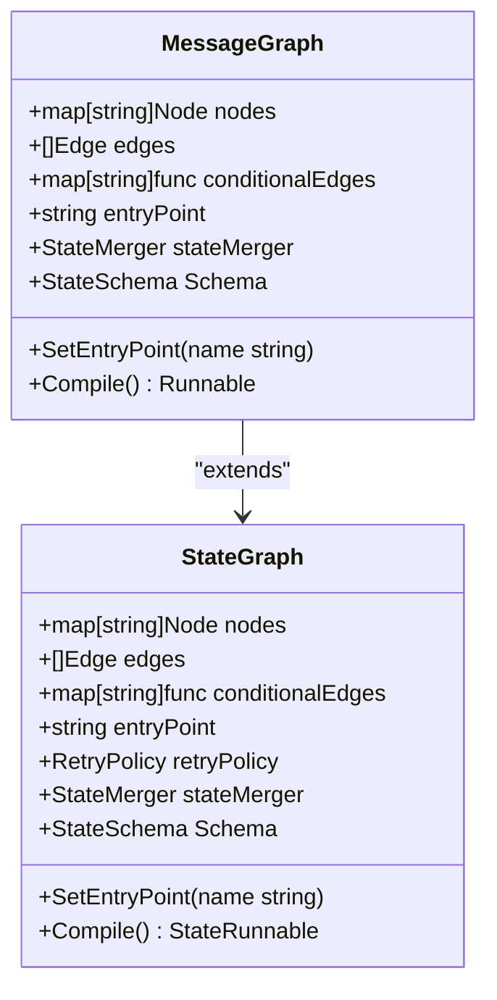
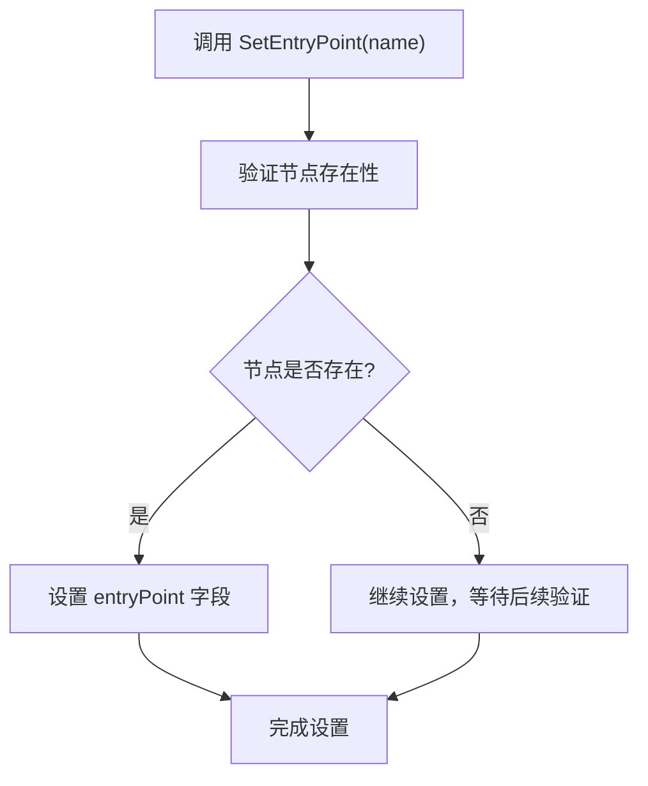
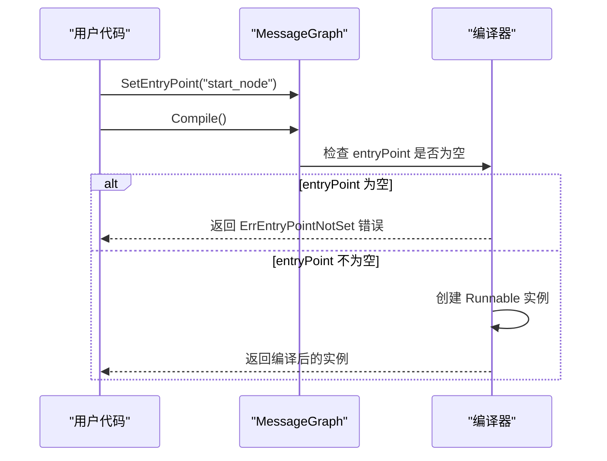
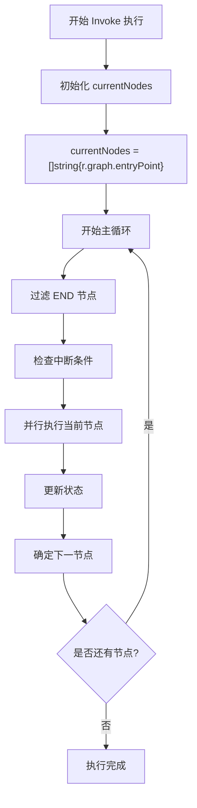
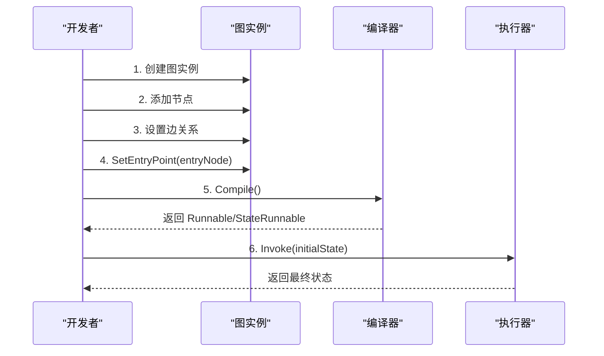
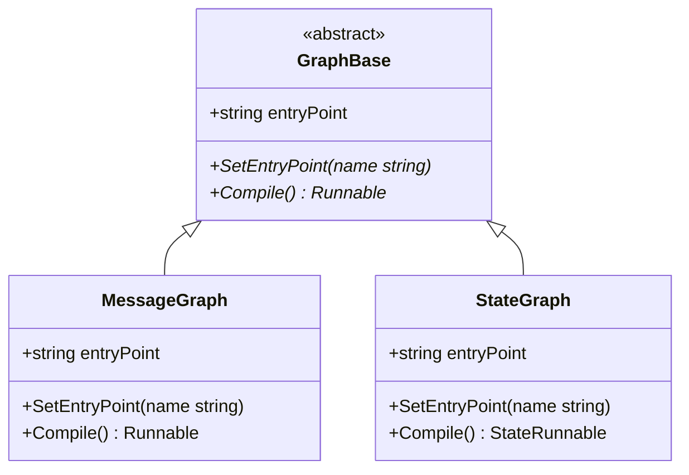
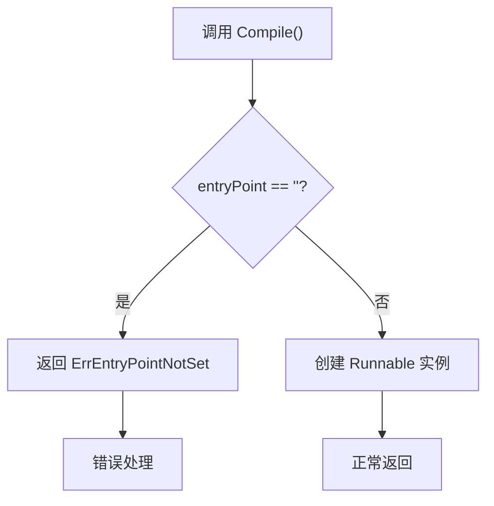
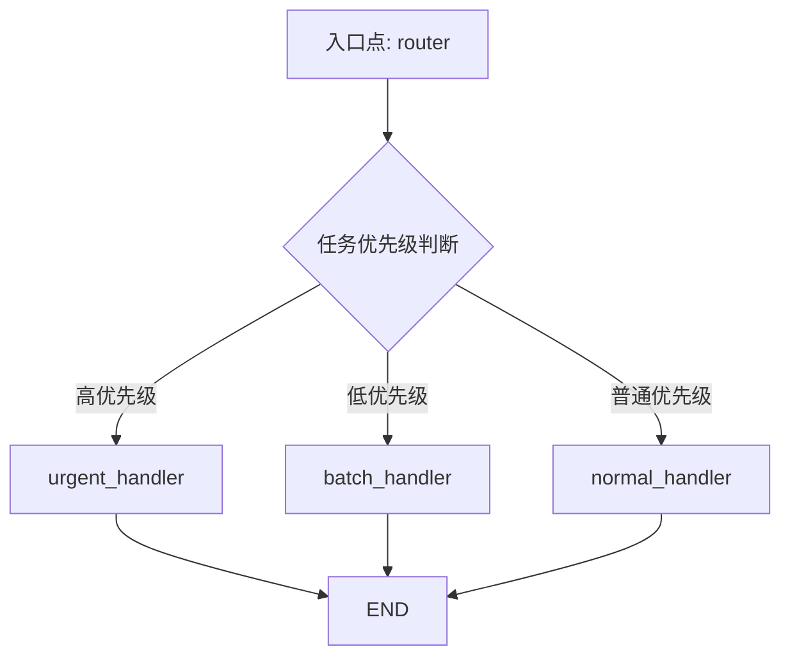
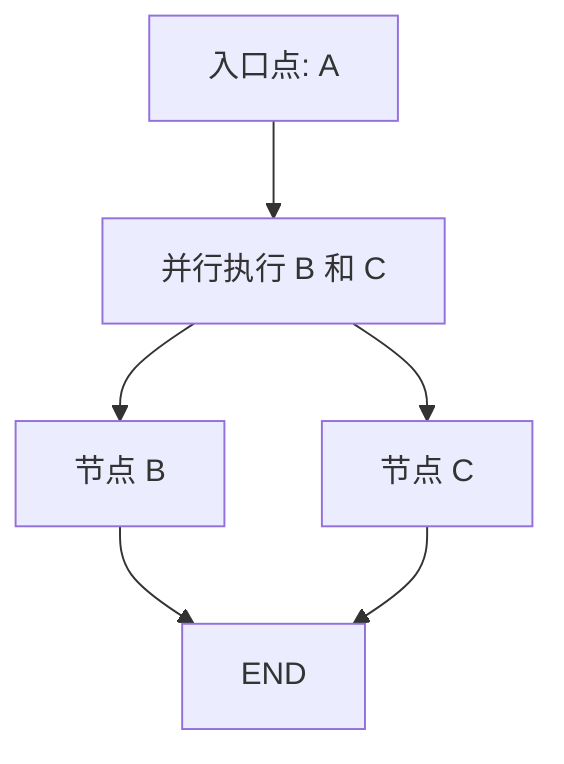

# 入口点

<cite>
**本文档中引用的文件**
- [graph.go](file://graph/graph.go)
- [state_graph.go](file://graph/state_graph.go)
- [main.go](file://examples/basic_example/main.go)
- [main.go](file://examples/conditional_routing/main.go)
- [graph_test.go](file://graph/graph_test.go)
</cite>

## 目录
1. [简介](#简介)
2. [入口点的核心概念](#入口点的核心概念)
3. [SetEntryPoint 方法详解](#setentrypoint-方法详解)
4. [入口点与编译过程的关系](#入口点与编译过程的关系)
5. [入口点在执行阶段的作用](#入口点在执行阶段的作用)
6. [标准设置流程](#标准设置流程)
7. [入口点的唯一性](#入口点的唯一性)
8. [错误处理机制](#错误处理机制)
9. [实际应用示例](#实际应用示例)
10. [最佳实践](#最佳实践)

## 简介

入口点（Entry Point）是 langgraphgo 图结构中的关键概念，它标识了整个工作流的起始执行位置。在 langgraphgo 中，每个图都必须明确指定一个入口点节点，这是确保工作流能够正确启动的基础要求。

入口点的设计体现了图结构的有向性和确定性：从一个明确的起点开始，按照预定义的路径逐步执行，直到达到终点或满足终止条件。这种设计使得复杂的工作流变得可预测、可调试和易于维护。

## 入口点的核心概念

### 定义与作用

入口点是图结构中第一个被激活的节点，它是整个执行流程的起点。在 langgraphgo 中，入口点具有以下特征：

- **唯一性**：每个图只能有一个入口点
- **必需性**：在编译前必须显式设置
- **引导性**：决定后续节点的执行顺序
- **控制性**：影响整个执行流程的走向

### 数据结构表示

在核心数据结构中，入口点通过 `entryPoint` 字段进行存储：

**图表来源**
- [graph.go](file://graph/graph.go#L75-L93)
- [state_graph.go](file://graph/state_graph.go#L10-L32)

**节来源**
- [graph.go](file://graph/graph.go#L75-L93)
- [state_graph.go](file://graph/state_graph.go#L10-L32)

## SetEntryPoint 方法详解

### 方法签名与实现

`SetEntryPoint` 方法负责将指定的节点名称设置为图的入口点：

**图表来源**
- [graph.go](file://graph/graph.go#L125-L128)
- [state_graph.go](file://graph/state_graph.go#L79-L82)

### 实现细节

该方法的实现非常简洁，直接将传入的节点名称赋值给 `entryPoint` 字段：

- **简单赋值**：不进行复杂的验证，只保存节点名称
- **无返回值**：成功时无返回，失败时抛出错误（在编译阶段）
- **即时生效**：设置后立即可用

**节来源**
- [graph.go](file://graph/graph.go#L125-L128)
- [state_graph.go](file://graph/state_graph.go#L79-L82)

## 入口点与编译过程的关系

### 编译阶段的验证

在调用 `Compile` 方法时，系统会对入口点进行严格验证：

**图表来源**
- [graph.go](file://graph/graph.go#L149-L153)
- [state_graph.go](file://graph/state_graph.go#L104-L108)

### 错误处理机制

如果在编译前未设置入口点，系统会返回特定的错误：

| 错误类型 | 描述 | 触发条件 |
|---------|------|----------|
| `ErrEntryPointNotSet` | 入口点未设置 | 调用 `Compile()` 时 `entryPoint` 为空字符串 |

**节来源**
- [graph.go](file://graph/graph.go#L149-L153)
- [state_graph.go](file://graph/state_graph.go#L104-L108)

## 入口点在执行阶段的作用

### 初始化 currentNodes 切片

在 `Invoke` 执行的初始阶段，`currentNodes` 切片从 `entryPoint` 字段开始初始化：

**图表来源**
- [graph.go](file://graph/graph.go#L183-L184)
- [state_graph.go](file://graph/state_graph.go#L126-L127)

### 执行流程的关键步骤

1. **初始化阶段**：`currentNodes` 只包含入口点节点
2. **迭代执行**：从入口点开始逐个执行节点
3. **路径扩展**：根据边关系确定后续执行节点
4. **状态传播**：在节点间传递和更新状态

**节来源**
- [graph.go](file://graph/graph.go#L183-L184)
- [state_graph.go](file://graph/state_graph.go#L126-L127)

## 标准设置流程

### 基本设置模式

标准的入口点设置遵循以下流程：

**图表来源**
- [main.go](file://examples/basic_example/main.go#L25-L35)
- [main.go](file://examples/conditional_routing/main.go#L50-L72)

### 代码示例分析

以基本示例为例，展示完整的设置流程：

1. **创建图实例**：`g := graph.NewMessageGraph()`
2. **添加节点**：`g.AddNode("process", ...)`
3. **设置边**：`g.AddEdge("process", graph.END)`
4. **设置入口点**：`g.SetEntryPoint("process")`
5. **编译**：`runnable, _ := g.Compile()`
6. **执行**：`result, _ := runnable.Invoke(context.Background(), "input")`

**节来源**
- [main.go](file://examples/basic_example/main.go#L25-L35)

## 入口点的唯一性

### 设计原则

入口点的唯一性是 langgraphgo 架构的重要设计原则：

- **单一起点**：确保工作流有明确的开始位置
- **避免歧义**：防止多个起点导致的执行不确定性
- **简化控制**：便于理解和调试执行流程

### 实现约束

在数据结构层面，唯一性通过以下方式保证：

**图表来源**
- [graph.go](file://graph/graph.go#L85)
- [state_graph.go](file://graph/state_graph.go#L21)

**节来源**
- [graph.go](file://graph/graph.go#L85)
- [state_graph.go](file://graph/state_graph.go#L21)

## 错误处理机制

### 编译时错误

当入口点未设置时，编译过程会抛出特定错误：

**图表来源**
- [graph.go](file://graph/graph.go#L151-L153)
- [state_graph.go](file://graph/state_graph.go#L106-L108)

### 运行时验证

虽然入口点在编译时验证，但在运行时仍需确保其有效性：

| 验证时机 | 验证内容 | 处理方式 |
|---------|----------|----------|
| 编译时 | `entryPoint` 是否为空 | 返回 ErrEntryPointNotSet |
| 执行时 | 节点是否存在 | 返回 ErrNodeNotFound |

**节来源**
- [graph.go](file://graph/graph.go#L151-L153)
- [state_graph.go](file://graph/state_graph.go#L106-L108)

## 实际应用示例

### 条件路由示例

在条件路由场景中，入口点的选择直接影响路由逻辑：

**图表来源**
- [main.go](file://examples/conditional_routing/main.go#L50-L64)

### 并行执行示例

在并行执行场景中，入口点同样起到关键作用：

**图表来源**
- [main.go](file://examples/basic_example/main.go#L162-L167)

**节来源**
- [main.go](file://examples/conditional_routing/main.go#L50-L64)
- [main.go](file://examples/basic_example/main.go#L162-L167)

## 最佳实践

### 设置入口点的最佳时机

1. **最后设置**：在所有节点和边都配置完成后设置入口点
2. **验证顺序**：确保入口点指向的节点确实存在
3. **命名规范**：使用有意义的节点名称作为入口点

### 常见错误避免

| 错误类型 | 原因 | 解决方案 |
|---------|------|----------|
| 编译失败 | 忘记设置入口点 | 在调用 `Compile()` 前设置 `SetEntryPoint()` |
| 运行时错误 | 入口点指向不存在的节点 | 确保入口点节点已通过 `AddNode()` 添加 |
| 逻辑错误 | 入口点设置错误 | 仔细检查入口点是否符合业务逻辑 |

### 性能考虑

- **早期设置**：尽早设置入口点，避免不必要的重新编译
- **静态验证**：利用编译时验证减少运行时错误
- **清晰结构**：保持图结构清晰，便于理解和维护

### 调试建议

1. **可视化检查**：使用图形化工具检查入口点设置
2. **日志记录**：在入口点处添加日志以便跟踪执行流程
3. **单元测试**：为入口点设置编写专门的测试用例

通过遵循这些最佳实践，可以确保入口点的有效使用，构建稳定可靠的工作流系统。