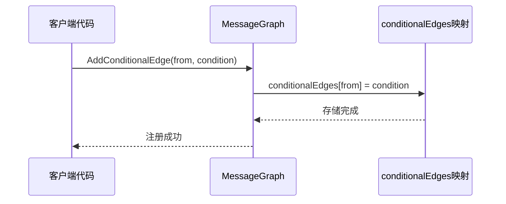
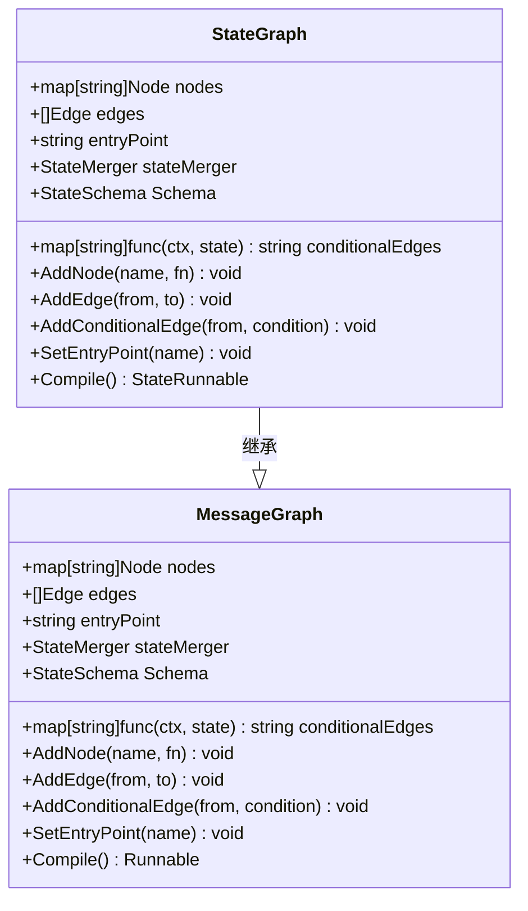
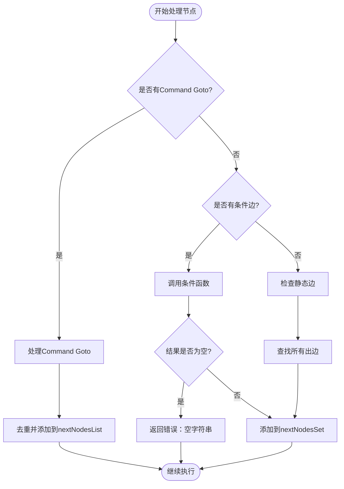
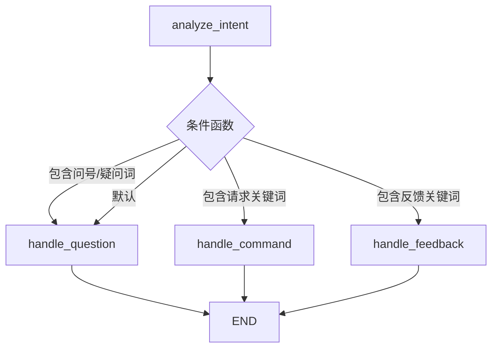
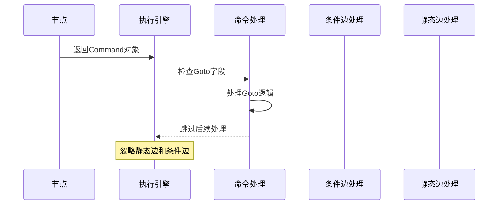
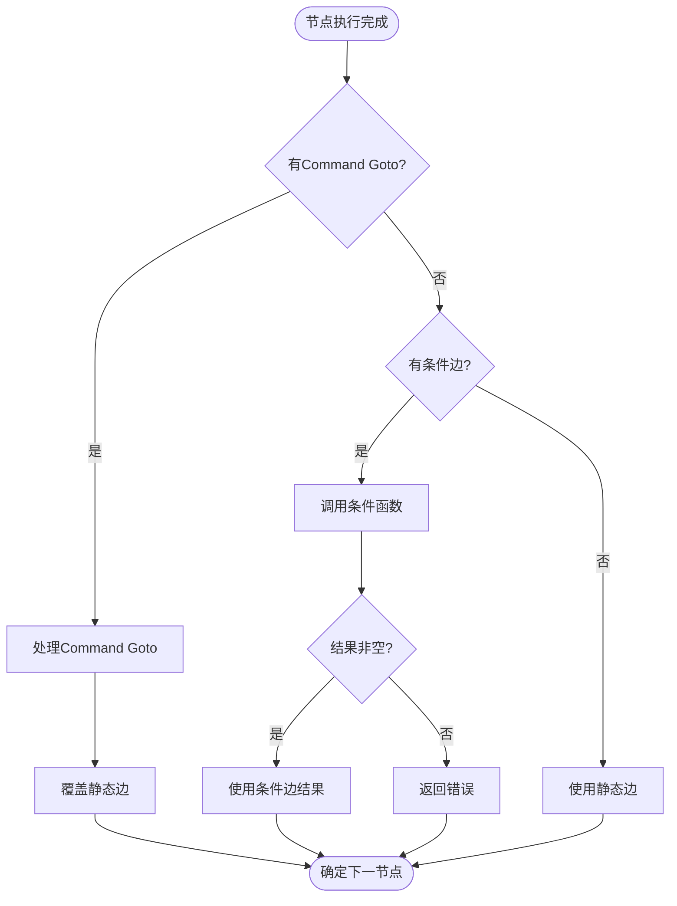
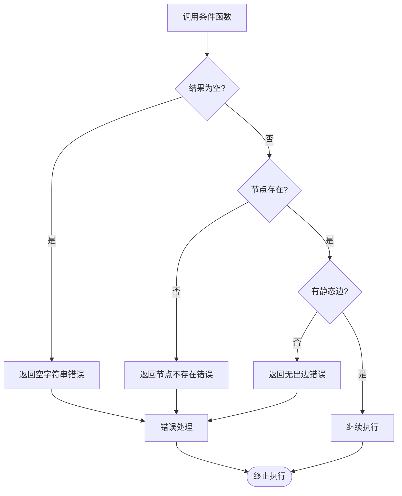

# 条件边

<cite>
**本文档中引用的文件**
- [graph.go](file://graph/graph.go)
- [state_graph.go](file://graph/state_graph.go)
- [command.go](file://graph/command.go)
- [conditional_edges_test.go](file://graph/conditional_edges_test.go)
- [main.go](file://examples/conditional_edges_example/main.go)
- [command_test.go](file://graph/command_test.go)
</cite>

## 目录
1. [简介](#简介)
2. [核心概念](#核心概念)
3. [AddConditionalEdge 方法详解](#addconditionaledge-方法详解)
4. [条件边字段实现](#条件边字段实现)
5. [执行循环中的条件边处理](#执行循环中的条件边处理)
6. [SimpleIntentRouter 示例分析](#simpleintentrouter-示例分析)
7. [优先级比较：条件边 vs 静态边 vs Command.Goto](#优先级比较条件边-vs-静态边-vs-commandgoto)
8. [错误处理机制](#错误处理机制)
9. [最佳实践](#最佳实践)
10. [总结](#总结)

## 简介

条件边（Conditional Edge）是 langgraphgo 中实现动态工作流路由的核心机制。它允许开发者根据运行时状态动态决定下一个要执行的节点，而不是使用固定的静态边连接。这种机制使得工作流能够根据不同的输入、状态变化或业务逻辑做出智能决策。

条件边通过 `AddConditionalEdge` 方法注册，将一个条件函数与源节点关联。该函数在运行时被调用，接收当前状态作为参数，并返回目标节点名称。这种设计提供了极大的灵活性，支持复杂的路由逻辑。

## 核心概念

### 条件函数签名

条件边的核心是一个函数，具有以下签名：
```go
func(ctx context.Context, state interface{}) string
```

这个函数接受两个参数：
- **context.Context**: 当前执行上下文，支持取消和超时
- **state interface{}**: 当前工作流状态，可以是任何类型

返回值必须是非空字符串，表示下一个要执行的节点名称。

### 条件边的工作原理

1. **注册阶段**: 使用 `AddConditionalEdge` 将条件函数绑定到特定源节点
2. **执行阶段**: 在节点执行完成后，检查是否存在针对该节点的条件边
3. **评估阶段**: 调用条件函数，传入当前状态
4. **路由阶段**: 根据函数返回值确定下一个节点

## AddConditionalEdge 方法详解

### MessageGraph 实现

在 `MessageGraph` 中，`AddConditionalEdge` 方法负责注册条件边：



**图表来源**
- [graph.go](file://graph/graph.go#L120-L122)

### StateGraph 实现

`StateGraph` 提供了类似的接口，但扩展了重试和监听功能：



**图表来源**
- [state_graph.go](file://graph/state_graph.go#L11-L32)
- [graph.go](file://graph/graph.go#L75-L93)

**节来源**
- [state_graph.go](file://graph/state_graph.go#L74-L76)
- [graph.go](file://graph/graph.go#L120-L122)

## 条件边字段实现

### 数据结构设计

条件边在两个主要结构中都有实现：

```mermaid
erDiagram
MessageGraph {
map[string]Node nodes
[]Edge edges
map[string]func(ctx, state) string conditionalEdges
string entryPoint
StateMerger stateMerger
StateSchema Schema
}
StateGraph {
map[string]Node nodes
[]Edge edges
map[string]func(ctx, state) string conditionalEdges
string entryPoint
RetryPolicy retryPolicy
StateMerger stateMerger
StateSchema Schema
}
conditionalEdges {
string from_node
func(ctx, state) string condition_function
}
MessageGraph ||--|| conditionalEdges : contains
StateGraph ||--|| conditionalEdges : contains
```

**图表来源**
- [state_graph.go](file://graph/state_graph.go#L18)
- [graph.go](file://graph/graph.go#L82)

### 字段初始化

在两个实现类中，条件边映射都在构造函数中初始化：

- **MessageGraph**: 第 98 行创建空映射
- **StateGraph**: 第 54 行创建空映射

这种设计确保了每个图实例都有独立的条件边配置。

**节来源**
- [state_graph.go](file://graph/state_graph.go#L54)
- [graph.go](file://graph/graph.go#L98)

## 执行循环中的条件边处理

### Invoke 方法中的处理流程

在 `Invoke` 方法的主执行循环中，条件边的处理遵循以下优先级顺序：



**图表来源**
- [state_graph.go](file://graph/state_graph.go#L225-L268)
- [graph.go](file://graph/graph.go#L393-L437)

### 具体实现细节

在 `state_graph.go` 的 `InvokeWithConfig` 方法中，条件边处理逻辑如下：

1. **命令优先检查**: 首先检查是否有来自节点的 `Command` 对象
2. **条件边检查**: 如果没有命令，则检查是否存在针对当前节点的条件边
3. **条件函数调用**: 调用条件函数，传入当前状态
4. **结果验证**: 确保返回值不是空字符串
5. **静态边回退**: 如果没有条件边，则使用静态边

**节来源**
- [state_graph.go](file://graph/state_graph.go#L225-L268)
- [graph.go](file://graph/graph.go#L393-L437)

## SimpleIntentRouter 示例分析

### 示例架构

SimpleIntentRouter 展示了基于用户意图的智能路由：



**图表来源**
- [main.go](file://examples/conditional_edges_example/main.go#L66-L88)

### 关键实现特点

1. **状态分析**: 条件函数分析消息内容中的关键词
2. **多路分支**: 支持多个不同的路由路径
3. **默认处理**: 提供默认路由以处理意外情况
4. **可读性**: 使用清晰的条件逻辑

### 代码实现要点

条件函数的核心逻辑：
- 提取文本内容并转换为小写
- 使用 `strings.Contains` 进行关键词匹配
- 返回相应的处理器节点名称
- 提供详细的调试输出

**节来源**
- [main.go](file://examples/conditional_edges_example/main.go#L66-L88)

## 优先级比较：条件边 vs 静态边 vs Command.Goto

### 优先级层次

langgraphgo 中的路由优先级从高到低为：

1. **Command.Goto** (最高优先级)
2. **条件边** (次高优先级)
3. **静态边** (最低优先级)

### Command.Goto 优先级

当节点返回 `*Command` 对象时，其 `Goto` 字段会完全覆盖其他路由方式：



**图表来源**
- [state_graph.go](file://graph/state_graph.go#L225-L234)

### 条件边 vs 静态边

如果没有 `Command.Goto`，系统会按以下顺序处理：

1. **条件边优先**: 检查是否存在针对当前节点的条件边
2. **静态边回退**: 如果没有条件边，则使用静态边定义的路径
3. **错误处理**: 如果既没有条件边也没有静态边，返回错误

### 优先级实现



**图表来源**
- [state_graph.go](file://graph/state_graph.go#L225-L268)

**节来源**
- [state_graph.go](file://graph/state_graph.go#L225-L268)
- [command.go](file://graph/command.go#L10-L13)

## 错误处理机制

### 空字符串错误

条件边函数必须返回非空字符串，否则会触发错误：

```go
if nextNode == "" {
    return nil, fmt.Errorf("conditional edge returned empty next node from %s", nodeName)
}
```

### 错误类型

1. **空字符串错误**: 条件函数返回空字符串
2. **节点不存在错误**: 目标节点未定义
3. **无出边错误**: 没有可用的下一节点

### 错误处理策略



**图表来源**
- [state_graph.go](file://graph/state_graph.go#L243-L261)

**节来源**
- [state_graph.go](file://graph/state_graph.go#L243-L261)
- [conditional_edges_test.go](file://graph/conditional_edges_test.go#L183-L189)

## 最佳实践

### 条件函数设计原则

1. **保持简单**: 条件函数应该快速执行，避免复杂计算
2. **提供默认**: 始终提供默认路由以处理意外情况
3. **状态安全**: 确保对状态的访问是线程安全的
4. **错误处理**: 正确处理状态格式不正确的情况

### 调试和监控

1. **详细日志**: 在条件函数中添加适当的调试输出
2. **状态检查**: 验证状态格式的正确性
3. **边界测试**: 测试各种边界条件和异常情况

### 性能考虑

1. **避免重复计算**: 缓存昂贵的计算结果
2. **合理分组**: 将相关的条件逻辑组合在一起
3. **及时返回**: 一旦确定路由就尽早返回

### 示例最佳实践

基于 SimpleIntentRouter 示例的最佳实践：

```go
// 推荐的条件函数结构
g.AddConditionalEdge("analyze_intent", func(ctx context.Context, state interface{}) string {
    messages := state.([]llms.MessageContent)
    
    // 输入验证
    if len(messages) == 0 {
        fmt.Println("   → 空消息，使用默认处理")
        return "handle_question"
    }
    
    // 状态提取和转换
    text := strings.ToLower(messages[0].Parts[0].(llms.TextContent).Text)
    
    // 条件判断
    if strings.Contains(text, "?") || strings.Contains(text, "what") {
        fmt.Println("   → 路由到问题处理器")
        return "handle_question"
    }
    
    // 默认处理
    fmt.Println("   → 默认：路由到问题处理器")
    return "handle_question"
})
```

## 总结

条件边是 langgraphgo 中实现动态工作流路由的核心机制，它提供了以下关键能力：

### 主要优势

1. **动态路由**: 根据运行时状态做出智能决策
2. **灵活配置**: 支持复杂的路由逻辑和多路分支
3. **易于扩展**: 可以轻松添加新的路由规则
4. **类型安全**: 强类型的条件函数签名

### 技术特点

1. **函数式设计**: 使用纯函数作为条件逻辑
2. **优先级明确**: 清晰的路由优先级体系
3. **错误处理完善**: 完整的错误检查和处理机制
4. **性能优化**: 高效的执行循环和缓存机制

### 应用场景

- **聊天机器人**: 基于用户意图的智能路由
- **数据处理**: 根据数据质量或类型选择处理路径
- **工作流管理**: 动态调整业务流程
- **错误恢复**: 根据错误类型选择恢复策略

条件边机制的设计体现了 langgraphgo 在工作流自动化方面的深度思考，为构建复杂的智能系统提供了强大的基础设施支持。