# 边

<cite>
**本文档中引用的文件**
- [graph.go](file://graph/graph.go)
- [state_graph.go](file://graph/state_graph.go)
- [parallel.go](file://graph/parallel.go)
- [schema.go](file://graph/schema.go)
- [visualization.go](file://graph/visualization.go)
- [main.go](file://examples/basic_example/main.go)
- [main.go](file://examples/parallel_execution/main.go)
</cite>

## 目录
1. [简介](#简介)
2. [Edge 结构体定义](#edge-结构体定义)
3. [边的类型](#边的类型)
4. [边的添加方法](#边的添加方法)
5. [图执行过程中的边处理](#图执行过程中的边处理)
6. [扇出与并行执行](#扇出与并行执行)
7. [边与条件边的区别](#边与条件边的区别)
8. [实际应用示例](#实际应用示例)
9. [可视化与调试](#可视化与调试)
10. [总结](#总结)

## 简介

在 langgraphgo 的图结构中，边（Edge）是定义节点间固定执行流向的核心组件。边表示从一个节点到另一个节点的有向连接，决定了图执行过程中的控制流方向。通过边的定义，开发者可以构建线性流程、分支流程、扇出（Fan-out）和扇入（Fan-in）等复杂的执行模式。

## Edge 结构体定义

Edge 结构体是 langgraphgo 中表示边的基本数据结构，它包含了边的起点和终点信息：

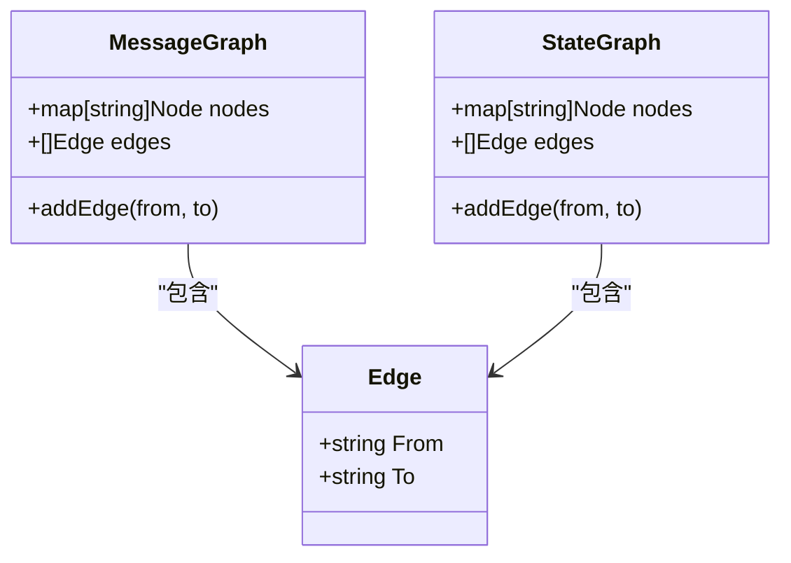

**图表来源**
- [graph.go](file://graph/graph.go#L62-L69)
- [state_graph.go](file://graph/state_graph.go#L11-L16)

### From 和 To 字段详解

Edge 结构体的两个核心字段：

- **From**: 表示边的起始节点名称，即边的源节点
- **To**: 表示边的目标节点名称，即边的终点节点

这两个字段共同定义了从哪个节点到哪个节点的执行流向，形成了图中的有向连接。

**章节来源**
- [graph.go](file://graph/graph.go#L62-L69)
- [state_graph.go](file://graph/state_graph.go#L11-L16)

## 边的类型

langgraphgo 支持两种主要类型的边：

### 静态边（Static Edge）

静态边是在图构建阶段就确定的固定执行路径，通过 `AddEdge` 方法添加：

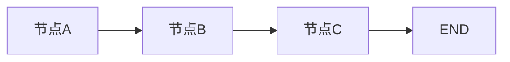

**图表来源**
- [graph.go](file://graph/graph.go#L111-L117)
- [state_graph.go](file://graph/state_graph.go#L66-L72)

### 条件边（Conditional Edge）

条件边允许根据运行时状态动态决定下一个执行节点，通过 `AddConditionalEdge` 方法添加：

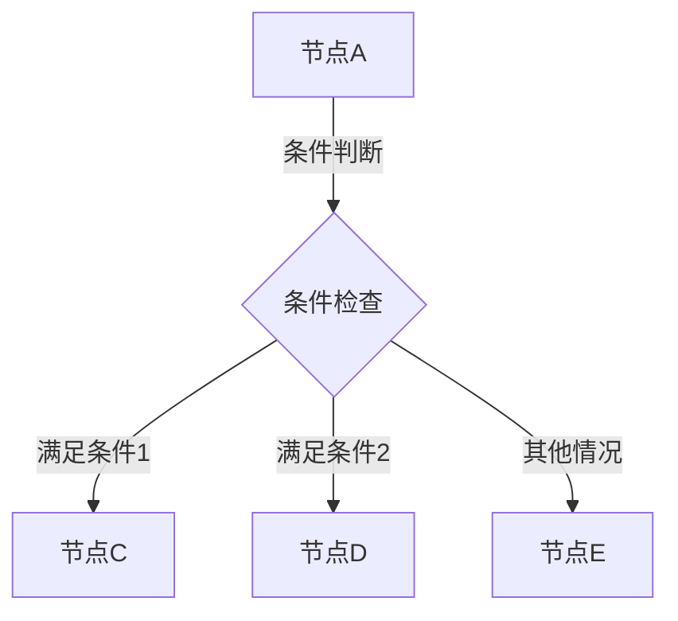

**图表来源**
- [graph.go](file://graph/graph.go#L119-L123)
- [state_graph.go](file://graph/state_graph.go#L74-L77)

## 边的添加方法

### MessageGraph 中的边添加

MessageGraph 提供了 `AddEdge` 方法来添加静态边：

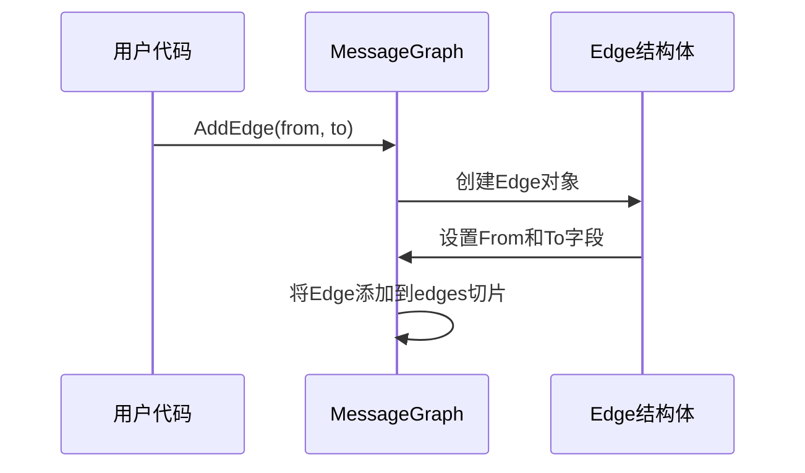

**图表来源**
- [graph.go](file://graph/graph.go#L111-L117)

### StateGraph 中的边添加

StateGraph 使用相同的 `AddEdge` 方法，但内部实现略有不同：

**图表来源**
- [state_graph.go](file://graph/state_graph.go#L66-L72)

**章节来源**
- [graph.go](file://graph/graph.go#L111-L117)
- [state_graph.go](file://graph/state_graph.go#L66-L72)

## 图执行过程中的边处理

在图执行过程中，引擎会根据当前节点的执行结果查找其所有后继节点。边在这里发挥关键作用：

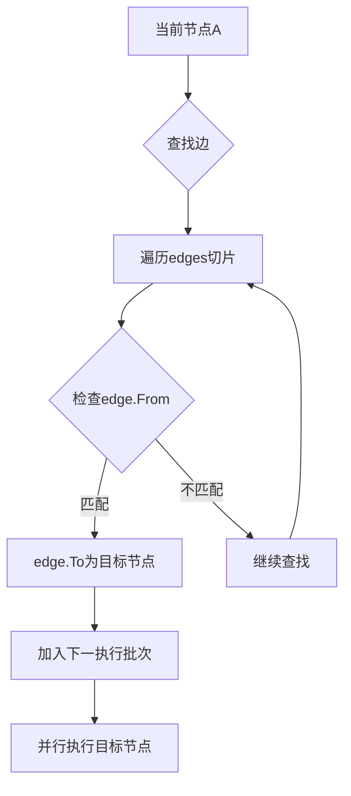

**图表来源**
- [graph.go](file://graph/graph.go#L418-L425)
- [state_graph.go](file://graph/state_graph.go#L249-L257)

### 边查找算法

引擎在每个执行周期中执行以下步骤：

1. **遍历当前节点集合**：检查每个正在执行的节点
2. **查找对应边**：在边列表中查找以当前节点为起点的边
3. **收集目标节点**：将所有找到的边的目标节点收集到下一执行批次
4. **处理扇出情况**：允许多个边从同一节点出发，支持并行执行

**章节来源**
- [graph.go](file://graph/graph.go#L418-L425)
- [state_graph.go](file://graph/state_graph.go#L249-L257)

## 扇出与并行执行

扇出（Fan-out）是一种重要的执行模式，允许一个节点同时触发多个后续节点的执行：

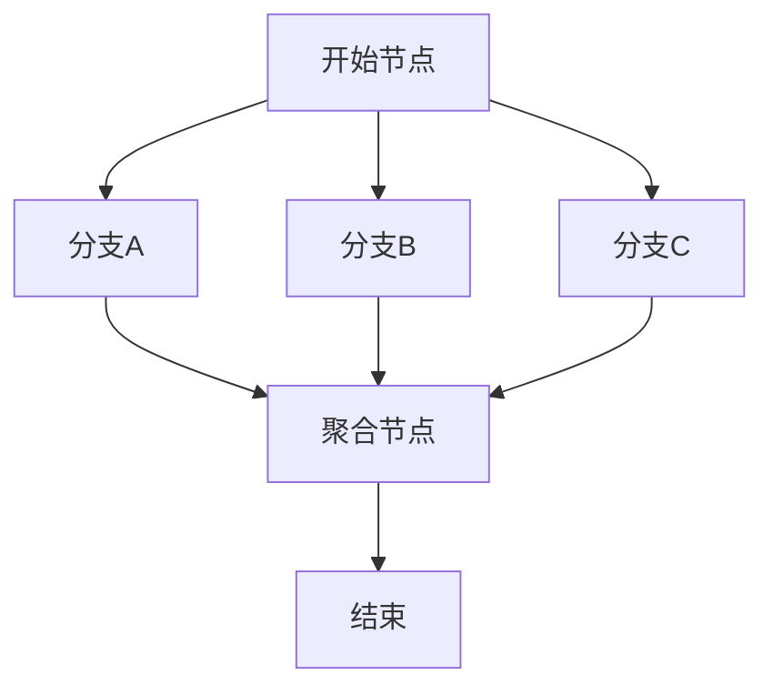

**图表来源**
- [main.go](file://examples/parallel_execution/main.go#L66-L74)
- [parallel.go](file://graph/parallel.go#L154-L177)

### 扇出实现机制

扇出模式通过以下方式实现：

1. **多条边从同一节点出发**：为每个分支添加单独的边
2. **并行执行检测**：引擎自动识别扇出模式
3. **同步等待**：所有分支完成后才继续执行聚合节点

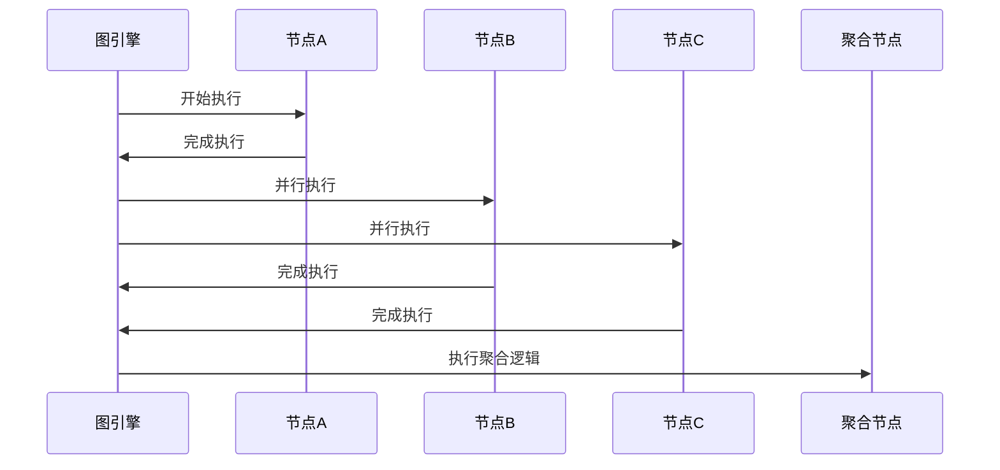

**图表来源**
- [main.go](file://examples/parallel_execution/main.go#L66-L74)
- [parallel.go](file://graph/parallel.go#L24-L82)

**章节来源**
- [main.go](file://examples/parallel_execution/main.go#L66-L74)
- [parallel.go](file://graph/parallel.go#L154-L177)

## 边与条件边的区别

| 特性 | 静态边（Edge） | 条件边（Conditional Edge） |
|------|---------------|---------------------------|
| **定义时机** | 图构建时确定 | 运行时动态决定 |
| **执行路径** | 固定不变 | 根据状态变化 |
| **实现方式** | 直接添加到边列表 | 通过条件函数判断 |
| **灵活性** | 低 | 高 |
| **性能** | 高（直接查找） | 中（需要执行函数） |
| **适用场景** | 确定性流程 | 分支决策、路由 |

### 执行优先级

当同时存在静态边和条件边时，执行优先级如下：

1. **命令优先**：如果节点返回 Command 对象，优先使用 Goto 指定的节点
2. **条件边优先**：如果没有命令，优先考虑条件边
3. **静态边回退**：条件边未命中时使用静态边

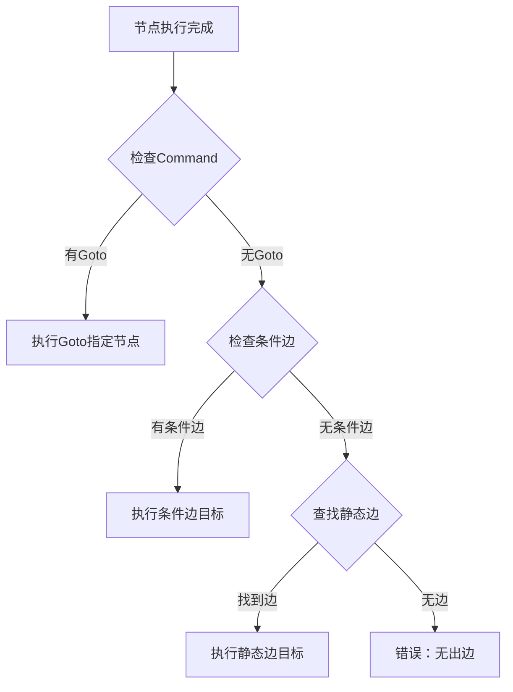

**图表来源**
- [graph.go](file://graph/graph.go#L393-L402)
- [state_graph.go](file://graph/state_graph.go#L225-L234)

**章节来源**
- [graph.go](file://graph/graph.go#L119-L123)
- [state_graph.go](file://graph/state_graph.go#L74-L77)

## 实际应用示例

### 基础线性流程

最简单的边使用示例展示了线性执行流程：

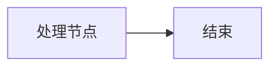

**图表来源**
- [main.go](file://examples/basic_example/main.go#L32)

### 扇出流程示例

并行执行示例展示了如何使用扇出模式：

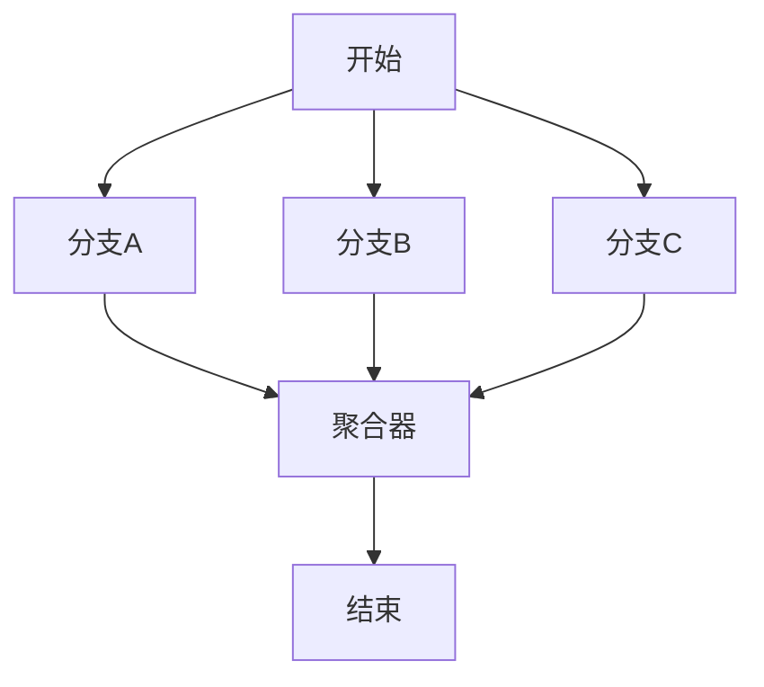

**图表来源**
- [main.go](file://examples/parallel_execution/main.go#L66-L74)

### 复杂流程组合

实际应用中，边可以组合使用多种模式：

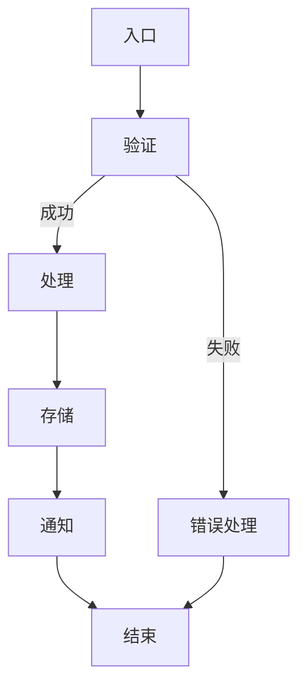

**章节来源**
- [main.go](file://examples/basic_example/main.go#L32)
- [main.go](file://examples/parallel_execution/main.go#L66-L74)

## 可视化与调试

langgraphgo 提供了多种可视化工具来帮助理解和调试边的配置：

### Mermaid 图表生成

**图表来源**
- [visualization.go](file://graph/visualization.go#L80-L81)

### ASCII 树形表示

ASCII 可视化提供了简洁的树形结构表示，便于快速理解执行流程。

### DOT 图形格式

支持 Graphviz DOT 格式输出，可用于更复杂的图形渲染和分析。

**章节来源**
- [visualization.go](file://graph/visualization.go#L26-L96)

## 总结

边（Edge）是 langgraphgo 图结构中的核心组件，它定义了节点间的固定执行流向。通过 Edge 结构体的 From 和 To 字段，开发者可以精确控制图的执行路径。边系统支持多种执行模式：

- **静态边**：提供确定性的执行路径
- **扇出模式**：支持并行执行多个分支
- **条件边**：提供动态的执行决策能力
- **混合模式**：结合多种边类型实现复杂流程

理解边的工作原理对于设计高效、可维护的图执行流程至关重要。正确使用边可以帮助开发者构建从简单线性流程到复杂并行处理的各种应用场景。