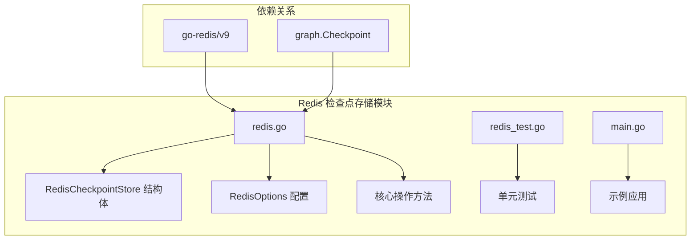
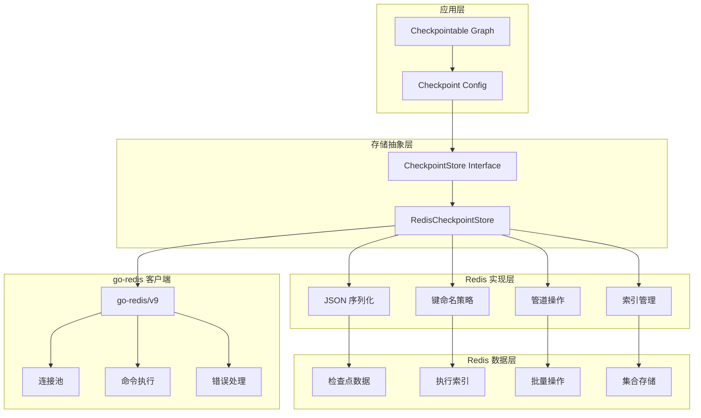
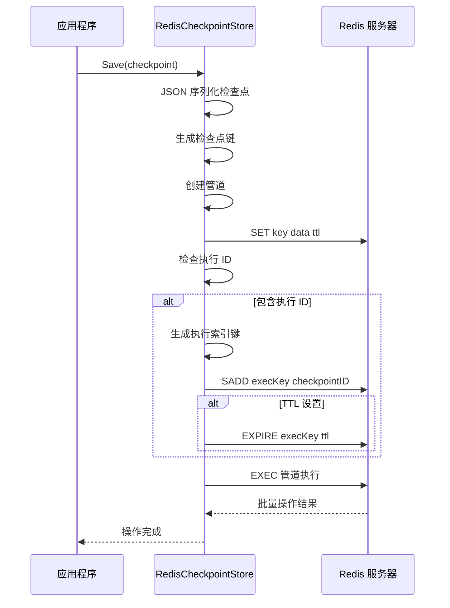
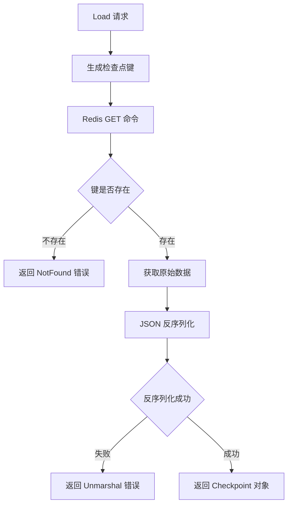
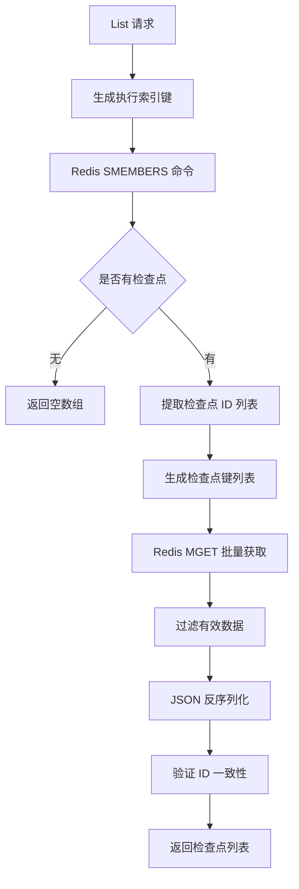

# Redis 存储 (RedisCheckpointStore)

<cite>
**本文档中引用的文件**
- [redis.go](file://checkpoint/redis/redis.go)
- [redis_test.go](file://checkpoint/redis/redis_test.go)
- [main.go](file://examples/checkpointing/redis/main.go)
- [checkpointing.go](file://graph/checkpointing.go)
</cite>

## 目录
1. [简介](#简介)
2. [项目结构](#项目结构)
3. [核心组件](#核心组件)
4. [架构概览](#架构概览)
5. [详细组件分析](#详细组件分析)
6. [键命名策略](#键命名策略)
7. [操作逻辑分析](#操作逻辑分析)
8. [性能考虑](#性能考虑)
9. [配置指南](#配置指南)
10. [故障排除指南](#故障排除指南)
11. [结论](#结论)

## 简介

RedisCheckpointStore 是一个基于 Redis 的高性能检查点存储解决方案，专为需要快速恢复和高吞吐量的应用场景设计。该实现利用 go-redis/v9 客户端提供了低延迟、高可靠性的键值存储服务，支持自动序列化、索引管理和过期策略。

RedisCheckpointStore 实现了 `CheckpointStore` 接口，提供了完整的检查点生命周期管理功能，包括保存、加载、列表查询、删除和清理操作。通过使用 Redis 的内存数据结构和管道技术，确保了卓越的性能表现。

## 项目结构

Redis 检查点存储模块位于 `checkpoint/redis/` 目录下，包含以下关键文件：



**图表来源**
- [redis.go](file://checkpoint/redis/redis.go#L1-L212)
- [redis_test.go](file://checkpoint/redis/redis_test.go#L1-L89)

**章节来源**
- [redis.go](file://checkpoint/redis/redis.go#L1-L212)
- [redis_test.go](file://checkpoint/redis/redis_test.go#L1-L89)

## 核心组件

### RedisCheckpointStore 结构体

RedisCheckpointStore 是整个存储系统的核心结构体，包含三个主要字段：

| 字段 | 类型 | 描述 | 默认值 |
|------|------|------|--------|
| client | *redis.Client | Redis 客户端实例 | 必需 |
| prefix | string | 键前缀，用于命名空间隔离 | "langgraph:" |
| ttl | time.Duration | 检查点生存时间，0 表示永不过期 | 0 |

### RedisOptions 配置结构

RedisOptions 提供了完整的 Redis 连接配置选项：

| 配置项 | 类型 | 描述 | 默认行为 |
|--------|------|------|----------|
| Addr | string | Redis 服务器地址 | 必需 |
| Password | string | 认证密码 | 空字符串 |
| DB | int | 数据库编号 | 0 |
| Prefix | string | 键前缀 | "langgraph:" |
| TTL | time.Duration | 过期时间 | 0（无过期） |

**章节来源**
- [redis.go](file://checkpoint/redis/redis.go#L13-L27)

## 架构概览

RedisCheckpointStore 采用分层架构设计，实现了高效的检查点管理：



**图表来源**
- [redis.go](file://checkpoint/redis/redis.go#L13-L212)
- [checkpointing.go](file://graph/checkpointing.go#L22-L37)

## 详细组件分析

### NewRedisCheckpointStore 函数

该函数负责创建新的 Redis 检查点存储实例，实现了完整的初始化流程：

```mermaid
flowchart TD
A[NewRedisCheckpointStore 调用] --> B[验证 RedisOptions]
B --> C[创建 Redis 客户端]
C --> D{检查前缀设置}
D --> |为空| E[使用默认前缀 "langgraph:"]
D --> |已设置| F[使用用户指定前缀]
E --> G[返回 RedisCheckpointStore 实例]
F --> G
```

**图表来源**
- [redis.go](file://checkpoint/redis/redis.go#L29-L47)

### 关键方法实现

#### checkpointKey 方法
负责生成检查点数据的 Redis 键名，采用 `{prefix}:checkpoint:{checkpointID}` 的命名模式。

#### executionKey 方法  
生成执行索引的 Redis 键名，采用 `{prefix}:execution:{executionID}:checkpoints` 的命名模式。

**章节来源**
- [redis.go](file://checkpoint/redis/redis.go#L49-L55)

## 键命名策略

RedisCheckpointStore 使用精心设计的键命名策略来组织和管理检查点数据：

### 主要键类型

| 键类型 | 格式 | 用途 | 示例 |
|--------|------|------|------|
| 检查点键 | `{prefix}:checkpoint:{checkpointID}` | 存储单个检查点数据 | `langgraph:checkpoint:cp-1` |
| 执行索引键 | `{prefix}:execution:{executionID}:checkpoints` | 索引执行的所有检查点 | `langgraph:execution:exec-123:checkpoints` |

### 命名策略优势

1. **命名空间隔离**：通过前缀实现多应用或多环境的数据隔离
2. **层次化组织**：清晰的键结构便于理解和维护
3. **高效查询**：支持按执行 ID 快速查找相关检查点
4. **可扩展性**：预留扩展空间，支持未来功能增强

**章节来源**
- [redis.go](file://checkpoint/redis/redis.go#L49-L55)

## 操作逻辑分析

### Save 操作（保存检查点）

Save 操作实现了原子性的数据存储和索引更新：



**图表来源**
- [redis.go](file://checkpoint/redis/redis.go#L58-L83)

### Load 操作（加载检查点）

Load 操作提供了高效的单个检查点检索功能：



**图表来源**
- [redis.go](file://checkpoint/redis/redis.go#L87-L102)

### List 操作（列出检查点）

List 操作支持按执行 ID 查询所有相关检查点：



**图表来源**
- [redis.go](file://checkpoint/redis/redis.go#L106-L154)

### Delete 和 Clear 操作

这两个操作都采用了类似的清理策略：

1. **Delete**：删除单个检查点及其在执行索引中的记录
2. **Clear**：删除执行的所有检查点和索引

两者都使用管道操作确保原子性，并正确处理执行索引的维护。

**章节来源**
- [redis.go](file://checkpoint/redis/redis.go#L158-L211)

## 性能考虑

### 高性能特性

1. **管道技术**：所有写入操作都使用 Redis 管道，减少网络往返
2. **批量操作**：List 操作使用 MGET 实现批量数据获取
3. **内存存储**：Redis 作为内存数据库，提供毫秒级响应时间
4. **连接池**：go-redis 自动管理连接池，提高并发性能

### 内存优化

- **JSON 序列化**：紧凑的数据格式，减少存储空间
- **TTL 支持**：可配置的过期时间，自动清理过期数据
- **索引优化**：使用 Redis 集合数据结构，支持高效的成员查询

### 并发处理

- **原子操作**：管道操作确保多个命令的原子性
- **锁机制**：在必要时使用 Redis 锁防止竞争条件
- **错误恢复**：完善的错误处理和重试机制

## 配置指南

### 基础配置

```go
store := redis.NewRedisCheckpointStore(redis.RedisOptions{
    Addr:   "localhost:6379",
    Prefix: "myapp:checkpoints:",
    TTL:    24 * time.Hour, // 24小时过期
})
```

### 生产环境推荐配置

| 配置项 | 推荐值 | 说明 |
|--------|--------|------|
| 连接数 | 10-50 | 根据并发需求调整 |
| 超时时间 | 5-10秒 | 防止长时间阻塞 |
| 重试次数 | 3-5次 | 处理临时网络问题 |
| 密钥认证 | 启用 | 提升安全性 |
| SSL/TLS | 启用 | 传输加密 |

### 持久化模式选择

#### RDB 模式
- **优点**：快照备份，恢复速度快
- **缺点**：可能丢失最后一次快照后的数据
- **适用场景**：对数据完整性要求不是特别高的场景

#### AOF 模式
- **优点**：更好的数据安全性，最小化数据丢失
- **缺点**：文件较大，恢复速度较慢
- **适用场景**：对数据安全要求极高的生产环境

#### 混合模式
同时启用 RDB 和 AOF，结合两者的优点：
- RDB 用于定期快照备份
- AOF 用于实时日志记录

### 网络延迟优化

1. **本地部署**：Redis 与应用在同一局域网内
2. **连接复用**：使用连接池避免频繁建立连接
3. **批量操作**：尽可能使用管道进行批量操作
4. **超时设置**：合理设置读写超时时间

**章节来源**
- [main.go](file://examples/checkpointing/redis/main.go#L32-L36)

## 故障排除指南

### 常见问题及解决方案

#### 连接问题

| 问题 | 可能原因 | 解决方案 |
|------|----------|----------|
| 连接超时 | 网络延迟或 Redis 服务器负载过高 | 增加超时时间，检查网络状况 |
| 认证失败 | 密码错误或未启用认证 | 验证密码配置，检查 Redis 配置 |
| 连接池耗尽 | 并发请求过多 | 增加连接池大小 |

#### 性能问题

| 问题 | 可能原因 | 解决方案 |
|------|----------|----------|
| 响应缓慢 | 单个操作过大 | 使用管道进行批量操作 |
| 内存占用过高 | TTL 设置不当 | 合理设置过期时间 |
| 磁盘空间不足 | AOF 文件过大 | 定期清理或压缩 AOF 文件 |

#### 数据一致性问题

1. **检查点丢失**：确保正确处理删除操作的索引更新
2. **重复数据**：验证执行 ID 的唯一性
3. **版本冲突**：实现适当的版本控制机制

### 监控指标

建议监控以下关键指标：

- **连接状态**：活跃连接数、连接池使用率
- **操作性能**：平均响应时间、操作成功率
- **资源使用**：内存使用量、磁盘空间
- **错误统计**：各类错误的发生频率

**章节来源**
- [redis_test.go](file://checkpoint/redis/redis_test.go#L13-L89)

## 结论

RedisCheckpointStore 提供了一个完整、高性能的检查点存储解决方案。通过精心设计的架构和优化的实现，它能够满足现代应用对快速恢复和高吞吐量的需求。

### 主要优势

1. **高性能**：基于 Redis 的内存存储，提供毫秒级响应时间
2. **可靠性**：完整的错误处理和数据一致性保证
3. **可扩展性**：支持水平扩展和多种部署模式
4. **易用性**：简洁的 API 设计和丰富的配置选项

### 适用场景

- **微服务架构**：需要跨服务的状态共享
- **分布式系统**：需要全局一致的状态管理
- **高并发应用**：需要快速状态恢复的服务
- **实时数据处理**：需要低延迟状态更新的场景

RedisCheckpointStore 为构建可靠的分布式应用提供了坚实的基础，是现代 Go 应用中检查点存储的理想选择。