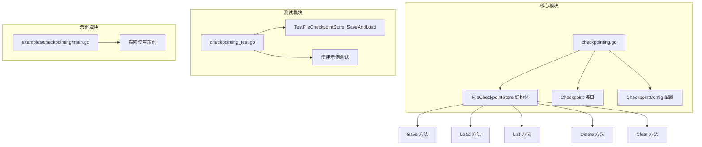
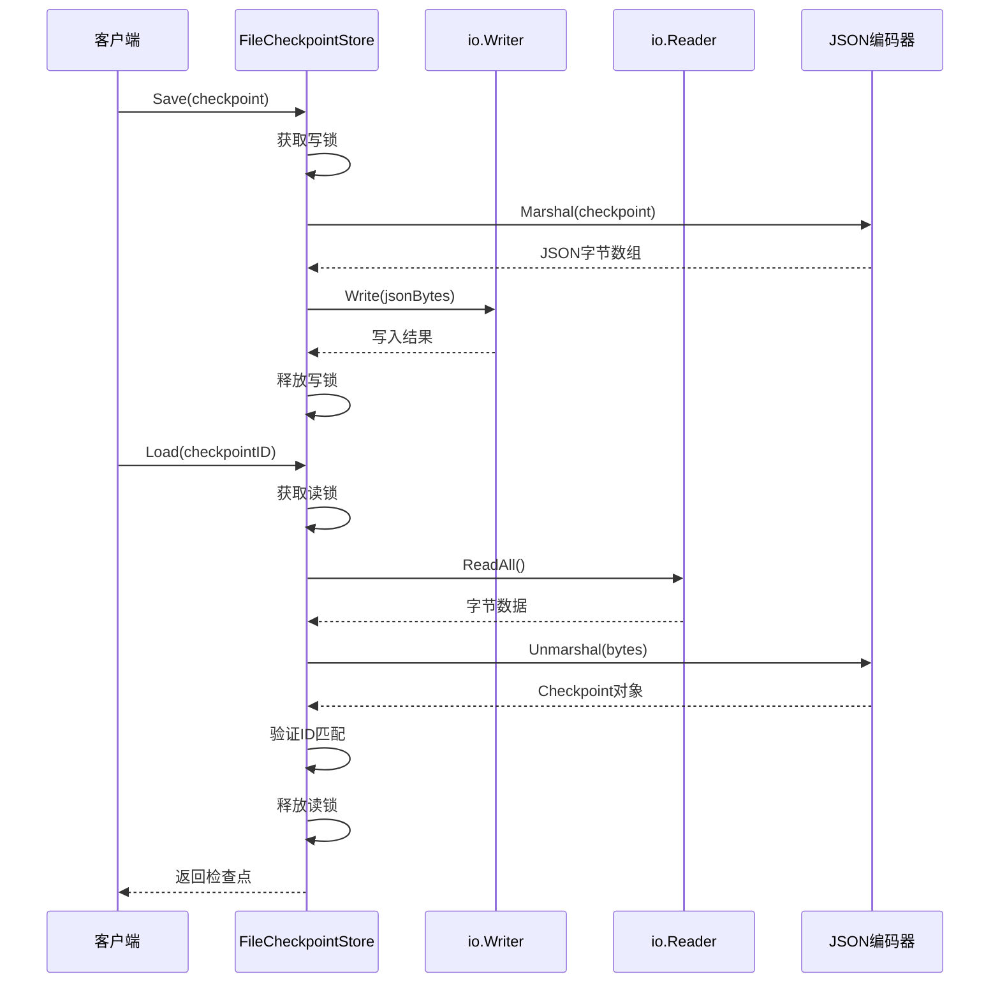
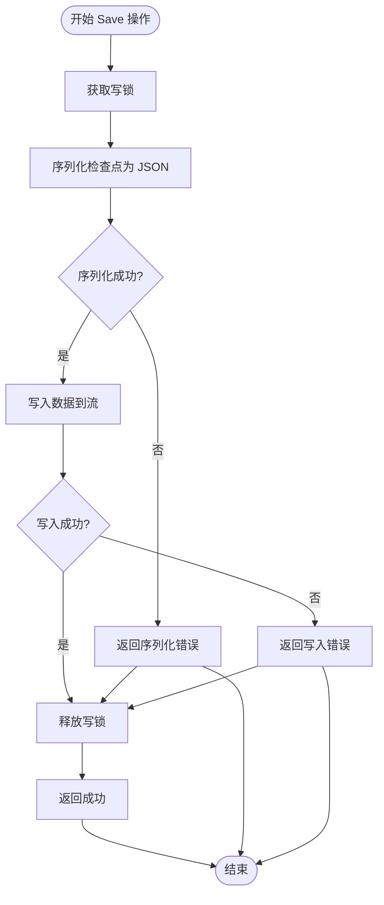
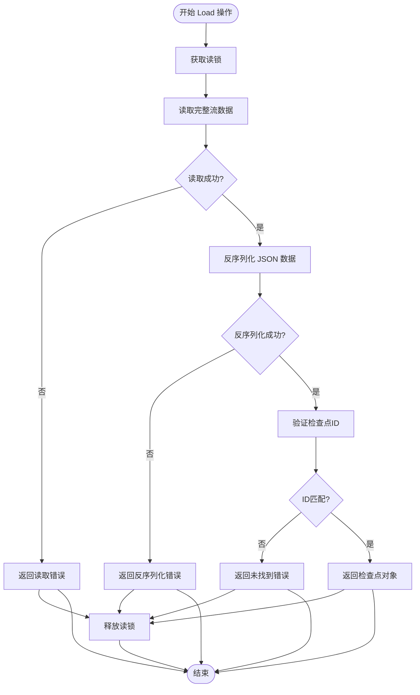
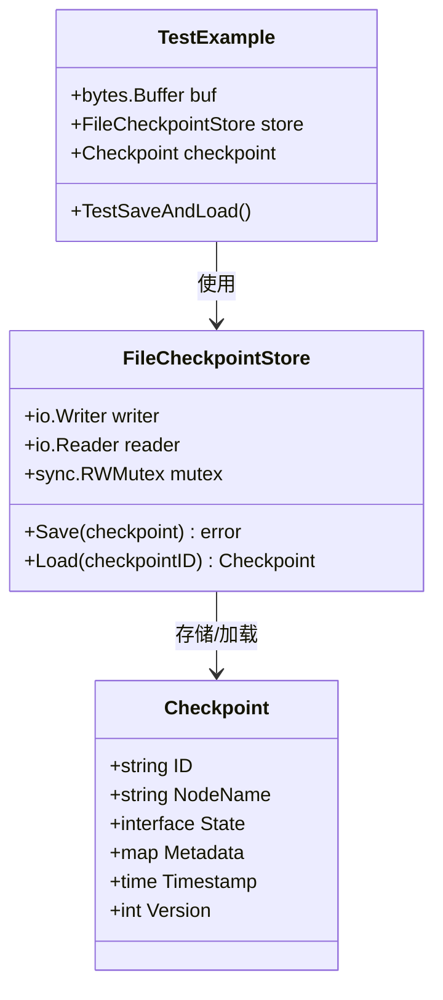
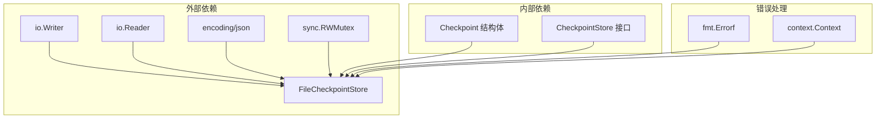

# 文件存储 (FileCheckpointStore)

<cite>
**本文档中引用的文件**
- [checkpointing.go](file://graph/checkpointing.go)
- [checkpointing_test.go](file://graph/checkpointing_test.go)
- [main.go](file://examples/checkpointing/main.go)
- [README.md](file://README.md)
</cite>

## 目录
1. [简介](#简介)
2. [项目结构](#项目结构)
3. [核心组件](#核心组件)
4. [架构概览](#架构概览)
5. [详细组件分析](#详细组件分析)
6. [依赖关系分析](#依赖关系分析)
7. [性能考虑](#性能考虑)
8. [故障排除指南](#故障排除指南)
9. [结论](#结论)

## 简介

FileCheckpointStore 是 LangGraphGo 中一个基于文件流的检查点存储实现，专门设计用于通过 `io.Writer` 和 `io.Reader` 接口提供简单的持久化存储功能。该实现当前主要用于概念验证和原型开发，在生产环境中存在一定的局限性。

FileCheckpointStore 的设计目标是提供一个轻量级的检查点存储解决方案，通过将检查点数据序列化为 JSON 格式并写入指定的输出流来实现状态持久化。然而，由于其实现的简化性质，某些关键操作（如列表、删除和清理）尚未完全实现，这限制了其在实际生产环境中的应用。

## 项目结构

FileCheckpointStore 的相关代码主要位于以下文件中：

**图表来源**
- [checkpointing.go](file://graph/checkpointing.go#L113-L186)
- [checkpointing_test.go](file://graph/checkpointing_test.go#L230-L260)

**章节来源**
- [checkpointing.go](file://graph/checkpointing.go#L113-L186)
- [checkpointing_test.go](file://graph/checkpointing_test.go#L230-L260)

## 核心组件

### FileCheckpointStore 结构体

FileCheckpointStore 是基于文件流的检查点存储实现的核心结构体，包含以下关键字段：

- **writer io.Writer**: 用于写入检查点数据的输出流接口
- **reader io.Reader**: 用于读取检查点数据的输入流接口  
- **mutex sync.RWMutex**: 提供并发安全的读写锁保护

### 主要方法

FileCheckpointStore 实现了 CheckpointStore 接口的所有方法，但其中部分方法的功能受到限制：

1. **Save()**: 将检查点序列化为 JSON 并写入流
2. **Load()**: 从流中读取并反序列化检查点数据
3. **List()**: 当前未实现，返回错误提示
4. **Delete()**: 当前未实现，返回错误提示
5. **Clear()**: 当前未实现，返回错误提示

**章节来源**
- [checkpointing.go](file://graph/checkpointing.go#L113-L186)

## 架构概览

FileCheckpointStore 采用基于流的存储架构，通过 Go 的标准库接口实现数据持久化：

**图表来源**
- [checkpointing.go](file://graph/checkpointing.go#L128-L167)

## 详细组件分析

### Save 方法实现

Save 方法负责将检查点数据持久化到指定的输出流中：

**图表来源**
- [checkpointing.go](file://graph/checkpointing.go#L128-L144)

Save 方法的关键特性：
- 使用互斥锁确保线程安全
- 将检查点对象序列化为 JSON 格式
- 通过 io.Writer 接口写入数据
- 错误处理包括序列化失败和写入失败两种情况

### Load 方法实现

Load 方法从输入流中读取并恢复检查点数据：

**图表来源**
- [checkpointing.go](file://graph/checkpointing.go#L146-L167)

Load 方法的验证逻辑：
- 读取整个流的数据内容
- 反序列化为 Checkpoint 对象
- 验证检查点 ID 是否与请求的 ID 匹配
- 如果不匹配则返回错误

### 未实现的操作

FileCheckpointStore 当前对 List、Delete 和 Clear 操作的实现存在明显限制：

| 方法 | 当前实现状态 | 原因 | 建议 |
|------|-------------|------|------|
| List | 返回错误 | 需要支持多文件读取 | 考虑分文件存储方案 |
| Delete | 返回错误 | 需要文件系统操作 | 实现基于文件的删除 |
| Clear | 返回错误 | 需要批量文件操作 | 实现执行ID过滤的清理 |

这些限制使得 FileCheckpointStore 在需要复杂文件管理的场景中无法正常使用。

**章节来源**
- [checkpointing.go](file://graph/checkpointing.go#L169-L186)

### 使用示例分析

从测试代码可以看出，FileCheckpointStore 的典型使用模式：

**图表来源**
- [checkpointing_test.go](file://graph/checkpointing_test.go#L230-L260)

**章节来源**
- [checkpointing_test.go](file://graph/checkpointing_test.go#L230-L260)

## 依赖关系分析

FileCheckpointStore 的依赖关系相对简单，主要依赖于 Go 标准库：

**图表来源**
- [checkpointing.go](file://graph/checkpointing.go#L1-L10)
- [checkpointing.go](file://graph/checkpointing.go#L113-L118)

**章节来源**
- [checkpointing.go](file://graph/checkpointing.go#L1-L10)
- [checkpointing.go](file://graph/checkpointing.go#L113-L118)

## 性能考虑

FileCheckpointStore 的性能特点：

### 优势
- **内存效率高**: 所有数据都存储在内存缓冲区中
- **序列化速度快**: 使用标准 JSON 编码器
- **并发安全**: 使用读写锁提供线程安全保证

### 局限性
- **持久化能力有限**: 数据仅存在于内存缓冲区中
- **容量受限**: 受限于可用内存大小
- **重启后丢失**: 进程重启会导致所有检查点数据丢失
- **不支持批量操作**: List、Delete、Clear 方法不可用

## 故障排除指南

### 常见问题及解决方案

| 问题类型 | 症状 | 可能原因 | 解决方案 |
|----------|------|----------|----------|
| 序列化失败 | Save 方法返回错误 | 检查点包含不可序列化的字段 | 检查 State 字段的可序列化性 |
| 读取失败 | Load 方法返回错误 | 流读取过程中发生错误 | 检查 io.Reader 实现 |
| ID 不匹配 | Load 返回未找到错误 | 流中数据不是请求的检查点 | 确保写入和读取使用相同的流 |
| 功能未实现 | List/Delete/Clear 返回错误 | 当前实现不支持这些操作 | 考虑使用其他存储实现 |

### 调试建议

1. **验证流实现**: 确保提供的 io.Writer 和 io.Reader 实现正确
2. **检查数据完整性**: 验证序列化和反序列化过程中的数据一致性
3. **监控并发访问**: 使用适当的同步机制避免竞态条件

**章节来源**
- [checkpointing.go](file://graph/checkpointing.go#L128-L167)

## 结论

FileCheckpointStore 是 LangGraphGo 中一个简单但重要的检查点存储实现，具有以下特点：

### 设计目标达成情况
- ✅ 成功实现了基于流的检查点存储
- ✅ 提供了基本的保存和加载功能
- ✅ 实现了必要的并发安全控制
- ❌ 未能实现高级文件管理功能

### 适用场景
FileCheckpointStore 最适合以下场景：
- **原型开发**: 快速验证检查点功能
- **临时测试**: 短期运行的测试环境
- **概念演示**: 展示检查点机制的工作原理

### 未来发展方向
为了提升 FileCheckpointStore 的实用性和可靠性，建议考虑以下改进：

1. **分文件存储**: 将每个检查点存储为独立文件
2. **多路复用支持**: 支持多个并发写入操作
3. **文件系统集成**: 实现完整的文件管理功能
4. **持久化优化**: 添加定期持久化到磁盘的功能

### 使用建议
鉴于当前实现的局限性，强烈建议：
- 仅在临时场景或原型开发中使用
- 在生产环境中选择更可靠的存储实现（如 Redis、PostgreSQL 或 SQLite）
- 评估具体需求后再决定是否升级到更完善的存储方案

FileCheckpointStore 作为概念验证工具，为理解检查点机制提供了良好的基础，但在实际生产环境中需要更强大的存储解决方案。