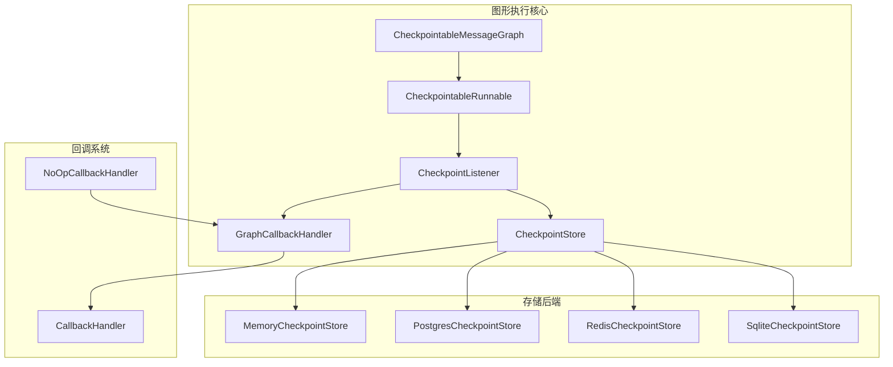
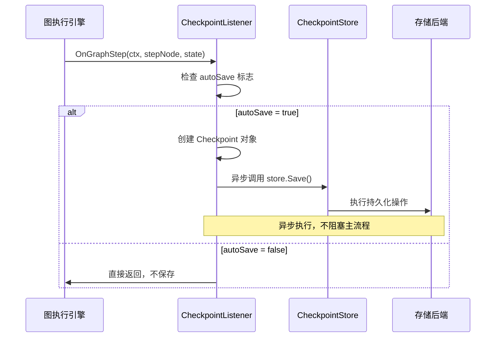
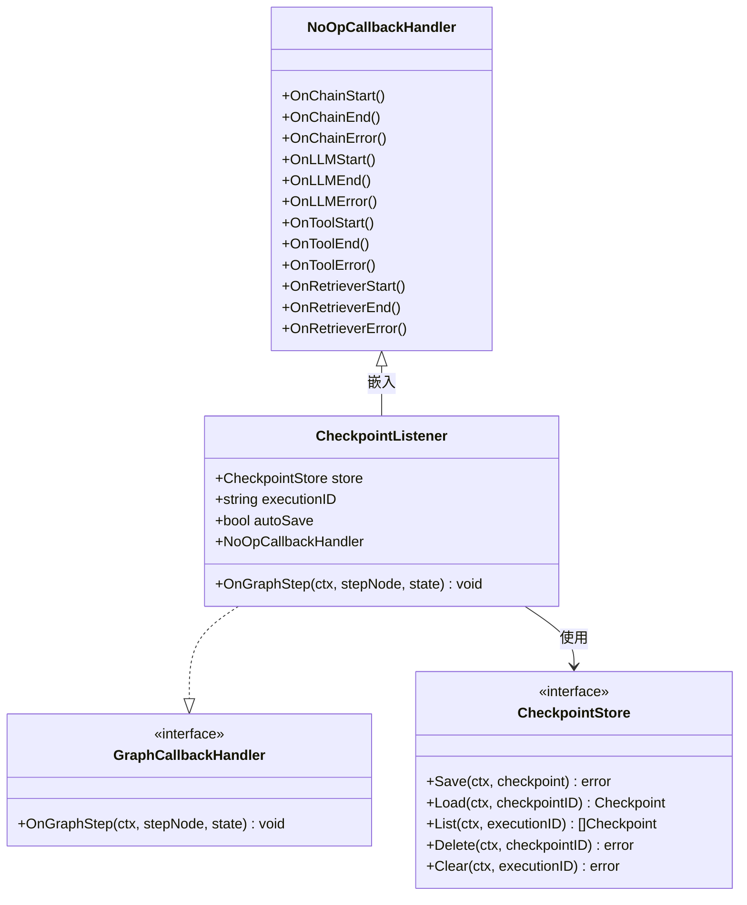
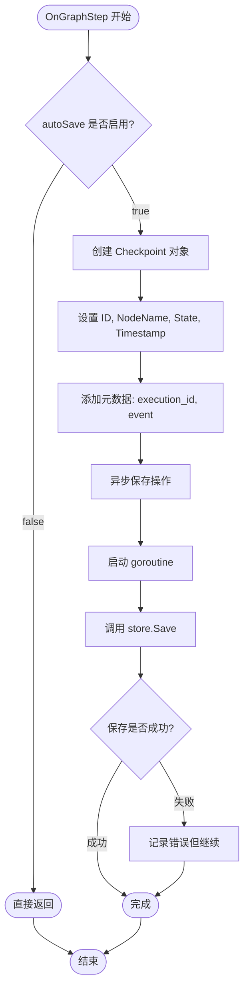
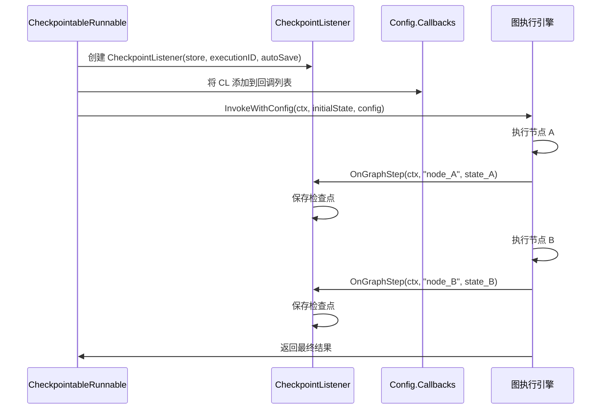
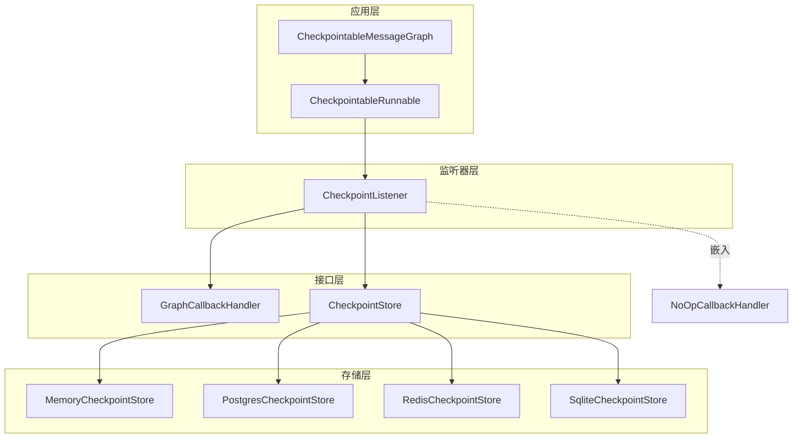

# 检查点监听器

<cite>
**本文档中引用的文件**
- [checkpointing.go](file://graph/checkpointing.go)
- [checkpointing_test.go](file://graph/checkpointing_test.go)
- [callbacks.go](file://graph/callbacks.go)
- [main.go](file://examples/checkpointing/main.go)
- [main.go](file://examples\durable_execution\main.go)
</cite>

## 目录
1. [简介](#简介)
2. [项目结构](#项目结构)
3. [核心组件](#核心组件)
4. [架构概览](#架构概览)
5. [详细组件分析](#详细组件分析)
6. [依赖关系分析](#依赖关系分析)
7. [性能考虑](#性能考虑)
8. [故障排除指南](#故障排除指南)
9. [结论](#结论)

## 简介

CheckpointListener 是 LangGraphGo 框架中的一个关键组件，作为 GraphCallbackHandler 的具体实现，负责在图执行的每个步骤自动触发检查点保存。它通过监听图节点的执行步骤，在每次节点完成执行并更新状态后自动生成检查点，为图的持久化执行提供了基础支持。

该组件的设计理念是无侵入式的自动检查点保存，通过异步操作避免阻塞主执行流程，同时提供了灵活的配置选项来控制检查点的保存行为。

## 项目结构

CheckpointListener 组件位于 LangGraphGo 的核心图形执行框架中，主要分布在以下模块：



**图表来源**
- [checkpointing.go](file://graph/checkpointing.go#L297-L304)
- [callbacks.go](file://graph/callbacks.go#L32-L36)

**章节来源**
- [checkpointing.go](file://graph/checkpointing.go#L297-L304)
- [callbacks.go](file://graph/callbacks.go#L32-L36)

## 核心组件

CheckpointListener 组件的核心功能围绕三个关键字段展开：

### 主要字段说明

| 字段名 | 类型 | 描述 | 默认值 |
|--------|------|------|--------|
| store | CheckpointStore | 存储后端接口，负责检查点的实际持久化 | - |
| executionID | string | 关联的执行流标识符，用于隔离不同执行的检查点 | 自动生成 |
| autoSave | bool | 自动保存控制开关，决定是否在每个步骤自动保存检查点 | true |

### 接口继承关系

CheckpointListener 通过嵌入 NoOpCallbackHandler 来满足 CallbackHandler 接口的所有方法要求，同时专注于 GraphCallbackHandler 特定的 OnGraphStep 方法实现。

**章节来源**
- [checkpointing.go](file://graph/checkpointing.go#L297-L304)
- [callbacks.go](file://graph/callbacks.go#L73-L94)

## 架构概览

CheckpointListener 在整个图形执行架构中扮演着监听者模式的角色，通过回调机制与图形执行引擎紧密集成：



**图表来源**
- [checkpointing.go](file://graph/checkpointing.go#L306-L329)
- [checkpointing.go](file://graph/checkpointing.go#L235-L250)

## 详细组件分析

### CheckpointListener 结构体设计



**图表来源**
- [checkpointing.go](file://graph/checkpointing.go#L297-L304)
- [callbacks.go](file://graph/callbacks.go#L32-L36)
- [callbacks.go](file://graph/callbacks.go#L73-L94)

### OnGraphStep 方法实现逻辑

OnGraphStep 方法是 CheckpointListener 的核心实现，其执行流程如下：



**图表来源**
- [checkpointing.go](file://graph/checkpointing.go#L306-L329)

#### 实现细节分析

1. **条件检查**: 首先验证 autoSave 标志，如果禁用则直接返回，避免不必要的计算
2. **检查点构建**: 创建 Checkpoint 对象，包含节点名称、当前状态、时间戳等信息
3. **元数据设置**: 添加 execution_id 和事件类型标记，便于后续查询和管理
4. **异步保存**: 使用 goroutine 启动异步保存操作，确保不会阻塞主执行流程
5. **错误处理**: 当前实现采用静默失败策略，记录错误但不中断执行

**章节来源**
- [checkpointing.go](file://graph/checkpointing.go#L306-L329)

### 与 CheckpointableRunnable 的协作机制

CheckpointListener 与 CheckpointableRunnable 之间存在密切的协作关系：



**图表来源**
- [checkpointing.go](file://graph/checkpointing.go#L235-L250)
- [checkpointing.go](file://graph/checkpointing.go#L306-L329)

**章节来源**
- [checkpointing.go](file://graph/checkpointing.go#L235-L250)

## 依赖关系分析

CheckpointListener 的依赖关系体现了清晰的分层架构：



**图表来源**
- [checkpointing.go](file://graph/checkpointing.go#L297-L304)
- [checkpointing.go](file://graph/checkpointing.go#L22-L37)

### 关键依赖说明

1. **GraphCallbackHandler**: 定义了监听器必须实现的回调接口
2. **CheckpointStore**: 抽象了不同的存储后端实现
3. **NoOpCallbackHandler**: 提供了默认的空实现，简化接口实现

**章节来源**
- [checkpointing.go](file://graph/checkpointing.go#L22-L37)
- [callbacks.go](file://graph/callbacks.go#L32-L36)

## 性能考虑

### 异步保存的优势与风险

CheckpointListener 采用异步保存策略具有以下特点：

#### 优势
- **非阻塞性**: 异步操作确保图形执行不会被检查点保存延迟影响
- **高吞吐量**: 允许连续的节点执行而无需等待持久化完成
- **资源隔离**: 持久化操作在独立的 goroutine 中执行

#### 潜在风险
- **错误静默**: 当前实现忽略保存错误，可能导致数据丢失
- **内存占用**: 大量未完成的异步操作可能增加内存压力
- **一致性问题**: 异步特性可能导致检查点与实际状态不一致

### 性能优化建议

#### 错误处理改进
```go
// 改进后的错误处理示例
go func(ctx context.Context) {
    if saveErr := cl.store.Save(ctx, checkpoint); saveErr != nil {
        // 记录错误日志
        log.Printf("检查点保存失败: %v", saveErr)
        // 可选: 触发重试机制
        cl.retrySave(checkpoint)
    }
}(ctx)
```

#### 批量保存策略
对于高频率的节点执行场景，可以考虑批量保存策略：
- 缓存多个检查点直到达到阈值
- 定期批量写入存储后端
- 实现背压机制防止内存溢出

#### 重试机制
实现指数退避的重试机制：
- 初始重试间隔：100ms
- 最大重试次数：3次
- 最大间隔：5秒

## 故障排除指南

### 常见问题诊断

#### 检查点未保存
**症状**: 图执行完成后没有检查点记录
**可能原因**:
1. autoSave 设置为 false
2. 存储后端配置错误
3. 异步保存被提前终止

**解决方案**:
```go
// 检查配置
fmt.Printf("AutoSave: %v\n", config.AutoSave)
fmt.Printf("Store Type: %T\n", config.Store)

// 验证存储连接
err := config.Store.Save(ctx, &Checkpoint{ID: "test"})
if err != nil {
    fmt.Printf("存储连接失败: %v\n", err)
}
```

#### 异步保存失败
**症状**: 执行过程中出现 goroutine 泄漏
**可能原因**:
1. 上下文提前取消
2. 存储后端响应超时
3. 内存不足导致 goroutine 阻塞

**解决方案**:
- 实现上下文感知的异步保存
- 添加超时控制
- 监控 goroutine 数量

**章节来源**
- [checkpointing_test.go](file://graph/checkpointing_test.go#L648-L691)

## 结论

CheckpointListener 作为 LangGraphGo 框架中的核心组件，通过巧妙的设计实现了无侵入式的自动检查点保存功能。其异步处理机制确保了图形执行的流畅性，而灵活的配置选项则满足了不同应用场景的需求。

### 主要优势
- **自动化程度高**: 无需手动干预即可实现完整的检查点保存
- **性能优异**: 异步操作避免了执行阻塞
- **扩展性强**: 支持多种存储后端和配置选项
- **集成度好**: 与现有回调系统无缝集成

### 改进建议
1. **增强错误处理**: 实现更健壮的错误报告和重试机制
2. **批量优化**: 引入批量保存策略提高效率
3. **监控增强**: 添加检查点保存状态的监控指标
4. **配置丰富**: 提供更多细粒度的配置选项

CheckpointListener 的设计体现了现代软件架构中关注点分离和性能优先的设计原则，为构建可靠的图形执行系统奠定了坚实的基础。