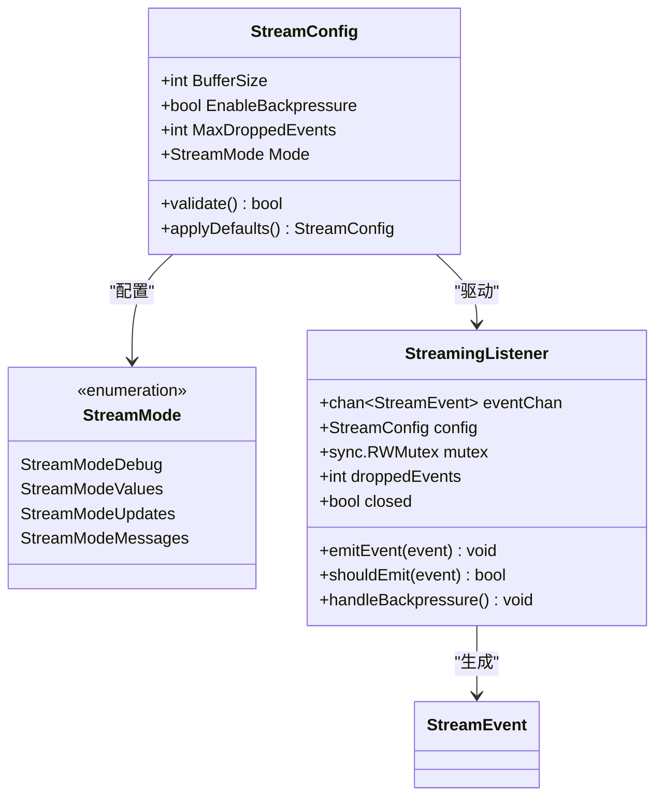
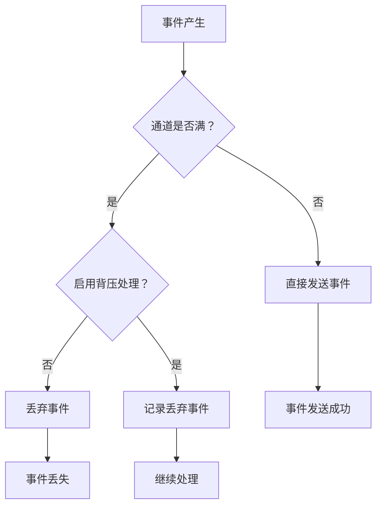
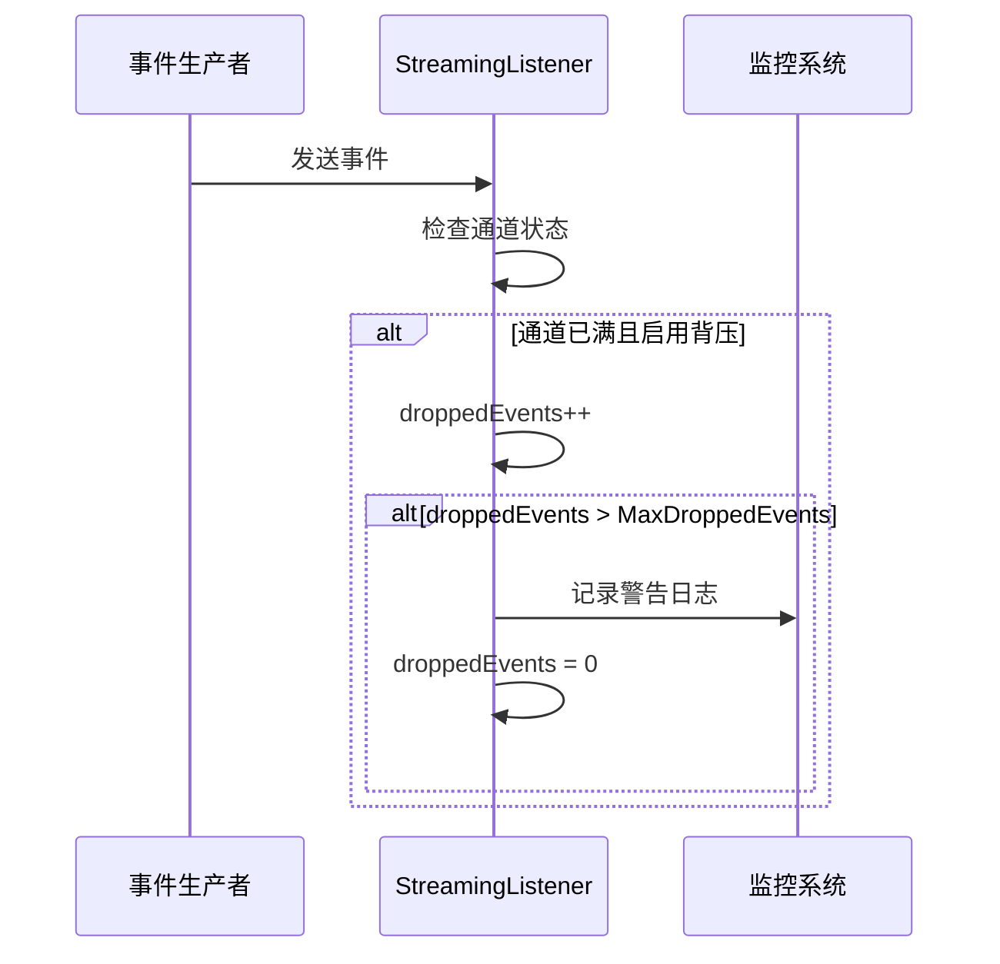
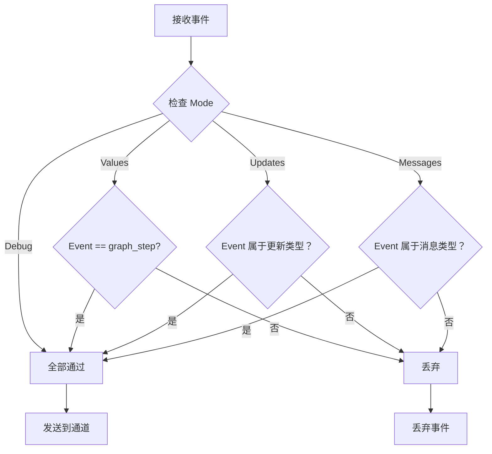

# 流式配置

<cite>
**本文档中引用的文件**
- [streaming.go](file://graph/streaming.go)
- [listeners.go](file://graph/listeners.go)
- [streaming_test.go](file://graph/streaming_test.go)
- [main.go](file://examples/streaming_modes/main.go)
- [main.go](file://examples\streaming_pipeline\main.go)
</cite>

## 目录
1. [简介](#简介)
2. [StreamConfig 结构体详解](#streamconfig-结构体详解)
3. [核心配置参数分析](#核心配置参数分析)
4. [流式模式与配置关系](#流式模式与配置关系)
5. [默认配置分析](#默认配置分析)
6. [性能优化指南](#性能优化指南)
7. [实际应用场景](#实际应用场景)
8. [故障排除](#故障排除)
9. [总结](#总结)

## 简介

`StreamConfig` 是 LangGraph Go 框架中用于配置流式行为的核心结构体。它提供了对事件通道缓冲、背压处理、事件过滤和流式模式的精细控制，使开发者能够根据具体需求优化流式执行的性能和可靠性。

## StreamConfig 结构体详解



**图表来源**
- [streaming.go](file://graph/streaming.go#L23-L35)
- [streaming.go](file://graph/streaming.go#L10-L21)

**章节来源**
- [streaming.go](file://graph/streaming.go#L23-L35)

## 核心配置参数分析

### BufferSize：事件通道缓冲区大小

`BufferSize` 参数定义了事件通道的缓冲区容量，直接影响内存占用和事件处理能力。

#### 内存占用计算

事件通道的内存占用可以通过以下公式估算：
```
内存占用 = BufferSize × 平均事件大小
```

其中平均事件大小取决于 `StreamEvent` 的结构：
- `Timestamp`: 8字节 (time.Time)
- `NodeName`: 变长字符串
- `Event`: 8字节 (NodeEvent)
- `State`: 接口类型，取决于具体状态数据
- `Error`: 错误对象，通常较小
- `Metadata`: 映射，取决于键值对数量
- `Duration`: 8字节 (time.Duration)

#### 性能影响分析

| BufferSize | 事件丢失风险 | 内存占用 | 吞吐量 | 延迟 |
|------------|-------------|----------|--------|------|
| 100-500 | 中等 | 低 | 中等 | 低 |
| 500-1000 | 较低 | 中等 | 高 | 中等 |
| 1000-2000 | 很低 | 高 | 很高 | 较高 |
| >2000 | 极低 | 很高 | 极高 | 高 |

**章节来源**
- [streaming.go](file://graph/streaming.go#L25-L26)

### EnableBackpressure：背压处理开关

`EnableBackpressure` 控制是否启用背压处理机制，防止事件积压导致内存溢出。

#### 背压处理机制



**图表来源**
- [streaming.go](file://graph/streaming.go#L99-L108)

#### 背压策略

当启用背压处理时，系统会：
1. **记录丢弃事件计数**：通过 `droppedEvents` 计数器跟踪丢失的事件数量
2. **提供监控指标**：可通过 `GetDroppedEventsCount()` 获取统计信息
3. **保持系统稳定性**：防止内存持续增长导致系统崩溃

**章节来源**
- [streaming.go](file://graph/streaming.go#L28-L29)
- [streaming.go](file://graph/streaming.go#L252-L261)

### MaxDroppedEvents：最大丢弃事件阈值

`MaxDroppedEvents` 定义了在记录丢弃事件之前允许的最大事件数量。

#### 日志记录机制



**图表来源**
- [streaming.go](file://graph/streaming.go#L252-L261)

#### 配置建议

| 场景 | MaxDroppedEvents 建议 | 说明 |
|------|---------------------|------|
| 高并发系统 | 100-500 | 频繁丢弃事件可能表示系统过载 |
| 低延迟要求 | 50-100 | 快速响应，容忍少量事件丢失 |
| 批处理系统 | 500-1000 | 处理大量数据，可接受较高丢弃率 |
| 关键业务 | 10-20 | 最小化事件丢失，确保数据完整性 |

**章节来源**
- [streaming.go](file://graph/streaming.go#31-L32)

### Mode：流式模式配置

`Mode` 字段决定了流式系统应该发出哪种类型的事件，直接影响事件过滤和处理逻辑。

#### 流式模式对比

| 模式 | 描述 | 适用场景 | 事件类型 |
|------|------|----------|----------|
| `StreamModeDebug` | 发出所有内部事件 | 调试和深度分析 | 所有事件类型 |
| `StreamModeValues` | 发出完整状态更新 | 状态可视化、调试 | `graph_step` |
| `StreamModeUpdates` | 发出节点输出更新 | 进度跟踪、工具执行 | `ToolEnd`, `ChainEnd`, `NodeEventComplete` |
| `StreamModeMessages` | 发出 LLM 消息令牌 | 实时聊天、文本生成 | `LLMStart`, `LLMEnd` |

#### 事件过滤逻辑



**图表来源**
- [streaming.go](file://graph/streaming.go#L112-L132)

**章节来源**
- [streaming.go](file://graph/streaming.go#L10-L21)
- [streaming.go](file://graph/streaming.go#L112-L132)

## 流式模式与配置关系

不同流式模式对配置参数的影响：

### Debug 模式
- **推荐 BufferSize**: 1000-2000（需要存储大量调试信息）
- **EnableBackpressure**: true（防止调试信息过多导致内存问题）
- **MaxDroppedEvents**: 200-500（调试信息重要，不能轻易丢弃）

### Values 模式  
- **推荐 BufferSize**: 500-1000（状态更新相对较少）
- **EnableBackpressure**: true（保持一致性）
- **MaxDroppedEvents**: 50-100（状态更新可以适当容忍丢失）

### Updates 模式
- **推荐 BufferSize**: 300-800（工具和链的输出频率适中）
- **EnableBackpressure**: true（保证进度跟踪的连续性）
- **MaxDroppedEvents**: 30-80（进度信息重要但可容忍少量丢失）

### Messages 模式
- **推荐 BufferSize**: 100-300（LLM 令牌流，频率高但单个事件小）
- **EnableBackpressure**: true（防止实时流阻塞）
- **MaxDroppedEvents**: 10-30（实时性要求高，但丢失少量令牌可接受）

## 默认配置分析

```go
func DefaultStreamConfig() StreamConfig {
    return StreamConfig{
        BufferSize:         1000,
        EnableBackpressure: true,
        MaxDroppedEvents:   100,
        Mode:               StreamModeDebug,
    }
}
```

### 默认配置合理性分析

#### BufferSize: 1000
- **平衡点**: 在内存占用和吞吐量之间找到平衡
- **典型场景**: 适用于大多数中等复杂度的图执行
- **扩展性**: 可根据具体负载情况进行调整

#### EnableBackpressure: true
- **安全性**: 防止内存泄漏和系统崩溃
- **稳定性**: 提供可靠的错误处理机制
- **监控**: 通过丢弃事件计数器提供性能洞察

#### MaxDroppedEvents: 100
- **阈值设置**: 在性能和可靠性之间取得平衡
- **监控价值**: 提供足够的历史信息用于性能分析
- **可配置性**: 允许根据具体需求调整

#### Mode: StreamModeDebug
- **开发友好**: 提供最全面的调试信息
- **学习价值**: 帮助开发者理解系统行为
- **生产就绪**: 在生产环境中可根据需要切换到更高效的模式

**章节来源**
- [streaming.go](file://graph/streaming.go#L38-L46)

## 性能优化指南

### 高并发场景优化

#### 配置建议
```go
highConcurrencyConfig := StreamConfig{
    BufferSize:         2000,           // 增大缓冲区应对高并发
    EnableBackpressure: true,           // 启用背压保护
    MaxDroppedEvents:   500,           // 增加丢弃阈值
    Mode:               StreamModeUpdates, // 使用高效模式
}
```

#### 优化策略
1. **选择合适的模式**: 使用 `StreamModeUpdates` 或 `StreamModeValues`
2. **调整缓冲区大小**: 根据并发量动态调整
3. **监控丢弃事件**: 设置合理的 `MaxDroppedEvents`
4. **连接池管理**: 复用连接减少创建开销

### 低延迟场景优化

#### 配置建议
```go
lowLatencyConfig := StreamConfig{
    BufferSize:         100,            // 小缓冲区降低延迟
    EnableBackpressure: true,           // 保持稳定性
    MaxDroppedEvents:   20,            // 快速响应丢弃事件
    Mode:               StreamModeUpdates, // 实时更新
}
```

#### 优化策略
1. **最小化缓冲区**: 减少事件排队时间
2. **快速丢弃策略**: 及时处理背压情况
3. **事件过滤**: 使用精确的模式配置
4. **异步处理**: 非阻塞事件处理

### 内存受限环境优化

#### 配置建议
```go
memoryConstrainedConfig := StreamConfig{
    BufferSize:         500,            // 减少内存占用
    EnableBackpressure: true,           // 防止内存泄漏
    MaxDroppedEvents:   50,            // 严格控制丢弃
    Mode:               StreamModeValues, // 减少事件频率
}
```

#### 优化策略
1. **压缩事件数据**: 减少单个事件的内存占用
2. **批量处理**: 减少频繁的内存分配
3. **及时清理**: 主动释放不需要的事件
4. **监控内存使用**: 实时跟踪内存消耗

## 实际应用场景

### 示例 1：实时聊天系统

```go
// 配置用于实时聊天的流式系统
chatConfig := StreamConfig{
    BufferSize:         300,            // 适合高频消息流
    EnableBackpressure: true,           // 防止消息积压
    MaxDroppedEvents:   30,            // 快速响应丢弃
    Mode:               StreamModeMessages, // 专注于消息事件
}
```

### 示例 2：批处理系统

```go
// 配置用于批处理的流式系统
batchConfig := StreamConfig{
    BufferSize:         1500,           // 大缓冲区处理大量数据
    EnableBackpressure: true,           // 保护系统稳定性
    MaxDroppedEvents:   1000,          // 容忍较高丢弃率
    Mode:               StreamModeValues, // 关注状态变化
}
```

### 示例 3：监控系统

```go
// 配置用于系统监控的流式系统
monitoringConfig := StreamConfig{
    BufferSize:         800,            // 平衡性能和内存
    EnableBackpressure: true,           // 确保监控不中断
    MaxDroppedEvents:   200,           // 提供足够历史信息
    Mode:               StreamModeUpdates, // 关注系统状态
}
```

**章节来源**
- [main.go](file://examples\streaming_modes\main.go#L32-L35)
- [main.go](file://examples\streaming_pipeline\main.go#L13-L29)

## 故障排除

### 常见问题及解决方案

#### 问题 1：内存持续增长
**症状**: 应用程序内存使用量不断增加
**原因**: 事件通道缓冲区过大或背压处理失效
**解决方案**:
1. 减小 `BufferSize` 参数
2. 确保 `EnableBackpressure` 设置为 true
3. 监控 `GetDroppedEventsCount()` 返回值

#### 问题 2：事件丢失严重
**症状**: 应用程序报告大量事件丢失
**原因**: 缓冲区太小或丢弃阈值过高
**解决方案**:
1. 增大 `BufferSize` 参数
2. 调整 `MaxDroppedEvents` 到合理范围
3. 检查事件处理速度是否跟不上生成速度

#### 问题 3：性能下降
**症状**: 流式执行速度明显变慢
**原因**: 不合适的配置参数
**解决方案**:
1. 分析当前配置是否适合工作负载
2. 考虑使用更高效的流式模式
3. 优化事件处理逻辑

#### 问题 4：调试困难
**症状**: 无法获取足够的调试信息
**原因**: 使用了过于严格的配置
**解决方案**:
1. 切换到 `StreamModeDebug` 模式
2. 增大缓冲区大小
3. 临时禁用背压处理（仅用于调试）

### 监控和诊断

#### 关键指标监控
```go
// 监控流式系统的健康状况
func monitorStreamingHealth(sl *StreamingListener) {
    droppedCount := sl.GetDroppedEventsCount()
    bufferSize := getCurrentBufferSize()
    
    if droppedCount > 0 {
        log.Printf("警告: 已丢弃 %d 个事件", droppedCount)
    }
    
    if bufferSize > 0.8 * maxBufferSize {
        log.Printf("警告: 缓冲区使用率 %.1f%%", (float64(bufferSize)/float64(maxBufferSize))*100)
    }
}
```

## 总结

`StreamConfig` 结构体为 LangGraph Go 提供了强大而灵活的流式配置能力。通过合理配置各个参数，开发者可以在性能、可靠性和资源使用之间找到最佳平衡点。

### 关键要点

1. **BufferSize** 是影响内存占用和吞吐量的关键参数，需要根据具体工作负载进行调整
2. **EnableBackpressure** 提供了系统稳定性的保障，建议始终启用
3. **MaxDroppedEvents** 为系统监控提供了重要指标，有助于识别性能瓶颈
4. **Mode** 字段的选择直接影响事件过滤和处理效率，应根据应用场景选择合适的模式

### 最佳实践建议

1. **从默认配置开始**: 使用 `DefaultStreamConfig()` 作为起点
2. **渐进式优化**: 根据监控数据逐步调整参数
3. **场景化配置**: 针对不同应用场景采用专门的配置
4. **持续监控**: 建立完善的监控体系跟踪系统性能

通过深入理解和合理运用 `StreamConfig`，开发者可以构建出高性能、高可靠性的流式处理系统，满足各种复杂的应用需求。