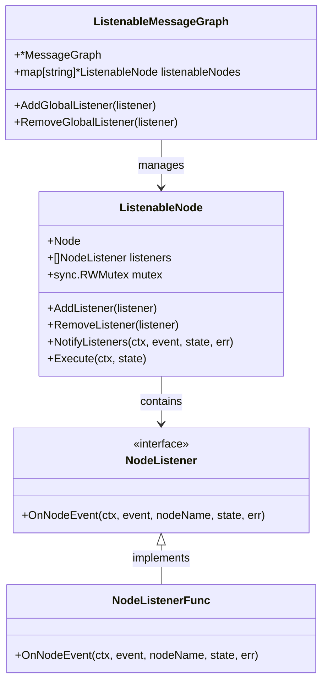
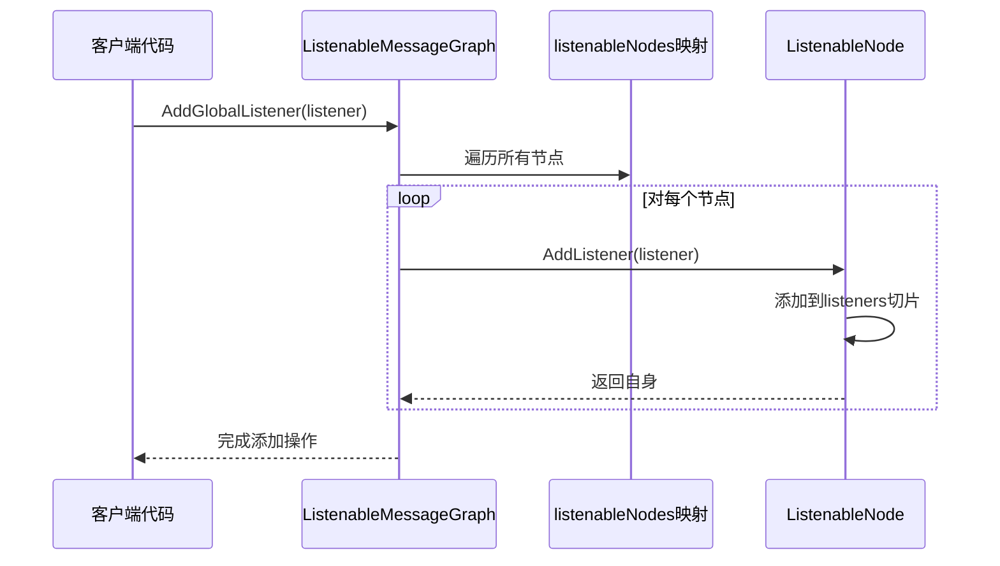
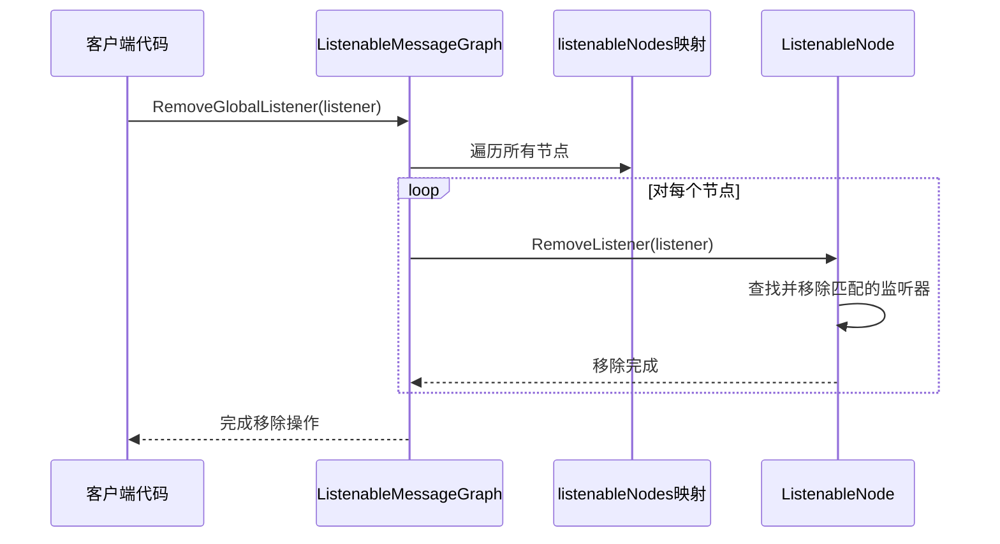
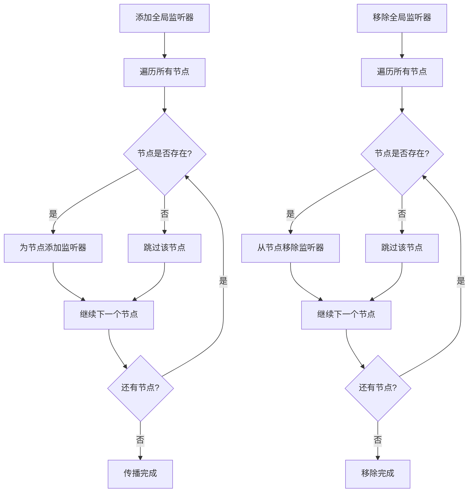
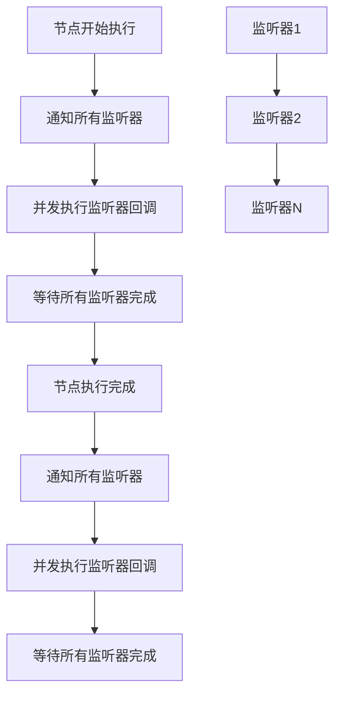
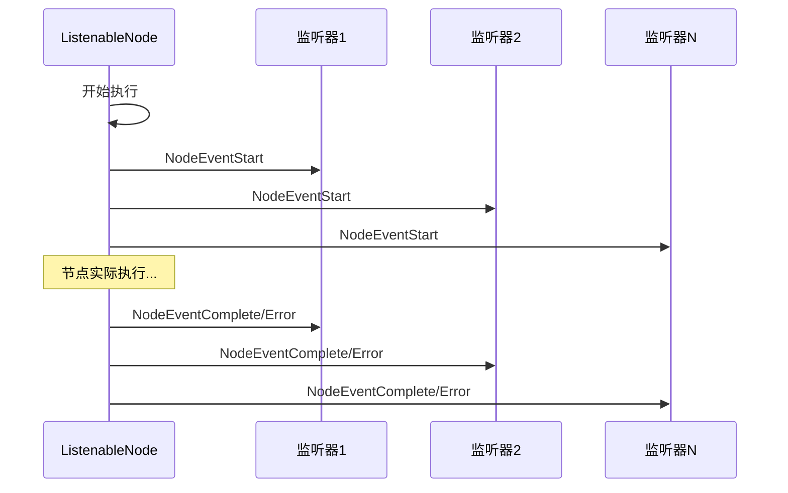
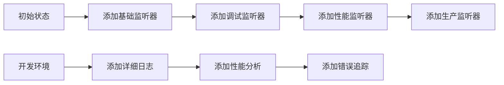

# 全局监听器

<cite>
**本文档中引用的文件**
- [listeners.go](file://graph/listeners.go)
- [listeners_test.go](file://graph/listeners_test.go)
- [builtin_listeners.go](file://graph/builtin_listeners.go)
- [streaming.go](file://graph/streaming.go)
- [builtin_listeners_test.go](file://graph/builtin_listeners_test.go)
</cite>

## 目录
1. [简介](#简介)
2. [核心概念](#核心概念)
3. [AddGlobalListener 实现原理](#addgloballistener-实现原理)
4. [RemoveGlobalListener 实现原理](#removegloballistener-实现原理)
5. [全局监听器传播机制](#全局监听器传播机制)
6. [多节点环境下的执行优先级](#多节点环境下的执行优先级)
7. [事件通知顺序分析](#事件通知顺序分析)
8. [工程价值与应用场景](#工程价值与应用场景)
9. [性能考虑](#性能考虑)
10. [最佳实践](#最佳实践)
11. [总结](#总结)

## 简介

全局监听器是 LangGraphGo 框架中的一个核心特性，它允许开发者为整个消息图中的所有节点统一添加监听器，从而实现跨节点的统一监控、日志记录、指标收集等功能。通过 `AddGlobalListener` 和 `RemoveGlobalListener` 方法，开发者可以批量管理监听器，大大简化了多节点环境下的监控策略部署。

## 核心概念

### 监听器接口定义

框架定义了 `NodeListener` 接口作为监听器的基础契约：



**图表来源**
- [listeners.go](file://graph/listeners.go#L51-L63)
- [listeners.go](file://graph/listeners.go#L89-L94)
- [listeners.go](file://graph/listeners.go#L187-L191)

### 节点事件类型

框架支持多种节点事件类型，每种事件对应不同的生命周期阶段：

| 事件类型 | 描述 | 触发时机 |
|---------|------|----------|
| `NodeEventStart` | 节点开始执行 | 调用 `Execute` 方法时 |
| `NodeEventComplete` | 节点成功完成 | 节点函数返回成功结果时 |
| `NodeEventError` | 节点执行出错 | 节点函数返回错误时 |
| `NodeEventProgress` | 节点执行进度 | 节点执行过程中的进度更新 |

## AddGlobalListener 实现原理

### 方法签名与功能

`AddGlobalListener` 方法位于 `ListenableMessageGraph` 类型中，负责将指定的监听器添加到图中的所有节点：



**图表来源**
- [listeners.go](file://graph/listeners.go#L222-L227)

### 遍历机制详解

方法内部使用简单的循环遍历 `listenableNodes` 映射：

1. **映射结构**：`listenableNodes` 是一个字符串到 `ListenableNode` 的映射，键是节点名称，值是对应的监听节点实例
2. **遍历方式**：使用 `for _, node := range g.listenableNodes` 进行迭代
3. **批量操作**：对每个节点调用 `AddListener` 方法，确保监听器被正确添加

### 并发安全性

虽然 `AddGlobalListener` 本身不涉及并发控制，但底层的 `AddListener` 方法已经实现了线程安全：

- 使用互斥锁保护 `listeners` 切片的访问
- 在添加监听器时进行原子操作
- 确保多个 goroutine 同时添加监听器时的数据一致性

**节来源**
- [listeners.go](file://graph/listeners.go#L222-L227)
- [listeners.go](file://graph/listeners.go#L104-L111)

## RemoveGlobalListener 实现原理

### 方法设计与实现

`RemoveGlobalListener` 方法与 `AddGlobalListener` 对称，负责从所有节点中移除指定的监听器：



**图表来源**
- [listeners.go](file://graph/listeners.go#L229-L234)

### 移除算法分析

移除操作采用线性查找算法：

1. **查找匹配**：使用对象比较（`l == listener`）来识别要移除的监听器
2. **数组操作**：使用切片操作符进行元素删除
3. **索引处理**：正确处理删除后的数组索引

### 性能特征

- **时间复杂度**：O(n)，其中 n 是节点数量
- **空间复杂度**：O(1)，只使用常量额外空间
- **稳定性**：保持监听器的相对顺序不变

**节来源**
- [listeners.go](file://graph/listeners.go#L229-L234)
- [listeners.go](file://graph/listeners.go#L113-L125)

## 全局监听器传播机制

### 多节点环境下的传播

在多节点环境中，全局监听器的传播遵循以下机制：



**图表来源**
- [listeners.go](file://graph/listeners.go#L222-L234)

### 统一监控策略部署

全局监听器特别适用于以下场景：

1. **统一日志记录**：为所有节点添加统一的日志监听器
2. **性能监控**：收集所有节点的执行时间和错误统计
3. **调试支持**：在开发过程中快速添加调试监听器
4. **审计跟踪**：记录所有节点的执行历史

### 动态配置能力

全局监听器支持运行时动态添加和移除，提供了灵活的监控策略调整能力：

- **热插拔**：无需重启应用即可更改监听器配置
- **条件启用**：根据环境或配置动态启用特定监听器
- **资源优化**：在不需要时及时移除监听器以节省资源

**节来源**
- [listeners_test.go](file://graph/listeners_test.go#L239-L289)

## 多节点环境下的执行优先级

### 监听器执行顺序

在多节点环境下，全局监听器的执行遵循以下优先级规则：



**图表来源**
- [listeners.go](file://graph/listeners.go#L128-L157)

### 并发执行机制

框架使用 `sync.WaitGroup` 来管理监听器的并发执行：

1. **启动并发goroutine**：为每个监听器启动独立的goroutine
2. **异常恢复**：使用 `defer recover()` 捕获监听器中的panic
3. **同步等待**：使用 `WaitGroup.Wait()` 等待所有监听器完成

### 执行优先级保证

虽然监听器是并发执行的，但框架确保以下优先级：

1. **节点级别优先**：同一节点的所有监听器按添加顺序执行
2. **事件类型优先**：开始事件先于完成事件执行
3. **错误处理优先**：错误事件具有最高优先级

**节来源**
- [listeners.go](file://graph/listeners.go#L128-L157)

## 事件通知顺序分析

### 单节点事件序列

对于单个节点，事件通知遵循严格的顺序：



**图表来源**
- [listeners.go](file://graph/listeners.go#L159-L175)

### 多节点事件交错

在多节点环境中，事件可能会交错出现：

| 时间点 | 节点1事件 | 节点2事件 | 节点3事件 |
|--------|-----------|-----------|-----------|
| 1 | Start | - | - |
| 2 | - | Start | - |
| 3 | Complete | - | - |
| 4 | - | Complete | - |
| 5 | - | - | Start |
| 6 | - | - | Complete |

### 异步处理特性

全局监听器采用异步处理模式：

1. **非阻塞执行**：监听器回调不会阻塞节点执行
2. **并发处理**：多个监听器同时处理事件
3. **错误隔离**：单个监听器的错误不影响其他监听器

**节来源**
- [listeners_test.go](file://graph/listeners_test.go#L291-L369)

## 工程价值与应用场景

### 统一监控策略部署的价值

全局监听器在工程实践中具有重要价值：

#### 1. 减少重复配置

传统方法需要为每个节点单独添加监听器：
```go
// 传统方式：需要为每个节点单独添加监听器
node1.AddListener(loggingListener)
node1.AddListener(metricsListener)
node2.AddListener(loggingListener)
node2.AddListener(metricsListener)
```

使用全局监听器后：
```go
// 全局方式：一次添加，影响所有节点
graph.AddGlobalListener(loggingListener)
graph.AddGlobalListener(metricsListener)
```

#### 2. 提高可维护性

- **集中管理**：所有监听器配置集中在一处
- **一致性保证**：确保所有节点使用相同的监听器配置
- **配置变更**：只需修改一处即可影响所有节点

#### 3. 支持渐进式部署

全局监听器支持渐进式监控策略部署：



### 典型应用场景

#### 应用程序监控

```go
// 创建多个内置监听器
progressListener := graph.NewProgressListener()
loggingListener := graph.NewLoggingListener()
metricsListener := graph.NewMetricsListener()

// 全局添加到所有节点
graph.AddGlobalListener(progressListener)
graph.AddGlobalListener(loggingListener)
graph.AddGlobalListener(metricsListener)
```

#### 实时流处理

在流处理场景中，全局监听器可以提供实时的事件流：

```go
// 创建流式监听器
streamingListener := graph.NewStreamingListener(eventChannel)

// 全局添加到所有节点
graph.AddGlobalListener(streamingListener)

// 启动流处理
streamResult := runnable.Stream(ctx, initialState)
```

#### 分布式系统监控

在分布式系统中，全局监听器可以收集跨服务的执行信息：

- **链路追踪**：记录请求在整个工作流中的流转
- **性能分析**：收集各节点的执行时间分布
- **错误聚合**：统一收集和分析错误信息

**节来源**
- [builtin_listeners.go](file://graph/builtin_listeners.go#L1-L433)
- [streaming.go](file://graph/streaming.go#L290-L334)

## 性能考虑

### 内存使用优化

全局监听器的内存使用主要体现在以下几个方面：

#### 1. 监听器存储

- **映射开销**：`listenableNodes` 映射占用额外内存
- **切片容量**：每个 `ListenableNode` 的 `listeners` 切片预分配空间
- **对象引用**：监听器对象的引用关系

#### 2. 并发开销

- **goroutine创建**：每个事件触发都会创建新的goroutine
- **WaitGroup管理**：维护并发同步状态
- **锁竞争**：读写锁的使用可能产生竞争

### 性能优化策略

#### 1. 监听器选择性添加

```go
// 只为关键节点添加详细监听器
criticalNodes := []string{"validation", "persistence"}
for _, node := range criticalNodes {
    if listenableNode := graph.GetListenableNode(node); listenableNode != nil {
        listenableNode.AddListener(detailedListener)
    }
}
```

#### 2. 监听器生命周期管理

```go
// 及时移除不需要的监听器
defer graph.RemoveGlobalListener(temporaryListener)
```

#### 3. 异步处理优化

- **缓冲区大小**：合理设置事件缓冲区大小
- **背压处理**：实现适当的背压机制
- **超时控制**：为监听器回调设置合理的超时

### 基准测试结果

根据测试代码显示，全局监听器的性能特征：

- **添加性能**：O(n) 时间复杂度，n为节点数量
- **移除性能**：O(n*m) 最坏情况，m为平均监听器数量
- **事件通知**：O(m) 并发处理，m为监听器数量

**节来源**
- [listeners_test.go](file://graph/listeners_test.go#L460-L510)

## 最佳实践

### 监听器设计原则

#### 1. 单一职责原则

每个监听器应该专注于单一功能：

```go
// 好的设计：专门的日志监听器
type LoggingListener struct {
    logger *log.Logger
}

// 好的设计：专门的指标监听器
type MetricsListener struct {
    metricsCollector *MetricsCollector
}
```

#### 2. 异常安全原则

确保监听器不会因异常影响主流程：

```go
func (l *SafeListener) OnNodeEvent(ctx context.Context, event NodeEvent, nodeName string, state interface{}, err error) {
    defer func() {
        if r := recover(); r != nil {
            // 记录异常但不中断主流程
            log.Printf("Listener panicked: %v", r)
        }
    }()
    
    // 正常业务逻辑
    l.processEvent(event, nodeName, state, err)
}
```

#### 3. 资源管理原则

合理管理监听器使用的资源：

```go
type ResourceAwareListener struct {
    bufferPool *sync.Pool
    timeout    time.Duration
}

func (l *ResourceAwareListener) OnNodeEvent(ctx context.Context, event NodeEvent, nodeName string, state interface{}, err error) {
    ctx, cancel := context.WithTimeout(ctx, l.timeout)
    defer cancel()
    
    // 使用带超时的上下文
    select {
    case <-ctx.Done():
        return
    default:
        l.processEvent(event, nodeName, state, err)
    }
}
```

### 全局监听器使用模式

#### 1. 环境特定配置

```go
func configureGlobalListeners(graph *graph.ListenableMessageGraph, env string) {
    switch env {
    case "development":
        graph.AddGlobalListener(NewDevelopmentListener())
    case "staging":
        graph.AddGlobalListener(NewProductionListener())
        graph.AddGlobalListener(NewAlertingListener())
    case "production":
        graph.AddGlobalListener(NewMinimalListener())
    }
}
```

#### 2. 动态监听器管理

```go
type DynamicListenerManager struct {
    graph          *graph.ListenableMessageGraph
    activeListeners map[NodeListener]bool
}

func (m *DynamicListenerManager) EnableListener(listener NodeListener) {
    if !m.activeListeners[listener] {
        m.graph.AddGlobalListener(listener)
        m.activeListeners[listener] = true
    }
}

func (m *DynamicListenerManager) DisableListener(listener NodeListener) {
    if m.activeListeners[listener] {
        m.graph.RemoveGlobalListener(listener)
        delete(m.activeListeners, listener)
    }
}
```

#### 3. 监听器组合模式

```go
type CompositeListener struct {
    listeners []NodeListener
}

func (c *CompositeListener) OnNodeEvent(ctx context.Context, event NodeEvent, nodeName string, state interface{}, err error) {
    for _, listener := range c.listeners {
        // 异步处理每个子监听器
        go func(l NodeListener) {
            defer func() {
                if r := recover(); r != nil {
                    log.Printf("Composite child panicked: %v", r)
                }
            }()
            l.OnNodeEvent(ctx, event, nodeName, state, err)
        }(listener)
    }
}
```

### 错误处理策略

#### 1. 监听器级错误处理

```go
func SafeGlobalListener(listener NodeListener) NodeListener {
    return NodeListenerFunc(func(ctx context.Context, event NodeEvent, nodeName string, state interface{}, err error) {
        defer func() {
            if r := recover(); r != nil {
                log.Printf("Global listener %T panicked: %v", listener, r)
            }
        }()
        
        listener.OnNodeEvent(ctx, event, nodeName, state, err)
    })
}
```

#### 2. 全局错误恢复

```go
func GlobalErrorHandler(graph *graph.ListenableMessageGraph) {
    errorHandler := graph.NodeListenerFunc(func(ctx context.Context, event graph.NodeEvent, nodeName string, state interface{}, err error) {
        if err != nil {
            // 发送错误通知
            sendErrorNotification(nodeName, err)
            
            // 记录错误日志
            logError(nodeName, err)
            
            // 更新错误指标
            incrementErrorCounter(nodeName)
        }
    })
    
    graph.AddGlobalListener(SafeGlobalListener(errorHandler))
}
```

## 总结

全局监听器是 LangGraphGo 框架中一个强大而优雅的特性，它通过 `AddGlobalListener` 和 `RemoveGlobalListener` 方法实现了跨节点的统一监听器管理。这种设计不仅简化了多节点环境下的监控策略部署，还提供了灵活的扩展能力和良好的性能特征。

### 核心优势

1. **简化配置**：避免为每个节点单独添加监听器的繁琐工作
2. **统一管理**：提供集中式的监听器生命周期管理
3. **灵活部署**：支持运行时动态添加和移除监听器
4. **性能优化**：采用异步并发处理，最小化对主流程的影响

### 技术特点

1. **并发安全**：底层实现保证多 goroutine 环境下的数据一致性
2. **异常隔离**：监听器中的异常不会影响主流程执行
3. **资源友好**：合理管理内存和 CPU 资源使用
4. **扩展性强**：支持自定义监听器和组合模式

### 应用价值

全局监听器在现代软件开发中具有重要的工程价值，特别是在微服务架构、分布式系统和复杂业务流程中，它能够显著提高系统的可观测性和可维护性。通过合理使用全局监听器，开发者可以构建更加健壮、可监控的应用系统。