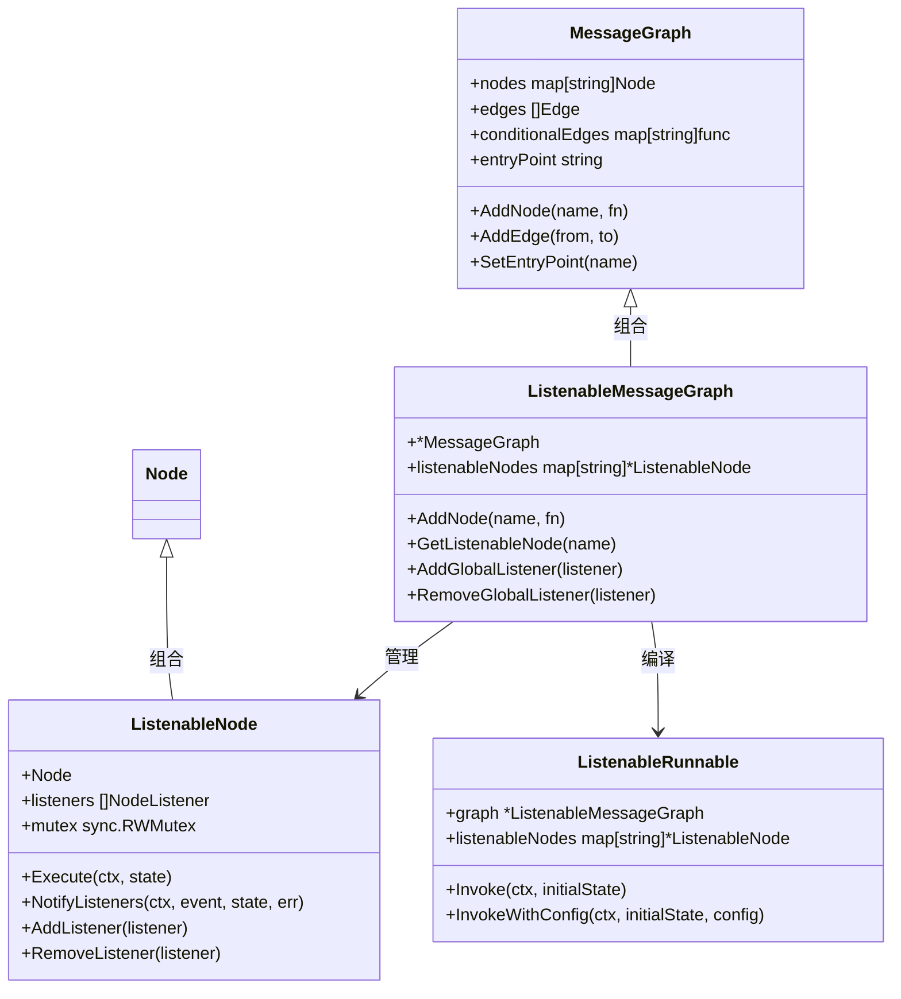
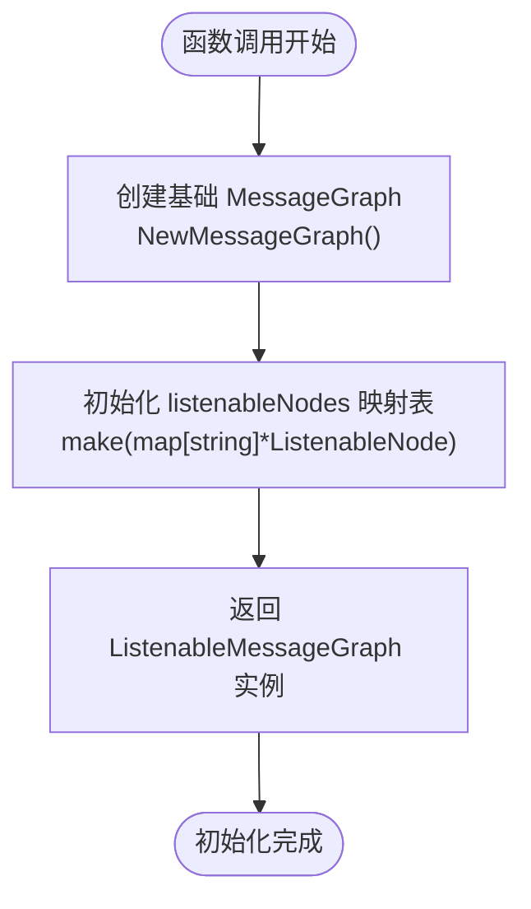
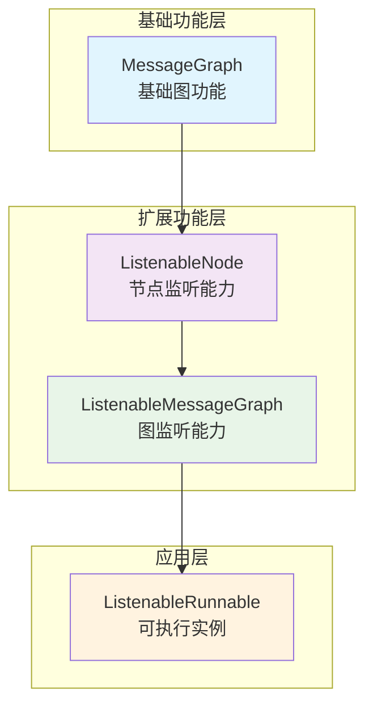
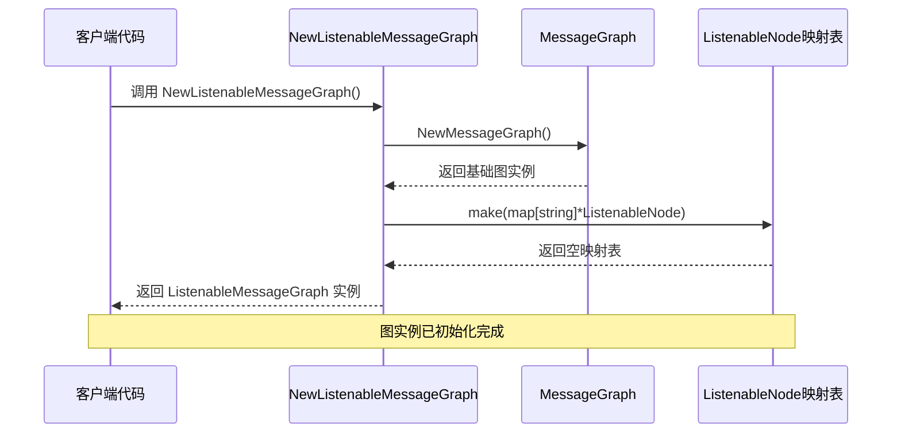
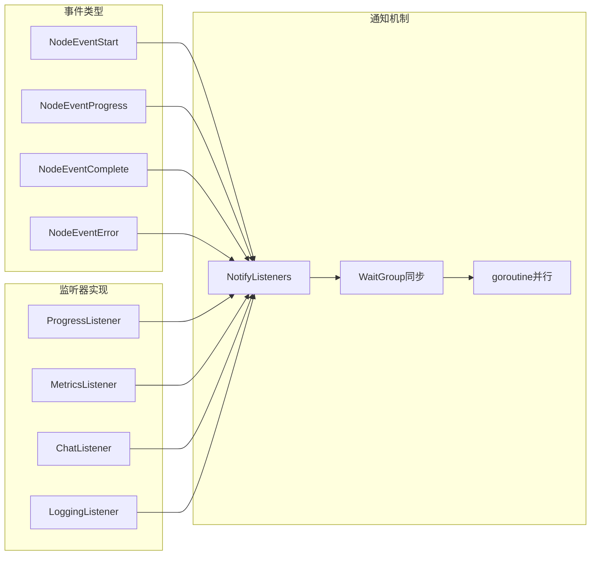
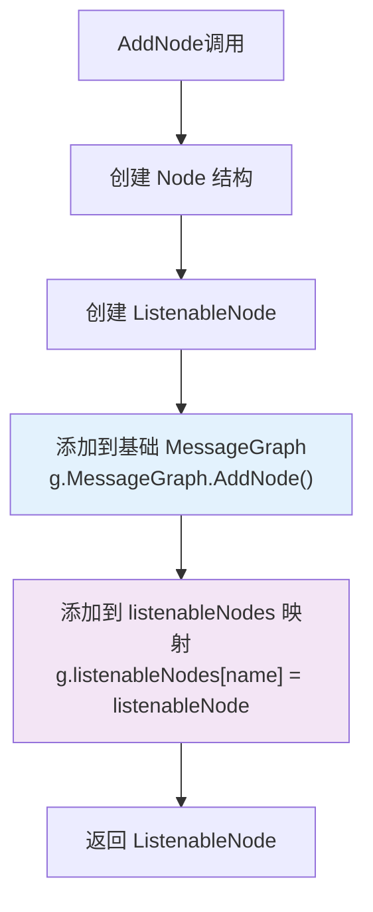
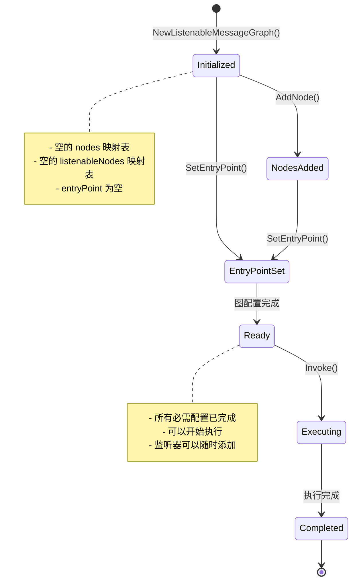
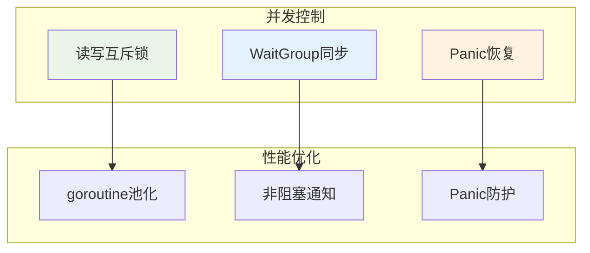

# 可监听图构建

<cite>
**本文档中引用的文件**
- [listeners.go](file://graph/listeners.go)
- [graph.go](file://graph/graph.go)
- [listeners_test.go](file://graph/listeners_test.go)
- [checkpointing.go](file://graph/checkpointing.go)
- [streaming.go](file://graph/streaming.go)
- [main.go](file://examples/listeners/main.go)
</cite>

## 目录
1. [简介](#简介)
2. [核心架构](#核心架构)
3. [NewListenableMessageGraph 函数详解](#newlistenablemessagegraph-函数详解)
4. [结构体组合模式分析](#结构体组合模式分析)
5. [初始化逻辑深度解析](#初始化逻辑深度解析)
6. [扩展优势与设计考量](#扩展优势与设计考量)
7. [图构建阶段的协同工作](#图构建阶段的协同工作)
8. [初始状态管理机制](#初始状态管理机制)
9. [实际应用场景](#实际应用场景)
10. [性能考虑](#性能考虑)
11. [总结](#总结)

## 简介

NewListenableMessageGraph 函数是 langgraphgo 框架中的核心组件，它创建了一个具有监听器支持的消息图实例。该函数通过组合模式实现了基础消息图功能与监听能力的无缝集成，在保持向后兼容性的同时为开发者提供了强大的可观测性和调试能力。

## 核心架构



**图表来源**
- [listeners.go](file://graph/listeners.go#L89-L191)
- [graph.go](file://graph/graph.go#L74-L92)

## NewListenableMessageGraph 函数详解

NewListenableMessageGraph 函数是创建可监听消息图的核心入口点，其实现体现了优雅的设计模式和清晰的职责分离。

### 函数签名与返回值

```go
func NewListenableMessageGraph() *ListenableMessageGraph
```

该函数返回一个指向 ListenableMessageGraph 结构体的指针，该结构体包含了两个关键组件：
- 嵌入的基础 MessageGraph 实例
- 专门用于管理监听器的 listenableNodes 映射表

### 初始化过程分析



**图表来源**
- [listeners.go](file://graph/listeners.go#L193-L198)

**章节来源**
- [listeners.go](file://graph/listeners.go#L193-L198)

## 结构体组合模式分析

ListenableMessageGraph 采用了经典的组合模式设计，这种设计带来了显著的优势：

### 继承关系与组合优势



**图表来源**
- [listeners.go](file://graph/listeners.go#L187-L191)

### 设计模式优势

1. **行为扩展而非修改**: 通过组合而非继承的方式添加监听功能
2. **单一职责原则**: 基础图功能与监听功能分离
3. **开闭原则**: 对扩展开放，对修改封闭
4. **接口隔离**: 清晰的接口边界定义

**章节来源**
- [listeners.go](file://graph/listeners.go#L187-L191)

## 初始化逻辑深度解析

### 基础图初始化

NewListenableMessageGraph 函数首先调用 NewMessageGraph 创建基础图实例：

```go
MessageGraph: NewMessageGraph()
```

这行代码创建了一个全新的 MessageGraph 实例，初始化了以下核心组件：
- `nodes`: 节点映射表，用于存储所有图节点
- `conditionalEdges`: 条件边映射表，处理动态路由逻辑
- 默认配置参数

### 监听器映射表初始化

```go
listenableNodes: make(map[string]*ListenableNode)
```

这行代码创建了一个空的映射表，用于管理所有具有监听能力的节点。该映射表的关键特性包括：

1. **键值类型**: 字符串类型的节点名称作为键
2. **值类型**: ListenableNode 指针作为值
3. **并发安全**: 后续通过互斥锁保证线程安全

### 初始化时序图



**图表来源**
- [listeners.go](file://graph/listeners.go#L193-L198)

**章节来源**
- [listeners.go](file://graph/listeners.go#L193-L198)

## 扩展优势与设计考量

### 功能扩展优势

NewListenableMessageGraph 的设计带来了多重功能扩展优势：

#### 1. 监听器系统集成



**图表来源**
- [listeners.go](file://graph/listeners.go#L128-L157)

#### 2. 全局监听器支持

```go
// 添加全局监听器到所有节点
func (g *ListenableMessageGraph) AddGlobalListener(listener NodeListener) {
    for _, node := range g.listenableNodes {
        node.AddListener(listener)
    }
}
```

这种设计允许开发者：
- 在运行时动态添加监听器
- 统一管理多个节点的监听需求
- 实现跨节点的统一监控策略

#### 3. 异步事件通知

监听器通知采用异步机制，避免阻塞主执行流程：

```go
// 异步通知所有监听器
for _, listener := range listeners {
    wg.Add(1)
    go func(l NodeListener) {
        defer wg.Done()
        // 防止监听器崩溃影响主流程
        defer func() {
            if r := recover(); r != nil {
                // 恢复panic但不记录错误
            }
        }()
        l.OnNodeEvent(ctx, event, ln.Name, state, err)
    }(listener)
}
```

**章节来源**
- [listeners.go](file://graph/listeners.go#L222-L234)
- [listeners.go](file://graph/listeners.go#L128-L157)

## 图构建阶段的协同工作

### AddNode 方法的协同机制

当在 ListenableMessageGraph 中添加节点时，系统会同时维护两个层次的数据结构：



**图表来源**
- [listeners.go](file://graph/listeners.go#L202-L214)

### 编译阶段的协同

编译过程中，ListenableMessageGraph 会创建 ListenableRunnable 实例：

```go
func (g *ListenableMessageGraph) CompileListenable() (*ListenableRunnable, error) {
    if g.entryPoint == "" {
        return nil, ErrEntryPointNotSet
    }
    
    return &ListenableRunnable{
        graph:           g,
        listenableNodes: g.listenableNodes,
    }, nil
}
```

这种设计确保了：
1. **状态一致性**: 基础图状态与监听器状态同步
2. **执行透明性**: 监听器不影响核心执行逻辑
3. **资源优化**: 避免重复创建相同的功能组件

**章节来源**
- [listeners.go](file://graph/listeners.go#L202-L214)
- [listeners.go](file://graph/listeners.go#L242-L252)

## 初始状态管理机制

### 图实例化后的初始状态

NewListenableMessageGraph 创建的图实例具有以下初始状态特征：

#### 1. 空节点集合
- `nodes` 映射表为空，等待节点添加
- `conditionalEdges` 映射表为空，无条件边配置

#### 2. 监听器映射表状态
- `listenableNodes` 映射表为空，等待 ListenableNode 添加
- 所有监听器操作都基于此映射表进行

#### 3. 执行环境准备
- `entryPoint` 为空，需要显式设置入口节点
- `Schema` 为零值，使用默认状态处理逻辑

### 状态转换流程



**图表来源**
- [listeners.go](file://graph/listeners.go#L193-L198)

### 初始状态验证

框架提供了多种方式验证图实例的初始状态：

```go
// 编译前的状态检查
func (g *ListenableMessageGraph) CompileListenable() (*ListenableRunnable, error) {
    if g.entryPoint == "" {
        return nil, ErrEntryPointNotSet
    }
    // 继续编译流程...
}
```

**章节来源**
- [listeners.go](file://graph/listeners.go#L193-L198)
- [listeners.go](file://graph/listeners.go#L244-L246)

## 实际应用场景

### 示例：多监听器监控系统

以下是 NewListenableMessageGraph 在实际项目中的典型应用场景：

#### 1. 进度监控系统

```go
// 创建监听器图
g := graph.NewListenableMessageGraph()

// 添加进度监听器
progressListener := graph.NewProgressListener().
    WithTiming(true).
    WithDetails(true)

// 添加指标监听器
metricsListener := graph.NewMetricsListener()

// 添加聊天监听器
chatListener := graph.NewChatListener()
chatListener.SetNodeMessage("process", "🤖 正在处理数据...")
chatListener.SetNodeMessage("analyze", "🔍 正在分析结果...")

// 添加节点并绑定监听器
processNode := g.AddNode("process", processFunction)
processNode.AddListener(progressListener)
processNode.AddListener(metricsListener)
processNode.AddListener(chatListener)
```

#### 2. 分布式系统监控

```go
// 创建带有全局监听器的图
g := graph.NewListenableMessageGraph()

// 添加分布式追踪监听器
tracerListener := NewDistributedTracerListener()

// 添加全局监听器
g.AddGlobalListener(tracerListener)

// 所有节点自动获得追踪能力
```

#### 3. 测试环境监控

```go
// 创建测试专用图
g := graph.NewListenableMessageGraph()

// 添加日志监听器
loggingListener := graph.NewLoggingListener().
    WithLogLevel(graph.LogLevelDebug).
    WithState(true)

// 添加性能监控监听器
perfListener := NewPerformanceMonitor()

// 在测试环境中启用所有监控
testNode := g.AddNode("test", testFunction)
testNode.AddListener(loggingListener)
testNode.AddListener(perfListener)
```

**章节来源**
- [main.go](file://examples/listeners/main.go#L12-L130)

## 性能考虑

### 内存使用优化

NewListenableMessageGraph 的内存使用特点：

#### 1. 小对象开销
- ListenableMessageGraph 结构体大小：约 24 字节（64位系统）
- 每个 ListenableNode 结构体大小：约 48 字节（包含 Node、listeners 和 mutex）

#### 2. 映射表内存使用
- `listenableNodes` 映射表按需增长
- 初始容量为 0，随着节点添加动态扩展

#### 3. 监听器内存管理
- 监听器列表采用切片存储，支持动态扩容
- 使用 WaitGroup 确保监听器通知完成后才继续

### 并发性能



**图表来源**
- [listeners.go](file://graph/listeners.go#L128-L157)

### 性能基准测试

框架提供了详细的性能基准测试：

```go
func BenchmarkListenableNode_Execute(b *testing.B) {
    // 基准测试配置
    node := graph.NewListenableNode(baseNode)
    node.AddListener(mockListener)
    
    // 执行基准测试
    for i := 0; i < b.N; i++ {
        node.Execute(ctx, testState)
    }
}
```

**章节来源**
- [listeners_test.go](file://graph/listeners_test.go#L461-L484)

## 总结

NewListenableMessageGraph 函数通过巧妙的组合模式设计，成功地将监听能力集成到基础消息图功能中。其核心优势包括：

### 技术优势
1. **优雅的组合模式**: 通过嵌入基础 MessageGraph 实现功能扩展
2. **清晰的职责分离**: 监听功能与核心图功能完全解耦
3. **高性能异步通知**: 使用 goroutine 和 WaitGroup 实现非阻塞事件传播
4. **线程安全设计**: 通过互斥锁保护共享状态访问

### 应用价值
1. **可观测性增强**: 为复杂图执行提供全面的监控能力
2. **开发体验提升**: 支持实时进度跟踪、性能监控和错误诊断
3. **测试友好**: 方便实现单元测试和集成测试
4. **生产就绪**: 提供生产环境所需的监控和调试能力

### 设计哲学
该函数体现了现代软件设计的最佳实践：
- **开闭原则**: 对扩展开放，对修改封闭
- **单一职责**: 每个组件都有明确的职责边界
- **组合优于继承**: 通过组合实现功能扩展
- **防御性编程**: 通过 panic 恢复防止监听器崩溃影响主流程

NewListenableMessageGraph 不仅是一个简单的工厂函数，更是整个 langgraphgo 框架可观测性体系的基石，为构建可靠、可监控的图应用程序提供了坚实的基础。