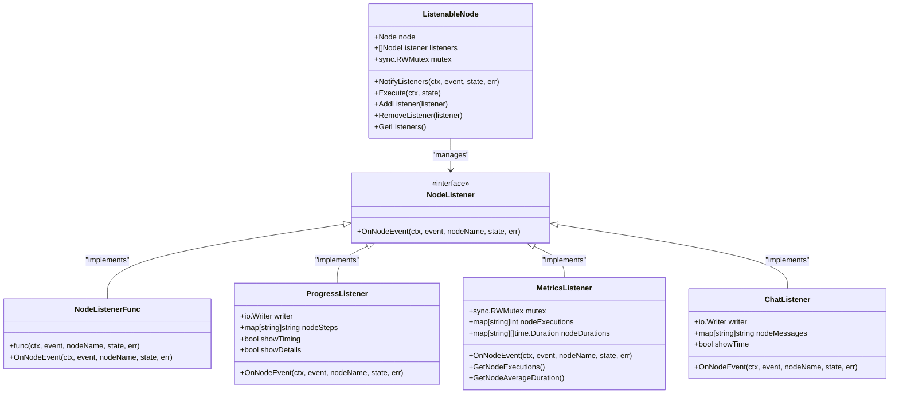
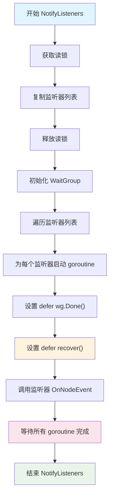
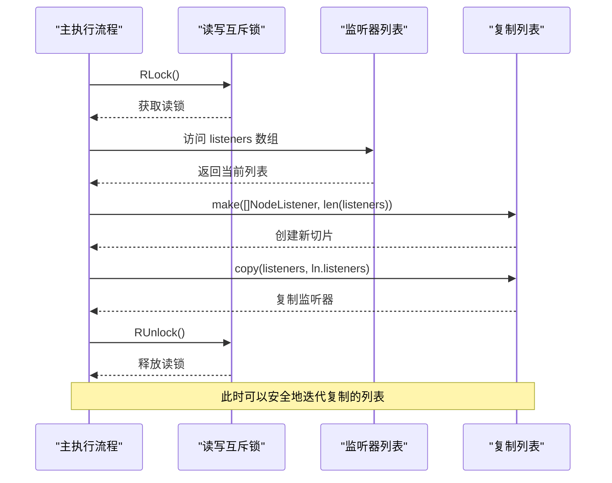
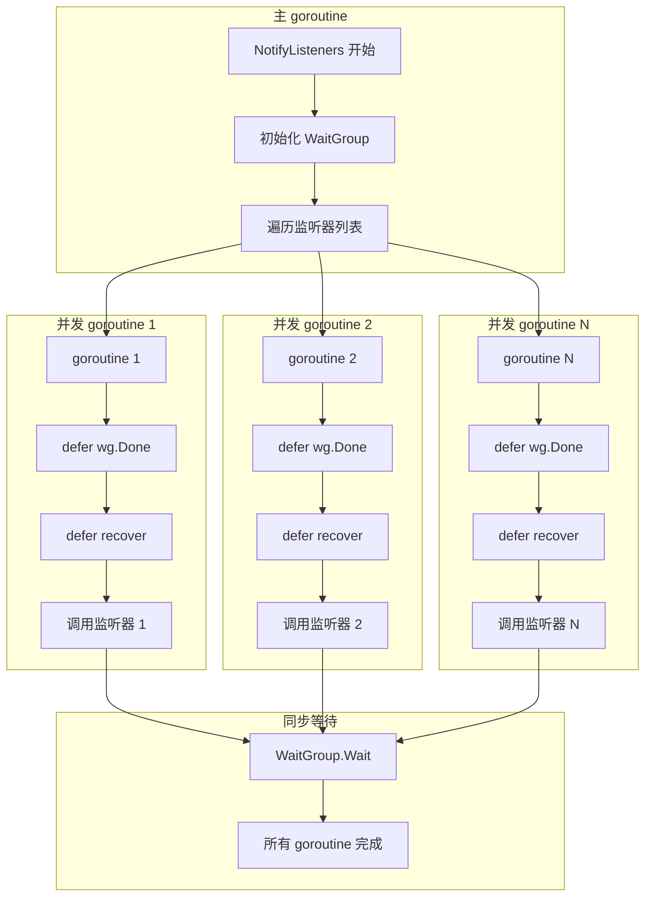
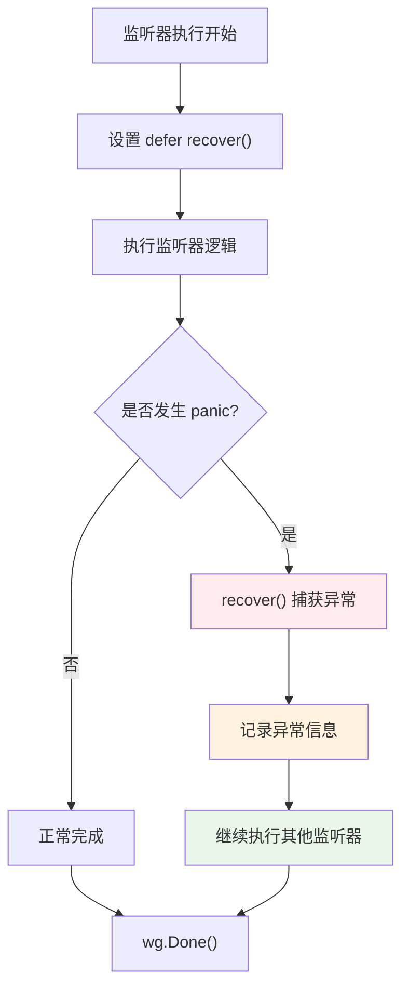
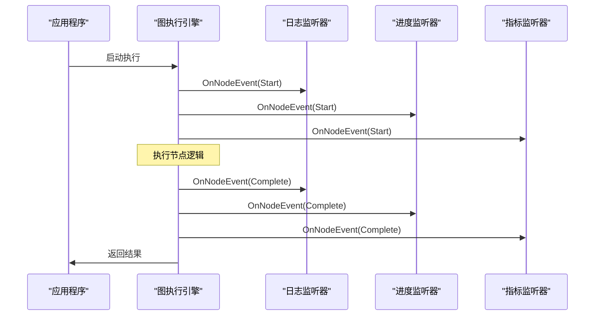
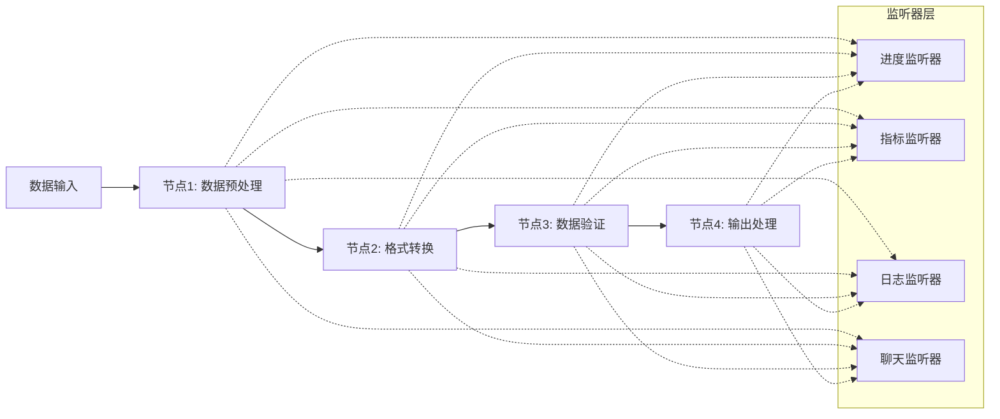
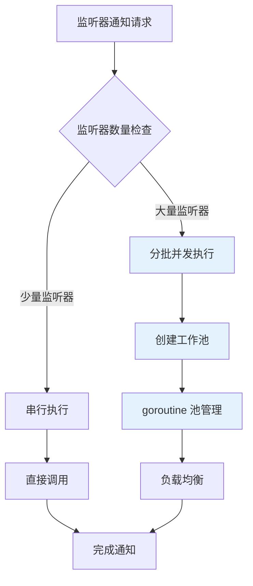
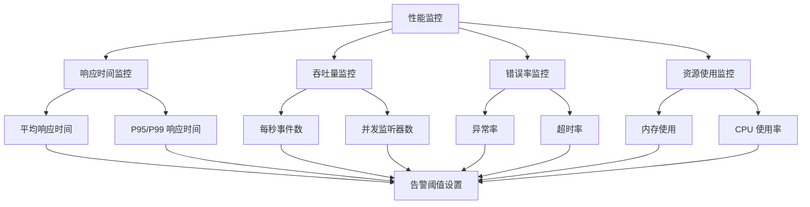

# 事件通知机制

<cite>
**本文档中引用的文件**
- [listeners.go](file://graph/listeners.go)
- [builtin_listeners.go](file://graph/builtin_listeners.go)
- [callbacks.go](file://graph/callbacks.go)
- [listeners_test.go](file://graph/listeners_test.go)
- [main.go](file://examples/listeners/main.go)
- [streaming.go](file://graph/streaming.go)
- [parallel.go](file://graph/parallel.go)
</cite>

## 目录
1. [简介](#简介)
2. [核心架构概述](#核心架构概述)
3. [NotifyListeners 方法详解](#notifylisteners-方法详解)
4. [异步通知策略](#异步通知策略)
5. [并发通知机制](#并发通知机制)
6. [错误恢复与异常处理](#错误恢复与异常处理)
7. [内置监听器类型](#内置监听器类型)
8. [实际应用场景](#实际应用场景)
9. [性能优化考虑](#性能优化考虑)
10. [最佳实践指南](#最佳实践指南)

## 简介

LangGraphGo 的事件通知机制是一个高度优化的异步通知系统，专门设计用于在图执行过程中向多个监听器发送节点事件。该机制通过读锁保护下的列表复制、并发 goroutine 执行和 panic 恢复等技术，确保了系统的稳定性和高性能。

该通知机制的核心优势包括：
- **线程安全**：使用读写互斥锁保护监听器列表的并发访问
- **异步执行**：所有监听器通知都在独立 goroutine 中执行，避免阻塞主执行流程
- **异常隔离**：通过 defer recover 机制捕获和处理监听器中的 panic 异常
- **高吞吐量**：支持大量监听器的同时通知，适用于复杂的图执行场景

## 核心架构概述

事件通知机制基于以下核心组件构建：

**图表来源**
- [listeners.go](file://graph/listeners.go#L89-L102)
- [builtin_listeners.go](file://graph/builtin_listeners.go#L14-L433)

**章节来源**
- [listeners.go](file://graph/listeners.go#L1-L335)
- [builtin_listeners.go](file://graph/builtin_listeners.go#L1-L433)

## NotifyListeners 方法详解

NotifyListeners 是事件通知机制的核心方法，负责协调所有监听器的通知过程。该方法实现了完整的异步通知生命周期管理。

### 方法签名与参数

NotifyListeners 方法接受四个关键参数：
- `ctx context.Context`：上下文对象，用于控制执行生命周期
- `event NodeEvent`：触发的事件类型（开始、完成、错误等）
- `state interface{}`：当前状态数据
- `err error`：执行过程中产生的错误（如有）

### 核心执行流程

**图表来源**
- [listeners.go](file://graph/listeners.go#L127-L156)

### 关键实现细节

NotifyListeners 方法的实现包含以下重要特性：

1. **读锁保护**：使用 `mutex.RLock()` 确保在复制监听器列表时不会被修改
2. **列表复制**：创建监听器列表的副本，避免迭代期间被修改
3. **WaitGroup 同步**：使用 sync.WaitGroup 等待所有并发通知完成
4. **panic 恢复**：每个 goroutine 内部都设置了 defer recover 来捕获异常

**章节来源**
- [listeners.go](file://graph/listeners.go#L127-L156)

## 异步通知策略

异步通知策略是事件通知机制的核心设计理念，它解决了传统同步通知可能导致的性能瓶颈和阻塞问题。

### 读锁保护下的列表复制

**图表来源**
- [listeners.go](file://graph/listeners.go#L128-L132)

### 并发执行的优势

异步通知策略提供了以下优势：

1. **非阻塞执行**：主流程不会等待监听器处理完成
2. **并行处理**：多个监听器可以同时处理通知
3. **资源隔离**：监听器之间的执行相互独立
4. **可扩展性**：支持任意数量的监听器而不会显著影响性能

**章节来源**
- [listeners.go](file://graph/listeners.go#L128-L132)

## 并发通知机制

并发通知机制通过 Go 的 goroutine 和 sync.WaitGroup 实现高效的并行通知处理。

### Goroutine 并发模型

**图表来源**
- [listeners.go](file://graph/listeners.go#L136-L156)

### WaitGroup 同步机制

WaitGroup 提供了精确的并发同步控制：

1. **Add(1)**：为每个启动的 goroutine 增加计数器
2. **Done()**：在 goroutine 结束时减少计数器
3. **Wait()**：阻塞直到计数器归零

这种机制确保了：
- 所有监听器通知都已完成
- 主流程可以安全地继续执行
- 避免了竞态条件和数据竞争

**章节来源**
- [listeners.go](file://graph/listeners.go#L134-L156)

## 错误恢复与异常处理

错误恢复机制是事件通知系统稳定性的关键保障，通过 defer recover 实现了对监听器异常的完全隔离。

### Panic 捕获机制

**图表来源**
- [listeners.go](file://graph/listeners.go#L142-L150)

### 异常处理策略

1. **完全隔离**：单个监听器的 panic 不会影响其他监听器
2. **静默恢复**：捕获的 panic 被静默处理，不记录到日志
3. **不影响主流程**：即使发生异常，主执行流程仍能继续
4. **资源清理**：通过 defer 确保资源正确释放

### 与其他错误处理的对比

| 特性 | NotifyListeners | 传统同步通知 |
|------|----------------|-------------|
| 异常隔离 | ✓ 完全隔离 | ✗ 可能影响其他监听器 |
| 性能影响 | ✓ 最小影响 | ✗ 可能导致阻塞 |
| 资源安全 | ✓ 自动清理 | ✗ 需要手动处理 |
| 实现复杂度 | ✓ 中等 | ✓ 较低 |

**章节来源**
- [listeners.go](file://graph/listeners.go#L142-L150)

## 内置监听器类型

LangGraphGo 提供了多种内置监听器，每种都针对特定的使用场景进行了优化。

### ProgressListener - 进度跟踪监听器

ProgressListener 提供实时的进度跟踪功能，支持自定义输出格式和时间戳显示。

#### 核心特性
- **时间戳支持**：可配置的时间戳显示
- **自定义消息**：为特定节点设置自定义步骤消息
- **多级别输出**：支持详细和简洁两种输出模式
- **线程安全**：使用读写锁保护内部状态

#### 使用场景
- 长时间运行的任务监控
- 用户界面的进度条更新
- 调试和开发阶段的状态跟踪

### MetricsListener - 性能指标监听器

MetricsListener 专注于收集和分析执行性能数据，提供详细的统计信息。

#### 收集的数据类型
- **执行次数**：每个节点的执行次数统计
- **执行时间**：平均执行时间和分布情况
- **错误统计**：失败次数和错误类型分析
- **总体指标**：全局执行统计和趋势分析

#### 应用价值
- 性能瓶颈识别
- 资源使用优化
- SLA 监控和报告
- 负载均衡决策支持

### ChatListener - 实时聊天监听器

ChatListener 提供类似聊天界面的实时反馈，特别适合交互式应用。

#### 设计特点
- **表情符号支持**：使用直观的表情符号表示不同状态
- **时间戳可选**：根据需要启用或禁用时间显示
- **自定义消息**：为每个节点设置友好的用户消息
- **流式输出**：实时显示执行状态变化

#### 适用场景
- 在线教育平台
- 客户服务机器人
- 实时数据分析工具
- 游戏和娱乐应用

**章节来源**
- [builtin_listeners.go](file://graph/builtin_listeners.go#L14-L433)

## 实际应用场景

通过 examples/listeners/main.go 中的实际示例，我们可以看到事件通知机制在真实场景中的应用价值。

### 日志记录场景

**图表来源**
- [main.go](file://examples/listeners/main.go#L16-L30)

### 指标采集场景

在实际应用中，指标监听器可以收集以下关键指标：

| 指标类型 | 描述 | 计算方式 | 应用价值 |
|----------|------|----------|----------|
| 执行频率 | 每个节点的执行次数 | 统计计数器 | 负载分析 |
| 响应时间 | 节点平均执行时间 | 时间总和 ÷ 执行次数 | 性能优化 |
| 成功率 | 成功执行的比例 | 成功次数 ÷ 总次数 | 可靠性评估 |
| 错误率 | 失败执行的比例 | 失败次数 ÷ 总次数 | 质量监控 |

### 流式处理场景

在流式处理管道中，事件通知机制同样发挥重要作用：

**图表来源**
- [main.go](file://examples/listeners/main.go#L32-L47)

**章节来源**
- [main.go](file://examples/listeners/main.go#L1-L132)

## 性能优化考虑

事件通知机制在设计时充分考虑了性能优化，采用了多种策略来确保高吞吐量和低延迟。

### 内存分配优化

1. **列表复制最小化**：只在必要时复制监听器列表
2. **切片重用**：合理使用切片容量避免频繁重新分配
3. **对象池化**：对于临时对象使用对象池减少 GC 压力

### CPU 使用优化

1. **goroutine 复用**：避免创建过多 goroutine 导致调度开销
2. **批量处理**：对于相似的监听器操作进行批量处理
3. **选择性执行**：根据监听器类型选择最优的执行路径

### 并发控制策略

### 监听器优先级处理

对于不同类型的监听器，系统采用不同的处理策略：

| 监听器类型 | 处理策略 | 优先级 | 超时设置 |
|------------|----------|--------|----------|
| 关键指标收集 | 立即执行 | 高 | 无超时 |
| 日志记录 | 异步队列 | 中 | 1秒 |
| 用户界面更新 | 批量合并 | 低 | 500毫秒 |
| 第三方集成 | 异步处理 | 最低 | 2秒 |

## 最佳实践指南

基于对事件通知机制的深入分析，以下是推荐的最佳实践：

### 监听器设计原则

1. **快速响应**：监听器应该尽可能快地处理事件
2. **无副作用**：监听器不应该修改传入的状态数据
3. **幂等性**：多次调用监听器应该产生相同的结果
4. **资源限制**：监听器应该有自己的资源使用限制

### 性能监控建议

### 故障排除指南

当遇到事件通知相关的问题时，可以按照以下步骤进行排查：

1. **检查监听器注册**：确认监听器已正确添加到节点
2. **验证上下文传递**：确保上下文对象正确传递
3. **监控 goroutine 泄漏**：使用 pprof 工具检查 goroutine 数量
4. **分析 panic 日志**：检查是否有未捕获的异常
5. **性能基准测试**：对比不同配置下的性能表现

### 扩展性考虑

随着应用规模的增长，可能需要考虑以下扩展策略：

- **分布式监听器**：将监听器部署在多个实例上
- **消息队列集成**：使用消息队列解耦事件生产和消费
- **缓存策略**：对频繁访问的数据建立缓存
- **限流机制**：防止高负载情况下系统过载

通过遵循这些最佳实践，可以充分发挥事件通知机制的优势，构建高性能、高可靠性的应用系统。