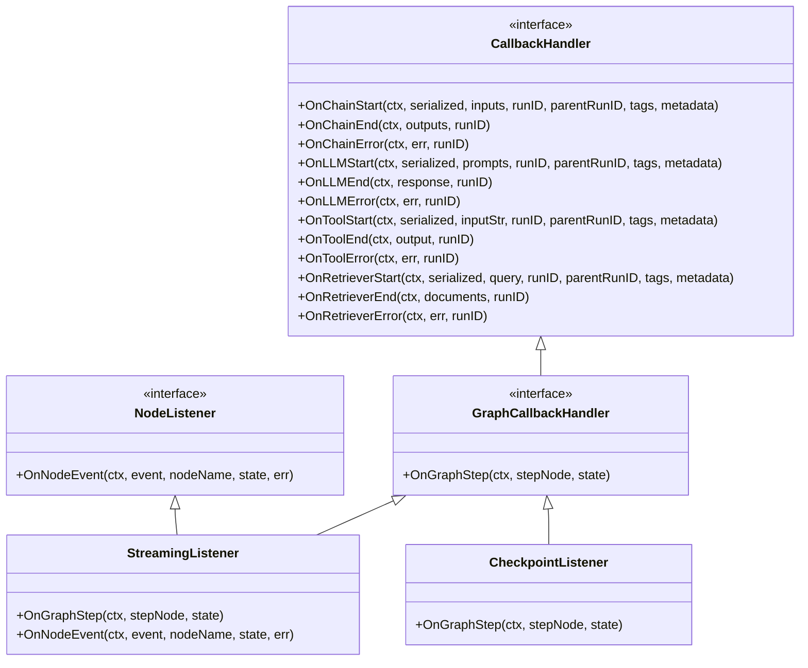
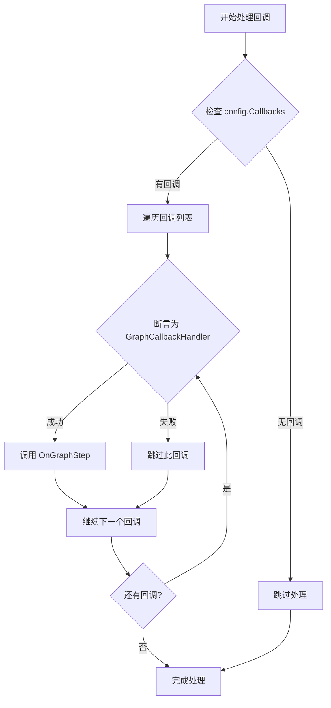
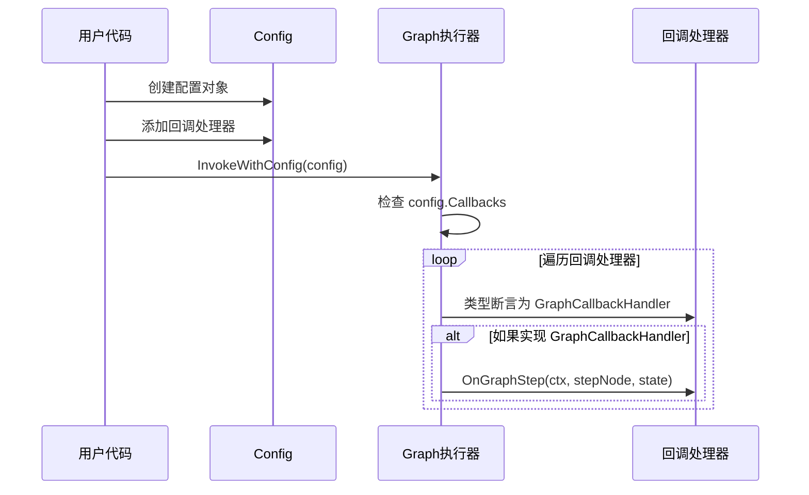
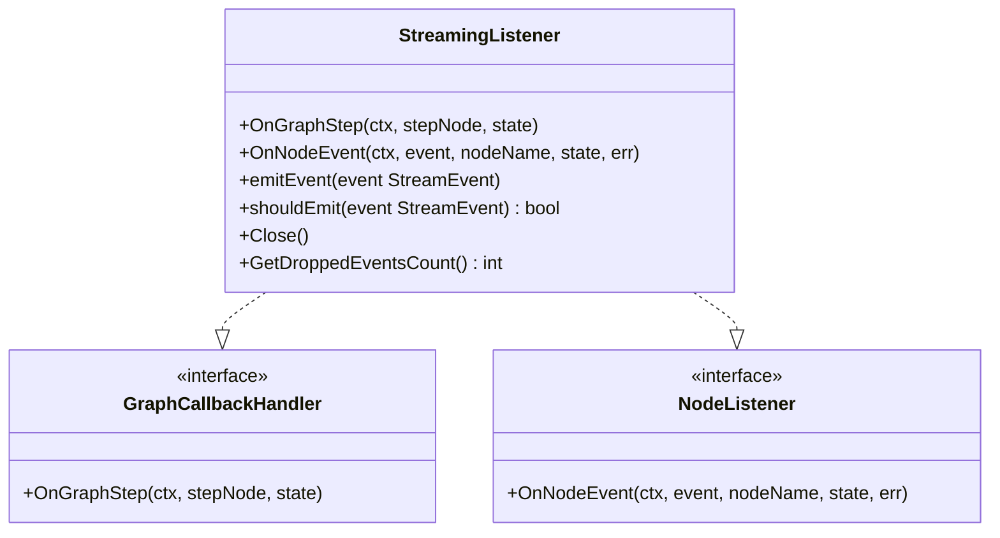

# 图回调处理器

<cite>
**本文档引用的文件**
- [callbacks.go](file://graph/callbacks.go)
- [listeners.go](file://graph/listeners.go)
- [graph.go](file://graph/graph.go)
- [state_graph.go](file://graph/state_graph.go)
- [listeners.go](file://graph/listeners.go)
- [streaming.go](file://graph/streaming.go)
- [checkpointing.go](file://graph/checkpointing.go)
- [utils.go](file://graph/utils.go)
- [main.go](file://examples/listeners/main.go)
- [main.go](file://examples/basic_example/main.go)
</cite>

## 目录
1. [简介](#简介)
2. [接口设计概述](#接口设计概述)
3. [GraphCallbackHandler 详解](#graphcallbackhandler-详解)
4. [NodeListener 对比分析](#nodelistener-对比分析)
5. [InvokeWithConfig 中的类型断言](#invokewithconfig-中的类型断言)
6. [配置系统集成](#配置系统集成)
7. [实际实现案例](#实际实现案例)
8. [最佳实践指南](#最佳实践指南)
9. [性能考量](#性能考量)
10. [总结](#总结)

## 简介

GraphCallbackHandler 是 LangGraphGo 框架中的核心回调接口，专门用于处理图级别（Graph-level）的执行事件。它扩展了基础的 CallbackHandler 接口，提供了在图执行过程中特定步骤完成时的回调能力。本文档将深入分析该接口的设计理念、使用场景以及与其他相关接口的关系。

## 接口设计概述

### 核心接口层次结构



**图表来源**
- [callbacks.go](file://graph/callbacks.go#L10-L37)
- [listeners.go](file://graph/listeners.go#L51-L54)
- [streaming.go](file://graph/streaming.go#L235-L243)
- [checkpointing.go](file://graph/checkpointing.go#L306-L330)

## GraphCallbackHandler 详解

### 接口定义

GraphCallbackHandler 扩展了基础的 CallbackHandler 接口，添加了图级别步骤完成时的回调方法：

```go
type GraphCallbackHandler interface {
    CallbackHandler
    // OnGraphStep is called after a step (node execution + state update) is completed
    OnGraphStep(ctx context.Context, stepNode string, state interface{})
}
```

### 设计目的

GraphCallbackHandler 的设计目的是为图级别的执行过程提供细粒度的监控和控制能力：

1. **图级步骤监控**: 关注整个图执行过程中的步骤完成情况
2. **状态变化追踪**: 记录每次步骤完成后的新状态
3. **高层级回调**: 补充 NodeListener 无法覆盖的图级别事件
4. **异步处理支持**: 允许在步骤完成后执行异步操作

### 核心方法分析

#### OnGraphStep 方法

该方法在每个图步骤完成后被调用，参数说明：

- `ctx context.Context`: 上下文信息，包含执行环境和配置
- `stepNode string`: 步骤标识符，通常表示参与本次步骤的所有节点
- `state interface{}`: 当前图状态，在步骤完成后的新状态

### 使用场景

GraphCallbackHandler 主要适用于以下场景：

1. **实时状态监控**: 监控图执行过程中的状态变化
2. **自动保存机制**: 基于步骤完成自动保存检查点
3. **性能分析**: 统计各步骤的执行时间和资源消耗
4. **事件驱动架构**: 响应图执行事件触发其他业务逻辑
5. **调试和诊断**: 提供详细的执行轨迹记录

**章节来源**
- [callbacks.go](file://graph/callbacks.go#L32-L37)

## NodeListener 对比分析

### 接口差异

| 特性 | GraphCallbackHandler | NodeListener |
|------|---------------------|--------------|
| **关注层面** | 图级别步骤完成 | 节点级事件 |
| **触发时机** | 步骤完成后 | 节点生命周期各阶段 |
| **事件范围** | 整个步骤的状态 | 单个节点的开始、结束、错误等 |
| **状态信息** | 完整的图状态 | 节点特定状态 |
| **使用场景** | 高层流程控制 | 底层节点监控 |

### 互补关系

这两个接口形成了完整的回调体系：

```mermaid
sequenceDiagram
participant G as 图执行器
participant NL as NodeListener
participant GCB as GraphCallbackHandler
participant CB as 其他回调处理器
G->>NL : OnNodeEvent(NodeEventStart)
G->>G->>G : 执行节点函数
G->>NL : OnNodeEvent(NodeEventComplete)
G->>GCB : OnGraphStep(stepNode, newState)
G->>CB : OnChainEnd(outputs, runID)
Note over G,CB : GraphCallbackHandler 补充 NodeListener 未覆盖的高层级事件
```

**图表来源**
- [graph.go](file://graph/graph.go#L466-L473)
- [listeners.go](file://graph/listeners.go#L160-L175)

### 实际应用对比

#### NodeListener 应用场景
- 节点执行进度跟踪
- 错误处理和恢复
- 性能指标收集
- 日志记录

#### GraphCallbackHandler 应用场景
- 图级别状态持久化
- 流式数据处理
- 分布式协调
- 自动化决策

**章节来源**
- [listeners.go](file://graph/listeners.go#L51-L54)
- [listeners.go](file://graph/listeners.go#L160-L175)

## InvokeWithConfig 中的类型断言

### 断言逻辑分析

在 InvokeWithConfig 方法中，框架会对配置中的回调处理器进行类型断言，以确定是否实现了 GraphCallbackHandler 接口：



**图表来源**
- [graph.go](file://graph/graph.go#L466-L473)
- [state_graph.go](file://graph/state_graph.go#L282-L291)

### 具体实现位置

#### 主图执行器中的处理
在主要的图执行器中，OnGraphStep 被调用的位置：
- [graph.go](file://graph/graph.go#L466-L473)

#### 状态图执行器中的处理  
在状态图执行器中，OnGraphStep 被调用的位置：
- [state_graph.go](file://graph/state_graph.go#L282-L291)

#### 可听图执行器中的处理
在可听图执行器中，OnGraphStep 被调用的位置：
- [listeners.go](file://graph/listeners.go#L315-L322)

### 类型断言的优势

1. **性能优化**: 只对真正实现 GraphCallbackHandler 的处理器调用 OnGraphStep
2. **向后兼容**: 不影响不支持图级别回调的旧处理器
3. **灵活性**: 允许不同类型的回调处理器共存

**章节来源**
- [graph.go](file://graph/graph.go#L466-L473)
- [state_graph.go](file://graph/state_graph.go#L282-L291)
- [listeners.go](file://graph/listeners.go#L315-L322)

## 配置系统集成

### Config 结构设计

Config 结构通过 callbacks 字段支持回调处理器的注入：

```go
type Config struct {
    // Callbacks to be invoked during execution
    Callbacks []CallbackHandler `json:"callbacks"`
    // ... 其他配置字段
}
```

### 回调处理器注入流程



**图表来源**
- [callbacks.go](file://graph/callbacks.go#L40-L71)
- [graph.go](file://graph/graph.go#L185-L195)

### 配置使用示例

#### 基本配置方式
```go
config := &Config{
    Callbacks: []CallbackHandler{
        myGraphCallbackHandler,
        myNodeListener,
    },
}
```

#### 流式配置方式
```go
config := &Config{
    Callbacks: []CallbackHandler{
        NewStreamingListener(eventChan, streamConfig),
    },
}
```

#### 检查点配置方式
```go
config := &Config{
    Callbacks: []CallbackHandler{
        &CheckpointListener{
            store:       store,
            executionID: execID,
            autoSave:    true,
        },
    },
}
```

**章节来源**
- [callbacks.go](file://graph/callbacks.go#L40-L71)
- [streaming.go](file://graph/streaming.go#L330-L332)
- [checkpointing.go](file://graph/checkpointing.go#L243-L247)

## 实际实现案例

### StreamingListener 实现

StreamingListener 同时实现了 GraphCallbackHandler 和 NodeListener 接口：



**图表来源**
- [streaming.go](file://graph/streaming.go#L235-L243)

#### OnGraphStep 实现细节

StreamingListener 的 OnGraphStep 方法负责：
1. 创建带有时间戳的流事件
2. 设置事件类型为 "graph_step"
3. 包含当前步骤的节点名称和状态
4. 将事件发送到配置的事件通道

### CheckpointListener 实现

CheckpointListener 实现了基于步骤完成的自动检查点保存：

#### OnGraphStep 实现细节

1. **条件检查**: 只有在启用自动保存时才执行
2. **检查点创建**: 构建包含步骤信息的检查点
3. **异步保存**: 在单独的 goroutine 中保存检查点
4. **错误处理**: 静默处理保存错误

### 自定义 GraphCallbackHandler 实现

#### 实现模板

```go
type MyGraphCallbackHandler struct {
    // 实现所需的状态和配置
}

func (h *MyGraphCallbackHandler) OnGraphStep(ctx context.Context, stepNode string, state interface{}) {
    // 实现具体的回调逻辑
    // 例如：日志记录、状态持久化、事件通知等
}
```

#### 常见实现模式

1. **状态持久化**: 基于步骤完成保存状态
2. **性能监控**: 记录步骤执行时间和资源使用
3. **事件通知**: 响应步骤完成触发外部事件
4. **审计日志**: 记录所有步骤的详细信息

**章节来源**
- [streaming.go](file://graph/streaming.go#L235-L243)
- [checkpointing.go](file://graph/checkpointing.go#L306-L330)

## 最佳实践指南

### 线程安全考虑

#### 并发访问保护
当多个 goroutine 同时访问 GraphCallbackHandler 实现时，需要考虑以下线程安全问题：

1. **状态共享**: 避免在回调中直接修改共享状态
2. **同步机制**: 使用互斥锁保护共享资源
3. **异步处理**: 将耗时操作移至单独的 goroutine

#### 实现建议

```go
type ThreadSafeCallbackHandler struct {
    mu      sync.Mutex
    metrics map[string]int
}

func (h *ThreadSafeCallbackHandler) OnGraphStep(ctx context.Context, stepNode string, state interface{}) {
    h.mu.Lock()
    defer h.mu.Unlock()
    
    // 安全地更新指标
    h.metrics[stepNode]++
}
```

### 性能优化策略

#### 回调处理优化

1. **异步处理**: 将耗时操作异步化
2. **批量处理**: 合并多个小的回调操作
3. **缓冲机制**: 使用缓冲区减少频繁的系统调用
4. **选择性处理**: 根据配置决定是否执行某些回调

#### 内存管理

1. **避免内存泄漏**: 及时清理不再需要的数据
2. **对象池化**: 重用频繁创建的对象
3. **及时释放**: 在回调完成后释放临时资源

### 错误处理和传播

#### 错误处理原则

1. **优雅降级**: 回调失败不应影响主流程
2. **错误隔离**: 回调错误应该被适当捕获和处理
3. **日志记录**: 记录回调执行过程中的错误
4. **用户通知**: 在必要时通知用户回调失败

#### 实现模式

```go
func (h *MyCallbackHandler) OnGraphStep(ctx context.Context, stepNode string, state interface{}) {
    defer func() {
        if r := recover(); r != nil {
            // 记录错误但不中断主流程
            log.Printf("回调处理发生错误: %v", r)
        }
    }()
    
    // 执行回调逻辑
    if err := h.processCallback(stepNode, state); err != nil {
        // 记录错误但继续执行
        log.Printf("回调处理失败: %v", err)
    }
}
```

### 资源管理

#### 生命周期管理

1. **初始化**: 在适当时机初始化回调所需的资源
2. **清理**: 在回调处理器销毁时清理资源
3. **重置**: 在适当的时候重置回调状态

#### 资源池化

```go
type CallbackResourcePool struct {
    pool chan *CallbackResource
}

func (p *CallbackResourcePool) Get() *CallbackResource {
    select {
    case resource := <-p.pool:
        return resource
    default:
        return p.createNewResource()
    }
}

func (p *CallbackResourcePool) Put(resource *CallbackResource) {
    select {
    case p.pool <- resource:
        // 资源放回池中
    default:
        // 池已满，资源被丢弃
    }
}
```

**章节来源**
- [listeners.go](file://graph/listeners.go#L143-L152)
- [streaming.go](file://graph/streaming.go#L252-L261)

## 性能考量

### 回调执行开销

#### 时间复杂度分析

1. **类型断言**: O(1)，每次回调都会进行类型断言
2. **接口调用**: O(1)，通过接口调用的固定开销
3. **并发处理**: O(n)，其中 n 是回调处理器的数量

#### 空间复杂度分析

1. **回调列表**: O(m)，m 是回调处理器的数量
2. **事件缓冲**: O(k)，k 是事件缓冲区大小
3. **状态复制**: O(s)，s 是状态对象的大小

### 性能优化技术

#### 异步回调处理

```go
func (h *AsyncCallbackHandler) OnGraphStep(ctx context.Context, stepNode string, state interface{}) {
    // 异步处理，不阻塞主流程
    go func() {
        if err := h.processCallback(stepNode, state); err != nil {
            log.Printf("异步回调失败: %v", err)
        }
    }()
}
```

#### 批量处理优化

```go
type BatchCallbackHandler struct {
    batch     []BatchItem
    batchSize int
    flushChan chan struct{}
}

func (h *BatchCallbackHandler) OnGraphStep(ctx context.Context, stepNode string, state interface{}) {
    h.batch = append(h.batch, BatchItem{stepNode, state})
    
    if len(h.batch) >= h.batchSize {
        h.flush()
    }
}
```

#### 缓存策略

```go
type CachedCallbackHandler struct {
    cache map[string]interface{}
    ttl   time.Duration
}

func (h *CachedCallbackHandler) OnGraphStep(ctx context.Context, stepNode string, state interface{}) {
    // 缓存最近的状态
    h.cache[stepNode] = state
    
    // 清理过期缓存
    h.cleanupExpired()
}
```

### 监控和诊断

#### 性能指标收集

1. **回调执行时间**: 监控每个回调的执行时间
2. **回调频率**: 统计回调的调用频率
3. **错误率**: 跟踪回调失败的比例
4. **内存使用**: 监控回调处理器的内存占用

#### 诊断工具

```go
type ProfilingCallbackHandler struct {
    startTime time.Time
    stats     *CallbackStats
}

func (h *ProfilingCallbackHandler) OnGraphStep(ctx context.Context, stepNode string, state interface{}) {
    defer func() {
        duration := time.Since(h.startTime)
        h.stats.record(stepNode, duration)
    }()
    
    h.startTime = time.Now()
    // 执行回调逻辑
}
```

## 总结

GraphCallbackHandler 接口是 LangGraphGo 框架中实现图级别监控和控制的核心机制。它与 NodeListener 形成了完整的回调体系，分别关注图级别和节点级别的事件。

### 关键特点

1. **图级别视角**: 专注于整个图执行过程中的步骤完成
2. **状态变化追踪**: 记录每次步骤完成后的新状态
3. **异步处理支持**: 允许在步骤完成后执行异步操作
4. **类型断言优化**: 通过类型断言提高性能和兼容性

### 使用建议

1. **合理选择接口**: 根据需求选择 GraphCallbackHandler 或 NodeListener
2. **注意线程安全**: 在多 goroutine 环境中确保回调的线程安全性
3. **优化性能**: 使用异步处理和批量操作提升性能
4. **完善错误处理**: 实现优雅的错误处理和恢复机制

### 发展方向

随着 LangGraphGo 的不断发展，GraphCallbackHandler 将可能扩展更多功能，如：
- 更细粒度的步骤控制
- 条件回调机制
- 分布式回调支持
- 更丰富的状态信息传递

通过深入理解和正确使用 GraphCallbackHandler 接口，开发者可以构建更加灵活、可监控和可维护的图执行系统。