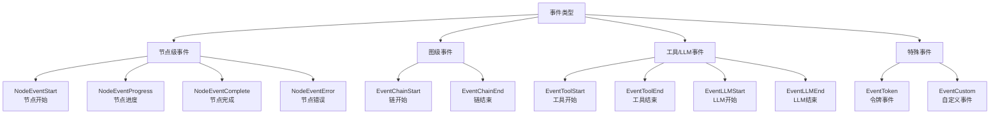
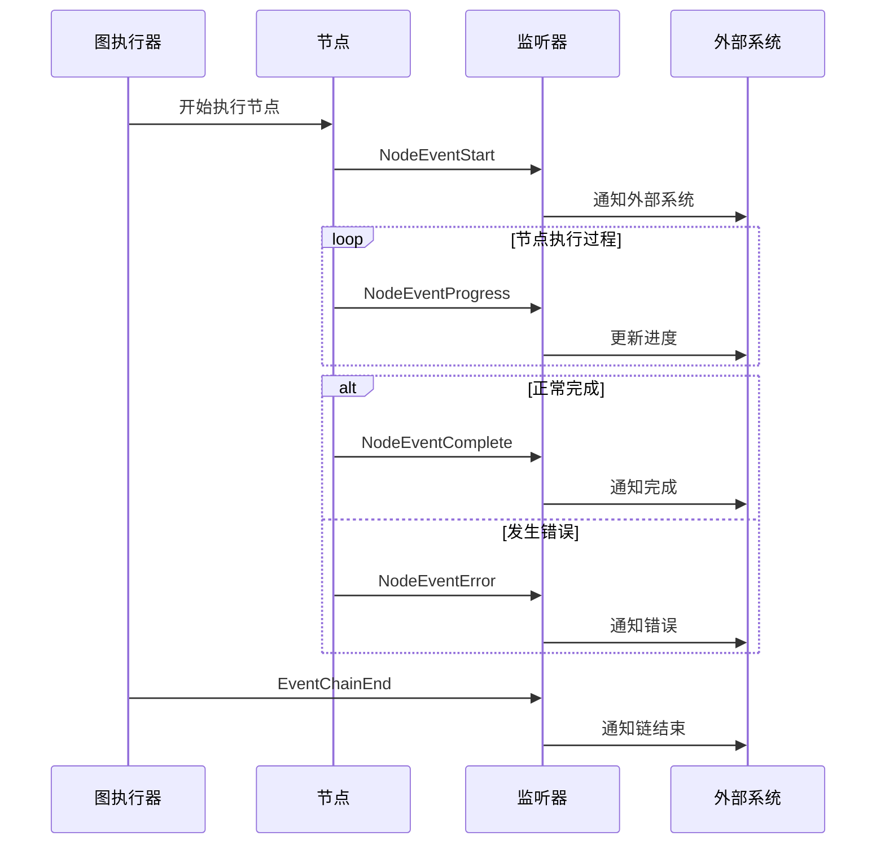
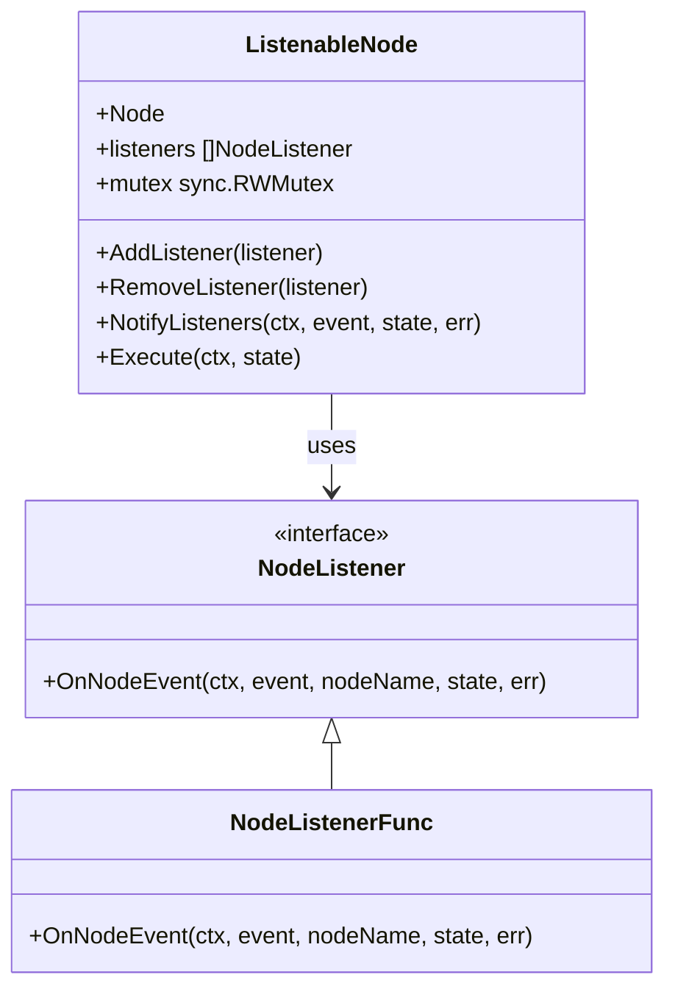

# 节点事件类型

<cite>
**本文档引用的文件**
- [listeners.go](file://graph/listeners.go)
- [builtin_listeners.go](file://graph/builtin_listeners.go)
- [streaming.go](file://graph/streaming.go)
- [listeners_test.go](file://graph/listeners_test.go)
- [builtin_listeners_test.go](file://graph/builtin_listeners_test.go)
- [main.go](file://examples/listeners/main.go)
- [README_CN.md](file://examples/streaming_modes/README_CN.md)
</cite>

## 目录
1. [概述](#概述)
2. [事件类型分类](#事件类型分类)
3. [节点级事件详解](#节点级事件详解)
4. [图级事件详解](#图级事件详解)
5. [工具和LLM相关事件](#工具和llm相关事件)
6. [特殊事件类型](#特殊事件类型)
7. [事件生命周期](#事件生命周期)
8. [事件监听器接口](#事件监听器接口)
9. [事件集成指南](#事件集成指南)
10. [最佳实践建议](#最佳实践建议)

## 概述

LangGraph Go 提供了一套完整的事件系统，用于监控和跟踪图执行过程中的各种活动。通过 `NodeEvent` 枚举定义的事件类型，开发者可以深入了解工作流的执行状态，实现实时监控、性能分析和用户体验优化。

事件系统的核心组件包括：
- **NodeEvent 枚举**：定义所有可用的事件类型
- **NodeListener 接口**：事件监听的标准协议
- **内置监听器**：提供进度、日志、指标等预设功能
- **流式事件处理**：支持实时数据传输和前端集成

## 事件类型分类

事件按照作用范围和语义含义可分为以下几类：

**图表来源**
- [listeners.go](file://graph/listeners.go#L13-L48)

## 节点级事件详解

### NodeEventStart - 节点开始事件

**触发时机**：当节点开始执行其函数时触发

**语义含义**：表示节点执行的起点，可用于初始化操作、状态记录或性能监控

**典型用途**：
- 记录节点启动时间
- 初始化节点特定的状态
- 触发前置验证逻辑
- 更新UI状态指示器

**Section sources**
- [listeners.go](file://graph/listeners.go#L15-L16)
- [listeners.go](file://graph/listeners.go#L160-L162)

### NodeEventProgress - 节点进度事件

**触发时机**：在节点执行过程中定期触发，表示执行进度

**语义含义**：反映节点执行的中间状态，通常用于长时间运行的操作

**典型用途**：
- 显示执行进度条
- 报告中间结果
- 触发超时检查
- 更新用户界面状态

**Section sources**
- [listeners.go](file://graph/listeners.go#L18-L19)

### NodeEventComplete - 节点完成事件

**触发时机**：节点成功执行完毕时触发

**语义含义**：表示节点正常完成，携带最终结果

**典型用途**：
- 记录执行时间和性能指标
- 触发后续节点的准备
- 更新统计数据
- 清理资源

**Section sources**
- [listeners.go](file://graph/listeners.go#L21-L22)
- [listeners.go](file://graph/listeners.go#L170-L172)

### NodeEventError - 节点错误事件

**触发时机**：节点执行过程中发生错误时触发

**语义含义**：表示节点执行失败，携带错误信息

**典型用途**：
- 错误处理和恢复
- 日志记录和告警
- 用户错误提示
- 执行回滚

**Section sources**
- [listeners.go](file://graph/listeners.go#L23-L24)
- [listeners.go](file://graph/listeners.go#L168-L170)

## 图级事件详解

### EventChainStart - 链开始事件

**触发时机**：整个图执行开始时触发

**语义含义**：表示图级别的执行流程启动

**典型用途**：
- 初始化全局状态
- 设置执行上下文
- 记录整体执行开始时间
- 触发全局监控机制

**Section sources**
- [listeners.go](file://graph/listeners.go#L26-L27)

### EventChainEnd - 链结束事件

**触发时机**：整个图执行成功完成时触发

**语义含义**：表示图级别的执行流程结束

**典型用途**：
- 记录整体执行耗时
- 清理全局资源
- 触发后处理逻辑
- 生成执行报告

**Section sources**
- [listeners.go](file://graph/listeners.go#L29-L30)

## 工具和LLM相关事件

### EventToolStart - 工具开始事件

**触发时机**：调用外部工具或函数前触发

**语义含义**：表示工具执行的开始阶段

**典型用途**：
- 记录工具调用时间
- 传递工具参数
- 设置工具执行上下文
- 触发工具监控

**Section sources**
- [listeners.go](file://graph/listeners.go#L32-L33)
- [streaming.go](file://graph/streaming.go#L200-L206)

### EventToolEnd - 工具结束事件

**触发时机**：外部工具执行完成后触发

**语义含义**：表示工具执行的完成阶段

**典型用途**：
- 获取工具执行结果
- 记录工具执行时间
- 处理工具返回值
- 触发后续处理逻辑

**Section sources**
- [listeners.go](file://graph/listeners.go#L35-L36)
- [streaming.go](file://graph/streaming.go#L209-L214)

### EventLLMStart - LLM开始事件

**触发时机**：调用语言模型服务前触发

**语义含义**：表示LLM调用的开始阶段

**典型用途**：
- 记录LLM调用参数
- 设置模型配置
- 触发LLM监控
- 准备输入数据

**Section sources**
- [listeners.go](file://graph/listeners.go#L38-L39)
- [streaming.go](file://graph/streaming.go#L175-L181)

### EventLLMEnd - LLM结束事件

**触发时机**：语言模型服务响应完成后触发

**语义含义**：表示LLM调用的完成阶段

**典型用途**：
- 获取LLM响应结果
- 记录调用性能指标
- 处理响应数据
- 触发后续处理

**Section sources**
- [listeners.go](file://graph/listeners.go#L41-L42)
- [streaming.go](file://graph/streaming.go#L184-L189)

## 特殊事件类型

### EventToken - 令牌事件

**触发时机**：在流式输出场景下，每次生成新令牌时触发

**语义含义**：表示语言模型正在逐步生成内容

**特殊用途**：
- 实现打字机效果的实时文本显示
- 监控生成进度
- 实现流式API响应
- 支持实时编辑功能

**设计特点**：
- 高频触发，适合流式处理
- 通常与EventLLMStart配合使用
- 可能产生大量事件，需要适当的缓冲和过滤

**Section sources**
- [listeners.go](file://graph/listeners.go#L44-L45)
- [streaming.go](file://graph/streaming.go#L125-L129)

### EventCustom - 自定义事件

**触发时机**：用户自定义的任何时刻触发

**语义含义**：提供扩展能力，支持用户定义的业务逻辑

**特殊用途**：
- 集成第三方监控系统
- 实现业务特定的审计日志
- 支持自定义的工作流控制
- 扩展现有事件系统的功能

**Section sources**
- [listeners.go](file://graph/listeners.go#L47-L48)

## 事件生命周期

**图表来源**
- [listeners.go](file://graph/listeners.go#L160-L174)
- [streaming.go](file://graph/streaming.go#L150-L172)

**Section sources**
- [listeners.go](file://graph/listeners.go#L128-L156)
- [streaming.go](file://graph/streaming.go#L135-L172)

## 事件监听器接口

### NodeListener 接口定义

**图表来源**
- [listeners.go](file://graph/listeners.go#L51-L63)
- [listeners.go](file://graph/listeners.go#L89-L101)

### 内置监听器类型

| 监听器类型 | 主要功能 | 适用场景 |
|-----------|---------|---------|
| ProgressListener | 显示执行进度和状态 | 用户界面展示 |
| LoggingListener | 结构化日志记录 | 调试和运维 |
| MetricsListener | 性能指标收集 | 监控和分析 |
| ChatListener | 聊天格式消息 | 交互式应用 |
| StreamingListener | 流式事件处理 | 实时数据传输 |

**Section sources**
- [builtin_listeners.go](file://graph/builtin_listeners.go#L97-L287)

## 事件集成指南

### 前端UI集成

事件系统与前端界面的集成可以通过以下方式实现：

1. **WebSocket连接**：建立实时通信通道
2. **Server-Sent Events**：使用SSE推送事件
3. **轮询机制**：定期查询最新事件
4. **GraphQL Subscriptions**：使用GraphQL订阅

### 日志系统集成

事件可以无缝集成到现有的日志系统中：

- **结构化日志**：使用JSON格式记录事件详情
- **级别映射**：将事件类型映射到日志级别
- **关联追踪**：通过事件ID建立执行链路
- **聚合分析**：基于事件数据生成统计报告

### 监控系统集成

事件数据可用于实时监控：

- **性能指标**：响应时间、吞吐量、错误率
- **业务指标**：用户行为、转化率、满意度
- **告警机制**：基于事件阈值触发告警
- **趋势分析**：长期趋势和异常检测

**Section sources**
- [main.go](file://examples/listeners/main.go#L16-L30)
- [README_CN.md](file://examples/streaming_modes/README_CN.md#L1-L22)

## 最佳实践建议

### 事件选择指南

| 场景需求 | 推荐事件类型 | 原因 |
|---------|-------------|------|
| 用户进度显示 | NodeEventStart, NodeEventProgress, NodeEventComplete | 提供完整的执行状态 |
| 错误处理 | NodeEventError | 精确的错误定位 |
| 性能监控 | NodeEventStart, NodeEventComplete | 时间测量的基础 |
| 实时聊天 | EventToken | 流式输出的最佳选择 |
| 自定义业务逻辑 | EventCustom | 灵活的扩展能力 |

### 性能优化建议

1. **异步处理**：事件监听器应异步执行，避免阻塞主流程
2. **批量处理**：对高频事件进行批量处理和缓冲
3. **内存管理**：及时清理不再需要的事件数据
4. **错误恢复**：监听器中的错误不应影响主流程执行

### 监听器设计原则

1. **单一职责**：每个监听器专注于特定功能
2. **无副作用**：监听器不应修改事件数据
3. **快速响应**：避免在监听器中执行耗时操作
4. **错误隔离**：监听器中的错误应被妥善处理

### 流式处理最佳实践

对于EventToken等高频事件：
- 实现背压处理机制
- 使用缓冲区避免事件丢失
- 根据网络状况调整事件频率
- 提供事件过滤和聚合功能

**Section sources**
- [listeners.go](file://graph/listeners.go#L134-L156)
- [streaming.go](file://graph/streaming.go#L89-L110)