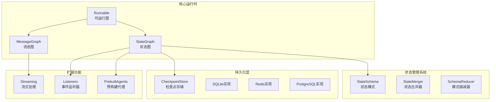
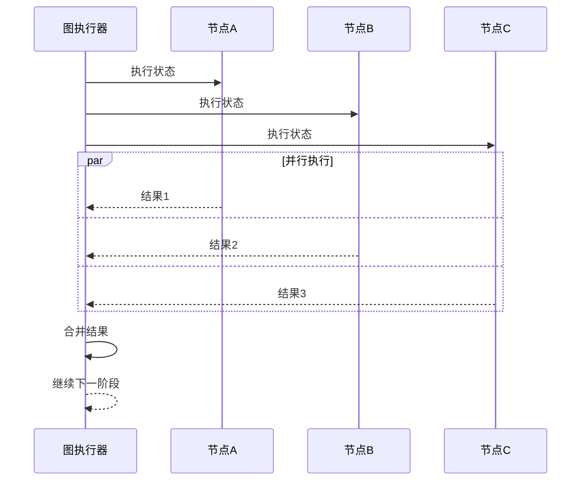
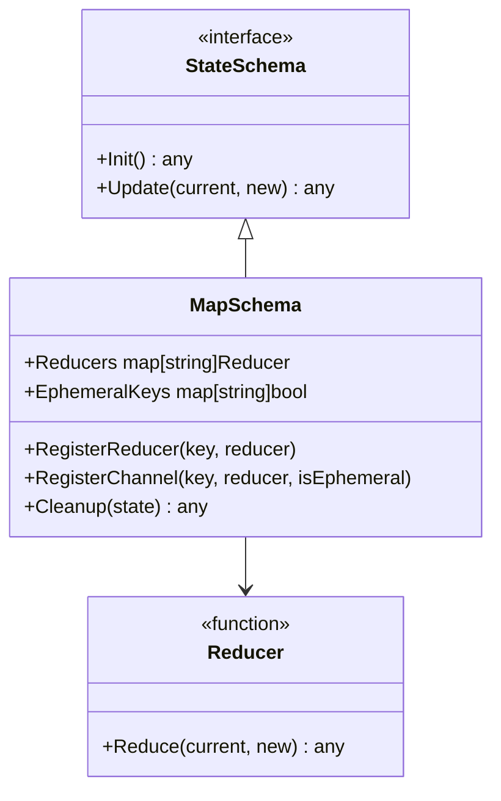
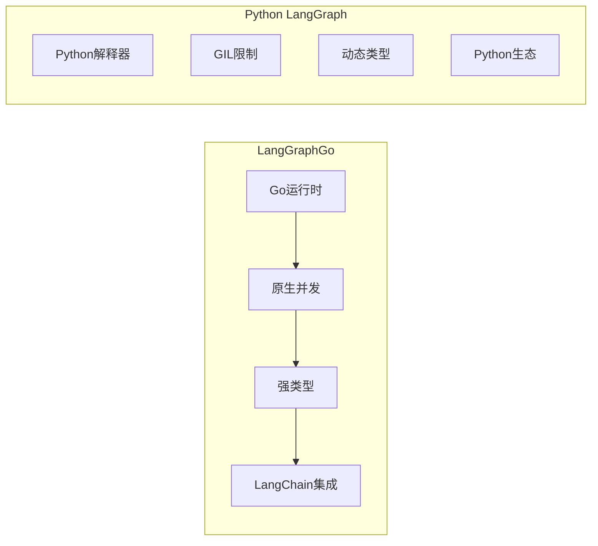
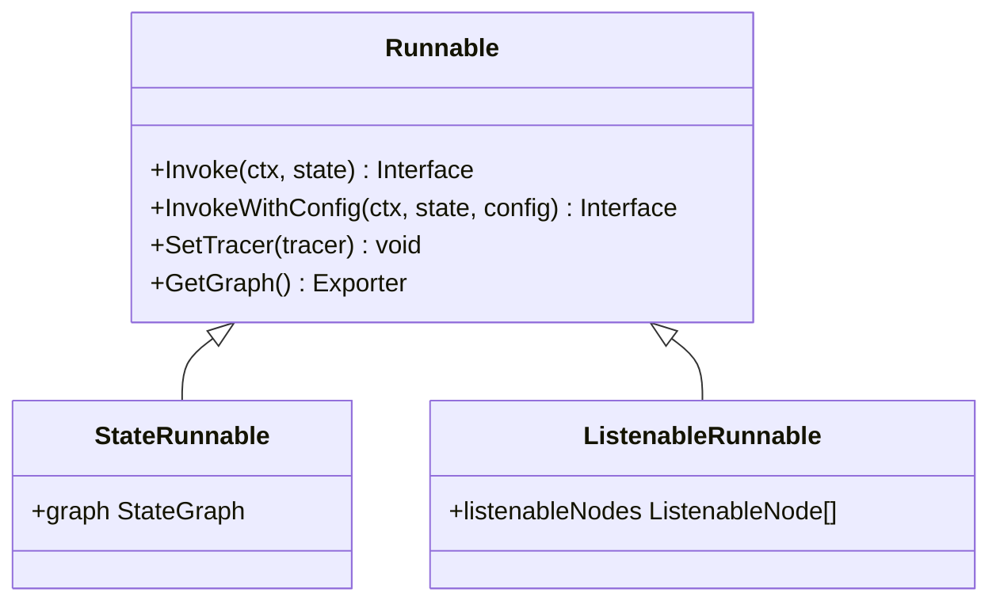
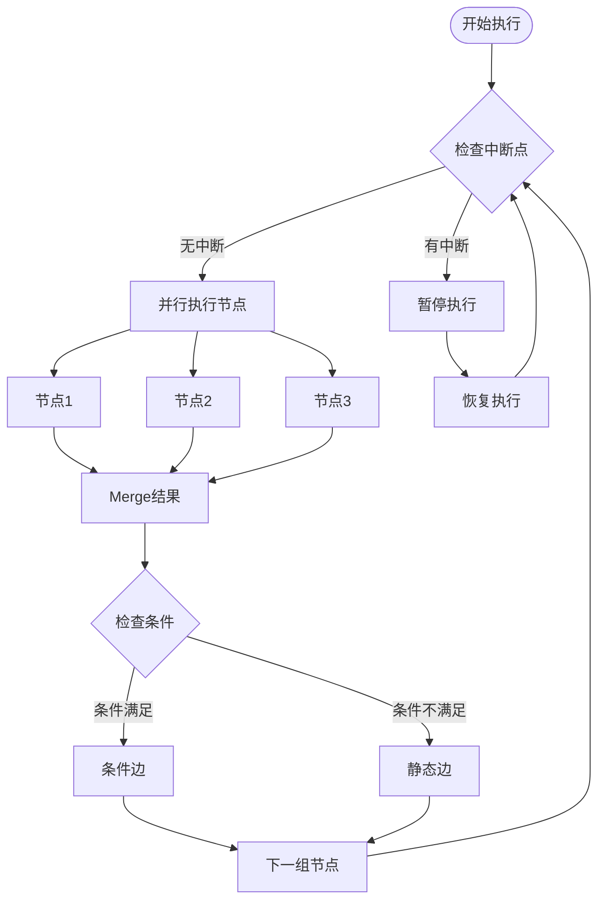

# 项目概述

<cite>
**本文档中引用的文件**
- [README.md](file://README.md)
- [CHANGELOG.md](file://CHANGELOG.md)
- [go.mod](file://go.mod)
- [graph/graph.go](file://graph/graph.go)
- [graph/state_graph.go](file://graph/state_graph.go)
- [graph/schema.go](file://graph/schema.go)
- [graph/streaming.go](file://graph/streaming.go)
- [graph/checkpointing.go](file://graph/checkpointing.go)
- [prebuilt/react_agent.go](file://prebuilt/react_agent.go)
- [prebuilt/create_agent.go](file://prebuilt/create_agent.go)
- [checkpoint/sqlite/sqlite.go](file://checkpoint/sqlite/sqlite.go)
- [checkpoint/redis/redis.go](file://checkpoint/redis/redis.go)
- [examples/basic_example/main.go](file://examples/basic_example/main.go)
</cite>

## 目录
1. [项目简介](#项目简介)
2. [核心架构设计](#核心架构设计)
3. [主要特性](#主要特性)
4. [技术目标与应用场景](#技术目标与应用场景)
5. [与其他工作流框架的对比](#与其他工作流框架的对比)
6. [核心抽象与执行模型](#核心抽象与执行模型)
7. [项目演进历程](#项目演进历程)
8. [总结](#总结)

## 项目简介

LangGraphGo 是一个基于图结构的工作流引擎，专为构建语言模型驱动的应用程序而设计。该项目是从 paulnegz/langgraphgo 分支派生而来，经过增强后实现了与 Python LangGraph 库的功能对等，并添加了支持并行执行、持久化、高级状态管理、预构建代理和人机交互工作流等生产就绪功能。

### 核心价值主张

LangGraphGo 的核心价值在于提供了一个统一的框架来构建复杂的语言模型应用程序，通过图结构的可视化和可编程性，使开发者能够轻松地构建从简单的单步推理到复杂的多智能体协作的各种应用场景。

**章节来源**
- [README.md](file://README.md#L1-L10)

## 核心架构设计

LangGraphGo 采用了模块化的架构设计，主要包含以下几个核心组件：

**图表来源**
- [graph/graph.go](file://graph/graph.go#L140-L170)
- [graph/state_graph.go](file://graph/state_graph.go#L10-L40)
- [graph/schema.go](file://graph/schema.go#L12-L27)

### 架构设计理念

1. **状态机模式**: 基于有限状态自动机的设计理念，每个节点代表一个状态，边表示状态转换
2. **可插拔的检查点系统**: 支持多种存储后端，确保执行的可靠性和可恢复性
3. **LangChain 生态集成**: 完全兼容 langchaingo，无缝集成现有的语言模型工具链

**章节来源**
- [graph/graph.go](file://graph/graph.go#L74-L93)
- [graph/state_graph.go](file://graph/state_graph.go#L10-L31)

## 主要特性

### 并行执行能力

LangGraphGo 支持并发节点执行，当多个节点共享相同的起始节点时，它们会并行执行，结果通过图的状态合并器或模式进行合并。

**图表来源**
- [graph/graph.go](file://graph/graph.go#L249-L316)

### 持久化与可靠性

项目提供了完整的检查点系统，支持 Redis、PostgreSQL 和 SQLite 三种存储后端：

| 存储类型 | 特点 | 适用场景 |
|---------|------|----------|
| SQLite | 轻量级、嵌入式 | 开发测试、小型应用 |
| Redis | 内存存储、高性能 | 高并发、实时应用 |
| PostgreSQL | 关系型数据库、事务支持 | 生产环境、复杂查询 |

**章节来源**
- [checkpoint/sqlite/sqlite.go](file://checkpoint/sqlite/sqlite.go#L13-L25)
- [checkpoint/redis/redis.go](file://checkpoint/redis/redis.go#L13-L28)

### 高级状态管理

通过 StateSchema 接口，LangGraphGo 提供了灵活的状态更新机制：

**图表来源**
- [graph/schema.go](file://graph/schema.go#L12-L27)
- [graph/schema.go](file://graph/schema.go#L29-L55)

**章节来源**
- [graph/schema.go](file://graph/schema.go#L8-L18)

## 技术目标与应用场景

### 技术目标

1. **生产就绪**: 提供完整的监控、追踪和可观测性支持
2. **性能优化**: 单次图操作耗时仅需 14-94μs，事件处理速度可达 1000+ events/second
3. **开发体验**: 提供丰富的可视化工具和调试功能
4. **可扩展性**: 支持自定义节点、监听器和存储后端

### 适用场景

#### 智能代理系统
- **ReAct 代理**: 基于思考-行动循环的智能代理
- **CreateAgent**: 可配置的通用代理工厂
- **Supervisor**: 多智能体协调控制器

#### 检索增强生成 (RAG) 系统
- 文档检索和问答
- 知识库集成
- 多模态内容处理

#### 多步骤推理流程
- 复杂问题解决
- 数据分析管道
- 内容创作工作流

**章节来源**
- [README.md](file://README.md#L17-L41)
- [prebuilt/react_agent.go](file://prebuilt/react_agent.go#L13-L182)
- [prebuilt/create_agent.go](file://prebuilt/create_agent.go#L45-L252)

## 与其他工作流框架的对比

### 优势对比

| 特性 | LangGraphGo | 其他框架 |
|------|-------------|----------|
| 语言支持 | Go原生 | Python为主 |
| 性能 | 高性能Go运行时 | 解释型语言 |
| 并发模型 | 原生goroutine | 协程/线程池 |
| 类型安全 | 强类型系统 | 动态类型 |
| 生态集成 | LangChain生态 | 各种生态 |

### 架构差异

**章节来源**
- [README.md](file://README.md#L17-L41)

## 核心抽象与执行模型

### 关键抽象

#### Runnable 接口
Runnable 是 LangGraphGo 的核心抽象，表示一个可以执行的图：

**图表来源**
- [graph/graph.go](file://graph/graph.go#L140-L170)
- [graph/state_graph.go](file://graph/state_graph.go#L99-L102)

#### StateGraph 与 MessageGraph
- **StateGraph**: 基于状态模式的图，支持复杂的状态更新逻辑
- **MessageGraph**: 基于消息传递的图，适用于对话系统

**章节来源**
- [graph/graph.go](file://graph/graph.go#L74-L93)
- [graph/state_graph.go](file://graph/state_graph.go#L10-L31)

### 执行模型

LangGraphGo 采用事件驱动的执行模型，支持以下特性：

1. **流式执行**: 实时事件流和进度跟踪
2. **中断机制**: 支持在任意节点暂停执行
3. **状态恢复**: 从检查点恢复执行状态
4. **条件路由**: 基于状态的动态路径选择

**图表来源**
- [graph/graph.go](file://graph/graph.go#L224-L475)

**章节来源**
- [graph/graph.go](file://graph/graph.go#L174-L492)
- [graph/state_graph.go](file://graph/state_graph.go#L115-L296)

## 项目演进历程

根据 CHANGELOG 记录，LangGraphGo 在 2025 年经历了重大版本迭代：

### 0.3.0 版本（2025年12月）
- **核心运行时**: 实现了扇出/扇入执行模型，支持线程安全的状态合并
- **运行时配置**: 添加了 RunnableConfig 来传播配置信息
- **命令API**: 引入了 Command 结构体用于动态流程控制
- **子图支持**: 原生支持将编译后的图作为节点使用
- **状态管理**: 引入 Schema 接口和 Annotated 样式缩减器
- **智能消息**: 实现了 AddMessages 减少器用于基于ID的消息插入和去重
- **人机交互**: 实现了中断机制和时间旅行功能

### 0.1.0 版本（2025年1月）
- 移除了对 LangChain 的硬依赖，现在可以与任何 LLM 库配合使用
- 简化了构建图的 API
- 改进了示例以展示通用用法

**章节来源**
- [CHANGELOG.md](file://CHANGELOG.md#L1-L85)

## 总结

LangGraphGo 作为一个现代化的工作流引擎，在以下几个方面表现出色：

### 技术优势
1. **高性能**: 基于 Go 语言的原生并发模型，提供卓越的执行性能
2. **类型安全**: 强类型的 Go 语言确保了代码的可靠性和可维护性
3. **生态系统集成**: 完全兼容 LangChain 生态，便于现有项目的迁移和扩展

### 应用价值
1. **开发效率**: 通过可视化的图结构降低了复杂应用的开发难度
2. **运维友好**: 完整的检查点和监控机制确保了生产环境的稳定性
3. **扩展性强**: 模块化的设计支持各种定制化需求

### 发展前景
LangGraphGo 不仅是一个技术工具，更是连接传统工作流系统和现代语言模型应用的重要桥梁。随着大语言模型技术的不断发展，这类基于图结构的工作流引擎将在智能应用开发中发挥越来越重要的作用。

对于初学者而言，LangGraphGo 提供了从简单示例到复杂应用的完整学习路径；对于高级开发者，它提供了足够的灵活性和扩展性来构建企业级解决方案。这种兼顾易用性和功能性的设计理念，使得 LangGraphGo 成为了 Go 语言生态中构建语言模型驱动应用的理想选择。