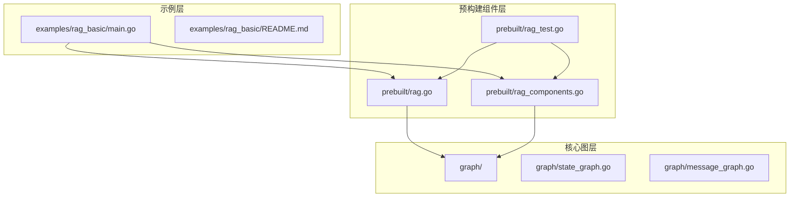
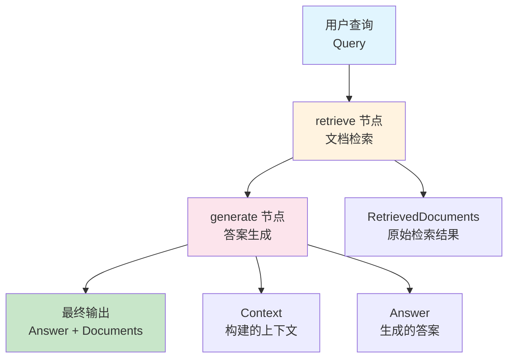
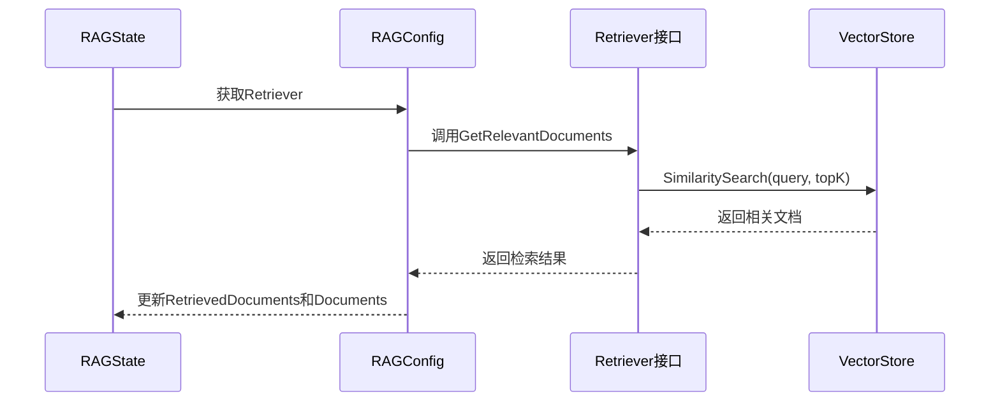
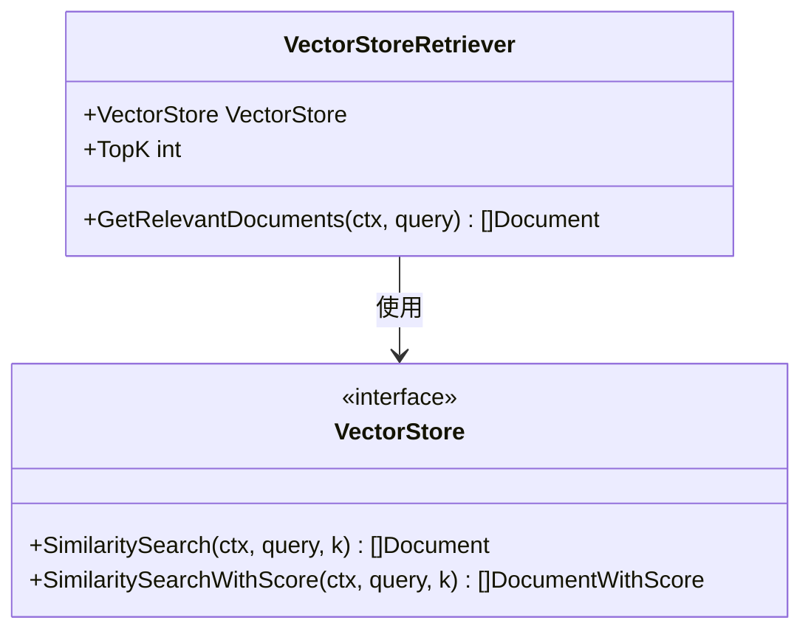
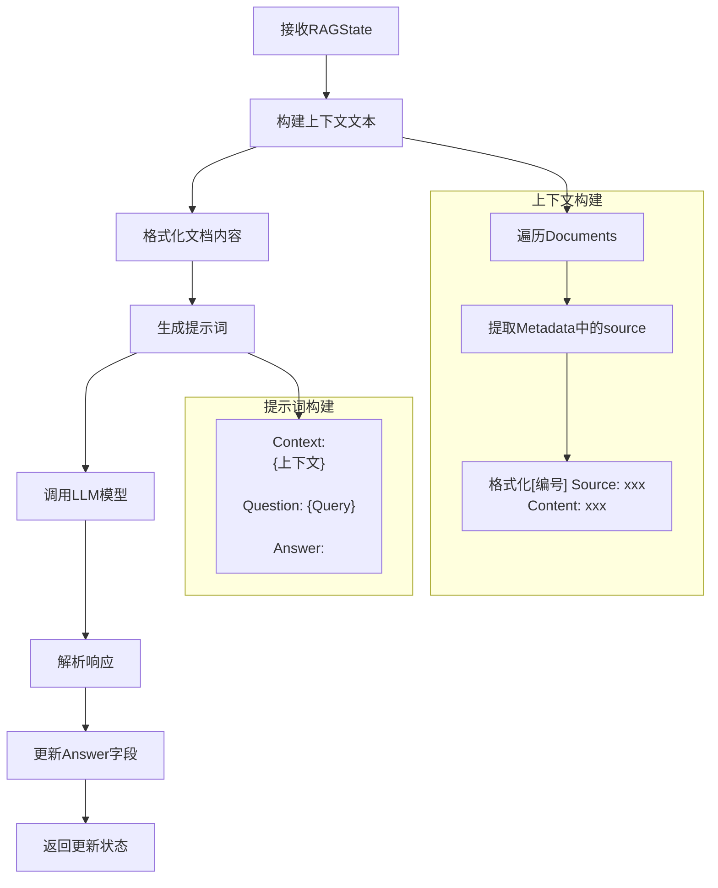
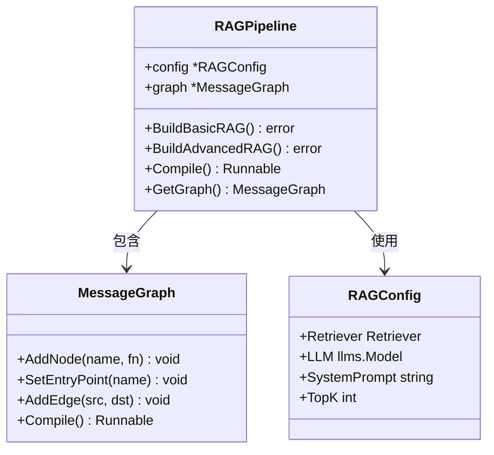
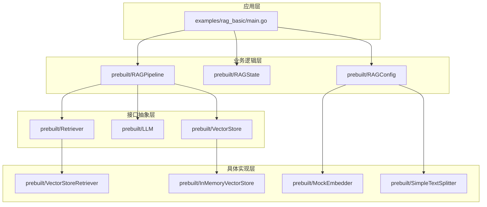

# 基础 RAG

<cite>
**本文档中引用的文件**
- [examples/rag_basic/main.go](file://examples/rag_basic/main.go)
- [prebuilt/rag.go](file://prebuilt/rag.go)
- [prebuilt/rag_components.go](file://prebuilt/rag_components.go)
- [prebuilt/rag_test.go](file://prebuilt/rag_test.go)
- [examples/rag_basic/README.md](file://examples/rag_basic/README.md)
</cite>

## 目录
1. [简介](#简介)
2. [项目结构](#项目结构)
3. [核心组件](#核心组件)
4. [架构概览](#架构概览)
5. [详细组件分析](#详细组件分析)
6. [依赖关系分析](#依赖关系分析)
7. [性能考虑](#性能考虑)
8. [故障排除指南](#故障排除指南)
9. [结论](#结论)

## 简介

基础 RAG（检索增强生成）是 LangGraphGo 框架中最简单但功能完整的检索增强生成系统实现。它采用两节点流水线设计：`retrieve`（检索）和 `generate`（生成），构成了最简化的 RAG 工作流。这种设计特别适用于对延迟敏感且检索质量稳定的场景，为理解更复杂的 RAG 系统提供了良好的起点。

基础 RAG 系统的核心优势在于其简洁性和高效性。通过最小化组件数量，它减少了计算开销和潜在的错误点，同时保持了 RAG 技术的核心价值——结合检索到的相关文档与语言模型生成高质量回答的能力。

## 项目结构

LangGraphGo 的 RAG 实现遵循模块化设计原则，主要分为以下几个层次：



**图表来源**
- [examples/rag_basic/main.go](file://examples/rag_basic/main.go#L1-L155)
- [prebuilt/rag.go](file://prebuilt/rag.go#L1-L392)
- [prebuilt/rag_components.go](file://prebuilt/rag_components.go#L1-L333)

**章节来源**
- [examples/rag_basic/main.go](file://examples/rag_basic/main.go#L1-L155)
- [prebuilt/rag.go](file://prebuilt/rag.go#L1-L392)

## 核心组件

### RAGState 状态管理

RAGState 是贯穿整个 RAG 流水线的状态容器，负责在各个节点之间传递数据：

| 字段名 | 类型 | 描述 |
|--------|------|------|
| Query | string | 用户查询问题 |
| Documents | []Document | 当前处理的文档列表 |
| RetrievedDocuments | []Document | 检索阶段获取的原始文档 |
| RankedDocuments | []DocumentWithScore | 排序后的文档及相关性分数 |
| Context | string | 构建的上下文文本 |
| Answer | string | 生成的回答内容 |
| Citations | []string | 文档引用列表 |
| Metadata | map[string]interface{} | 元数据信息 |

### RAGConfig 配置管理

RAGConfig 提供了灵活的配置选项，支持不同场景的需求：

| 配置项 | 类型 | 默认值 | 描述 |
|--------|------|--------|------|
| TopK | int | 4 | 检索的文档数量 |
| ScoreThreshold | float64 | 0.7 | 相关性阈值 |
| UseReranking | bool | false | 是否使用重排序 |
| UseFallback | bool | false | 是否使用备用搜索 |
| SystemPrompt | string | 标准提示 | 系统指令模板 |
| IncludeCitations | bool | true | 是否包含引用 |
| MaxTokens | int | 1000 | 最大令牌数 |
| Temperature | float64 | 0.0 | 生成温度 |

**章节来源**
- [prebuilt/rag.go](file://prebuilt/rag.go#L57-L91)

## 架构概览

基础 RAG 系统采用单向流水线架构，包含两个核心节点：



**图表来源**
- [prebuilt/rag.go](file://prebuilt/rag.go#L125-L145)

### 流水线构建过程

基础 RAG 流水线的构建遵循以下步骤：

1. **验证必要组件**：确保配置中包含有效的 `Retriever` 和 `LLM`
2. **添加检索节点**：注册 `retrieve` 节点处理文档检索
3. **添加生成节点**：注册 `generate` 节点处理答案生成
4. **建立连接**：设置节点间的执行顺序和终点

**章节来源**
- [prebuilt/rag.go](file://prebuilt/rag.go#L125-L145)

## 详细组件分析

### retrieveNode 检索节点实现

`retrieveNode` 是基础 RAG 流水线的第一个节点，负责从向量存储中检索相关文档：



**图表来源**
- [prebuilt/rag.go](file://prebuilt/rag.go#L263-L274)

#### 检索流程详解

1. **状态提取**：从输入状态中获取查询字符串
2. **调用检索器**：通过 `Retriever.GetRelevantDocuments` 方法执行语义相似度搜索
3. **结果处理**：将检索到的文档同时赋值给 `RetrievedDocuments` 和 `Documents` 字段
4. **状态返回**：将更新后的状态返回给流水线

检索器的具体实现依赖于 `VectorStoreRetriever`，它封装了向量存储的相似度搜索功能：



**图表来源**
- [prebuilt/rag.go](file://prebuilt/rag.go#L374-L391)

**章节来源**
- [prebuilt/rag.go](file://prebuilt/rag.go#L263-L274)
- [prebuilt/rag.go](file://prebuilt/rag.go#L374-L391)

### generateNode 生成节点实现

`generateNode` 是流水线的第二个节点，负责将检索到的文档与查询组合成提示词并生成最终答案：



**图表来源**
- [prebuilt/rag.go](file://prebuilt/rag.go#L322-L354)

#### 生成流程详解

1. **上下文构建**：遍历 `Documents` 列表，将每个文档的内容和元数据格式化为结构化文本
2. **提示词组装**：将上下文和查询组合成标准的提示词格式
3. **LLM 调用**：使用配置的系统提示和人类提示调用语言模型
4. **结果处理**：从模型响应中提取第一个候选答案并更新状态

#### 上下文格式化规则

生成的上下文遵循以下格式规范：
```
[1] Source: {source}
Content: {document_content}

[2] Source: {source}
Content: {document_content}

...
```

这种格式有助于 LLM 更好地理解每个文档的来源和内容，从而生成更有针对性的回答。

**章节来源**
- [prebuilt/rag.go](file://prebuilt/rag.go#L322-L354)

### RAGPipeline 构建器

RAGPipeline 是整个 RAG 系统的协调者，负责：



**图表来源**
- [prebuilt/rag.go](file://prebuilt/rag.go#L107-L122)

**章节来源**
- [prebuilt/rag.go](file://prebuilt/rag.go#L107-L122)

## 依赖关系分析

基础 RAG 系统的依赖关系体现了清晰的分层架构：



**图表来源**
- [examples/rag_basic/main.go](file://examples/rag_basic/main.go#L1-L155)
- [prebuilt/rag.go](file://prebuilt/rag.go#L1-L392)

### 关键依赖说明

1. **Retriever 接口**：抽象了文档检索能力，支持多种检索策略
2. **LLM 接口**：统一了语言模型调用方式，支持不同提供商
3. **VectorStore 接口**：封装了向量存储操作，支持内存和持久化存储
4. **Embedder 接口**：负责文本向量化，支持不同的嵌入模型

**章节来源**
- [prebuilt/rag.go](file://prebuilt/rag.go#L47-L91)

## 性能考虑

### 延迟优化策略

基础 RAG 系统在设计时充分考虑了性能优化：

1. **最小化节点数量**：仅包含两个核心节点，减少计算开销
2. **同步执行**：所有节点按顺序同步执行，避免并发复杂性
3. **内存优化**：使用内存向量存储，提供快速访问
4. **批量处理**：支持批量文档处理，提高吞吐量

### 可扩展性设计

虽然基础版本简化了架构，但仍保留了良好的可扩展性：

- **插件化组件**：可以通过替换不同实现来优化特定需求
- **配置驱动**：通过 RAGConfig 灵活调整参数
- **接口抽象**：便于集成新的检索和生成技术

## 故障排除指南

### 常见问题及解决方案

#### 检索失败
**症状**：`retrieveNode` 返回空文档或错误
**可能原因**：
- 向量存储为空或未正确初始化
- 查询与文档库不匹配
- 检索参数设置不当

**解决方案**：
- 验证文档已正确添加到向量存储
- 检查查询文本的长度和质量
- 调整 `TopK` 参数

#### 生成失败
**症状**：`generateNode` 返回空答案或错误
**可能原因**：
- LLM 配置错误
- 上下文过长导致令牌溢出
- 系统提示过于复杂

**解决方案**：
- 验证 LLM 连接和认证
- 减少 `MaxTokens` 或 `TopK` 参数
- 简化系统提示词

**章节来源**
- [prebuilt/rag.go](file://prebuilt/rag.go#L263-L354)

## 结论

基础 RAG 系统为 LangGraphGo 生态系统提供了一个简洁而强大的 RAG 实现。通过最小化组件数量和优化执行流程，它成功地平衡了功能完整性和性能效率。

### 主要优势

1. **简洁性**：仅包含两个核心节点，易于理解和维护
2. **高效性**：最小化计算开销，适合对延迟敏感的应用
3. **灵活性**：通过接口抽象支持多种实现选择
4. **可扩展性**：为更复杂的 RAG 系统奠定基础

### 适用场景

- 快速原型开发
- 简单问答系统
- 高质量文档集合的应用
- 对实时性要求较高的场景

基础 RAG 系统不仅是一个实用的工具，更是理解 RAG 技术精髓的良好起点。通过深入学习其实现原理，开发者可以更好地掌握 RAG 系统的设计思想，并在此基础上构建更加复杂和功能丰富的应用。