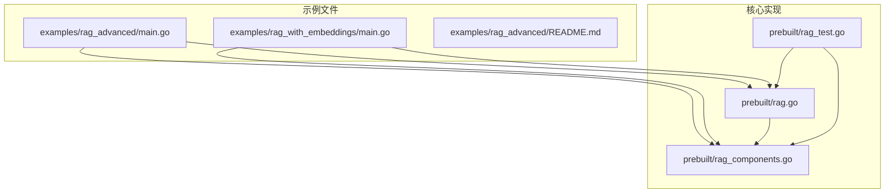
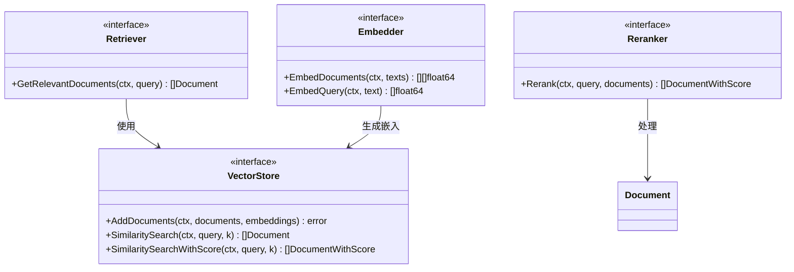
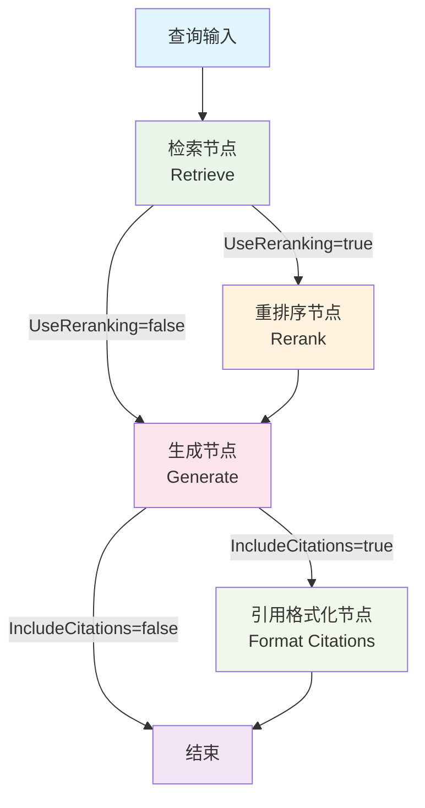
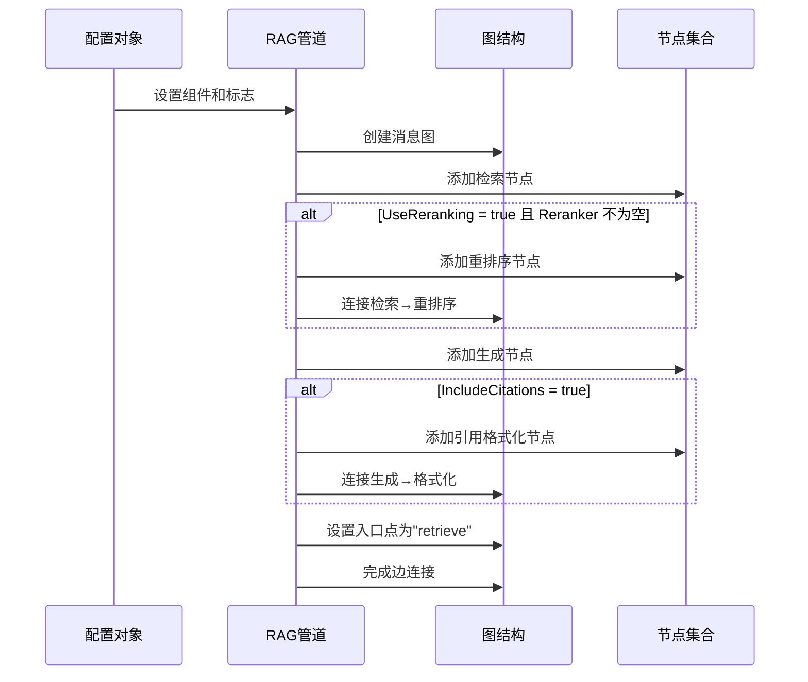
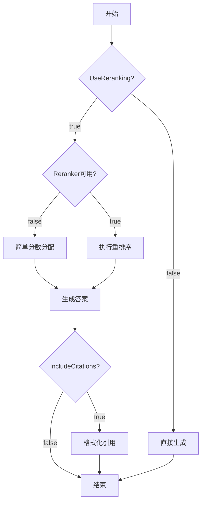
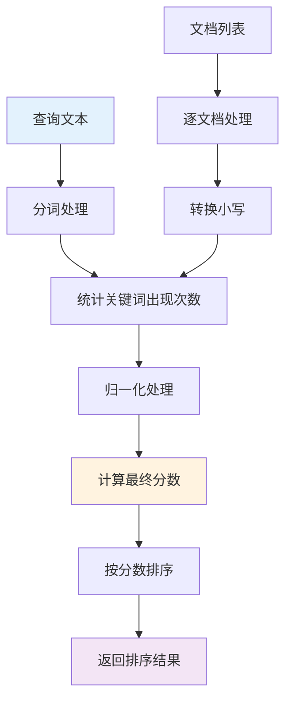
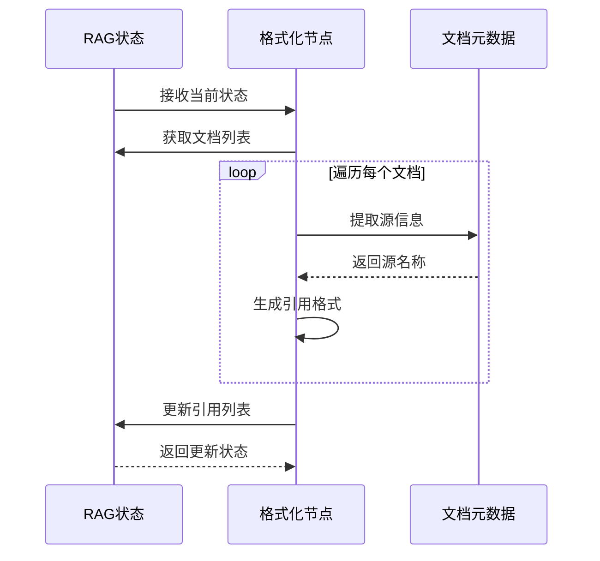
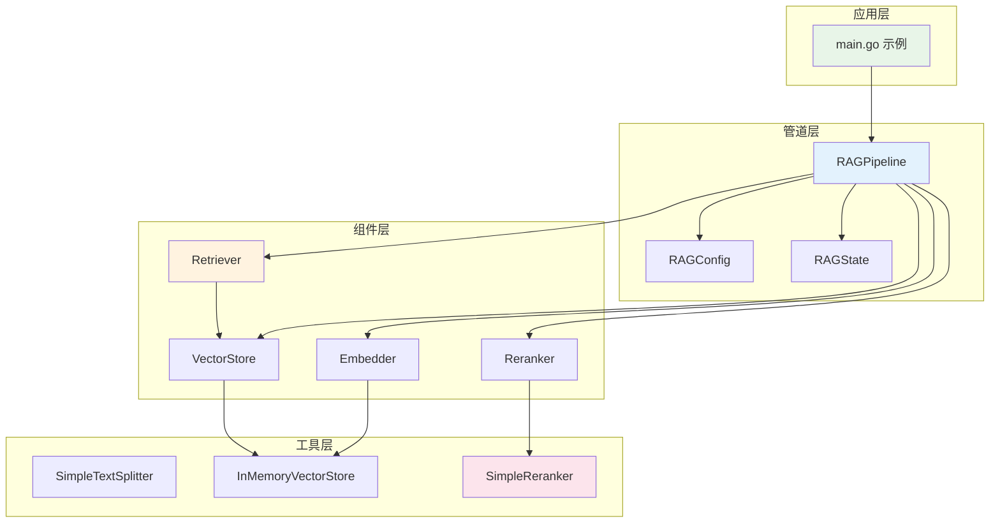

# 高级 RAG 管道详解

<cite>
**本文档中引用的文件**
- [examples/rag_advanced/main.go](file://examples/rag_advanced/main.go)
- [examples/rag_with_embeddings/main.go](file://examples/rag_with_embeddings/main.go)
- [prebuilt/rag.go](file://prebuilt/rag.go)
- [prebuilt/rag_components.go](file://prebuilt/rag_components.go)
- [prebuilt/rag_test.go](file://prebuilt/rag_test.go)
- [examples/rag_advanced/README.md](file://examples/rag_advanced/README.md)
</cite>

## 目录
1. [简介](#简介)
2. [项目结构概览](#项目结构概览)
3. [核心组件分析](#核心组件分析)
4. [架构概览](#架构概览)
5. [详细组件分析](#详细组件分析)
6. [依赖关系分析](#依赖关系分析)
7. [性能考虑](#性能考虑)
8. [故障排除指南](#故障排除指南)
9. [结论](#结论)

## 简介

高级 RAG（检索增强生成）管道是 LangGraphGo 框架中的一个强大功能，它在基础 RAG 流程的基础上增加了可选的重排序（rerank）和引用格式化（format_citations）节点，形成了 "Retrieve -> (Rerank) -> Generate -> (Format Citations)" 的链式处理结构。这种设计特别适用于需要高精度答案和可解释性输出的生产环境。

高级 RAG 管道的核心优势在于：
- **精确的文档检索**：通过重排序机制提高检索质量
- **透明的引用溯源**：自动添加来源引用，增强答案可信度
- **灵活的配置选项**：支持按需启用重排序和引用功能
- **模块化设计**：清晰的节点分离便于维护和扩展

## 项目结构概览

高级 RAG 功能主要分布在以下关键文件中：



**图表来源**
- [examples/rag_advanced/main.go](file://examples/rag_advanced/main.go#L1-L223)
- [prebuilt/rag.go](file://prebuilt/rag.go#L1-L392)
- [prebuilt/rag_components.go](file://prebuilt/rag_components.go#L1-L333)

**章节来源**
- [examples/rag_advanced/main.go](file://examples/rag_advanced/main.go#L1-L223)
- [examples/rag_with_embeddings/main.go](file://examples/rag_with_embeddings/main.go#L1-L290)
- [examples/rag_advanced/README.md](file://examples/rag_advanced/README.md#L1-L74)

## 核心组件分析

### RAG 配置系统

高级 RAG 管道通过 `RAGConfig` 结构体提供灵活的配置选项：

| 配置项 | 类型 | 默认值 | 描述 |
|--------|------|--------|------|
| `TopK` | int | 4 | 检索的文档数量 |
| `ScoreThreshold` | float64 | 0.7 | 重排序相关性阈值 |
| `UseReranking` | bool | false | 是否启用重排序 |
| `UseFallback` | bool | false | 是否启用备用搜索 |
| `IncludeCitations` | bool | true | 是否包含引用 |

### 关键接口定义

系统定义了多个核心接口来支持不同的组件：



**图表来源**
- [prebuilt/rag.go](file://prebuilt/rag.go#L47-L55)
- [prebuilt/rag.go](file://prebuilt/rag.go#L28-L32)
- [prebuilt/rag.go](file://prebuilt/rag.go#L34-L45)

**章节来源**
- [prebuilt/rag.go](file://prebuilt/rag.go#L69-L105)
- [prebuilt/rag.go](file://prebuilt/rag.go#L47-L55)

## 架构概览

高级 RAG 管道采用模块化的图结构设计，支持条件执行路径：



**图表来源**
- [prebuilt/rag.go](file://prebuilt/rag.go#L148-L190)
- [examples/rag_advanced/main.go](file://examples/rag_advanced/main.go#L138-L144)

**章节来源**
- [prebuilt/rag.go](file://prebuilt/rag.go#L148-L190)

## 详细组件分析

### BuildAdvancedRAG 方法

`BuildAdvancedRAG` 是高级 RAG 管道的核心构建方法，它根据配置动态创建处理流程：



**图表来源**
- [prebuilt/rag.go](file://prebuilt/rag.go#L148-L190)

#### 条件路由逻辑

管道根据配置标志智能选择执行路径：



**图表来源**
- [prebuilt/rag.go](file://prebuilt/rag.go#L276-L307)

**章节来源**
- [prebuilt/rag.go](file://prebuilt/rag.go#L148-L190)

### rerankNode 重排序节点

重排序节点是高级 RAG 管道的关键组件，负责对初始检索结果进行更精细的相关性评估：

#### 核心功能特性

1. **智能重排序**：使用指定的 `Reranker` 组件重新评分文档
2. **降级处理**：当没有配置重排序器时，使用简单的顺序分数
3. **状态更新**：更新文档列表和相关性分数

#### SimpleReranker 实现

系统提供了基于关键词匹配的简单重排序实现：



**图表来源**
- [prebuilt/rag_components.go](file://prebuilt/rag_components.go#L206-L261)

#### 重排序算法详解

SimpleReranker 的评分逻辑包括：

1. **关键词计数**：统计查询词在文档中的出现频率
2. **长度归一化**：防止长文档因词汇量大而获得更高分数
3. **分数缩放**：将原始计数乘以 1000 进行标准化

**章节来源**
- [prebuilt/rag.go](file://prebuilt/rag.go#L276-L307)
- [prebuilt/rag_components.go](file://prebuilt/rag_components.go#L206-L261)

### formatCitationsNode 引用格式化节点

引用格式化节点确保答案具有可追溯性和透明度：

#### 功能实现



**图表来源**
- [prebuilt/rag.go](file://prebuilt/rag.go#L356-L371)

#### 引用格式规范

系统采用标准的数字引用格式：
- `[1] 源文件名`
- `[2] 另一个源文件名`
- `[n] 第n个源文件名

这种格式便于用户快速定位信息来源，同时保持输出的整洁性。

**章节来源**
- [prebuilt/rag.go](file://prebuilt/rag.go#L356-L371)

### 配置与使用示例

#### 基本配置模式

```go
// 创建高级 RAG 配置
config := prebuilt.DefaultRAGConfig()
config.Retriever = retriever
config.Reranker = reranker
config.LLM = llm
config.TopK = 5
config.UseReranking = true
config.IncludeCitations = true
config.SystemPrompt = "你是一个知识渊博的人工智能助手..."

// 构建管道
pipeline := prebuilt.NewRAGPipeline(config)
err := pipeline.BuildAdvancedRAG()
```

#### 性能优化配置

对于大规模应用，建议的配置参数：

| 参数 | 推荐值 | 说明 |
|------|--------|------|
| `TopK` | 5-10 | 平衡质量和性能 |
| `ScoreThreshold` | 0.7-0.8 | 高质量阈值 |
| `MaxTokens` | 1000-2000 | 合理的上下文长度 |
| `Temperature` | 0.0-0.3 | 确保一致性 |

**章节来源**
- [examples/rag_advanced/main.go](file://examples/rag_advanced/main.go#L128-L144)

## 依赖关系分析

高级 RAG 管道的依赖关系体现了清晰的分层架构：



**图表来源**
- [examples/rag_advanced/main.go](file://examples/rag_advanced/main.go#L1-L223)
- [prebuilt/rag.go](file://prebuilt/rag.go#L1-L392)
- [prebuilt/rag_components.go](file://prebuilt/rag_components.go#L1-L333)

**章节来源**
- [examples/rag_advanced/main.go](file://examples/rag_advanced/main.go#L1-L223)
- [prebuilt/rag.go](file://prebuilt/rag.go#L1-L392)

## 性能考虑

### 检索效率优化

1. **向量相似度计算**：使用余弦相似度进行高效的向量比较
2. **批量处理**：支持批量生成嵌入以提高吞吐量
3. **缓存策略**：合理利用嵌入缓存减少重复计算

### 重排序性能

SimpleReranker 的时间复杂度为 O(n*m)，其中 n 是文档数量，m 是查询词数量。对于大规模文档集，可以考虑：

- 使用更复杂的交叉编码器模型
- 实现并行处理机制
- 添加预过滤步骤

### 内存管理

- 控制 TopK 参数避免过多内存占用
- 及时清理临时状态数据
- 考虑流式处理大型文档集合

## 故障排除指南

### 常见问题及解决方案

#### 1. 重排序效果不佳

**症状**：重排序后文档顺序没有明显改善
**原因**：SimpleReranker 对于复杂查询可能不够敏感
**解决方案**：
- 替换为更高级的重排序模型
- 调整关键词匹配策略
- 增加查询扩展机制

#### 2. 引用格式不正确

**症状**：生成的答案缺少引用或格式错误
**原因**：文档元数据缺失或格式化逻辑问题
**解决方案**：
- 确保文档包含完整的元数据
- 检查 formatCitationsNode 的实现
- 验证文档列表的完整性

#### 3. 性能瓶颈

**症状**：处理速度缓慢
**原因**：向量计算或重排序开销过大
**解决方案**：
- 优化嵌入模型选择
- 减少 TopK 数量
- 实现异步处理机制

**章节来源**
- [prebuilt/rag.go](file://prebuilt/rag.go#L276-L307)
- [prebuilt/rag.go](file://prebuilt/rag.go#L356-L371)

## 结论

高级 RAG 管道通过引入重排序和引用格式化功能，显著提升了 RAG 系统的质量和可解释性。其模块化的设计使得开发者可以根据具体需求灵活配置各个组件，既保证了系统的功能性，又维持了良好的可维护性。

### 主要优势

1. **质量提升**：重排序机制有效提高了检索相关性
2. **透明度增强**：自动引用功能增强了答案的可信度
3. **灵活性高**：可配置的组件允许针对不同场景优化
4. **易于集成**：清晰的接口设计便于与其他系统集成

### 应用场景

- **企业知识库**：需要准确答案和可追溯性的场景
- **教育平台**：要求透明学习资源的系统
- **客服系统**：需要事实依据的自动回答
- **研究辅助**：需要引用来源的研究工具

通过合理配置和优化，高级 RAG 管道能够为各种应用场景提供高质量的检索增强生成服务，是构建现代智能问答系统的重要基础设施。