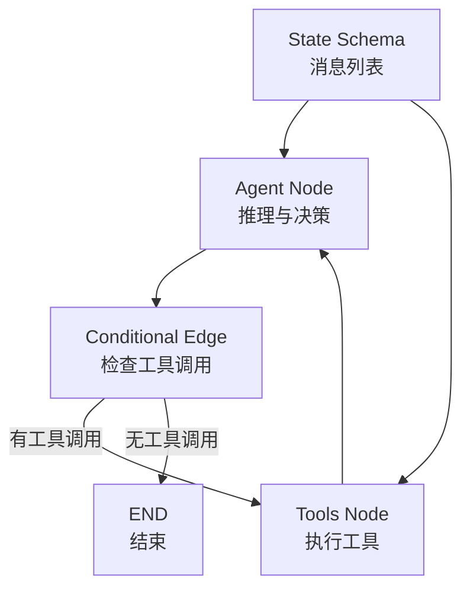
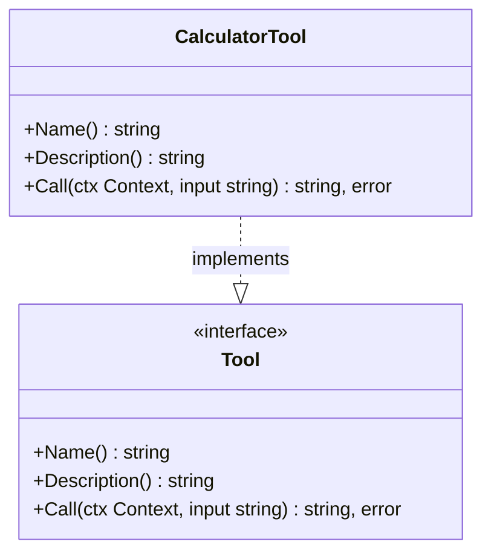
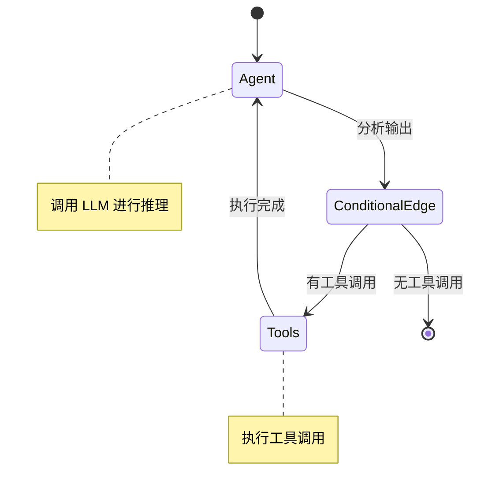
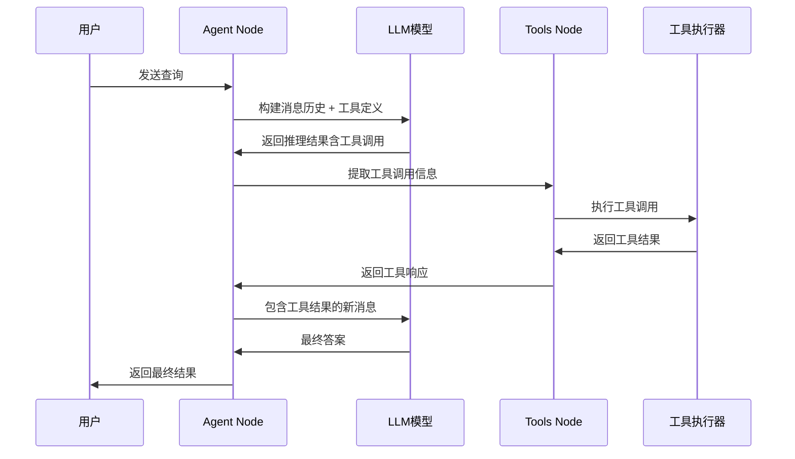
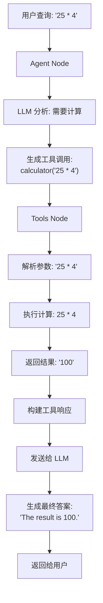
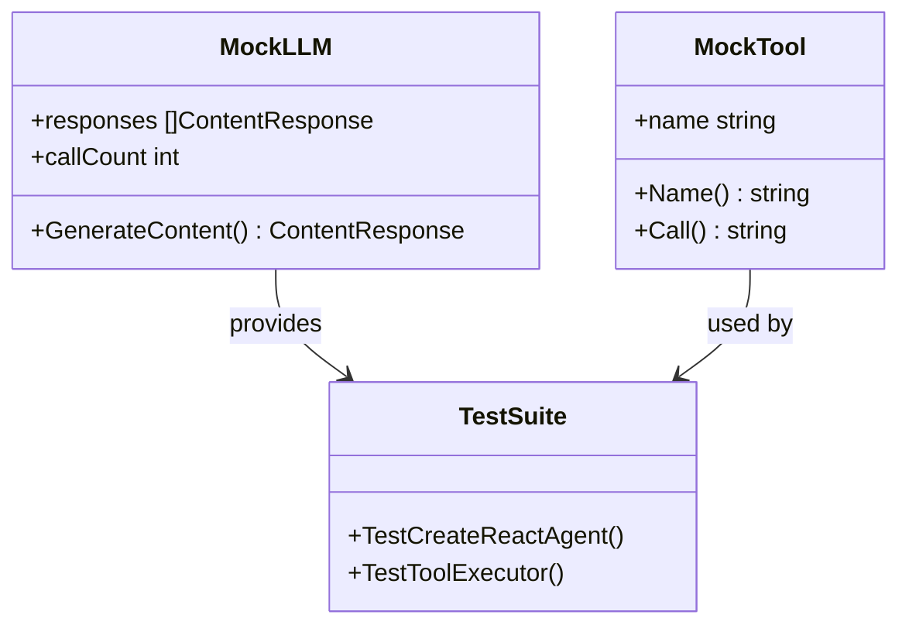

# ReAct Agent

<cite>
**本文档中引用的文件**
- [prebuilt/react_agent.go](file://prebuilt/react_agent.go)
- [examples/react_agent/main.go](file://examples/react_agent/main.go)
- [prebuilt/tool_executor.go](file://prebuilt/tool_executor.go)
- [prebuilt/tool_node.go](file://prebuilt/tool_node.go)
- [prebuilt/react_agent_test.go](file://prebuilt/react_agent_test.go)
- [prebuilt/tool_executor_test.go](file://prebuilt/tool_executor_test.go)
- [examples/react_agent/README.md](file://examples/react_agent/README.md)
- [graph/state_graph.go](file://graph/state_graph.go)
</cite>

## 目录
1. [简介](#简介)
2. [ReAct 模式核心概念](#react-模式核心概念)
3. [CreateReactAgent 函数详解](#createreactagent-函数详解)
4. [工具接口设计](#工具接口设计)
5. [状态图架构](#状态图架构)
6. [执行流程分析](#执行流程分析)
7. [具体实现示例](#具体实现示例)
8. [测试与验证](#测试与验证)
9. [性能考虑](#性能考虑)
10. [故障排除指南](#故障排除指南)
11. [总结](#总结)

## 简介

`prebuilt.CreateReactAgent` 是 LangGraphGo 中预构建的 ReAct（推理与行动）智能代理工厂函数。ReAct 模式是一种强大的人工智能代理构建范式，它通过循环进行推理（Reasoning）、行动（Acting）、观察（Observing）来解决复杂问题。该函数自动构建一个包含 'agent' 节点和 'tools' 节点的状态图，并设置条件边来判断 LLM 的输出是否包含工具调用。

ReAct 模式的核心思想是让语言模型不仅能够生成文本响应，还能主动调用外部工具来获取信息或执行操作。这种模式特别适用于需要结合知识检索、计算、数据处理等能力的复杂应用场景。

## ReAct 模式核心概念

### 核心循环机制

ReAct 模式遵循以下四步循环：

1. **推理（Reasoning）**：模型分析当前状态和可用工具，决定下一步行动
2. **行动（Acting）**：调用适当的工具来获取更多信息或执行特定任务
3. **观察（Observing）**：接收工具执行结果作为新的输入状态
4. **重复**：根据新状态重新开始推理过程，直到达到终止条件

### 关键特性

- **自适应决策**：模型根据当前上下文动态选择工具和参数
- **模块化设计**：工具可以独立开发和测试
- **状态管理**：维护对话历史和中间结果
- **错误处理**：优雅处理工具调用失败的情况

## CreateReactAgent 函数详解

### 函数签名

```go
func CreateReactAgent(model llms.Model, inputTools []tools.Tool) (*graph.StateRunnable, error)
```

### 参数说明

- **model**：实现了 `llms.Model` 接口的语言模型实例
- **inputTools**：工具列表，每个工具都必须实现 `tools.Tool` 接口

### 返回值

- **StateRunnable**：编译后的状态图运行器，可用于执行代理
- **error**：如果创建过程中发生错误，则返回相应的错误信息

### 内部架构

函数内部构建了一个状态图，包含以下关键组件：



**图表来源**
- [prebuilt/react_agent.go](file://prebuilt/react_agent.go#L14-L182)

**节来源**
- [prebuilt/react_agent.go](file://prebuilt/react_agent.go#L14-L182)

## 工具接口设计

### Tool 接口规范

所有工具必须实现 `tools.Tool` 接口：

```go
type Tool interface {
    Name() string           // 工具名称
    Description() string    // 工具描述
    Call(ctx context.Context, input string) (string, error)  // 执行方法
}
```

### CalculatorTool 实现示例

以计算器工具为例，展示了如何实现工具接口：



**图表来源**
- [examples/react_agent/main.go](file://examples/react_agent/main.go#L17-L64)

### 工具定义要素

1. **Name()**：返回工具的唯一标识符
2. **Description()**：提供工具功能的详细描述，用于 LLM 决策
3. **Call()**：执行工具逻辑，处理输入并返回结果

**节来源**
- [examples/react_agent/main.go](file://examples/react_agent/main.go#L17-L64)

## 状态图架构

### 图结构设计

ReAct Agent 使用状态图来管理执行流程：



**图表来源**
- [prebuilt/react_agent.go](file://prebuilt/react_agent.go#L157-L178)

### 节点类型

1. **Agent Node**：负责调用 LLM 进行推理和决策
2. **Tools Node**：执行 LLM 请求的工具调用
3. **Conditional Edge**：根据 LLM 输出决定流向

### 边条件

条件边的逻辑非常简单：
- 如果 LLM 输出包含工具调用 → 路由到 Tools Node
- 否则 → 结束执行

**节来源**
- [prebuilt/react_agent.go](file://prebuilt/react_agent.go#L157-L178)

## 执行流程分析

### 完整执行序列



**图表来源**
- [prebuilt/react_agent.go](file://prebuilt/react_agent.go#L28-L179)

### Agent Node 处理逻辑

Agent Node 的核心处理包括：

1. **消息解析**：从状态中提取对话历史
2. **工具定义转换**：将工具列表转换为 LLM 可理解的格式
3. **LLM 调用**：使用工具定义调用语言模型
4. **结果封装**：将 LLM 响应封装为消息格式

### Tools Node 处理逻辑

Tools Node 的处理步骤：

1. **消息验证**：确保最后一条消息来自 AI
2. **工具调用解析**：提取工具调用信息
3. **参数提取**：从 JSON 参数中获取输入
4. **工具执行**：调用工具执行器
5. **响应构建**：创建工具响应消息

**节来源**
- [prebuilt/react_agent.go](file://prebuilt/react_agent.go#L28-L179)

## 具体实现示例

### 基础计算器工具

以下是计算器工具的具体实现：



**图表来源**
- [examples/react_agent/main.go](file://examples/react_agent/main.go#L66-L122)

### 工具注册与配置

工具的注册过程：

1. **工具列表创建**：将所有工具添加到切片中
2. **工具映射构建**：创建工具名称到工具实例的映射
3. **执行器初始化**：创建工具执行器实例

### 状态管理

状态图使用消息列表来维护对话历史：

- **messages 键**：存储所有消息内容
- **消息类型**：支持人类消息、AI 消息、工具消息
- **消息格式**：统一的消息内容结构

**节来源**
- [examples/react_agent/main.go](file://examples/react_agent/main.go#L66-L122)

## 测试与验证

### 单元测试结构

测试采用模拟对象模式：



**图表来源**
- [prebuilt/react_agent_test.go](file://prebuilt/react_agent_test.go#L12-L35)
- [prebuilt/tool_executor_test.go](file://prebuilt/tool_executor_test.go#L11-L26)

### 测试场景

1. **正常流程测试**：验证工具调用和结果返回
2. **错误处理测试**：测试工具执行失败的情况
3. **边界条件测试**：测试空输入、无效参数等情况

### 验证要点

- **消息数量验证**：确保包含用户消息、AI 消息、工具消息和最终答案
- **消息角色验证**：确认每条消息的角色正确
- **工具响应验证**：检查工具调用和返回结果
- **最终答案验证**：确认 LLM 生成了正确的最终回答

**节来源**
- [prebuilt/react_agent_test.go](file://prebuilt/react_agent_test.go#L35-L115)
- [prebuilt/tool_executor_test.go](file://prebuilt/tool_executor_test.go#L28-L55)

## 性能考虑

### 并发处理

虽然当前实现是顺序执行工具调用，但架构支持并发扩展：

- **并行节点**：可以在工具节点中实现并行执行
- **异步处理**：工具调用可以异步执行
- **超时控制**：为长时间运行的工具设置超时

### 内存优化

- **状态压缩**：定期清理旧的消息记录
- **流式处理**：对于大型工具输出，考虑流式处理
- **缓存策略**：对频繁使用的工具结果进行缓存

### 错误恢复

- **重试机制**：为工具调用添加重试逻辑
- **降级策略**：当工具不可用时提供备选方案
- **状态回滚**：在错误情况下恢复到安全状态

## 故障排除指南

### 常见问题

1. **工具未找到错误**
   - 检查工具名称拼写
   - 确认工具已正确注册到工具映射中

2. **LLM 调用失败**
   - 验证 API 密钥配置
   - 检查网络连接
   - 确认模型参数设置

3. **状态格式错误**
   - 确保初始状态包含正确的 messages 键
   - 验证消息格式符合要求

### 调试技巧

- **日志记录**：在关键节点添加调试日志
- **状态检查**：定期打印状态内容进行验证
- **单元测试**：为每个组件编写独立的测试用例

### 性能监控

- **执行时间**：监控各节点的执行时间
- **错误率**：跟踪工具调用的成功率
- **资源使用**：监控内存和 CPU 使用情况

## 总结

`prebuilt.CreateReactAgent` 提供了一个强大而灵活的 ReAct 智能代理框架。通过自动构建状态图、处理工具调用和管理执行流程，它大大简化了复杂 AI 应用的开发过程。

### 主要优势

1. **自动化程度高**：无需手动构建复杂的执行图
2. **模块化设计**：工具可以独立开发和测试
3. **状态管理完善**：自动处理对话历史和中间结果
4. **扩展性强**：支持多种工具和自定义逻辑

### 应用场景

- **智能客服系统**：结合知识库和计算工具
- **数据分析平台**：集成各种数据处理工具
- **自动化工作流**：构建复杂的业务流程
- **研究辅助工具**：整合文献检索和分析功能

ReAct 模式代表了 AI 代理发展的重要方向，通过将推理能力与工具调用相结合，能够解决传统语言模型难以处理的复杂任务。`CreateReactAgent` 函数为开发者提供了一个开箱即用的解决方案，使得构建高质量的智能代理变得更加简单和高效。