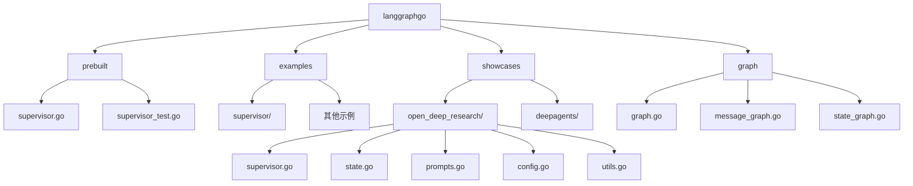
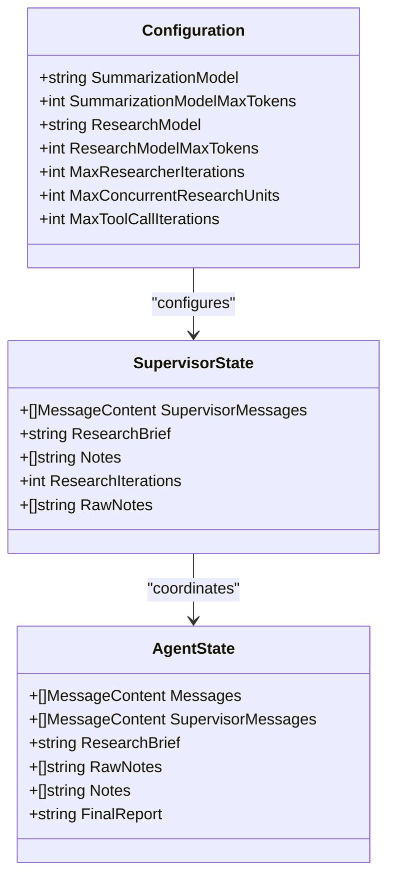
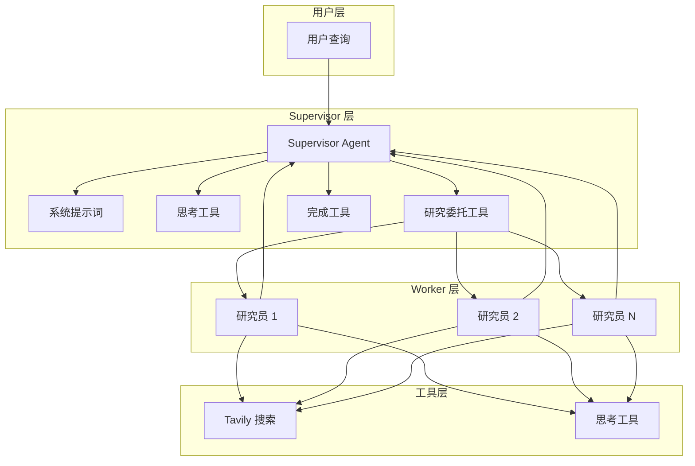
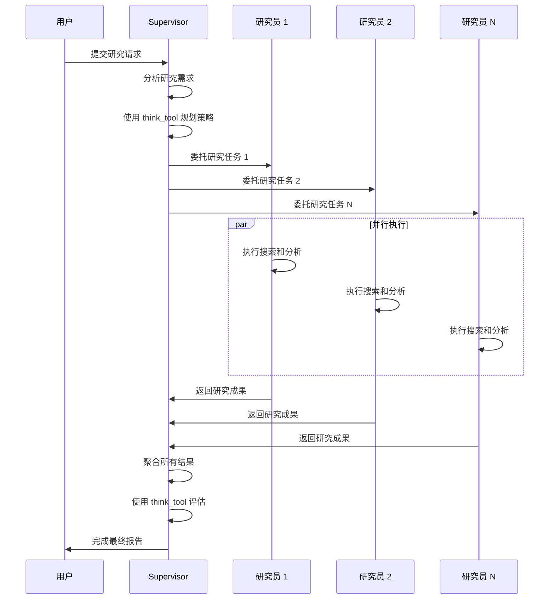
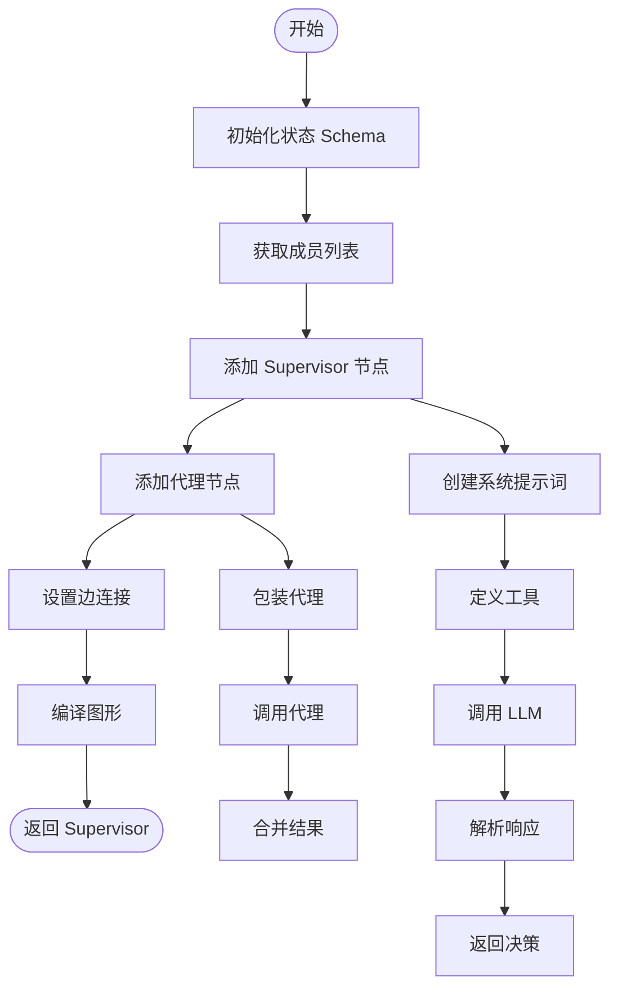
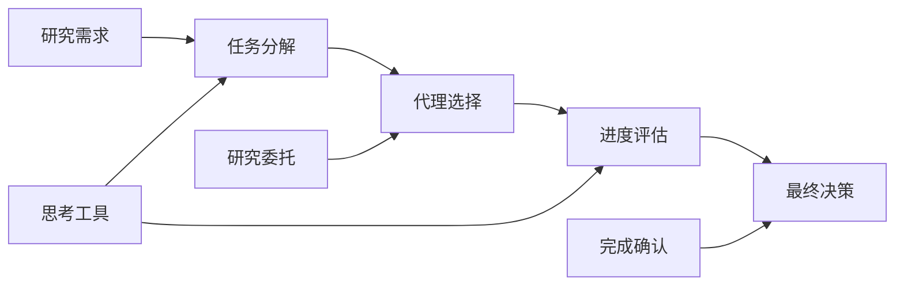
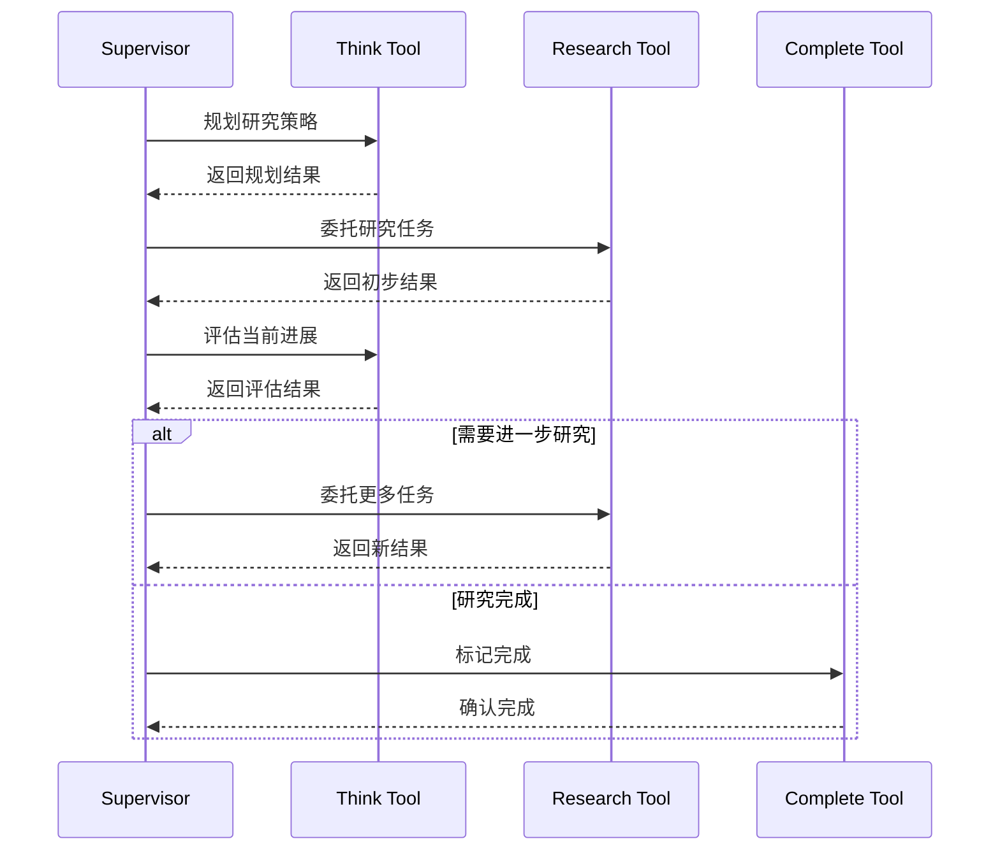
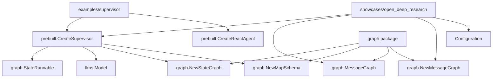

# Supervisor 组件全面文档

<cite>
**本文档中引用的文件**
- [prebuilt/supervisor.go](file://prebuilt/supervisor.go)
- [examples/supervisor/main.go](file://examples/supervisor/main.go)
- [showcases/open_deep_research/supervisor.go](file://showcases/open_deep_research/supervisor.go)
- [showcases/open_deep_research/state.go](file://showcases/open_deep_research/state.go)
- [showcases/open_deep_research/prompts.go](file://showcases/open_deep_research/prompts.go)
- [showcases/open_deep_research/config.go](file://showcases/open_deep_research/config.go)
- [showcases/open_deep_research/utils.go](file://showcases/open_deep_research/utils.go)
- [examples/supervisor/README.md](file://examples/supervisor/README.md)
- [showcases/open_deep_research/README.md](file://showcases/open_deep_research/README.md)
- [prebuilt/supervisor_test.go](file://prebuilt/supervisor_test.go)
</cite>

## 目录
1. [简介](#简介)
2. [项目结构](#项目结构)
3. [核心组件](#核心组件)
4. [架构概览](#架构概览)
5. [详细组件分析](#详细组件分析)
6. [依赖关系分析](#依赖关系分析)
7. [性能考虑](#性能考虑)
8. [故障排除指南](#故障排除指南)
9. [结论](#结论)

## 简介

`prebuilt.CreateSupervisor` 是一个强大的多代理协调组件，用于构建复杂的多智能体协作系统。该组件实现了经典的 Supervisor 模式，其中中央的 Supervisor 代理负责接收任务、将任务路由给专门的 Worker 代理、收集结果并决定下一步操作或结束工作流。

Supervisor 模式的核心思想是通过中央协调器来管理多个专业化的代理，每个代理专注于特定的任务领域，从而实现高效、可扩展的多智能体系统。

## 项目结构

该项目采用模块化设计，主要包含以下关键目录：

**图表来源**
- [prebuilt/supervisor.go](file://prebuilt/supervisor.go#L1-L153)
- [showcases/open_deep_research/supervisor.go](file://showcases/open_deep_research/supervisor.go#L1-L331)

**章节来源**
- [examples/supervisor/README.md](file://examples/supervisor/README.md#L1-L16)
- [showcases/open_deep_research/README.md](file://showcases/open_deep_research/README.md#L1-L190)

## 核心组件

### Supervisor 组件的核心功能

1. **任务分发**: 将用户请求分解为可执行的研究任务
2. **代理协调**: 管理多个研究代理的并发执行
3. **进度监控**: 跟踪研究进度并做出决策
4. **结果聚合**: 收集所有代理的研究成果
5. **迭代控制**: 实现最大迭代次数限制

### 主要数据结构

**图表来源**
- [showcases/open_deep_research/state.go](file://showcases/open_deep_research/state.go#L44-L77)
- [showcases/open_deep_research/config.go](file://showcases/open_deep_research/config.go#L8-L29)

**章节来源**
- [showcases/open_deep_research/state.go](file://showcases/open_deep_research/state.go#L1-L77)
- [showcases/open_deep_research/config.go](file://showcases/open_deep_research/config.go#L1-L72)

## 架构概览

### Supervisor 模式架构

**图表来源**
- [showcases/open_deep_research/supervisor.go](file://showcases/open_deep_research/supervisor.go#L14-L331)
- [showcases/open_deep_research/prompts.go](file://showcases/open_deep_research/prompts.go#L8-L168)

### 工作流程

**图表来源**
- [showcases/open_deep_research/supervisor.go](file://showcases/open_deep_research/supervisor.go#L159-L300)
- [showcases/open_deep_research/utils.go](file://showcases/open_deep_research/utils.go#L100-L116)

## 详细组件分析

### CreateSupervisor 函数

`CreateSupervisor` 是核心的工厂函数，负责创建和配置 Supervisor 图形。

#### 主要功能特性

1. **状态管理**: 使用 MapSchema 和 AppendReducer 来管理消息历史
2. **动态路由**: 基于 LLM 决策的动态任务分配
3. **条件边**: 实现基于返回值的流程控制
4. **循环检测**: 防止无限循环的机制

#### 核心实现逻辑

**图表来源**
- [prebuilt/supervisor.go](file://prebuilt/supervisor.go#L14-L152)

**章节来源**
- [prebuilt/supervisor.go](file://prebuilt/supervisor.go#L1-L153)

### 开放深度研究示例

#### Supervisor 图形实现

开放深度研究示例展示了更复杂和功能完整的 Supervisor 实现：

1. **多状态支持**: 区分 supervisor_messages、notes、raw_notes 等不同状态
2. **迭代控制**: 实现最大迭代次数限制
3. **并行执行**: 支持多个研究任务同时进行
4. **错误处理**: 完善的错误处理和超时控制

#### 关键特性

| 特性 | 描述 | 实现方式 |
|------|------|----------|
| 最大迭代限制 | 防止无限循环 | 检查 research_iterations 计数 |
| 并发控制 | 限制同时运行的研究任务 | 使用 MaxConcurrentResearchUnits |
| 错误恢复 | 处理单个研究任务失败 | 返回错误消息而非中断整个流程 |
| 结果压缩 | 将原始笔记压缩为摘要 | 使用专门的压缩模型 |

**章节来源**
- [showcases/open_deep_research/supervisor.go](file://showcases/open_deep_research/supervisor.go#L1-L331)

### 系统提示词设计

#### Supervisor 提示词模板

系统提示词是 Supervisor 智能决策的基础：

**图表来源**
- [showcases/open_deep_research/prompts.go](file://showcases/open_deep_research/prompts.go#L8-L70)

#### 研究员提示词设计

研究员使用专门的提示词来指导他们的搜索行为：

1. **搜索策略**: 从宽泛到具体的搜索方法
2. **反思机制**: 使用 think_tool 进行过程反思
3. **质量优先**: 强调高质量而非数量的原则
4. **预算控制**: 限制工具调用次数防止过度搜索

**章节来源**
- [showcases/open_deep_research/prompts.go](file://showcases/open_deep_research/prompts.go#L72-L168)

### 配置管理系统

#### 可配置参数

| 参数类别 | 参数名 | 默认值 | 描述 |
|----------|--------|--------|------|
| 模型配置 | ResearchModel | deepseek-v3 | 研究任务使用的模型 |
| 模型配置 | CompressionModel | deepseek-v3 | 压缩模型 |
| 模型配置 | FinalReportModel | deepseek-v3 | 最终报告模型 |
| 研究参数 | MaxResearcherIterations | 10 | 最大研究迭代次数 |
| 研究参数 | MaxConcurrentResearchUnits | 3 | 最大并发研究单元 |
| 研究参数 | MaxToolCallIterations | 20 | 每个研究员的最大工具调用次数 |

**章节来源**
- [showcases/open_deep_research/config.go](file://showcases/open_deep_research/config.go#L31-L72)

### 工具集成

#### 主要工具类型

1. **思考工具 (think_tool)**: 用于战略规划和进度反思
2. **研究委托工具 (ConductResearch)**: 创建新的研究任务
3. **完成工具 (ResearchComplete)**: 标记研究完成

#### 工具调用模式

**图表来源**
- [showcases/open_deep_research/supervisor.go](file://showcases/open_deep_research/supervisor.go#L159-L300)
- [showcases/open_deep_research/utils.go](file://showcases/open_deep_research/utils.go#L100-L116)

**章节来源**
- [showcases/open_deep_research/utils.go](file://showcases/open_deep_research/utils.go#L1-L250)

## 依赖关系分析

### 核心依赖图

**图表来源**
- [prebuilt/supervisor.go](file://prebuilt/supervisor.go#L1-L153)
- [examples/supervisor/main.go](file://examples/supervisor/main.go#L1-L138)
- [showcases/open_deep_research/supervisor.go](file://showcases/open_deep_research/supervisor.go#L1-L331)

### 测试覆盖

测试套件涵盖了 Supervisor 的核心功能：

1. **基本功能测试**: 验证 Supervisor 能正确路由到不同的代理
2. **状态管理测试**: 确保消息历史正确维护
3. **边界情况测试**: 处理空输入和异常情况
4. **并发测试**: 验证多代理并发执行的正确性

**章节来源**
- [prebuilt/supervisor_test.go](file://prebuilt/supervisor_test.go#L1-L129)

## 性能考虑

### 并发优化

1. **并行研究**: 支持最多 MaxConcurrentResearchUnits 个研究任务同时进行
2. **异步执行**: 使用 goroutine 实现非阻塞的代理调用
3. **资源限制**: 通过配置参数控制资源消耗

### 内存管理

1. **状态压缩**: 定期压缩研究笔记以减少内存占用
2. **迭代限制**: 防止因无限迭代导致的内存泄漏
3. **结果缓存**: 合理缓存中间结果避免重复计算

### API 调用优化

1. **批量处理**: 尽可能批量处理工具调用
2. **错误重试**: 实现指数退避的重试机制
3. **超时控制**: 设置合理的超时时间防止长时间等待

## 故障排除指南

### 常见问题及解决方案

#### 1. API 密钥配置错误

**症状**: `OPENAI_API_KEY not set` 或 `TAVILY_API_KEY not set`
**解决方案**: 
- 设置环境变量 `OPENAI_API_KEY`
- 设置环境变量 `TAVILY_API_KEY`
- 验证 API 密钥的有效性

#### 2. 研究结果为空

**症状**: 最终报告内容不足或为空
**解决方案**:
- 检查 Tavily API 密钥是否有效
- 验证查询是否清晰具体
- 增加迭代限制（MAX_RESEARCHER_ITERATIONS）

#### 3. 并发限制问题

**症状**: 研究任务被拒绝执行
**解决方案**:
- 减少 `MAX_CONCURRENT_RESEARCH_UNITS`
- 降低 `MAX_RESEARCHER_ITERATIONS`
- 使用不同模型层级

#### 4. 超时问题

**症状**: 程序运行时间过长或卡住
**解决方案**:
- 设置适当的上下文超时
- 检查网络连接稳定性
- 优化查询策略减少 API 调用

### 调试技巧

1. **日志记录**: 启用详细的日志输出跟踪执行过程
2. **状态检查**: 定期检查中间状态验证流程正确性
3. **逐步测试**: 从简单的查询开始逐步增加复杂度
4. **参数调整**: 根据实际效果调整配置参数

**章节来源**
- [showcases/open_deep_research/README.md](file://showcases/open_deep_research/README.md#L160-L180)

## 结论

`prebuilt.CreateSupervisor` 组件是一个功能强大且灵活的多代理协调系统，它成功地实现了 Supervisor 模式的精髓：

### 主要优势

1. **模块化设计**: 清晰的职责分离和可扩展的架构
2. **智能决策**: 基于 LLM 的动态任务分配和流程控制
3. **并发处理**: 高效的并行任务执行能力
4. **容错机制**: 完善的错误处理和恢复策略
5. **配置灵活**: 丰富的配置选项适应不同场景需求

### 应用场景

1. **复杂研究任务**: 多维度、跨领域的综合研究
2. **数据分析**: 大规模数据收集和分析
3. **内容创作**: 多角度、多层次的内容生成
4. **客户服务**: 复杂问题的分层解决

### 发展方向

1. **智能优化**: 基于历史数据的自动参数优化
2. **知识图谱**: 集成知识图谱提升决策质量
3. **实时协作**: 支持多人实时协作研究
4. **领域专业化**: 针对特定领域的定制化优化

通过深入理解和合理应用 `prebuilt.CreateSupervisor` 组件，开发者可以构建出高效、智能的多智能体协作系统，为复杂的业务场景提供创新的解决方案。